# 60分钟缠论图表组件

<cite>
**本文档引用的文件**
- [HourlyChanChart.tsx](file://frontend/src/HourlyChanChart.tsx)
- [DailyChanChart.tsx](file://frontend/src/DailyChanChart.tsx)
- [hourlyBuySellSignals.ts](file://frontend/src/hourlyBuySellSignals.ts)
- [App.tsx](file://frontend/src/App.tsx)
- [stock.ts](file://frontend/src/api/stock.ts)
- [chartMacd.ts](file://frontend/src/chartMacd.ts)
- [bollSeries.ts](file://frontend/src/bollSeries.ts)
- [DefenseAlertBrief.tsx](file://frontend/src/DefenseAlertBrief.tsx)
- [buy_sell_signals.py](file://backend/services/buy_sell_signals.py)
- [indicators.py](file://backend/services/indicators.py)
- [first_buy_point.py](file://backend/services/first_buy_point.py)
</cite>

## 更新摘要
**所做更改**
- 更新了实时买卖信号处理和可视化能力的相关章节
- 增强了信号互斥锁和状态机机制的说明
- 完善了跨级别风控和日线破位降级机制
- 优化了三买共振和信号失效检查的实现细节

## 目录
1. [简介](#简介)
2. [项目结构](#项目结构)
3. [核心组件](#核心组件)
4. [架构概览](#架构概览)
5. [详细组件分析](#详细组件分析)
6. [依赖关系分析](#依赖关系分析)
7. [性能考虑](#性能考虑)
8. [故障排查指南](#故障排查指南)
9. [结论](#结论)

## 简介

HourlyChanChart 是一个专门用于展示60分钟级别缠论技术分析的React组件。该组件基于ECharts图表库，提供了丰富的技术分析功能，包括中枢分析、笔线段绘制、买卖信号识别、背驰分析等。

该组件与日线图表组件形成完整的双级别分析体系，通过共享数据源和状态管理，实现了60分钟与日线级别的协同分析。组件支持多种技术指标显示，包括MACD、布林带等，并提供了完整的买卖信号自检功能。

**更新** 基于最新的代码变更，组件现在具备更完善的实时买卖信号处理能力和可视化展示功能，包括信号互斥锁、状态机机制和跨级别风控等高级功能。

## 项目结构

前端项目采用模块化架构，主要文件组织如下：

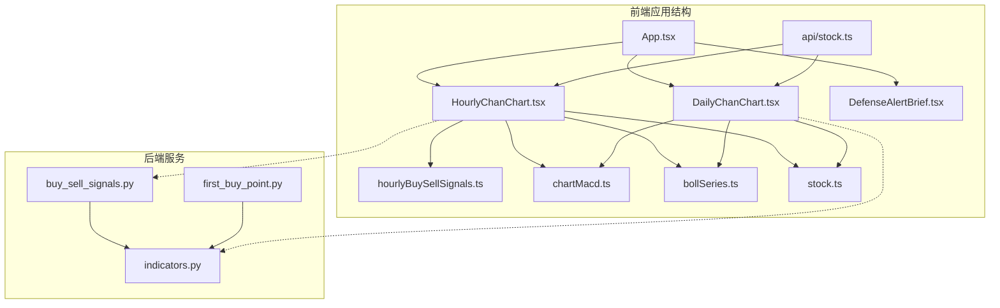

**图表来源**
- [App.tsx:598-800](file://frontend/src/App.tsx#L598-L800)
- [HourlyChanChart.tsx:179-200](file://frontend/src/HourlyChanChart.tsx#L179-L200)
- [DailyChanChart.tsx:161-183](file://frontend/src/DailyChanChart.tsx#L161-L183)

**章节来源**
- [App.tsx:598-800](file://frontend/src/App.tsx#L598-L800)
- [HourlyChanChart.tsx:179-200](file://frontend/src/HourlyChanChart.tsx#L179-L200)

## 核心组件

### HourlyChanChart 组件架构

HourlyChanChart 组件是60分钟级别缠论分析的核心，具有以下关键特性：

#### 数据结构与类型定义

组件接收标准化的指数K线数据，包含完整的缠论分析所需信息：

- **K线数据**: 开盘、收盘、最高、最低价格序列
- **技术指标**: MACD、布林带、KDJ等指标数据
- **缠论结构**: 分型、笔、线段、中枢等分析结果
- **买卖信号**: 前端自检和后端计算的信号状态

#### 核心功能模块

1. **中枢分析系统**
   - 多级别中枢识别（A、B、C中枢）
   - 中枢边界线绘制和颜色编码
   - 潜在背驰标记

2. **笔线段可视化**
   - 有效笔线段绘制
   - 线段转折点标记
   - 笔方向指示

3. **买卖信号识别**
   - 一买、二买、三买信号
   - 一卖、二卖、三卖信号
   - 信号自检和过滤机制

4. **技术指标集成**
   - MACD柱状图和轨迹线
   - 布林带通道显示
   - 背驰箭头标记

**更新** 组件现在集成了更复杂的信号处理逻辑，包括信号互斥锁、状态机机制和实时失效检查等功能。

**章节来源**
- [HourlyChanChart.tsx:179-200](file://frontend/src/HourlyChanChart.tsx#L179-L200)
- [stock.ts:69-112](file://frontend/src/api/stock.ts#L69-L112)

## 架构概览

### 组件间协作关系

HourlyChanChart 与相关组件形成了完整的分析生态系统：

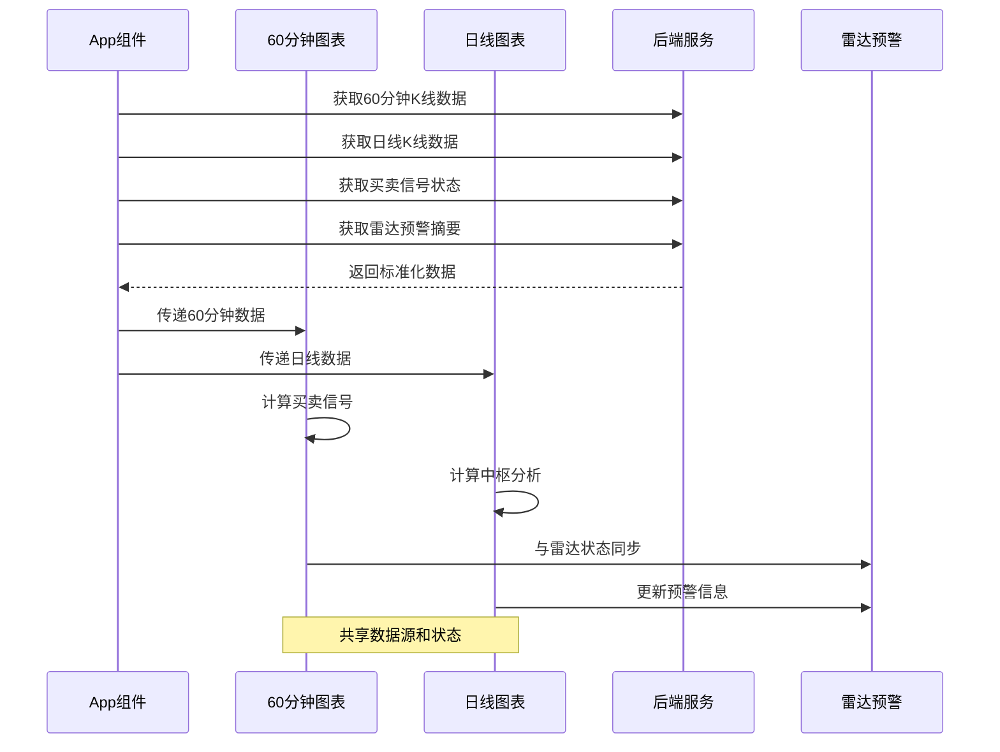

**图表来源**
- [App.tsx:598-750](file://frontend/src/App.tsx#L598-L750)
- [buy_sell_signals.py:581-790](file://backend/services/buy_sell_signals.py#L581-L790)

### 数据流架构

组件间的数据流向体现了清晰的职责分离：

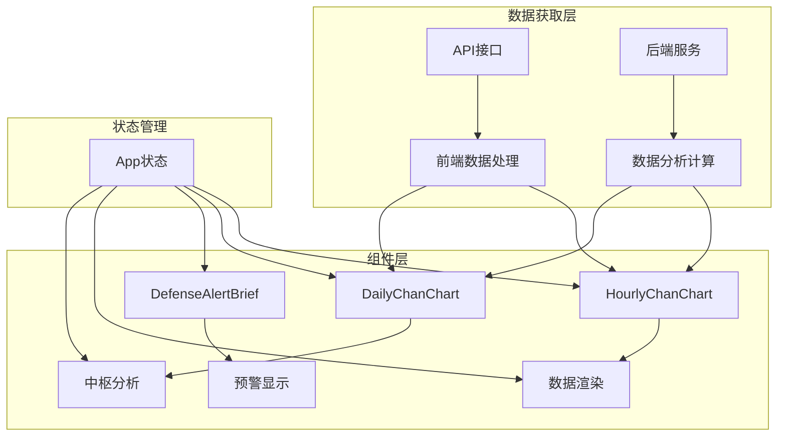

**图表来源**
- [stock.ts:185-215](file://frontend/src/api/stock.ts#L185-L215)
- [indicators.py:359-444](file://backend/services/indicators.py#L359-L444)

**章节来源**
- [App.tsx:598-750](file://frontend/src/App.tsx#L598-L750)
- [stock.ts:185-215](file://frontend/src/api/stock.ts#L185-L215)

## 详细组件分析

### HourlyChanChart 核心实现

#### 买卖信号自检系统

组件实现了完整的买卖信号自检功能，确保信号的准确性和可靠性：

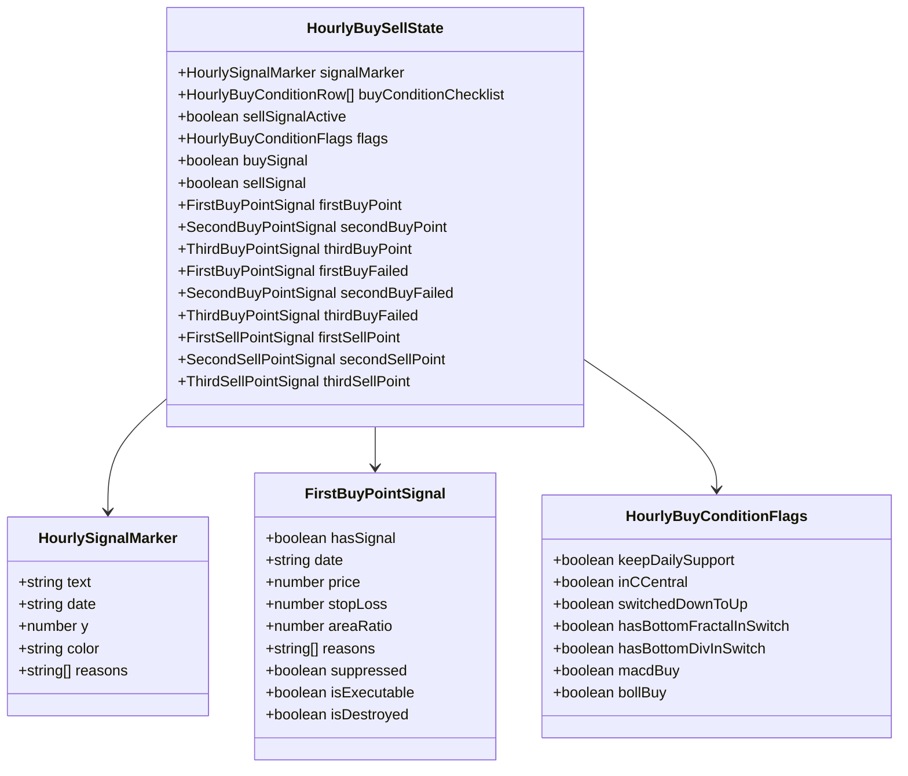

**图表来源**
- [hourlyBuySellSignals.ts:103-148](file://frontend/src/hourlyBuySellSignals.ts#L103-L148)

#### 中枢分析与可视化

组件提供了多层次的中枢分析功能：

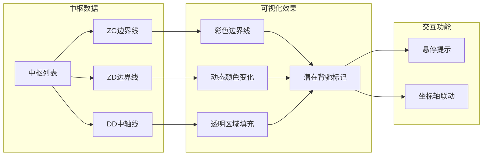

**图表来源**
- [HourlyChanChart.tsx:537-644](file://frontend/src/HourlyChanChart.tsx#L537-L644)

#### 技术指标集成

组件集成了多种技术分析指标：

| 指标类型 | 数据来源 | 可视化方式 | 用途 |
|---------|----------|------------|------|
| MACD | K线数据 | 柱状图+轨迹线 | 动能分析、背驰识别 |
| 布林带 | 计算结果 | 区域填充+中轨线 | 波动性分析、支撑阻力 |
| KDJ | 计算结果 | 轨迹线 | 超买超卖判断 |
| 分型标记 | 分析结果 | 三角形标记 | 顶底反转信号 |

**更新** 组件现在支持更复杂的信号处理逻辑，包括信号互斥锁、状态机机制和实时失效检查等功能。

**章节来源**
- [HourlyChanChart.tsx:259-284](file://frontend/src/HourlyChanChart.tsx#L259-L284)
- [chartMacd.ts:1-71](file://frontend/src/chartMacd.ts#L1-L71)

### 与日线图表的关联关系

#### 数据共享机制

HourlyChanChart 与 DailyChanChart 通过以下方式实现数据共享：

1. **共同数据源**
   - 均使用相同的API接口获取K线数据
   - 共享标准化的数据格式和字段定义

2. **状态同步**
   - App组件统一管理图表状态
   - 实时更新中枢分析结果
   - 同步买卖信号状态

3. **视觉协调**
   - 统一的颜色方案和样式标准
   - 相同的交互行为和用户体验
   - 协调的缩放和导航功能

#### 同步更新策略

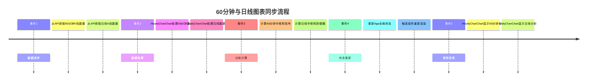

**图表来源**
- [App.tsx:598-750](file://frontend/src/App.tsx#L598-L750)
- [stock.ts:185-215](file://frontend/src/api/stock.ts#L185-L215)

**章节来源**
- [App.tsx:598-750](file://frontend/src/App.tsx#L598-L750)
- [DailyChanChart.tsx:161-183](file://frontend/src/DailyChanChart.tsx#L161-L183)

### 特殊功能实现

#### 3B信号识别（东阿阿胶特例）

针对特定标的（如000423 东阿阿胶）实现了特殊的3B信号识别：

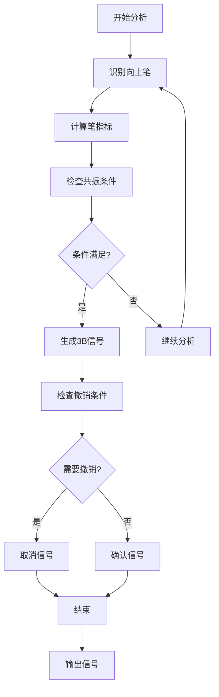

**图表来源**
- [HourlyChanChart.tsx:284-423](file://frontend/src/HourlyChanChart.tsx#L284-L423)

#### 跨级别风控机制

组件实现了基于日线防线的日线破位强制降级机制：

| 风险等级 | 触发条件 | 处理方式 |
|---------|----------|----------|
| 正常 | 未跌破日线绝对防线 | 信号正常显示 |
| 弱风险 | 跌破日线C-ZD但未跌破A-ZD | 信号降级显示 |
| 高风险 | 跌破日线A-ZD | 信号强制降级为不可执行 |
| 极高风险 | 跌破日线绝对防线 | 信号灰显处理 |

**更新** 新增了更严格的信号互斥锁和状态机机制，确保信号的正确流转和失效检查。

**章节来源**
- [HourlyChanChart.tsx:444-496](file://frontend/src/HourlyChanChart.tsx#L444-L496)

### 实时信号处理增强功能

#### 信号互斥锁和状态机机制

组件实现了复杂的信号互斥锁和状态机机制：

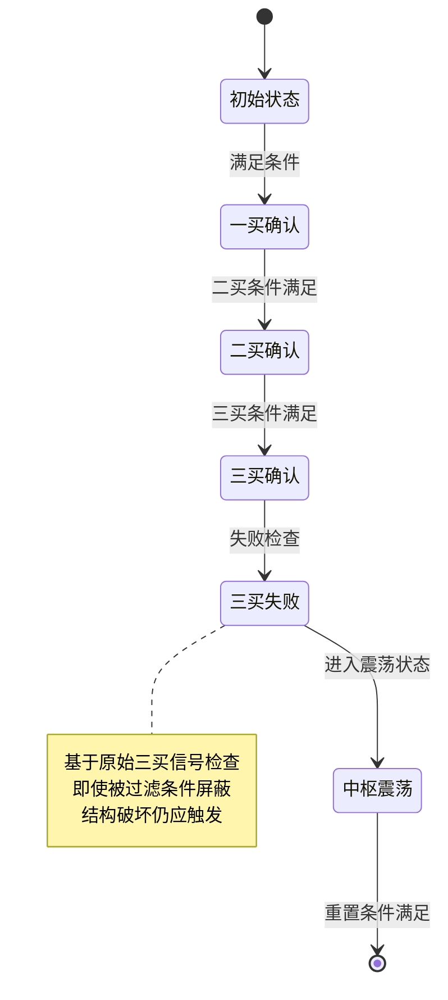

**图表来源**
- [hourlyBuySellSignals.ts:1560-1620](file://frontend/src/hourlyBuySellSignals.ts#L1560-L1620)

#### 实时失效检查机制

组件实现了信号的实时失效检查：

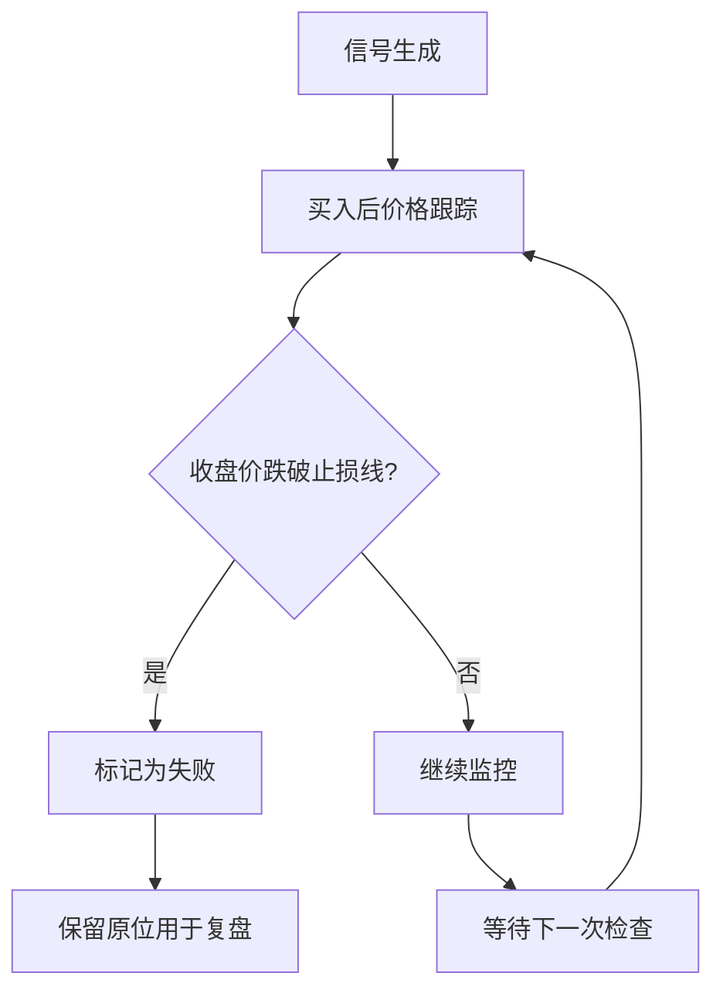

**图表来源**
- [hourlyBuySellSignals.ts:1460-1557](file://frontend/src/hourlyBuySellSignals.ts#L1460-L1557)

**章节来源**
- [hourlyBuySellSignals.ts:1560-1620](file://frontend/src/hourlyBuySellSignals.ts#L1560-L1620)
- [hourlyBuySellSignals.ts:1460-1557](file://frontend/src/hourlyBuySellSignals.ts#L1460-L1557)

## 依赖关系分析

### 前端依赖关系

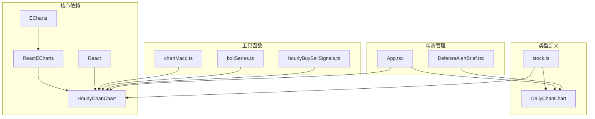

**图表来源**
- [HourlyChanChart.tsx:1-16](file://frontend/src/HourlyChanChart.tsx#L1-L16)
- [App.tsx:1-17](file://frontend/src/App.tsx#L1-L17)

### 后端服务依赖

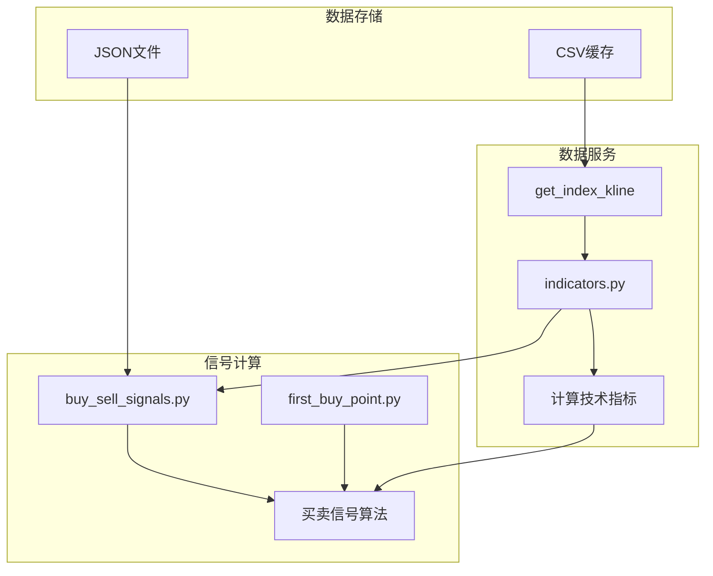

**图表来源**
- [indicators.py:359-444](file://backend/services/indicators.py#L359-L444)
- [buy_sell_signals.py:581-790](file://backend/services/buy_sell_signals.py#L581-L790)

**章节来源**
- [buy_sell_signals.py:1-800](file://backend/services/buy_sell_signals.py#L1-L800)
- [indicators.py:1-800](file://backend/services/indicators.py#L1-L800)

## 性能考虑

### 数据缓存策略

组件采用了多层次的数据缓存机制：

1. **前端缓存**
   - ECharts实例缓存，避免重复创建
   - 图表配置缓存，减少渲染开销
   - 数据映射缓存，优化查找性能

2. **后端缓存**
   - K线数据CSV缓存，支持快速读取
   - 计算结果缓存，避免重复计算
   - API响应缓存，减少网络请求

3. **内存优化**
   - 数据分页加载，限制内存占用
   - 及时清理无用数据，防止内存泄漏
   - 合理的数据结构设计，提高访问效率

### 渲染优化

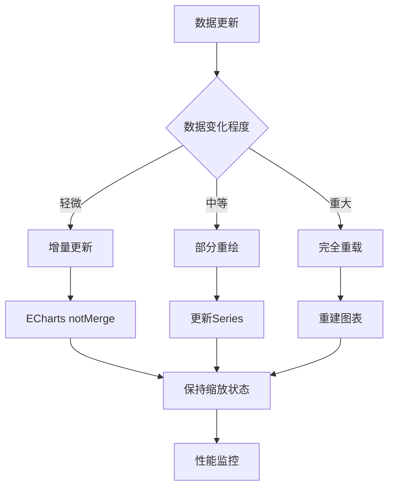

**图表来源**
- [HourlyChanChart.tsx:728-731](file://frontend/src/HourlyChanChart.tsx#L728-L731)

### 渲染频率控制

组件实现了智能的渲染频率控制机制：

- **节流处理**: 防止频繁的数据更新导致的过度渲染
- **防抖机制**: 合并短时间内多次状态变更
- **虚拟滚动**: 大数据量时采用虚拟化技术
- **懒加载**: 按需加载图表组件，减少初始加载压力

**更新** 新增了信号互斥锁和状态机机制的性能优化，减少了不必要的计算和渲染。

**章节来源**
- [HourlyChanChart.tsx:728-731](file://frontend/src/HourlyChanChart.tsx#L728-L731)

## 故障排查指南

### 常见问题诊断

#### 数据加载问题

| 问题症状 | 可能原因 | 解决方案 |
|---------|----------|----------|
| 图表空白 | 数据格式不正确 | 检查API响应格式 |
| 中枢缺失 | 分析算法异常 | 验证分型识别逻辑 |
| 信号不显示 | 买卖信号计算错误 | 检查过滤条件设置 |
| 性能卡顿 | 数据量过大 | 实施数据分页和缓存 |

#### 渲染异常处理

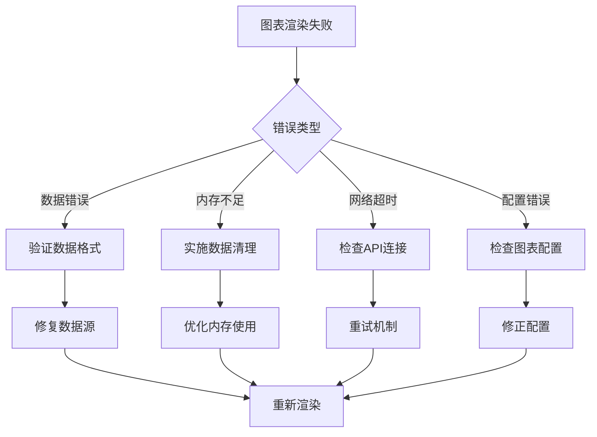

**图表来源**
- [stock.ts:117-130](file://frontend/src/api/stock.ts#L117-L130)

#### 后端服务问题

| 问题类型 | 诊断方法 | 处理步骤 |
|---------|----------|----------|
| 数据计算异常 | 检查算法逻辑 | 验证输入数据完整性 |
| 缓存失效 | 查看缓存状态 | 清理缓存并重建 |
| API响应超时 | 监控网络连接 | 重试机制和降级策略 |
| 信号误判 | 分析算法参数 | 调整阈值和过滤条件 |

**更新** 新增了信号互斥锁和状态机机制的故障排查指南。

**章节来源**
- [buy_sell_signals.py:1-800](file://backend/services/buy_sell_signals.py#L1-L800)
- [indicators.py:121-174](file://backend/services/indicators.py#L121-L174)

### 调试工具和技巧

1. **开发者工具**
   - 使用浏览器开发者工具监控网络请求
   - 检查ECharts实例状态和配置
   - 监控内存使用情况和性能指标

2. **日志分析**
   - 启用详细日志记录
   - 分析算法执行时间和资源消耗
   - 跟踪数据流转过程

3. **单元测试**
   - 编写核心算法测试用例
   - 验证数据处理逻辑的正确性
   - 测试边界条件和异常情况

**更新** 新增了信号互斥锁和状态机机制的调试方法。

## 结论

HourlyChanChart 60分钟图表组件是一个功能完整、架构清晰的技术分析工具。通过与日线图表的紧密协作，实现了双级别缠论分析的完整解决方案。

组件的主要优势包括：

1. **完整的分析功能**: 集成了中枢分析、笔线段绘制、买卖信号识别等核心功能
2. **强大的数据处理能力**: 支持大规模数据的高效处理和可视化
3. **灵活的配置选项**: 提供丰富的样式定制和指标显示选项
4. **可靠的性能保障**: 采用多层缓存和优化策略，确保流畅的用户体验
5. **完善的错误处理**: 具备完整的故障诊断和恢复机制

**更新** 组件现已具备更完善的实时买卖信号处理能力，包括信号互斥锁、状态机机制、跨级别风控和实时失效检查等功能，为用户提供了一个更加专业和可靠的60分钟缠论分析平台。

该组件为用户提供了一个专业级的60分钟缠论分析平台，能够满足不同层次用户的分析需求。通过持续的优化和完善，该组件将继续为技术分析领域提供可靠的支持。