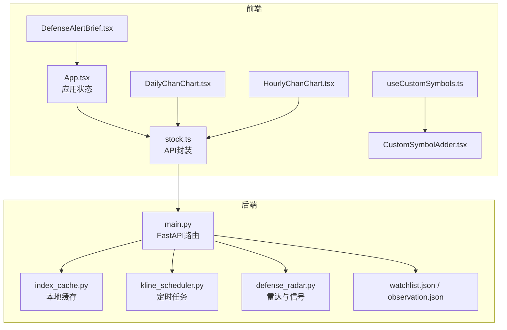
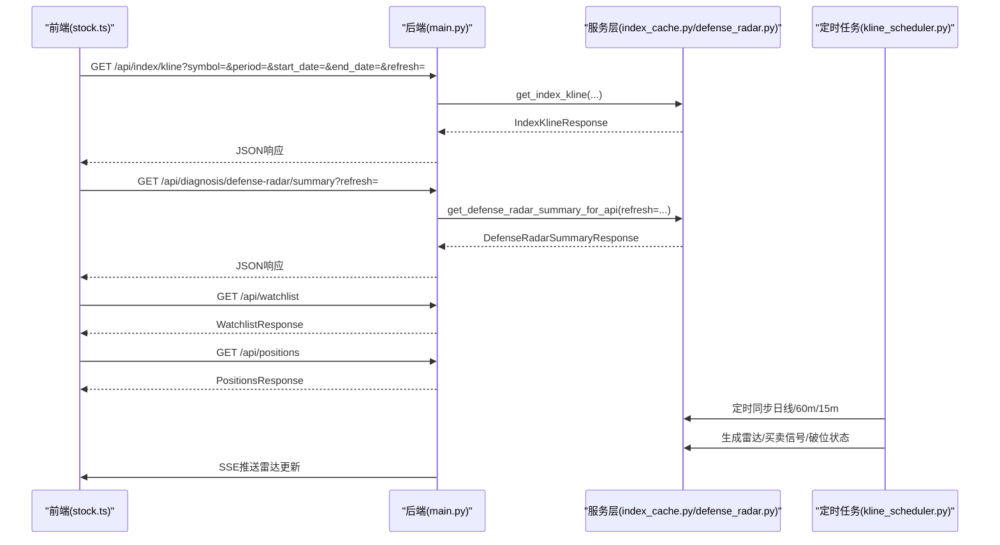
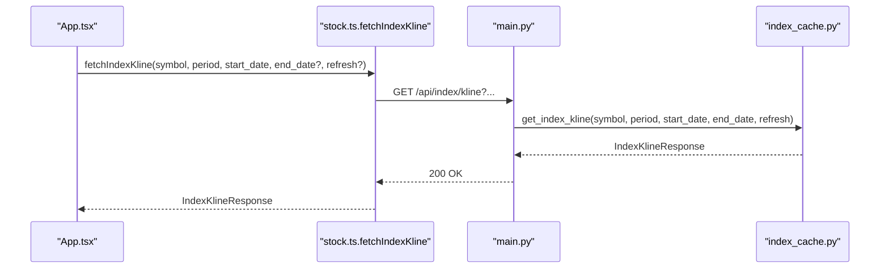
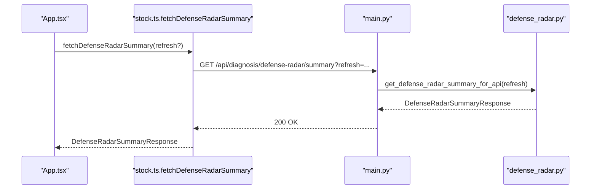
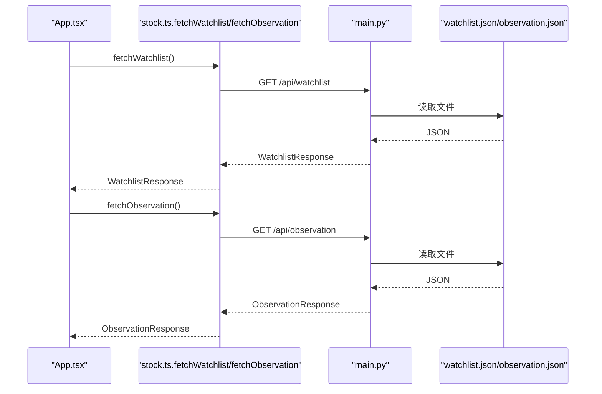
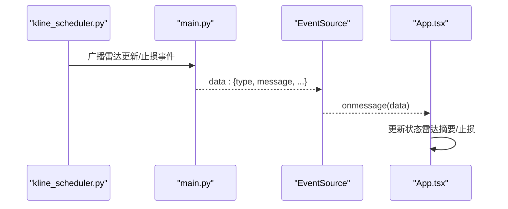
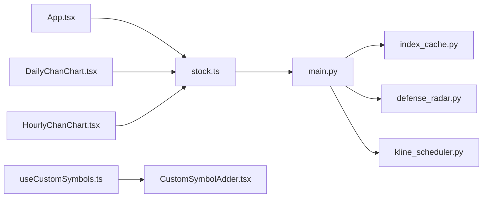
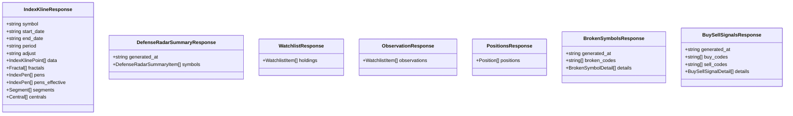

# API客户端集成

<cite>
**本文引用的文件**
- [stock.ts](file://frontend/src/api/stock.ts)
- [App.tsx](file://frontend/src/App.tsx)
- [main.py](file://backend/main.py)
- [index_cache.py](file://backend/services/index_cache.py)
- [defense_radar.py](file://backend/services/defense_radar.py)
- [kline_scheduler.py](file://backend/services/kline_scheduler.py)
- [useCustomSymbols.ts](file://frontend/src/hooks/useCustomSymbols.ts)
- [CustomSymbolAdder.tsx](file://frontend/src/components/CustomSymbolAdder.tsx)
- [DailyChanChart.tsx](file://frontend/src/DailyChanChart.tsx)
- [HourlyChanChart.tsx](file://frontend/src/HourlyChanChart.tsx)
- [DefenseAlertBrief.tsx](file://frontend/src/DefenseAlertBrief.tsx)
- [watchlist.json](file://backend/data/watchlist.json)
- [observation.json](file://backend/data/observation.json)
</cite>

## 目录
1. [简介](#简介)
2. [项目结构](#项目结构)
3. [核心组件](#核心组件)
4. [架构总览](#架构总览)
5. [详细组件分析](#详细组件分析)
6. [依赖关系分析](#依赖关系分析)
7. [性能考虑](#性能考虑)
8. [故障排查指南](#故障排查指南)
9. [结论](#结论)
10. [附录](#附录)

## 简介
本文件面向API客户端集成，系统性梳理前端API封装与后端服务的交互流程，重点覆盖以下接口：
- fetchIndexKline：指数/个股K线与缠论中枢、笔线段、分型等技术特征
- fetchDefenseRadarSummary：双防线雷达摘要（仅读本地）
- fetchWatchlist：用户自选/持仓列表
- fetchPositions：当前持仓
- fetchObservation：用户观察列表
- fetchBrokenSymbols：watchlist+observation的破位状态
- fetchBuySellSignals：watchlist+observation的买卖信号

文档涵盖请求参数格式与校验、URL构建、查询参数、请求头设置、响应数据处理与类型安全、错误处理、异步管理（Promise链、并发控制、超时）、缓存策略（本地CSV缓存、定时同步、SSE实时推送）、与组件的集成方式（数据传递、状态更新、错误传播），并提供最佳实践与性能优化建议。

## 项目结构
前端与后端协作的关键模块如下：
- 前端API封装：位于 frontend/src/api/stock.ts，提供统一的HTTP客户端与类型定义
- 前端应用：frontend/src/App.tsx负责页面状态管理与图表渲染
- 后端FastAPI服务：backend/main.py提供REST接口
- 后端数据缓存与定时任务：backend/services/index_cache.py、backend/services/kline_scheduler.py
- 后端雷达与信号：backend/services/defense_radar.py
- 用户数据：backend/data/watchlist.json、backend/data/observation.json

**图表来源**
- [stock.ts:115-466](file://frontend/src/api/stock.ts#L115-L466)
- [App.tsx:1-1552](file://frontend/src/App.tsx#L1-L1552)
- [main.py:105-532](file://backend/main.py#L105-L532)
- [index_cache.py:1-201](file://backend/services/index_cache.py#L1-L201)
- [kline_scheduler.py:1-492](file://backend/services/kline_scheduler.py#L1-L492)
- [defense_radar.py:1-959](file://backend/services/defense_radar.py#L1-L959)
- [watchlist.json:1-27](file://backend/data/watchlist.json#L1-L27)
- [observation.json:1-25](file://backend/data/observation.json#L1-L25)

**章节来源**
- [stock.ts:115-466](file://frontend/src/api/stock.ts#L115-L466)
- [App.tsx:1-1552](file://frontend/src/App.tsx#L1-L1552)
- [main.py:105-532](file://backend/main.py#L105-L532)

## 核心组件
本节聚焦API封装与后端服务的核心接口，解释请求参数、URL构建、响应处理与错误传播。

- fetchIndexKline
  - 参数：symbol、period、start_date、end_date（可选）、refresh（可选）
  - URL：/api/index/kline?symbol=...&period=...&start_date=...&end_date=...&refresh=...
  - 请求头：cache: no-store
  - 响应：IndexKlineResponse，包含K线、分型、笔、线段、中枢、MACD等
  - 错误：resp.ok为false时抛出错误，detail优先
- fetchDefenseRadarSummary
  - 参数：refresh（可选）
  - URL：/api/diagnosis/defense-radar/summary?refresh=...
  - 请求头：cache: no-store
  - 响应：DefenseRadarSummaryResponse，包含generated_at与symbols数组
  - 错误：resp.ok为false时抛出错误
- fetchWatchlist
  - URL：/api/watchlist
  - 请求头：cache: no-store
  - 响应：WatchlistResponse，包含holdings数组
  - 错误：resp.ok为false时返回空数组
- fetchPositions
  - URL：/api/positions
  - 请求头：cache: no-store
  - 响应：PositionsResponse，包含positions数组
  - 错误：resp.ok为false时抛出错误
- fetchObservation
  - URL：/api/observation
  - 请求头：cache: no-store
  - 响应：ObservationResponse，包含observations数组
  - 错误：resp.ok为false时返回空数组
- fetchBrokenSymbols
  - URL：/api/broken-symbols
  - 请求头：cache: no-store
  - 响应：BrokenSymbolsResponse，包含generated_at、broken_codes、details
  - 错误：resp.ok为false时抛出错误
- fetchBuySellSignals
  - URL：/api/buy-sell-signals
  - 请求头：cache: no-store
  - 响应：BuySellSignalsResponse，包含generated_at、buy_codes、sell_codes、details
  - 错误：resp.ok为false时抛出错误

**章节来源**
- [stock.ts:185-215](file://frontend/src/api/stock.ts#L185-L215)
- [stock.ts:250-276](file://frontend/src/api/stock.ts#L250-L276)
- [stock.ts:355-361](file://frontend/src/api/stock.ts#L355-L361)
- [stock.ts:324-339](file://frontend/src/api/stock.ts#L324-L339)
- [stock.ts:369-375](file://frontend/src/api/stock.ts#L369-L375)
- [stock.ts:394-409](file://frontend/src/api/stock.ts#L394-L409)
- [stock.ts:431-446](file://frontend/src/api/stock.ts#L431-L446)

## 架构总览
前端通过stock.ts发起HTTP请求，后端main.py路由解析查询参数并调用服务层（index_cache.py、defense_radar.py、kline_scheduler.py）。数据缓存采用本地CSV文件，定时任务在后台线程中按固定槽位同步，雷达与买卖信号在定时任务中生成并写入本地文件，前端通过GET接口读取或通过SSE实时接收更新。

**图表来源**
- [stock.ts:185-215](file://frontend/src/api/stock.ts#L185-L215)
- [stock.ts:250-276](file://frontend/src/api/stock.ts#L250-L276)
- [stock.ts:355-361](file://frontend/src/api/stock.ts#L355-L361)
- [stock.ts:324-339](file://frontend/src/api/stock.ts#L324-L339)
- [main.py:156-184](file://backend/main.py#L156-L184)
- [main.py:187-196](file://backend/main.py#L187-L196)
- [main.py:468-497](file://backend/main.py#L468-L497)
- [main.py:408-427](file://backend/main.py#L408-L427)
- [kline_scheduler.py:211-256](file://backend/services/kline_scheduler.py#L211-L256)

## 详细组件分析

### fetchIndexKline：指数/个股K线与技术特征
- 请求参数
  - symbol：指数/个股代码（如sh000001、600000、000001、510300、hk01810）
  - period：daily、60、15
  - start_date：YYYY-MM-DD
  - end_date：YYYY-MM-DD（可选）
  - refresh：true/false（可选）
- URL构建与查询参数
  - 使用URLSearchParams拼接查询参数，支持end_date与refresh
  - 请求头设置cache: no-store，避免浏览器缓存
- 响应数据
  - IndexKlineResponse：包含symbol、start_date、end_date、period、adjust、data、fractals、pens、segments、centrals等
  - data元素包含OHLC、MACD、BOLL等指标
- 错误处理
  - resp.ok为false时解析JSON中的detail作为错误消息，否则抛出通用错误
- 与组件集成
  - App.tsx中按symbol与period组合加载不同图表
  - DailyChanChart.tsx与HourlyChanChart.tsx消费响应数据进行可视化

**图表来源**
- [stock.ts:185-215](file://frontend/src/api/stock.ts#L185-L215)
- [main.py:156-184](file://backend/main.py#L156-L184)
- [index_cache.py:102-124](file://backend/services/index_cache.py#L102-L124)

**章节来源**
- [stock.ts:185-215](file://frontend/src/api/stock.ts#L185-L215)
- [main.py:156-184](file://backend/main.py#L156-L184)
- [index_cache.py:102-124](file://backend/services/index_cache.py#L102-L124)
- [App.tsx:598-750](file://frontend/src/App.tsx#L598-L750)
- [DailyChanChart.tsx:161-183](file://frontend/src/DailyChanChart.tsx#L161-L183)
- [HourlyChanChart.tsx:179-200](file://frontend/src/HourlyChanChart.tsx#L179-L200)

### fetchDefenseRadarSummary：雷达摘要（仅读本地）
- 请求参数
  - refresh：true/false（默认false，仅排障时使用）
- URL构建
  - /api/diagnosis/defense-radar/summary?refresh=...
  - 请求头设置cache: no-store
- 响应数据
  - DefenseRadarSummaryResponse：包含generated_at与symbols数组
  - symbols元素包含code、name、alert、has_alert、pen_60m、雷达条件字段等
- 错误处理
  - resp.ok为false时解析JSON中的detail作为错误消息
- 与组件集成
  - App.tsx中加载雷达摘要并更新状态，用于Tab显隐与提示
  - DailyChanChart.tsx与HourlyChanChart.tsx显示雷达摘要时间与内容

**图表来源**
- [stock.ts:250-276](file://frontend/src/api/stock.ts#L250-L276)
- [main.py:187-196](file://backend/main.py#L187-L196)
- [defense_radar.py:147-165](file://backend/services/defense_radar.py#L147-L165)

**章节来源**
- [stock.ts:250-276](file://frontend/src/api/stock.ts#L250-L276)
- [main.py:187-196](file://backend/main.py#L187-L196)
- [defense_radar.py:147-165](file://backend/services/defense_radar.py#L147-L165)
- [App.tsx:612-635](file://frontend/src/App.tsx#L612-L635)
- [DailyChanChart.tsx:177-182](file://frontend/src/DailyChanChart.tsx#L177-L182)

### fetchWatchlist/fetchObservation：用户自选/观察列表
- 请求参数
  - 无查询参数
- URL构建
  - /api/watchlist、/api/observation
  - 请求头设置cache: no-store
- 响应数据
  - WatchlistResponse/ObservationResponse：包含holdings/observations数组
- 错误处理
  - resp.ok为false时返回空数组，避免中断UI渲染
- 与组件集成
  - App.tsx中加载watchlist与observation，用于生成图表Tab与自定义标的
  - useCustomSymbols.ts与CustomSymbolAdder.tsx管理自定义标的

**图表来源**
- [stock.ts:355-361](file://frontend/src/api/stock.ts#L355-L361)
- [stock.ts:369-375](file://frontend/src/api/stock.ts#L369-L375)
- [main.py:468-497](file://backend/main.py#L468-L497)
- [watchlist.json:1-27](file://backend/data/watchlist.json#L1-L27)
- [observation.json:1-25](file://backend/data/observation.json#L1-L25)

**章节来源**
- [stock.ts:355-361](file://frontend/src/api/stock.ts#L355-L361)
- [stock.ts:369-375](file://frontend/src/api/stock.ts#L369-L375)
- [main.py:468-497](file://backend/main.py#L468-L497)
- [watchlist.json:1-27](file://backend/data/watchlist.json#L1-L27)
- [observation.json:1-25](file://backend/data/observation.json#L1-L25)
- [App.tsx:666-708](file://frontend/src/App.tsx#L666-L708)
- [useCustomSymbols.ts:1-77](file://frontend/src/hooks/useCustomSymbols.ts#L1-L77)
- [CustomSymbolAdder.tsx:1-192](file://frontend/src/components/CustomSymbolAdder.tsx#L1-L192)

### fetchPositions：当前持仓
- 请求参数
  - 无查询参数
- URL构建
  - /api/positions
  - 请求头设置cache: no-store
- 响应数据
  - PositionsResponse：包含positions数组，每个元素包含code、name、signal_type、buy_date、buy_price、amount、tactical_stop、strategic_stop
- 错误处理
  - resp.ok为false时抛出错误

**章节来源**
- [stock.ts:324-339](file://frontend/src/api/stock.ts#L324-L339)
- [main.py:408-427](file://backend/main.py#L408-L427)

### fetchBrokenSymbols/fetchBuySellSignals：破位与买卖信号
- 请求参数
  - 无查询参数
- URL构建
  - /api/broken-symbols、/api/buy-sell-signals
  - 请求头设置cache: no-store
- 响应数据
  - BrokenSymbolsResponse：包含generated_at、broken_codes、details
  - BuySellSignalsResponse：包含generated_at、buy_codes、sell_codes、details
- 错误处理
  - resp.ok为false时抛出错误

**章节来源**
- [stock.ts:394-409](file://frontend/src/api/stock.ts#L394-L409)
- [stock.ts:431-446](file://frontend/src/api/stock.ts#L431-L446)
- [main.py:499-530](file://backend/main.py#L499-L530)

### SSE实时推送：雷达更新与止损告警
- 端点
  - /api/sse/radar-updates（Server-Sent Events）
- 作用
  - 后台定时任务完成后通过SSE广播“雷达已更新”与“止损触发”事件
  - 前端通过createSseConnection订阅事件，更新UI状态
- 与组件集成
  - App.tsx中创建SSE连接，监听事件并更新雷达摘要与止损状态

**图表来源**
- [kline_scheduler.py:31-82](file://backend/services/kline_scheduler.py#L31-L82)
- [main.py:229-270](file://backend/main.py#L229-L270)
- [stock.ts:449-466](file://frontend/src/api/stock.ts#L449-L466)
- [App.tsx:602-608](file://frontend/src/App.tsx#L602-L608)

**章节来源**
- [kline_scheduler.py:31-82](file://backend/services/kline_scheduler.py#L31-L82)
- [main.py:229-270](file://backend/main.py#L229-L270)
- [stock.ts:449-466](file://frontend/src/api/stock.ts#L449-L466)
- [App.tsx:602-608](file://frontend/src/App.tsx#L602-L608)

## 依赖关系分析
- 前端API封装依赖后端路由与服务层
- 后端路由依赖服务层（index_cache.py、defense_radar.py、kline_scheduler.py）
- 服务层依赖本地数据文件与第三方库（akshare、requests、pandas）
- 前端组件依赖API封装与类型定义

**图表来源**
- [stock.ts:115-466](file://frontend/src/api/stock.ts#L115-L466)
- [main.py:105-532](file://backend/main.py#L105-L532)
- [index_cache.py:1-201](file://backend/services/index_cache.py#L1-L201)
- [defense_radar.py:1-959](file://backend/services/defense_radar.py#L1-L959)
- [kline_scheduler.py:1-492](file://backend/services/kline_scheduler.py#L1-L492)
- [App.tsx:1-1552](file://frontend/src/App.tsx#L1-L1552)
- [DailyChanChart.tsx:1-820](file://frontend/src/DailyChanChart.tsx#L1-L820)
- [HourlyChanChart.tsx:1-1632](file://frontend/src/HourlyChanChart.tsx#L1-L1632)
- [useCustomSymbols.ts:1-77](file://frontend/src/hooks/useCustomSymbols.ts#L1-L77)
- [CustomSymbolAdder.tsx:1-192](file://frontend/src/components/CustomSymbolAdder.tsx#L1-L192)

**章节来源**
- [stock.ts:115-466](file://frontend/src/api/stock.ts#L115-L466)
- [main.py:105-532](file://backend/main.py#L105-L532)

## 性能考虑
- 缓存策略
  - 本地CSV缓存：指数/个股日线、港股日线、60分钟K线分别缓存，严格本地优先，force_refresh或本地不存在时访问线上并写回
  - 定时同步：按固定槽位（10:31/11:31/14:01/15:01/16:01）同步，避免频繁网络请求
  - 前端缓存：通过cache: no-store避免浏览器缓存，确保数据新鲜
- 并发控制
  - 前端：多个API请求可并发，但建议在UI层面做去重与节流，避免重复渲染
  - 后端：定时任务在独立线程中执行，避免阻塞主线程
- 超时与重试
  - fetchWithRetry：内置重试与延迟，提升网络波动下的稳定性
- 数据转换
  - 类型安全：通过TypeScript接口约束响应结构，减少运行时错误
  - 数据清洗：后端对原始数据进行清洗与校验，前端仅做展示

[本节提供一般性指导，不直接分析具体文件]

## 故障排查指南
- 常见错误
  - resp.ok为false：解析JSON中的detail字段作为错误消息；若无detail则抛出通用错误
  - 网络异常：fetchWithRetry重试后仍失败，检查后端服务状态与网络连通性
  - 文件不存在：/api/watchlist、/api/observation在文件缺失时返回空数组，属预期行为
- 排障步骤
  - 检查后端日志：main.py中记录异常与HTTP状态码
  - 验证定时任务：/api/scheduler/status查询调度器健康状态
  - 核对缓存：index_cache.py中CSV缓存路径与权限
  - 前端调试：console.log输出请求URL与响应状态，定位问题

**章节来源**
- [stock.ts:117-130](file://frontend/src/api/stock.ts#L117-L130)
- [stock.ts:141-154](file://frontend/src/api/stock.ts#L141-L154)
- [stock.ts:263-275](file://frontend/src/api/stock.ts#L263-L275)
- [stock.ts:325-338](file://frontend/src/api/stock.ts#L325-L338)
- [stock.ts:356-360](file://frontend/src/api/stock.ts#L356-L360)
- [stock.ts:371-374](file://frontend/src/api/stock.ts#L371-L374)
- [stock.ts:396-408](file://frontend/src/api/stock.ts#L396-L408)
- [stock.ts:433-445](file://frontend/src/api/stock.ts#L433-L445)
- [main.py:224-227](file://backend/main.py#L224-L227)
- [main.py:200-202](file://backend/main.py#L200-L202)
- [kline_scheduler.py:410-445](file://backend/services/kline_scheduler.py#L410-L445)

## 结论
本API客户端集成方案通过明确的请求参数、严格的类型约束与完善的错误处理，实现了前后端高效协作。后端采用本地缓存与定时同步策略，前端通过SSE实现实时更新，整体具备良好的性能与可维护性。建议在实际部署中关注缓存一致性、网络波动与UI渲染优化，持续改进用户体验。

[本节为总结性内容，不直接分析具体文件]

## 附录

### 数据模型与类型定义
- 指数K线响应：IndexKlineResponse
- 雷达摘要：DefenseRadarSummaryResponse
- 自选/观察：WatchlistResponse、ObservationResponse
- 持仓：PositionsResponse
- 破位/买卖信号：BrokenSymbolsResponse、BuySellSignalsResponse

**图表来源**
- [stock.ts:69-112](file://frontend/src/api/stock.ts#L69-L112)
- [stock.ts:243-247](file://frontend/src/api/stock.ts#L243-L247)
- [stock.ts:350-352](file://frontend/src/api/stock.ts#L350-L352)
- [stock.ts:364-366](file://frontend/src/api/stock.ts#L364-L366)
- [stock.ts:318-321](file://frontend/src/api/stock.ts#L318-L321)
- [stock.ts:387-391](file://frontend/src/api/stock.ts#L387-L391)
- [stock.ts:423-428](file://frontend/src/api/stock.ts#L423-L428)

**章节来源**
- [stock.ts:69-112](file://frontend/src/api/stock.ts#L69-L112)
- [stock.ts:243-247](file://frontend/src/api/stock.ts#L243-L247)
- [stock.ts:350-352](file://frontend/src/api/stock.ts#L350-L352)
- [stock.ts:364-366](file://frontend/src/api/stock.ts#L364-L366)
- [stock.ts:318-321](file://frontend/src/api/stock.ts#L318-L321)
- [stock.ts:387-391](file://frontend/src/api/stock.ts#L387-L391)
- [stock.ts:423-428](file://frontend/src/api/stock.ts#L423-L428)