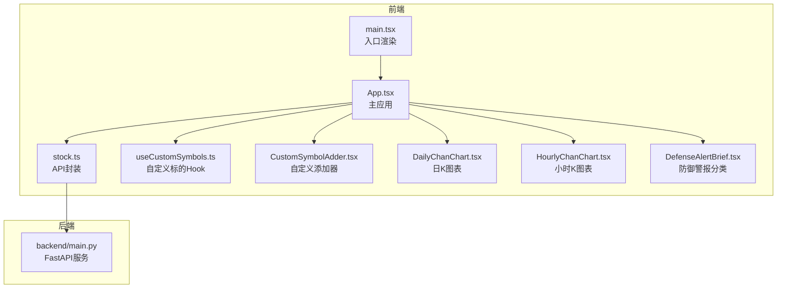
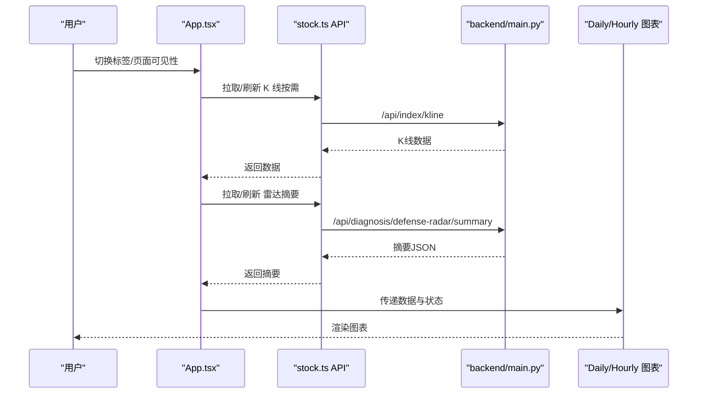
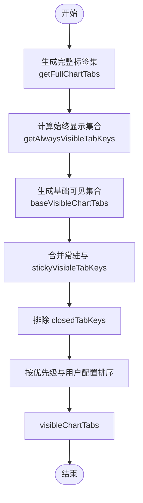
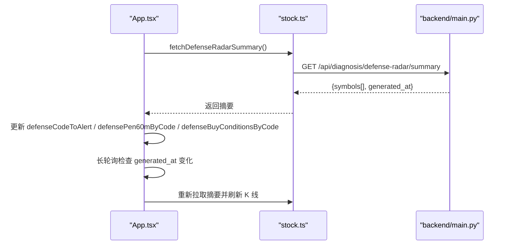
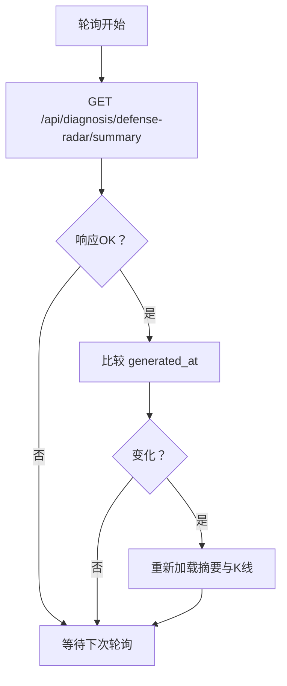
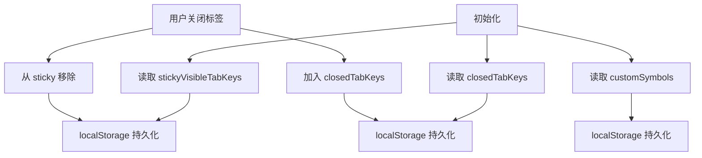
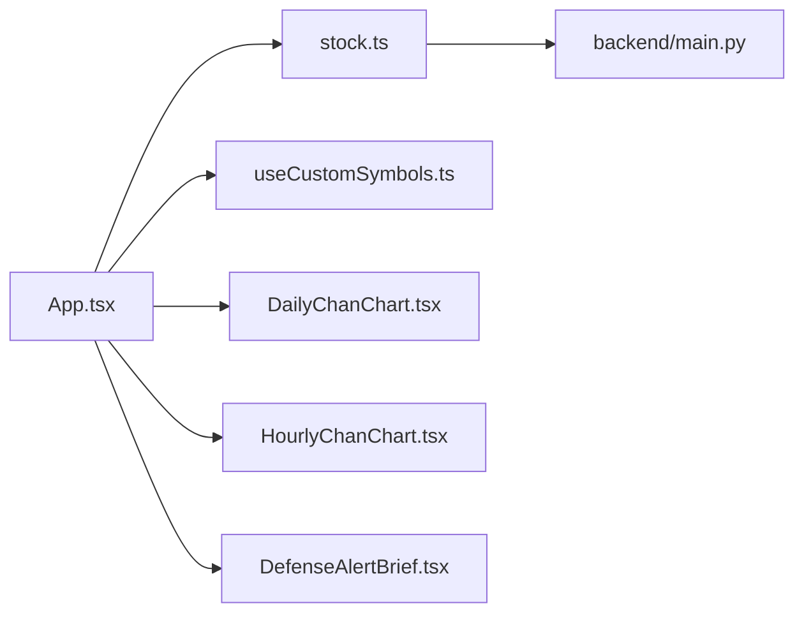

# 主应用组件 (App)

<cite>
**本文引用的文件**
- [App.tsx](file://frontend/src/App.tsx)
- [main.tsx](file://frontend/src/main.tsx)
- [stock.ts](file://frontend/src/api/stock.ts)
- [useCustomSymbols.ts](file://frontend/src/hooks/useCustomSymbols.ts)
- [CustomSymbolAdder.tsx](file://frontend/src/components/CustomSymbolAdder.tsx)
- [DailyChanChart.tsx](file://frontend/src/DailyChanChart.tsx)
- [HourlyChanChart.tsx](file://frontend/src/HourlyChanChart.tsx)
- [DefenseAlertBrief.tsx](file://frontend/src/DefenseAlertBrief.tsx)
- [main.py](file://backend/main.py)
</cite>

## 目录
1. [简介](#简介)
2. [项目结构](#项目结构)
3. [核心组件](#核心组件)
4. [架构总览](#架构总览)
5. [详细组件分析](#详细组件分析)
6. [依赖关系分析](#依赖关系分析)
7. [性能考量](#性能考量)
8. [故障排查指南](#故障排查指南)
9. [结论](#结论)

## 简介
App.tsx 是前端主应用入口组件，负责：
- 图表标签页系统与显隐策略
- 导航管理与排序规则
- 全局状态控制（K线数据、雷达预警、买卖信号、自定义标的等）
- 长轮询机制以同步后端雷达摘要更新
- localStorage 持久化（常驻标签页、用户手动关闭标签页）
- 与后端 API 的集成（K线、技术指标、雷达摘要、持仓/自选）

## 项目结构
前端采用按功能模块组织的结构，核心文件如下：
- 入口渲染：main.tsx
- 主应用：App.tsx
- API 封装：api/stock.ts
- 自定义标的 Hook：hooks/useCustomSymbols.ts
- 自定义标的添加器：components/CustomSymbolAdder.tsx
- 图表组件：DailyChanChart.tsx、HourlyChanChart.tsx
- 防御警报分类：DefenseAlertBrief.tsx
- 后端服务：backend/main.py（FastAPI）

**图表来源**
- [main.tsx:1-11](file://frontend/src/main.tsx#L1-L11)
- [App.tsx:1-1552](file://frontend/src/App.tsx#L1-L1552)
- [stock.ts:1-468](file://frontend/src/api/stock.ts#L1-L468)
- [useCustomSymbols.ts:1-77](file://frontend/src/hooks/useCustomSymbols.ts#L1-L77)
- [CustomSymbolAdder.tsx:1-192](file://frontend/src/components/CustomSymbolAdder.tsx#L1-L192)
- [DailyChanChart.tsx:1-200](file://frontend/src/DailyChanChart.tsx#L1-L200)
- [HourlyChanChart.tsx:1-200](file://frontend/src/HourlyChanChart.tsx#L1-L200)
- [DefenseAlertBrief.tsx](file://frontend/src/DefenseAlertBrief.tsx)
- [main.py:1-200](file://backend/main.py#L1-L200)

**章节来源**
- [main.tsx:1-11](file://frontend/src/main.tsx#L1-L11)
- [App.tsx:1-1552](file://frontend/src/App.tsx#L1-L1552)

## 核心组件
- 图表标签页系统
  - CHART_TABS：内置固定标的清单
  - 动态自定义标的：custom_${code} 格式
  - 常驻集合：BASE_ALWAYS_VISIBLE_TAB_KEYS（当前为空）
  - 始终显示集合：getAlwaysVisibleTabKeys（自定义、持仓、观察）
  - 完整标签集：getFullChartTabs（去重后拼接动态自定义）
- 导航与排序
  - baseVisibleChartTabs：按“持仓 > 观察/自定义 > 原始顺序”排序
  - visibleChartTabs：合并常驻与 stickyVisibleTabKeys，排除 closedTabKeys
- 全局状态
  - K线数据：indexKline/daily、indexKline60/15、各标的 daily/60/15
  - 雷达摘要：defenseCodeToAlert、defensePen60mByCode、defenseBuyConditionsByCode、defenseAlertTextByCode、defenseSummaryGeneratedAt
  - 破位/买卖信号：brokenCodeSet、buyCodeSet、sellCodeSet
  - 自定义标的：customSymbols（localStorage）
  - 用户偏好：stickyVisibleTabKeys（localStorage）、closedTabKeys（localStorage）
- 长轮询
  - 每5分钟检查摘要 generated_at，变化则重新拉取摘要与K线
- API 集成
  - K线：fetchIndexKline
  - 技术指标：fetchStockIndicators/fetchStockHistoryIndicators
  - 雷达摘要：fetchDefenseRadarSummary
  - 持仓/自选：fetchWatchlist/fetchObservation
  - 破位/买卖信号：fetchBrokenSymbols/fetchBuySellSignals
  - SSE：createSseConnection（后端推送）

**章节来源**
- [App.tsx:92-596](file://frontend/src/App.tsx#L92-L596)
- [App.tsx:598-1160](file://frontend/src/App.tsx#L598-L1160)
- [stock.ts:114-468](file://frontend/src/api/stock.ts#L114-L468)

## 架构总览
App.tsx 作为中枢协调者，串联状态、数据流与 UI 组件，形成“状态驱动的图表系统”。

**图表来源**
- [App.tsx:1016-1160](file://frontend/src/App.tsx#L1016-L1160)
- [stock.ts:185-276](file://frontend/src/api/stock.ts#L185-L276)
- [main.py:171-181](file://backend/main.py#L171-L181)

## 详细组件分析

### 图表标签页系统与显隐策略
- 内置固定标的：CHART_TABS 定义了 ETF、指数、个股、港股等固定清单
- 动态自定义标的：通过 useCustomSymbols 管理，key 为 custom_${code}
- 常驻集合：BASE_ALWAYS_VISIBLE_TAB_KEYS（当前为空）
- 始终显示集合：getAlwaysVisibleTabKeys（自定义、持仓、观察）
- 可见集合：baseVisibleChartTabs（按“持仓 > 观察/自定义 > 原始顺序”排序），visibleChartTabs（合并 stickyVisibleTabKeys，排除 closedTabKeys）
- 关闭按钮：非常驻标签页支持用户手动关闭，加入 closedTabKeys 并自动切换到上证指数

**图表来源**
- [App.tsx:488-526](file://frontend/src/App.tsx#L488-L526)
- [App.tsx:760-792](file://frontend/src/App.tsx#L760-L792)
- [App.tsx:927-971](file://frontend/src/App.tsx#L927-L971)

**章节来源**
- [App.tsx:92-526](file://frontend/src/App.tsx#L92-L526)
- [App.tsx:927-971](file://frontend/src/App.tsx#L927-L971)

### 导航管理与排序规则
- 优先级：持仓标的优先于观察/自定义标的，再按原始顺序
- 用户配置：watchlistOrder、observationOrder 保持用户自定义顺序
- 激活标签：dailyTab 控制当前显示的标签页

**章节来源**
- [App.tsx:927-971](file://frontend/src/App.tsx#L927-L971)
- [App.tsx:1288-1299](file://frontend/src/App.tsx#L1288-L1299)

### 全局状态控制
- K线数据：indexKline/daily、indexKline60/15、chartDaily/60/15
- 雷达状态：defenseCodeToAlert、defensePen60mByCode、defenseBuyConditionsByCode、defenseAlertTextByCode、defenseSummaryGeneratedAt
- 破位/买卖信号：brokenCodeSet、buyCodeSet、sellCodeSet
- 自定义标的：customSymbols（localStorage）
- 用户偏好：stickyVisibleTabKeys（localStorage）、closedTabKeys（localStorage）

**章节来源**
- [App.tsx:605-664](file://frontend/src/App.tsx#L605-L664)
- [App.tsx:804-809](file://frontend/src/App.tsx#L804-L809)
- [useCustomSymbols.ts:1-77](file://frontend/src/hooks/useCustomSymbols.ts#L1-L77)

### 雷达预警数据集成
- 摘要拉取：loadDefenseSummary 将后端返回的 symbols 转换为 Map（警报状态、60分钟笔向、7条件买点、预警文本、生成时间）
- 摘要更新：长轮询每5分钟检查 generated_at，变化则重新拉取并同步刷新 K 线
- 特殊处理：梅花2test（889999）mock full_trigger 时 Tab 标记为橙色
- SSE：后端提供 SSE 推送（/api/sse/radar-updates），前端可扩展接入

**图表来源**
- [App.tsx:811-869](file://frontend/src/App.tsx#L811-L869)
- [App.tsx:875-925](file://frontend/src/App.tsx#L875-L925)
- [stock.ts:250-276](file://frontend/src/api/stock.ts#L250-L276)
- [main.py:171-181](file://backend/main.py#L171-L181)

**章节来源**
- [App.tsx:811-869](file://frontend/src/App.tsx#L811-L869)
- [App.tsx:875-925](file://frontend/src/App.tsx#L875-L925)
- [stock.ts:217-276](file://frontend/src/api/stock.ts#L217-L276)
- [main.py:171-181](file://backend/main.py#L171-L181)

### 长轮询机制实现
- 定时检查：每5分钟请求 /api/diagnosis/defense-radar/summary，读取 generated_at
- 数据更新：检测到变化后，重新加载摘要与 K 线（上证指数与当前激活标签）
- 错误处理：捕获异常并记录日志，不影响其他流程

**图表来源**
- [App.tsx:875-925](file://frontend/src/App.tsx#L875-L925)

**章节来源**
- [App.tsx:875-925](file://frontend/src/App.tsx#L875-L925)

### localStorage 持久化机制
- 常驻标签页：STICKY_TABS_STORAGE_KEY（fin-analysis-sticky-tabs-v1）
- 用户关闭标签：CLOSED_TABS_STORAGE_KEY（fin-analysis-closed-tabs-v1）
- 自定义标的：STORAGE_KEY（custom_symbols_v1）

**图表来源**
- [App.tsx:637-664](file://frontend/src/App.tsx#L637-L664)
- [App.tsx:980-998](file://frontend/src/App.tsx#L980-L998)
- [useCustomSymbols.ts:3-40](file://frontend/src/hooks/useCustomSymbols.ts#L3-L40)

**章节来源**
- [App.tsx:637-664](file://frontend/src/App.tsx#L637-L664)
- [App.tsx:980-998](file://frontend/src/App.tsx#L980-L998)
- [useCustomSymbols.ts:3-40](file://frontend/src/hooks/useCustomSymbols.ts#L3-L40)

### 与后端 API 的集成
- K线数据：fetchIndexKline（支持 daily/60/15 周期，带缓存控制）
- 技术指标：fetchStockIndicators、fetchStockHistoryIndicators
- 雷达摘要：fetchDefenseRadarSummary（支持 refresh 参数）
- 持仓/自选：fetchWatchlist、fetchObservation
- 破位/买卖信号：fetchBrokenSymbols、fetchBuySellSignals
- SSE：createSseConnection（后端推送雷达更新与止损告警）

**章节来源**
- [stock.ts:185-468](file://frontend/src/api/stock.ts#L185-L468)
- [main.py:110-200](file://backend/main.py#L110-L200)

### 图表组件与状态传递
- 日K图表：DailyChanChart（接收 indexKline、seriesName、indexAlertKind、currentPrice 等）
- 小时K图表：HourlyChanChart（接收 indexKline、dailyAZd/dailyCZd/dailyMacd、buyConditions、holdingInfo 等）
- 防御警报分类：DefenseAlertBrief（根据指数日线中枢计算档位）

**章节来源**
- [DailyChanChart.tsx:161-183](file://frontend/src/DailyChanChart.tsx#L161-L183)
- [HourlyChanChart.tsx:179-200](file://frontend/src/HourlyChanChart.tsx#L179-L200)
- [DefenseAlertBrief.tsx](file://frontend/src/DefenseAlertBrief.tsx)

## 依赖关系分析
- App.tsx 依赖：
  - API 层：stock.ts（K线、指标、雷达、持仓/自选、破位/买卖信号、SSE）
  - 自定义标的：useCustomSymbols.ts
  - UI 组件：DailyChanChart.tsx、HourlyChanChart.tsx
  - 防御警报：DefenseAlertBrief.tsx
- 后端依赖：
  - FastAPI 提供 /api/* 接口，定时任务更新雷达摘要与 K 线缓存

**图表来源**
- [App.tsx:1-18](file://frontend/src/App.tsx#L1-L18)
- [stock.ts:1-468](file://frontend/src/api/stock.ts#L1-L468)
- [main.py:1-200](file://backend/main.py#L1-L200)

**章节来源**
- [App.tsx:1-18](file://frontend/src/App.tsx#L1-L18)
- [stock.ts:1-468](file://frontend/src/api/stock.ts#L1-L468)
- [main.py:1-200](file://backend/main.py#L1-L200)

## 性能考量
- 首屏优化
  - 首屏仅拉取上证指数日线，避免并发过多请求
  - 60/15 分钟 K 线按需加载，减少网络压力
- 预加载策略
  - visibleChartTabs 可见集合内进行低并发（2个）预加载，优先激活标签
  - 预加载结果缓存于 loadedKeysRef，避免重复请求
- 计算优化
  - useMemo 包裹复杂计算（alwaysVisibleTabKeys、watchlistOrder、observationOrder、baseVisibleChartTabs、visibleChartTabs）
  - useCallback 包裹数据加载函数，减少子组件重渲染
- 错误处理
  - 每个数据源都有独立错误状态，避免相互影响
  - 长轮询异常捕获，不影响其他流程
- 存储优化
  - localStorage 持久化仅在状态变更时写入，避免频繁 IO

**章节来源**
- [App.tsx:1016-1160](file://frontend/src/App.tsx#L1016-L1160)
- [App.tsx:1191-1269](file://frontend/src/App.tsx#L1191-L1269)
- [App.tsx:760-802](file://frontend/src/App.tsx#L760-L802)

## 故障排查指南
- 雷达摘要拉取失败
  - 现象：仅显示常驻标签页
  - 处理：检查后端 /api/diagnosis/defense-radar/summary 是否可达，确认 generated_at 字段
- K线数据加载失败
  - 现象：对应标签页出现错误提示
  - 处理：检查 /api/index/kline 参数（symbol、period、start_date），确认后端缓存状态
- 自定义标的无法添加
  - 现象：添加失败或无反应
  - 处理：检查代码格式（6位数字、sh/sz/hk），确认 localStorage 可用
- 页面可见性恢复后数据未刷新
  - 现象：切换回页面后 K 线未更新
  - 处理：确认 visibilitychange 事件监听生效，长轮询正常工作
- 长轮询不触发
  - 现象：雷达更新后标签页未变化
  - 处理：检查 /api/diagnosis/defense-radar/summary 的 generated_at 是否变化，确认轮询间隔与异常处理

**章节来源**
- [App.tsx:860-869](file://frontend/src/App.tsx#L860-L869)
- [App.tsx:1016-1160](file://frontend/src/App.tsx#L1016-L1160)
- [useCustomSymbols.ts:42-63](file://frontend/src/hooks/useCustomSymbols.ts#L42-L63)
- [stock.ts:185-276](file://frontend/src/api/stock.ts#L185-L276)

## 结论
App.tsx 通过清晰的状态划分、合理的显隐策略与长轮询机制，实现了高效、可维护的图表分析界面。结合 localStorage 持久化与按需加载策略，兼顾了用户体验与性能表现。建议后续可扩展 SSE 推送能力，进一步提升实时性与交互体验。