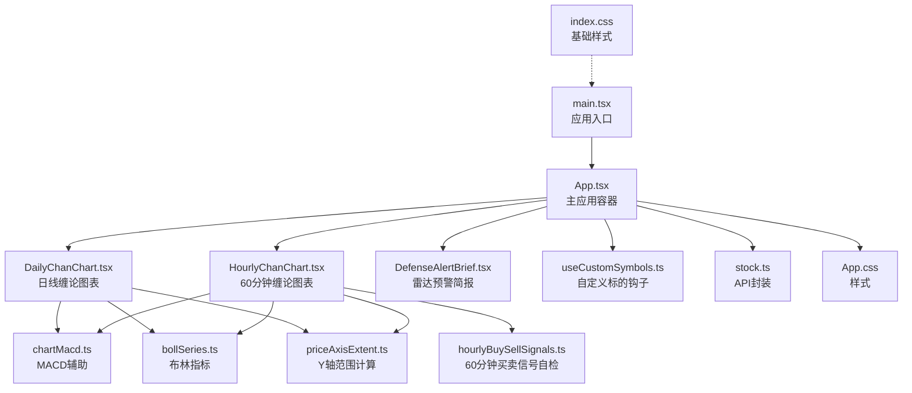
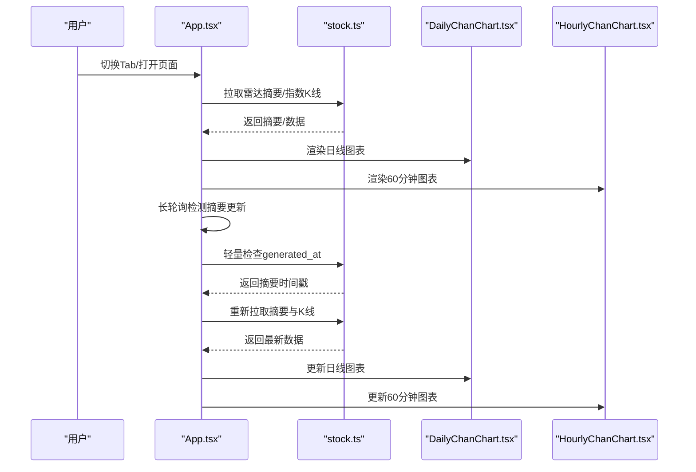
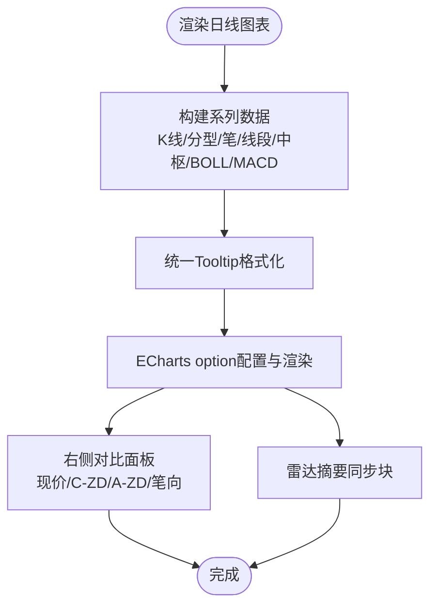
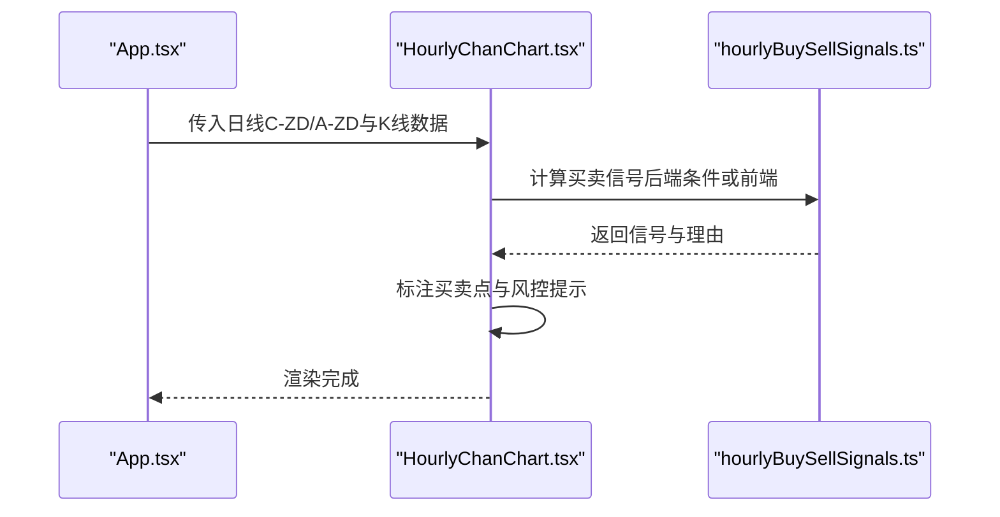
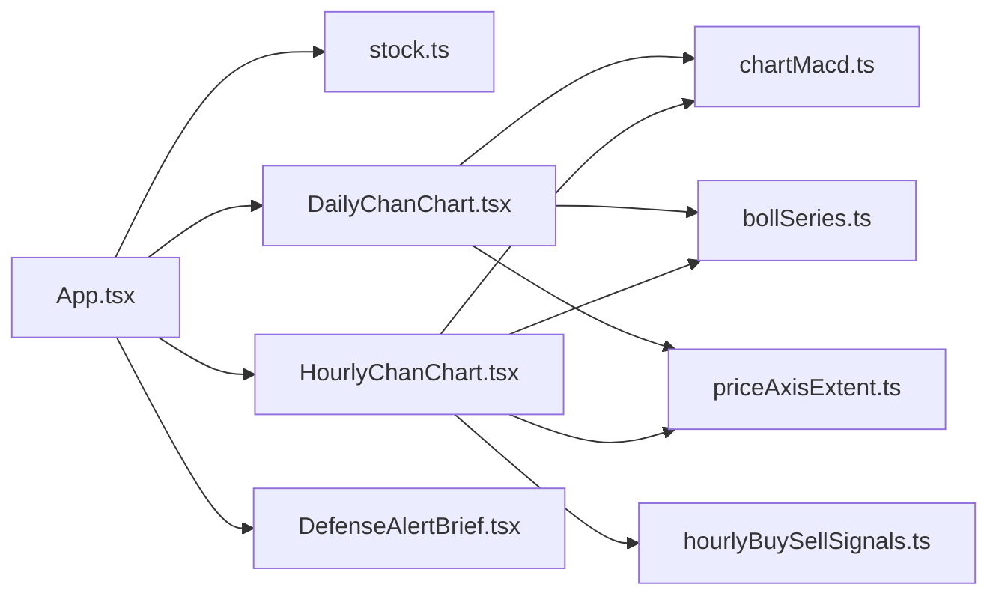

# 前端组件

<cite>
**本文引用的文件**
- [App.tsx](file://frontend/src/App.tsx)
- [DailyChanChart.tsx](file://frontend/src/DailyChanChart.tsx)
- [HourlyChanChart.tsx](file://frontend/src/HourlyChanChart.tsx)
- [DefenseAlertBrief.tsx](file://frontend/src/DefenseAlertBrief.tsx)
- [stock.ts](file://frontend/src/api/stock.ts)
- [bollSeries.ts](file://frontend/src/bollSeries.ts)
- [chartMacd.ts](file://frontend/src/chartMacd.ts)
- [hourlyBuySellSignals.ts](file://frontend/src/hourlyBuySellSignals.ts)
- [priceAxisExtent.ts](file://frontend/src/priceAxisExtent.ts)
- [useCustomSymbols.ts](file://frontend/src/hooks/useCustomSymbols.ts)
- [App.css](file://frontend/src/App.css)
- [index.css](file://frontend/src/index.css)
- [main.tsx](file://frontend/src/main.tsx)
</cite>

## 目录
1. [简介](#简介)
2. [项目结构](#项目结构)
3. [核心组件](#核心组件)
4. [架构总览](#架构总览)
5. [组件详解](#组件详解)
6. [依赖关系分析](#依赖关系分析)
7. [性能考量](#性能考量)
8. [故障排查指南](#故障排查指南)
9. [结论](#结论)
10. [附录](#附录)

## 简介
本文件面向前端React组件系统，聚焦于金融分析图表与雷达预警相关的组件文档。内容涵盖：
- 主应用组件App.tsx的Tab显隐策略、导航管理与全局状态控制
- 日线缠论图表DailyChanChart.tsx的ECharts集成、技术指标与缠论元素绘制
- 60分钟图表HourlyChanChart.tsx的特性、与日线图表的关联及买卖信号自检
- 雷达预警组件DefenseAlertBrief.tsx的作用与实现
- 各组件的props、事件处理、插槽与自定义选项
- 使用示例与代码片段路径
- 响应式设计与无障碍访问指导
- 组件状态、动画与过渡效果
- 样式自定义与主题支持
- 跨浏览器兼容性与性能优化建议

## 项目结构
前端位于frontend目录，采用Vite构建，核心入口为main.tsx渲染App.tsx。组件围绕缠论K线分析与雷达预警展开，数据通过API模块stock.ts从后端服务获取。

**图表来源**
- [main.tsx:1-11](file://frontend/src/main.tsx#L1-L11)
- [App.tsx:1-1552](file://frontend/src/App.tsx#L1-L1552)
- [DailyChanChart.tsx:1-820](file://frontend/src/DailyChanChart.tsx#L1-L820)
- [HourlyChanChart.tsx:1-1632](file://frontend/src/HourlyChanChart.tsx#L1-L1632)
- [DefenseAlertBrief.tsx:1-88](file://frontend/src/DefenseAlertBrief.tsx#L1-L88)
- [useCustomSymbols.ts:1-77](file://frontend/src/hooks/useCustomSymbols.ts#L1-L77)
- [chartMacd.ts:1-71](file://frontend/src/chartMacd.ts#L1-L71)
- [bollSeries.ts:1-34](file://frontend/src/bollSeries.ts#L1-L34)
- [priceAxisExtent.ts:1-52](file://frontend/src/priceAxisExtent.ts#L1-L52)
- [hourlyBuySellSignals.ts:1-1676](file://frontend/src/hourlyBuySellSignals.ts#L1-L1676)
- [stock.ts:1-468](file://frontend/src/api/stock.ts#L1-L468)
- [App.css:1-754](file://frontend/src/App.css#L1-L754)
- [index.css:1-25](file://frontend/src/index.css#L1-L25)

**章节来源**
- [main.tsx:1-11](file://frontend/src/main.tsx#L1-L11)
- [App.tsx:1-1552](file://frontend/src/App.tsx#L1-L1552)
- [App.css:1-754](file://frontend/src/App.css#L1-L754)
- [index.css:1-25](file://frontend/src/index.css#L1-L25)

## 核心组件
- App.tsx：负责Tab显隐策略、导航管理、全局状态（雷达摘要、K线数据、自定义标的、持仓/观察列表、错误状态）、长轮询与按需加载。
- DailyChanChart.tsx：基于ECharts的日线缠论图表，绘制K线、中枢、笔/线段、分型、背驰、BOLL与MACD，支持实时对比与雷达摘要展示。
- HourlyChanChart.tsx：60分钟图表，与日线共享中枢/笔/线段逻辑，叠加买卖信号自检与跨级别风控提示。
- DefenseAlertBrief.tsx：基于双防线（A-ZD/C-ZD）与现价的雷达预警简报，提供“一级/红色/安全”等状态。
- API模块stock.ts：封装指数/个股K线、雷达摘要、买卖信号、持仓等后端接口。
- 辅助模块：chartMacd.ts、bollSeries.ts、priceAxisExtent.ts、hourlyBuySellSignals.ts、useCustomSymbols.ts。

**章节来源**
- [App.tsx:598-1552](file://frontend/src/App.tsx#L598-L1552)
- [DailyChanChart.tsx:161-820](file://frontend/src/DailyChanChart.tsx#L161-L820)
- [HourlyChanChart.tsx:179-1632](file://frontend/src/HourlyChanChart.tsx#L179-L1632)
- [DefenseAlertBrief.tsx:28-88](file://frontend/src/DefenseAlertBrief.tsx#L28-L88)
- [stock.ts:185-468](file://frontend/src/api/stock.ts#L185-L468)
- [chartMacd.ts:1-71](file://frontend/src/chartMacd.ts#L1-L71)
- [bollSeries.ts:1-34](file://frontend/src/bollSeries.ts#L1-L34)
- [priceAxisExtent.ts:1-52](file://frontend/src/priceAxisExtent.ts#L1-L52)
- [hourlyBuySellSignals.ts:1-1676](file://frontend/src/hourlyBuySellSignals.ts#L1-L1676)
- [useCustomSymbols.ts:1-77](file://frontend/src/hooks/useCustomSymbols.ts#L1-L77)

## 架构总览
应用采用“主应用容器 + 多图表面板 + 雷达预警”的组合模式。App.tsx集中管理Tab集合、雷达摘要、K线数据与按需加载策略；图表组件通过props接收数据与配置，内部完成ECharts选项构建与渲染。

**图表来源**
- [App.tsx:811-925](file://frontend/src/App.tsx#L811-L925)
- [stock.ts:250-276](file://frontend/src/api/stock.ts#L250-L276)
- [DailyChanChart.tsx:161-820](file://frontend/src/DailyChanChart.tsx#L161-L820)
- [HourlyChanChart.tsx:179-1632](file://frontend/src/HourlyChanChart.tsx#L179-L1632)

## 组件详解

### App.tsx 主应用组件
- Tab显隐策略
  - 始终显示集合：自定义标的、持仓标的、观察标的
  - 条件触发显示：已注释，保留逻辑占位
  - 非常驻Tab：支持“×”关闭，关闭后不会因条件触发再次显示
  - 持久化：关闭与“常驻”Tab集合存储于localStorage
- 导航管理
  - 上证指数Tab始终存在；个股/ETF按规则生成
  - 持仓标的与观察标的Tab带有星号标识
  - 破位/买卖信号状态在Tab标题旁以“破/买/卖”徽标提示
- 全局状态控制
  - 雷达摘要：生成时间、60分钟笔向、7条件买点、预警原文
  - K线数据：日线/60分钟/15分钟，按需加载与预加载
  - 自定义标的：本地存储，支持添加/移除
  - 长轮询：每5分钟检查摘要更新，若有变化则刷新摘要与K线
- 性能与体验
  - 首屏仅拉取上证日线，其它按需加载
  - 预加载并发限制为2，避免阻塞交互
  - 页面可见性变化时同步刷新60/15分钟K线与摘要

**章节来源**
- [App.tsx:36-92](file://frontend/src/App.tsx#L36-L92)
- [App.tsx:473-486](file://frontend/src/App.tsx#L473-L486)
- [App.tsx:927-971](file://frontend/src/App.tsx#L927-L971)
- [App.tsx:1191-1269](file://frontend/src/App.tsx#L1191-L1269)
- [App.tsx:875-925](file://frontend/src/App.tsx#L875-L925)
- [useCustomSymbols.ts:1-77](file://frontend/src/hooks/useCustomSymbols.ts#L1-L77)

### DailyChanChart.tsx 日线缠论图表
- ECharts集成
  - 渲染器：SVG
  - 双轴：主图（K线+中枢/笔/线段/BOLL/MACD）与副图（MACD）
  - Tooltip：统一格式化，包含K线OHLC、BOLL、中枢提示与MACD数值
- 技术指标与缠论元素
  - 分型：顶/底分型散点标注
  - 笔：绿色（上）/红色（下）线条
  - 线段：紫色折线，沿有效笔端点转折
  - 中枢：ZG/DD/ZD标记与半透明框，潜在背驰加粗边框
  - BOLL(20,2)：上下轨、中轨与带宽堆叠
  - MACD：柱状图、DIF/DEA曲线
- 实时对比与雷达摘要
  - 右侧对比面板：现价、C-ZD/A-ZD对比、日线笔向
  - 雷达摘要同步块：摘要生成时间与原文
- props
  - data: IndexKlineResponse
  - seriesName: string
  - indexAlertKind?: DefenseAlertKind
  - isIndexSelf?: boolean
  - radarSummaryAlert?: string
  - radarSummaryGeneratedAt?: string
  - currentPrice?: number

**图表来源**
- [DailyChanChart.tsx:161-820](file://frontend/src/DailyChanChart.tsx#L161-L820)
- [chartMacd.ts:45-71](file://frontend/src/chartMacd.ts#L45-L71)
- [bollSeries.ts:1-34](file://frontend/src/bollSeries.ts#L1-L34)
- [priceAxisExtent.ts:7-39](file://frontend/src/priceAxisExtent.ts#L7-L39)

**章节来源**
- [DailyChanChart.tsx:161-820](file://frontend/src/DailyChanChart.tsx#L161-L820)
- [chartMacd.ts:1-71](file://frontend/src/chartMacd.ts#L1-L71)
- [bollSeries.ts:1-34](file://frontend/src/bollSeries.ts#L1-L34)
- [priceAxisExtent.ts:1-52](file://frontend/src/priceAxisExtent.ts#L1-L52)

### HourlyChanChart.tsx 60分钟图表
- 特点
  - 与日线共享中枢/笔/线段逻辑，确保级别一致性
  - 右侧对比面板：日线C-ZD/A-ZD相对偏差、当前笔向
  - 买卖信号自检：一买/二买/三买、一卖/二卖/三卖，支持后端7条件或前端实时计算
  - 跨级别风控：日线破位强制降级、高乖离警告、核心伏击圈提示
- 买卖信号自检
  - 一买：趋势/盘整底背驰，止损线与理由清单
  - 二买：回踩不创新低、MACD动能过滤、回撤深度限制
  - 三买：突破中枢上沿后回踩不跌破，水上漂MACD
  - 卖点分级：弱卖/半仓/清仓，依据日线防线与MACD状态
- props
  - data: IndexKlineResponse
  - seriesName: string
  - dailyAZd: number | null
  - dailyCZd: number | null
  - dailyMacd?: { macd: number }
  - buyConditions?: HourlyBuyConditions
  - holdingInfo?: HoldingInfo

**图表来源**
- [HourlyChanChart.tsx:179-1632](file://frontend/src/HourlyChanChart.tsx#L179-L1632)
- [hourlyBuySellSignals.ts:122-148](file://frontend/src/hourlyBuySellSignals.ts#L122-L148)

**章节来源**
- [HourlyChanChart.tsx:179-1632](file://frontend/src/HourlyChanChart.tsx#L179-L1632)
- [hourlyBuySellSignals.ts:1-1676](file://frontend/src/hourlyBuySellSignals.ts#L1-L1676)

### DefenseAlertBrief.tsx 雷达预警组件
- 功能
  - 基于日线C-ZD与A-ZD与现价划分双防线，输出“一级/红色/安全”等状态
  - 展示核心伏击圈区间与现价位置，支持无障碍role与语义化标签
- props
  - price: number
  - cZd: number | null
  - aZd: number | null

**章节来源**
- [DefenseAlertBrief.tsx:28-88](file://frontend/src/DefenseAlertBrief.tsx#L28-L88)

### 组件属性、事件与插槽
- DailyChanChart
  - props: data, seriesName, indexAlertKind, isIndexSelf, radarSummaryAlert, radarSummaryGeneratedAt, currentPrice
  - 事件：无（纯展示）
  - 插槽：无（通过props注入数据）
- HourlyChanChart
  - props: data, seriesName, dailyAZd, dailyCZd, dailyMacd, buyConditions, holdingInfo
  - 事件：无（纯展示）
  - 插槽：无（通过props注入数据）
- DefenseAlertBrief
  - props: price, cZd, aZd
  - 事件：无（纯展示）
  - 插槽：无（通过props注入数据）

**章节来源**
- [DailyChanChart.tsx:161-183](file://frontend/src/DailyChanChart.tsx#L161-L183)
- [HourlyChanChart.tsx:179-200](file://frontend/src/HourlyChanChart.tsx#L179-L200)
- [DefenseAlertBrief.tsx:28-36](file://frontend/src/DefenseAlertBrief.tsx#L28-L36)

### 使用示例与代码片段路径
- 在App.tsx中渲染日线图表
  - [App.tsx:1426-1440](file://frontend/src/App.tsx#L1426-L1440)
- 在App.tsx中渲染60分钟图表
  - [App.tsx:1444-1457](file://frontend/src/App.tsx#L1444-L1457)
- 在App.tsx中渲染15分钟图表
  - [App.tsx:1461-1474](file://frontend/src/App.tsx#L1461-L1474)
- 在App.tsx中渲染个股日线图表
  - [App.tsx:1483-1495](file://frontend/src/App.tsx#L1483-L1495)
- 在App.tsx中渲染个股60分钟图表
  - [App.tsx:1506-1518](file://frontend/src/App.tsx#L1506-L1518)
- 在App.tsx中渲染个股15分钟图表
  - [App.tsx:1526-1538](file://frontend/src/App.tsx#L1526-L1538)

**章节来源**
- [App.tsx:1426-1538](file://frontend/src/App.tsx#L1426-L1538)

## 依赖关系分析
- 组件耦合
  - App.tsx是中心协调者，依赖API模块与多个图表组件
  - 图表组件依赖辅助模块（MACD/BOLL/价格轴范围/买卖信号）
- 外部依赖
  - ECharts-for-react用于图表渲染
  - 后端服务提供K线、雷达摘要、买卖信号等数据
- 循环依赖
  - 未发现循环导入；模块职责清晰

**图表来源**
- [App.tsx:1-1552](file://frontend/src/App.tsx#L1-L1552)
- [stock.ts:1-468](file://frontend/src/api/stock.ts#L1-L468)
- [DailyChanChart.tsx:1-820](file://frontend/src/DailyChanChart.tsx#L1-L820)
- [HourlyChanChart.tsx:1-1632](file://frontend/src/HourlyChanChart.tsx#L1-L1632)
- [DefenseAlertBrief.tsx:1-88](file://frontend/src/DefenseAlertBrief.tsx#L1-L88)
- [chartMacd.ts:1-71](file://frontend/src/chartMacd.ts#L1-L71)
- [bollSeries.ts:1-34](file://frontend/src/bollSeries.ts#L1-L34)
- [priceAxisExtent.ts:1-52](file://frontend/src/priceAxisExtent.ts#L1-L52)
- [hourlyBuySellSignals.ts:1-1676](file://frontend/src/hourlyBuySellSignals.ts#L1-L1676)

**章节来源**
- [App.tsx:1-1552](file://frontend/src/App.tsx#L1-L1552)
- [stock.ts:1-468](file://frontend/src/api/stock.ts#L1-L468)

## 性能考量
- 按需加载与预加载
  - 首屏仅拉取上证日线，其它按需加载；对可见Tab进行低并发预加载（2路），避免阻塞交互
- 长轮询与增量刷新
  - 每5分钟检查摘要生成时间，变化时仅刷新摘要与K线，避免整页重绘
- ECharts渲染优化
  - 使用notMerge与SVG渲染器，减少重绘成本
  - dataZoom使用inside/slider，避免每次option更新重置缩放
- Y轴范围稳定
  - 仅用OHLC与关键价位参与极值计算，避免异常辅助线拉宽Y轴

**章节来源**
- [App.tsx:1191-1269](file://frontend/src/App.tsx#L1191-L1269)
- [App.tsx:875-925](file://frontend/src/App.tsx#L875-L925)
- [DailyChanChart.tsx:412-415](file://frontend/src/DailyChanChart.tsx#L412-L415)
- [priceAxisExtent.ts:7-39](file://frontend/src/priceAxisExtent.ts#L7-L39)

## 故障排查指南
- 雷达摘要拉取失败
  - 现象：仅显示常驻Tab，不显示条件触发Tab
  - 处理：检查后端服务可用性与网络连接；查看控制台错误
  - 参考
    - [App.tsx:811-869](file://frontend/src/App.tsx#L811-L869)
- K线数据拉取失败
  - 现象：图表区块出现错误提示
  - 处理：检查后端接口返回与缓存状态；确认symbol/period/start_date参数
  - 参考
    - [stock.ts:185-215](file://frontend/src/api/stock.ts#L185-L215)
- 买卖信号不显示
  - 现象：Tab旁无“买/卖”徽标
  - 处理：确认后端定时计算是否生成buy-sell-signals.json；检查本地缓存
  - 参考
    - [stock.ts:431-446](file://frontend/src/api/stock.ts#L431-L446)
- 图表渲染异常
  - 现象：坐标轴异常、标记错位
  - 处理：检查数据完整性（OHLC/BOLL/MACD）；确认日期序列与索引映射
  - 参考
    - [chartMacd.ts:1-71](file://frontend/src/chartMacd.ts#L1-L71)
    - [bollSeries.ts:1-34](file://frontend/src/bollSeries.ts#L1-L34)
    - [priceAxisExtent.ts:1-52](file://frontend/src/priceAxisExtent.ts#L1-L52)

**章节来源**
- [App.tsx:811-869](file://frontend/src/App.tsx#L811-L869)
- [stock.ts:185-215](file://frontend/src/api/stock.ts#L185-L215)
- [stock.ts:431-446](file://frontend/src/api/stock.ts#L431-L446)
- [chartMacd.ts:1-71](file://frontend/src/chartMacd.ts#L1-L71)
- [bollSeries.ts:1-34](file://frontend/src/bollSeries.ts#L1-L34)
- [priceAxisExtent.ts:1-52](file://frontend/src/priceAxisExtent.ts#L1-L52)

## 结论
本组件体系以App.tsx为核心，结合DailyChanChart与HourlyChanChart实现从日线到60分钟级别的缠论分析，配合DefenseAlertBrief提供双防线雷达预警。通过按需加载、长轮询与预加载策略，兼顾性能与用户体验；通过统一的数据模型与辅助模块，确保图表渲染与业务逻辑的稳定性。

## 附录

### 响应式设计与无障碍访问
- 响应式设计
  - 日线图表容器高度使用clamp，适配不同视口
  - 日线对比面板在窄屏下变为纵向布局
  - 参考
    - [App.css:220-221](file://frontend/src/App.css#L220-L221)
    - [App.css:526-536](file://frontend/src/App.css#L526-L536)
- 无障碍访问
  - Tablist使用role="tablist"与aria-label
  - Tab使用role="tab"与aria-selected
  - 预警面板使用role="status"
  - 参考
    - [App.tsx:1324-1325](file://frontend/src/App.tsx#L1324-L1325)
    - [App.tsx:1340-1341](file://frontend/src/App.tsx#L1340-L1341)
    - [DefenseAlertBrief.tsx:49-63](file://frontend/src/DefenseAlertBrief.tsx#L49-L63)

**章节来源**
- [App.css:220-221](file://frontend/src/App.css#L220-L221)
- [App.css:526-536](file://frontend/src/App.css#L526-L536)
- [App.tsx:1324-1341](file://frontend/src/App.tsx#L1324-L1341)
- [DefenseAlertBrief.tsx:49-63](file://frontend/src/DefenseAlertBrief.tsx#L49-L63)

### 样式自定义与主题支持
- 主题变量
  - 字体、行高、抗锯齿等基础变量在index.css中定义
  - 参考
    - [index.css:1-25](file://frontend/src/index.css#L1-L25)
- 组件样式
  - 日线/小时图表壳、对比面板、雷达摘要块、Tab样式等在App.css中定义
  - 参考
    - [App.css:224-280](file://frontend/src/App.css#L224-L280)
    - [App.css:340-362](file://frontend/src/App.css#L340-L362)
    - [App.css:363-439](file://frontend/src/App.css#L363-L439)
    - [App.css:504-524](file://frontend/src/App.css#L504-L524)

**章节来源**
- [index.css:1-25](file://frontend/src/index.css#L1-L25)
- [App.css:224-280](file://frontend/src/App.css#L224-L280)
- [App.css:340-362](file://frontend/src/App.css#L340-L362)
- [App.css:363-439](file://frontend/src/App.css#L363-L439)
- [App.css:504-524](file://frontend/src/App.css#L504-L524)

### 跨浏览器兼容性
- ECharts SVG渲染器提升跨浏览器一致性
- 日期格式化与数值格式化在辅助模块中统一处理
- 参考
  - [DailyChanChart.tsx:412-415](file://frontend/src/DailyChanChart.tsx#L412-L415)
  - [priceAxisExtent.ts:42-51](file://frontend/src/priceAxisExtent.ts#L42-L51)

**章节来源**
- [DailyChanChart.tsx:412-415](file://frontend/src/DailyChanChart.tsx#L412-L415)
- [priceAxisExtent.ts:42-51](file://frontend/src/priceAxisExtent.ts#L42-L51)