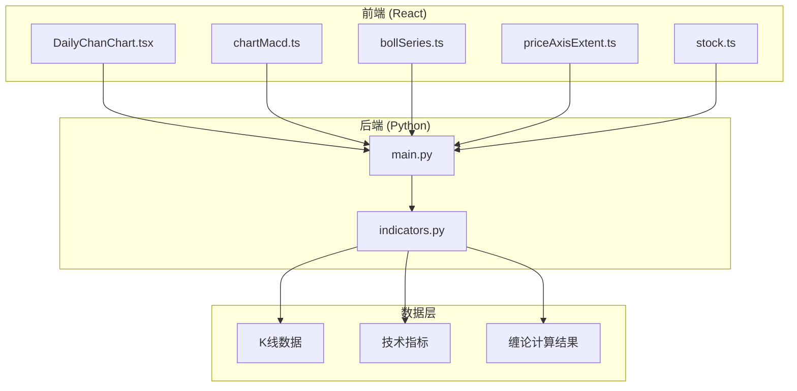
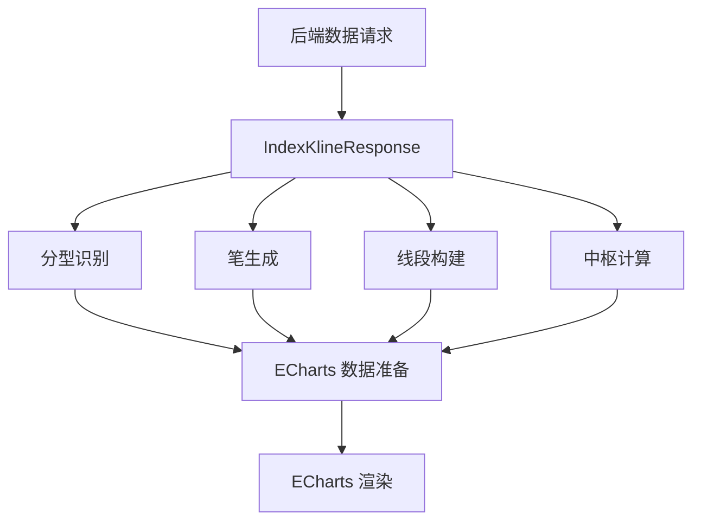
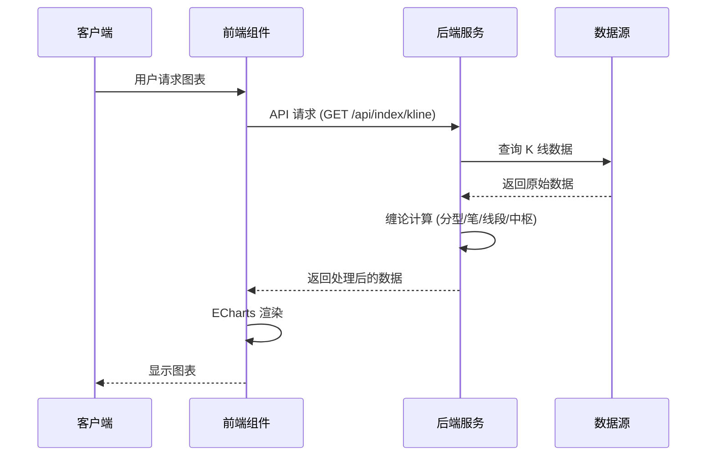
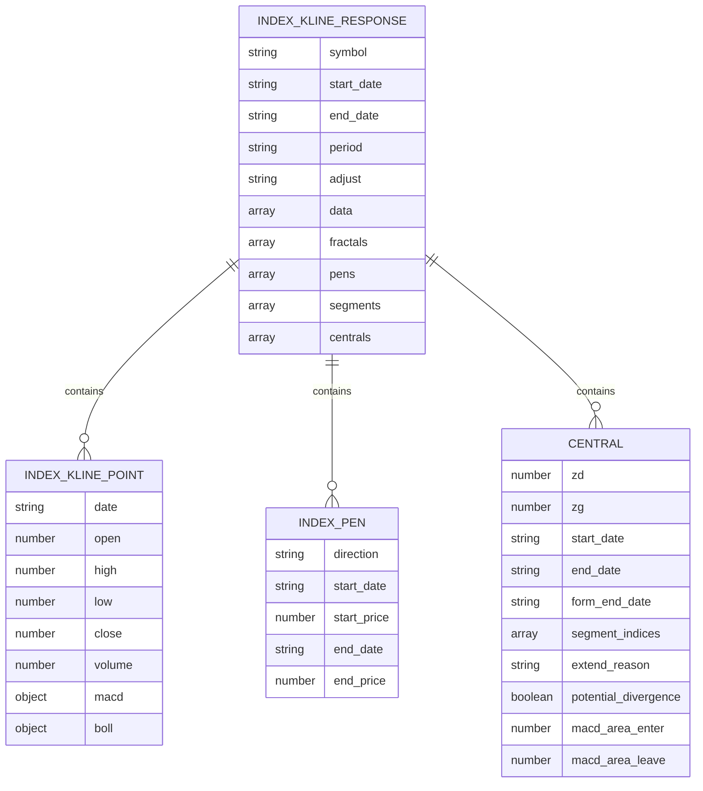
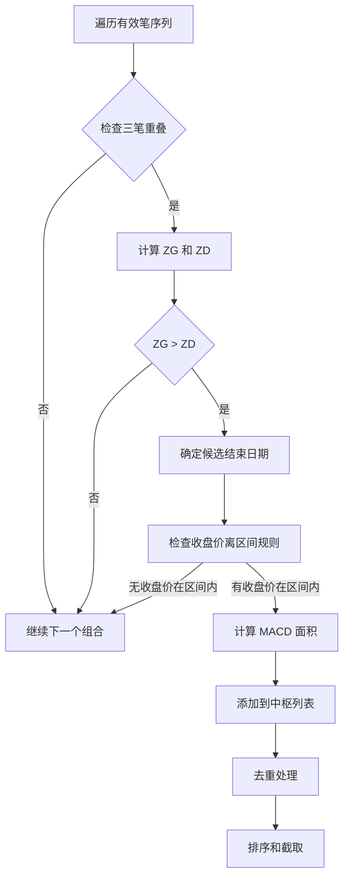
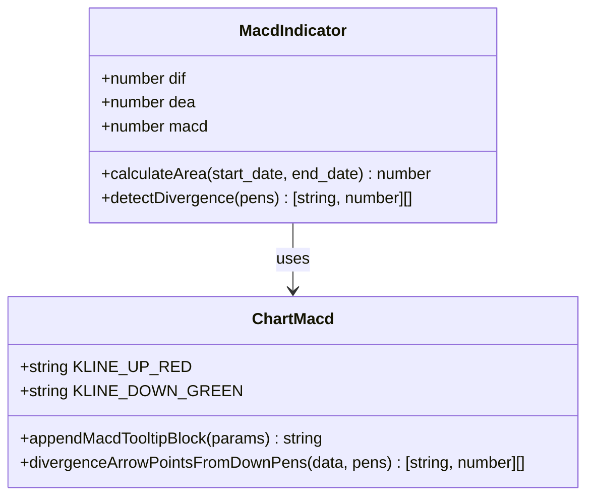
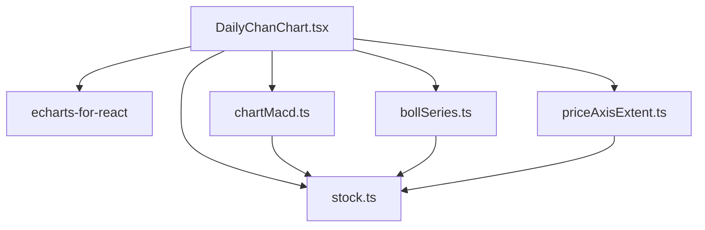
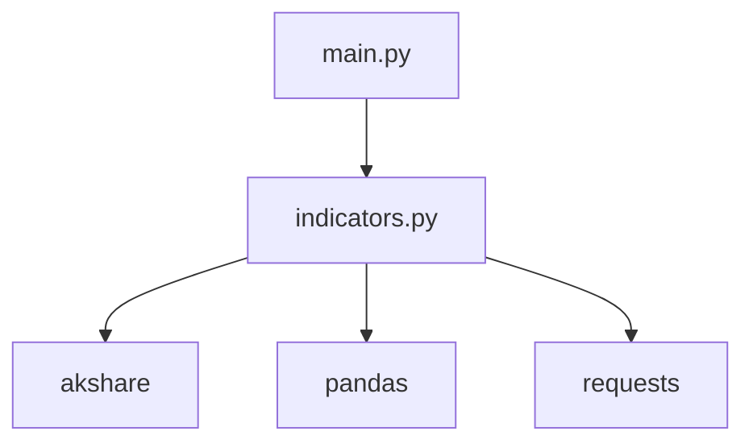

# 日线缠论图表组件

<cite>
**本文档引用的文件**
- [DailyChanChart.tsx](file://frontend/src/DailyChanChart.tsx)
- [chartMacd.ts](file://frontend/src/chartMacd.ts)
- [bollSeries.ts](file://frontend/src/bollSeries.ts)
- [priceAxisExtent.ts](file://frontend/src/priceAxisExtent.ts)
- [stock.ts](file://frontend/src/api/stock.ts)
- [indicators.py](file://backend/services/indicators.py)
- [main.py](file://backend/main.py)
</cite>

## 目录
1. [简介](#简介)
2. [项目结构](#项目结构)
3. [核心组件](#核心组件)
4. [架构概览](#架构概览)
5. [详细组件分析](#详细组件分析)
6. [依赖分析](#依赖分析)
7. [性能考虑](#性能考虑)
8. [故障排除指南](#故障排除指南)
9. [结论](#结论)

## 简介

DailyChanChart 是一个基于 ECharts 实现的专业金融图表组件，专门用于展示日线级别的缠论分析图表。该组件集成了 K 线图绘制、技术指标叠加、缠论元素标注等功能，为用户提供全面的日线分析工具。

该组件的核心特色包括：
- 专业的缠论中枢计算和显示逻辑
- 多层次的技术指标集成（MACD、布林带、KDJ）
- 实时数据更新机制
- 丰富的用户交互功能
- 性能优化策略

## 项目结构

项目采用前后端分离架构，前端使用 React + TypeScript，后端使用 Python + FastAPI：

**图表来源**
- [DailyChanChart.tsx:1-820](file://frontend/src/DailyChanChart.tsx#L1-L820)
- [main.py:1-514](file://backend/main.py#L1-L514)
- [indicators.py:1644-1947](file://backend/services/indicators.py#L1644-L1947)

**章节来源**
- [DailyChanChart.tsx:1-820](file://frontend/src/DailyChanChart.tsx#L1-L820)
- [main.py:1-514](file://backend/main.py#L1-L514)

## 核心组件

### DailyChanChart 组件

DailyChanChart 是整个系统的核心组件，负责渲染完整的缠论日线图表。该组件实现了以下关键功能：

#### 主要功能特性

1. **K 线图绘制**：使用 ECharts 的 candlestick 类型绘制 OHLC K 线
2. **缠论元素标注**：显示分型、笔、线段和中枢
3. **技术指标叠加**：集成 MACD、布林带等技术指标
4. **实时数据更新**：支持盘中数据的动态更新
5. **用户交互**：缩放、平移、指标切换等操作

#### 数据流处理

组件通过以下流程处理数据：

**图表来源**
- [DailyChanChart.tsx:161-820](file://frontend/src/DailyChanChart.tsx#L161-L820)
- [indicators.py:1429-1493](file://backend/services/indicators.py#L1429-L1493)

**章节来源**
- [DailyChanChart.tsx:161-820](file://frontend/src/DailyChanChart.tsx#L161-L820)

### 技术指标模块

#### MACD 指标模块

chartMacd.ts 提供了 MACD 相关的计算和可视化功能：

- **背驰检测**：通过 MACD 绿柱面积比较识别底背驰
- **颜色配置**：统一涨跌颜色标准
- **提示信息**：MACD 指标数值的详细显示

#### 布林带模块

bollSeries.ts 负责布林带数据的处理：

- **数据提取**：从 K 线数据中提取布林带参数
- **极值计算**：参与主图 Y 轴范围计算
- **可视化配置**：布林带的样式和透明度设置

**章节来源**
- [chartMacd.ts:1-71](file://frontend/src/chartMacd.ts#L1-L71)
- [bollSeries.ts:1-34](file://frontend/src/bollSeries.ts#L1-L34)

## 架构概览

### 前后端交互架构

**图表来源**
- [main.py:140-168](file://backend/main.py#L140-L168)
- [indicators.py:1644-1947](file://backend/services/indicators.py#L1644-L1947)

### 数据模型架构

**图表来源**
- [stock.ts:69-112](file://frontend/src/api/stock.ts#L69-L112)

**章节来源**
- [stock.ts:43-112](file://frontend/src/api/stock.ts#L43-L112)

## 详细组件分析

### 缠论中枢计算与显示

#### 中枢识别算法

中枢计算是缠论分析的核心，采用了严格的数学定义：

1. **三笔重叠原则**：连续三笔的端点价域必须满足 ZG=min(g)>ZD=max(d)
2. **时间范围确定**：使用候选结束日期和收盘价离区间规则确定中枢可视时间范围
3. **去重机制**：按精度要求去除重复的中枢
4. **排序策略**：按距离当前价格的远近和结束日期排序

**图表来源**
- [indicators.py:1429-1493](file://backend/services/indicators.py#L1429-L1493)

#### 中枢时间轴排序

中枢的排序遵循双重标准：

1. **结束日期降序**：最新的中枢排在前面
2. **距离价格排序**：当前价格越接近中枢的中枢优先显示

这种排序确保了用户能够优先看到最重要的中枢信息。

**章节来源**
- [indicators.py:1489-1492](file://backend/services/indicators.py#L1489-L1492)

### 技术指标集成

#### MACD 指标集成

MACD 指标通过以下方式集成到图表中：

1. **背驰检测**：通过比较相邻向下笔的 MACD 绿柱面积识别底背驰
2. **可视化配置**：使用统一的颜色方案和样式
3. **实时更新**：支持盘中数据的动态更新

**图表来源**
- [chartMacd.ts:1-71](file://frontend/src/chartMacd.ts#L1-L71)

#### 布林带集成

布林带通过以下方式与 K 线图集成：

1. **数据提取**：从 K 线数据中提取布林带参数
2. **堆叠显示**：布林带上下轨和中轨的堆叠显示
3. **透明度控制**：通过透明度区分不同层级

**章节来源**
- [bollSeries.ts:1-34](file://frontend/src/bollSeries.ts#L1-L34)

### 用户交互功能

#### 缩放和平移

组件实现了完整的缩放和平移功能：

1. **内部缩放**：支持鼠标滚轮缩放
2. **滑块缩放**：底部滑块提供直观的缩放控制
3. **平移功能**：支持水平方向的数据浏览

#### 指标切换

用户可以通过图例控制技术指标的显示：

1. **MACD 指标**：DIF、DEA、MACD 柱状图
2. **布林带**：上下轨和中轨
3. **分型标记**：顶分型和底分型

#### 买卖信号显示

组件集成了多种买卖信号的可视化：

1. **底背驰标记**：使用特殊符号标记潜在的买入机会
2. **中枢状态**：根据当前价格与中枢的关系改变颜色
3. **实时对比**：显示当前价格与中枢下沿的相对关系

**章节来源**
- [DailyChanChart.tsx:419-734](file://frontend/src/DailyChanChart.tsx#L419-L734)

## 依赖分析

### 前端依赖关系

**图表来源**
- [DailyChanChart.tsx:1-16](file://frontend/src/DailyChanChart.tsx#L1-L16)

### 后端依赖关系

**图表来源**
- [main.py:14-20](file://backend/main.py#L14-L20)
- [indicators.py:12-16](file://backend/services/indicators.py#L12-L16)

**章节来源**
- [DailyChanChart.tsx:1-16](file://frontend/src/DailyChanChart.tsx#L1-L16)
- [main.py:14-20](file://backend/main.py#L14-L20)

## 性能考虑

### 大数据量处理

组件采用了多项优化策略来处理大量数据：

1. **数据分页**：后端按需返回数据，避免一次性传输大量数据
2. **缓存机制**：前后端都实现了缓存策略
3. **增量更新**：支持部分数据的增量更新

### 渲染优化

1. **SVG 渲染**：使用 SVG 渲染器提高矢量图形质量
2. **图层管理**：通过 z-index 控制图层顺序，避免重绘
3. **样式复用**：统一的颜色和样式配置减少计算开销

### 内存管理

1. **数据清理**：及时清理不需要的数据结构
2. **对象池**：复用 ECharts 实例和配置对象
3. **垃圾回收**：合理管理事件监听器和定时器

## 故障排除指南

### 常见问题诊断

#### 数据加载失败

**症状**：图表无法显示或显示空白

**排查步骤**：
1. 检查网络连接状态
2. 验证 API 端点是否可达
3. 查看浏览器开发者工具的网络面板
4. 检查后端服务日志

#### 中枢计算异常

**症状**：中枢显示不正确或缺失

**排查步骤**：
1. 验证输入数据的质量
2. 检查有效笔的生成逻辑
3. 确认三笔重叠判断的准确性
4. 验证去重和排序算法

#### 性能问题

**症状**：图表渲染缓慢或卡顿

**排查步骤**：
1. 检查数据量大小
2. 监控内存使用情况
3. 分析渲染时间分布
4. 优化数据处理逻辑

**章节来源**
- [indicators.py:1644-1947](file://backend/services/indicators.py#L1644-L1947)

## 结论

DailyChanChart 日线缠论图表组件是一个功能完整、性能优化的专业金融图表解决方案。该组件成功地将复杂的缠论分析与现代前端技术相结合，为用户提供了直观、准确的分析工具。

### 主要优势

1. **专业性**：严格按照缠论理论实现，确保分析结果的准确性
2. **完整性**：集成了多种技术指标和可视化元素
3. **性能优化**：采用多种优化策略确保流畅的用户体验
4. **可扩展性**：模块化设计便于功能扩展和定制

### 技术亮点

1. **精确的中枢计算**：实现了严格的缠论中枢识别算法
2. **丰富的交互功能**：提供了完整的用户交互体验
3. **高效的数据处理**：优化了大数据量下的性能表现
4. **统一的视觉设计**：保持了一致的视觉风格和用户体验

该组件为金融分析领域提供了一个优秀的参考实现，展示了如何将复杂的理论与实用的工具相结合，为用户提供有价值的分析洞察。