# 自定义标的添加器

<cite>
**本文档引用的文件**
- [CustomSymbolAdder.tsx](file://frontend/src/components/CustomSymbolAdder.tsx)
- [useCustomSymbols.ts](file://frontend/src/hooks/useCustomSymbols.ts)
- [App.tsx](file://frontend/src/App.tsx)
- [stock.ts](file://frontend/src/api/stock.ts)
- [App.css](file://frontend/src/App.css)
- [index.css](file://frontend/src/index.css)
</cite>

## 目录
1. [简介](#简介)
2. [项目结构](#项目结构)
3. [核心组件](#核心组件)
4. [架构概览](#架构概览)
5. [详细组件分析](#详细组件分析)
6. [依赖关系分析](#依赖关系分析)
7. [性能考虑](#性能考虑)
8. [故障排除指南](#故障排除指南)
9. [结论](#结论)
10. [附录](#附录)

## 简介

自定义标的添加器是金融分析系统中的关键组件，允许用户添加和管理自定义的股票、ETF或其他金融产品标的。该组件提供了直观的用户界面，支持自动代码验证、智能名称获取、重复检查和动态标签生成等功能。组件与全局状态管理系统深度集成，实现了数据的持久化存储和实时同步。

## 项目结构

自定义标的添加器位于前端项目的组件目录中，采用模块化设计，与其他核心组件协同工作：

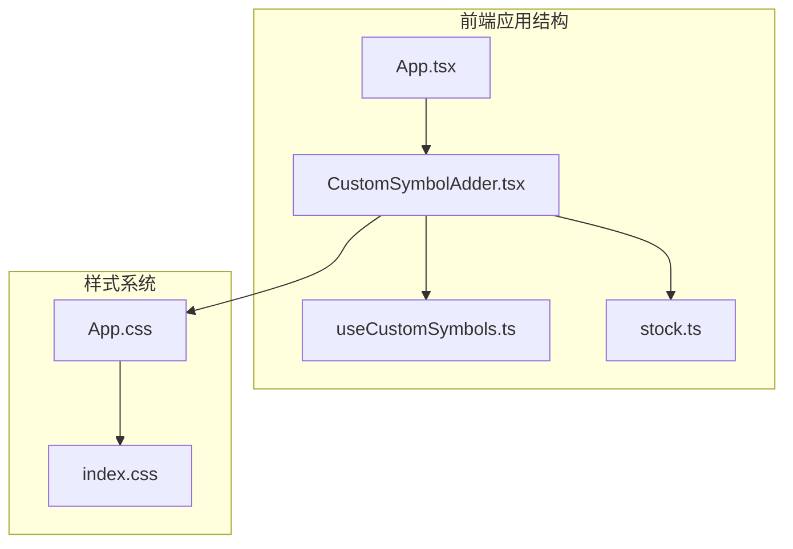

**图表来源**
- [App.tsx:598-1424](file://frontend/src/App.tsx#L598-L1424)
- [CustomSymbolAdder.tsx:30-192](file://frontend/src/components/CustomSymbolAdder.tsx#L30-L192)
- [useCustomSymbols.ts:11-77](file://frontend/src/hooks/useCustomSymbols.ts#L11-L77)

**章节来源**
- [App.tsx:598-1424](file://frontend/src/App.tsx#L598-L1424)
- [CustomSymbolAdder.tsx:30-192](file://frontend/src/components/CustomSymbolAdder.tsx#L30-L192)
- [useCustomSymbols.ts:11-77](file://frontend/src/hooks/useCustomSymbols.ts#L11-L77)

## 核心组件

### 组件架构设计

自定义标的添加器采用React函数组件模式，结合React Hooks实现状态管理和副作用处理：

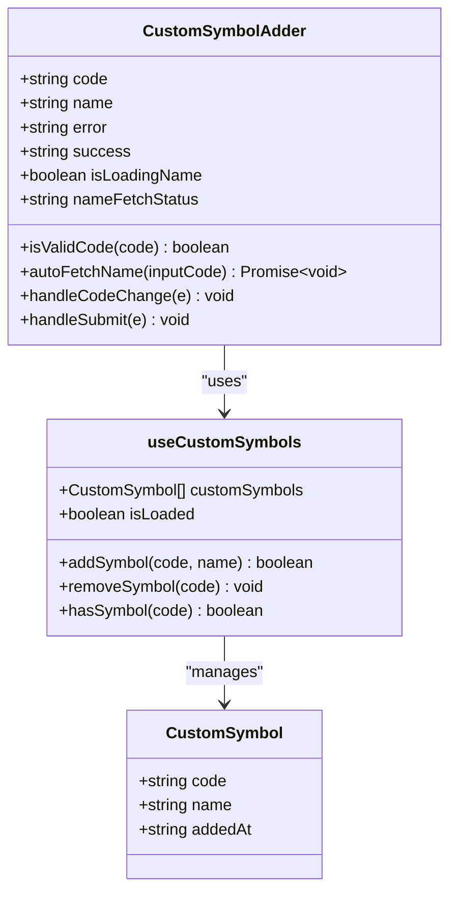

**图表来源**
- [CustomSymbolAdder.tsx:30-192](file://frontend/src/components/CustomSymbolAdder.tsx#L30-L192)
- [useCustomSymbols.ts:5-77](file://frontend/src/hooks/useCustomSymbols.ts#L5-L77)

### 数据流架构

组件内部的数据流遵循单向数据流原则，确保状态的一致性和可预测性：

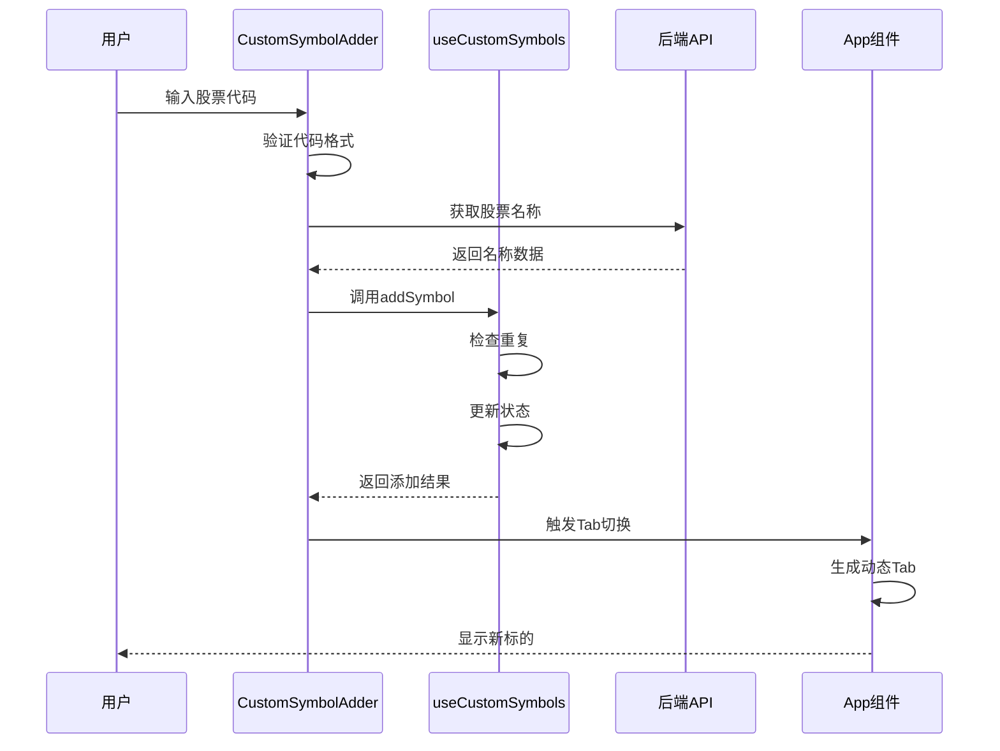

**图表来源**
- [CustomSymbolAdder.tsx:99-126](file://frontend/src/components/CustomSymbolAdder.tsx#L99-L126)
- [useCustomSymbols.ts:42-59](file://frontend/src/hooks/useCustomSymbols.ts#L42-L59)
- [App.tsx:1404-1424](file://frontend/src/App.tsx#L1404-L1424)

**章节来源**
- [CustomSymbolAdder.tsx:30-192](file://frontend/src/components/CustomSymbolAdder.tsx#L30-L192)
- [useCustomSymbols.ts:11-77](file://frontend/src/hooks/useCustomSymbols.ts#L11-L77)
- [App.tsx:598-1424](file://frontend/src/App.tsx#L598-L1424)

## 架构概览

### 系统集成架构

自定义标的添加器与整个应用生态系统紧密集成，形成完整的金融分析解决方案：

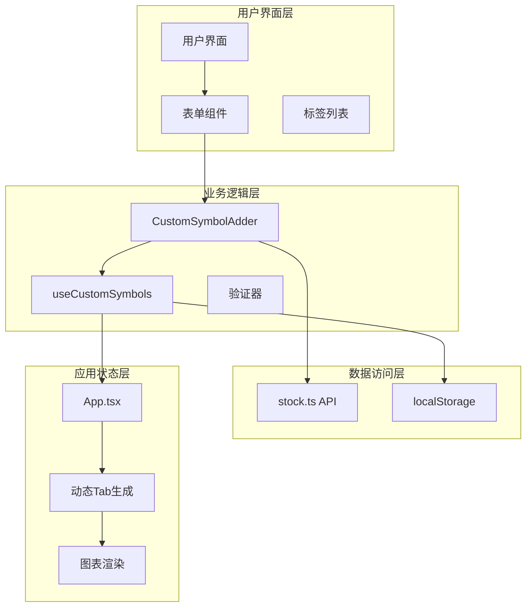

**图表来源**
- [App.tsx:488-526](file://frontend/src/App.tsx#L488-L526)
- [CustomSymbolAdder.tsx:30-192](file://frontend/src/components/CustomSymbolAdder.tsx#L30-L192)
- [useCustomSymbols.ts:11-77](file://frontend/src/hooks/useCustomSymbols.ts#L11-L77)

### 状态管理模式

组件采用集中式状态管理，通过React Hooks实现状态的响应式更新：

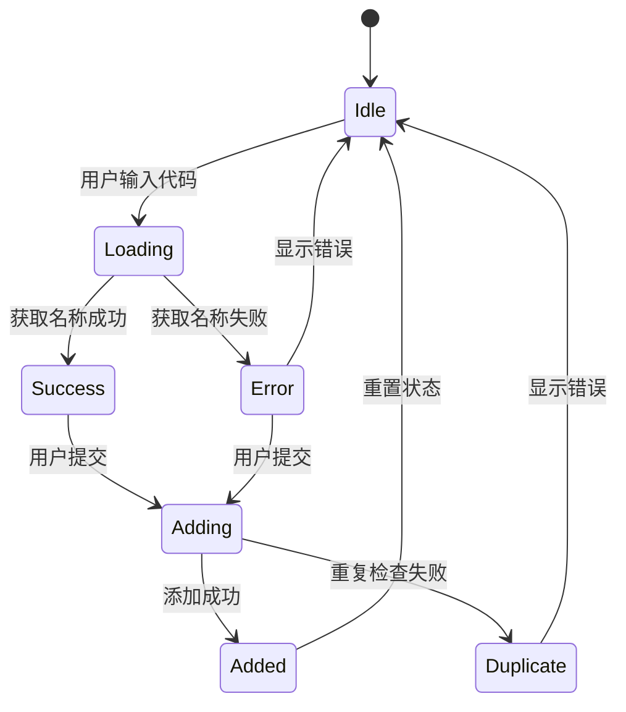

**图表来源**
- [CustomSymbolAdder.tsx:36-80](file://frontend/src/components/CustomSymbolAdder.tsx#L36-L80)
- [CustomSymbolAdder.tsx:99-126](file://frontend/src/components/CustomSymbolAdder.tsx#L99-L126)

**章节来源**
- [App.tsx:488-526](file://frontend/src/App.tsx#L488-L526)
- [CustomSymbolAdder.tsx:36-126](file://frontend/src/components/CustomSymbolAdder.tsx#L36-L126)

## 详细组件分析

### 用户界面设计

#### 布局结构

组件采用简洁的两行布局设计，第一行为输入表单，第二行为自定义标的列表：

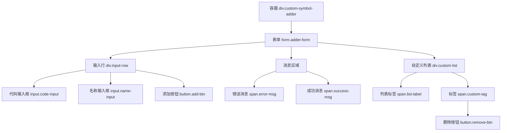

**图表来源**
- [CustomSymbolAdder.tsx:128-190](file://frontend/src/components/CustomSymbolAdder.tsx#L128-L190)

#### 交互设计

组件实现了丰富的用户交互反馈机制：

| 状态 | 视觉反馈 | 用户体验 |
|------|----------|----------|
| 输入中 | 边框高亮蓝色 | 提示用户输入状态 |
| 加载中 | 禁用输入框 | 防止重复操作 |
| 成功 | 绿色边框和背景 | 确认操作成功 |
| 错误 | 红色边框和错误提示 | 明确错误原因 |

**章节来源**
- [CustomSymbolAdder.tsx:128-190](file://frontend/src/components/CustomSymbolAdder.tsx#L128-L190)
- [App.css:627-754](file://frontend/src/App.css#L627-L754)

### 添加流程详解

#### 代码验证流程

组件实现了多层次的代码验证机制：

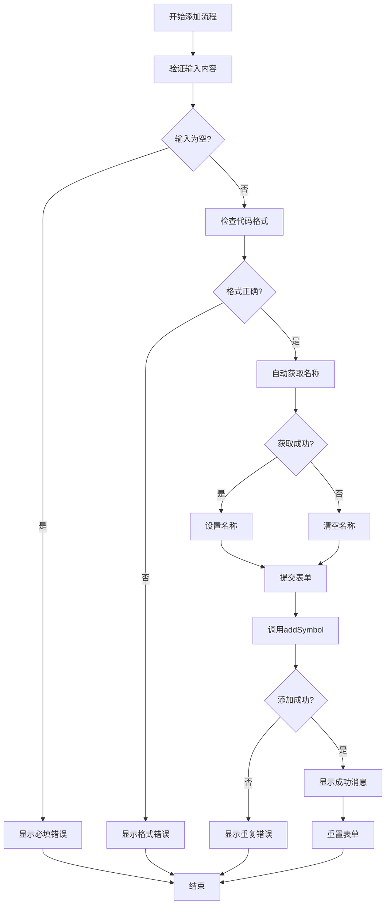

**图表来源**
- [CustomSymbolAdder.tsx:38-45](file://frontend/src/components/CustomSymbolAdder.tsx#L38-L45)
- [CustomSymbolAdder.tsx:99-126](file://frontend/src/components/CustomSymbolAdder.tsx#L99-L126)

#### 动态Tab生成机制

组件与App.tsx深度集成，实现了自定义标的的动态Tab生成：

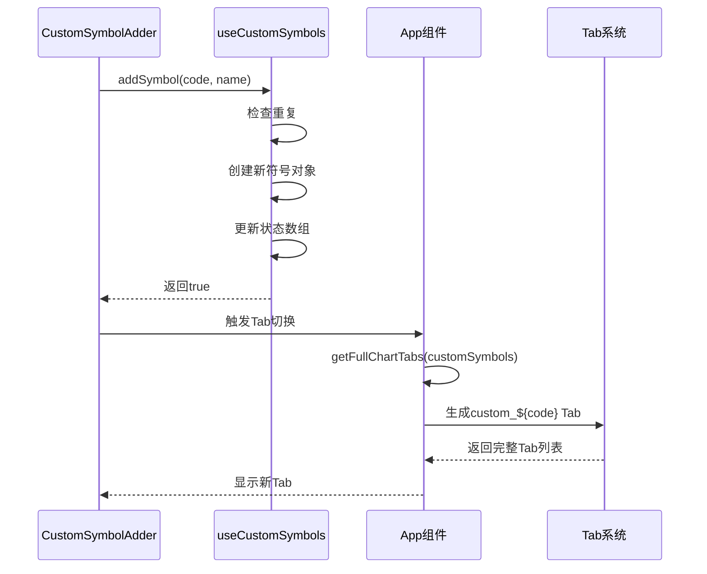

**图表来源**
- [App.tsx:488-526](file://frontend/src/App.tsx#L488-L526)
- [CustomSymbolAdder.tsx:1404-1424](file://frontend/src/App.tsx#L1404-L1424)

**章节来源**
- [CustomSymbolAdder.tsx:38-126](file://frontend/src/components/CustomSymbolAdder.tsx#L38-L126)
- [App.tsx:488-526](file://frontend/src/App.tsx#L488-L526)

### 表单验证逻辑

#### 代码格式验证

组件支持多种金融产品代码格式的验证：

| 代码类型 | 格式要求 | 示例 |
|----------|----------|------|
| A股代码 | 6位数字 | 601138, 002508 |
| 指数代码 | sh/sz + 6位数字 | sh000001, sz399001 |
| 港股代码 | hk + 5位数字 | hk01810, hk00175 |
| ETF代码 | 6位数字 | 510300, 159915 |

#### 验证规则实现

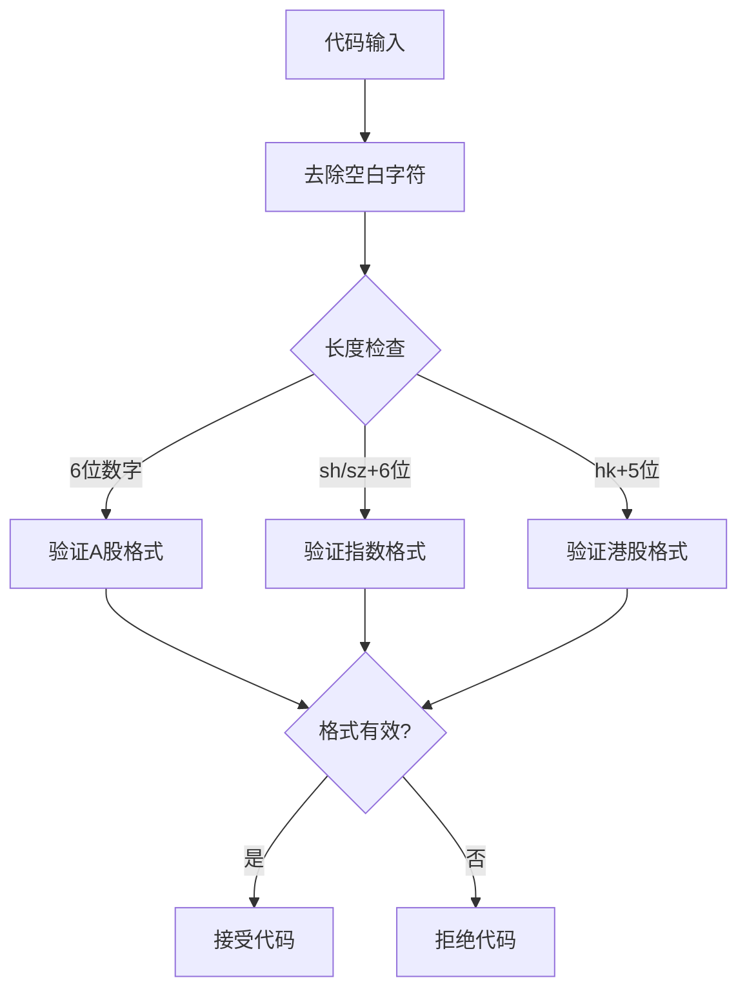

**图表来源**
- [CustomSymbolAdder.tsx:38-45](file://frontend/src/components/CustomSymbolAdder.tsx#L38-L45)

**章节来源**
- [CustomSymbolAdder.tsx:38-45](file://frontend/src/components/CustomSymbolAdder.tsx#L38-L45)

### 全局状态集成

#### useCustomSymbols钩子

组件通过useCustomSymbols钩子实现全局状态管理：

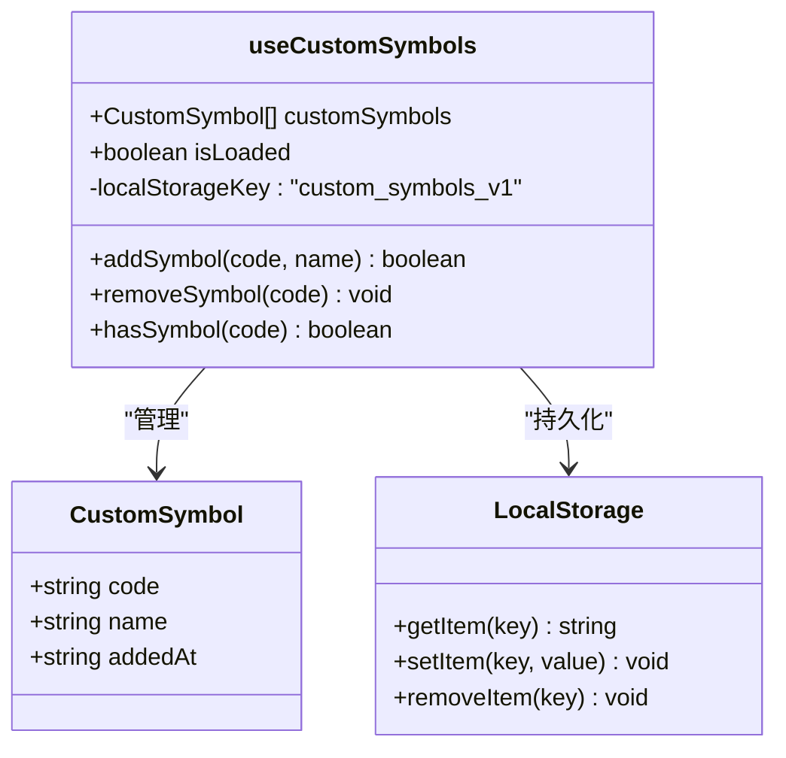

**图表来源**
- [useCustomSymbols.ts:11-77](file://frontend/src/hooks/useCustomSymbols.ts#L11-L77)

#### 状态更新机制

组件的状态更新遵循React的最佳实践：

1. **初始化加载**：组件挂载时从localStorage加载历史数据
2. **实时更新**：每次状态变化时自动保存到localStorage
3. **响应式渲染**：状态变化触发组件重新渲染
4. **错误处理**：提供完善的错误捕获和恢复机制

**章节来源**
- [useCustomSymbols.ts:15-40](file://frontend/src/hooks/useCustomSymbols.ts#L15-L40)
- [useCustomSymbols.ts:42-67](file://frontend/src/hooks/useCustomSymbols.ts#L42-L67)

### 用户体验优化

#### 输入提示系统

组件提供了多层次的输入提示：

| 触发条件 | 提示内容 | 视觉效果 |
|----------|----------|----------|
| 输入开始 | "代码（如：601138、hk01810）" | 普通占位符 |
| 加载中 | "🔍 获取名称中..." | 加载图标 |
| 成功 | "✓ 名称已自动填充" | 绿色成功提示 |
| 失败 | "名称获取失败" | 红色错误提示 |

#### 自动完成功能

组件实现了智能的自动完成机制：

1. **实时验证**：输入6位数字时自动验证A股代码格式
2. **自动获取**：验证通过后自动调用API获取股票名称
3. **智能填充**：成功获取名称后自动填充到名称输入框
4. **状态同步**：根据获取结果更新UI状态

#### 错误反馈机制

组件提供了清晰的错误反馈：

- **格式错误**：明确指出支持的代码格式
- **重复添加**：提示该股票已在列表中
- **网络错误**：显示API调用失败的具体原因
- **系统错误**：提供通用的错误处理和恢复建议

**章节来源**
- [CustomSymbolAdder.tsx:140-166](file://frontend/src/components/CustomSymbolAdder.tsx#L140-L166)
- [CustomSymbolAdder.tsx:168-169](file://frontend/src/components/CustomSymbolAdder.tsx#L168-L169)

## 依赖关系分析

### 组件间依赖

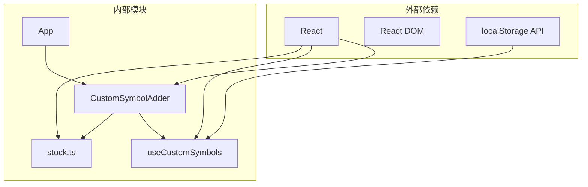

**图表来源**
- [CustomSymbolAdder.tsx:1](file://frontend/src/components/CustomSymbolAdder.tsx#L1)
- [useCustomSymbols.ts:1](file://frontend/src/hooks/useCustomSymbols.ts#L1)
- [stock.ts:115](file://frontend/src/api/stock.ts#L115)

### 数据依赖链

组件的数据流形成了清晰的依赖链：

1. **UI层**：CustomSymbolAdder负责用户交互
2. **状态层**：useCustomSymbols管理全局状态
3. **数据层**：stock.ts提供API接口
4. **持久层**：localStorage存储数据

**章节来源**
- [CustomSymbolAdder.tsx:1-7](file://frontend/src/components/CustomSymbolAdder.tsx#L1-L7)
- [useCustomSymbols.ts:1-3](file://frontend/src/hooks/useCustomSymbols.ts#L1-L3)
- [stock.ts:115](file://frontend/src/api/stock.ts#L115)

## 性能考虑

### 性能优化策略

#### 异步处理优化

组件采用了高效的异步处理策略：

1. **防抖处理**：自动获取名称时避免频繁的API调用
2. **并发控制**：限制同时进行的API请求数量
3. **缓存机制**：利用浏览器缓存减少重复请求
4. **错误重试**：提供有限次数的自动重试机制

#### 内存管理

组件实现了良好的内存管理：

- **状态清理**：组件卸载时自动清理事件监听器
- **引用优化**：使用useCallback优化函数引用
- **渲染优化**：合理使用React.memo避免不必要的重渲染

#### 网络性能

组件在网络请求方面进行了优化：

- **超时控制**：设置合理的请求超时时间
- **重试机制**：提供自动重试功能
- **错误降级**：网络失败时提供友好的降级体验

## 故障排除指南

### 常见问题及解决方案

#### 代码格式错误

**问题现象**：添加按钮不可用或显示格式错误提示

**可能原因**：
- 输入的代码不符合支持的格式
- 包含特殊字符或空白字符
- 代码长度不符合要求

**解决方法**：
1. 确保输入6位数字的A股代码
2. 避免输入任何特殊字符
3. 检查代码是否在支持的范围内

#### 名称获取失败

**问题现象**：名称输入框显示"名称获取失败"

**可能原因**：
- 网络连接问题
- 后端API服务不可用
- 代码格式正确但不存在

**解决方法**：
1. 检查网络连接状态
2. 手动输入正确的股票名称
3. 稍后再试或联系技术支持

#### 重复添加错误

**问题现象**：显示"该股票已在列表中"

**解决方法**：
1. 检查自定义标的列表确认是否已存在
2. 修改代码或名称尝试其他组合
3. 删除现有条目后重新添加

#### 状态同步问题

**问题现象**：刷新页面后自定义标的丢失

**解决方法**：
1. 检查浏览器的localStorage功能
2. 确认浏览器没有清除本地数据
3. 检查浏览器隐私设置

**章节来源**
- [CustomSymbolAdder.tsx:104-125](file://frontend/src/components/CustomSymbolAdder.tsx#L104-L125)
- [useCustomSymbols.ts:15-29](file://frontend/src/hooks/useCustomSymbols.ts#L15-L29)

## 结论

自定义标的添加器是一个设计精良、功能完备的React组件，它成功地解决了金融分析应用中自定义标的管理的核心需求。组件通过以下特点展现了优秀的工程实践：

1. **用户友好**：直观的界面设计和丰富的交互反馈
2. **功能完整**：支持多种代码格式、自动验证和智能提示
3. **性能优秀**：高效的异步处理和内存管理
4. **可靠性强**：完善的错误处理和状态管理
5. **可扩展性好**：模块化的架构设计便于功能扩展

该组件不仅满足了当前的功能需求，还为未来的功能扩展奠定了坚实的基础。通过与全局状态系统的深度集成，组件实现了数据的一致性和持久化存储，为用户提供了一致可靠的使用体验。

## 附录

### 扩展功能建议

基于当前的架构设计，可以考虑以下扩展功能：

#### 批量添加功能
- 支持多行代码批量输入
- 提供CSV文件导入功能
- 实现代码格式批量验证

#### 导入导出功能
- 支持JSON格式的完整数据备份
- 提供Excel格式的便捷导入
- 实现跨设备的数据同步

#### 默认配置功能
- 支持预设常用标的模板
- 实现个性化配置保存
- 提供主题和布局自定义选项

### 安全考虑

组件在安全方面采取了以下措施：

1. **输入验证**：严格的代码格式验证防止恶意输入
2. **API安全**：通过后端API进行数据获取，避免直接的客户端请求
3. **状态隔离**：使用React Hooks实现状态隔离，防止意外的状态污染
4. **错误处理**：完善的错误处理机制防止系统崩溃

这些安全措施确保了组件在各种使用场景下的稳定性和安全性。