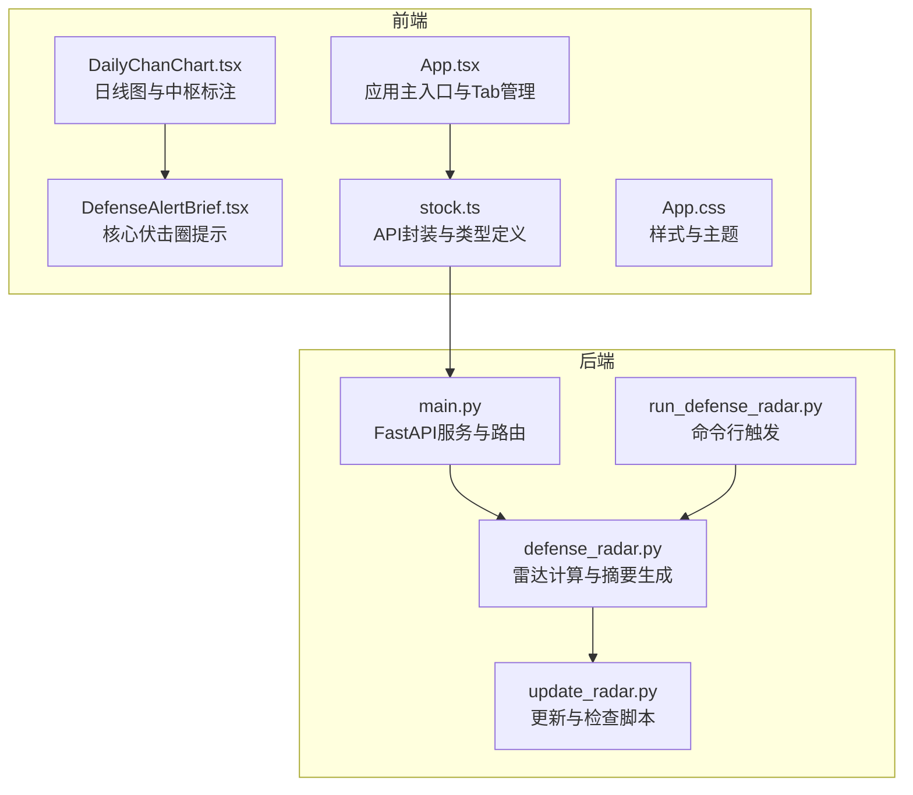
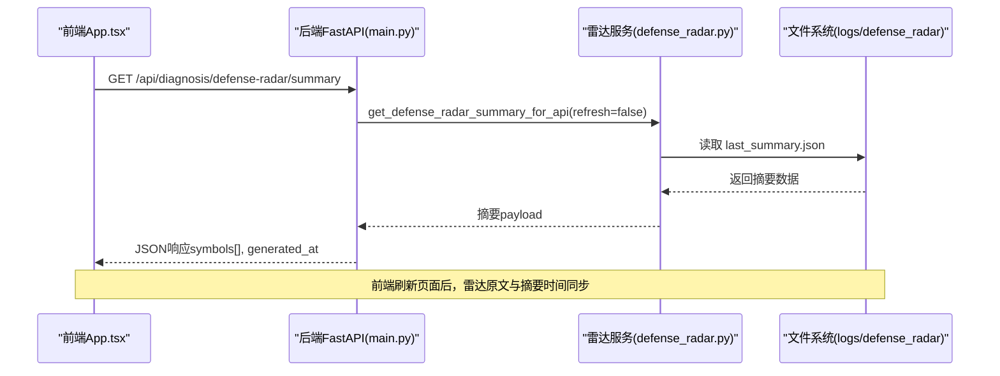
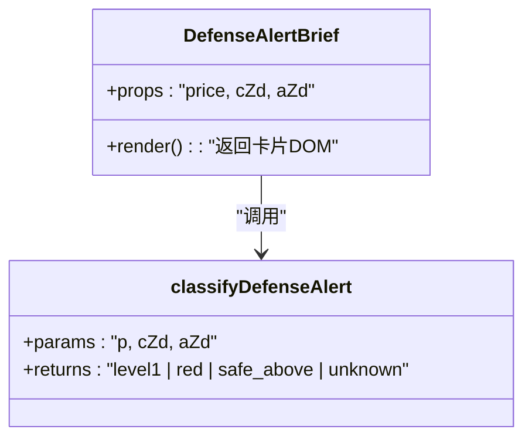
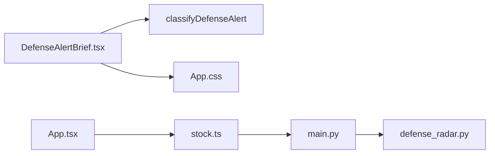

# 雷达预警组件

<cite>
**本文引用的文件**
- [DefenseAlertBrief.tsx](file://frontend/src/DefenseAlertBrief.tsx)
- [App.tsx](file://frontend/src/App.tsx)
- [DailyChanChart.tsx](file://frontend/src/DailyChanChart.tsx)
- [stock.ts](file://frontend/src/api/stock.ts)
- [App.css](file://frontend/src/App.css)
- [index.css](file://frontend/src/index.css)
- [defense_radar.py](file://backend/services/defense_radar.py)
- [main.py](file://backend/main.py)
- [run_defense_radar.py](file://backend/run_defense_radar.py)
- [update_radar.py](file://backend/update_radar.py)
</cite>

## 目录
1. [简介](#简介)
2. [项目结构](#项目结构)
3. [核心组件](#核心组件)
4. [架构总览](#架构总览)
5. [详细组件分析](#详细组件分析)
6. [依赖关系分析](#依赖关系分析)
7. [性能考量](#性能考量)
8. [故障排查指南](#故障排查指南)
9. [结论](#结论)
10. [附录](#附录)

## 简介
本组件为“雷达预警”子系统中的“核心伏击圈”提示模块，负责在日线图下方以简洁卡片形式展示“是否处于绝对防线 ±1% 缓冲带”的即时判断，并给出区间范围与现价信息。组件与后端“双防线雷达”计算逻辑保持一致，确保前后端对同一套中枢与现价的解读一致，从而保障交易决策的一致性与可追溯性。

## 项目结构
- 前端组件位于 frontend/src，包含组件文件、样式与 API 封装。
- 后端服务位于 backend，包含雷达计算、定时调度、API 提供与数据落盘。
- 组件与后端通过统一的摘要接口进行数据同步，确保前端展示与后端计算结果一致。

**图表来源**
- [App.tsx:598-800](file://frontend/src/App.tsx#L598-L800)
- [DailyChanChart.tsx:1-200](file://frontend/src/DailyChanChart.tsx#L1-L200)
- [DefenseAlertBrief.tsx:1-88](file://frontend/src/DefenseAlertBrief.tsx#L1-L88)
- [stock.ts:217-276](file://frontend/src/api/stock.ts#L217-L276)
- [App.css:243-307](file://frontend/src/App.css#L243-L307)
- [defense_radar.py:147-166](file://backend/services/defense_radar.py#L147-L166)
- [main.py:171-206](file://backend/main.py#L171-L206)
- [run_defense_radar.py:22-26](file://backend/run_defense_radar.py#L22-L26)
- [update_radar.py:6-42](file://backend/update_radar.py#L6-L42)

**章节来源**
- [App.tsx:598-800](file://frontend/src/App.tsx#L598-L800)
- [DailyChanChart.tsx:1-200](file://frontend/src/DailyChanChart.tsx#L1-L200)
- [DefenseAlertBrief.tsx:1-88](file://frontend/src/DefenseAlertBrief.tsx#L1-L88)
- [stock.ts:217-276](file://frontend/src/api/stock.ts#L217-L276)
- [App.css:243-307](file://frontend/src/App.css#L243-L307)
- [defense_radar.py:147-166](file://backend/services/defense_radar.py#L147-L166)
- [main.py:171-206](file://backend/main.py#L171-L206)
- [run_defense_radar.py:22-26](file://backend/run_defense_radar.py#L22-L26)
- [update_radar.py:6-42](file://backend/update_radar.py#L6-L42)

## 核心组件
- 组件职责
  - 输入：现价 price、日线 C-ZD、日线 A-ZD。
  - 输出：卡片式展示“是否处于核心伏击圈”，并给出区间范围与现价。
  - 样式：根据是否处于缓冲带（level1）或跌破（red）采用不同颜色与背景。
- 关键逻辑
  - 绝对防线：取 C-ZD 与 A-ZD 的较小值作为“绝对防线”。
  - 缓冲带：±1% 区间，即 [绝对防线 × 0.99, 绝对防线 × 1.01]。
  - 判定：现价落入缓冲带为“是”，跌破绝对防线为“否”，其他为“未知”。

**章节来源**
- [DefenseAlertBrief.tsx:11-26](file://frontend/src/DefenseAlertBrief.tsx#L11-L26)
- [DefenseAlertBrief.tsx:28-87](file://frontend/src/DefenseAlertBrief.tsx#L28-L87)

## 架构总览
组件与后端的交互遵循“摘要优先”的原则：前端通过 GET /api/diagnosis/defense-radar/summary 获取最近一次雷达计算结果，其中包含每个标的的“预警原文”与“是否有效警报”等字段；组件自身仅做轻量级的本地判定与展示。

**图表来源**
- [main.py:171-181](file://backend/main.py#L171-L181)
- [defense_radar.py:147-166](file://backend/services/defense_radar.py#L147-L166)
- [stock.ts:249-276](file://frontend/src/api/stock.ts#L249-L276)

**章节来源**
- [main.py:171-181](file://backend/main.py#L171-L181)
- [defense_radar.py:147-166](file://backend/services/defense_radar.py#L147-L166)
- [stock.ts:249-276](file://frontend/src/api/stock.ts#L249-L276)

## 详细组件分析

### 组件类图（代码级）

**图表来源**
- [DefenseAlertBrief.tsx:11-26](file://frontend/src/DefenseAlertBrief.tsx#L11-L26)
- [DefenseAlertBrief.tsx:28-87](file://frontend/src/DefenseAlertBrief.tsx#L28-L87)

**章节来源**
- [DefenseAlertBrief.tsx:11-26](file://frontend/src/DefenseAlertBrief.tsx#L11-L26)
- [DefenseAlertBrief.tsx:28-87](file://frontend/src/DefenseAlertBrief.tsx#L28-L87)

### 预警状态与颜色编码
- 状态分类
  - level1：现价处于绝对防线 ±1% 缓冲带内（核心伏击圈）
  - red：现价跌破绝对防线（破位禁买）
  - safe_above：现价高于缓冲带（安全区）
  - unknown：输入缺失或无效（显示占位）
- 颜色与样式
  - level1：黄色边框与背景强调
  - red：红色边框与背景强调
  - safe_above：绿色边框与背景强调
  - unknown：灰色边框与背景

**章节来源**
- [DefenseAlertBrief.tsx:28-87](file://frontend/src/DefenseAlertBrief.tsx#L28-L87)
- [App.css:281-307](file://frontend/src/App.css#L281-L307)

### 文本内容格式化
- 展示内容
  - 标题：核心伏击圈
  - 结果：是/否（布尔值的中文表达）
  - 解释：区间 [下限, 上限] 与现价
- 字体与排版
  - 标题：字号略小，加粗
  - 结果：较大字号、加粗、强调色
  - 解释：较小字号、次强调色

**章节来源**
- [DefenseAlertBrief.tsx:60-84](file://frontend/src/DefenseAlertBrief.tsx#L60-L84)
- [App.css:255-267](file://frontend/src/App.css#L255-L267)

### 防御警报类型的识别与处理
- 后端雷达摘要中的“有效警报”判断
  - 仅当“预警原文”包含“【一级警报】”“【终极警报】”“【红色警报】”任一标记时，视为有效警报。
  - 前端据此控制 Tab 的显隐与样式（如“橙色Tab”）。
- 组件侧的本地判定
  - 组件不参与“有效警报”的识别，仅做“是否处于缓冲带”的本地判断，确保与后端计算口径一致。

**章节来源**
- [defense_radar.py:378-383](file://backend/services/defense_radar.py#L378-L383)
- [stock.ts:217-241](file://frontend/src/api/stock.ts#L217-L241)
- [App.tsx:612-633](file://frontend/src/App.tsx#L612-L633)

### 与后端雷达数据的集成
- 数据来源
  - 前端通过 GET /api/diagnosis/defense-radar/summary 获取摘要，其中包含每个标的的“预警原文”“是否有效警报”“60分钟笔向”等字段。
  - 组件本身不直接访问雷达数据，而是依赖前端应用层的摘要加载与缓存。
- 数据一致性
  - 后端优先读取 logs/defense_radar/last_summary.json，确保与最近一次雷达任务生成的 Markdown 一致。
  - 前端刷新页面后，雷达原文与摘要时间同步，避免显示过期信息。

**章节来源**
- [main.py:171-181](file://backend/main.py#L171-L181)
- [defense_radar.py:147-166](file://backend/services/defense_radar.py#L147-L166)
- [stock.ts:249-276](file://frontend/src/api/stock.ts#L249-L276)

### 组件的交互功能
- 展示逻辑
  - 组件以卡片形式嵌入日线图下方，展示“核心伏击圈”判定结果与解释。
- 与图表联动
  - 日线图组件会将雷达摘要中的“预警原文”与“摘要生成时间”传递给组件，用于同步显示。
- 状态筛选
  - 前端根据“是否有效警报”决定 Tab 的显隐与样式（如“橙色Tab”），组件不参与筛选逻辑。

**章节来源**
- [DailyChanChart.tsx:161-183](file://frontend/src/DailyChanChart.tsx#L161-L183)
- [App.tsx:612-633](file://frontend/src/App.tsx#L612-L633)

### 组件样式设计
- 颜色方案
  - level1：黄色边框与背景
  - red：红色边框与背景
  - safe_above：绿色边框与背景
  - unknown：灰色边框
- 字体大小
  - 标题：较小字号
  - 结果：较大字号、加粗
  - 解释：较小字号
- 布局结构
  - 卡片容器、标题、结果行、解释行，整体紧凑、信息明确。

**章节来源**
- [App.css:243-307](file://frontend/src/App.css#L243-L307)
- [DefenseAlertBrief.tsx:60-84](file://frontend/src/DefenseAlertBrief.tsx#L60-L84)

### 性能优化
- 文本截断与渲染优化
  - 组件仅做轻量级数值计算与字符串拼接，避免复杂 DOM 操作。
  - 使用内联样式控制关键视觉属性，减少额外 CSS 类切换带来的重绘成本。
- 数据获取与缓存
  - 前端通过摘要接口一次性获取多个标的的雷达信息，避免多次独立请求。
  - 后端优先读取本地 JSON，减少 IO 延迟与网络波动影响。
- 渲染策略
  - 组件为纯展示型，无状态更新需求，适合在图表更新后按需重新渲染。

**章节来源**
- [DefenseAlertBrief.tsx:28-87](file://frontend/src/DefenseAlertBrief.tsx#L28-L87)
- [stock.ts:249-276](file://frontend/src/api/stock.ts#L249-L276)
- [defense_radar.py:147-166](file://backend/services/defense_radar.py#L147-L166)

### 组件定制化与扩展
- 可定制项
  - 颜色与样式：通过 CSS 类覆盖（如 .defense-alert-panel--level1、.defense-alert-panel--red）。
  - 文本格式：通过修改组件内部的文案与格式化逻辑（如区间与现价的显示）。
- 扩展建议
  - 若需要更丰富的交互（如点击展开详情），可在组件外层增加容器与状态管理。
  - 若需要支持更多状态（如“终极警报”），可扩展状态枚举并在样式中补充对应类名。

**章节来源**
- [App.css:281-307](file://frontend/src/App.css#L281-L307)
- [DefenseAlertBrief.tsx:5-9](file://frontend/src/DefenseAlertBrief.tsx#L5-L9)

## 依赖关系分析
- 组件依赖
  - 本地逻辑：classifyDefenseAlert（本地判定）
  - 样式：App.css 中的 .defense-alert-panel 系列类
  - 类型：来自 stock.ts 的 DefenseRadarSummaryItem（用于前端类型约束）
- 后端依赖
  - 雷达服务：defense_radar.py 提供摘要生成与读取
  - API：main.py 提供 /api/diagnosis/defense-radar/summary

**图表来源**
- [DefenseAlertBrief.tsx:11-26](file://frontend/src/DefenseAlertBrief.tsx#L11-L26)
- [App.css:243-307](file://frontend/src/App.css#L243-L307)
- [stock.ts:217-276](file://frontend/src/api/stock.ts#L217-L276)
- [main.py:171-181](file://backend/main.py#L171-L181)
- [defense_radar.py:147-166](file://backend/services/defense_radar.py#L147-L166)

**章节来源**
- [DefenseAlertBrief.tsx:11-26](file://frontend/src/DefenseAlertBrief.tsx#L11-L26)
- [App.css:243-307](file://frontend/src/App.css#L243-L307)
- [stock.ts:217-276](file://frontend/src/api/stock.ts#L217-L276)
- [main.py:171-181](file://backend/main.py#L171-L181)
- [defense_radar.py:147-166](file://backend/services/defense_radar.py#L147-L166)

## 性能考量
- 计算复杂度
  - 本地判定为 O(1) 数值运算，开销极低。
- 渲染复杂度
  - 组件为静态展示，DOM 结构简单，重绘成本低。
- 数据流
  - 通过摘要接口批量获取数据，避免频繁请求与重复计算。
- 缓存策略
  - 后端优先读取本地 JSON，前端按需刷新，降低延迟与抖动。

[本节为通用性能讨论，无需具体文件分析]

## 故障排查指南
- 前端无法显示雷达原文
  - 检查 /api/diagnosis/defense-radar/summary 是否返回数据，确认 generated_at 与本地 last_summary.json 一致。
  - 参考：[main.py:171-181](file://backend/main.py#L171-L181)、[defense_radar.py:147-166](file://backend/services/defense_radar.py#L147-L166)
- 组件显示“未知”
  - 检查传入的 price、cZd、aZd 是否有效；任一为空或非有限数都会导致 unknown。
  - 参考：[DefenseAlertBrief.tsx:16-19](file://frontend/src/DefenseAlertBrief.tsx#L16-L19)
- 颜色与样式异常
  - 检查 CSS 类是否存在，以及是否被覆盖。
  - 参考：[App.css:281-307](file://frontend/src/App.css#L281-L307)
- 后端雷达未更新
  - 手动触发 /api/diagnosis/defense-radar 或使用 run_defense_radar.py。
  - 参考：[main.py:189-206](file://backend/main.py#L189-L206)、[run_defense_radar.py:22-26](file://backend/run_defense_radar.py#L22-L26)

**章节来源**
- [main.py:171-206](file://backend/main.py#L171-L206)
- [defense_radar.py:147-166](file://backend/services/defense_radar.py#L147-L166)
- [DefenseAlertBrief.tsx:16-19](file://frontend/src/DefenseAlertBrief.tsx#L16-L19)
- [App.css:281-307](file://frontend/src/App.css#L281-L307)
- [run_defense_radar.py:22-26](file://backend/run_defense_radar.py#L22-L26)

## 结论
“核心伏击圈”组件以极简的展示与一致的计算逻辑，为用户提供清晰的“是否处于缓冲带”的即时判断。其与后端雷达摘要的紧密耦合，确保了前后端对同一套中枢与现价解读的一致性。通过合理的样式与交互设计，组件在复杂的图表界面中实现了高效的信息传达与良好的用户体验。

[本节为总结性内容，无需具体文件分析]

## 附录
- 相关文件路径
  - 组件：frontend/src/DefenseAlertBrief.tsx
  - 样式：frontend/src/App.css
  - API封装：frontend/src/api/stock.ts
  - 后端雷达：backend/services/defense_radar.py
  - 后端服务：backend/main.py
  - 命令行触发：backend/run_defense_radar.py
  - 更新脚本：backend/update_radar.py

[本节为附录性内容，无需具体文件分析]