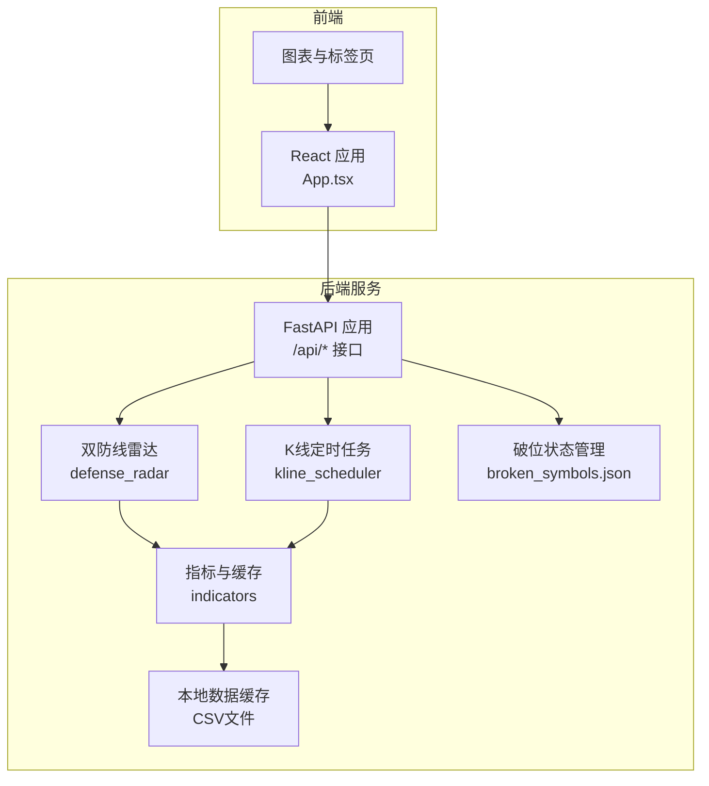
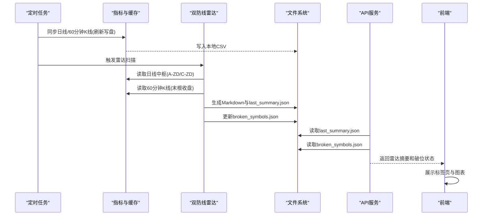
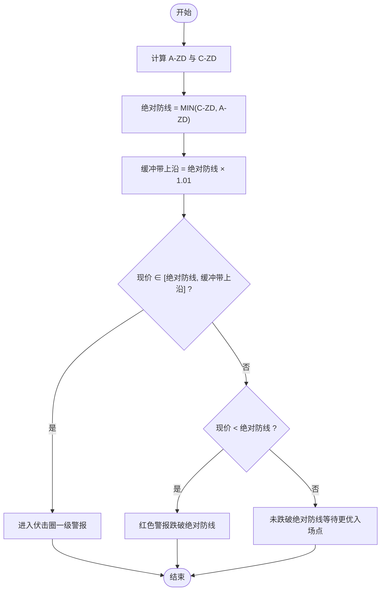
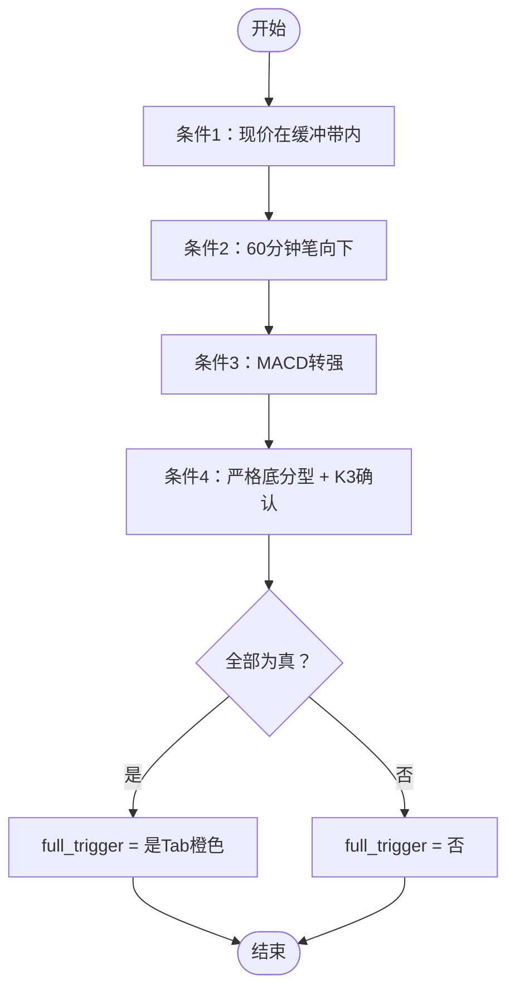
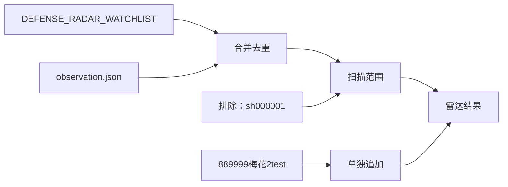
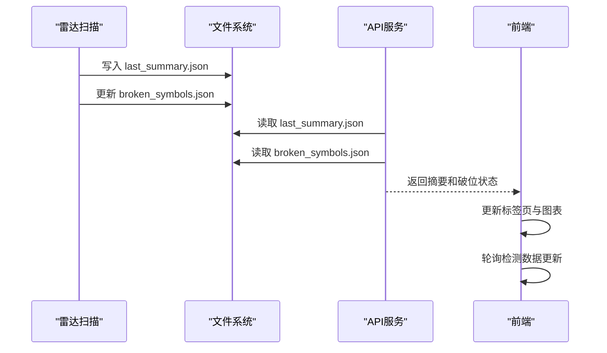
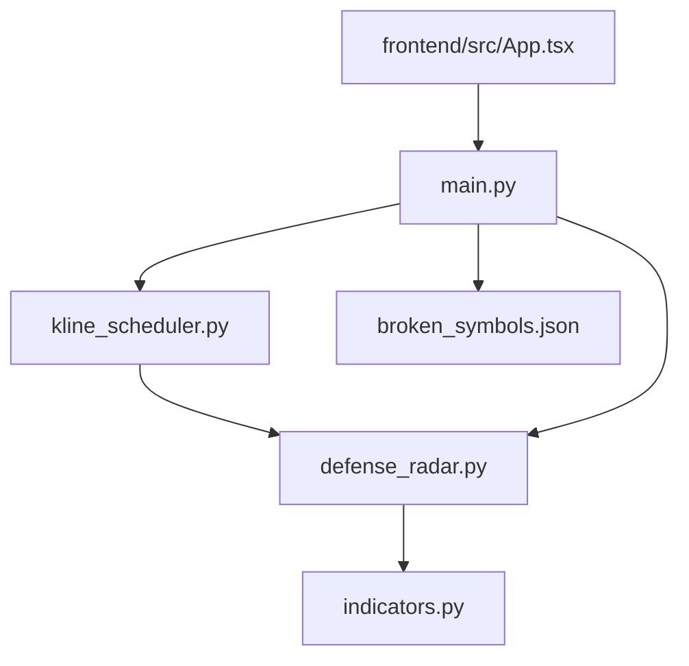

# 双防线雷达系统

<cite>
**本文档引用的文件**
- [backend/services/defense_radar.py](file://backend/services/defense_radar.py)
- [backend/run_defense_radar.py](file://backend/run_defense_radar.py)
- [backend/update_radar.py](file://backend/update_radar.py)
- [backend/data/watchlist.json](file://backend/data/watchlist.json)
- [backend/data/observation.json](file://backend/data/observation.json)
- [backend/services/indicators.py](file://backend/services/indicators.py)
- [backend/services/kline_scheduler.py](file://backend/services/kline_scheduler.py)
- [backend/main.py](file://backend/main.py)
- [frontend/src/App.tsx](file://frontend/src/App.tsx)
- [logs/defense_radar/last_summary.json](file://logs/defense_radar/last_summary.json)
- [logs/defense_radar/broken_symbols.json](file://logs/defense_radar/broken_symbols.json)
- [backend/scripts/trigger_visible_tabs.py](file://backend/scripts/trigger_visible_tabs.py)
- [backend/tests/test_defense_radar_trigger.py](file://backend/tests/test_defense_radar_trigger.py)
- [backend/data/a_daily_qfq_000001.csv](file://backend/data/a_daily_qfq_000001.csv)
- [backend/data/kline_60_600873.csv](file://backend/data/kline_60_600873.csv)
</cite>

## 更新摘要
**变更内容**
- 更新了雷达产物生成机制，反映历史雷达报告的清理和系统简化
- 新增了破位状态管理功能，包括broken_symbols.json的维护
- 更新了前端同步机制，支持实时检测雷达数据更新
- 完善了雷达报告状态的当前可用性说明

## 目录
1. [简介](#简介)
2. [项目结构](#项目结构)
3. [核心组件](#核心组件)
4. [架构总览](#架构总览)
5. [详细组件分析](#详细组件分析)
6. [依赖关系分析](#依赖关系分析)
7. [性能考虑](#性能考虑)
8. [故障排查指南](#故障排查指南)
9. [结论](#结论)
10. [附录](#附录)

## 简介
本文件为双防线雷达系统的完整技术文档，聚焦缠论理论在雷达系统中的落地实现，涵盖A-ZD/C-ZD中枢口径、雷达分类逻辑（含Support_High/Support_Low）、伏击带定义、红色警报触发条件、扫描范围与标的筛选机制、雷达产物生成流程（Markdown与last_summary.json）、手动执行方式、配置参数与调优建议、实际触发案例与分析，以及性能监控与故障排查。

**更新** 系统现已简化为仅维护当前可用的雷达报告状态，历史雷达报告文件已被清理，系统专注于提供实时的雷达摘要和破位状态管理。

## 项目结构
系统采用后端服务 + 前端展示的分层架构：
- 后端服务层：提供API、定时任务、指标计算与雷达扫描
- 数据层：本地CSV缓存（日线/60分钟K线），作为缠论中枢与技术指标的输入
- 前端层：图表与标签页展示，与后端通过REST API交互

**图表来源**
- [backend/main.py:140-200](file://backend/main.py#L140-L200)
- [backend/services/kline_scheduler.py:1-120](file://backend/services/kline_scheduler.py#L1-L120)
- [backend/services/defense_radar.py:1-120](file://backend/services/defense_radar.py#L1-L120)
- [backend/services/indicators.py:1-120](file://backend/services/indicators.py#L1-L120)

**章节来源**
- [backend/main.py:140-200](file://backend/main.py#L140-L200)
- [backend/services/kline_scheduler.py:1-120](file://backend/services/kline_scheduler.py#L1-L120)
- [backend/services/defense_radar.py:1-120](file://backend/services/defense_radar.py#L1-L120)
- [backend/services/indicators.py:1-120](file://backend/services/indicators.py#L1-L120)

## 核心组件
- 双防线雷达核心算法与产物生成
  - A-ZD/C-ZD中枢口径计算、绝对防线与伏击带判定、四条件扳机、雷达产物Markdown与last_summary.json
- 指标与缓存
  - 本地CSV缓存、响应缓存、日线/60分钟K线读取与刷新策略
- 定时任务
  - 北京时间固定槽位同步日线/60分钟K线，并触发雷达扫描
- 破位状态管理
  - broken_symbols.json维护标的破位状态，支持实时查询
- 前端集成
  - 标签页与图表、雷达摘要API、SSE推送

**更新** 系统现已简化为仅维护当前可用的雷达报告状态，历史雷达报告文件已被清理，系统专注于提供实时的雷达摘要和破位状态管理。

**章节来源**
- [backend/services/defense_radar.py:187-226](file://backend/services/defense_radar.py#L187-L226)
- [backend/services/indicators.py:1-120](file://backend/services/indicators.py#L1-L120)
- [backend/services/kline_scheduler.py:1-120](file://backend/services/kline_scheduler.py#L1-L120)
- [frontend/src/App.tsx:19-28](file://frontend/src/App.tsx#L19-L28)

## 架构总览
双防线雷达以"只读本地缓存"为核心设计原则，日线与60分钟K线分别来自本地CSV缓存，缠论中枢与技术指标在服务端计算。定时任务在固定时间点触发全量同步，雷达扫描在60分钟同步后执行，最终生成Markdown报告与last_summary.json供前端秒读。

**更新** 系统现已简化为仅维护当前可用的雷达报告状态，历史雷达报告文件已被清理，系统专注于提供实时的雷达摘要和破位状态管理。

**图表来源**
- [backend/services/kline_scheduler.py:131-176](file://backend/services/kline_scheduler.py#L131-L176)
- [backend/services/defense_radar.py:747-800](file://backend/services/defense_radar.py#L747-L800)
- [backend/main.py:171-181](file://backend/main.py#L171-L181)

**章节来源**
- [backend/services/kline_scheduler.py:1-120](file://backend/services/kline_scheduler.py#L1-L120)
- [backend/services/defense_radar.py:747-800](file://backend/services/defense_radar.py#L747-L800)
- [backend/main.py:171-181](file://backend/main.py#L171-L181)

## 详细组件分析

### A-ZD/C-ZD中枢口径与绝对防线
- A-ZD/C-ZD定义
  - A-ZD：中枢时间轴上第一个中枢的下沿；C-ZD：最后一个中枢的下沿
  - 两者共同构成"绝对防线"：MIN(C-ZD, A-ZD)
- 绝对防线逻辑
  - 现价 ≥ 绝对防线 × 1.01：未跌破绝对防线（高于缓冲区）
  - 绝对防线 ≤ 现价 ≤ 绝对防线 × 1.01：进入绝对防线伏击圈（缓冲带）
  - 现价 < 绝对防线：跌破绝对防线（红色警报，禁买）

**图表来源**
- [backend/services/defense_radar.py:187-226](file://backend/services/defense_radar.py#L187-L226)

**章节来源**
- [backend/services/defense_radar.py:187-226](file://backend/services/defense_radar.py#L187-L226)

### 雷达分类逻辑与伏击带
- Support_High/Support_Low的计算
  - 通过A-ZD/C-ZD中枢下沿确定绝对防线，进而得到Support_Low = MIN(C-ZD, A-ZD)
  - Support_High在系统中体现为"未跌破绝对防线"的状态判断
- 一级伏击带与终极伏击带
  - 一级伏击带：现价处于绝对防线与其×1.01缓冲带之间
  - 终极伏击带：系统未单独定义"终极带"，以"红色警报"作为破位禁买信号
- 红色警报触发条件
  - 现价跌破绝对防线（MIN(C-ZD, A-ZD)）

**章节来源**
- [backend/services/defense_radar.py:196-226](file://backend/services/defense_radar.py#L196-L226)

### 四条件扳机与"蓝三角"
- 条件1：现价处于绝对防线缓冲带（±1%）内
- 条件2：60分钟笔向为向下（有效笔序列最后一笔方向）
- 条件3：MACD动能转强（柱值导数>0，水下绿柱缩短或水上红柱伸长）
- 条件4：严格底分型 + K3收盘 > K2最低（与图一致的"蓝三角"）
- 四条件串联：全部为真才记为full_trigger，前端Tab显示橙色

**图表来源**
- [backend/services/defense_radar.py:719-725](file://backend/services/defense_radar.py#L719-L725)

**章节来源**
- [backend/services/defense_radar.py:228-290](file://backend/services/defense_radar.py#L228-L290)
- [backend/services/defense_radar.py:318-376](file://backend/services/defense_radar.py#L318-L376)
- [backend/services/defense_radar.py:719-725](file://backend/services/defense_radar.py#L719-L725)

### 雷达扫描范围与标的筛选
- 标的清单来源
  - DEFENSE_RADAR_WATCHLIST：核心观察清单
  - observation.json：前端观察标的（与watchlist区分）
  - 合并去重后作为扫描范围
- 上证指数排除
  - sh000001明确排除，不参与雷达
- 梅花2test（889999）隔离
  - 与实盘标的分离，单独追加分析

**图表来源**
- [backend/services/defense_radar.py:34-89](file://backend/services/defense_radar.py#L34-L89)
- [backend/data/observation.json:1-25](file://backend/data/observation.json#L1-L25)
- [backend/services/kline_scheduler.py:122-128](file://backend/services/kline_scheduler.py#L122-L128)

**章节来源**
- [backend/services/defense_radar.py:34-89](file://backend/services/defense_radar.py#L34-L89)
- [backend/data/observation.json:1-25](file://backend/data/observation.json#L1-L25)
- [backend/services/kline_scheduler.py:122-128](file://backend/services/kline_scheduler.py#L122-L128)

### 雷达产物生成与前端同步
- 产物
  - Markdown表格：defense_radar_YYYYMMDD_HHMMSS.md（历史文件已清理）
  - last_summary.json：供GET /api/diagnosis/defense-radar/summary秒读
  - broken_symbols.json：破位状态管理
- 生成流程
  - 扫描标的 → 计算A-ZD/C-ZD与现价 → 评估条件 → 写入last_summary.json
  - 计算破位状态 → 写入broken_symbols.json
- 前端同步
  - last_summary.json与最近一次雷达任务一致，前端优先读取该文件
  - SSE广播：定时任务完成后通知前端刷新
  - 实时检测：前端轮询generated_at字段变化

**更新** 系统现已简化为仅维护当前可用的雷达报告状态，历史雷达报告文件已被清理，系统专注于提供实时的雷达摘要和破位状态管理。

**图表来源**
- [backend/services/defense_radar.py:747-800](file://backend/services/defense_radar.py#L747-L800)
- [backend/main.py:171-181](file://backend/main.py#L171-L181)

**章节来源**
- [backend/services/defense_radar.py:747-800](file://backend/services/defense_radar.py#L747-L800)
- [backend/main.py:171-181](file://backend/main.py#L171-L181)

### 破位状态管理
- 破位状态计算
  - 基于watchlist.json和observation.json中的标的
  - 计算每个标的的日线A-ZD/C-ZD与60分钟最新收盘价
  - 破位定义：60分钟最新收盘价 < MIN(日线A-ZD, 日线C-ZD)
- 破位状态存储
  - broken_symbols.json包含：generated_at、broken_codes、details
  - 支持实时查询：/api/broken-symbols接口
- 破位状态用途
  - 前端显示破位标的
  - 辅助风险控制和投资决策

**章节来源**
- [backend/services/defense_radar.py:840-952](file://backend/services/defense_radar.py#L840-L952)
- [backend/main.py:519-533](file://backend/main.py#L519-L533)

### 手动执行与命令行参数
- 手动触发雷达
  - Python脚本：python backend/run_defense_radar.py
  - 命令行参数：--refresh（仅排障时使用，强制拉网再算）
- 手动更新摘要
  - Python脚本：python backend/update_radar.py
- 手动触发显示
  - Python脚本：python scripts/trigger_visible_tabs.py（检查满足条件的标的）

**章节来源**
- [backend/run_defense_radar.py:1-31](file://backend/run_defense_radar.py#L1-L31)
- [backend/update_radar.py:1-47](file://backend/update_radar.py#L1-L47)
- [backend/scripts/trigger_visible_tabs.py:1-120](file://backend/scripts/trigger_visible_tabs.py#L1-L120)

### 配置选项与参数调优
- 关键参数
  - refresh：默认False，雷达扫描只读本地缓存；True仅用于排障
  - 889999特殊处理：MEIHUA2TEST_FUTURE_K=0|false|off可关闭mock未来K扩展
- 性能优化建议
  - 保持定时任务同步节奏，避免频繁强制刷新
  - 使用last_summary.json进行前端秒读，减少重复计算
  - 控制扫描范围，避免无关标的干扰

**章节来源**
- [backend/services/indicators.py:31-87](file://backend/services/indicators.py#L31-L87)
- [backend/services/defense_radar.py:747-757](file://backend/services/defense_radar.py#L747-L757)

### 实际触发案例与分析示例
- 案例1：云南白药（000538）
  - 触发full_trigger = true，属于"一级警报"标的，60分钟笔向下，MACD转强，蓝三角严格成立
- 案例2：有色金属ETF（512400）
  - 触发full_trigger = true，属于"一级警报"标的，60分钟笔向下，MACD转强，蓝三角严格成立
- 案例3：海螺水泥（600585）
  - 触发"红色警报"，跌破绝对防线，禁买
- 案例4：兴业银行（601166）
  - 触发"红色警报"，跌破绝对防线，禁买
- 案例5：五粮液（000858）
  - "一级警报"，60分钟笔向上，MACD转弱，但仍在缓冲带内

**更新** 破位状态已更新至最新数据，当前破位标的包括：云南白药（000538）、五粮液（000858）、小米集团（hk01810）等。

**章节来源**
- [logs/defense_radar/last_summary.json:694-723](file://logs/defense_radar/last_summary.json#L694-L723)
- [logs/defense_radar/last_summary.json:350-363](file://logs/defense_radar/last_summary.json#L350-L363)
- [logs/defense_radar/last_summary.json:380-393](file://logs/defense_radar/last_summary.json#L380-L393)
- [logs/defense_radar/last_summary.json:710-723](file://logs/defense_radar/last_summary.json#L710-L723)
- [logs/defense_radar/broken_symbols.json:1-347](file://logs/defense_radar/broken_symbols.json#L1-L347)

## 依赖关系分析
- 组件耦合
  - defense_radar依赖indicators进行K线与中枢计算
  - kline_scheduler负责定时同步与触发雷达
  - main.py提供API与SSE广播
  - 破位状态管理独立维护，支持实时查询
- 外部依赖
  - 本地CSV缓存（日线/60分钟）
  - 前端通过last_summary.json进行快速渲染

**图表来源**
- [backend/services/defense_radar.py:27-28](file://backend/services/defense_radar.py#L27-L28)
- [backend/services/kline_scheduler.py:29-30](file://backend/services/kline_scheduler.py#L29-L30)
- [backend/main.py:14-19](file://backend/main.py#L14-L19)
- [frontend/src/App.tsx:1-18](file://frontend/src/App.tsx#L1-L18)

**章节来源**
- [backend/services/defense_radar.py:27-28](file://backend/services/defense_radar.py#L27-L28)
- [backend/services/kline_scheduler.py:29-30](file://backend/services/kline_scheduler.py#L29-L30)
- [backend/main.py:14-19](file://backend/main.py#L14-L19)
- [frontend/src/App.tsx:1-18](file://frontend/src/App.tsx#L1-L18)

## 性能考虑
- 本地缓存优先：雷达扫描默认只读本地CSV，避免网络抖动与延迟
- 响应缓存：indicators对K线响应进行内存缓存，减少重复计算
- 定时同步：固定槽位同步，避免并发冲突与重复计算
- 前端秒读：last_summary.json用于前端快速渲染，降低API压力
- 破位状态缓存：broken_symbols.json提供实时查询支持

**更新** 系统现已简化为仅维护当前可用的雷达报告状态，历史雷达报告文件已被清理，系统专注于提供实时的雷达摘要和破位状态管理。

## 故障排查指南
- 常见问题
  - 本地缓存缺失：检查data目录下CSV是否存在
  - 数据异常：查看日志与异常堆栈
  - 前端不刷新：确认last_summary.json是否更新，SSE广播是否正常
  - 破位状态异常：检查broken_symbols.json文件完整性
- 排障步骤
  - 使用--refresh参数进行排障性重算
  - 检查定时任务健康状态：/api/scheduler/status
  - 查看日志目录下的最新last_summary.json和broken_symbols.json
  - 使用trigger_visible_tabs.py检查标的显示条件

**更新** 系统现已简化为仅维护当前可用的雷达报告状态，历史雷达报告文件已被清理，系统专注于提供实时的雷达摘要和破位状态管理。

**章节来源**
- [backend/run_defense_radar.py:1-31](file://backend/run_defense_radar.py#L1-L31)
- [backend/main.py:183-187](file://backend/main.py#L183-L187)
- [backend/scripts/trigger_visible_tabs.py:1-120](file://backend/scripts/trigger_visible_tabs.py#L1-L120)

## 结论
双防线雷达系统以缠论中枢为基础，结合绝对防线与MACD动能转强、严格底分型等条件，构建了稳健的伏击带识别与信号触发机制。系统通过本地缓存与定时同步保障性能，通过last_summary.json实现前端秒读，具备良好的可维护性与可扩展性。**更新** 系统现已简化为仅维护当前可用的雷达报告状态，历史雷达报告文件已被清理，系统专注于提供实时的雷达摘要和破位状态管理。建议在日常运行中坚持只读本地缓存的原则，仅在排障场景使用--refresh参数，并持续关注定时任务与缓存一致性。

## 附录

### A-ZD/C-ZD与中枢排序
- 中枢按起始日期与结束日期升序排序，取首个为A-ZD，末个为C-ZD
- 与前端sortCentralsChronologically保持一致

**章节来源**
- [backend/services/defense_radar.py:179-184](file://backend/services/defense_radar.py#L179-L184)
- [frontend/src/App.tsx:19-28](file://frontend/src/App.tsx#L19-L28)

### 数据文件与样例
- 日线CSV样例：a_daily_qfq_000001.csv
- 60分钟CSV样例：kline_60_600873.csv

**更新** 系统现已简化为仅维护当前可用的雷达报告状态，历史雷达报告文件已被清理，系统专注于提供实时的雷达摘要和破位状态管理。

**章节来源**
- [backend/data/a_daily_qfq_000001.csv:1-200](file://backend/data/a_daily_qfq_000001.csv#L1-L200)
- [backend/data/kline_60_600873.csv:1-200](file://backend/data/kline_60_600873.csv#L1-L200)

### 当前可用雷达报告状态
- last_summary.json：包含最新雷达摘要，供前端秒读
- broken_symbols.json：包含破位状态，支持实时查询
- 历史雷达报告：已清理，系统不再维护历史文件

**更新** 系统现已简化为仅维护当前可用的雷达报告状态，历史雷达报告文件已被清理，系统专注于提供实时的雷达摘要和破位状态管理。

**章节来源**
- [logs/defense_radar/last_summary.json:1-800](file://logs/defense_radar/last_summary.json#L1-L800)
- [logs/defense_radar/broken_symbols.json:1-347](file://logs/defense_radar/broken_symbols.json#L1-L347)