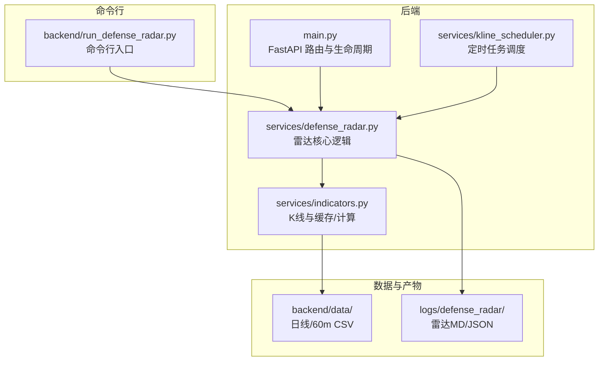
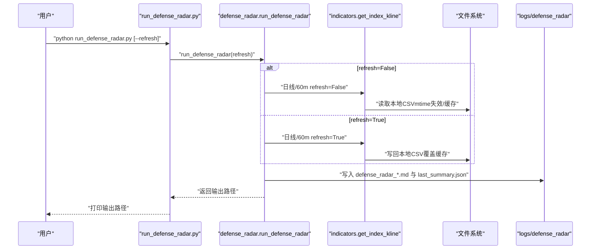
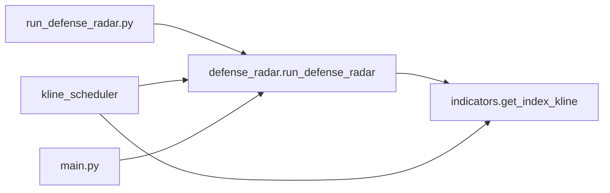

# 手动执行方式

<cite>
**本文引用的文件**
- [run_defense_radar.py](file://backend/run_defense_radar.py)
- [defense_radar.py](file://backend/services/defense_radar.py)
- [kline_scheduler.py](file://backend/services/kline_scheduler.py)
- [indicators.py](file://backend/services/indicators.py)
- [main.py](file://backend/main.py)
- [README.md](file://README.md)
- [update_radar.py](file://backend/update_radar.py)
- [update_radar_local.py](file://backend/update_radar_local.py)
- [observation.json](file://backend/data/observation.json)
- [watchlist.json](file://backend/data/watchlist.json)
</cite>

## 目录
1. [简介](#简介)
2. [项目结构](#项目结构)
3. [核心组件](#核心组件)
4. [架构总览](#架构总览)
5. [详细组件分析](#详细组件分析)
6. [依赖关系分析](#依赖关系分析)
7. [性能考量](#性能考量)
8. [故障排查指南](#故障排查指南)
9. [结论](#结论)
10. [附录](#附录)

## 简介
本章节面向“双防线雷达”的手动执行方式，提供从命令行到执行流程、参数语义、适用场景、执行环境要求、日志与错误处理以及与定时任务的协调机制的完整技术文档。重点围绕 run_defense_radar.py 脚本的使用方法与 refresh 参数的行为差异展开，并给出常见执行命令示例与参数组合建议。

## 项目结构
后端采用 FastAPI 提供 API 服务，定时任务由 kline_scheduler 负责，双防线雷达的核心逻辑集中在 defense_radar 模块。run_defense_radar.py 作为命令行入口，直接调用 defense_radar.run_defense_radar，支持 --refresh 临时排障模式。

**图表来源**
- [main.py:171-206](file://backend/main.py#L171-L206)
- [kline_scheduler.py:211-256](file://backend/services/kline_scheduler.py#L211-L256)
- [defense_radar.py:747-800](file://backend/services/defense_radar.py#L747-L800)
- [indicators.py:1-200](file://backend/services/indicators.py#L1-L200)
- [run_defense_radar.py:1-31](file://backend/run_defense_radar.py#L1-L31)

**章节来源**
- [README.md:216-244](file://README.md#L216-L244)

## 核心组件
- 命令行入口 run_defense_radar.py：解析 --refresh 参数，调用 run_defense_radar，打印输出路径。
- 雷达核心 defense_radar.run_defense_radar：扫描 watchlist，计算四条件扳机，生成 Markdown 与 last_summary.json。
- 定时任务 kline_scheduler：按固定槽位写盘并调用 run_defense_radar(refresh=False)。
- 指标与缓存 indicators.get_index_kline：负责本地 CSV 优先、响应缓存与 mtime 失效，支持 refresh 控制是否拉网写盘。

**章节来源**
- [run_defense_radar.py:22-31](file://backend/run_defense_radar.py#L22-L31)
- [defense_radar.py:747-800](file://backend/services/defense_radar.py#L747-L800)
- [kline_scheduler.py:211-226](file://backend/services/kline_scheduler.py#L211-L226)
- [indicators.py:149-174](file://backend/services/indicators.py#L149-L174)

## 架构总览
手动执行与定时任务共享同一套雷达计算逻辑，区别在于数据来源与刷新策略：
- 定时任务：先写盘（refresh=True），再读本地（refresh=False）进行雷达计算，确保前端展示的中枢与雷达一致。
- 手动执行：默认只读本地缓存（refresh=False），仅在排障时使用 --refresh 强制拉网再算。

**图表来源**
- [run_defense_radar.py:22-31](file://backend/run_defense_radar.py#L22-L31)
- [defense_radar.py:747-800](file://backend/services/defense_radar.py#L747-L800)
- [indicators.py:149-174](file://backend/services/indicators.py#L149-L174)

## 详细组件分析

### 命令行入口 run_defense_radar.py
- 功能：解析命令行参数，设置日志级别，调用 run_defense_radar，打印输出路径。
- 关键行为：
  - 解析 sys.argv，识别 --refresh。
  - 默认只读本地缓存（refresh=False）。
  - 输出路径为 logs/defense_radar 下的 Markdown 文件。

**章节来源**
- [run_defense_radar.py:22-31](file://backend/run_defense_radar.py#L22-L31)

### 雷达核心 defense_radar.run_defense_radar
- 功能：扫描 watchlist，逐个计算分析，汇总为 Markdown 表格与 last_summary.json。
- 关键参数：
  - refresh：默认 False；True 时强制拉网写盘。
  - output_dir：默认 logs/defense_radar。
  - watchlist：可选自定义列表。
- 数据来源：
  - 日线：get_index_kline(period="daily", refresh=refresh)。
  - 60m：get_index_kline(period="60", refresh=refresh)。
- 产物：
  - defense_radar_YYYYMMDD_HHMMSS.md。
  - last_summary.json（供 /api/diagnosis/defense-radar/summary 与前端使用）。

**章节来源**
- [defense_radar.py:747-800](file://backend/services/defense_radar.py#L747-L800)
- [defense_radar.py:418-429](file://backend/services/defense_radar.py#L418-L429)

### 指标与缓存 indicators.get_index_kline
- 本地优先：默认只读本地 CSV，按 mtime 失效触发重算。
- 刷新策略：
  - refresh=False：仅在本地 CSV mtime 新于缓存记录时重算。
  - refresh=True：清除缓存并完整计算，写回本地 CSV。
- 60m 特性：定时任务会写回 kline_60_*.csv，前端与雷达读取本地 CSV。

**章节来源**
- [indicators.py:149-174](file://backend/services/indicators.py#L149-L174)
- [README.md:86-92](file://README.md#L86-L92)

### 定时任务 kline_scheduler
- 槽位：
  - 10:31/11:31/14:01/15:01：全量 60m refresh + 雷达（refresh=False）。
  - 16:01：全量 日线 refresh + 60m refresh + 雷达（refresh=False）。
- 行为：先写盘，再读本地，确保雷达与前端一致。

**章节来源**
- [kline_scheduler.py:39-46](file://backend/services/kline_scheduler.py#L39-L46)
- [kline_scheduler.py:211-226](file://backend/services/kline_scheduler.py#L211-L226)

### API 协同 main.py
- /api/diagnosis/defense-radar：POST 触发手动执行，写入 md 并更新 last_summary.json。
- /api/diagnosis/defense-radar/summary：GET 优先读 last_summary.json，支持 refresh=false（默认）。

**章节来源**
- [main.py:171-206](file://backend/main.py#L171-L206)

## 依赖关系分析
- run_defense_radar.py 依赖 defense_radar.run_defense_radar。
- defense_radar.run_defense_radar 依赖 indicators.get_index_kline。
- kline_scheduler 依赖 defense_radar.run_defense_radar 与 indicators.get_index_kline。
- main.py 提供 API 与 SSE 广播，与 defense_radar 摘要协同。

**图表来源**
- [run_defense_radar.py](file://backend/run_defense_radar.py#L19)
- [defense_radar.py:747-800](file://backend/services/defense_radar.py#L747-L800)
- [indicators.py:149-174](file://backend/services/indicators.py#L149-L174)
- [kline_scheduler.py:211-226](file://backend/services/kline_scheduler.py#L211-L226)
- [main.py:171-206](file://backend/main.py#L171-L206)

## 性能考量
- 默认只读本地缓存（refresh=False）：避免网络拉取，提升执行速度，适合常规场景。
- 强制刷新（refresh=True）：会写回本地 CSV，适合排障或数据修复，但会增加 IO 与网络请求。
- 响应缓存与 mtime 失效：减少重复计算，提高并发下的稳定性。

[本节为通用性能讨论，不直接分析具体文件]

## 故障排查指南
- 摘要 404 或 Tab 不显示：
  - 后端未重启或旧进程无新路由。
  - last_summary.json 未生成或读取失败。
- 60m 报错“本地缓存不存在”：
  - 未跑过定时任务或从未对该 symbol refresh=true 预热。
- 中枢长时间不变：
  - 本地 CSV 未更新；或仅命中 TTL 内缓存（港股日线）。
- 手动执行日志：
  - run_defense_radar.py 使用 INFO 级别日志，输出包含写入路径与行数。
  - defense_radar 写入 last_summary.json 失败会记录异常。

**章节来源**
- [README.md:255-263](file://README.md#L255-L263)
- [run_defense_radar.py:22-31](file://backend/run_defense_radar.py#L22-L31)
- [defense_radar.py:137-165](file://backend/services/defense_radar.py#L137-L165)

## 结论
手动执行方式以 run_defense_radar.py 为核心入口，默认只读本地缓存，与定时任务保持一致的雷达计算口径。仅在排障或数据修复时使用 --refresh 强制拉网写盘。通过明确的参数语义、日志输出与错误处理，可安全地在生产环境中进行手动干预与验证。

[本节为总结性内容，不直接分析具体文件]

## 附录

### 命令行执行方法与参数
- 基本用法
  - 只读本地缓存（默认）：在项目根或 backend 目录执行脚本。
  - 强制刷新线上数据（排障）：在上述目录执行脚本并附加 --refresh。
- 常见命令示例
  - 在项目根目录：python backend/run_defense_radar.py
  - 在 backend 目录：python run_defense_radar.py
  - 排障模式：python backend/run_defense_radar.py --refresh
- 与 API 的等价行为
  - POST /api/diagnosis/defense-radar（默认 refresh=False）。
  - GET /api/diagnosis/defense-radar/summary（默认 refresh=False）。

**章节来源**
- [run_defense_radar.py:2-9](file://backend/run_defense_radar.py#L2-L9)
- [README.md:150-156](file://README.md#L150-L156)
- [main.py:171-206](file://backend/main.py#L171-L206)

### refresh 参数详解与使用场景
- refresh=False（默认）
  - 仅读本地缓存，不主动拉网。
  - 适用于常规场景，确保与定时任务一致。
- refresh=True（排障/修复）
  - 强制拉网并写回本地 CSV，随后进行雷达计算。
  - 适用于数据修复、紧急分析与测试验证。
- 与定时任务的关系
  - 定时任务在槽位内先写盘（refresh=True），再读本地（refresh=False）。
  - 手动执行与定时任务共享同一套计算逻辑，区别仅在数据来源。

**章节来源**
- [defense_radar.py:6-14](file://backend/services/defense_radar.py#L6-L14)
- [defense_radar.py:756-757](file://backend/services/defense_radar.py#L756-L757)
- [kline_scheduler.py:211-226](file://backend/services/kline_scheduler.py#L211-L226)

### 适用场景
- 数据修复：当本地缓存异常或缺失时，使用 --refresh 拉取并重建。
- 紧急分析：在非槽位时间快速验证雷达结果。
- 测试验证：在本地环境验证算法与数据一致性。

**章节来源**
- [defense_radar.py:6-14](file://backend/services/defense_radar.py#L6-L14)

### 执行环境与前置条件
- 数据同步状态
  - 60m：需存在 kline_60_*.csv（由定时任务或 refresh=true 预热）。
  - 日线：需存在日线 CSV（由定时任务或 refresh=true 预热）。
- 依赖服务
  - 指标与缓存模块依赖本地 CSV 与响应缓存。
  - 前端通过 /api/diagnosis/defense-radar/summary 读取 last_summary.json。
- 观察与自选
  - observation.json 与 watchlist.json 影响最终扫描列表与名称缓存。

**章节来源**
- [README.md:86-92](file://README.md#L86-L92)
- [observation.json:1-25](file://backend/data/observation.json#L1-L25)
- [watchlist.json:1-27](file://backend/data/watchlist.json#L1-L27)

### 日志输出与错误处理
- run_defense_radar.py
  - INFO 级别日志，输出写入路径与行数。
- defense_radar
  - 写入 last_summary.json 失败会记录异常。
  - 拉取日线/60m 失败会记录异常并返回错误行。
- API
  - POST /api/diagnosis/defense-radar 返回 ok 与 path。
  - GET /api/diagnosis/defense-radar/summary 返回 generated_at 与 symbols。

**章节来源**
- [run_defense_radar.py:22-31](file://backend/run_defense_radar.py#L22-L31)
- [defense_radar.py:137-165](file://backend/services/defense_radar.py#L137-L165)
- [defense_radar.py:794-799](file://backend/services/defense_radar.py#L794-L799)
- [main.py:171-206](file://backend/main.py#L171-L206)

### 与定时任务的协调机制
- 定时任务
  - 10:31/11:31/14:01/15:01：全量 60m refresh + 雷达（refresh=False）。
  - 16:01：全量 日线 refresh + 60m refresh + 雷达（refresh=False）。
- 手动执行
  - 默认 refresh=False，与定时任务保持一致。
  - 排障时使用 --refresh，与定时任务的 refresh=True 对应。

**章节来源**
- [kline_scheduler.py:39-46](file://backend/services/kline_scheduler.py#L39-L46)
- [kline_scheduler.py:211-226](file://backend/services/kline_scheduler.py#L211-L226)
- [README.md:115-122](file://README.md#L115-L122)