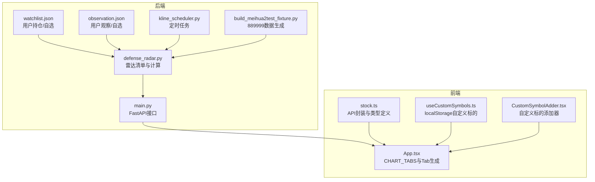
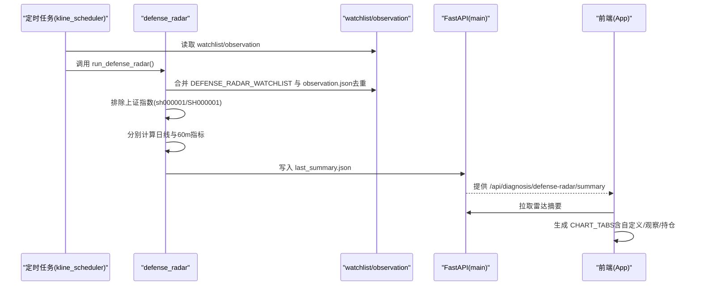
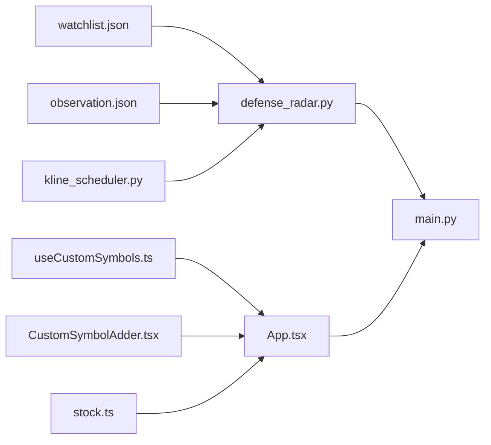
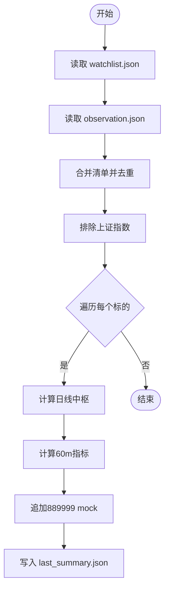

# 标的清单管理

<cite>
**本文档引用的文件**
- [backend/services/defense_radar.py](file://backend/services/defense_radar.py)
- [backend/data/watchlist.json](file://backend/data/watchlist.json)
- [backend/data/observation.json](file://backend/data/observation.json)
- [frontend/src/App.tsx](file://frontend/src/App.tsx)
- [frontend/src/hooks/useCustomSymbols.ts](file://frontend/src/hooks/useCustomSymbols.ts)
- [frontend/src/components/CustomSymbolAdder.tsx](file://frontend/src/components/CustomSymbolAdder.tsx)
- [frontend/src/api/stock.ts](file://frontend/src/api/stock.ts)
- [backend/main.py](file://backend/main.py)
- [backend/services/kline_scheduler.py](file://backend/services/kline_scheduler.py)
- [backend/scripts/build_meihua2test_fixture.py](file://backend/scripts/build_meihua2test_fixture.py)
- [backend/run_defense_radar.py](file://backend/run_defense_radar.py)
- [backend/update_radar.py](file://backend/update_radar.py)
</cite>

## 目录
1. [简介](#简介)
2. [项目结构](#项目结构)
3. [核心组件](#核心组件)
4. [架构总览](#架构总览)
5. [详细组件分析](#详细组件分析)
6. [依赖关系分析](#依赖关系分析)
7. [性能考量](#性能考量)
8. [故障排查指南](#故障排查指南)
9. [结论](#结论)
10. [附录](#附录)

## 简介
本文件面向“双防线雷达标的清单管理”，系统性阐述以下内容：
- DEFENSE_RADAR_WATCHLIST 的构成与维护策略（涵盖 ETF、股票、港股等）
- observation.json 的集成机制（去重与排序规则）
- 标的筛选的排除规则（上证指数与特定代码过滤）
- 梅花2test（889999）专用标的的隔离机制与特殊处理
- 标的清单与前端 Tab 显示的同步机制（CHART_TABS 对应关系）
- 标的清单的增删改操作指南
- 标的质量评估与定期更新策略

## 项目结构
后端采用 Python/FastAPI 构建，前端采用 React/Vite 构建。标的清单管理涉及后端数据文件与前端 UI 的双向协作。

**图表来源**
- [backend/services/defense_radar.py](file://backend/services/defense_radar.py)
- [backend/data/watchlist.json](file://backend/data/watchlist.json)
- [backend/data/observation.json](file://backend/data/observation.json)
- [backend/main.py](file://backend/main.py)
- [backend/services/kline_scheduler.py](file://backend/services/kline_scheduler.py)
- [backend/scripts/build_meihua2test_fixture.py](file://backend/scripts/build_meihua2test_fixture.py)
- [frontend/src/App.tsx](file://frontend/src/App.tsx)
- [frontend/src/hooks/useCustomSymbols.ts](file://frontend/src/hooks/useCustomSymbols.ts)
- [frontend/src/components/CustomSymbolAdder.tsx](file://frontend/src/components/CustomSymbolAdder.tsx)
- [frontend/src/api/stock.ts](file://frontend/src/api/stock.ts)

**章节来源**
- [backend/services/defense_radar.py](file://backend/services/defense_radar.py)
- [backend/data/watchlist.json](file://backend/data/watchlist.json)
- [backend/data/observation.json](file://backend/data/observation.json)
- [frontend/src/App.tsx](file://frontend/src/App.tsx)
- [frontend/src/hooks/useCustomSymbols.ts](file://frontend/src/hooks/useCustomSymbols.ts)
- [frontend/src/components/CustomSymbolAdder.tsx](file://frontend/src/components/CustomSymbolAdder.tsx)
- [frontend/src/api/stock.ts](file://frontend/src/api/stock.ts)
- [backend/main.py](file://backend/main.py)
- [backend/services/kline_scheduler.py](file://backend/services/kline_scheduler.py)
- [backend/scripts/build_meihua2test_fixture.py](file://backend/scripts/build_meihua2test_fixture.py)

## 核心组件
- DEFENSE_RADAR_WATCHLIST：双防线雷达的主监控清单，包含 ETF、A 股与港股标的，作为雷达计算的核心来源。
- observation.json：观察清单，仅用于前端显示，不参与止损检查；与主清单去重后合并。
- watchlist.json：用户持仓/自选清单，与观察清单共同决定前端 Tab 的初始显示与排序。
- 前端 CHART_TABS：定义了固定硬编码的 Tab 集合，以及自定义标的的动态生成逻辑。
- 梅花2test（888999）：专用 mock 标的，与生产清单隔离，独立追加到雷达结果末尾。
- 定时任务：kline_scheduler 按固定槽位同步日线/60m 数据，驱动雷达与状态文件生成。

**章节来源**
- [backend/services/defense_radar.py](file://backend/services/defense_radar.py)
- [backend/data/watchlist.json](file://backend/data/watchlist.json)
- [backend/data/observation.json](file://backend/data/observation.json)
- [frontend/src/App.tsx](file://frontend/src/App.tsx)
- [backend/services/kline_scheduler.py](file://backend/services/kline_scheduler.py)

## 架构总览
雷达清单管理的端到端流程如下：

**图表来源**
- [backend/services/kline_scheduler.py](file://backend/services/kline_scheduler.py)
- [backend/services/defense_radar.py](file://backend/services/defense_radar.py)
- [backend/main.py](file://backend/main.py)
- [frontend/src/App.tsx](file://frontend/src/App.tsx)

## 详细组件分析

### DEFENSE_RADAR_WATCHLIST 构成与维护策略
- 构成要素
  - ETF：沪深300ETF、创业板ETF、科创50ETF、科创芯片ETF、电池ETF、恒生科技ETF、创新药ETF、光伏ETF、软件ETF、教育ETF、酒ETF 等。
  - A 股：陕西煤业、老板电器、美的集团、粤高速、东阿阿胶、潍柴动力、双汇发展、华能国际、工业富联、福耀玻璃、合康新能、海康威视、中远海控、海螺水泥、梅花生物、兴业银行、长江电力、伊利股份、天味食品、中国电信、中国石油、中国中车、云天化、平安银行、格力电器、科大讯飞、牧原股份 等。
  - 港股：小米集团、吉利汽车、美团、金山云、海底捞、云南白药、五粮液、中国海油、农业银行、立讯精密 等。
- 维护策略
  - 以固定元组形式集中维护，便于雷达计算与前端 Tab 对齐。
  - 与 observation.json 合并时进行去重，确保观察标的不重复生成自定义 Tab。
  - 上证指数（sh000001/SH000001）明确排除，不在雷达清单中计算。

**章节来源**
- [backend/services/defense_radar.py](file://backend/services/defense_radar.py)

### observation.json 集成机制（去重与排序）
- 集成方式
  - 雷达计算阶段：通过内部函数读取 observation.json，与 DEFENSE_RADAR_WATCHLIST 合并，去重后形成完整扫描清单。
  - 前端 Tab 生成：getFullChartTabs 对 CHART_TABS 中已存在的 code 去重，避免重复生成 custom_${code} Tab；自定义与观察标的按需追加。
- 排序规则
  - 持仓标的与观察标的分别维护其在各自列表中的顺序映射，用于前端排序。
  - 常驻 Tab 集合为空，所有 Tab 均按雷达触发条件显示。

**章节来源**
- [backend/services/defense_radar.py](file://backend/services/defense_radar.py)
- [frontend/src/App.tsx](file://frontend/src/App.tsx)

### 标的筛选排除规则
- 上证指数排除：EXCLUDED_SYMBOLS 包含 sh000001 与 SH000001，任何匹配都会被跳过。
- 特定代码过滤：除上证指数外，未见其他硬编码黑名单；如需扩展可在分析入口处增加。

**章节来源**
- [backend/services/defense_radar.py](file://backend/services/defense_radar.py)

### 梅花2test（889999）隔离机制与特殊处理
- 隔离策略
  - 不纳入 DEFENSE_RADAR_WATCHLIST；在雷达计算完成后，单独追加一行 analyze_meihua2test_symbol。
  - 与真实标的（如 600873）数据源一致，但 mock 未来 K 线，便于测试与演示。
- 数据生成
  - build_meihua2test_fixture 脚本复制真实标的的历史数据并追加未来交易时段的 mock K 线，安装到 data 与 tests/fixtures。
- 前端 Tab
  - CHART_TABS 中包含 s889999 项，用于显示该 mock 标的。

**章节来源**
- [backend/services/defense_radar.py](file://backend/services/defense_radar.py)
- [backend/scripts/build_meihua2test_fixture.py](file://backend/scripts/build_meihua2test_fixture.py)
- [frontend/src/App.tsx](file://frontend/src/App.tsx)

### 标的清单与前端 Tab 同步机制（CHART_TABS 对应关系）
- 固定 Tab 集合：CHART_TABS 定义了所有硬编码标的的 key、code、标签与系列名。
- 自定义与观察/持仓：通过 getFullChartTabs 合并自定义、观察与持仓标的，去重后追加 custom_${code} 类型的 Tab。
- 常驻集合：BASE_ALWAYS_VISIBLE_TAB_KEYS 为空，Tab 显示完全由雷达摘要与用户配置决定。
- 本地存储：自定义标的持久化在 localStorage，刷新页面后仍保留。

**章节来源**
- [frontend/src/App.tsx](file://frontend/src/App.tsx)
- [frontend/src/hooks/useCustomSymbols.ts](file://frontend/src/hooks/useCustomSymbols.ts)

### 标的清单的增删改操作指南
- 增删改（后端文件）
  - 用户持仓/自选：编辑 backend/data/watchlist.json，添加/删除/修改 holdings 数组中的对象（code、name 必填，可选 cost、shares、note）。
  - 观察/自选：编辑 backend/data/observation.json，添加/删除/修改 observations 数组中的对象（code、name 必填）。
  - 修改后无需重启服务，即可在下一次雷达任务或前端刷新后生效。
- 增删改（前端自定义）
  - 通过 CustomSymbolAdder 添加/移除自定义标的，数据保存在 localStorage，key 为 custom_symbols_v1。
  - 前端会自动去重，避免重复生成 Tab。

**章节来源**
- [backend/data/watchlist.json](file://backend/data/watchlist.json)
- [backend/data/observation.json](file://backend/data/observation.json)
- [frontend/src/components/CustomSymbolAdder.tsx](file://frontend/src/components/CustomSymbolAdder.tsx)
- [frontend/src/hooks/useCustomSymbols.ts](file://frontend/src/hooks/useCustomSymbols.ts)

### 标的质量评估与定期更新策略
- 质量评估维度（雷达摘要字段）
  - 预警信息（alert）与是否激活（has_alert）
  - 60分钟笔向（pen_60m）、是否在一级/终极/红色警报区间（radar_zone_ok）
  - 60分钟末笔向下（pen_60m_down）、MACD动能转强（macd_momentum_ok）
  - 蓝三角严格形态（blue_triangle_strict）与四条件扳机（full_trigger）
  - 60分钟买点7条件：C中枢内（in_c_central）、底背驰点在向上笔内（has_bottom_div_in_switch）、BOLL站回中轨（boll_buy）
- 更新策略
  - 定时任务：kline_scheduler 在固定槽位同步日线/60m 数据，并运行双防线雷达，生成 last_summary.json 与雷达报告。
  - 手动触发：run_defense_radar.py 与 update_radar.py 支持手动更新与检查。
  - 前端：GET /api/diagnosis/defense-radar/summary 优先读取 last_summary.json，确保与最近一次雷达任务一致。

**章节来源**
- [backend/services/defense_radar.py](file://backend/services/defense_radar.py)
- [backend/services/kline_scheduler.py](file://backend/services/kline_scheduler.py)
- [backend/run_defense_radar.py](file://backend/run_defense_radar.py)
- [backend/update_radar.py](file://backend/update_radar.py)
- [backend/main.py](file://backend/main.py)

## 依赖关系分析

**图表来源**
- [backend/data/watchlist.json](file://backend/data/watchlist.json)
- [backend/data/observation.json](file://backend/data/observation.json)
- [backend/services/defense_radar.py](file://backend/services/defense_radar.py)
- [backend/main.py](file://backend/main.py)
- [backend/services/kline_scheduler.py](file://backend/services/kline_scheduler.py)
- [frontend/src/App.tsx](file://frontend/src/App.tsx)
- [frontend/src/hooks/useCustomSymbols.ts](file://frontend/src/hooks/useCustomSymbols.ts)
- [frontend/src/components/CustomSymbolAdder.tsx](file://frontend/src/components/CustomSymbolAdder.tsx)
- [frontend/src/api/stock.ts](file://frontend/src/api/stock.ts)

**章节来源**
- [backend/services/defense_radar.py](file://backend/services/defense_radar.py)
- [backend/main.py](file://backend/main.py)
- [frontend/src/App.tsx](file://frontend/src/App.tsx)

## 性能考量
- 缓存与增量更新
  - 指标计算基于本地 CSV 缓存，日线/60m/15m 分别维护缓存与 mtime，本地文件更新时自动触发对应周期的缓存失效与重算。
  - 雷达默认只读本地缓存，减少网络抖动对稳定性的影响。
- 并发与重试
  - 指标模块对网络接口增加轻量重试，降低瞬时网络异常对 60m 拉取的影响。
- 前端渲染
  - Tab 生成与去重在前端完成，避免后端重复构造；自定义标的持久化在 localStorage，减少后端压力。

[本节为通用指导，不直接分析具体文件]

## 故障排查指南
- 雷达摘要为空或延迟
  - 检查定时任务是否正常：/api/scheduler/status 查询调度器健康状态。
  - 手动触发雷达：POST /api/diagnosis/defense-radar 或使用 run_defense_radar.py。
- 上证指数出现在雷达中
  - 确认 EXCLUDED_SYMBOLS 生效，检查代码大小写与前缀（sh000001/SH000001）。
- 梅花2test（889999）未显示
  - 确认 build_meihua2test_fixture.py 已生成并安装 mock 数据。
  - 检查 analyze_meihua2test_symbol 是否被单独追加。
- 前端 Tab 重复或缺失
  - 检查 CHART_TABS 与 getFullChartTabs 的去重逻辑，确认自定义/观察/持仓代码未重复。
- 自定义标的不持久
  - 确认 localStorage 中 custom_symbols_v1 键存在且可读。

**章节来源**
- [backend/services/kline_scheduler.py](file://backend/services/kline_scheduler.py)
- [backend/services/defense_radar.py](file://backend/services/defense_radar.py)
- [backend/scripts/build_meihua2test_fixture.py](file://backend/scripts/build_meihua2test_fixture.py)
- [frontend/src/App.tsx](file://frontend/src/App.tsx)
- [frontend/src/hooks/useCustomSymbols.ts](file://frontend/src/hooks/useCustomSymbols.ts)

## 结论
本系统通过“固定清单 + 观察清单 + 自定义清单”的组合，实现了对 ETF、A 股与港股标的的统一监控与前端展示。上证指数与特定代码的排除规则确保雷达聚焦有效标的；梅花2test 的隔离机制保障了测试与生产的清晰边界。定时任务驱动的增量更新与本地缓存策略，兼顾了性能与稳定性。前端通过 CHART_TABS 与去重逻辑，实现了灵活的 Tab 同步与持久化。

[本节为总结性内容，不直接分析具体文件]

## 附录

### 关键流程图：雷达摘要生成与前端消费

**图表来源**
- [backend/services/defense_radar.py](file://backend/services/defense_radar.py)
- [backend/data/watchlist.json](file://backend/data/watchlist.json)
- [backend/data/observation.json](file://backend/data/observation.json)