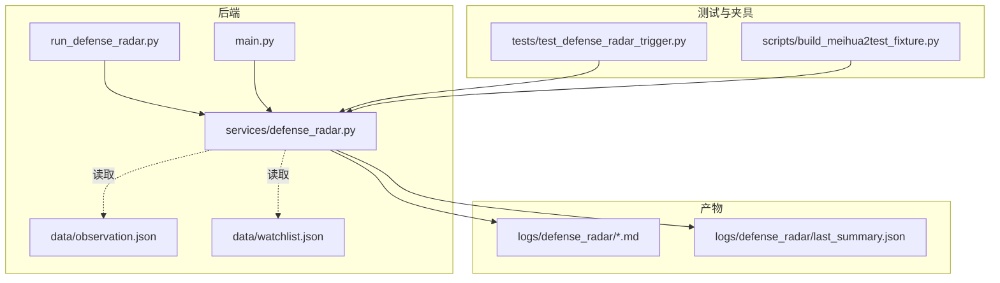
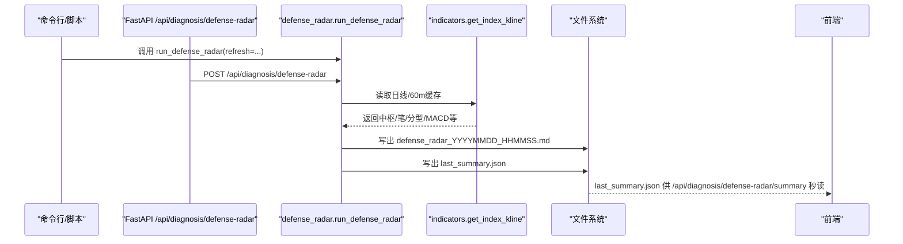
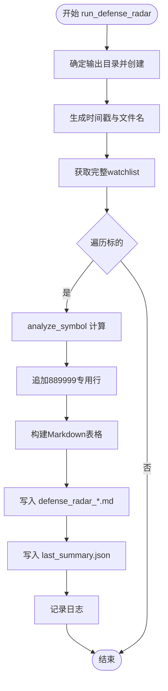
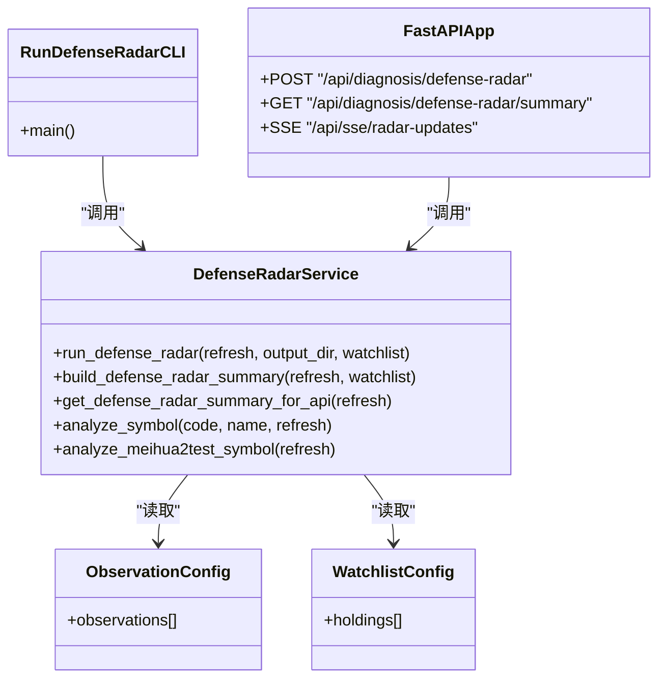

# 雷达产物生成

<cite>
**本文引用的文件**
- [run_defense_radar.py](file://backend/run_defense_radar.py)
- [defense_radar.py](file://backend/services/defense_radar.py)
- [main.py](file://backend/main.py)
- [update_radar.py](file://backend/update_radar.py)
- [last_summary.json](file://logs/defense_radar/last_summary.json)
- [defense_radar_20260420_160909.md](file://logs/defense_radar/defense_radar_20260420_160909.md)
- [observation.json](file://backend/data/observation.json)
- [watchlist.json](file://backend/data/watchlist.json)
- [test_defense_radar_trigger.py](file://backend/tests/test_defense_radar_trigger.py)
- [build_meihua2test_fixture.py](file://backend/scripts/build_meihua2test_fixture.py)
</cite>

## 目录
1. [简介](#简介)
2. [项目结构](#项目结构)
3. [核心组件](#核心组件)
4. [架构总览](#架构总览)
5. [详细组件分析](#详细组件分析)
6. [依赖关系分析](#依赖关系分析)
7. [性能考量](#性能考量)
8. [故障排查指南](#故障排查指南)
9. [结论](#结论)
10. [附录](#附录)

## 简介
本文件面向“双防线雷达产物生成”系统，围绕以下目标展开：
- 详细说明Markdown格式雷达报告的生成过程，包括文件命名规则、目录结构和内容格式。
- 解释last_summary.json摘要文件的结构设计，包括symbols数组、generated_at时间戳和各字段含义。
- 描述run_defense_radar函数的执行流程，包括批量扫描、结果汇总和文件输出。
- 说明雷达产物的版本管理和历史记录策略。
- 解释产物生成的错误处理和异常情况处理机制。
- 提供产物文件的解析和使用方法。
- 说明产物生成的性能监控和日志记录策略。

## 项目结构
雷达产物生成涉及后端服务、定时调度、API接口、前端消费以及本地缓存文件。核心路径如下：
- 后端服务模块：backend/services/defense_radar.py
- 命令行入口：backend/run_defense_radar.py
- Web API入口：backend/main.py
- 雷达产物输出：logs/defense_radar/
- 观察/自选配置：backend/data/observation.json、backend/data/watchlist.json
- 单元测试：backend/tests/test_defense_radar_trigger.py
- 梅花2test夹具生成：backend/scripts/build_meihua2test_fixture.py

图表来源
- [run_defense_radar.py:1-31](file://backend/run_defense_radar.py#L1-L31)
- [defense_radar.py:1-959](file://backend/services/defense_radar.py#L1-L959)
- [main.py:171-206](file://backend/main.py#L171-L206)
- [observation.json:1-25](file://backend/data/observation.json#L1-L25)
- [watchlist.json:1-27](file://backend/data/watchlist.json#L1-L27)
- [test_defense_radar_trigger.py:1-254](file://backend/tests/test_defense_radar_trigger.py#L1-L254)
- [build_meihua2test_fixture.py:1-157](file://backend/scripts/build_meihua2test_fixture.py#L1-L157)

章节来源
- [run_defense_radar.py:1-31](file://backend/run_defense_radar.py#L1-L31)
- [defense_radar.py:1-959](file://backend/services/defense_radar.py#L1-L959)
- [main.py:171-206](file://backend/main.py#L171-L206)

## 核心组件
- 雷达服务模块：负责扫描watchlist、计算指标、生成Markdown报告和last_summary.json。
- 命令行入口：提供脚本式触发雷达扫描的能力。
- Web API入口：提供POST触发、GET摘要、SSE推送等能力。
- 配置与观察：通过observation.json与watchlist.json扩展扫描范围。
- 测试与夹具：提供单元测试与889999（梅花2test）模拟数据生成工具。

章节来源
- [defense_radar.py:418-429](file://backend/services/defense_radar.py#L418-L429)
- [run_defense_radar.py:22-31](file://backend/run_defense_radar.py#L22-L31)
- [main.py:171-206](file://backend/main.py#L171-L206)
- [observation.json:1-25](file://backend/data/observation.json#L1-L25)
- [watchlist.json:1-27](file://backend/data/watchlist.json#L1-L27)

## 架构总览
雷达产物生成采用“只读本地缓存”的设计，依赖kline_scheduler在60m/日线同步后写入本地CSV缓存。雷达扫描时仅读取这些缓存文件，避免频繁拉网。

图表来源
- [run_defense_radar.py:22-31](file://backend/run_defense_radar.py#L22-L31)
- [main.py:189-206](file://backend/main.py#L189-L206)
- [defense_radar.py:747-800](file://backend/services/defense_radar.py#L747-L800)

## 详细组件分析

### 1) Markdown报告生成与命名规则
- 输出目录：logs/defense_radar/
- 文件命名：defense_radar_YYYYMMDD_HHMMSS.md
- 报告内容：
  - 标题与生成时间
  - 表头：代码、标的名称、预警信息、C-ZD价格、A-ZD价格、现价(60m末根收盘)、60分钟笔向、四条件扳机
  - 行内容：逐条标的的计算结果
- 生成时机：命令行触发或API触发；同时写入last_summary.json供前端秒读。

章节来源
- [defense_radar.py:758-765](file://backend/services/defense_radar.py#L758-L765)
- [defense_radar.py:772-791](file://backend/services/defense_radar.py#L772-L791)
- [defense_radar_20260420_160909.md:1-58](file://logs/defense_radar/defense_radar_20260420_160909.md#L1-L58)

### 2) last_summary.json结构设计
- generated_at：ISO时间字符串，表示本次生成时间
- symbols：数组，每个元素为一条标的的摘要项
- 摘要项字段（与前端HourlyBuyConditionFlags对齐）：
  - code、name、alert、has_alert
  - pen_60m、radar_zone_ok、pen_60m_down、macd_momentum_ok、blue_triangle_strict、full_trigger
  - in_c_central、has_bottom_div_in_switch、boll_buy
- 读取策略：优先读last_summary.json；若不存在或损坏则现场计算并回写。

章节来源
- [defense_radar.py:137-144](file://backend/services/defense_radar.py#L137-L144)
- [defense_radar.py:147-166](file://backend/services/defense_radar.py#L147-L166)
- [last_summary.json:1-846](file://logs/defense_radar/last_summary.json#L1-L846)

### 3) run_defense_radar函数执行流程
- 输入参数：refresh（默认False）、output_dir（可选）、watchlist（可选）
- 步骤：
  1) 确定输出目录并创建
  2) 生成时间戳与文件名
  3) 获取完整watchlist（基础watchlist + observation.json去重扩展）
  4) 逐个标的调用analyze_symbol进行计算，收集结果
  5) 追加88999（梅花2test）专用行
  6) 生成Markdown表格并写入文件
  7) 写出last_summary.json
  8) 返回输出路径

图表来源
- [defense_radar.py:747-800](file://backend/services/defense_radar.py#L747-L800)
- [defense_radar.py:418-429](file://backend/services/defense_radar.py#L418-L429)

章节来源
- [defense_radar.py:747-800](file://backend/services/defense_radar.py#L747-L800)

### 4) 扫描范围与watchlist扩展
- 基础watchlist：DEFENSE_RADAR_WATCHLIST
- 扩展watchlist：从observation.json读取，去重后拼接在基础watchlist之后
- 889999（梅花2test）：不混入生产循环，最后单独追加

章节来源
- [defense_radar.py:410-416](file://backend/services/defense_radar.py#L410-L416)
- [observation.json:1-25](file://backend/data/observation.json#L1-L25)

### 5) 错误处理与异常情况
- 数据拉取异常：捕获异常并记录日志，返回包含error字段的DefenseRow
- 文件读写异常：捕获异常并记录日志，不影响整体流程
- 上证指数排除：直接返回跳过标记
- last_summary.json损坏：返回None，回退现场计算

章节来源
- [defense_radar.py:600-631](file://backend/services/defense_radar.py#L600-L631)
- [defense_radar.py:122-134](file://backend/services/defense_radar.py#L122-L134)
- [defense_radar.py:137-144](file://backend/services/defense_radar.py#L137-L144)

### 6) 产物解析与使用
- last_summary.json：供GET /api/diagnosis/defense-radar/summary秒读，前端据此渲染Tab与筛选
- Markdown报告：用于归档与人工审阅
- 名称缓存：从last_summary.json + watchlist预加载，提升名称查询效率

章节来源
- [main.py:171-181](file://backend/main.py#L171-L181)
- [main.py:259-317](file://backend/main.py#L259-L317)

### 7) 性能监控与日志记录
- 日志级别：INFO，包含执行耗时与结果数量
- SSE推送：调度完成后通知前端客户端
- API层统一异常处理，便于定位问题

章节来源
- [run_defense_radar.py:22-26](file://backend/run_defense_radar.py#L22-L26)
- [main.py:72-77](file://backend/main.py#L72-L77)
- [main.py:213-252](file://backend/main.py#L213-L252)

## 依赖关系分析

图表来源
- [run_defense_radar.py:22-31](file://backend/run_defense_radar.py#L22-L31)
- [defense_radar.py:418-429](file://backend/services/defense_radar.py#L418-L429)
- [main.py:171-206](file://backend/main.py#L171-L206)
- [observation.json:1-25](file://backend/data/observation.json#L1-L25)
- [watchlist.json:1-27](file://backend/data/watchlist.json#L1-L27)

章节来源
- [defense_radar.py:418-429](file://backend/services/defense_radar.py#L418-L429)
- [main.py:171-206](file://backend/main.py#L171-L206)

## 性能考量
- 只读本地缓存：避免重复拉网，提高吞吐
- 仅在排障场景使用refresh=True
- SSE推送减少轮询压力
- 名称缓存预加载，降低查询延迟

## 故障排查指南
- 本地缓存缺失：确认kline_scheduler定时任务已运行并生成CSV缓存
- last_summary.json损坏：删除或修复后由API回写
- 889999（梅花2test）异常：使用build_meihua2test_fixture.py生成夹具数据
- 单元测试验证：参考test_defense_radar_trigger.py中的边界用例

章节来源
- [test_defense_radar_trigger.py:1-254](file://backend/tests/test_defense_radar_trigger.py#L1-L254)
- [build_meihua2test_fixture.py:1-157](file://backend/scripts/build_meihua2test_fixture.py#L1-L157)

## 结论
本系统以“只读本地缓存”为核心，通过run_defense_radar统一产出Markdown报告与last_summary.json摘要，配合Web API与SSE实现前后端高效协同。watchlist与observation配置灵活扩展扫描范围，错误处理与日志记录保障稳定性，单元测试与夹具工具提升可维护性。

## 附录

### A. 历史记录与版本管理
- 历史报告：按时间戳命名的多个defense_radar_*.md文件
- 摘要缓存：last_summary.json作为“最新快照”，供前端秒读
- 建议策略：
  - 保留近N份报告用于回溯
  - 对last_summary.json做备份与校验
  - 使用Git钩子或CI定期清理过期产物

章节来源
- [defense_radar.py:758-765](file://backend/services/defense_radar.py#L758-L765)
- [last_summary.json:1-846](file://logs/defense_radar/last_summary.json#L1-L846)

### B. API与脚本使用要点
- 命令行：python backend/run_defense_radar.py [--refresh]
- Web API：
  - POST /api/diagnosis/defense-radar（refresh=false默认）
  - GET /api/diagnosis/defense-radar/summary（优先读last_summary.json）
  - GET /api/sse/radar-updates（SSE）

章节来源
- [run_defense_radar.py:1-9](file://backend/run_defense_radar.py#L1-L9)
- [main.py:171-206](file://backend/main.py#L171-L206)
- [main.py:213-252](file://backend/main.py#L213-L252)