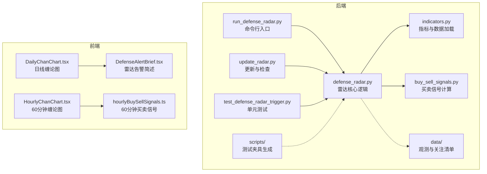
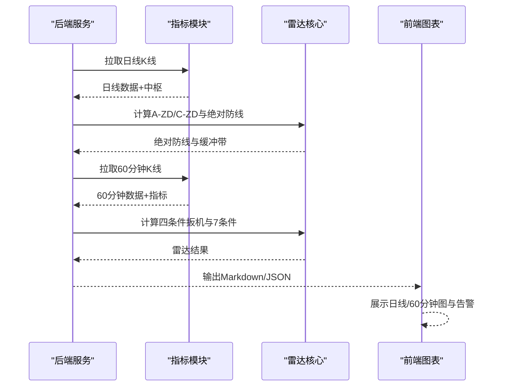
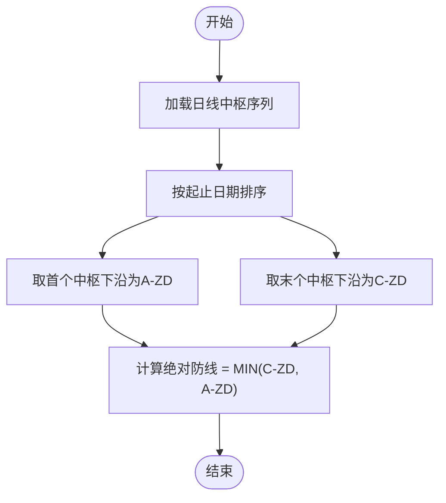
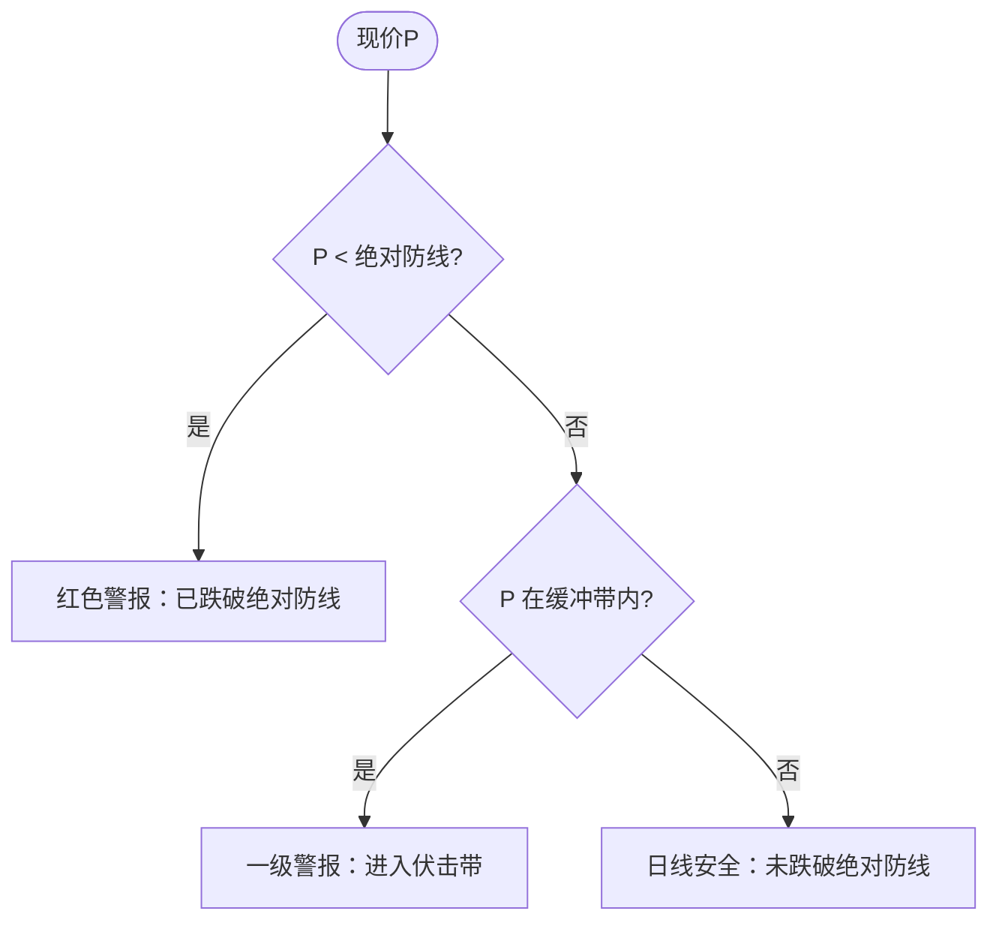
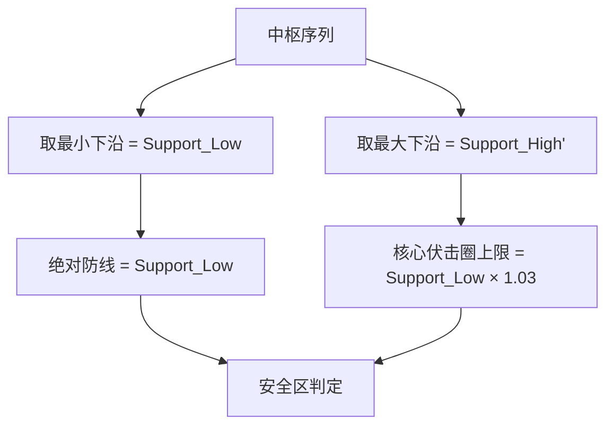
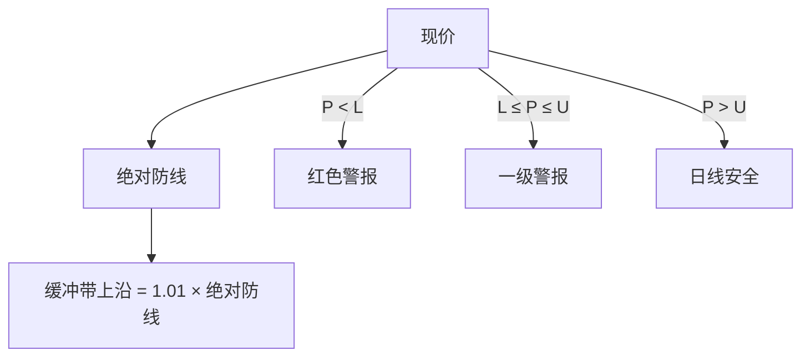
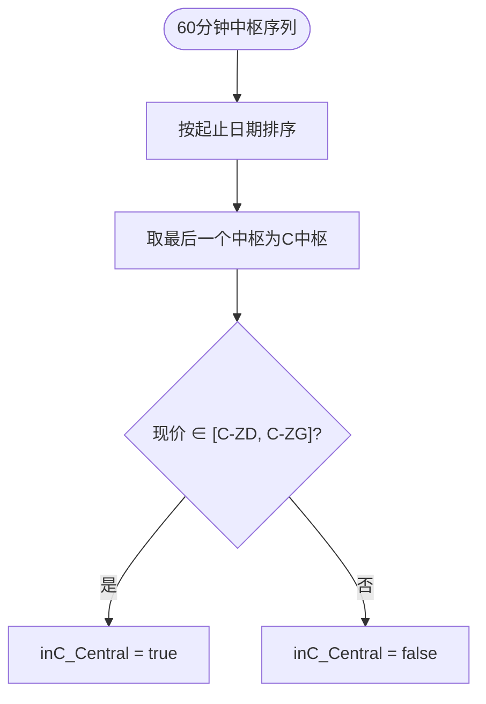
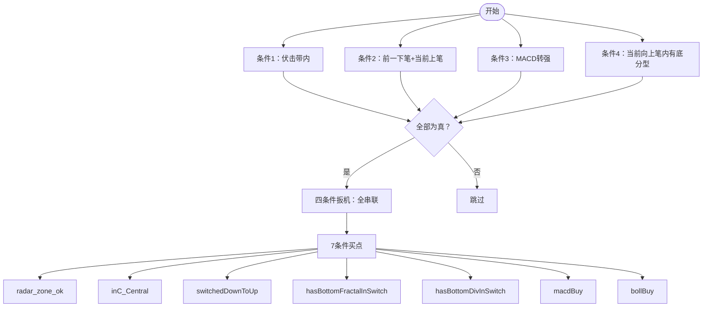
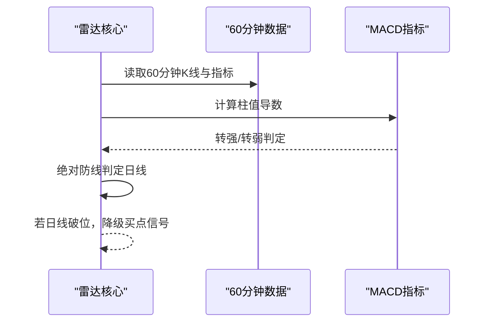
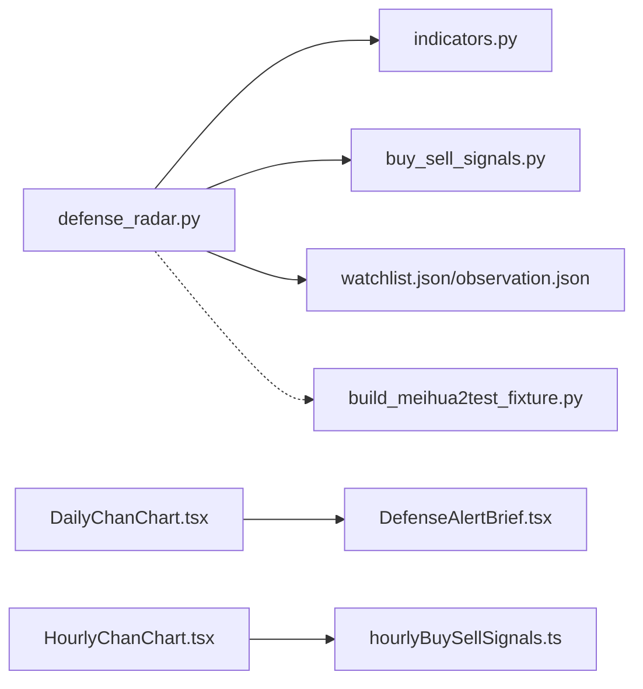

# 雷达理论基础

<cite>
**本文引用的文件**
- [defense_radar.py](file://backend/services/defense_radar.py)
- [indicators.py](file://backend/services/indicators.py)
- [buy_sell_signals.py](file://backend/services/buy_sell_signals.py)
- [run_defense_radar.py](file://backend/run_defense_radar.py)
- [update_radar.py](file://backend/update_radar.py)
- [test_defense_radar_trigger.py](file://backend/tests/test_defense_radar_trigger.py)
- [DailyChanChart.tsx](file://frontend/src/DailyChanChart.tsx)
- [HourlyChanChart.tsx](file://frontend/src/HourlyChanChart.tsx)
- [DefenseAlertBrief.tsx](file://frontend/src/DefenseAlertBrief.tsx)
- [hourlyBuySellSignals.ts](file://frontend/src/hourlyBuySellSignals.ts)
- [watchlist.json](file://backend/data/watchlist.json)
- [observation.json](file://backend/data/observation.json)
- [build_meihua2test_fixture.py](file://backend/scripts/build_meihua2test_fixture.py)
</cite>

## 目录
1. [简介](#简介)
2. [项目结构](#项目结构)
3. [核心组件](#核心组件)
4. [架构总览](#架构总览)
5. [详细组件分析](#详细组件分析)
6. [依赖关系分析](#依赖关系分析)
7. [性能考量](#性能考量)
8. [故障排查指南](#故障排查指南)
9. [结论](#结论)
10. [附录](#附录)

## 简介
本文件面向双防线雷达理论基础，系统阐述缠论在雷达系统中的应用原理，重点包括：
- A-ZD（时间轴上第一个中枢下沿）与 C-ZD（最后一个中枢下沿）的计算方法与数学意义
- 绝对防线逻辑的实现：MIN(C-ZD, A-ZD)、1%缓冲带设计原理与破位判断标准
- Support_High 与 Support_Low 的计算方式及其在雷达系统中的作用
- 雷达分类体系的理论基础：一级警报、终极警报、红色警报的区别
- 现价与中枢关系的判断逻辑及不同警报级别的触发条件
- 理论公式的数学表达与实际应用场景

## 项目结构
后端采用模块化设计，前端负责可视化与交互，雷达核心逻辑集中在后端服务模块中，通过定时任务与API接口驱动。

**图表来源**
- [defense_radar.py:1-959](file://backend/services/defense_radar.py#L1-L959)
- [indicators.py:1-1947](file://backend/services/indicators.py#L1-L1947)
- [buy_sell_signals.py:1-955](file://backend/services/buy_sell_signals.py#L1-L955)
- [run_defense_radar.py:1-31](file://backend/run_defense_radar.py#L1-L31)
- [update_radar.py:1-47](file://backend/update_radar.py#L1-L47)
- [DailyChanChart.tsx:1-820](file://frontend/src/DailyChanChart.tsx#L1-L820)
- [HourlyChanChart.tsx:1-1632](file://frontend/src/HourlyChanChart.tsx#L1-L1632)
- [DefenseAlertBrief.tsx:1-88](file://frontend/src/DefenseAlertBrief.tsx#L1-L88)
- [hourlyBuySellSignals.ts:1-1676](file://frontend/src/hourlyBuySellSignals.ts#L1-L1676)

**章节来源**
- [defense_radar.py:1-150](file://backend/services/defense_radar.py#L1-L150)
- [indicators.py:1-120](file://backend/services/indicators.py#L1-L120)
- [DailyChanChart.tsx:161-250](file://frontend/src/DailyChanChart.tsx#L161-L250)

## 核心组件
- 雷达核心模块：负责中枢提取、绝对防线计算、缓冲带与破位判断、四条件扳机与7条件买点筛选
- 指标与数据加载：负责K线缓存读取、MACD/BOLL/KDJ等指标计算、分型与笔/中枢构建
- 买卖信号模块：负责一买/二买/三买与一卖/二卖/三卖的识别与过滤
- 前端图表与告警：负责日线/60分钟图展示、雷达告警简述、60分钟买点7条件面板

**章节来源**
- [defense_radar.py:563-744](file://backend/services/defense_radar.py#L563-L744)
- [indicators.py:657-690](file://backend/services/indicators.py#L657-L690)
- [buy_sell_signals.py:581-790](file://backend/services/buy_sell_signals.py#L581-L790)
- [DailyChanChart.tsx:161-250](file://frontend/src/DailyChanChart.tsx#L161-L250)

## 架构总览
雷达系统遵循“日线中枢 + 60分钟现价”的双级别联动策略：
- 日线阶段：提取中枢序列，计算A-ZD与C-ZD，形成绝对防线MIN(C-ZD, A-ZD)
- 60分钟阶段：以日线中枢为跨级别风控基准，结合MACD、BOLL、底分型等条件进行买点筛选
- 前端展示：日线图标注中枢与核心伏击圈，60分钟图展示7条件与买卖信号

**图表来源**
- [defense_radar.py:600-744](file://backend/services/defense_radar.py#L600-L744)
- [indicators.py:657-690](file://backend/services/indicators.py#L657-L690)
- [DailyChanChart.tsx:161-250](file://frontend/src/DailyChanChart.tsx#L161-L250)
- [HourlyChanChart.tsx:179-250](file://frontend/src/HourlyChanChart.tsx#L179-L250)

## 详细组件分析

### A-ZD与C-ZD的计算与数学意义
- A-ZD：时间轴上第一个中枢的下沿，代表最久远的支撑位
- C-ZD：时间轴上最后一个中枢的下沿，代表最新的支撑位
- 数学意义：两者共同构成“绝对防线”，MIN(C-ZD, A-ZD)为最终防线基准，体现“越新越强”的中枢优先原则

**图表来源**
- [defense_radar.py:179-194](file://backend/services/defense_radar.py#L179-L194)

**章节来源**
- [defense_radar.py:179-194](file://backend/services/defense_radar.py#L179-L194)

### 绝对防线逻辑与缓冲带设计
- 绝对防线：absolute_bottom = MIN(C-ZD, A-ZD)
- 缓冲带：[absolute_bottom × 0.99, absolute_bottom × 1.01]，用于识别“伏击带”
- 破位判断：现价 < absolute_bottom 视为跌破绝对防线，红色警报
- 伏击带内：现价 ∈ [absolute_bottom, absolute_bottom × 1.01]，一级警报
- 未跌破：现价 > absolute_bottom × 1.01，日线安全

**图表来源**
- [defense_radar.py:196-216](file://backend/services/defense_radar.py#L196-L216)
- [DefenseAlertBrief.tsx:11-26](file://frontend/src/DefenseAlertBrief.tsx#L11-L26)

**章节来源**
- [defense_radar.py:196-216](file://backend/services/defense_radar.py#L196-L216)
- [DefenseAlertBrief.tsx:11-26](file://frontend/src/DefenseAlertBrief.tsx#L11-L26)

### Support_High与Support_Low的计算与作用
- Support_Low：日线中枢序列的最小下沿，即min(C-ZD, A-ZD)，作为绝对防线的下界
- Support_High：日线中枢序列的最大下沿，用于前端核心伏击圈的上限（通常为Support_Low × 1.03）
- 作用：Support_Low决定是否进入伏击带，Support_High决定核心伏击圈的上限范围，二者共同限定雷达的“安全区”

**图表来源**
- [defense_radar.py:684-686](file://backend/services/defense_radar.py#L684-L686)
- [DailyChanChart.tsx:240-248](file://frontend/src/DailyChanChart.tsx#L240-L248)

**章节来源**
- [defense_radar.py:684-686](file://backend/services/defense_radar.py#L684-L686)
- [DailyChanChart.tsx:240-248](file://frontend/src/DailyChanChart.tsx#L240-L248)

### 雷达分类体系与触发条件
- 一级警报：现价处于绝对防线缓冲带内（MIN(C-ZD, A-ZD) ≤ P ≤ MIN(C-ZD, A-ZD) × 1.01）
- 红色警报：现价跌破绝对防线（P < MIN(C-ZD, A-ZD)）
- 日线安全：现价高于缓冲带上沿（P > MIN(C-ZD, A-ZD) × 1.01）

**图表来源**
- [defense_radar.py:196-216](file://backend/services/defense_radar.py#L196-L216)

**章节来源**
- [defense_radar.py:196-216](file://backend/services/defense_radar.py#L196-L216)

### 现价与中枢关系的判断逻辑
- 现价与C中枢的关系：用于60分钟买点7条件中的“inC_Central”（现价在C中枢内）
- 判断方法：对60分钟中枢序列按时间排序，取最后一个中枢（C中枢），判断现价是否位于[ZD, ZG]区间
- 与日线绝对防线的联动：若日线跌破绝对防线，所有60分钟买点信号将被降级或灰显

**图表来源**
- [defense_radar.py:505-520](file://backend/services/defense_radar.py#L505-L520)

**章节来源**
- [defense_radar.py:505-520](file://backend/services/defense_radar.py#L505-L520)

### 四条件扳机与7条件买点
- 四条件扳机（全串联）：
  1) 伏击带内（现价在缓冲带内）
  2) 60分钟有效笔：前一下笔、当前上笔
  3) MACD转强（柱值导数为正）
  4) 当前向上笔内有底分型
- 7条件买点（与前端对齐）：
  - radar_zone_ok：现价 ≥ 绝对防线（日线未破位）
  - inC_Central：现价在C中枢内
  - switchedDownToUp：前一下笔、当前上笔
  - hasBottomFractalInSwitch：当前向上笔内有底分型
  - hasBottomDivInSwitch：底背驰点落在当前向上笔内
  - macdBuy：MACD转强
  - bollBuy：BOLL站回中轨

**图表来源**
- [defense_radar.py:719-744](file://backend/services/defense_radar.py#L719-L744)
- [hourlyBuySellSignals.ts:112-120](file://frontend/src/hourlyBuySellSignals.ts#L112-L120)

**章节来源**
- [defense_radar.py:719-744](file://backend/services/defense_radar.py#L719-L744)
- [hourlyBuySellSignals.ts:112-120](file://frontend/src/hourlyBuySellSignals.ts#L112-L120)

### 绝对防线与MACD动能的联动
- 绝对防线用于“日线破位降级”：若日线跌破绝对防线，所有60分钟买点信号强制降级或灰显
- MACD转强用于“动能确认”：柱值导数为正，反映动能向上（水下底背驰或水上主升浪）

**图表来源**
- [defense_radar.py:698-704](file://backend/services/defense_radar.py#L698-L704)
- [HourlyChanChart.tsx:444-450](file://frontend/src/HourlyChanChart.tsx#L444-L450)

**章节来源**
- [defense_radar.py:698-704](file://backend/services/defense_radar.py#L698-L704)
- [HourlyChanChart.tsx:444-450](file://frontend/src/HourlyChanChart.tsx#L444-L450)

## 依赖关系分析
- 雷达核心依赖指标模块进行K线与指标计算
- 前端图表依赖雷达结果与买卖信号模块进行可视化
- 观测与关注清单影响雷达扫描范围与输出

**图表来源**
- [defense_radar.py:1-150](file://backend/services/defense_radar.py#L1-L150)
- [indicators.py:1-120](file://backend/services/indicators.py#L1-L120)
- [watchlist.json:1-27](file://backend/data/watchlist.json#L1-L27)
- [observation.json:1-25](file://backend/data/observation.json#L1-L25)
- [DailyChanChart.tsx:161-250](file://frontend/src/DailyChanChart.tsx#L161-L250)
- [DefenseAlertBrief.tsx:1-88](file://frontend/src/DefenseAlertBrief.tsx#L1-L88)
- [HourlyChanChart.tsx:179-250](file://frontend/src/HourlyChanChart.tsx#L179-L250)
- [hourlyBuySellSignals.ts:1-160](file://frontend/src/hourlyBuySellSignals.ts#L1-L160)
- [build_meihua2test_fixture.py:1-157](file://backend/scripts/build_meihua2test_fixture.py#L1-L157)

**章节来源**
- [defense_radar.py:1-150](file://backend/services/defense_radar.py#L1-L150)
- [indicators.py:1-120](file://backend/services/indicators.py#L1-L120)
- [watchlist.json:1-27](file://backend/data/watchlist.json#L1-L27)
- [observation.json:1-25](file://backend/data/observation.json#L1-L25)

## 性能考量
- 缓存与重试：指标模块对K线缓存与网络请求进行重试与缓存管理，减少重复拉取
- 响应式更新：前端图表按需渲染，雷达结果通过JSON缓存实现秒读
- 本地化处理：雷达默认只读本地缓存，避免在线拉取带来的延迟

**章节来源**
- [indicators.py:234-249](file://backend/services/indicators.py#L234-L249)
- [defense_radar.py:147-166](file://backend/services/defense_radar.py#L147-L166)

## 故障排查指南
- 数据异常：检查日线/60分钟K线缓存是否存在，确认指标计算是否成功
- 破位降级：若日线跌破绝对防线，60分钟买点信号将被降级或灰显
- 缓冲带误判：确认A-ZD/C-ZD计算是否正确，缓冲带上下限是否符合1%规则
- 条件不满足：核对四条件扳机与7条件买点的具体实现，确保MACD转强、底分型、BOLL站回中轨等条件满足

**章节来源**
- [defense_radar.py:612-631](file://backend/services/defense_radar.py#L612-L631)
- [test_defense_radar_trigger.py:1-254](file://backend/tests/test_defense_radar_trigger.py#L1-L254)

## 结论
双防线雷达通过“日线中枢 + 60分钟现价”的双级别联动，实现了对中枢支撑的有效识别与风险控制。绝对防线MIN(C-ZD, A-ZD)与1%缓冲带构成了雷达的核心阈值，配合MACD动能、底分型与BOLL站回中轨等条件，形成了稳健的四条件扳机与7条件买点体系。前端图表与告警模块进一步增强了可读性与实用性，为实战交易提供了清晰的决策依据。

## 附录
- 理论公式
  - 绝对防线：$ \text{Absolute Bottom} = \min(\text{C-ZD}, \text{A-ZD}) $
  - 缓冲带：$ [\text{Absolute Bottom} \times 0.99, \text{Absolute Bottom} \times 1.01] $
  - 破位判断：$ P < \text{Absolute Bottom} \Rightarrow \text{红色警报} $
  - 伏击带：$ \text{Absolute Bottom} \leq P \leq \text{Absolute Bottom} \times 1.01 \Rightarrow \text{一级警报} $
  - 日线安全：$ P > \text{Absolute Bottom} \times 1.01 \Rightarrow \text{日线安全} $

- 实际应用场景
  - 一级警报：进入核心伏击圈，建议关注60分钟买点7条件
  - 红色警报：跌破绝对防线，禁买或清仓
  - 日线安全：未跌破绝对防线，等待更优入场点