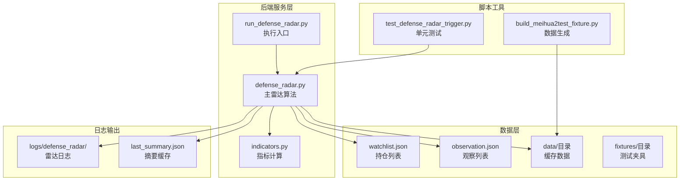
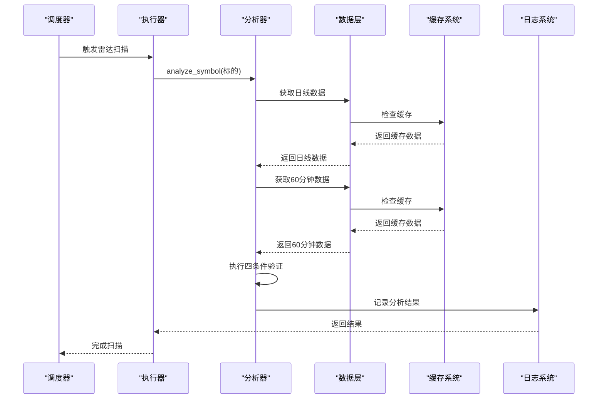
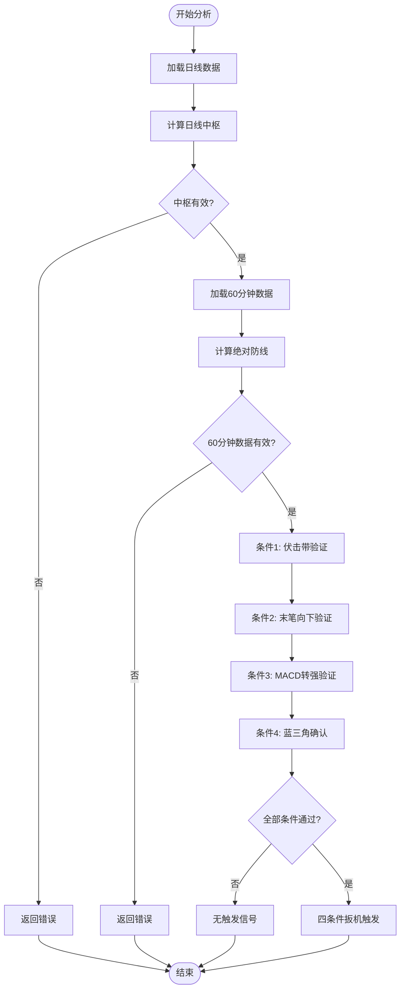
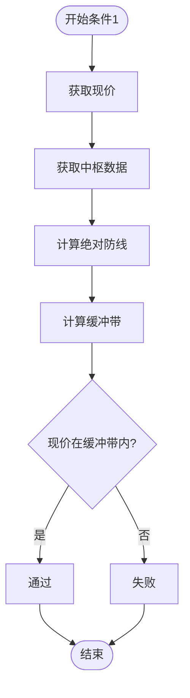
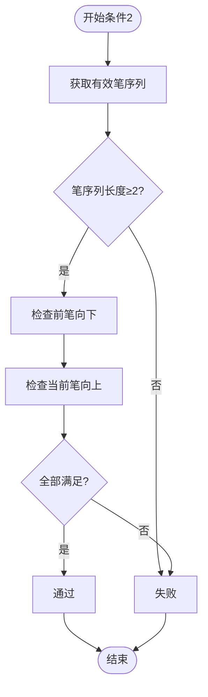
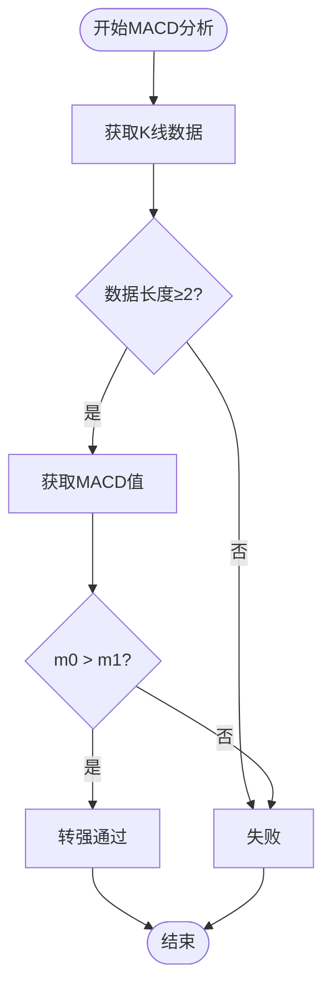
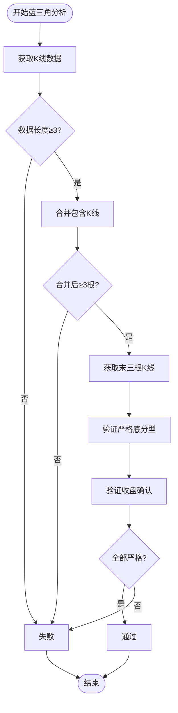
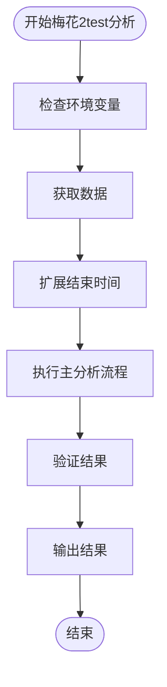
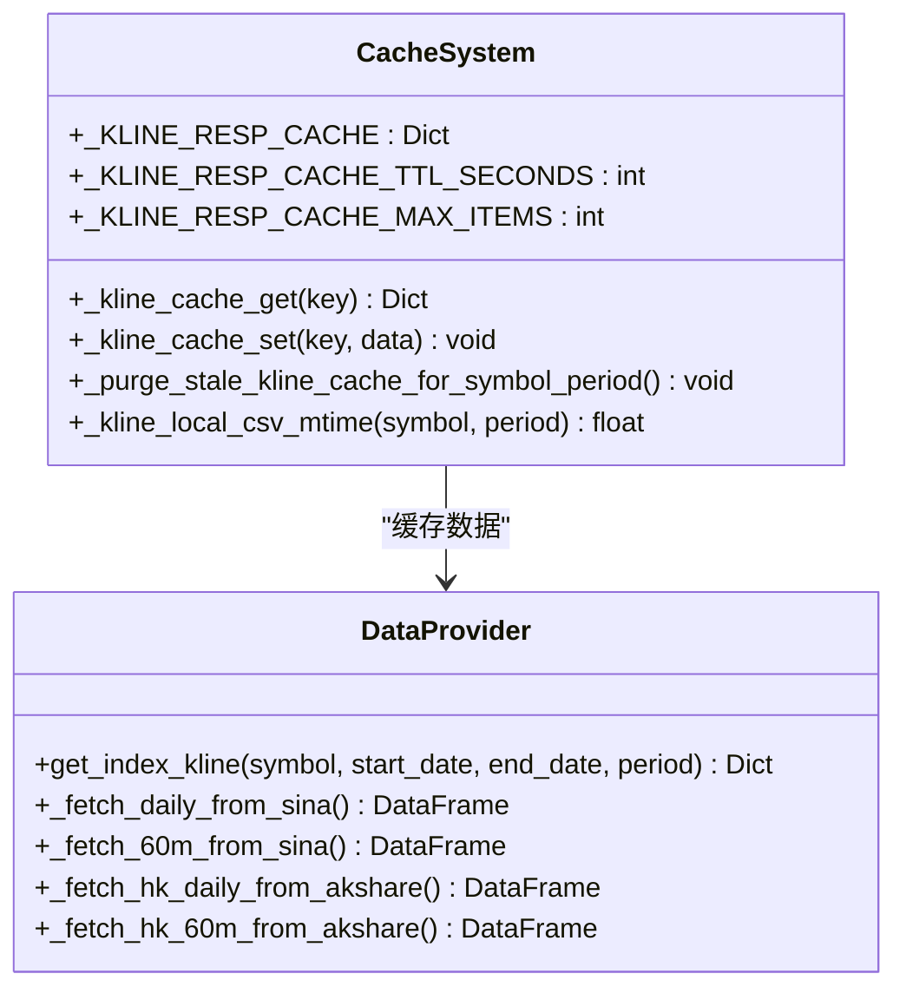
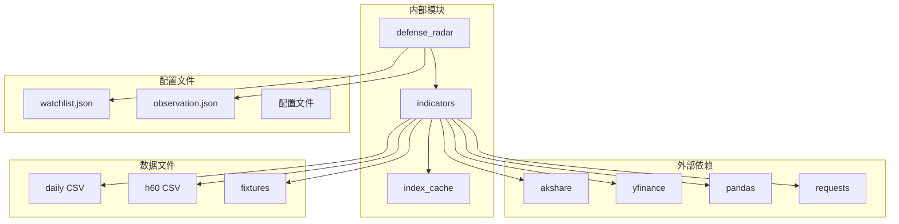

# 雷达算法实现

<cite>
**本文档引用的文件**
- [defense_radar.py](file://backend/services/defense_radar.py)
- [indicators.py](file://backend/services/indicators.py)
- [run_defense_radar.py](file://backend/run_defense_radar.py)
- [test_defense_radar_trigger.py](file://backend/tests/test_defense_radar_trigger.py)
- [build_meihua2test_fixture.py](file://backend/scripts/build_meihua2test_fixture.py)
- [watchlist.json](file://backend/data/watchlist.json)
- [observation.json](file://backend/data/observation.json)
- [kline_60_889999.csv](file://backend/tests/fixtures/meihua2test/kline_60_889999.csv)
- [a_daily_qfq_889999.csv](file://backend/tests/fixtures/meihua2test/a_daily_qfq_889999.csv)
</cite>

## 目录
1. [简介](#简介)
2. [项目结构](#项目结构)
3. [核心组件](#核心组件)
4. [架构概览](#架构概览)
5. [详细组件分析](#详细组件分析)
6. [依赖关系分析](#依赖关系分析)
7. [性能考虑](#性能考虑)
8. [故障排除指南](#故障排除指南)
9. [结论](#结论)

## 简介

双防线雷达算法是一个基于缠论技术分析的智能预警系统，专门用于识别潜在的买入机会。该系统通过四个关键条件的串联验证，结合绝对防线理论，为投资者提供精确的入场时机建议。

该算法的核心特色包括：
- **四条件扳机串联**：严格的条件验证顺序确保信号质量
- **绝对防线理论**：基于日线中枢的防御机制
- **MACD动能分析**：深度的动量指标计算
- **严格底分型确认**：精确的形态识别
- **梅花2test专用算法**：独立的数据验证系统

## 项目结构

**图表来源**
- [defense_radar.py:1-50](file://backend/services/defense_radar.py#L1-L50)
- [indicators.py:1-50](file://backend/services/indicators.py#L1-L50)
- [run_defense_radar.py:1-31](file://backend/run_defense_radar.py#L1-L31)

**章节来源**
- [defense_radar.py:1-100](file://backend/services/defense_radar.py#L1-L100)
- [indicators.py:1-100](file://backend/services/indicators.py#L1-L100)

## 核心组件

### 主要算法组件

1. **analyze_symbol函数**：核心分析引擎，处理单个标的的完整分析流程
2. **四条件扳机系统**：串联验证的四个关键条件
3. **绝对防线计算**：基于日线中枢的防御机制
4. **MACD动能分析**：深度的动量指标计算
5. **严格底分型识别**：精确的形态确认机制

### 数据结构组件

1. **DefenseRow数据类**：存储分析结果的结构化数据
2. **Watchlist管理**：标的列表的动态管理
3. **缓存系统**：本地数据缓存和失效机制
4. **日志系统**：完整的分析过程记录

**章节来源**
- [defense_radar.py:563-582](file://backend/services/defense_radar.py#L563-L582)
- [defense_radar.py:418-429](file://backend/services/defense_radar.py#L418-L429)

## 架构概览

**图表来源**
- [defense_radar.py:747-800](file://backend/services/defense_radar.py#L747-L800)
- [defense_radar.py:600-745](file://backend/services/defense_radar.py#L600-L745)

## 详细组件分析

### analyze_symbol函数核心算法

analyze_symbol是整个雷达系统的核心，负责对单个标的进行完整的分析流程。

#### 算法流程

**图表来源**
- [defense_radar.py:593-745](file://backend/services/defense_radar.py#L593-L745)

#### 数据获取阶段

1. **日线数据获取**：获取380天的历史数据用于中枢计算
2. **60分钟数据获取**：获取90天的历史数据用于实时分析
3. **数据验证**：确保数据完整性，处理异常情况

#### 分析阶段

1. **绝对防线计算**：基于MIN(C-ZD, A-ZD)计算安全价格线
2. **中枢分析**：识别日线中枢结构
3. **笔向分析**：确定60分钟笔的方向变化
4. **MACD分析**：计算动能指标和转强信号
5. **形态确认**：识别严格底分型结构

**章节来源**
- [defense_radar.py:600-745](file://backend/services/defense_radar.py#L600-L745)

### 四条件扳机系统详解

#### 条件1：伏击带±1%验证

**图表来源**
- [defense_radar.py:196-226](file://backend/services/defense_radar.py#L196-L226)

**条件实现细节**：
- 使用MIN(C-ZD, A-ZD)作为绝对防线
- 设置1%的缓冲带宽度
- 严格区分"已跌破"、"进入伏击圈"、"未跌破"三种状态

#### 条件2：末笔有效笔向下验证

**图表来源**
- [defense_radar.py:688-696](file://backend/services/defense_radar.py#L688-L696)

**实现要点**：
- 使用"前一下笔+当前上笔"的组合验证
- 区分"末笔向下"和"切换为向上"的概念
- 确保笔序列的连续性和有效性

#### 条件3：MACD转强条件

MACD转强验证采用严格的动能分析方法：

**计算方法**：
1. **基础转强**：当前柱值 > 前一根柱值
2. **场景分类**：
   - 场景A：水下底背驰（绿柱缩短）
   - 场景B：水上主升浪（红柱伸长）
   - 场景C：水下主跌浪（绿柱伸长）
   - 场景D：水上顶背驰（红柱缩短）

**算法实现**：

**图表来源**
- [defense_radar.py:342-371](file://backend/services/defense_radar.py#L342-L371)

**阈值设置**：
- 严格基于柱值比较，不使用固定阈值
- 自动适应不同市场的波动性
- 支持正负值的统一处理

#### 条件4：蓝三角严格底分型确认

**图表来源**
- [defense_radar.py:256-290](file://backend/services/defense_radar.py#L256-L290)

**严格底分型三个标准**：
1. **严格低点**：中间K线的最低点低于左右两侧
2. **严格高点**：中间K线的最高点低于左右两侧  
3. **收盘确认**：第三根K线收盘价高于中间K线最低点

**章节来源**
- [defense_radar.py:256-290](file://backend/services/defense_radar.py#L256-L290)

### analyze_meihua2test_symbol专用算法

梅花2test（889999）是专门为测试设计的专用算法，具有以下特殊处理逻辑：

#### 独特特性

1. **数据隔离**：不参与主雷达列表，单独处理
2. **未来数据支持**：自动扩展到本地CSV的最大时间
3. **环境变量控制**：通过MEIHUA2TEST_FUTURE_K控制行为
4. **夹具数据验证**：使用测试夹具确保算法稳定性

#### 算法流程

**图表来源**
- [defense_radar.py:584-591](file://backend/services/defense_radar.py#L584-L591)

**章节来源**
- [defense_radar.py:584-591](file://backend/services/defense_radar.py#L584-L591)

### 数据获取和处理机制

#### 缓存系统设计

**图表来源**
- [indicators.py:91-174](file://backend/services/indicators.py#L91-L174)
- [indicators.py:447-581](file://backend/services/indicators.py#L447-L581)

**章节来源**
- [indicators.py:91-174](file://backend/services/indicators.py#L91-L174)

## 依赖关系分析

**图表来源**
- [indicators.py:17-25](file://backend/services/indicators.py#L17-L25)
- [defense_radar.py:27](file://backend/services/defense_radar.py#L27)

**章节来源**
- [indicators.py:17-25](file://backend/services/indicators.py#L17-L25)

## 性能考虑

### 缓存优化策略

1. **响应缓存**：内存级缓存最近的K线请求响应
2. **TTL控制**：5分钟的缓存有效期
3. **大小限制**：最多256个缓存项，防止内存泄漏
4. **失效机制**：当本地CSV更新时自动清理相关缓存

### 数据访问优化

1. **批量读取**：一次性读取所需时间段的数据
2. **索引优化**：使用pandas的高效数据结构
3. **数据类型优化**：合理使用数值类型减少内存占用
4. **异常处理**：优雅处理网络和文件系统异常

### 并发处理

1. **异步I/O**：网络请求使用超时和重试机制
2. **资源管理**：正确关闭文件句柄和网络连接
3. **错误恢复**：单个标的失败不影响整体执行

## 故障排除指南

### 常见问题及解决方案

#### 数据获取失败

**症状**：日线或60分钟数据为空
**原因**：
- 网络连接异常
- 本地缓存损坏
- 数据源不可用

**解决方法**：
1. 检查网络连接状态
2. 删除损坏的缓存文件
3. 重新生成缓存数据

#### 中枢计算错误

**症状**：无法计算日线中枢
**原因**：
- 数据不足（少于380天）
- 数据质量差
- 符号格式不正确

**解决方法**：
1. 确保有足够的历史数据
2. 检查数据完整性
3. 验证符号格式

#### MACD计算异常

**症状**：MACD值异常或为空
**原因**：
- 计算参数错误
- 数据格式不正确
- 指标计算失败

**解决方法**：
1. 检查数据格式
2. 验证计算参数
3. 重新计算指标

### 调试技巧

1. **启用详细日志**：查看完整的分析过程
2. **单元测试**：使用测试用例验证特定功能
3. **数据可视化**：绘制关键指标图表
4. **性能监控**：监控内存和CPU使用情况

**章节来源**
- [test_defense_radar_trigger.py:1-254](file://backend/tests/test_defense_radar_trigger.py#L1-L254)

## 结论

双防线雷达算法实现了一个完整的量化分析系统，具有以下特点：

### 技术优势

1. **严谨的算法设计**：四条件串联确保信号质量
2. **完善的缓存机制**：高效的本地数据管理
3. **灵活的配置选项**：支持多种数据源和参数调整
4. **全面的错误处理**：健壮的异常处理机制

### 应用价值

1. **投资决策支持**：提供客观的买入时机建议
2. **风险控制**：基于绝对防线的防御机制
3. **自动化程度高**：减少人工分析工作量
4. **可扩展性强**：易于添加新的分析指标

### 发展方向

1. **机器学习集成**：引入AI增强预测能力
2. **实时监控**：支持实时数据流处理
3. **多市场适配**：扩展到其他金融市场
4. **用户界面优化**：改进用户体验和交互

该系统为投资者提供了一个可靠的量化分析工具，通过严格的算法设计和完善的工程实践，确保了系统的稳定性和准确性。