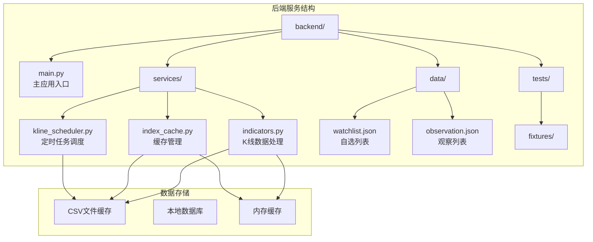
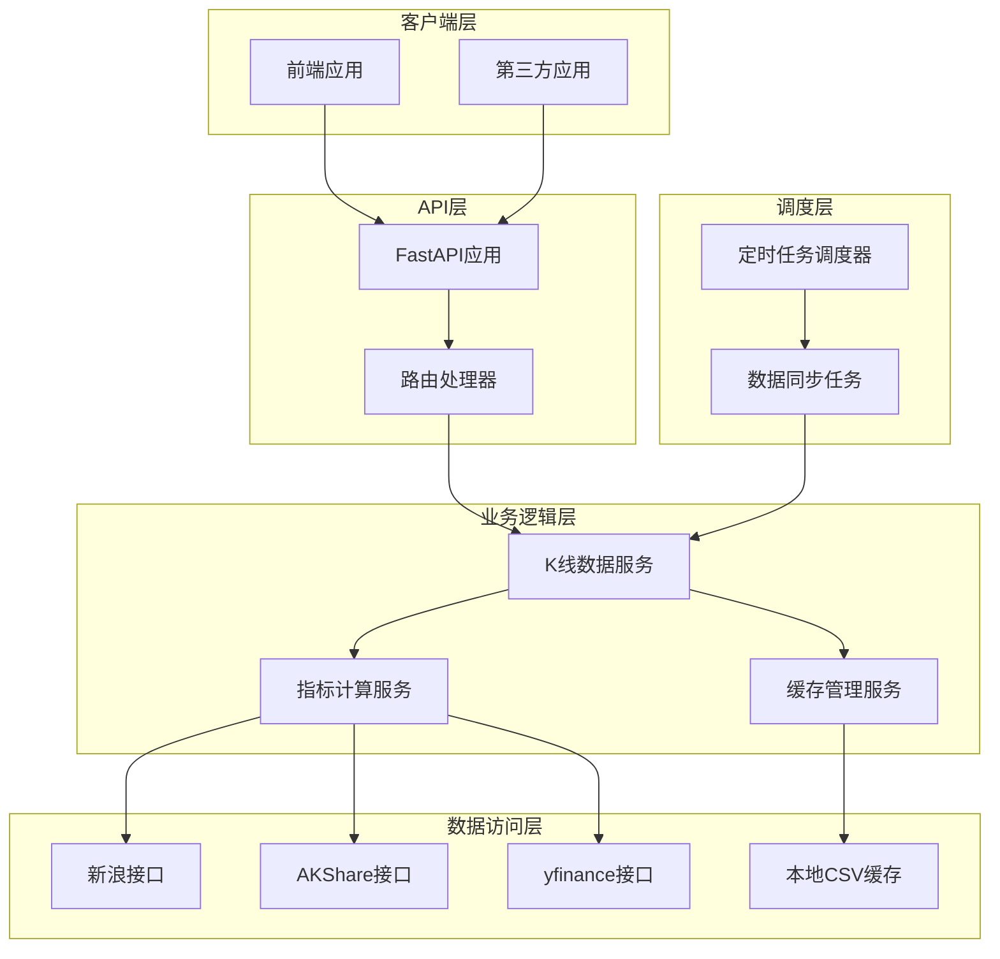
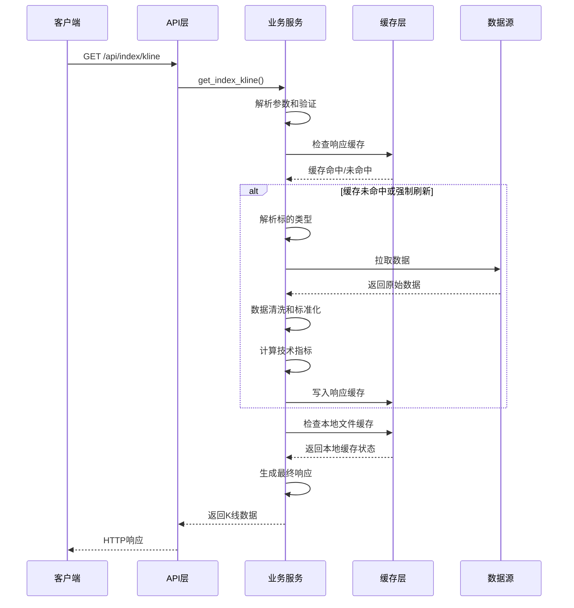
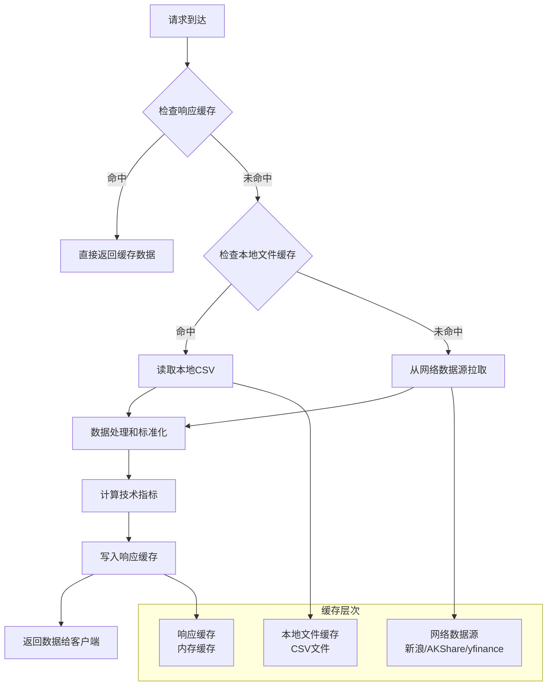
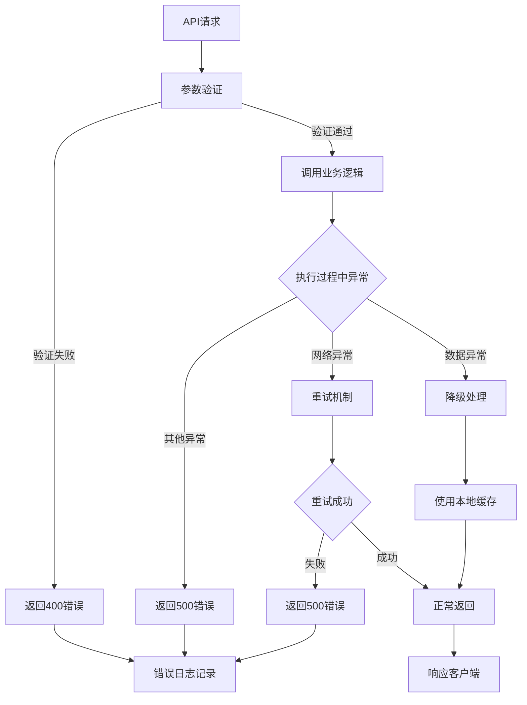
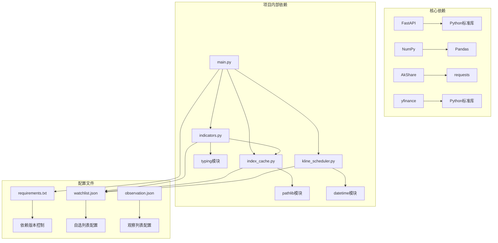
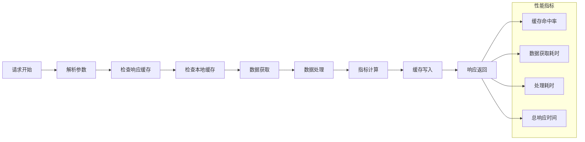

# K线数据接口

<cite>
**本文档引用的文件**
- [main.py](file://backend/main.py)
- [indicators.py](file://backend/services/indicators.py)
- [index_cache.py](file://backend/services/index_cache.py)
- [kline_scheduler.py](file://backend/services/kline_scheduler.py)
- [a_daily_qfq_889999.csv](file://backend/tests/fixtures/meihua2test/a_daily_qfq_889999.csv)
- [kline_60_889999.csv](file://backend/tests/fixtures/meihua2test/kline_60_889999.csv)
- [watchlist.json](file://backend/data/watchlist.json)
</cite>

## 目录
1. [简介](#简介)
2. [项目结构](#项目结构)
3. [核心组件](#核心组件)
4. [架构概览](#架构概览)
5. [详细组件分析](#详细组件分析)
6. [依赖关系分析](#依赖关系分析)
7. [性能考虑](#性能考虑)
8. [故障排除指南](#故障排除指南)
9. [结论](#结论)

## 简介

本文档详细说明了金融分析系统中的K线数据查询API，特别是GET /api/index/kline接口的完整使用指南。该接口提供了统一的K线数据查询能力，支持多种标的类型和周期，包括：

- **标的类型支持**：指数（如sh000001）、A股6位代码、ETF、港股等
- **周期类型**：日线（daily）、60分钟线（60）、15分钟线（15）
- **数据来源**：新浪K线接口、AKShare、yfinance等多种数据源
- **缓存策略**：智能本地缓存和响应缓存机制

该API采用统一的响应格式，为前端提供标准化的K线数据，包括基础OHLCV数据以及基于缠论算法计算的分型、笔、线段、中枢等高级分析指标。

## 项目结构

金融分析系统的后端采用FastAPI框架构建，主要目录结构如下：



**图表来源**
- [main.py:1-514](file://backend/main.py#L1-L514)
- [indicators.py:1-1947](file://backend/services/indicators.py#L1-L1947)

**章节来源**
- [main.py:1-514](file://backend/main.py#L1-L514)

## 核心组件

### API接口定义

GET /api/index/kline接口提供了统一的K线数据查询功能，支持以下参数：

| 参数名 | 类型 | 必填 | 默认值 | 描述 |
|--------|------|------|--------|------|
| symbol | string | 是 | sh000001 | K线标的代码，支持指数、A股、ETF、港股 |
| period | string | 是 | daily | K线周期：daily、60、15 |
| start_date | string | 是 | 2025-04-13 | 开始日期，格式YYYY-MM-DD |
| end_date | string | 否 | 今天 | 结束日期，格式YYYY-MM-DD |
| refresh | boolean | 否 | false | 强制刷新标志，true时强制从网络拉取 |

### 数据结构差异

不同周期的K线数据在响应格式上存在细微差异：

**日线数据结构**：
```json
{
  "symbol": "sh000001",
  "start_date": "2025-01-01",
  "end_date": "2025-12-31",
  "period": "daily",
  "adjust": "none",
  "data": [
    {
      "date": "2025-01-01",
      "open": 3000.00,
      "high": 3100.00,
      "low": 2950.00,
      "close": 3050.00,
      "volume": 10000000,
      "macd": {
        "dif": 15.23,
        "dea": 8.45,
        "macd": 13.56
      },
      "boll": {
        "upper": 3150.00,
        "middle": 3000.00,
        "lower": 2850.00
      }
    }
  ]
}
```

**60分钟线数据结构**：
```json
{
  "symbol": "600000",
  "start_date": "2025-01-01",
  "end_date": "2025-12-31",
  "period": "60",
  "adjust": "qfq",
  "data": [
    {
      "date": "2025-01-01 10:30",
      "open": 15.23,
      "high": 15.89,
      "low": 15.12,
      "close": 15.78,
      "volume": 500000,
      "macd": {
        "dif": 0.45,
        "dea": 0.23,
        "macd": 0.44
      },
      "boll": {
        "upper": 16.23,
        "middle": 15.89,
        "lower": 15.55
      }
    }
  ]
}
```

**15分钟线数据结构**：
```json
{
  "symbol": "000001",
  "start_date": "2025-01-01",
  "end_date": "2025-12-31",
  "period": "15",
  "adjust": "none",
  "data": [
    {
      "date": "2025-01-01 10:30",
      "open": 12.34,
      "high": 12.67,
      "low": 12.21,
      "close": 12.56,
      "volume": 200000,
      "macd": {
        "dif": 0.12,
        "dea": 0.08,
        "macd": 0.08
      },
      "boll": {
        "upper": 12.89,
        "middle": 12.56,
        "lower": 12.23
      }
    }
  ]
}
```

### 响应字段说明

| 字段名 | 类型 | 描述 |
|--------|------|------|
| symbol | string | 标的代码 |
| start_date | string | 查询开始日期 |
| end_date | string | 查询结束日期 |
| period | string | K线周期 |
| adjust | string | 复权信息（none/qfq） |
| data | array | K线数据数组 |
| fractals | array | 分型数据 |
| pens | array | 笔数据 |
| segments | array | 线段数据 |
| pens_effective | array | 有效笔数据 |
| centrals | array | 中枢数据 |

**章节来源**
- [main.py:140-168](file://backend/main.py#L140-L168)
- [indicators.py:1643-1947](file://backend/services/indicators.py#L1643-L1947)

## 架构概览

系统采用分层架构设计，实现了数据获取、缓存管理和API服务的分离：



**图表来源**
- [main.py:1-514](file://backend/main.py#L1-L514)
- [indicators.py:1-1947](file://backend/services/indicators.py#L1-L1947)
- [kline_scheduler.py:1-492](file://backend/services/kline_scheduler.py#L1-L492)

## 详细组件分析

### K线数据获取流程



**图表来源**
- [main.py:140-168](file://backend/main.py#L140-L168)
- [indicators.py:1643-1947](file://backend/services/indicators.py#L1643-L1947)

### 缓存策略详解

系统实现了多层次的缓存策略以优化性能：



**图表来源**
- [indicators.py:1654-1661](file://backend/services/indicators.py#L1654-L1661)
- [index_cache.py:102-124](file://backend/services/index_cache.py#L102-L124)

### 数据源适配机制

系统支持多种数据源，根据不同标的类型选择最优的数据获取策略：

| 标的类型 | 数据源 | 获取方式 | 缓存策略 |
|----------|--------|----------|----------|
| 指数 | 新浪接口 | CN_MarketData.getKLineData | CSV文件缓存 |
| A股/ETF | 新浪接口 | CN_MarketData.getKLineData | CSV文件缓存 |
| 港股日线 | AKShare | stock_hk_daily | CSV文件缓存 |
| 港股60分钟 | AKShare | stock_hk_hist_min_em | CSV文件缓存 |
| 港股15分钟 | yfinance | Ticker.history | CSV文件缓存 |

**章节来源**
- [indicators.py:359-444](file://backend/services/indicators.py#L359-L444)
- [indicators.py:535-643](file://backend/services/indicators.py#L535-L643)
- [index_cache.py:61-94](file://backend/services/index_cache.py#L61-L94)

### 错误处理机制

系统实现了完善的错误处理机制：



**图表来源**
- [main.py:162-166](file://backend/main.py#L162-L166)
- [indicators.py:234-248](file://backend/services/indicators.py#L234-L248)

**章节来源**
- [main.py:110-121](file://backend/main.py#L110-L121)
- [main.py:124-137](file://backend/main.py#L124-L137)

## 依赖关系分析

系统各组件之间的依赖关系如下：



**图表来源**
- [main.py:1-20](file://backend/main.py#L1-L20)
- [indicators.py:1-26](file://backend/services/indicators.py#L1-L26)

**章节来源**
- [main.py:1-514](file://backend/main.py#L1-L514)
- [indicators.py:1-1947](file://backend/services/indicators.py#L1-L1947)

## 性能考虑

### 缓存优化策略

系统采用了多层次的缓存优化策略：

1. **响应缓存**：内存中的短期缓存，TTL默认300秒
2. **本地文件缓存**：持久化的CSV文件缓存
3. **智能刷新机制**：基于文件修改时间的缓存失效判断

### 性能监控

系统内置了详细的性能监控日志：



**图表来源**
- [indicators.py:1674-1679](file://backend/services/indicators.py#L1674-L1679)
- [indicators.py:1941-1944](file://backend/services/indicators.py#L1941-L1944)

### 并发处理

系统支持高并发请求处理：

- **异步处理**：使用FastAPI的异步特性
- **线程安全**：缓存操作采用线程安全机制
- **资源限制**：响应缓存最大项数限制为256

## 故障排除指南

### 常见问题及解决方案

| 问题类型 | 症状描述 | 可能原因 | 解决方案 |
|----------|----------|----------|----------|
| 数据获取失败 | 返回500错误 | 网络连接异常 | 检查网络连接，重试请求 |
| 数据为空 | 返回空数组 | 查询日期范围无数据 | 调整日期范围或检查标的代码 |
| 缓存异常 | 数据不更新 | 缓存过期或损坏 | 设置refresh=true强制刷新 |
| 性能问题 | 响应时间过长 | 缓存未命中 | 检查缓存配置，优化查询参数 |

### 调试工具

系统提供了多种调试和监控工具：

1. **调度器状态查询**：`GET /api/scheduler/status`
2. **日志监控**：查看后端日志输出
3. **性能分析**：监控缓存命中率和响应时间

**章节来源**
- [main.py:183-186](file://backend/main.py#L183-L186)
- [kline_scheduler.py:410-445](file://backend/services/kline_scheduler.py#L410-L445)

## 结论

GET /api/index/kline接口为金融分析系统提供了强大而灵活的K线数据查询能力。通过多层缓存策略、智能数据源适配和完善的错误处理机制，该接口能够高效地为各种类型的金融分析应用提供可靠的数据支持。

### 主要优势

1. **统一接口**：支持多种标的类型和周期的统一查询接口
2. **高性能**：多层缓存机制确保快速响应
3. **高可用**：多种数据源备份和降级策略
4. **易用性**：标准化的响应格式和详细的API文档

### 使用建议

1. **合理设置缓存**：在大多数情况下使用默认缓存策略
2. **精确查询范围**：合理设置start_date和end_date参数
3. **监控性能指标**：关注缓存命中率和响应时间
4. **错误处理**：实现适当的错误处理和重试机制

该接口为构建专业的金融分析应用奠定了坚实的基础，能够满足从个人投资者到专业机构的各种需求。