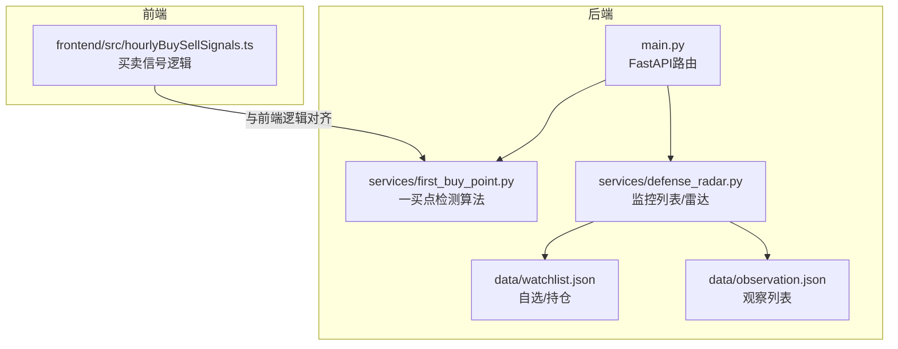
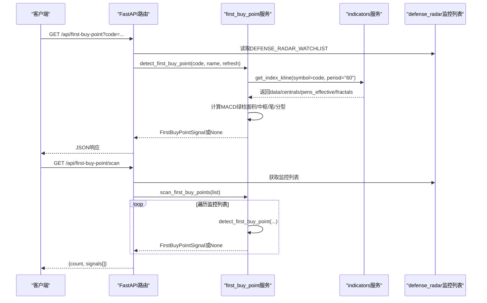
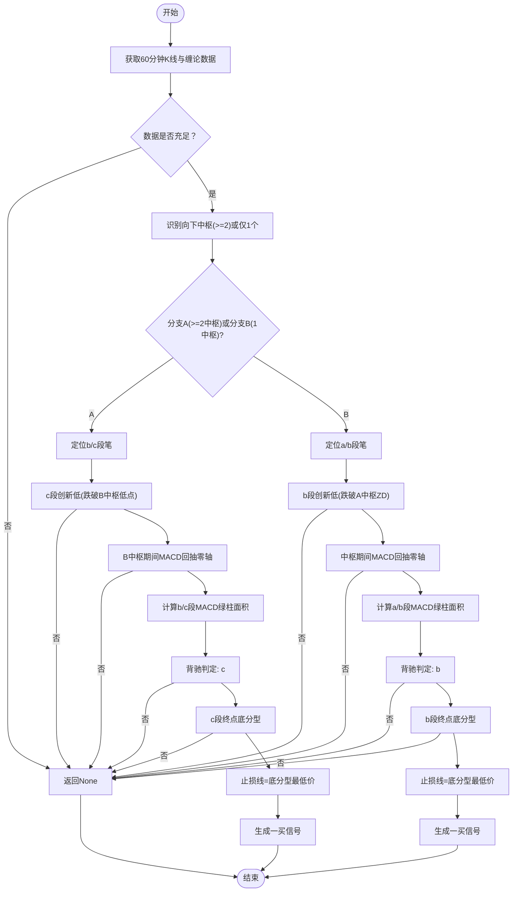
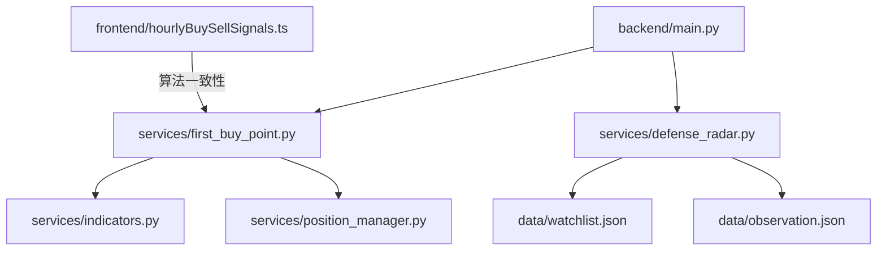

# 一买点检测接口

<cite>
**本文引用的文件**
- [backend/main.py](file://backend/main.py)
- [backend/services/first_buy_point.py](file://backend/services/first_buy_point.py)
- [backend/services/defense_radar.py](file://backend/services/defense_radar.py)
- [backend/data/watchlist.json](file://backend/data/watchlist.json)
- [backend/data/observation.json](file://backend/data/observation.json)
- [frontend/src/hourlyBuySellSignals.ts](file://frontend/src/hourlyBuySellSignals.ts)
</cite>

## 目录
1. [简介](#简介)
2. [项目结构](#项目结构)
3. [核心组件](#核心组件)
4. [架构概览](#架构概览)
5. [详细组件分析](#详细组件分析)
6. [依赖分析](#依赖分析)
7. [性能考虑](#性能考虑)
8. [故障排查指南](#故障排查指南)
9. [结论](#结论)
10. [附录](#附录)

## 简介
本文档面向一买点检测API，详细说明以下两个接口：
- GET /api/first-buy-point：检测单个股票的一买点（第一类买点）
- GET /api/first-buy-point/scan：扫描监控列表中的所有一买信号

重点涵盖：
- 业务逻辑与算法原理
- 返回数据结构及字段含义
- 适用条件与前置要求
- 与双防线雷达系统的关联关系
- 使用示例与错误处理

## 项目结构
后端采用FastAPI框架，核心路由集中在main.py中，一买点检测逻辑位于services/first_buy_point.py，监控列表来源于services/defense_radar.py中的DEFENSE_RADAR_WATCHLIST常量，以及backend/data/watchlist.json和backend/data/observation.json。

**图表来源**
- [backend/main.py:319-388](file://backend/main.py#L319-L388)
- [backend/services/first_buy_point.py:332-535](file://backend/services/first_buy_point.py#L332-L535)
- [backend/services/defense_radar.py:34-89](file://backend/services/defense_radar.py#L34-L89)
- [backend/data/watchlist.json:1-27](file://backend/data/watchlist.json#L1-L27)
- [backend/data/observation.json:1-25](file://backend/data/observation.json#L1-L25)
- [frontend/src/hourlyBuySellSignals.ts:224-423](file://frontend/src/hourlyBuySellSignals.ts#L224-L423)

**章节来源**
- [backend/main.py:319-388](file://backend/main.py#L319-L388)
- [backend/services/first_buy_point.py:1-564](file://backend/services/first_buy_point.py#L1-L564)
- [backend/services/defense_radar.py:34-89](file://backend/services/defense_radar.py#L34-L89)
- [backend/data/watchlist.json:1-27](file://backend/data/watchlist.json#L1-L27)
- [backend/data/observation.json:1-25](file://backend/data/observation.json#L1-L25)
- [frontend/src/hourlyBuySellSignals.ts:224-423](file://frontend/src/hourlyBuySellSignals.ts#L224-L423)

## 核心组件
- FastAPI路由层：提供HTTP接口，负责参数解析、异常处理与响应封装
- 一买点检测服务：实现趋势底背驰/盘整背驰的算法，返回标准化信号结构
- 监控列表管理：提供DEFENSE_RADAR_WATCHLIST常量，结合watchlist.json与observation.json
- 前端一致性：与前端hourlyBuySellSignals.ts的算法逻辑保持一致

**章节来源**
- [backend/main.py:319-388](file://backend/main.py#L319-L388)
- [backend/services/first_buy_point.py:28-564](file://backend/services/first_buy_point.py#L28-L564)
- [backend/services/defense_radar.py:34-89](file://backend/services/defense_radar.py#L34-L89)

## 架构概览
一买点检测API的调用链路如下：
- 单个检测：/api/first-buy-point -> detect_first_buy_point -> get_index_kline -> 计算MACD面积/中枢/笔/分型 -> 生成FirstBuyPointSignal
- 批量扫描：/api/first-buy-point/scan -> scan_first_buy_points -> 遍历监控列表 -> 调用单个检测

**图表来源**
- [backend/main.py:319-388](file://backend/main.py#L319-L388)
- [backend/services/first_buy_point.py:332-535](file://backend/services/first_buy_point.py#L332-L535)
- [backend/services/defense_radar.py:34-89](file://backend/services/defense_radar.py#L34-L89)

## 详细组件分析

### 接口定义与参数
- GET /api/first-buy-point
  - 查询参数：code（股票代码，必填）
  - 返回：单个一买信号详情或{code, has_signal: false}
- GET /api/first-buy-point/scan
  - 返回：{count, signals[]}，其中signals包含code、name、date、price、stop_loss、area_ratio

注意：接口未设置默认的name参数，但路由层会尝试从监控列表DEFENSE_RADAR_WATCHLIST中查找对应名称。

**章节来源**
- [backend/main.py:319-388](file://backend/main.py#L319-L388)

### 一买点检测算法原理
算法基于“趋势底背驰”和“盘整背驰”两类情形，核心步骤：
1. 识别至少2个向下中枢（A、B中枢），或仅1个向下中枢（盘整背驰）
2. c段（B中枢之后的向下笔）创新低（跌破B中枢低点）
3. B中枢构建期间MACD回抽零轴（确认动能反转）
4. 背驰判定：c段MACD绿柱面积 < b段面积（趋势背驰）或b段 < a段（盘整背驰）
5. c段终点出现底分型（基于标准化K线）

算法还包含时间邻近性检查（c段终点距当前K线不超过一定根数）与止损线确定（底分型最低价）。

**图表来源**
- [backend/services/first_buy_point.py:332-512](file://backend/services/first_buy_point.py#L332-L512)
- [frontend/src/hourlyBuySellSignals.ts:224-423](file://frontend/src/hourlyBuySellSignals.ts#L224-L423)

**章节来源**
- [backend/services/first_buy_point.py:332-512](file://backend/services/first_buy_point.py#L332-L512)
- [frontend/src/hourlyBuySellSignals.ts:224-423](file://frontend/src/hourlyBuySellSignals.ts#L224-L423)

### 返回数据结构与字段含义
- 单个检测返回（has_signal: true时）：
  - code：股票代码
  - name：股票名称
  - date：信号触发日期（底分型日期）
  - price：触发价格（c段终点价格）
  - stop_loss：止损线（底分型最低价）
  - area_ratio：背驰强度（c段面积/b段面积）
  - b_area：b段MACD绿柱面积
  - c_area：c段MACD绿柱面积
  - hub_b_low：B中枢最低点
  - current_low：当前向下笔最低点
  - has_signal：布尔值，表示是否检测到信号

- 批量扫描返回：
  - count：检测到一买信号的数量
  - signals[]：每项包含code、name、date、price、stop_loss、area_ratio

注意：当未检测到信号时，单个检测返回{code, has_signal: false}。

**章节来源**
- [backend/main.py:338-353](file://backend/main.py#L338-L353)
- [backend/main.py:370-383](file://backend/main.py#L370-L383)
- [backend/services/first_buy_point.py:28-41](file://backend/services/first_buy_point.py#L28-L41)

### 适用条件与前置要求
- 数据要求：需要60分钟K线、MACD、分型、笔、有效笔、中枢等缠论计算结果
- 时间窗口：算法默认使用较长时间的历史数据（具体起始日期在实现中固定）
- 监控列表：批量扫描使用DEFENSE_RADAR_WATCHLIST，结合watchlist.json与observation.json
- 前端一致性：算法逻辑与前端hourlyBuySellSignals.ts保持一致，确保结果可复核

**章节来源**
- [backend/services/first_buy_point.py:355-362](file://backend/services/first_buy_point.py#L355-L362)
- [backend/services/defense_radar.py:34-89](file://backend/services/defense_radar.py#L34-L89)
- [backend/data/watchlist.json:1-27](file://backend/data/watchlist.json#L1-L27)
- [backend/data/observation.json:1-25](file://backend/data/observation.json#L1-L25)
- [frontend/src/hourlyBuySellSignals.ts:224-423](file://frontend/src/hourlyBuySellSignals.ts#L224-L423)

### 与双防线雷达系统的关联关系
- 监控范围：一买点检测使用DEFENSE_RADAR_WATCHLIST作为基础监控列表，与雷达扫描范围一致
- 数据口径：雷达使用日线中枢（A-ZD/C-ZD）与60分钟现价（末根收盘）；一买点检测使用60分钟K线与缠论计算
- 输出产物：雷达生成last_summary.json供前端使用，一买点检测返回实时信号
- 关系说明：两者共享监控列表，但一买点检测更侧重短期技术形态与背驰信号，雷达侧重中长期支撑/压力与价格档位

**章节来源**
- [backend/services/defense_radar.py:34-89](file://backend/services/defense_radar.py#L34-L89)
- [backend/main.py:360-387](file://backend/main.py#L360-L387)

### 使用示例
- 检测单个股票
  - 请求：GET http://127.0.0.1:8000/api/first-buy-point?code=600000
  - 成功响应：包含code、name、date、price、stop_loss、area_ratio、b_area、c_area、hub_b_low、current_low、has_signal
  - 未检测到信号：返回{code, has_signal: false}

- 批量扫描监控列表
  - 请求：GET http://127.0.0.1:8000/api/first-buy-point/scan
  - 成功响应：包含count与signals数组，每项包含code、name、date、price、stop_loss、area_ratio

注意：若监控列表中包含名称缺失的情况，路由层会尝试从DEFENSE_RADAR_WATCHLIST查找名称，若仍找不到，将使用传入的code作为名称。

**章节来源**
- [backend/main.py:319-388](file://backend/main.py#L319-L388)

### 错误处理与异常情况
- 参数错误：当code为空或格式不正确时，FastAPI会抛出HTTP 422错误
- 业务异常：当检测过程中发生异常（如数据不足、计算失败），路由层捕获并返回HTTP 500错误，detail包含错误信息
- 未检测到信号：返回has_signal: false或count: 0
- 数据不足：当K线数据、中枢或笔数量不足时，算法返回None，路由层返回相应状态

建议客户端在调用前确保：
- 已完成定时任务预热，60分钟K线缓存存在
- 监控列表DEFENSE_RADAR_WATCHLIST与watchlist.json/observation.json一致
- 传入的code格式正确且存在于监控列表

**章节来源**
- [backend/main.py:355-357](file://backend/main.py#L355-L357)
- [backend/main.py:385-387](file://backend/main.py#L385-L387)
- [backend/services/first_buy_point.py:369-371](file://backend/services/first_buy_point.py#L369-L371)

## 依赖分析
- 路由依赖：main.py依赖services/first_buy_point.py与services/defense_radar.py
- 算法依赖：first_buy_point.py依赖services/indicators.py（get_index_kline）与position_manager.py（自动买入）
- 监控列表依赖：defense_radar.py提供DEFENSE_RADAR_WATCHLIST常量
- 前端一致性：hourlyBuySellSignals.ts提供算法逻辑参考

**图表来源**
- [backend/main.py:14-19](file://backend/main.py#L14-L19)
- [backend/services/first_buy_point.py:24-25](file://backend/services/first_buy_point.py#L24-L25)
- [backend/services/defense_radar.py:34-89](file://backend/services/defense_radar.py#L34-L89)
- [backend/data/watchlist.json:1-27](file://backend/data/watchlist.json#L1-L27)
- [backend/data/observation.json:1-25](file://backend/data/observation.json#L1-L25)
- [frontend/src/hourlyBuySellSignals.ts:224-423](file://frontend/src/hourlyBuySellSignals.ts#L224-L423)

**章节来源**
- [backend/main.py:14-19](file://backend/main.py#L14-L19)
- [backend/services/first_buy_point.py:24-25](file://backend/services/first_buy_point.py#L24-L25)
- [backend/services/defense_radar.py:34-89](file://backend/services/defense_radar.py#L34-L89)

## 性能考虑
- 数据缓存：get_index_kline具备进程内响应缓存与mtime失效机制，建议在生产环境使用默认的refresh=false以减少重复计算
- 批量扫描：scan_first_buy_points遍历监控列表逐个检测，建议控制并发或分批处理以避免瞬时压力
- 自动买入：一买检测成功后会尝试自动记录买入，注意避免重复买入同一标的

[本节为通用指导，无需特定文件来源]

## 故障排查指南
- 60分钟K线缓存不存在：检查定时任务是否已运行，或使用refresh=true预热
- 监控列表不一致：确认DEFENSE_RADAR_WATCHLIST与watchlist.json/observation.json内容一致
- 信号未出现：检查是否满足背驰条件（MACD面积比、底分型、创新低等）
- 前端显示异常：确认hourlyBuySellSignals.ts与后端算法逻辑一致

**章节来源**
- [backend/main.py:355-357](file://backend/main.py#L355-L357)
- [backend/main.py:385-387](file://backend/main.py#L385-L387)
- [backend/services/first_buy_point.py:369-371](file://backend/services/first_buy_point.py#L369-L371)

## 结论
一买点检测API基于严谨的缠论与MACD背驰逻辑，提供单个检测与批量扫描能力。其与双防线雷达系统共享监控列表，但关注点不同：雷达侧重中长期支撑/压力与价格档位，一买点检测侧重短期技术形态与动能反转信号。建议在生产环境中合理利用缓存与监控列表，确保数据一致性与稳定性。

[本节为总结性内容，无需特定文件来源]

## 附录
- 监控列表来源：DEFENSE_RADAR_WATCHLIST常量、watchlist.json、observation.json
- 前端一致性：hourlyBuySellSignals.ts提供算法逻辑参考

**章节来源**
- [backend/services/defense_radar.py:34-89](file://backend/services/defense_radar.py#L34-L89)
- [backend/data/watchlist.json:1-27](file://backend/data/watchlist.json#L1-L27)
- [backend/data/observation.json:1-25](file://backend/data/observation.json#L1-L25)
- [frontend/src/hourlyBuySellSignals.ts:224-423](file://frontend/src/hourlyBuySellSignals.ts#L224-L423)