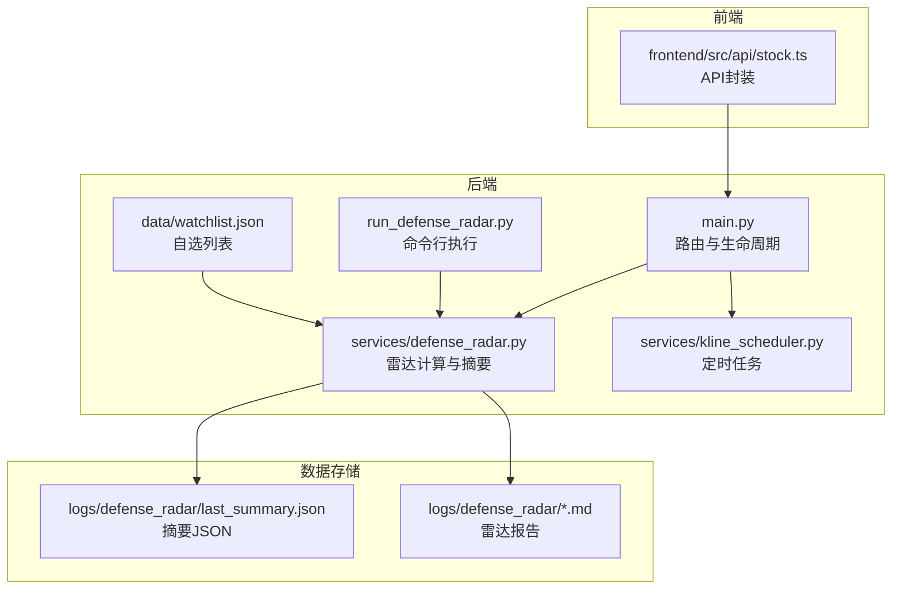
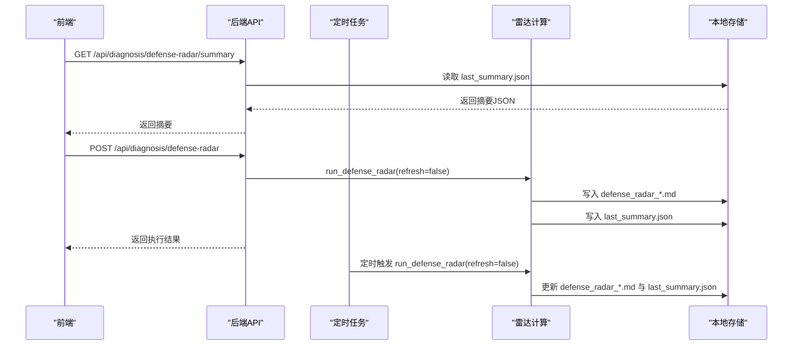
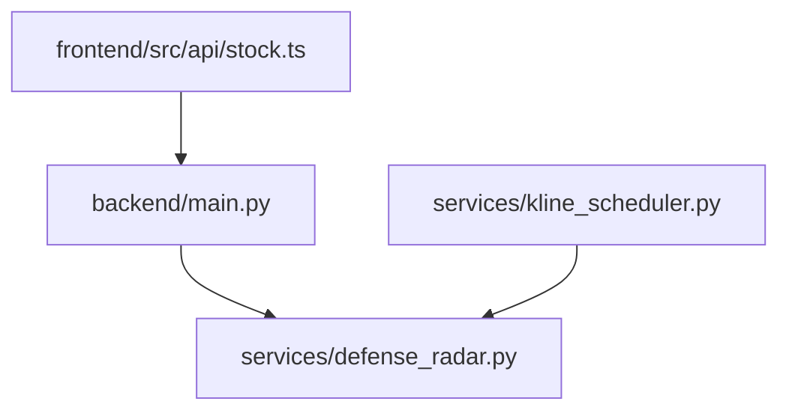

# 双防线雷达接口

<cite>
**本文引用的文件**
- [backend/main.py](file://backend/main.py)
- [backend/services/defense_radar.py](file://backend/services/defense_radar.py)
- [backend/services/kline_scheduler.py](file://backend/services/kline_scheduler.py)
- [backend/run_defense_radar.py](file://backend/run_defense_radar.py)
- [backend/data/watchlist.json](file://backend/data/watchlist.json)
- [frontend/src/api/stock.ts](file://frontend/src/api/stock.ts)
- [logs/defense_radar/last_summary.json](file://logs/defense_radar/last_summary.json)
- [logs/defense_radar/defense_radar_20260424_163228.md](file://logs/defense_radar/defense_radar_20260424_163228.md)
- [README.md](file://README.md)
</cite>

## 目录
1. [简介](#简介)
2. [项目结构](#项目结构)
3. [核心组件](#核心组件)
4. [架构概览](#架构概览)
5. [详细组件分析](#详细组件分析)
6. [依赖分析](#依赖分析)
7. [性能考虑](#性能考虑)
8. [故障排查指南](#故障排查指南)
9. [结论](#结论)
10. [附录](#附录)

## 简介
本文件为双防线雷达系统的API文档，重点覆盖以下三个核心接口：
- GET /api/diagnosis/defense-radar/summary：获取雷达摘要（symbols数组、生成时间、预警统计等）
- POST /api/diagnosis/defense-radar：手动触发雷达诊断（生成雷达报告并更新摘要）
- GET /api/sse/radar-updates：SSE实时推送接口（雷达更新与止损告警）

同时补充：
- GET /api/stock/name：股票名称查询接口
- 雷达系统整体工作流程与数据来源说明
- 实际调用示例与错误处理方案

## 项目结构
后端采用FastAPI框架，核心模块包括：
- 路由与生命周期管理：backend/main.py
- 雷达计算与摘要生成：backend/services/defense_radar.py
- 定时任务与数据同步：backend/services/kline_scheduler.py
- 命令行雷达执行：backend/run_defense_radar.py
- 用户自选列表：backend/data/watchlist.json
- 前端API封装：frontend/src/api/stock.ts
- 雷达产物与缓存：logs/defense_radar/last_summary.json、defense_radar_*.md

**图表来源**
- [backend/main.py:171-206](file://backend/main.py#L171-L206)
- [backend/services/defense_radar.py:147-165](file://backend/services/defense_radar.py#L147-L165)
- [backend/services/kline_scheduler.py:211-256](file://backend/services/kline_scheduler.py#L211-L256)
- [backend/run_defense_radar.py:22-26](file://backend/run_defense_radar.py#L22-L26)
- [frontend/src/api/stock.ts:249-303](file://frontend/src/api/stock.ts#L249-L303)

**章节来源**
- [README.md:33-64](file://README.md#L33-L64)
- [backend/main.py:171-206](file://backend/main.py#L171-L206)

## 核心组件
- 雷达摘要生成器：负责从日线中枢与60分钟K线计算并生成symbols数组，写入last_summary.json
- 定时任务调度器：按北京时间固定时间点同步K线并执行雷达
- SSE消息推送：向客户端广播雷达更新与止损告警
- 股票名称缓存：从last_summary.json与watchlist构建股票名称映射

**章节来源**
- [backend/services/defense_radar.py:147-165](file://backend/services/defense_radar.py#L147-L165)
- [backend/services/kline_scheduler.py:211-256](file://backend/services/kline_scheduler.py#L211-L256)
- [backend/main.py:28-71](file://backend/main.py#L28-L71)
- [backend/main.py:259-317](file://backend/main.py#L259-L317)

## 架构概览
双防线雷达系统遵循“定时同步 + 本地缓存 + 雷达计算”的模式：
- 定时任务在10:31/11:31/14:01/15:01进行60分钟K线全量刷新，16:01进行日线与60分钟全量刷新并执行雷达
- 雷达计算基于日线中枢与60分钟K线末根收盘价，生成摘要JSON与雷达报告
- 前端通过GET /api/diagnosis/defense-radar/summary获取摘要，通过POST /api/diagnosis/defense-radar手动触发雷达
- SSE接口实时推送雷达更新与止损告警

**图表来源**
- [backend/main.py:171-206](file://backend/main.py#L171-L206)
- [backend/services/defense_radar.py:747-800](file://backend/services/defense_radar.py#L747-L800)
- [backend/services/kline_scheduler.py:211-256](file://backend/services/kline_scheduler.py#L211-L256)

## 详细组件分析

### GET /api/diagnosis/defense-radar/summary（获取雷达摘要）
- 功能：返回双防线雷达摘要JSON，优先从本地last_summary.json读取，无缓存时再现场计算并回写
- 请求参数：
  - refresh: bool，是否强制重新计算（默认false，仅排障时使用）
- 响应结构：
  - generated_at: string，摘要生成时间（ISO格式）
  - symbols: array，每个元素包含：
    - code: string，股票代码
    - name: string，股票名称
    - alert: string，预警信息文本
    - has_alert: boolean，是否为一级/终极/红色警报
    - pen_60m: string，60分钟有效笔最后一笔方向（向上/向下）
    - radar_zone_ok: boolean，现价是否在绝对防线之上
    - pen_60m_down: boolean，60分钟有效笔是否发生向下翻转
    - macd_momentum_ok: boolean，MACD动能转强
    - blue_triangle_strict: boolean，严格底分型+K3确认
    - full_trigger: boolean，四条件扳机是否全部满足
    - in_c_central: boolean，60分钟现价是否在C中枢内
    - has_bottom_div_in_switch: boolean，底背驰点是否落在当前向上笔内
    - boll_buy: boolean，BOLL站回中轨
- 缓存策略：响应头Cache-Control: no-store，强制不缓存
- 错误处理：文件不存在或解析失败时返回空摘要

**章节来源**
- [backend/main.py:171-181](file://backend/main.py#L171-L181)
- [backend/services/defense_radar.py:147-165](file://backend/services/defense_radar.py#L147-L165)
- [logs/defense_radar/last_summary.json:1-800](file://logs/defense_radar/last_summary.json#L1-L800)

### POST /api/diagnosis/defense-radar（手动触发雷达诊断）
- 功能：手动执行雷达计算，生成雷达报告并更新摘要
- 请求参数：
  - refresh: bool，是否强制拉网（默认false，仅排障时使用）
- 响应结构：
  - ok: boolean，执行是否成功
  - path: string，生成的雷达报告路径
- 执行流程：
  - 调用run_defense_radar(refresh)，生成defense_radar_YYYYMMDD_HHMMSS.md
  - 写入last_summary.json，包含generated_at与symbols数组
  - 返回执行结果
- 错误处理：执行异常时抛出HTTP 500

**章节来源**
- [backend/main.py:189-206](file://backend/main.py#L189-L206)
- [backend/services/defense_radar.py:747-800](file://backend/services/defense_radar.py#L747-L800)
- [backend/run_defense_radar.py:22-26](file://backend/run_defense_radar.py#L22-L26)

### GET /api/sse/radar-updates（SSE实时推送）
- 功能：建立SSE连接，实时推送雷达更新与止损告警
- 连接建立：
  - 客户端发起GET /api/sse/radar-updates
  - 服务端返回initial message（connected）
  - 客户端保持连接，接收后续消息
- 消息格式：
  - radar_updated：雷达数据更新
    - type: "radar_updated"
    - timestamp: string，更新时间戳
    - include_daily: boolean，是否包含日线同步
    - message: string，推送消息
  - stop_loss_triggered：止损触发告警
    - type: "stop_loss_triggered"
    - code: string，触发止损的股票代码
    - reason: string，触发原因
    - price: float，触发价格
    - timestamp: string，告警时间
    - message: string，告警消息
  - heartbeat：心跳消息（每30秒发送一次）
    - type: "heartbeat"
- 心跳机制：客户端超时未收到消息时，服务端发送heartbeat保持连接
- 断开处理：客户端断开或异常时，清理客户端队列

**章节来源**
- [backend/main.py:213-252](file://backend/main.py#L213-L252)
- [backend/main.py:28-71](file://backend/main.py#L28-L71)
- [backend/services/kline_scheduler.py:249-255](file://backend/services/kline_scheduler.py#L249-L255)

### GET /api/stock/name（股票名称查询）
- 功能：根据股票代码获取股票名称
- 请求参数：
  - code: string，股票代码（支持6位A股、5位港股、带sh/sz前缀）
- 响应结构：
  - code: string，原始输入代码
  - name: string，股票名称
- 缓存策略：从last_summary.json与watchlist构建名称缓存，支持HK代码特殊处理
- 错误处理：未找到时返回HTTP 404

**章节来源**
- [backend/main.py:287-317](file://backend/main.py#L287-L317)
- [backend/data/watchlist.json:1-27](file://backend/data/watchlist.json#L1-L27)

### 雷达系统工作流程与数据来源
- 数据来源：
  - 日线：来自本地CSV（index_daily_*.csv/a_daily_*.csv），由定时任务在16:01刷新
  - 60分钟：来自本地CSV（kline_60_*.csv），由定时任务在10:31/11:31/14:01/15:01刷新
  - 自选列表：backend/data/watchlist.json
- 计算逻辑：
  - 从日线计算A-ZD/C-ZD，从60分钟K线取末根收盘作为现价P
  - 绝对防线逻辑：MIN(C-ZD, A-ZD)定义防线，±1%缓冲带定义伏击圈
  - 四条件扳机：伏击带+末笔向下+MACD转强+严格底分型确认
- 产物：
  - defense_radar_YYYYMMDD_HHMMSS.md：表格化雷达报告
  - last_summary.json：摘要JSON，包含generated_at与symbols数组

**章节来源**
- [README.md:33-64](file://README.md#L33-L64)
- [backend/services/defense_radar.py:122-165](file://backend/services/defense_radar.py#L122-L165)
- [backend/services/kline_scheduler.py:131-256](file://backend/services/kline_scheduler.py#L131-L256)

## 依赖分析
- 组件耦合：
  - main.py依赖defense_radar.py进行摘要与雷达执行
  - kline_scheduler.py依赖defense_radar.py执行雷达并写入产物
  - 前端通过stock.ts封装调用后端API
- 外部依赖：
  - 本地文件系统：CSV与JSON文件
  - 时间与时区：Asia/Shanghai
  - SSE客户端队列：异步消息广播

**图表来源**
- [backend/main.py:171-206](file://backend/main.py#L171-L206)
- [backend/services/defense_radar.py:747-800](file://backend/services/defense_radar.py#L747-L800)
- [backend/services/kline_scheduler.py:211-256](file://backend/services/kline_scheduler.py#L211-L256)
- [frontend/src/api/stock.ts:249-303](file://frontend/src/api/stock.ts#L249-L303)

**章节来源**
- [backend/main.py:171-206](file://backend/main.py#L171-L206)
- [backend/services/defense_radar.py:747-800](file://backend/services/defense_radar.py#L747-L800)
- [backend/services/kline_scheduler.py:211-256](file://backend/services/kline_scheduler.py#L211-L256)
- [frontend/src/api/stock.ts:249-303](file://frontend/src/api/stock.ts#L249-L303)

## 性能考虑
- 本地优先：雷达计算默认只读本地CSV，避免网络延迟
- 缓存失效：基于文件mtime与TTL的智能缓存，减少重复计算
- SSE广播：使用队列与心跳机制，降低连接维护成本
- 定时任务：固定时间点批量刷新，避免频繁网络请求

## 故障排查指南
- 摘要404：后端未重启或旧进程无新路由
- Tab不显示：摘要请求失败或last_summary.json未生成
- 60m报错：未跑过定时任务或从未对该symbol refresh=true
- 中枢长时间不变：本地CSV未更新或仅命中TTL内缓存
- SSE连接失败：检查EventSource支持与跨域配置

**章节来源**
- [README.md:255-263](file://README.md#L255-L263)

## 结论
双防线雷达系统通过定时任务与本地缓存实现了高效稳定的雷达计算与推送。API设计简洁明确，数据结构清晰，适合前端快速集成与展示。建议在生产环境中：
- 确保定时任务稳定运行
- 监控SSE连接状态
- 合理使用refresh参数进行排障
- 前端正确处理缓存与错误

## 附录

### 调用示例
- 获取雷达摘要
  - curl "http://127.0.0.1:8000/api/diagnosis/defense-radar/summary"
  - curl "http://127.0.0.1:8000/api/diagnosis/defense-radar/summary?refresh=false"
- 手动触发雷达诊断
  - curl -X POST "http://127.0.0.1:8000/api/diagnosis/defense-radar"
  - curl -X POST "http://127.0.0.1:8000/api/diagnosis/defense-radar?refresh=false"
- SSE实时推送
  - EventSource: http://127.0.0.1:8000/api/sse/radar-updates
- 股票名称查询
  - curl "http://127.0.0.1:8000/api/stock/name?code=600873"
  - curl "http://127.0.0.1:8000/api/stock/name?code=sh600873"

### 错误处理方案
- HTTP 400：参数校验失败（如股票代码为空）
- HTTP 404：未找到股票名称
- HTTP 500：服务器内部错误（雷达执行失败、文件读写异常等）
- SSE：心跳机制保持连接，异常时客户端重连

**章节来源**
- [backend/main.py:110-121](file://backend/main.py#L110-L121)
- [backend/main.py:124-137](file://backend/main.py#L124-L137)
- [backend/main.py:140-168](file://backend/main.py#L140-L168)
- [backend/main.py:189-206](file://backend/main.py#L189-L206)
- [backend/main.py:287-317](file://backend/main.py#L287-L317)