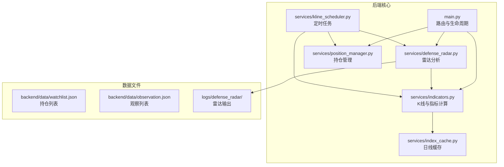
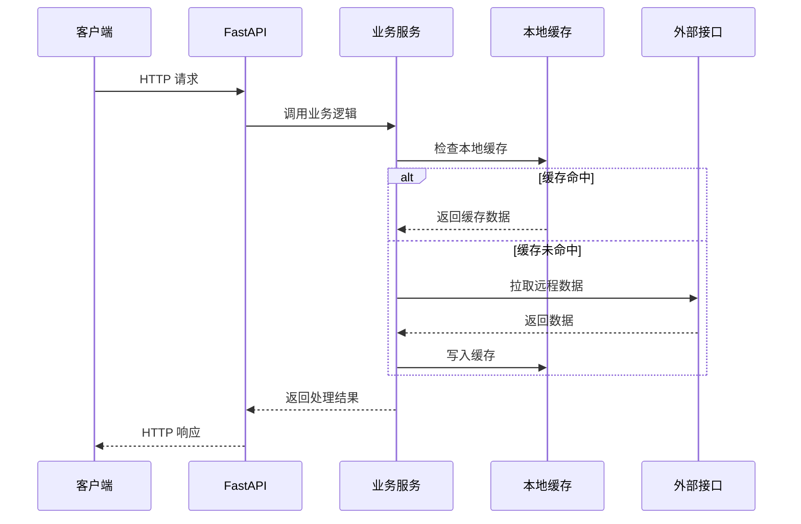
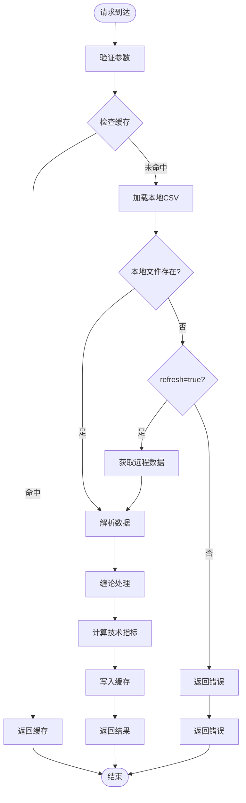
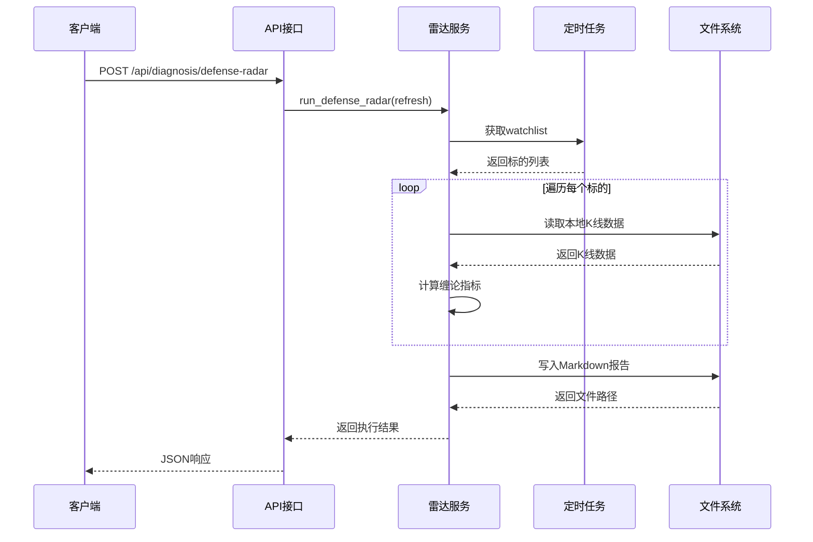
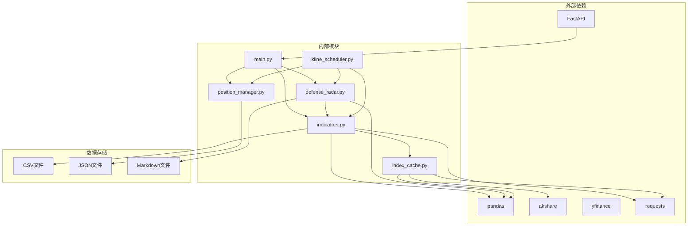

# 后端API文档

<cite>
**本文档引用的文件**
- [backend/main.py](file://backend/main.py)
- [backend/services/indicators.py](file://backend/services/indicators.py)
- [backend/services/defense_radar.py](file://backend/services/defense_radar.py)
- [backend/services/index_cache.py](file://backend/services/index_cache.py)
- [backend/services/kline_scheduler.py](file://backend/services/kline_scheduler.py)
- [backend/services/position_manager.py](file://backend/services/position_manager.py)
- [backend/data/watchlist.json](file://backend/data/watchlist.json)
- [backend/data/observation.json](file://backend/data/observation.json)
- [backend/run_defense_radar.py](file://backend/run_defense_radar.py)
- [frontend/src/api/stock.ts](file://frontend/src/api/stock.ts)
- [README.md](file://README.md)
</cite>

## 目录
1. [简介](#简介)
2. [项目结构](#项目结构)
3. [核心组件](#核心组件)
4. [架构概览](#架构概览)
5. [详细组件分析](#详细组件分析)
6. [依赖分析](#依赖分析)
7. [性能考虑](#性能考虑)
8. [故障排除指南](#故障排除指南)
9. [结论](#结论)
10. [附录](#附录)

## 简介
本项目为金融分析系统后端，基于 FastAPI 提供 RESTful API，主要功能包括：
- 股票技术指标查询
- K线数据获取与缠论分析
- 双防线雷达（防御雷达）摘要与诊断
- SSE 实时推送
- 持仓管理与止损监控

后端采用本地优先的数据策略，通过定时任务同步数据到本地缓存，减少对外部接口的依赖。

## 项目结构
后端采用模块化设计，主要文件组织如下：



**图表来源**
- [backend/main.py:1-514](file://backend/main.py#L1-L514)
- [backend/services/indicators.py:1-800](file://backend/services/indicators.py#L1-L800)
- [backend/services/defense_radar.py:1-800](file://backend/services/defense_radar.py#L1-L800)

**章节来源**
- [README.md:216-244](file://README.md#L216-L244)

## 核心组件

### API 路由与生命周期
后端使用 FastAPI 构建，主要特性：
- 使用 lifespan 管理应用生命周期
- CORS 允许任意来源（开发环境）
- SSE 实时推送支持

### 数据服务层
- **indicators.py**: K线数据获取、技术指标计算、缠论分析
- **defense_radar.py**: 双防线雷达分析与摘要生成
- **index_cache.py**: 日线数据本地缓存
- **kline_scheduler.py**: 定时任务调度
- **position_manager.py**: 持仓管理与止损监控

**章节来源**
- [backend/main.py:80-92](file://backend/main.py#L80-L92)
- [backend/services/indicators.py:1-800](file://backend/services/indicators.py#L1-L800)

## 架构概览



**图表来源**
- [backend/main.py:110-168](file://backend/main.py#L110-L168)
- [backend/services/indicators.py:149-174](file://backend/services/indicators.py#L149-L174)

## 详细组件分析

### 技术指标查询接口

#### GET /api/stock/indicators
**功能**: 获取单只股票最新技术指标

**请求参数**:
- `code` (必需): 股票代码，如 600000 或 000001

**响应格式**:
```json
{
  "code": "600000",
  "date": "2026-04-24",
  "close": 15.68,
  "volume": 12345678,
  "macd": {
    "dif": 0.123,
    "dea": 0.045,
    "macd": 0.156
  },
  "boll": {
    "upper": 16.23,
    "middle": 15.68,
    "lower": 15.13
  },
  "kdj": {
    "k": 65.4,
    "d": 58.7,
    "j": 48.9
  }
}
```

**错误处理**:
- 400: 参数验证失败
- 500: 服务器内部错误

**章节来源**
- [backend/main.py:110-121](file://backend/main.py#L110-L121)

#### GET /api/stock/history-indicators
**功能**: 获取股票历史技术指标序列

**请求参数**:
- `code` (必需): 股票代码
- `start_date` (可选): 起始日期，默认 "2026-01-01"

**响应格式**:
```json
{
  "code": "600000",
  "data": [
    {
      "date": "2026-01-01",
      "close": 15.20,
      "volume": 1000000,
      "macd": {"dif": 0.10, "dea": 0.05, "macd": 0.10},
      "boll": {"upper": 16.00, "middle": 15.20, "lower": 14.40},
      "kdj": {"k": 60.0, "d": 55.0, "j": 45.0}
    }
  ]
}
```

**错误处理**:
- 400: 参数验证失败
- 500: 服务器内部错误

**章节来源**
- [backend/main.py:124-137](file://backend/main.py#L124-L137)

### K线数据接口

#### GET /api/index/kline
**功能**: 核心接口，获取K线数据并进行缠论分析

**请求参数**:
- `symbol` (必需): K线标的，支持指数、A股/ETF、港股
  - 指数: "sh000001"
  - A股/ETF: 6位代码，如 "600000"
  - 港股: "hk01810" 或 5位代码 "01810"
- `period` (必需): K线周期，"daily" 或 "60"
- `start_date` (必需): 起始日期，格式 YYYY-MM-DD
- `end_date` (可选): 结束日期，默认今天
- `refresh` (可选): 强制刷新标志，默认 false

**响应格式**:
```json
{
  "symbol": "sh000001",
  "start_date": "2024-12-01",
  "end_date": "2026-04-24",
  "period": "daily",
  "adjust": "none",
  "data": [
    {
      "date": "2024-12-01",
      "open": 3000.00,
      "high": 3100.00,
      "low": 2950.00,
      "close": 3050.00,
      "volume": 100000000,
      "macd": {"dif": 12.34, "dea": 5.67, "macd": 14.78},
      "boll": {"upper": 3150.00, "middle": 3050.00, "lower": 2950.00}
    }
  ],
  "fractals": [
    {
      "type": "top",
      "date": "2024-12-01",
      "price": 3100.00,
      "bar_index": 5
    }
  ],
  "pens": [
    {
      "direction": "up",
      "start_date": "2024-12-01",
      "start_price": 2950.00,
      "end_date": "2024-12-15",
      "end_price": 3050.00
    }
  ],
  "centrals": [
    {
      "zd": 2980.00,
      "zg": 3060.00,
      "start_date": "2024-12-01",
      "end_date": "2024-12-15",
      "form_end_date": "2024-12-15",
      "segment_indices": [1, 2, 3],
      "extend_reason": "标准中枢",
      "potential_divergence": false
    }
  ]
}
```

**数据处理流程**:



**图表来源**
- [backend/services/indicators.py:149-174](file://backend/services/indicators.py#L149-L174)
- [backend/services/indicators.py:294-314](file://backend/services/indicators.py#L294-L314)

**错误处理**:
- 400: 参数验证失败
- 500: 服务器内部错误

**章节来源**
- [backend/main.py:140-168](file://backend/main.py#L140-L168)
- [backend/services/indicators.py:1-800](file://backend/services/indicators.py#L1-L800)

### 雷达分析接口

#### GET /api/diagnosis/defense-radar/summary
**功能**: 获取双防线雷达摘要，优先读取本地缓存

**请求参数**:
- `refresh` (可选): 刷新标志，默认 false

**响应格式**:
```json
{
  "generated_at": "2026-04-24T17:48:22",
  "symbols": [
    {
      "code": "510300",
      "name": "沪深300ETF",
      "alert": "【日线】未跌破绝对防线 MIN(C-ZD, A-ZD)，等待更优入场点",
      "has_alert": false,
      "pen_60m": "向下",
      "radar_zone_ok": true,
      "pen_60m_down": false,
      "macd_momentum_ok": true,
      "blue_triangle_strict": false,
      "full_trigger": false,
      "in_c_central": false,
      "has_bottom_div_in_switch": false,
      "boll_buy": true
    }
  ]
}
```

**响应头**: `Cache-Control: no-store`

**错误处理**:
- 500: 服务器内部错误

**章节来源**
- [backend/main.py:171-180](file://backend/main.py#L171-L180)
- [backend/services/defense_radar.py:147-165](file://backend/services/defense_radar.py#L147-L165)

#### POST /api/diagnosis/defense-radar
**功能**: 手动执行雷达分析，生成诊断报告

**请求参数**:
- `refresh` (可选): 刷新标志，默认 false

**响应格式**:
```json
{
  "ok": true,
  "path": "logs/defense_radar/defense_radar_20260424_174822.md"
}
```

**执行流程**:



**图表来源**
- [backend/services/defense_radar.py:747-800](file://backend/services/defense_radar.py#L747-L800)
- [backend/run_defense_radar.py:22-26](file://backend/run_defense_radar.py#L22-L26)

**错误处理**:
- 500: 服务器内部错误

**章节来源**
- [backend/main.py:189-205](file://backend/main.py#L189-L205)
- [backend/services/defense_radar.py:747-800](file://backend/services/defense_radar.py#L747-L800)

### SSE 实时推送接口

#### GET /api/sse/radar-updates
**功能**: SSE实时推送雷达更新和止损告警

**响应格式**:
```json
data: {"type":"connected","message":"SSE连接已建立"}

data: {"type":"radar_updated","timestamp":"2026-04-24 17:48:22","include_daily":true,"message":"双防线雷达数据已更新"}

data: {"type":"stop_loss_triggered","code":"600000","reason":"跌破战术止损线(15.00)","price":14.50,"timestamp":"2026-04-24 17:48:23","message":"【止损告警】600000 触发跌破战术止损线(15.00)，现价 14.50，已自动清仓！"}
```

**错误处理**:
- 客户端断开连接时正常关闭

**章节来源**
- [backend/main.py:213-252](file://backend/main.py#L213-L252)
- [backend/services/position_manager.py:22-29](file://backend/services/position_manager.py#L22-L29)

### 持仓管理接口

#### GET /api/positions
**功能**: 获取当前所有持仓

**响应格式**:
```json
{
  "count": 2,
  "positions": [
    {
      "code": "600000",
      "name": "浦发银行",
      "signal_type": "first_buy",
      "buy_date": "2026-04-20 10:30",
      "buy_price": 15.68,
      "amount": 100000.00,
      "tactical_stop": 14.50,
      "strategic_stop": 13.00
    }
  ]
}
```

**章节来源**
- [backend/main.py:390-409](file://backend/main.py#L390-L409)

#### POST /api/positions/buy
**功能**: 手动记录买入持仓

**请求参数**:
- `code`: 股票代码
- `name`: 股票名称
- `signal_type`: 信号类型："first_buy" 或 "second_buy"
- `price`: 买入价格
- `amount`: 买入金额（元）
- `tactical_stop`: 战术止损线
- `strategic_stop`: 战略止损线

**响应格式**:
```json
{
  "ok": true,
  "position": {
    "code": "600000",
    "name": "浦发银行",
    "signal_type": "first_buy",
    "buy_date": "2026-04-24 17:48:22",
    "buy_price": 15.68,
    "amount": 100000.00,
    "tactical_stop": 14.50,
    "strategic_stop": 13.00,
    "status": "holding"
  }
}
```

**章节来源**
- [backend/main.py:412-424](file://backend/main.py#L412-L424)

#### POST /api/positions/sell
**功能**: 手动清仓

**请求参数**:
- `code`: 股票代码
- `price`: 卖出价格
- `reason`: 清仓原因

**响应格式**:
```json
{
  "ok": true,
  "position": {
    "code": "600000",
    "name": "浦发银行",
    "signal_type": "first_buy",
    "buy_date": "2026-04-20 10:30",
    "buy_price": 15.68,
    "amount": 100000.00,
    "tactical_stop": 14.50,
    "strategic_stop": 13.00,
    "status": "sold",
    "sell_date": "2026-04-24 17:48:22",
    "sell_price": 14.50,
    "sell_reason": "跌破战术止损线"
  }
}
```

**章节来源**
- [backend/main.py:427-437](file://backend/main.py#L427-L437)

### 数据列表接口

#### GET /api/watchlist
**功能**: 读取用户持仓/自选列表

**响应格式**:
```json
{
  "holdings": [
    {
      "code": "600000",
      "name": "浦发银行",
      "cost": 15.68,
      "shares": 10000,
      "note": "测试标的"
    }
  ]
}
```

**章节来源**
- [backend/main.py:450-463](file://backend/main.py#L450-L463)

#### GET /api/observation
**功能**: 读取用户观察/自选列表

**响应格式**:
```json
{
  "observations": [
    {
      "code": "510300",
      "name": "沪深300ETF"
    }
  ]
}
```

**章节来源**
- [backend/main.py:466-478](file://backend/main.py#L466-L478)

## 依赖分析



**图表来源**
- [backend/main.py:10-19](file://backend/main.py#L10-L19)
- [backend/requirements.txt:1-5](file://backend/requirements.txt#L1-L5)

**章节来源**
- [backend/requirements.txt:1-5](file://backend/requirements.txt#L1-L5)

## 性能考虑

### 缓存策略
1. **进程内响应缓存**: 基于 `(symbol, period, start_date, end_date)` 的键值缓存
2. **本地文件缓存**: CSV文件作为持久化缓存
3. **mtime失效机制**: 本地文件更新时自动失效相关缓存
4. **TTL控制**: 缓存默认300秒有效期

### 优化建议
1. **合理使用refresh参数**: 生产环境默认使用本地缓存，仅在排障时使用refresh
2. **批量请求**: 前端应合并多次请求，减少API调用次数
3. **SSE连接复用**: 客户端应复用SSE连接，避免频繁重建
4. **数据预加载**: 定时任务提前加载关键数据，提高响应速度

### 监控指标
- 缓存命中率
- 请求响应时间
- 内存使用情况
- 磁盘I/O性能

## 故障排除指南

### 常见问题及解决方案

**问题1: 摘要404**
- 可能原因: 后端未重启或旧进程无新路由
- 解决方案: 重启后端服务

**问题2: 有警报的Tab不显示**
- 可能原因: 摘要请求失败或未写入last_summary.json
- 解决方案: 检查雷达任务执行状态

**问题3: 60m报错"本地缓存不存在"**
- 可能原因: 未跑过定时任务或从未对该symbol refresh=true
- 解决方案: 先执行定时任务或使用refresh=true预热

**问题4: 中枢长时间不变**
- 可能原因: 本地CSV未更新或仅命中TTL内缓存
- 解决方案: 等待定时任务更新或手动触发刷新

**章节来源**
- [README.md:255-263](file://README.md#L255-L263)

### 错误码说明
- 200: 请求成功
- 400: 参数验证失败
- 500: 服务器内部错误

### 调试工具
1. **API文档**: 访问 `http://localhost:8000/docs`
2. **健康检查**: GET `/`
3. **调度状态**: GET `/api/scheduler/status`
4. **日志查看**: 检查 `logs/backend_*.log`

## 结论
本后端API系统采用本地优先的设计理念，通过智能缓存和定时任务实现了高效的数据服务。核心优势包括：

1. **高性能**: 本地缓存和进程内响应缓存显著提升响应速度
2. **可靠性**: 多层缓存机制和错误处理保障系统稳定性
3. **可扩展性**: 模块化设计便于功能扩展和维护
4. **易用性**: 清晰的API设计和完善的错误处理

建议在生产环境中：
- 合理配置缓存策略
- 监控系统性能指标
- 建立完善的日志体系
- 定期维护和优化数据管道

## 附录

### API使用示例

**获取K线数据**:
```javascript
// TypeScript示例
const response = await fetch('http://localhost:8000/api/index/kline?symbol=sh000001&period=daily&start_date=2024-12-01');
const data = await response.json();
console.log(data);
```

**获取雷达摘要**:
```javascript
// 前端调用
const summary = await fetch('/api/diagnosis/defense-radar/summary');
const result = await summary.json();
console.log(result);
```

**SSE实时推送**:
```javascript
// 建立SSE连接
const eventSource = new EventSource('http://localhost:8000/api/sse/radar-updates');
eventSource.onmessage = (event) => {
  const data = JSON.parse(event.data);
  console.log('收到推送:', data);
};
```

**章节来源**
- [frontend/src/api/stock.ts:185-215](file://frontend/src/api/stock.ts#L185-L215)
- [frontend/src/api/stock.ts:250-276](file://frontend/src/api/stock.ts#L250-L276)
- [frontend/src/api/stock.ts:449-466](file://frontend/src/api/stock.ts#L449-L466)