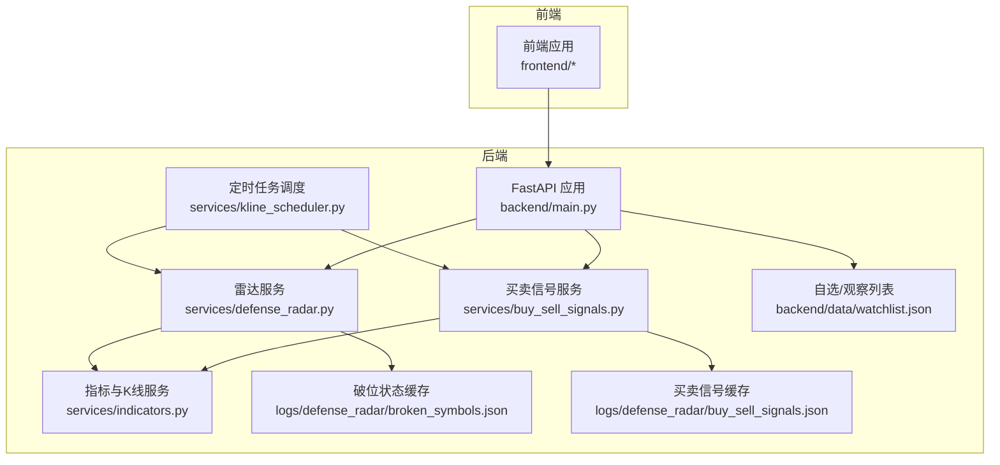
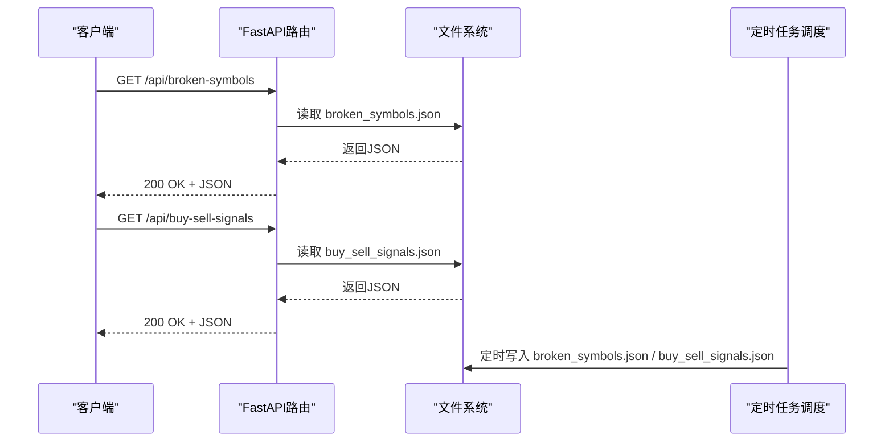
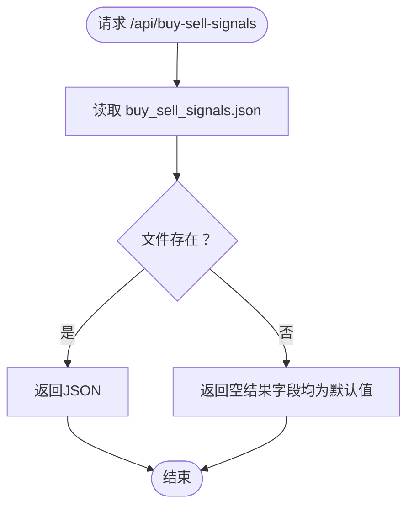
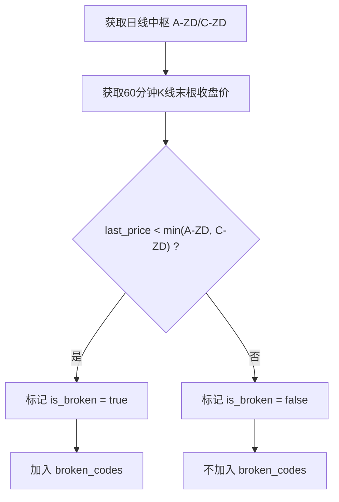
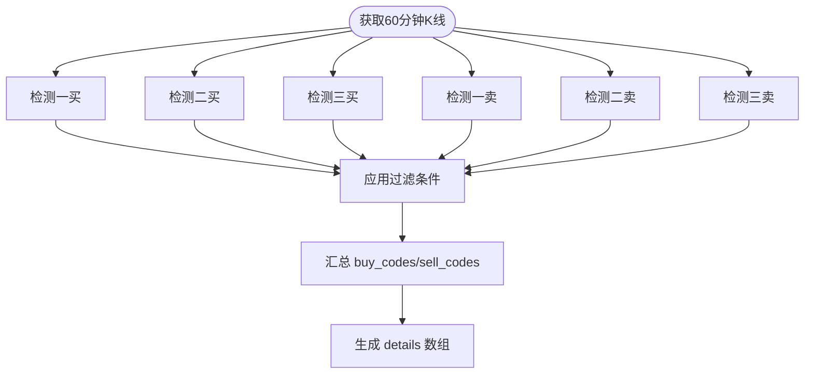
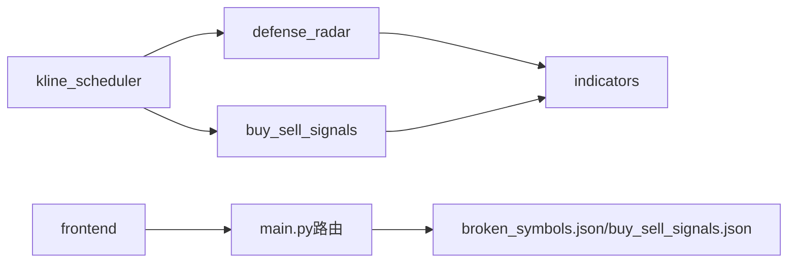

# 市场数据接口

<cite>
**本文档引用的文件**
- [backend/main.py](file://backend/main.py)
- [backend/services/buy_sell_signals.py](file://backend/services/buy_sell_signals.py)
- [backend/services/defense_radar.py](file://backend/services/defense_radar.py)
- [backend/services/kline_scheduler.py](file://backend/services/kline_scheduler.py)
- [backend/services/indicators.py](file://backend/services/indicators.py)
- [backend/data/watchlist.json](file://backend/data/watchlist.json)
- [logs/defense_radar/broken_symbols.json](file://logs/defense_radar/broken_symbols.json)
- [logs/defense_radar/buy_sell_signals.json](file://logs/defense_radar/buy_sell_signals.json)
- [frontend/src/hourlyBuySellSignals.ts](file://frontend/src/hourlyBuySellSignals.ts)
</cite>

## 目录
1. [简介](#简介)
2. [项目结构](#项目结构)
3. [核心组件](#核心组件)
4. [架构总览](#架构总览)
5. [详细组件分析](#详细组件分析)
6. [依赖关系分析](#依赖关系分析)
7. [性能考量](#性能考量)
8. [故障排查指南](#故障排查指南)
9. [结论](#结论)
10. [附录](#附录)

## 简介
本文件为市场数据查询API的完整文档，重点覆盖以下两个接口：
- GET /api/broken-symbols：获取破位状态
- GET /api/buy-sell-signals：获取买卖信号状态

文档内容涵盖：
- 破位检测逻辑与返回数据结构（generated_at、broken_codes、details等字段）
- 买卖信号的计算方法与返回格式（buy_codes、sell_codes、details等）
- 数据更新频率与缓存机制
- 与K线数据和雷达系统的关联关系
- 数据解读指南与使用建议
- 具体调用示例与应用场景

## 项目结构
后端采用FastAPI提供REST API，核心逻辑集中在services目录，定时任务通过kline_scheduler驱动数据更新，前端通过fetch调用后端接口。

**图表来源**
- [backend/main.py:499-531](file://backend/main.py#L499-L531)
- [backend/services/buy_sell_signals.py:34-62](file://backend/services/buy_sell_signals.py#L34-L62)
- [backend/services/defense_radar.py:410-428](file://backend/services/defense_radar.py#L410-L428)
- [backend/services/kline_scheduler.py:211-256](file://backend/services/kline_scheduler.py#L211-L256)

**章节来源**
- [backend/main.py:499-531](file://backend/main.py#L499-L531)
- [backend/services/kline_scheduler.py:448-492](file://backend/services/kline_scheduler.py#L448-L492)

## 核心组件
- FastAPI路由层：提供HTTP接口，负责参数校验与错误处理
- 买卖信号服务：基于60分钟K线与缠论技术指标，批量计算一买/二买/三买与一卖/二卖/三卖信号
- 雷达服务：基于日线与60分钟K线，计算破位状态与买入条件
- 指标与K线服务：提供K线数据获取、缓存与技术指标计算
- 定时任务调度：按固定时间槽位同步K线、计算雷达与买卖信号，并写入本地JSON缓存

**章节来源**
- [backend/services/buy_sell_signals.py:581-800](file://backend/services/buy_sell_signals.py#L581-L800)
- [backend/services/defense_radar.py:600-744](file://backend/services/defense_radar.py#L600-L744)
- [backend/services/indicators.py:149-174](file://backend/services/indicators.py#L149-L174)

## 架构总览
后端通过定时任务在固定时间点拉取/更新K线数据，计算破位状态与买卖信号，并将结果写入本地JSON文件。前端通过GET接口直接读取这些JSON文件，实现“秒级”响应。

**图表来源**
- [backend/main.py:499-531](file://backend/main.py#L499-L531)
- [backend/services/kline_scheduler.py:227-239](file://backend/services/kline_scheduler.py#L227-L239)

## 详细组件分析

### 接口：GET /api/broken-symbols（获取破位状态）
- 功能：返回watchlist与observation中标的的破位状态
- 数据来源：定时任务计算并写入logs/defense_radar/broken_symbols.json
- 返回结构：
  - generated_at：生成时间（ISO 8601）
  - broken_codes：发生破位的代码数组
  - details：每个标的的详细信息数组，包含code、name、is_broken、a_zd、c_zd、last_price等字段

**图表来源**
- [backend/main.py:499-514](file://backend/main.py#L499-L514)
- [logs/defense_radar/broken_symbols.json:1-321](file://logs/defense_radar/broken_symbols.json#L1-L321)

**章节来源**
- [backend/main.py:499-514](file://backend/main.py#L499-L514)
- [logs/defense_radar/broken_symbols.json:1-321](file://logs/defense_radar/broken_symbols.json#L1-L321)

### 接口：GET /api/buy-sell-signals（获取买卖信号状态）
- 功能：返回watchlist与observation中标的的买卖信号状态
- 数据来源：定时任务计算并写入logs/defense_radar/buy_sell_signals.json
- 返回结构：
  - generated_at：生成时间（ISO 8601）
  - buy_codes：发生买点的代码数组
  - sell_codes：发生卖点的代码数组
  - details：每个标的的详细信息数组，包含first_buy、second_buy、third_buy、first_sell、second_sell、third_sell等布尔字段

**图表来源**
- [backend/main.py:516-530](file://backend/main.py#L516-L530)
- [logs/defense_radar/buy_sell_signals.json:1-401](file://logs/defense_radar/buy_sell_signals.json#L1-L401)

**章节来源**
- [backend/main.py:516-530](file://backend/main.py#L516-L530)
- [logs/defense_radar/buy_sell_signals.json:1-401](file://logs/defense_radar/buy_sell_signals.json#L1-L401)

### 破位检测逻辑（雷达系统）
- 输入：日线中枢（A-ZD、C-ZD）与60分钟K线末根收盘价
- 判定：当last_price < min(A-ZD, C-ZD)时，视为破位
- 输出：broken_codes与details数组，包含is_broken标志

**图表来源**
- [backend/services/defense_radar.py:196-226](file://backend/services/defense_radar.py#L196-L226)
- [logs/defense_radar/broken_symbols.json:6-166](file://logs/defense_radar/broken_symbols.json#L6-L166)

**章节来源**
- [backend/services/defense_radar.py:196-226](file://backend/services/defense_radar.py#L196-L226)
- [logs/defense_radar/broken_symbols.json:6-166](file://logs/defense_radar/broken_symbols.json#L6-L166)

### 买卖信号计算方法
- 输入：60分钟K线数据（包含pens、fractals、centrals等）
- 信号类别：
  - 买点：一买（趋势/盘整底背驰）、二买（回踩不创新低、MACD衰减或水上）、三买（突破中枢上沿后回踩不破中枢）
  - 卖点：一卖（趋势顶背驰）、二卖（反弹后回踩不创新高、MACD衰减或水下）、三卖（跌破中枢下沿后反弹）
- 过滤条件：与前端hourlyBuySellSignals.ts保持一致，包含keepDailySupport、inCcentral、switchedDownToUp、hasBottomFractalInSwitch、hasBottomDivInSwitch、macdBuy、bollBuy等

**图表来源**
- [backend/services/buy_sell_signals.py:581-800](file://backend/services/buy_sell_signals.py#L581-L800)
- [frontend/src/hourlyBuySellSignals.ts:122-148](file://frontend/src/hourlyBuySellSignals.ts#L122-L148)

**章节来源**
- [backend/services/buy_sell_signals.py:581-800](file://backend/services/buy_sell_signals.py#L581-L800)
- [frontend/src/hourlyBuySellSignals.ts:122-148](file://frontend/src/hourlyBuySellSignals.ts#L122-L148)

## 依赖关系分析
- 定时任务调度依赖指标与K线服务获取数据，依赖雷达与买卖信号服务进行计算，最终写入本地JSON缓存
- API层直接读取缓存文件，避免重复计算
- 前端通过fetch调用后端接口，实现数据展示

**图表来源**
- [backend/services/kline_scheduler.py:211-256](file://backend/services/kline_scheduler.py#L211-L256)
- [backend/main.py:499-531](file://backend/main.py#L499-L531)

**章节来源**
- [backend/services/kline_scheduler.py:211-256](file://backend/services/kline_scheduler.py#L211-L256)
- [backend/main.py:499-531](file://backend/main.py#L499-L531)

## 性能考量
- 缓存策略：后端通过本地JSON文件缓存计算结果，前端直接读取，避免重复计算
- 响应时间：由于直接读取本地文件，响应时间极短
- 数据新鲜度：由定时任务保障，确保数据在固定时间点更新

[本节为通用指导，无需具体文件分析]

## 故障排查指南
- 检查定时任务是否正常运行：通过/scheduler/status查看调度器健康状态
- 检查缓存文件是否存在：确认logs/defense_radar目录下broken_symbols.json与buy_sell_signals.json是否生成
- 检查K线缓存：确认data/目录下的kline_60_*.csv与index_daily_*.csv是否存在且更新
- 排障模式：可通过POST /api/diagnosis/defense-radar强制刷新并重新计算

**章节来源**
- [backend/services/kline_scheduler.py:410-445](file://backend/services/kline_scheduler.py#L410-L445)
- [backend/main.py:205-222](file://backend/main.py#L205-L222)

## 结论
本API通过定时任务与本地缓存机制，实现了对破位状态与买卖信号的高效查询。前端可直接读取缓存文件，获得秒级响应。建议在前端实现轮询或SSE订阅以获取实时更新。

[本节为总结性内容，无需具体文件分析]

## 附录

### 数据更新频率与缓存机制
- 更新频率：定时任务在每日10:31、11:31、14:01、15:01与16:01执行
- 缓存位置：logs/defense_radar/*.json
- 缓存内容：broken_symbols.json与buy_sell_signals.json
- 前端读取：GET /api/broken-symbols与GET /api/buy-sell-signals直接读取缓存

**章节来源**
- [backend/services/kline_scheduler.py:39-46](file://backend/services/kline_scheduler.py#L39-L46)
- [backend/main.py:499-531](file://backend/main.py#L499-L531)

### 与K线数据和雷达系统的关联
- K线数据：来自services/indicators.py提供的get_index_kline，支持日线、60分钟、15分钟
- 雷达系统：基于日线中枢与60分钟K线现价，计算破位状态
- 买卖信号：基于60分钟K线的缠论技术指标与过滤条件

**章节来源**
- [backend/services/indicators.py:149-174](file://backend/services/indicators.py#L149-L174)
- [backend/services/defense_radar.py:600-744](file://backend/services/defense_radar.py#L600-L744)
- [backend/services/buy_sell_signals.py:581-800](file://backend/services/buy_sell_signals.py#L581-L800)

### 数据解读指南与使用建议
- 破位状态解读：is_broken为true表示价格跌破日线中枢下沿，建议谨慎入场
- 买卖信号解读：buy_codes/sell_codes为当前满足条件的标的集合；details中的布尔字段用于进一步筛选
- 使用建议：结合自选列表（backend/data/watchlist.json）与观察列表，进行个性化筛选与组合

**章节来源**
- [backend/data/watchlist.json:1-27](file://backend/data/watchlist.json#L1-L27)
- [logs/defense_radar/broken_symbols.json:6-166](file://logs/defense_radar/broken_symbols.json#L6-L166)
- [logs/defense_radar/buy_sell_signals.json:8-388](file://logs/defense_radar/buy_sell_signals.json#L8-L388)

### 调用示例与应用场景
- 示例1：查询破位状态
  - curl http://127.0.0.1:8000/api/broken-symbols
- 示例2：查询买卖信号
  - curl http://127.0.0.1:8000/api/buy-sell-signals
- 应用场景：
  - 自动化交易：监听买卖信号，触发下单
  - 监控面板：展示破位与信号状态，辅助决策
  - 数据分析：结合历史数据进行回测与策略优化

**章节来源**
- [backend/main.py:499-531](file://backend/main.py#L499-L531)