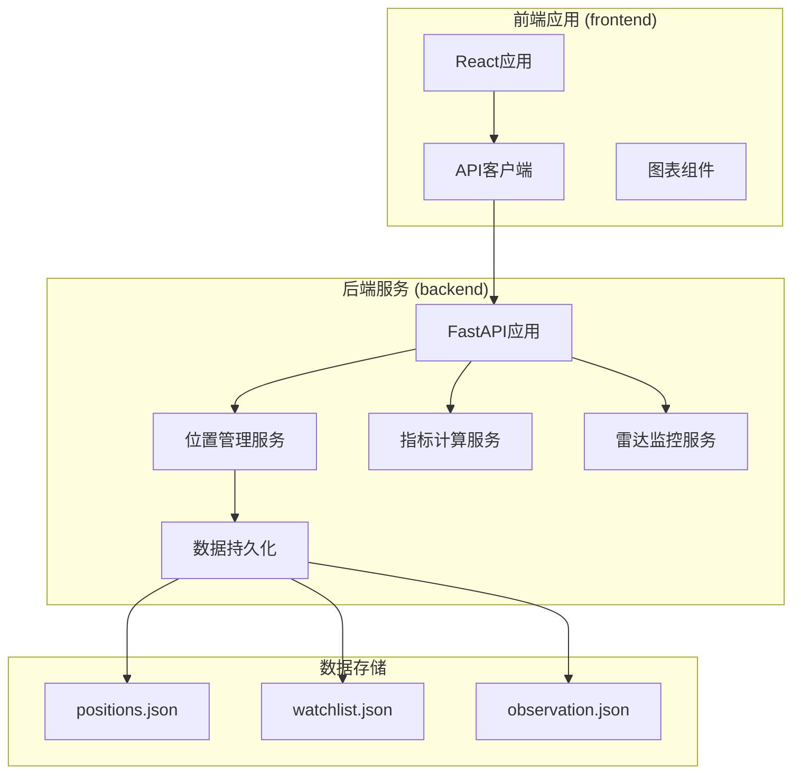
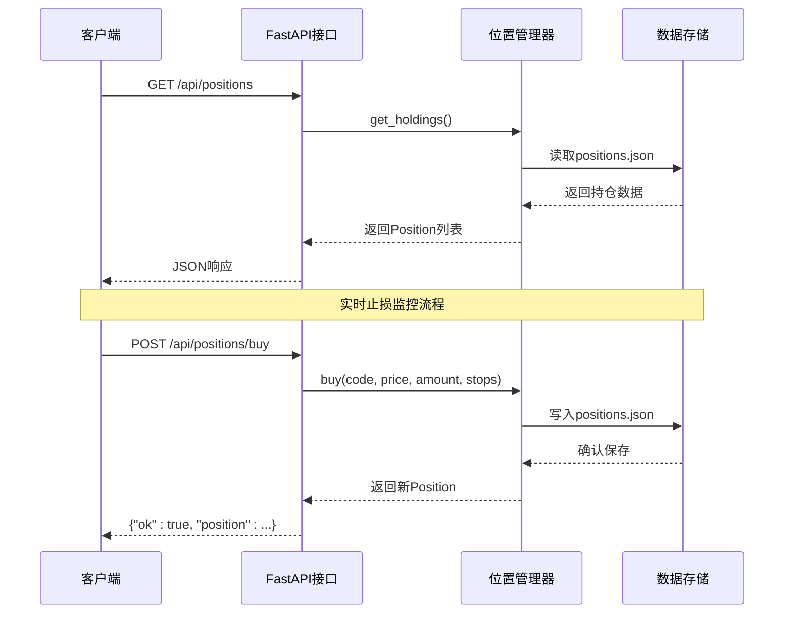
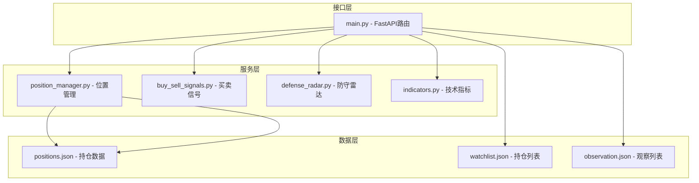

# 持仓管理接口

<cite>
**本文档引用的文件**
- [backend/main.py](file://backend/main.py)
- [backend/services/position_manager.py](file://backend/services/position_manager.py)
- [data/positions.json](file://data/positions.json)
- [frontend/src/api/stock.ts](file://frontend/src/api/stock.ts)
- [backend/data/watchlist.json](file://backend/data/watchlist.json)
- [backend/data/observation.json](file://backend/data/observation.json)
- [backend/services/trade_command_engine.py](file://backend/services/trade_command_engine.py)
</cite>

## 目录
1. [简介](#简介)
2. [项目结构](#项目结构)
3. [核心组件](#核心组件)
4. [架构概览](#架构概览)
5. [详细组件分析](#详细组件分析)
6. [依赖关系分析](#依赖关系分析)
7. [性能考虑](#性能考虑)
8. [故障排除指南](#故障排除指南)
9. [结论](#结论)

## 简介

本文档详细说明了持仓管理API的完整接口规范，包括获取当前持仓、手动买入、手动卖出和获取历史持仓等核心功能。该系统采用FastAPI框架构建，提供RESTful API接口，支持JSON数据格式，并集成了实时止损监控和SSE推送功能。

系统的核心数据结构为Position对象，包含股票代码、名称、信号类型、买入日期和价格、持仓金额以及风控止损线等关键字段。所有持仓数据持久化存储在JSON文件中，便于数据备份和恢复。

## 项目结构

该项目采用前后端分离的架构设计，主要包含以下核心模块：



**图表来源**
- [backend/main.py:1-514](file://backend/main.py#L1-L514)
- [backend/services/position_manager.py:1-210](file://backend/services/position_manager.py#L1-L210)

**章节来源**
- [backend/main.py:94-514](file://backend/main.py#L94-L514)
- [backend/services/position_manager.py:1-210](file://backend/services/position_manager.py#L1-L210)

## 核心组件

### 持仓管理服务

持仓管理服务是整个系统的核心组件，负责管理用户的股票持仓、执行止损检查和处理手动交易指令。

#### 数据模型

Position数据类定义了持仓的核心属性：

| 字段名 | 类型 | 描述 | 必填 |
|--------|------|------|------|
| code | string | 股票代码 | 是 |
| name | string | 股票名称 | 是 |
| signal_type | string | 信号类型：first_buy或second_buy | 是 |
| buy_date | string | 买入日期时间 | 是 |
| buy_price | float | 买入价格 | 是 |
| amount | float | 买入金额（元） | 是 |
| tactical_stop | float | 战术止损线 | 是 |
| strategic_stop | float | 战略止损线 | 是 |
| status | string | 持仓状态：holding或sold | 是 |
| sell_date | string | 卖出日期时间 | 否 |
| sell_price | float | 卖出价格 | 否 |
| sell_reason | string | 卖出原因 | 否 |

#### 关键方法

1. **buy()** - 创建新的买入持仓
2. **sell_all()** - 清仓指定代码的持仓
3. **get_holdings()** - 获取当前所有持仓
4. **get_all_positions()** - 获取所有历史持仓
5. **check_stop_loss()** - 检查单个标的止损
6. **check_all_stop_loss()** - 批量检查所有持仓止损

**章节来源**
- [backend/services/position_manager.py:32-46](file://backend/services/position_manager.py#L32-L46)
- [backend/services/position_manager.py:77-146](file://backend/services/position_manager.py#L77-L146)

## 架构概览

系统采用分层架构设计，各组件职责明确，耦合度低，便于维护和扩展。



**图表来源**
- [backend/main.py:390-447](file://backend/main.py#L390-L447)
- [backend/services/position_manager.py:77-116](file://backend/services/position_manager.py#L77-L116)

## 详细组件分析

### GET /api/positions - 获取当前持仓

#### 功能描述
获取用户当前持有的所有股票持仓信息，返回状态为"holding"的持仓记录。

#### 请求参数
- 无查询参数

#### 响应格式
```json
{
  "count": 2,
  "positions": [
    {
      "code": "hk06862",
      "name": "海底捞",
      "signal_type": "first_buy",
      "buy_date": "2026-04-23 22:10",
      "buy_price": 14.35,
      "amount": 10000.0,
      "tactical_stop": 14.35,
      "strategic_stop": 14.35
    }
  ]
}
```

#### 业务逻辑
1. 调用position_manager.get_holdings()获取所有持仓
2. 过滤状态为"holding"的持仓记录
3. 返回包含计数和位置数组的JSON对象

**章节来源**
- [backend/main.py:390-409](file://backend/main.py#L390-L409)
- [backend/services/position_manager.py:149-152](file://backend/services/position_manager.py#L149-L152)

### POST /api/positions/buy - 手动买入

#### 功能描述
手动记录一次买入交易，创建新的持仓记录。

#### 请求参数

| 参数名 | 类型 | 必填 | 描述 | 示例值 |
|--------|------|------|------|--------|
| code | string | 是 | 股票代码 | "600000" |
| name | string | 否 | 股票名称 | "浦发银行" |
| signal_type | string | 是 | 信号类型 | "first_buy" |
| price | float | 是 | 买入价格 | 12.50 |
| amount | float | 是 | 买入金额（元） | 10000.0 |
| tactical_stop | float | 是 | 战术止损线 | 12.00 |
| strategic_stop | float | 是 | 战略止损线 | 11.50 |

#### 响应格式
```json
{
  "ok": true,
  "position": {
    "code": "600000",
    "name": "浦发银行",
    "signal_type": "first_buy",
    "buy_date": "2026-04-24 15:30",
    "buy_price": 12.50,
    "amount": 10000.0,
    "tactical_stop": 12.00,
    "strategic_stop": 11.50,
    "status": "holding"
  }
}
```

#### 参数验证规则

1. **信号类型验证**
   - 必须为"first_buy"或"second_buy"
   - 不区分大小写，自动转换为小写

2. **价格验证**
   - 必须为正数
   - 不能为负数或零

3. **金额验证**
   - 必须为正数
   - 不能超过系统设定的最大金额限制

4. **止损线验证**
   - 战术止损线必须小于等于买入价格
   - 战略止损线必须小于等于买入价格
   - 战术止损线必须小于等于战略止损线

#### 业务逻辑
1. 验证所有输入参数的有效性
2. 创建Position对象实例
3. 将新持仓添加到内存列表
4. 保存到positions.json文件
5. 记录操作日志
6. 返回成功响应

**章节来源**
- [backend/main.py:412-424](file://backend/main.py#L412-L424)
- [backend/services/position_manager.py:77-116](file://backend/services/position_manager.py#L77-L116)

### POST /api/positions/sell - 手动卖出

#### 功能描述
手动清仓指定股票代码的所有持仓。

#### 请求参数

| 参数名 | 类型 | 必填 | 描述 | 示例值 |
|--------|------|------|------|--------|
| code | string | 是 | 股票代码 | "600000" |
| price | float | 是 | 卖出价格 | 13.20 |
| reason | string | 是 | 清仓原因 | "达到目标价位" |

#### 响应格式
```json
{
  "ok": true,
  "position": {
    "code": "600000",
    "name": "浦发银行",
    "signal_type": "first_buy",
    "buy_date": "2026-04-23 14:20",
    "buy_price": 12.50,
    "amount": 10000.0,
    "tactical_stop": 12.00,
    "strategic_stop": 11.50,
    "status": "sold",
    "sell_date": "2026-04-24 15:30",
    "sell_price": 13.20,
    "sell_reason": "达到目标价位"
  }
}
```

#### 触发条件和风控机制

1. **持仓存在性检查**
   - 系统会查找状态为"holding"且代码匹配的持仓
   - 如果找不到匹配的持仓，返回{"ok": false, "message": "该代码没有持仓"}

2. **价格验证**
   - 卖出价格必须为正数
   - 可以高于或低于买入价格

3. **自动止损触发**
   - 系统会在保存前检查是否触发止损
   - 如果触发止损，自动执行清仓操作

#### 业务逻辑
1. 查找状态为"holding"的指定代码持仓
2. 更新持仓状态为"sold"
3. 记录卖出价格和原因
4. 保存到positions.json文件
5. 触发SSE推送止损告警
6. 返回清仓后的Position对象

**章节来源**
- [backend/main.py:427-437](file://backend/main.py#L427-L437)
- [backend/services/position_manager.py:119-146](file://backend/services/position_manager.py#L119-L146)

### GET /api/positions/history - 获取历史持仓

#### 功能描述
获取所有历史持仓记录，包括已清仓的持仓。

#### 请求参数
- 无查询参数

#### 响应格式
```json
{
  "count": 3,
  "positions": [
    {
      "code": "hk06862",
      "name": "海底捞",
      "signal_type": "first_buy",
      "buy_date": "2026-04-23 22:10",
      "buy_price": 14.35,
      "amount": 10000.0,
      "tactical_stop": 14.35,
      "strategic_stop": 14.35,
      "status": "holding",
      "sell_date": null,
      "sell_price": null,
      "sell_reason": null
    },
    {
      "code": "159992",
      "name": "创新药ETF",
      "signal_type": "first_buy",
      "buy_date": "2026-04-24 14:02",
      "buy_price": 0.816,
      "amount": 10000.0,
      "tactical_stop": 0.816,
      "strategic_stop": 0.816,
      "status": "sold",
      "sell_date": "2026-04-24 15:30",
      "sell_price": 0.820,
      "sell_reason": "达到目标价位"
    }
  ]
}
```

#### 业务逻辑
1. 调用position_manager.get_all_positions()获取所有持仓记录
2. 包括状态为"holding"和"sold"的持仓
3. 返回包含计数和完整位置数组的JSON对象

**章节来源**
- [backend/main.py:440-447](file://backend/main.py#L440-L447)
- [backend/services/position_manager.py:155-158](file://backend/services/position_manager.py#L155-L158)

## 依赖关系分析

系统各组件之间的依赖关系清晰，遵循单一职责原则：



**图表来源**
- [backend/main.py:14-19](file://backend/main.py#L14-L19)
- [backend/services/position_manager.py:19-20](file://backend/services/position_manager.py#L19-L20)

### 数据持久化机制

系统采用JSON文件作为数据存储，具有以下特点：

1. **原子性写入**：使用临时文件和原子替换确保数据一致性
2. **自动创建目录**：首次运行时自动创建数据目录
3. **错误处理**：文件读写异常会被捕获并记录日志
4. **数据备份**：JSON格式便于人工备份和恢复

**章节来源**
- [backend/services/position_manager.py:67-74](file://backend/services/position_manager.py#L67-L74)
- [backend/services/position_manager.py:51-64](file://backend/services/position_manager.py#L51-L64)

## 性能考虑

### 内存管理
- 持仓数据在内存中维护，避免频繁磁盘I/O
- 支持热更新：文件变更时自动重新加载
- 大数据量场景下的优化建议

### 并发处理
- FastAPI基于异步IO，支持高并发请求
- SSE推送采用队列机制，避免阻塞主请求线程
- 文件锁机制确保多进程访问的安全性

### 缓存策略
- 股票名称缓存：从last_summary.json和watchlist.json加载
- 避免重复文件读取操作
- 缓存失效机制

## 故障排除指南

### 常见错误及解决方案

#### 1. 文件权限错误
**症状**：保存持仓失败，日志显示权限不足
**解决方案**：
- 确保data目录具有写入权限
- 检查磁盘空间是否充足
- 验证Python进程用户权限

#### 2. JSON格式错误
**症状**：加载持仓失败，抛出ValueError异常
**解决方案**：
- 检查positions.json文件格式
- 使用在线JSON验证工具
- 恢复到上一个正确版本

#### 3. 网络连接超时
**症状**：API响应缓慢或超时
**解决方案**：
- 检查数据库连接状态
- 优化查询语句
- 增加连接池配置

#### 4. SSE推送失败
**症状**：止损告警无法推送到前端
**解决方案**：
- 检查SSE客户端连接状态
- 验证事件源URL可达性
- 检查防火墙设置

### 日志分析

系统提供了详细的日志记录机制：

1. **操作日志**：记录所有买入、卖出操作
2. **错误日志**：捕获并记录异常信息
3. **性能日志**：记录关键操作的执行时间
4. **调试日志**：开发模式下的详细跟踪信息

**章节来源**
- [backend/services/position_manager.py:112-115](file://backend/services/position_manager.py#L112-L115)
- [backend/services/position_manager.py:134-138](file://backend/services/position_manager.py#L134-L138)

## 结论

持仓管理API提供了完整的股票交易生命周期管理功能，包括持仓记录、手动交易和历史追踪。系统设计遵循RESTful原则，接口简洁明了，易于集成和扩展。

### 主要优势

1. **数据持久化**：采用JSON文件存储，简单可靠
2. **实时监控**：集成止损检查和SSE推送
3. **错误处理**：完善的异常捕获和恢复机制
4. **性能优化**：内存缓存和异步处理
5. **易于维护**：模块化设计，职责清晰

### 最佳实践建议

1. **参数验证**：始终在客户端和服务端双重验证参数
2. **错误处理**：实现幂等性，避免重复操作
3. **日志记录**：完善操作审计和异常追踪
4. **数据备份**：定期备份positions.json文件
5. **监控告警**：建立系统健康检查机制

该系统为量化交易提供了坚实的基础，支持进一步的功能扩展和性能优化。