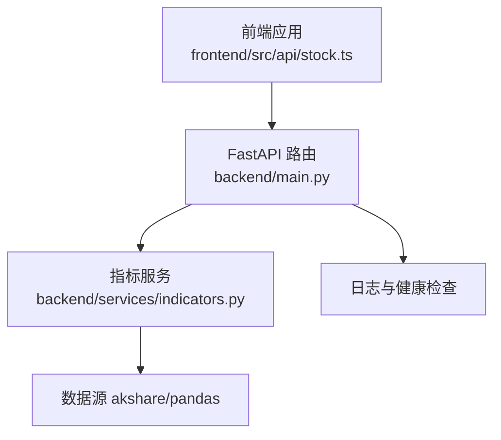
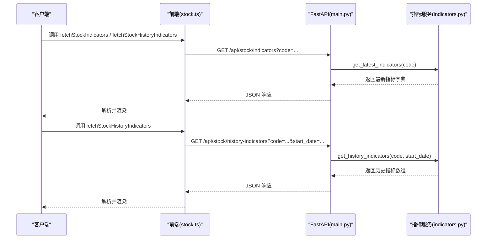
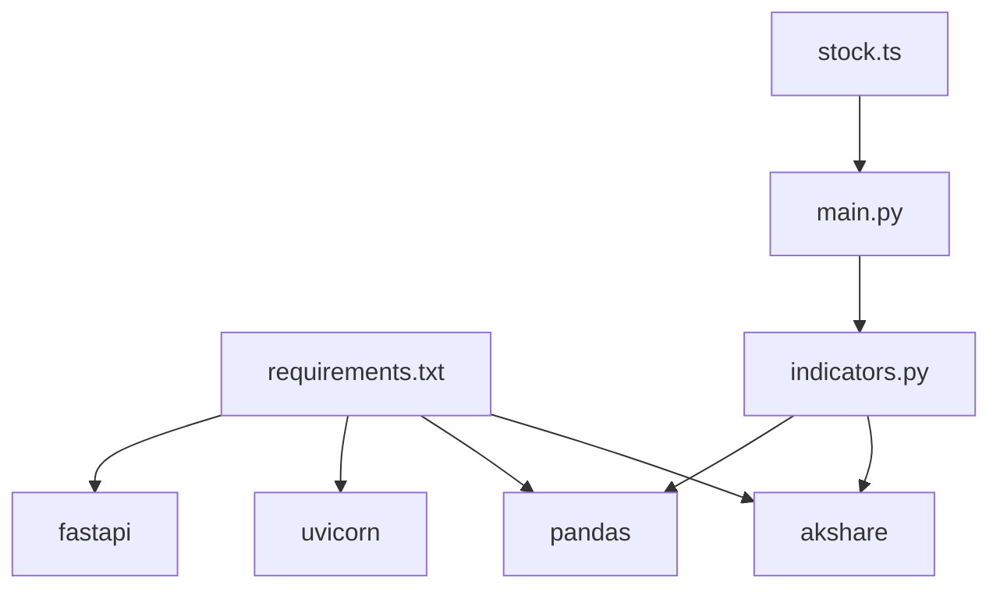

# 股票数据接口

<cite>
**本文引用的文件**
- [backend/main.py](file://backend/main.py)
- [backend/services/indicators.py](file://backend/services/indicators.py)
- [frontend/src/api/stock.ts](file://frontend/src/api/stock.ts)
- [README.md](file://README.md)
- [backend/requirements.txt](file://backend/requirements.txt)
- [backend/data/watchlist.json](file://backend/data/watchlist.json)
</cite>

## 目录
1. [简介](#简介)
2. [项目结构](#项目结构)
3. [核心组件](#核心组件)
4. [架构总览](#架构总览)
5. [详细组件分析](#详细组件分析)
6. [依赖关系分析](#依赖关系分析)
7. [性能考量](#性能考量)
8. [故障排查指南](#故障排查指南)
9. [结论](#结论)
10. [附录](#附录)

## 简介
本文件面向“股票数据相关API”的使用者与维护者，聚焦于技术指标查询接口，包括：
- GET /api/stock/indicators：获取某股票的最新技术指标（MACD、布林带、KDJ）
- GET /api/stock/history-indicators：获取某股票的历史技术指标序列（按起始日期过滤）

文档将详细说明请求参数、响应结构、计算逻辑、错误处理机制、使用示例以及性能优化建议。

## 项目结构
后端采用 FastAPI 提供 REST API，前端通过 TypeScript 封装请求方法。技术指标计算位于后端服务模块中，使用 pandas 和 akshare 获取行情并进行指标计算。

图表来源
- [backend/main.py:110-137](file://backend/main.py#L110-L137)
- [backend/services/indicators.py:1495-1641](file://backend/services/indicators.py#L1495-L1641)
- [frontend/src/api/stock.ts:132-183](file://frontend/src/api/stock.ts#L132-L183)

章节来源
- [README.md:75-84](file://README.md#L75-L84)
- [backend/main.py:110-137](file://backend/main.py#L110-L137)
- [frontend/src/api/stock.ts:132-183](file://frontend/src/api/stock.ts#L132-L183)

## 核心组件
- FastAPI 路由层：定义 /api/stock/indicators 与 /api/stock/history-indicators 两个端点，负责参数校验、异常捕获与响应返回。
- 指标服务层：封装技术指标计算逻辑（MACD、布林带、KDJ），并提供获取最新与历史指标的方法。
- 前端封装层：提供 fetch 函数与类型定义，统一处理错误与重试。

章节来源
- [backend/main.py:110-137](file://backend/main.py#L110-L137)
- [backend/services/indicators.py:1495-1641](file://backend/services/indicators.py#L1495-L1641)
- [frontend/src/api/stock.ts:132-183](file://frontend/src/api/stock.ts#L132-L183)

## 架构总览
后端通过 FastAPI 暴露接口，前端通过封装的 fetch 方法发起请求。指标计算依赖 akshare 获取历史行情，随后使用 pandas 进行指标计算。

图表来源
- [backend/main.py:110-137](file://backend/main.py#L110-L137)
- [backend/services/indicators.py:1495-1641](file://backend/services/indicators.py#L1495-L1641)
- [frontend/src/api/stock.ts:132-183](file://frontend/src/api/stock.ts#L132-L183)

## 详细组件分析

### 接口定义与参数说明
- GET /api/stock/indicators
  - 查询参数
    - code：股票代码，例如 600000 或 000001
  - 响应：包含最新日期、收盘价、成交量与三大指标（MACD、布林带、KDJ）的对象
- GET /api/stock/history-indicators
  - 查询参数
    - code：股票代码，例如 600000 或 000001
    - start_date：起始日期，格式为 YYYY-MM-DD，默认值为 2026-01-01
  - 响应：包含 code 与 data 数组的对象，数组元素为每条 K 线对应的指标值

章节来源
- [backend/main.py:110-137](file://backend/main.py#L110-L137)
- [frontend/src/api/stock.ts:132-183](file://frontend/src/api/stock.ts#L132-L183)

### 响应数据结构
- 最新指标响应（/api/stock/indicators）
  - code：股票代码
  - date：最新交易日
  - close：收盘价
  - volume：成交量
  - macd：对象，包含 dif、dea、macd
  - boll：对象，包含 upper、middle、lower
  - kdj：对象，包含 k、d、j
- 历史指标响应（/api/stock/history-indicators）
  - code：股票代码
  - data：数组，元素为对象，包含 date、close、volume、macd、boll、kdj

章节来源
- [frontend/src/api/stock.ts:19-41](file://frontend/src/api/stock.ts#L19-L41)
- [backend/services/indicators.py:1546-1641](file://backend/services/indicators.py#L1546-L1641)

### 技术指标计算逻辑
- MACD（12, 26, 9）
  - 计算短期与长期指数移动平均，得到 DIF、DEA 与柱状值
- 布林带（20, 2.0）
  - 计算 N 日均线与标准差，得到上轨、中轨、下轨
- KDJ（9, 3, 3）
  - 计算 RSV，再对 RSV 进行指数平滑得到 K、D，J=3K-2D

章节来源
- [backend/services/indicators.py:657-689](file://backend/services/indicators.py#L657-L689)

### 错误处理机制
- 400 错误（参数错误）
  - 当参数缺失、格式不正确或数据不足时抛出 ValueError，后端转换为 HTTP 400
- 500 错误（服务器内部错误）
  - 当发生未预期异常时，记录日志并返回 500

章节来源
- [backend/main.py:111-119](file://backend/main.py#L111-L119)
- [backend/main.py:129-135](file://backend/main.py#L129-L135)

### 使用示例

- curl 示例
  - 获取最新指标
    - curl "http://127.0.0.1:8000/api/stock/indicators?code=600000"
  - 获取历史指标
    - curl "http://127.0.0.1:8000/api/stock/history-indicators?code=600000&start_date=2026-01-01"

- Python requests 示例
  - 获取最新指标
    - import requests
    - resp = requests.get("http://127.0.0.1:8000/api/stock/indicators", params={"code": "600000"})
    - print(resp.json())
  - 获取历史指标
    - import requests
    - resp = requests.get("http://127.0.0.1:8000/api/stock/history-indicators", params={"code": "600000", "start_date": "2026-01-01"})
    - print(resp.json())

章节来源
- [frontend/src/api/stock.ts:132-183](file://frontend/src/api/stock.ts#L132-L183)
- [README.md:26](file://README.md#L26)

### 前端封装与类型定义
- 类型定义
  - Macd、Boll、Kdj、StockIndicatorsResponse、StockHistoryPoint、StockHistoryIndicatorsResponse
- 请求封装
  - fetchStockIndicators：GET /api/stock/indicators
  - fetchStockHistoryIndicators：GET /api/stock/history-indicators
  - 内置重试与错误消息提取

章节来源
- [frontend/src/api/stock.ts:1-468](file://frontend/src/api/stock.ts#L1-L468)

## 依赖关系分析
- 后端依赖
  - fastapi、uvicorn、pandas、akshare
- 指标服务依赖
  - pandas 进行时间序列与滚动计算
  - akshare 获取 A 股历史行情
- 前端依赖
  - fetch 与 URLSearchParams 进行 HTTP 请求

图表来源
- [backend/requirements.txt:1-5](file://backend/requirements.txt#L1-L5)
- [backend/services/indicators.py:12-15](file://backend/services/indicators.py#L12-L15)
- [backend/main.py:10-19](file://backend/main.py#L10-L19)
- [frontend/src/api/stock.ts:114-115](file://frontend/src/api/stock.ts#L114-L115)

章节来源
- [backend/requirements.txt:1-5](file://backend/requirements.txt#L1-L5)
- [backend/services/indicators.py:12-15](file://backend/services/indicators.py#L12-L15)
- [backend/main.py:10-19](file://backend/main.py#L10-L19)
- [frontend/src/api/stock.ts:114-115](file://frontend/src/api/stock.ts#L114-L115)

## 性能考量
- 数据源与缓存
  - 指标计算依赖 akshare 获取历史行情，建议合理设置查询时间范围，避免一次性请求过长周期导致超时或内存压力
  - 后端对 K 线与指标计算采用进程内响应缓存与本地 CSV mtime 失效机制（用于 /api/index/kline），可借鉴类似策略减少重复计算
- 前端重试
  - 前端封装了 fetchWithRetry，可在网络波动时提升成功率
- 建议
  - 对历史指标查询，尽量缩小 start_date 与 end_date 范围
  - 对高频查询，考虑在前端做去抖与缓存策略
  - 对于大量并发请求，建议在网关层做限流与熔断

章节来源
- [backend/services/indicators.py:1495-1641](file://backend/services/indicators.py#L1495-L1641)
- [frontend/src/api/stock.ts:117-130](file://frontend/src/api/stock.ts#L117-L130)

## 故障排查指南
- 400 错误（参数错误）
  - 检查 code 是否为空或格式不正确
  - 检查 start_date 格式是否为 YYYY-MM-DD
  - 检查数据源是否返回有效历史数据（至少 60 条记录）
- 500 错误（服务器内部错误）
  - 查看后端日志，确认异常堆栈
  - 确认 akshare 与 pandas 是否正常导入
- 常见问题
  - 股票代码不存在或未上市：返回空数据或抛出异常
  - 起始日期之后无数据：返回空数组或抛出异常

章节来源
- [backend/main.py:111-119](file://backend/main.py#L111-L119)
- [backend/main.py:129-135](file://backend/main.py#L129-L135)
- [backend/services/indicators.py:1507-1531](file://backend/services/indicators.py#L1507-L1531)
- [backend/services/indicators.py:1611-1612](file://backend/services/indicators.py#L1611-L1612)

## 结论
本文档系统性地梳理了股票数据相关 API 的设计与实现，明确了技术指标查询接口的请求参数、响应结构、计算逻辑与错误处理机制，并提供了使用示例与性能优化建议。建议在生产环境中结合缓存与限流策略，确保接口的稳定性与性能。

## 附录
- 相关配置与数据
  - watchlist.json：示例自选列表，可用于验证接口与前端联动
- 参考文档
  - README.md：项目整体介绍与快速启动说明

章节来源
- [backend/data/watchlist.json:1-27](file://backend/data/watchlist.json#L1-L27)
- [README.md:17-29](file://README.md#L17-L29)