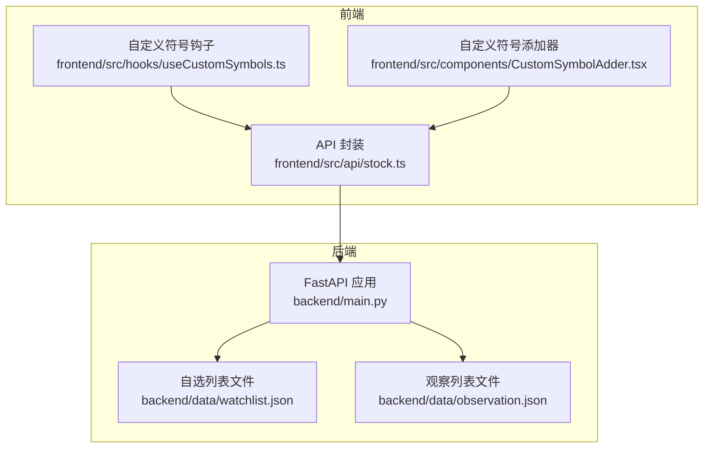
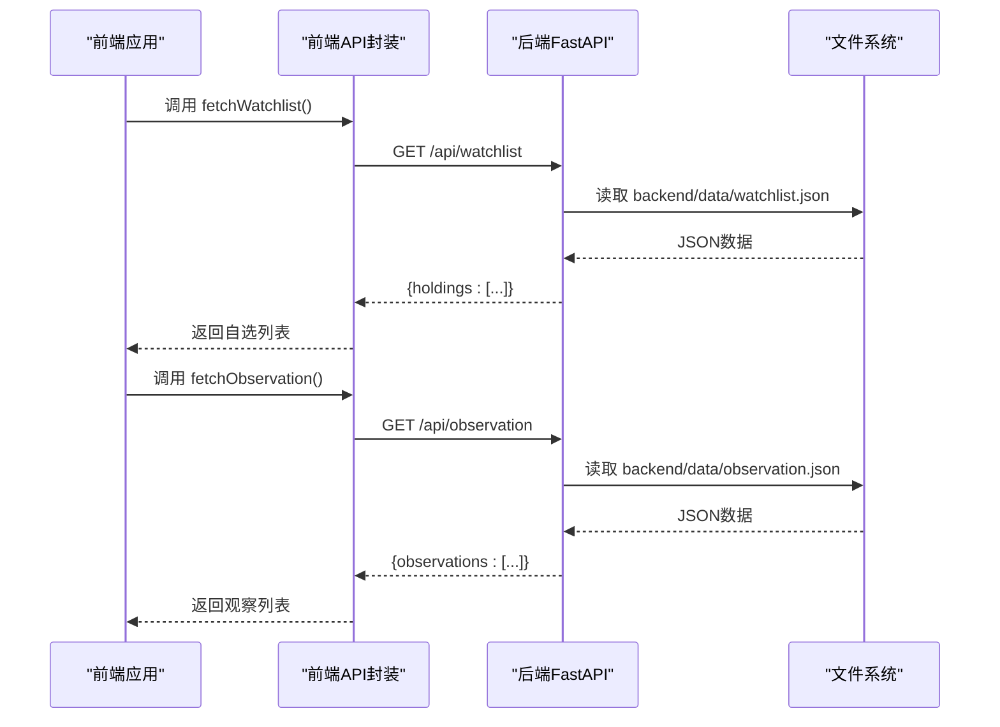
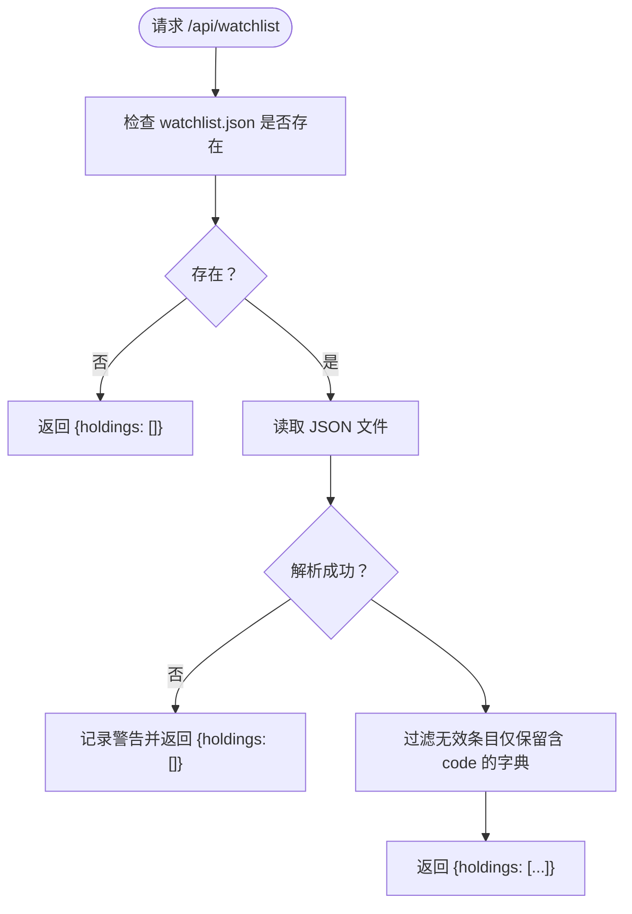
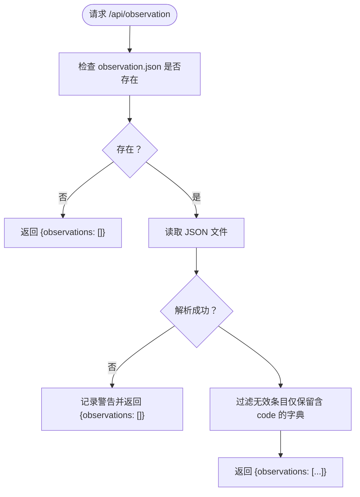
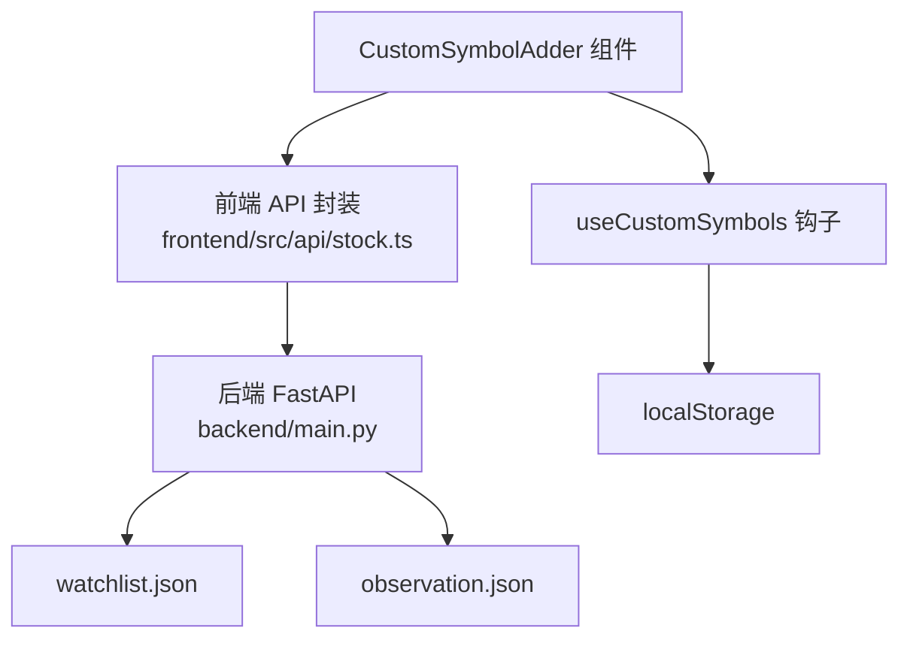

# 自选列表接口

<cite>
**本文引用的文件**
- [backend/main.py](file://backend/main.py)
- [backend/data/watchlist.json](file://backend/data/watchlist.json)
- [backend/data/observation.json](file://backend/data/observation.json)
- [frontend/src/api/stock.ts](file://frontend/src/api/stock.ts)
- [frontend/src/hooks/useCustomSymbols.ts](file://frontend/src/hooks/useCustomSymbols.ts)
- [frontend/src/components/CustomSymbolAdder.tsx](file://frontend/src/components/CustomSymbolAdder.tsx)
- [README.md](file://README.md)
</cite>

## 目录
1. [简介](#简介)
2. [项目结构](#项目结构)
3. [核心组件](#核心组件)
4. [架构概览](#架构概览)
5. [详细组件分析](#详细组件分析)
6. [依赖分析](#依赖分析)
7. [性能考虑](#性能考虑)
8. [故障排查指南](#故障排查指南)
9. [结论](#结论)
10. [附录](#附录)

## 简介
本文件为“自选列表管理API”的详细技术文档，聚焦以下两个接口：
- GET /api/watchlist：获取用户自选列表（持仓/自选）
- GET /api/observation：获取用户观察列表（仅前端显示）

文档将说明：
- 接口的数据结构与字段定义
- watchlist.json 与 observation.json 的文件格式与字段说明
- 列表管理操作指南（添加、删除、修改自选标的）
- 与前端界面的集成方式
- 文件读取的错误处理与异常情况
- 实际使用示例与最佳实践建议

## 项目结构
后端采用 FastAPI 提供 REST API，前端通过 fetch 调用后端接口，并在本地持久化自定义符号。关键文件如下：
- 后端路由与接口实现：backend/main.py
- 自选/观察数据文件：backend/data/watchlist.json、backend/data/observation.json
- 前端 API 封装与类型定义：frontend/src/api/stock.ts
- 前端自定义符号钩子与组件：frontend/src/hooks/useCustomSymbols.ts、frontend/src/components/CustomSymbolAdder.tsx
- 项目说明与启动方式：README.md

**图表来源**
- [backend/main.py:468-496](file://backend/main.py#L468-L496)
- [backend/data/watchlist.json:1-27](file://backend/data/watchlist.json#L1-L27)
- [backend/data/observation.json:1-25](file://backend/data/observation.json#L1-L25)
- [frontend/src/api/stock.ts:341-375](file://frontend/src/api/stock.ts#L341-L375)
- [frontend/src/hooks/useCustomSymbols.ts:1-77](file://frontend/src/hooks/useCustomSymbols.ts#L1-L77)
- [frontend/src/components/CustomSymbolAdder.tsx:1-192](file://frontend/src/components/CustomSymbolAdder.tsx#L1-L192)

**章节来源**
- [README.md:17-29](file://README.md#L17-L29)
- [backend/main.py:468-496](file://backend/main.py#L468-L496)

## 核心组件
- 后端接口
  - GET /api/watchlist：读取 backend/data/watchlist.json，返回 holdings 数组
  - GET /api/observation：读取 backend/data/observation.json，返回 observations 数组
- 前端接口封装
  - fetchWatchlist()：调用 /api/watchlist
  - fetchObservation()：调用 /api/observation
- 前端自定义符号管理
  - useCustomSymbols：本地存储自定义符号（localStorage）
  - CustomSymbolAdder：输入代码自动获取名称、添加/删除自定义符号

**章节来源**
- [backend/main.py:468-496](file://backend/main.py#L468-L496)
- [frontend/src/api/stock.ts:341-375](file://frontend/src/api/stock.ts#L341-L375)
- [frontend/src/hooks/useCustomSymbols.ts:1-77](file://frontend/src/hooks/useCustomSymbols.ts#L1-L77)
- [frontend/src/components/CustomSymbolAdder.tsx:1-192](file://frontend/src/components/CustomSymbolAdder.tsx#L1-L192)

## 架构概览
自选/观察列表的数据流如下：
- 前端通过 fetchWatchlist()/fetchObservation() 调用后端接口
- 后端从 JSON 文件读取数据，过滤无效条目，返回标准结构
- 前端将返回的列表用于图表 Tab 生成、排序与显示

**图表来源**
- [backend/main.py:468-496](file://backend/main.py#L468-L496)
- [frontend/src/api/stock.ts:355-375](file://frontend/src/api/stock.ts#L355-L375)

## 详细组件分析

### 接口：GET /api/watchlist（获取用户自选列表）
- 功能：读取用户自选/持仓列表
- 请求方式：GET
- 路径：/api/watchlist
- 响应结构：
  - holdings：数组，元素为对象，包含 code、name、可选 cost、shares、note 等字段
- 文件来源：backend/data/watchlist.json
- 过滤规则：仅保留包含 code 字段的字典项
- 异常处理：文件不存在或读取异常时返回空数组

**图表来源**
- [backend/main.py:468-481](file://backend/main.py#L468-L481)

**章节来源**
- [backend/main.py:468-481](file://backend/main.py#L468-L481)
- [backend/data/watchlist.json:1-27](file://backend/data/watchlist.json#L1-L27)

### 接口：GET /api/observation（获取用户观察列表）
- 功能：读取用户观察列表（仅前端显示）
- 请求方式：GET
- 路径：/api/observation
- 响应结构：
  - observations：数组，元素为对象，包含 code、name 等字段
- 文件来源：backend/data/observation.json
- 过滤规则：仅保留包含 code 字段的字典项
- 异常处理：文件不存在或读取异常时返回空数组

**图表来源**
- [backend/main.py:484-496](file://backend/main.py#L484-L496)

**章节来源**
- [backend/main.py:484-496](file://backend/main.py#L484-L496)
- [backend/data/observation.json:1-25](file://backend/data/observation.json#L1-L25)

### 数据模型与字段定义

#### watchlist.json（自选/持仓）
- 结构概览
  - _comment：注释字段（内部说明）
  - holdings：数组，元素为对象
- 字段定义
  - code：字符串，必填
  - name：字符串，必填
  - cost：数值，可选（成本价）
  - shares：数值，可选（股数）
  - note：字符串，可选（备注）
- 示例结构（字段说明）
  - code、name 为必填
  - cost、shares、note 为可选扩展字段

**章节来源**
- [backend/data/watchlist.json:1-27](file://backend/data/watchlist.json#L1-L27)

#### observation.json（观察）
- 结构概览
  - _comment：注释字段（内部说明）
  - observations：数组，元素为对象
- 字段定义
  - code：字符串，必填
  - name：字符串，必填
- 示例结构（字段说明）
  - code、name 为必填
  - 无成本价/股数等扩展字段

**章节来源**
- [backend/data/observation.json:1-25](file://backend/data/observation.json#L1-L25)

### 前端集成与操作指南

#### 前端 API 封装
- 类型定义
  - WatchlistItem：包含 code、name、可选 cost、shares、note
  - WatchlistResponse：{ holdings: WatchlistItem[] }
  - ObservationResponse：{ observations: WatchlistItem[] }
- 接口函数
  - fetchWatchlist()：GET /api/watchlist
  - fetchObservation()：GET /api/observation
- 错误处理
  - 非 2xx 响应时返回空数组，避免阻塞前端渲染

**章节来源**
- [frontend/src/api/stock.ts:341-375](file://frontend/src/api/stock.ts#L341-L375)

#### 自定义符号管理（localStorage）
- useCustomSymbols 钩子
  - 本地存储键：custom_symbols_v1
  - 支持增删查，自动序列化/反序列化
- CustomSymbolAdder 组件
  - 输入代码自动获取名称（调用 /api/stock/name）
  - 添加/删除自定义符号
  - 格式校验：支持 6 位数字（A 股/ETF）、sh/sz+6 位（指数）、hk+5 位（港股）

**章节来源**
- [frontend/src/hooks/useCustomSymbols.ts:1-77](file://frontend/src/hooks/useCustomSymbols.ts#L1-L77)
- [frontend/src/components/CustomSymbolAdder.tsx:1-192](file://frontend/src/components/CustomSymbolAdder.tsx#L1-L192)

#### 列表管理操作指南
- 添加自选/观察标的
  - 方案一：直接编辑 JSON 文件（推荐）
    - 在 watchlist.json 的 holdings 或 observation.json 的 observations 中新增对象
    - 字段：code、name（必填），可选 cost、shares、note
  - 方案二：前端自定义符号（仅本地）
    - 使用 CustomSymbolAdder 添加，数据保存在 localStorage
    - 适用于临时查看，不参与后端雷达/止损计算
- 删除自选/观察标的
  - 直接编辑 JSON 文件，删除对应对象
  - 或在前端使用 CustomSymbolAdder 删除 localStorage 中的条目
- 修改自选/观察标的
  - 直接编辑 JSON 文件，修改字段值
  - 注意保持 JSON 语法正确（逗号、引号、括号）

**章节来源**
- [backend/data/watchlist.json:1-27](file://backend/data/watchlist.json#L1-L27)
- [backend/data/observation.json:1-25](file://backend/data/observation.json#L1-L25)
- [frontend/src/hooks/useCustomSymbols.ts:1-77](file://frontend/src/hooks/useCustomSymbols.ts#L1-L77)
- [frontend/src/components/CustomSymbolAdder.tsx:1-192](file://frontend/src/components/CustomSymbolAdder.tsx#L1-L192)

### 与前端界面的集成
- 自定义符号与自选/观察列表的融合
  - 前端根据 watchlist、observation 与 localStorage 的 customSymbols 合并生成图表 Tab
  - 优先使用后端 watchlist/observation 的 code 映射到内置 Tab，否则生成 custom_${code} Tab
- Tab 排序与顺序映射
  - 基于 watchlist/observation 中的顺序映射到 Tab key，保证用户配置的顺序一致性

**章节来源**
- [frontend/src/api/stock.ts:341-375](file://frontend/src/api/stock.ts#L341-L375)
- [frontend/src/hooks/useCustomSymbols.ts:1-77](file://frontend/src/hooks/useCustomSymbols.ts#L1-L77)
- [frontend/src/components/CustomSymbolAdder.tsx:1-192](file://frontend/src/components/CustomSymbolAdder.tsx#L1-L192)

## 依赖分析
- 后端依赖
  - FastAPI：提供路由与响应
  - 文件系统：读取 watchlist.json 与 observation.json
- 前端依赖
  - fetch：调用后端接口
  - localStorage：持久化自定义符号
  - 组件：CustomSymbolAdder 与 useCustomSymbols 钩子

**图表来源**
- [backend/main.py:468-496](file://backend/main.py#L468-L496)
- [frontend/src/api/stock.ts:341-375](file://frontend/src/api/stock.ts#L341-L375)
- [frontend/src/hooks/useCustomSymbols.ts:1-77](file://frontend/src/hooks/useCustomSymbols.ts#L1-L77)
- [frontend/src/components/CustomSymbolAdder.tsx:1-192](file://frontend/src/components/CustomSymbolAdder.tsx#L1-L192)

**章节来源**
- [backend/main.py:468-496](file://backend/main.py#L468-L496)
- [frontend/src/api/stock.ts:341-375](file://frontend/src/api/stock.ts#L341-L375)
- [frontend/src/hooks/useCustomSymbols.ts:1-77](file://frontend/src/hooks/useCustomSymbols.ts#L1-L77)
- [frontend/src/components/CustomSymbolAdder.tsx:1-192](file://frontend/src/components/CustomSymbolAdder.tsx#L1-L192)

## 性能考虑
- 文件读取
  - 两个接口均为轻量读取，JSON 解析与过滤开销较小
  - 建议保持 JSON 文件简洁，避免冗余字段
- 前端渲染
  - 合并 watchlist/observation 与 localStorage 的自定义符号，避免重复生成 Tab
  - 使用 useMemo 与 Map 做顺序映射，减少不必要的重渲染

[本节为通用指导，不涉及具体文件分析]

## 故障排查指南
- 常见问题与处理
  - 文件不存在
    - watchlist.json 或 observation.json 不存在时，接口返回空数组
  - JSON 解析失败
    - 文件损坏或格式错误时，接口记录警告并返回空数组
  - 前端无法获取观察/自选列表
    - 检查后端是否启动、端口是否正确（默认 8000）
    - 检查前端 API_BASE_URL（默认 http://127.0.0.1:8000）
- 建议
  - 修改后端路由或 JSON 文件后需重启后端
  - 保持 JSON 文件的 UTF-8 编码与合法语法

**章节来源**
- [backend/main.py:468-496](file://backend/main.py#L468-L496)
- [README.md:26-29](file://README.md#L26-L29)

## 结论
- GET /api/watchlist 与 GET /api/observation 提供了稳定的自选/观察列表数据接口
- watchlist.json 与 observation.json 采用简单 JSON 结构，便于直接编辑与维护
- 前端通过 fetch 封装与 localStorage 钩子实现灵活的自定义符号管理
- 建议优先通过直接编辑 JSON 文件的方式维护自选/观察列表，确保与后端雷达/止损流程一致

[本节为总结性内容，不涉及具体文件分析]

## 附录

### 接口规范摘要
- GET /api/watchlist
  - 请求参数：无
  - 响应：{ holdings: [{ code, name, cost?, shares?, note? }] }
- GET /api/observation
  - 请求参数：无
  - 响应：{ observations: [{ code, name }] }

**章节来源**
- [backend/main.py:468-496](file://backend/main.py#L468-L496)
- [frontend/src/api/stock.ts:341-375](file://frontend/src/api/stock.ts#L341-L375)

### 文件格式与字段定义
- watchlist.json
  - _comment：内部注释
  - holdings：数组，元素为对象，必填字段 code、name，可选 cost、shares、note
- observation.json
  - _comment：内部注释
  - observations：数组，元素为对象，必填字段 code、name

**章节来源**
- [backend/data/watchlist.json:1-27](file://backend/data/watchlist.json#L1-L27)
- [backend/data/observation.json:1-25](file://backend/data/observation.json#L1-L25)

### 最佳实践建议
- 维护策略
  - 使用 JSON 文件直接维护自选/观察列表，便于版本控制与备份
  - 保持字段命名一致，避免拼写错误
- 前端体验
  - 使用 CustomSymbolAdder 组件快速添加/删除自定义符号
  - 通过 localStorage 的自定义符号作为临时查看，不替代后端 JSON 文件
- 错误处理
  - 前端接口封装已处理非 2xx 响应，返回空数组
  - 后端接口已记录读取异常日志，不影响其他功能

**章节来源**
- [frontend/src/api/stock.ts:341-375](file://frontend/src/api/stock.ts#L341-L375)
- [frontend/src/hooks/useCustomSymbols.ts:1-77](file://frontend/src/hooks/useCustomSymbols.ts#L1-L77)
- [frontend/src/components/CustomSymbolAdder.tsx:1-192](file://frontend/src/components/CustomSymbolAdder.tsx#L1-L192)