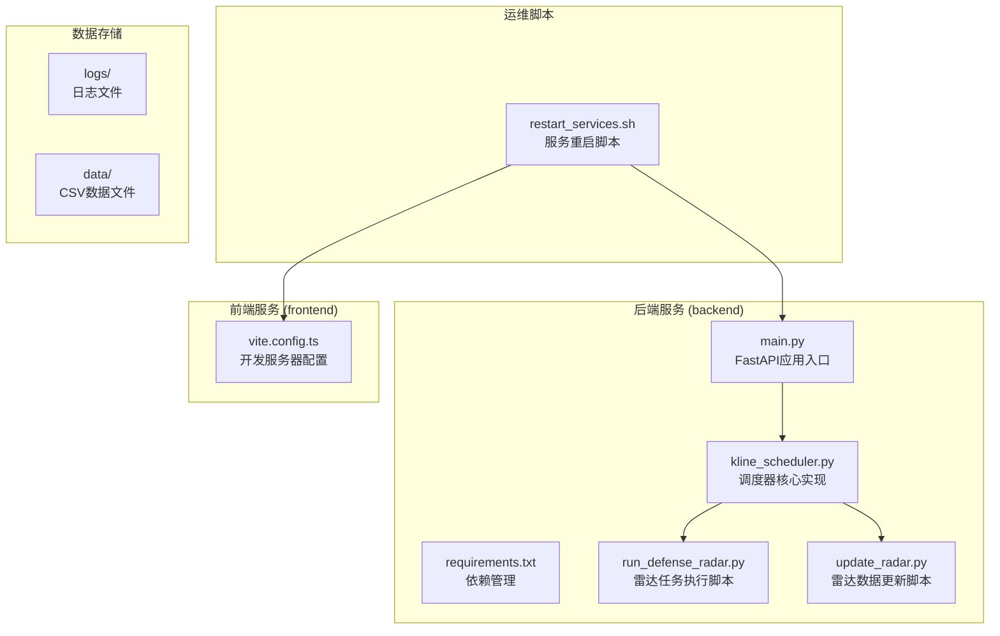
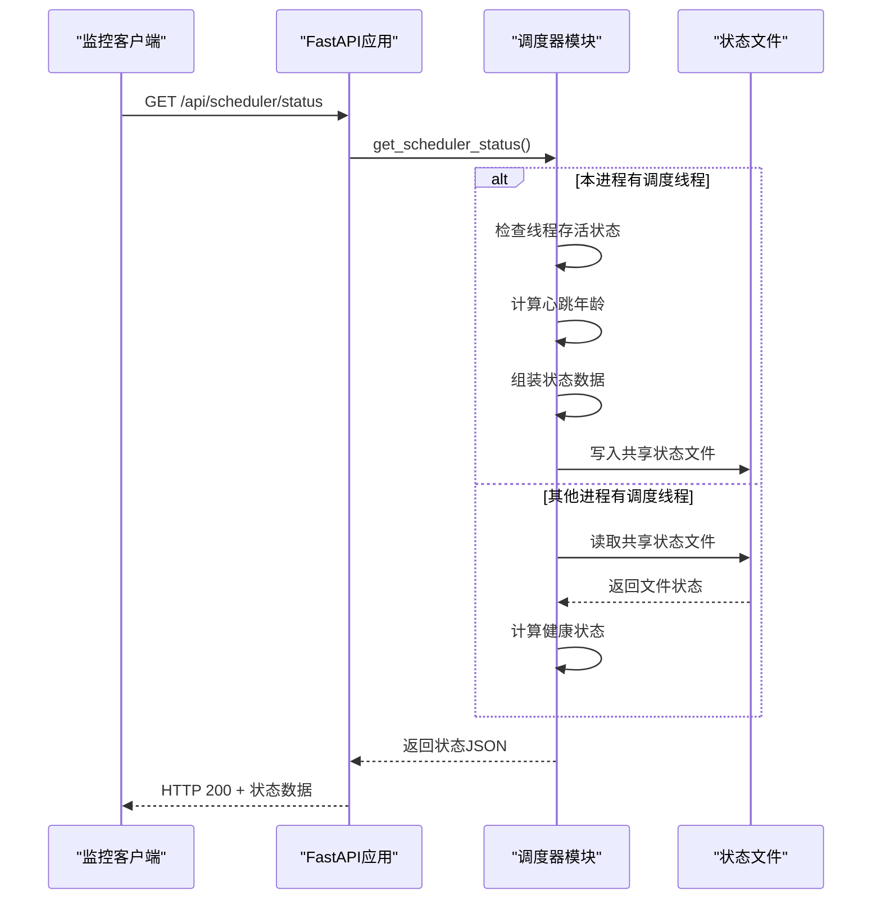
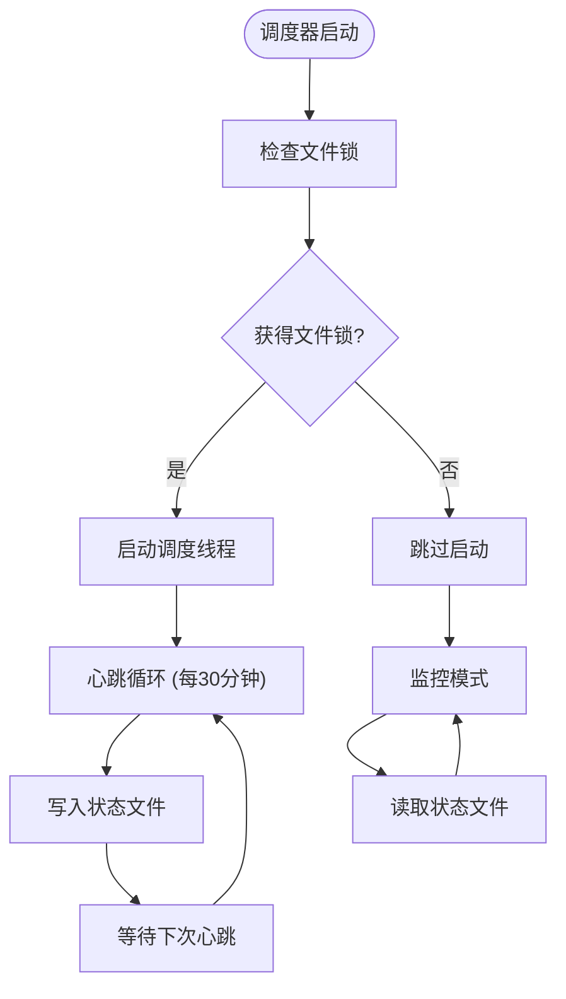
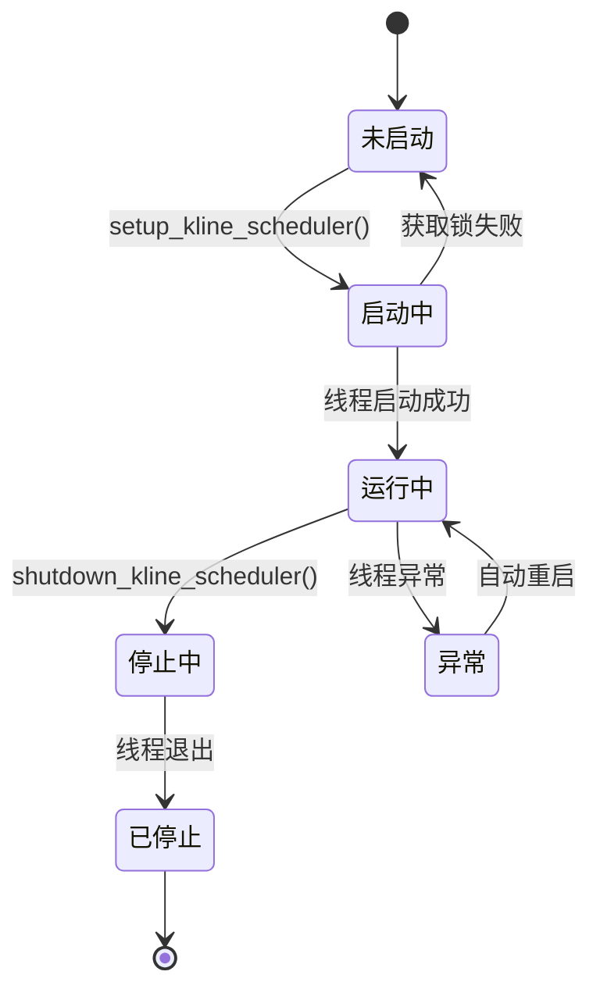
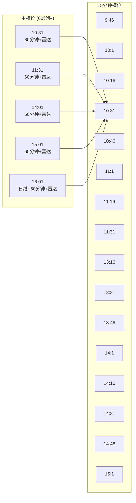
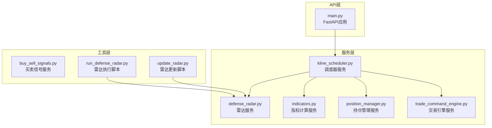
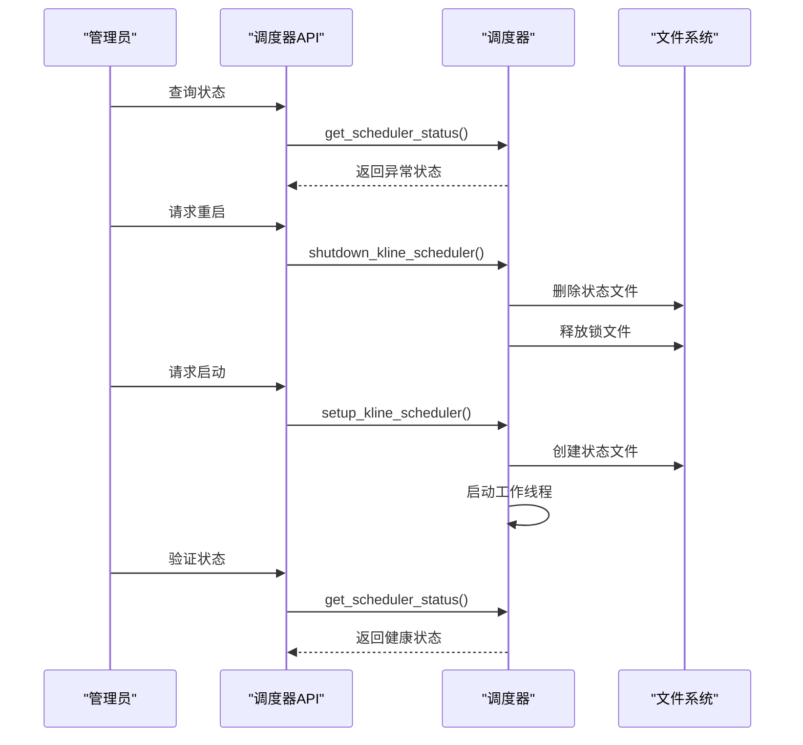

# 调度器状态接口

<cite>
**本文档引用的文件**
- [kline_scheduler.py](file://backend/services/kline_scheduler.py)
- [main.py](file://backend/main.py)
- [restart_services.sh](file://restart_services.sh)
- [requirements.txt](file://backend/requirements.txt)
- [run_defense_radar.py](file://backend/run_defense_radar.py)
- [update_radar.py](file://backend/update_radar.py)
- [test_defense_radar_trigger.py](file://backend/tests/test_defense_radar_trigger.py)
</cite>

## 目录
1. [简介](#简介)
2. [项目结构](#项目结构)
3. [核心组件](#核心组件)
4. [架构概览](#架构概览)
5. [详细组件分析](#详细组件分析)
6. [依赖关系分析](#依赖关系分析)
7. [性能考虑](#性能考虑)
8. [故障排查指南](#故障排查指南)
9. [结论](#结论)

## 简介

调度器状态查询API提供了对后台定时任务调度器的健康状态监控能力。该API允许系统管理员和监控工具实时检查调度器的运行状态、执行频率、最近执行时间等关键指标，确保系统的稳定性和可靠性。

本API主要服务于以下场景：
- 实时监控调度器健康状态
- 检查定时任务的执行频率和准确性
- 监控最近一次任务执行的时间
- 协助故障诊断和问题排查
- 支持自动化运维和告警机制

## 项目结构

该项目采用前后端分离的架构设计，调度器状态查询API位于后端服务中，通过FastAPI框架提供RESTful接口。



**图表来源**
- [main.py:1-532](file://backend/main.py#L1-L532)
- [kline_scheduler.py:1-496](file://backend/services/kline_scheduler.py#L1-L496)

**章节来源**
- [main.py:105-226](file://backend/main.py#L105-L226)
- [kline_scheduler.py:1-496](file://backend/services/kline_scheduler.py#L1-L496)

## 核心组件

### 调度器状态API端点

调度器状态查询API通过GET `/api/scheduler/status` 端点提供服务，该端点直接委托给调度器模块的 `get_scheduler_status()` 函数。

### 调度器核心功能

调度器采用后台线程模式运行，具有以下核心特性：
- **多worker去重**：通过文件锁确保同一时间只有一个进程启动调度器
- **心跳监控**：每30分钟发送一次心跳信号，超时10分钟被视为异常
- **槽位调度**：支持主槽位（60分钟）和15分钟独立同步两种模式
- **异常恢复**：线程级异常捕获，确保调度器不会因单次错误而停止

### 状态数据结构

调度器状态返回包含以下关键字段：

| 字段名 | 类型 | 描述 | 示例值 |
|--------|------|------|--------|
| alive | boolean | 调度器线程是否存活 | true/false |
| healthy | boolean | 调度器健康状态 | true/false |
| thread_name | string | 线程名称 | "kline-scheduler" |
| next_scheduled | string | 下次调度时间（ISO 8601） | "2026-04-25T10:31:00+08:00" |
| last_slot | string | 最近一次槽位执行时间（ISO 8601） | "2026-04-24T16:01:00+08:00" |
| slot_count | integer | 总执行次数 | 1234 |
| heartbeat_age_sec | integer | 心跳年龄（秒） | 1800 |

**章节来源**
- [main.py:199-202](file://backend/main.py#L199-L202)
- [kline_scheduler.py:414-449](file://backend/services/kline_scheduler.py#L414-L449)

## 架构概览

调度器状态查询API的架构设计体现了高可用性和可观测性的原则。



**图表来源**
- [main.py:199-202](file://backend/main.py#L199-L202)
- [kline_scheduler.py:414-449](file://backend/services/kline_scheduler.py#L414-L449)

### 状态文件机制

调度器使用共享状态文件 (`/tmp/kline_scheduler_status.json`) 实现多worker环境下的状态同步：



**图表来源**
- [kline_scheduler.py:452-496](file://backend/services/kline_scheduler.py#L452-L496)
- [kline_scheduler.py:64-96](file://backend/services/kline_scheduler.py#L64-L96)

**章节来源**
- [kline_scheduler.py:452-496](file://backend/services/kline_scheduler.py#L452-L496)
- [kline_scheduler.py:64-96](file://backend/services/kline_scheduler.py#L64-L96)

## 详细组件分析

### 调度器状态查询实现

调度器状态查询的核心逻辑集中在 `get_scheduler_status()` 函数中，该函数实现了以下功能：

#### 线程状态检查
函数首先检查当前进程中的调度器线程是否存活，如果存活则直接使用本地状态数据。

#### 多worker状态同步
如果当前进程没有调度线程，函数会尝试从共享状态文件读取其他worker的状态信息，并判断其健康状况。

#### 健康状态评估
健康状态的判断标准：
- 心跳年龄小于600秒（10分钟）视为健康
- 线程存活且心跳正常
- 文件状态有效且心跳正常

### 调度器启动和停止流程

调度器的生命周期管理通过以下函数实现：

#### 启动流程 (`setup_kline_scheduler`)
1. 检查现有线程状态，避免重复启动
2. 尝试获取文件锁进行多worker去重
3. 检查是否需要补跑错过槽位
4. 创建并启动后台线程
5. 设置SSE回调函数

#### 停止流程 (`shutdown_kline_scheduler`)
1. 设置停止事件标志
2. 等待线程优雅退出（最多8秒）
3. 确保资源正确释放



**图表来源**
- [kline_scheduler.py:452-496](file://backend/services/kline_scheduler.py#L452-L496)
- [kline_scheduler.py:363-377](file://backend/services/kline_scheduler.py#L363-L377)

**章节来源**
- [kline_scheduler.py:452-496](file://backend/services/kline_scheduler.py#L452-L496)
- [kline_scheduler.py:363-377](file://backend/services/kline_scheduler.py#L363-L377)

### 调度器槽位机制

调度器采用两种不同的槽位模式来确保数据的及时更新：

#### 主槽位（60分钟）
- **执行时间**：10:31、11:31、14:01、15:01、16:01
- **执行内容**：全量日线同步 + 60分钟同步 + 双防线雷达
- **特殊处理**：16:01包含日线同步

#### 15分钟独立同步
- **执行频率**：交易时间内每15分钟
- **执行时间**：9:46、10:1、10:16、10:31、10:46、11:1、11:16、11:31、13:16、13:31、13:46、14:1、14:16、14:31、14:46、15:1
- **执行内容**：15分钟数据同步



**图表来源**
- [kline_scheduler.py:42-49](file://backend/services/kline_scheduler.py#L42-L49)
- [kline_scheduler.py:119-122](file://backend/services/kline_scheduler.py#L119-L122)

**章节来源**
- [kline_scheduler.py:42-49](file://backend/services/kline_scheduler.py#L42-L49)
- [kline_scheduler.py:119-122](file://backend/services/kline_scheduler.py#L119-L122)

## 依赖关系分析

### 外部依赖

项目的主要外部依赖包括：

| 依赖包 | 版本要求 | 用途 |
|--------|----------|------|
| fastapi | - | Web框架，提供RESTful API |
| uvicorn[standard] | - | ASGI服务器，支持异步处理 |
| pandas | - | 数据处理和分析 |
| akshare | - | 金融数据获取 |

### 内部模块依赖



**图表来源**
- [main.py:16-21](file://backend/main.py#L16-L21)
- [requirements.txt:1-5](file://backend/requirements.txt#L1-L5)

**章节来源**
- [main.py:16-21](file://backend/main.py#L16-L21)
- [requirements.txt:1-5](file://backend/requirements.txt#L1-L5)

### 环境变量和配置

调度器支持以下环境变量配置：

| 环境变量 | 默认值 | 描述 |
|----------|--------|------|
| CORS_ALLOWED_ORIGINS | "http://127.0.0.1:5173,http://localhost:5173" | 允许跨域请求的源地址 |
| HTTP_PROXY/HTTPS_PROXY | 无 | HTTP代理配置 |
| MEIHUA2TEST_FUTURE_K | 无 | 控制889999演示数据的未来K线行为 |

**章节来源**
- [main.py:112-123](file://backend/main.py#L112-L123)
- [restart_services_meihua2test_future.sh:12](file://restart_services_meihua2test_future.sh#L12)

## 性能考虑

### 心跳机制优化

调度器采用30分钟心跳间隔的设计，在保证监控及时性的同时最小化系统开销：

- **心跳频率**：每1800秒（30分钟）一次
- **超时阈值**：600秒（10分钟）未收到心跳视为异常
- **状态文件写入**：心跳时同时更新共享状态文件

### 线程安全设计

调度器通过以下机制确保线程安全：
- 使用全局锁保护槽位执行计数
- 状态文件的原子写入操作
- 线程间状态同步的幂等性设计

### 内存和CPU优化

- **轻量级线程**：使用守护线程，避免阻塞主进程退出
- **批量操作**：同一批次内的多个数据同步操作合并执行
- **异常隔离**：单个任务失败不影响整体调度流程

## 故障排查指南

### 常见问题诊断

#### 调度器未启动
**症状**：`alive` 字段为 `false`
**排查步骤**：
1. 检查是否有其他进程已获取文件锁
2. 查看后端服务日志中的启动信息
3. 验证Python环境和依赖包安装情况

#### 调度器不健康
**症状**：`healthy` 字段为 `false`
**可能原因**：
- 心跳超时（心跳年龄 ≥ 600秒）
- 线程异常退出
- 状态文件写入失败

#### 槽位执行延迟
**症状**：`next_scheduled` 时间与预期不符
**排查方法**：
1. 检查系统时间同步状态
2. 验证交易时间配置
3. 查看相关服务的依赖状态

### 监控最佳实践

#### 健康检查策略
```bash
# 基础健康检查
curl -s http://localhost:8000/api/scheduler/status

# 连续监控脚本示例
while true; do
    STATUS=$(curl -s http://localhost:8000/api/scheduler/status)
    ALIVE=$(echo $STATUS | jq '.alive')
    HEALTHY=$(echo $STATUS | jq '.healthy')
    
    if [ "$ALIVE" = "true" ] && [ "$HEALTHY" = "true" ]; then
        echo "$(date): 调度器健康"
    else
        echo "$(date): 调度器异常 - Alive: $ALIVE, Healthy: $HEALTHY"
    fi
    
    sleep 60
done
```

#### 告警配置建议
- **即时告警**：`alive` 为 `false` 或 `healthy` 为 `false` 且持续超过5分钟
- **延迟告警**：`heartbeat_age_sec` 超过3600秒（1小时）
- **容量告警**：`slot_count` 增长异常缓慢

### 重启和恢复流程

当发现调度器异常时，可以使用以下流程进行恢复：

1. **检查状态**：先查询当前状态确认问题
2. **优雅停止**：调用 `shutdown_kline_scheduler()`
3. **清理资源**：删除状态文件和锁文件
4. **重新启动**：调用 `setup_kline_scheduler()`
5. **验证恢复**：再次查询状态确认恢复正常



**图表来源**
- [kline_scheduler.py:491-496](file://backend/services/kline_scheduler.py#L491-L496)
- [kline_scheduler.py:452-496](file://backend/services/kline_scheduler.py#L452-L496)

**章节来源**
- [kline_scheduler.py:491-496](file://backend/services/kline_scheduler.py#L491-L496)
- [kline_scheduler.py:452-496](file://backend/services/kline_scheduler.py#L452-L496)

## 结论

调度器状态查询API为整个系统的可观测性提供了重要支撑。通过提供详细的健康状态监控、执行频率跟踪和故障诊断能力，该API帮助运维团队及时发现和解决问题，确保系统的稳定运行。

### 关键优势

1. **多worker支持**：通过文件锁和状态文件实现跨进程状态同步
2. **实时监控**：提供毫秒级响应的健康状态查询
3. **故障自愈**：内置异常处理和自动重启机制
4. **易于集成**：标准化的JSON响应格式，便于各种监控工具集成

### 未来改进方向

1. **增强日志记录**：增加更详细的执行统计和性能指标
2. **扩展监控维度**：添加任务执行时间、成功率等指标
3. **告警策略**：提供更灵活的告警规则配置
4. **可视化界面**：开发Web界面展示调度器状态

该API的设计充分考虑了生产环境的需求，在保证功能完整性的同时，注重了性能、可靠性和可维护性。