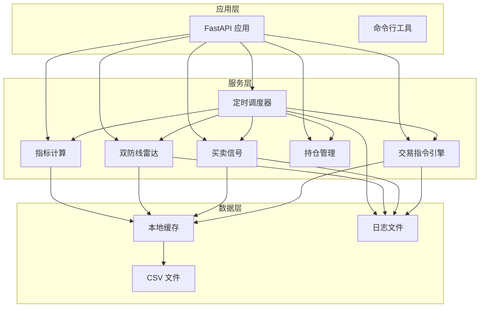
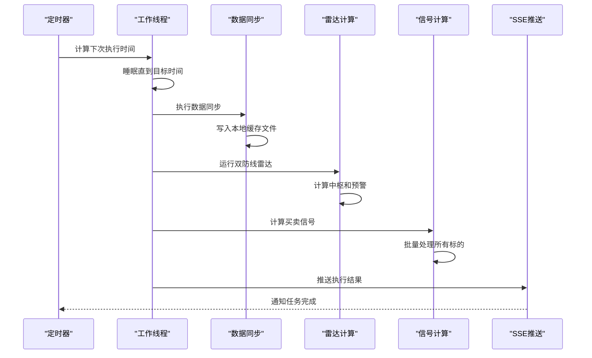
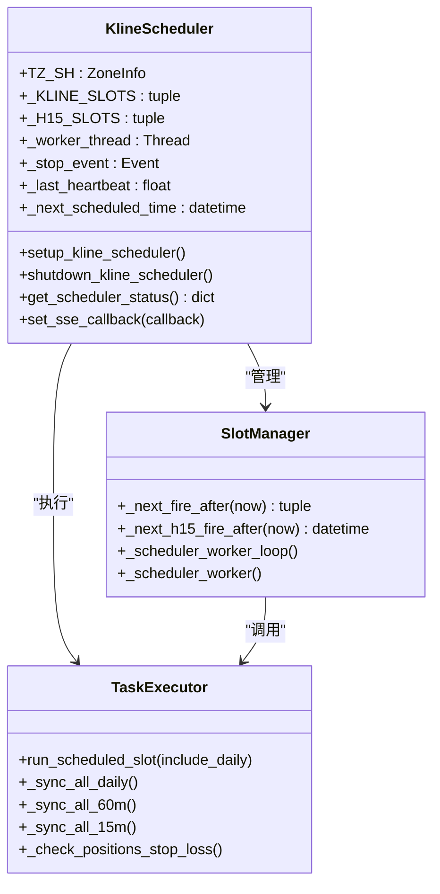
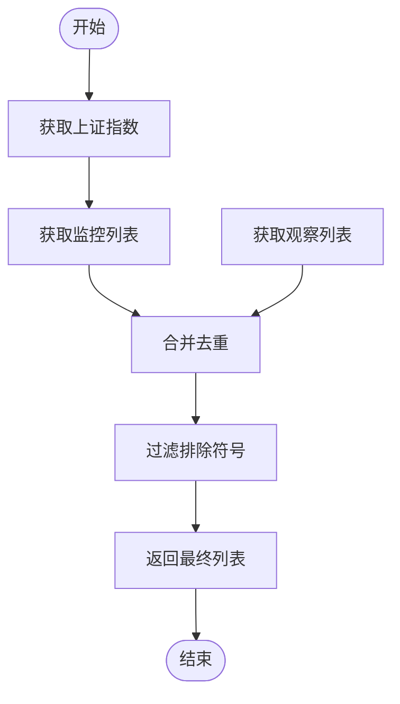
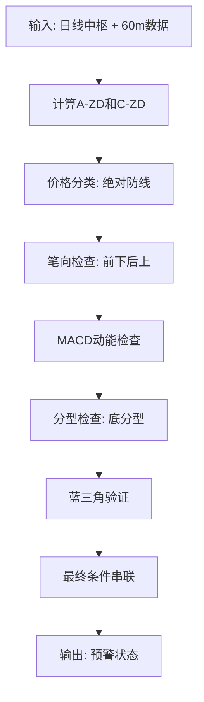
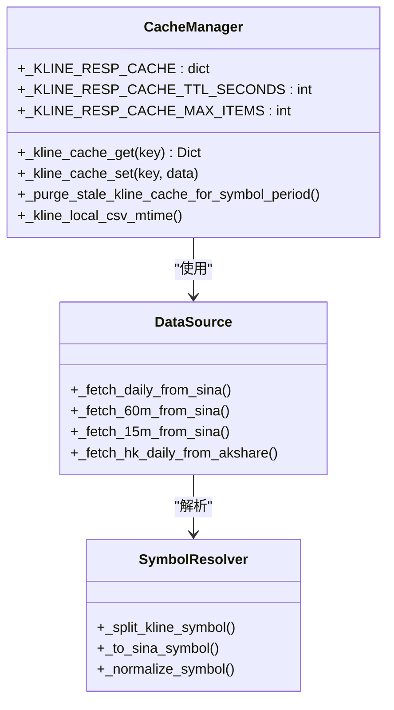
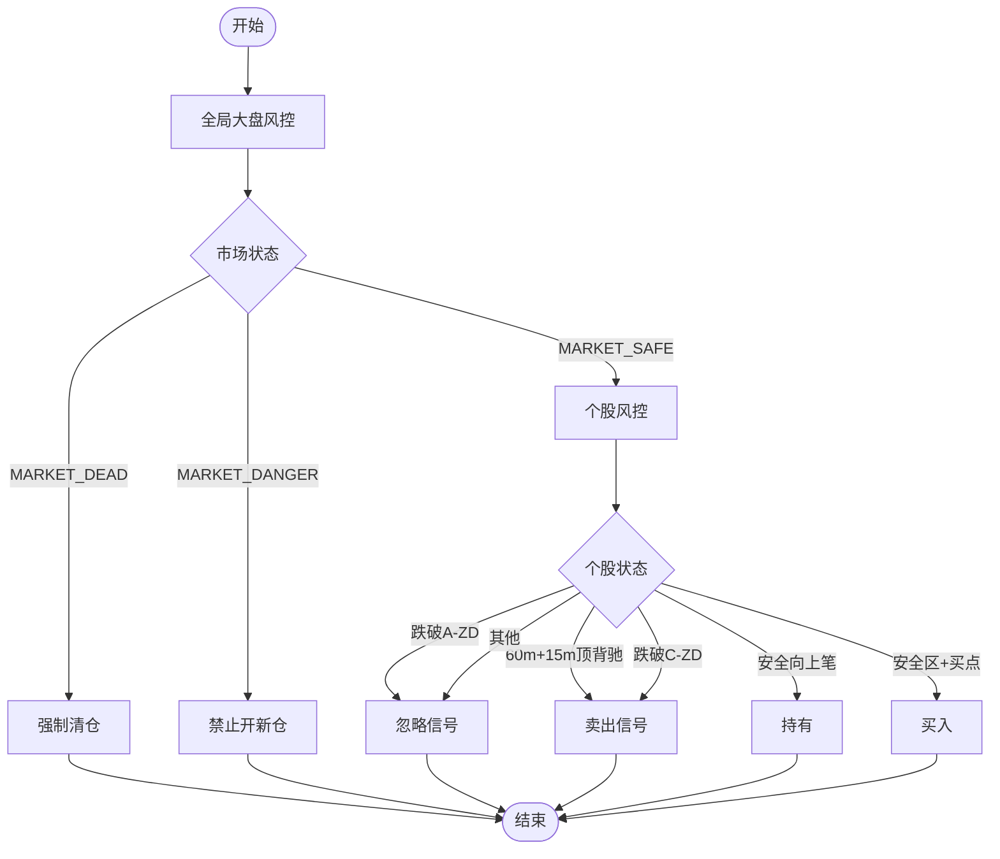
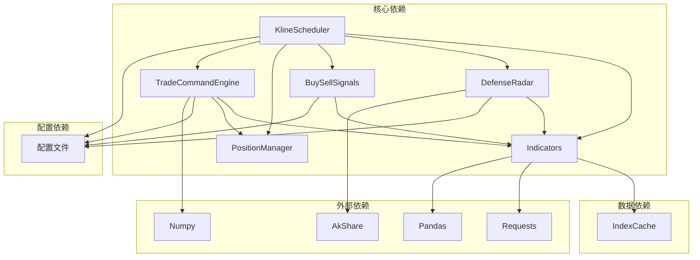
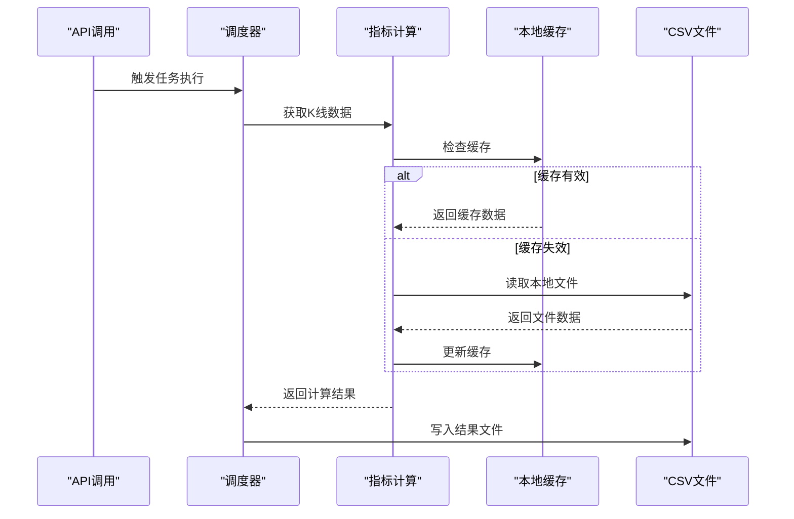
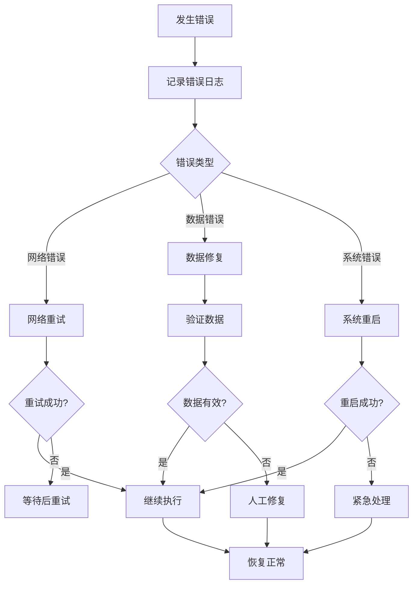

# 定时任务调度系统

<cite>
**本文引用的文件**
- [kline_scheduler.py](file://backend/services/kline_scheduler.py)
- [main.py](file://backend/main.py)
- [defense_radar.py](file://backend/services/defense_radar.py)
- [indicators.py](file://backend/services/indicators.py)
- [position_manager.py](file://backend/services/position_manager.py)
- [buy_sell_signals.py](file://backend/services/buy_sell_signals.py)
- [trade_command_engine.py](file://backend/services/trade_command_engine.py)
- [index_cache.py](file://backend/services/index_cache.py)
- [run_defense_radar.py](file://backend/run_defense_radar.py)
- [run_trade_command.py](file://backend/run_trade_command.py)
- [watchlist.json](file://backend/data/watchlist.json)
- [observation.json](file://backend/data/observation.json)
</cite>

## 目录
1. [简介](#简介)
2. [项目结构](#项目结构)
3. [核心组件](#核心组件)
4. [架构概览](#架构概览)
5. [详细组件分析](#详细组件分析)
6. [依赖分析](#依赖分析)
7. [性能考虑](#性能考虑)
8. [故障排查指南](#故障排查指南)
9. [结论](#结论)
10. [附录](#附录)

## 简介
本系统是一个基于 Python 的定时任务调度平台，专注于 A 股市场的 K 线数据刷新与分析。系统采用独立线程实现，使用 Asia/Shanghai 时区精确控制任务执行时机，涵盖 60 分钟 K 线刷新、日线刷新、雷达计算、买卖信号生成、止损检查、交易指令引擎等多个核心功能模块。系统通过文件锁实现多进程去重，通过状态文件实现跨进程监控，通过 SSE 实时推送任务执行结果。

## 项目结构
系统采用模块化设计，主要分为以下层次：
- **服务层**：核心业务逻辑模块（K 线调度、雷达计算、指标计算等）
- **数据层**：缓存管理、数据源访问、文件存储
- **应用层**：Web API、命令行工具、手动触发脚本
- **配置层**：监控配置、日志配置、数据文件

**图表来源**
- [main.py:80-92](file://backend/main.py#L80-L92)
- [kline_scheduler.py:448-484](file://backend/services/kline_scheduler.py#L448-L484)

**章节来源**
- [main.py:1-514](file://backend/main.py#L1-L514)
- [kline_scheduler.py:1-492](file://backend/services/kline_scheduler.py#L1-L492)

## 核心组件
系统包含以下核心组件：

### 1. 定时调度器
- **时区处理**：使用 Asia/Shanghai 时区，确保与国内交易时间一致
- **任务槽位**：定义多个固定时间点的任务执行计划
- **独立线程**：后台独立线程运行，避免阻塞主线程
- **睡眠机制**：精确计算到秒的等待时间，减少 CPU 占用

### 2. 数据同步模块
- **K 线数据**：支持日线、60 分钟、15 分钟 K 线的增量同步
- **缓存管理**：智能缓存失效机制，基于文件修改时间判断
- **数据源**：统一使用新浪接口获取日线数据，支持 AKShare 获取港股数据

### 3. 雷达计算模块
- **双防线雷达**：基于缠论中枢理论的预警系统
- **7 个买点条件**：与前端逻辑完全对齐的信号判断
- **实时计算**：支持只读缓存模式和强制刷新模式

### 4. 买卖信号模块
- **多级别信号**：支持一买、二买、三买、一卖、二卖、三卖信号
- **失效检查**：自动检查信号有效性，避免过期信号误导
- **批量计算**：定时批量计算所有标的的买卖信号

### 5. 持仓管理模块
- **止损监控**：实时监控持仓止损，自动触发清仓
- **SSE 推送**：通过服务器推送实时告警信息
- **数据持久化**：JSON 文件存储持仓状态

**章节来源**
- [kline_scheduler.py:33-46](file://backend/services/kline_scheduler.py#L33-L46)
- [indicators.py:27-28](file://backend/services/indicators.py#L27-L28)
- [defense_radar.py:34-89](file://backend/services/defense_radar.py#L34-L89)

## 架构概览
系统采用分层架构设计，通过清晰的职责分离实现高内聚低耦合：

**图表来源**
- [kline_scheduler.py:286-358](file://backend/services/kline_scheduler.py#L286-L358)
- [kline_scheduler.py:211-248](file://backend/services/kline_scheduler.py#L211-L248)

系统的关键特性包括：
- **时区一致性**：所有时间计算基于 Asia/Shanghai 时区
- **任务去重**：通过文件锁确保多进程环境下只有一个调度器运行
- **状态监控**：通过状态文件实现跨进程状态共享
- **异常恢复**：工作线程具备自恢复能力，异常后自动重启

## 详细组件分析

### 定时调度器组件分析

#### 时区与时钟管理
调度器使用 Asia/Shanghai 时区确保与国内交易时间完全一致：

**图表来源**
- [kline_scheduler.py:33-58](file://backend/services/kline_scheduler.py#L33-L58)
- [kline_scheduler.py:258-358](file://backend/services/kline_scheduler.py#L258-L358)

#### 任务执行策略
系统定义了明确的任务执行策略：

| 时间 | 任务类型 | 执行内容 | 依赖关系 |
|------|----------|----------|----------|
| 10:31 | 主槽位 | 60m 刷新 + 雷达计算 | 60m 数据就绪 |
| 11:31 | 主槽位 | 60m 刷新 + 雷达计算 | 60m 数据就绪 |
| 14:01 | 主槽位 | 60m 刷新 + 雷达计算 | 60m 数据就绪 |
| 15:01 | 主槽位 | 60m 刷新 + 雷达计算 | 60m 数据就绪 |
| 16:01 | 主槽位 | 日线刷新 + 60m 刷新 + 雷达计算 | 日线和60m数据就绪 |

#### 调度列表管理
调度器通过 `sync_symbol_list_for_kline()` 函数管理同步标的：

**图表来源**
- [kline_scheduler.py:122-128](file://backend/services/kline_scheduler.py#L122-L128)
- [defense_radar.py:91](file://backend/services/defense_radar.py#L91)

**章节来源**
- [kline_scheduler.py:39-46](file://backend/services/kline_scheduler.py#L39-L46)
- [kline_scheduler.py:122-128](file://backend/services/kline_scheduler.py#L122-L128)

### 雷达计算组件分析

#### 双防线雷达算法
雷达系统基于缠论中枢理论，实现多维度的预警计算：

**图表来源**
- [defense_radar.py:600-744](file://backend/services/defense_radar.py#L600-L744)

#### 7个买点条件实现
系统实现了与前端完全对齐的7个买点条件：

1. **雷达区域条件**：现价 ≥ MIN(C-ZD, A-ZD)
2. **笔向条件**：有效笔序列最后一笔为向下
3. **MACD动能条件**：MACD转强判定
4. **蓝三角条件**：当前向上笔内有底分型
5. **中枢条件**：现价在C中枢内
6. **底背驰条件**：底背驰点落在当前向上笔内
7. **布林条件**：BOLL站回中轨

**章节来源**
- [defense_radar.py:683-744](file://backend/services/defense_radar.py#L683-L744)

### 指标计算组件分析

#### 缓存管理系统
指标计算模块实现了智能缓存管理：

**图表来源**
- [indicators.py:88-174](file://backend/services/indicators.py#L88-L174)
- [indicators.py:204-232](file://backend/services/indicators.py#L204-L232)

#### 数据源访问策略
系统采用多数据源策略，确保数据获取的可靠性：

| 数据类型 | 主要数据源 | 备用数据源 | 失败处理 |
|----------|------------|------------|----------|
| 日线数据 | 新浪接口 | 本地缓存 | 重试机制 |
| 60分钟数据 | 新浪接口 | 本地缓存 | 重试机制 |
| 15分钟数据 | 新浪接口 | 本地缓存 | 重试机制 |
| 港股日线 | AKShare | 本地缓存 | 重试机制 |

**章节来源**
- [indicators.py:234-248](file://backend/services/indicators.py#L234-L248)
- [index_cache.py:97-123](file://backend/services/index_cache.py#L97-L123)

### 交易指令引擎组件分析

#### 三层风控体系
交易指令引擎实现了完整的风控体系：

**图表来源**
- [trade_command_engine.py:676-757](file://backend/services/trade_command_engine.py#L676-L757)
- [trade_command_engine.py:764-800](file://backend/services/trade_command_engine.py#L764-L800)

#### 跨级别联立校验
引擎实现了15分钟背驰与60分钟笔完成状态的联立校验：

| 校验场景 | 15分钟状态 | 60分钟状态 | 结果 |
|----------|------------|------------|------|
| 完全同步 | 底背驰 | 前下后上 | ✅ 完全同步 |
| 笔完成 | 底背驰 | 向下笔刚结束 | ✅ 级别同步 |
| 级别不同步 | 底背驰 | 向下笔进行中 | ❌ 级别不同步 |
| 无背驰 | 无背驰 | 任意状态 | ✅ 无需校验 |

**章节来源**
- [trade_command_engine.py:482-558](file://backend/services/trade_command_engine.py#L482-L558)

## 依赖分析

### 组件间依赖关系
系统各组件之间存在清晰的依赖关系：

**图表来源**
- [kline_scheduler.py:28-31](file://backend/services/kline_scheduler.py#L28-L31)
- [main.py:14-19](file://backend/main.py#L14-L19)

### 数据流分析
系统的核心数据流如下：

**图表来源**
- [indicators.py:121-138](file://backend/services/indicators.py#L121-L138)
- [indicators.py:160-174](file://backend/services/indicators.py#L160-L174)

**章节来源**
- [kline_scheduler.py:131-160](file://backend/services/kline_scheduler.py#L131-L160)
- [indicators.py:121-174](file://backend/services/indicators.py#L121-L174)

## 性能考虑

### 1. 缓存优化策略
- **响应缓存**：实现 LRU 缓存，限制最大项数为 256 项
- **TTL 机制**：缓存有效期 300 秒，避免过期数据影响
- **文件监控**：基于文件修改时间判断缓存有效性
- **智能清理**：过期缓存自动清理，防止内存泄漏

### 2. 网络请求优化
- **重试机制**：网络请求失败自动重试，最多 3 次
- **指数刷新**：60 分钟请求时顺带刷新指数日线缓存
- **并发控制**：避免同时大量网络请求造成阻塞

### 3. 内存管理
- **分块处理**：大型数据集分块处理，避免内存溢出
- **及时释放**：计算完成后及时释放中间结果
- **对象复用**：复用常用对象，减少 GC 压力

### 4. I/O 优化
- **批量写入**：多个任务完成后统一写入文件
- **异步处理**：SSE 推送采用异步方式
- **文件锁**：多进程安全访问共享资源

## 故障排查指南

### 常见问题及解决方案

#### 1. 调度器未启动
**症状**：系统启动后没有执行任何定时任务
**排查步骤**：
1. 检查文件锁是否被其他进程占用
2. 查看调度器状态文件是否存在
3. 检查日志中是否有启动异常信息

**解决方案**：
- 删除 `/tmp/kline_scheduler.lock` 文件
- 检查进程权限和磁盘空间
- 重启应用服务

#### 2. 任务执行失败
**症状**：定时任务执行过程中抛出异常
**排查步骤**：
1. 查看调度器状态文件中的心跳信息
2. 检查日志文件中的异常堆栈
3. 验证网络连接和数据源可用性

**解决方案**：
- 检查网络代理设置
- 验证数据源接口可用性
- 增加重试次数和超时时间

#### 3. 数据不同步
**症状**：雷达计算结果与预期不符
**排查步骤**：
1. 检查本地缓存文件是否更新
2. 验证 K 线数据完整性
3. 确认时区设置正确

**解决方案**：
- 手动触发数据刷新
- 清理缓存文件重新生成
- 检查系统时钟同步

#### 4. SSE 推送失败
**症状**：前端无法接收到实时推送
**排查步骤**：
1. 检查 SSE 服务端口监听状态
2. 验证客户端连接状态
3. 查看推送队列是否正常

**解决方案**：
- 重启 SSE 服务
- 检查防火墙设置
- 增加连接超时时间

### 监控指标
系统提供了完善的监控指标：

| 指标类型 | 描述 | 用途 |
|----------|------|------|
| 心跳间隔 | 距离上次心跳的时间 | 监控调度器存活状态 |
| 下次执行时间 | 下次任务执行的具体时间 | 预测任务执行窗口 |
| 执行计数 | 已完成的任务次数 | 统计任务执行频率 |
| 健康状态 | 调度器整体健康状况 | 快速判断系统状态 |

**章节来源**
- [kline_scheduler.py:410-445](file://backend/services/kline_scheduler.py#L410-L445)

## 结论
定时任务调度系统通过精心设计的架构实现了高可靠性的自动化数据处理。系统采用时区驱动的任务调度、智能缓存管理、多数据源备份、完善的监控机制，确保了在复杂市场环境下的稳定运行。

系统的主要优势包括：
- **时区一致性**：基于 Asia/Shanghai 时区，确保与国内交易时间完全同步
- **任务去重**：通过文件锁机制避免多进程重复执行
- **智能缓存**：LRU 缓存配合 TTL 机制，平衡性能与准确性
- **异常恢复**：工作线程具备自恢复能力，提高系统稳定性
- **实时监控**：SSE 推送和状态文件实现全方位监控

通过合理的配置和持续的监控，系统能够稳定地支持复杂的量化交易需求，为投资决策提供可靠的数据支撑。

## 附录

### 配置参数说明

#### 调度器配置
| 参数 | 类型 | 默认值 | 说明 |
|------|------|--------|------|
| TZ_SH | ZoneInfo | Asia/Shanghai | 时区设置 |
| _KLINE_SLOTS | tuple | (10:31, 11:31, 14:01, 15:01, 16:01) | 主任务槽位 |
| _H15_SLOTS | tuple | 交易时间内每15分钟 | 15分钟独立同步 |
| _KLINE_RESP_CACHE_TTL_SECONDS | int | 300 | 缓存有效期(秒) |
| _KLINE_RESP_CACHE_MAX_ITEMS | int | 256 | 缓存最大项数 |

#### 性能调优建议
1. **缓存调优**：根据数据量调整缓存大小和 TTL
2. **网络调优**：合理设置重试次数和超时时间
3. **I/O 调优**：批量处理大数据集，避免频繁文件操作
4. **内存调优**：监控内存使用，及时释放不需要的对象

### 故障处理流程

