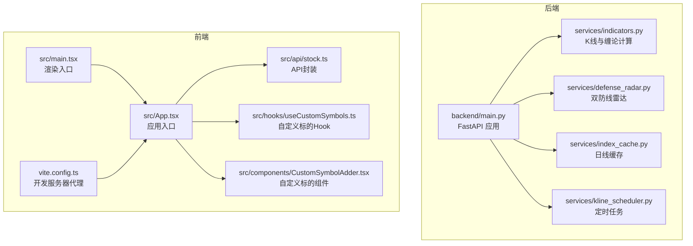
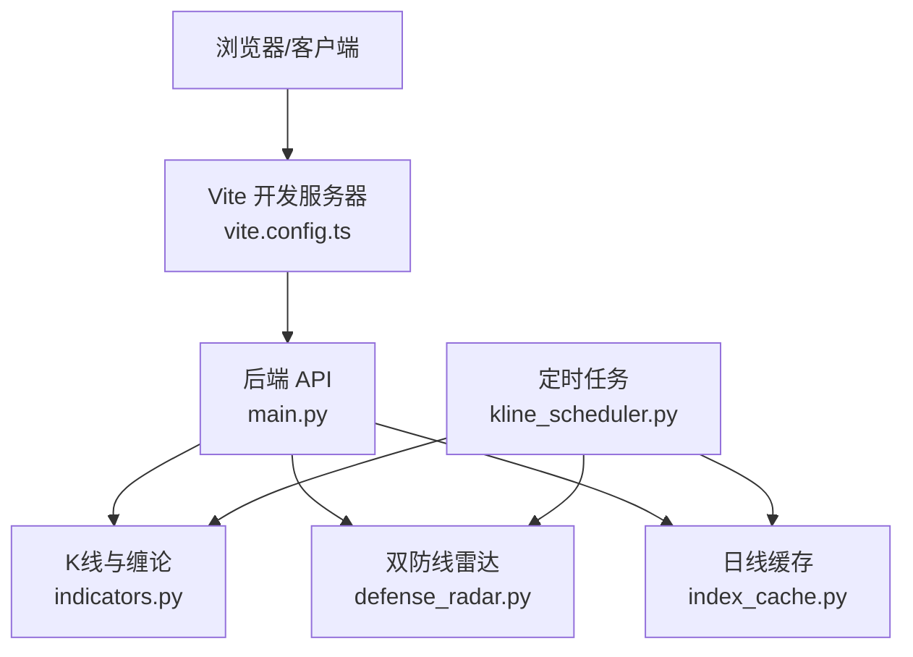
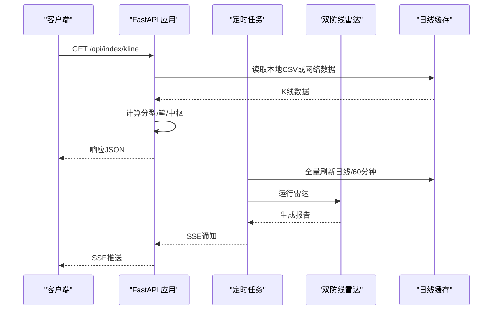
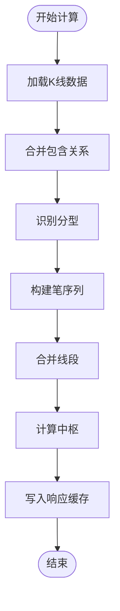
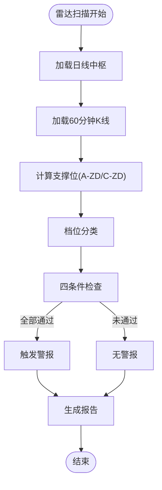
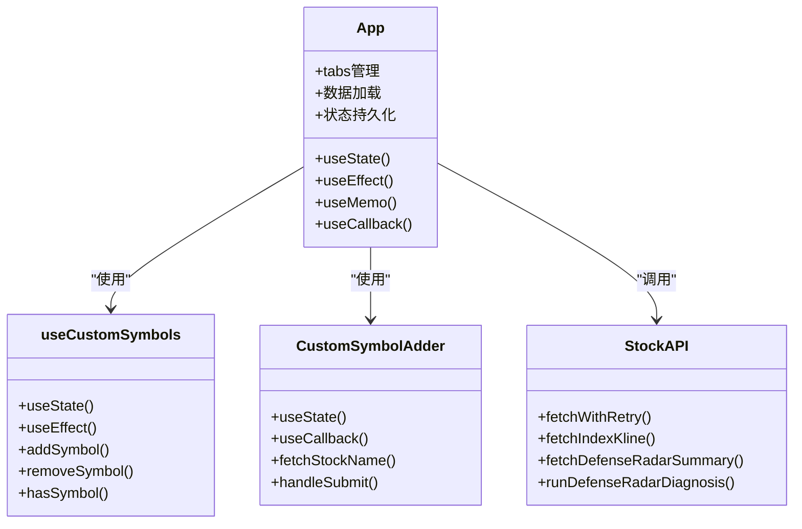
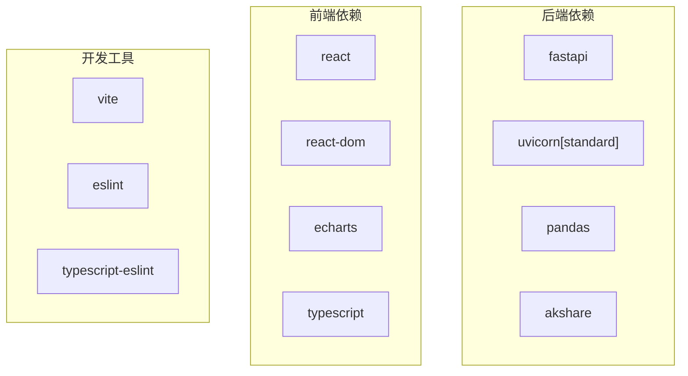

# 代码规范与最佳实践

<cite>
**本文档引用的文件**
- [README.md](file://README.md)
- [package.json](file://frontend/package.json)
- [eslint.config.js](file://frontend/eslint.config.js)
- [vite.config.ts](file://frontend/vite.config.ts)
- [tsconfig.json](file://frontend/tsconfig.json)
- [main.tsx](file://frontend/src/main.tsx)
- [App.tsx](file://frontend/src/App.tsx)
- [stock.ts](file://frontend/src/api/stock.ts)
- [useCustomSymbols.ts](file://frontend/src/hooks/useCustomSymbols.ts)
- [CustomSymbolAdder.tsx](file://frontend/src/components/CustomSymbolAdder.tsx)
- [main.py](file://backend/main.py)
- [indicators.py](file://backend/services/indicators.py)
- [defense_radar.py](file://backend/services/defense_radar.py)
- [index_cache.py](file://backend/services/index_cache.py)
- [kline_scheduler.py](file://backend/services/kline_scheduler.py)
</cite>

## 目录
1. [简介](#简介)
2. [项目结构](#项目结构)
3. [核心组件](#核心组件)
4. [架构概览](#架构概览)
5. [详细组件分析](#详细组件分析)
6. [依赖分析](#依赖分析)
7. [性能考虑](#性能考虑)
8. [故障排查指南](#故障排查指南)
9. [结论](#结论)
10. [附录](#附录)

## 简介
本项目是一个本地优先的 A 股/ETF/指数可视化与双防线雷达系统，采用前后端分离架构：
- 后端：Python 3.9+ + FastAPI + uvicorn，负责 K 线缓存、缠论计算、定时同步与雷达
- 前端：React + TypeScript + Vite + ECharts，负责日 K/60 分钟图、双防线简讯与 Tab 显隐策略
- 数据：后端 data/ 目录下的日线 CSV、kline_60_*.csv；logs/defense_radar/ 下的雷达 md/json

## 项目结构
项目采用前后端分离的目录组织方式，核心文件分布如下：
- 后端核心：backend/main.py（路由与生命周期）、backend/services/（业务服务模块）
- 前端核心：frontend/src/（应用源码）、frontend/vite.config.ts（开发服务器代理配置）
- 文档与工具：README.md（项目说明）、restart_services.sh（一键启动脚本）

**图表来源**
- [main.py:1-514](file://backend/main.py#L1-L514)
- [indicators.py:1-800](file://backend/services/indicators.py#L1-L800)
- [defense_radar.py:1-800](file://backend/services/defense_radar.py#L1-L800)
- [index_cache.py:1-201](file://backend/services/index_cache.py#L1-L201)
- [kline_scheduler.py:1-492](file://backend/services/kline_scheduler.py#L1-L492)
- [App.tsx:1-800](file://frontend/src/App.tsx#L1-L800)
- [stock.ts:1-468](file://frontend/src/api/stock.ts#L1-L468)
- [useCustomSymbols.ts:1-77](file://frontend/src/hooks/useCustomSymbols.ts#L1-L77)
- [CustomSymbolAdder.tsx:1-192](file://frontend/src/components/CustomSymbolAdder.tsx#L1-L192)
- [main.tsx:1-11](file://frontend/src/main.tsx#L1-L11)
- [vite.config.ts:1-22](file://frontend/vite.config.ts#L1-L22)

**章节来源**
- [README.md:1-269](file://README.md#L1-L269)

## 核心组件
- 后端 FastAPI 应用：提供股票指标查询、K线数据、双防线雷达、SSE 实时推送等接口，支持 CORS 允许任意来源
- K线与缠论计算：实现日线/60分钟/15分钟 K 线的合并包含关系、分型、笔、线段、有效笔与中枢计算，支持进程内响应缓存与本地文件 mtime 失效
- 双防线雷达：扫描监控列表，计算 A-ZD/C-ZD 与现价关系，生成预警信息与 Markdown 报告
- 日线缓存：严格本地优先策略，统一使用新浪接口拉取并落盘，支持强制刷新
- 定时任务：基于 Asia/Shanghai 时区的独立线程定时同步，包含 10:31/11:31/14:01/15:01 的 60 分钟全量刷新与 16:01 的日线+60分钟全量刷新
- 前端应用：React + TypeScript，提供日 K/60分钟图、双防线简讯、Tab 显隐策略与自定义标的管理

**章节来源**
- [main.py:1-514](file://backend/main.py#L1-L514)
- [indicators.py:1-800](file://backend/services/indicators.py#L1-L800)
- [defense_radar.py:1-800](file://backend/services/defense_radar.py#L1-L800)
- [index_cache.py:1-201](file://backend/services/index_cache.py#L1-L201)
- [kline_scheduler.py:1-492](file://backend/services/kline_scheduler.py#L1-L492)
- [App.tsx:1-800](file://frontend/src/App.tsx#L1-L800)
- [stock.ts:1-468](file://frontend/src/api/stock.ts#L1-L468)

## 架构概览
系统采用前后端分离架构，后端通过 FastAPI 提供 RESTful API，前端通过 Vite 开发服务器代理到后端。定时任务在后端独立线程中运行，负责数据同步与雷达计算。

**图表来源**
- [vite.config.ts:1-22](file://frontend/vite.config.ts#L1-L22)
- [main.py:1-514](file://backend/main.py#L1-L514)
- [kline_scheduler.py:1-492](file://backend/services/kline_scheduler.py#L1-L492)
- [indicators.py:1-800](file://backend/services/indicators.py#L1-L800)
- [defense_radar.py:1-800](file://backend/services/defense_radar.py#L1-L800)
- [index_cache.py:1-201](file://backend/services/index_cache.py#L1-L201)

## 详细组件分析

### 后端 API 设计与错误处理
- 生命周期管理：使用 FastAPI lifespan 在启动时设置 SSE 回调与定时任务，在关闭时清理资源
- CORS 配置：允许任意来源，便于本地开发
- 错误处理：对 ValueError 抛出 400，其他异常抛出 500，并记录详细日志
- SSE 实时推送：支持雷达更新与止损告警的实时推送

**图表来源**
- [main.py:1-514](file://backend/main.py#L1-L514)
- [kline_scheduler.py:1-492](file://backend/services/kline_scheduler.py#L1-L492)
- [defense_radar.py:1-800](file://backend/services/defense_radar.py#L1-L800)
- [index_cache.py:1-201](file://backend/services/index_cache.py#L1-L201)

**章节来源**
- [main.py:1-514](file://backend/main.py#L1-L514)

### K线计算与缠论算法
- 合并包含关系：处理 K 线包含关系，得到标准化 K 线序列
- 分型识别：基于标准化 K 线识别顶分型与底分型
- 笔与线段：从分型序列构建笔，再合并得到线段
- 中枢计算：连续三段线段形成的中枢区间，按时间排序取至多3段
- 响应缓存：基于 (symbol, period, start_date, end_date) 的键，支持 mtime 失效与 TTL 控制

**图表来源**
- [indicators.py:781-800](file://backend/services/indicators.py#L781-L800)

**章节来源**
- [indicators.py:1-800](file://backend/services/indicators.py#L1-L800)

### 双防线雷达实现
- 扫描范围：与前端 CHART_TABS 一致，排除上证指数与 889999 mock
- 价位口径：A-ZD/C-ZD 由日线中枢按时间排序后首末段下沿，现价 P 为 60 分钟 K 线最后一根收盘价
- 分类逻辑：基于 MIN(C-ZD, A-ZD) 与现价关系进行档位分类
- 四条件扳机：伏击带 ±1%、末笔有效笔向下、MACD 转强、蓝三角确认
- 产物生成：Markdown 报告与 last_summary.json

**图表来源**
- [defense_radar.py:196-226](file://backend/services/defense_radar.py#L196-L226)
- [defense_radar.py:600-744](file://backend/services/defense_radar.py#L600-L744)

**章节来源**
- [defense_radar.py:1-800](file://backend/services/defense_radar.py#L1-L800)

### 前端组件架构与 Hook 规范
- 应用入口：StrictMode 包裹，使用 createRoot 渲染 App
- 组件设计：函数组件 + Hooks 模式，状态管理集中在 App.tsx 中
- 自定义 Hook：useCustomSymbols 管理自定义标的的本地存储与增删操作
- API 封装：stock.ts 提供统一的 fetchWithRetry 与各接口方法
- 组件职责：CustomSymbolAdder 负责自定义标的的添加与名称自动获取

**图表来源**
- [App.tsx:1-800](file://frontend/src/App.tsx#L1-L800)
- [useCustomSymbols.ts:1-77](file://frontend/src/hooks/useCustomSymbols.ts#L1-L77)
- [CustomSymbolAdder.tsx:1-192](file://frontend/src/components/CustomSymbolAdder.tsx#L1-L192)
- [stock.ts:1-468](file://frontend/src/api/stock.ts#L1-L468)

**章节来源**
- [main.tsx:1-11](file://frontend/src/main.tsx#L1-L11)
- [App.tsx:1-800](file://frontend/src/App.tsx#L1-L800)
- [useCustomSymbols.ts:1-77](file://frontend/src/hooks/useCustomSymbols.ts#L1-L77)
- [CustomSymbolAdder.tsx:1-192](file://frontend/src/components/CustomSymbolAdder.tsx#L1-L192)
- [stock.ts:1-468](file://frontend/src/api/stock.ts#L1-L468)

### ESLint 与 TypeScript 配置
- ESLint 配置：基于 flat config，集成 @eslint/js、typescript-eslint、eslint-plugin-react-hooks、eslint-plugin-react-refresh
- TypeScript 配置：使用 tsconfig.json 的引用配置，分别指向 tsconfig.app.json 和 tsconfig.node.json
- Vite 代理：开发服务器代理 /api 到后端 8000 端口，支持 WebSocket

**章节来源**
- [package.json:1-33](file://frontend/package.json#L1-L33)
- [eslint.config.js:1-24](file://frontend/eslint.config.js#L1-L24)
- [tsconfig.json:1-8](file://frontend/tsconfig.json#L1-L8)
- [vite.config.ts:1-22](file://frontend/vite.config.ts#L1-L22)

## 依赖分析
后端依赖主要包含 FastAPI、uvicorn、pandas、akshare 等，前端依赖 React、ECharts、TypeScript 等。依赖关系清晰，模块化程度高。

**图表来源**
- [requirements.txt:1-5](file://backend/requirements.txt#L1-L5)
- [package.json:1-33](file://frontend/package.json#L1-L33)

**章节来源**
- [requirements.txt:1-5](file://backend/requirements.txt#L1-L5)
- [package.json:1-33](file://frontend/package.json#L1-L33)

## 性能考虑
- 响应缓存：后端实现基于键的响应缓存，支持 mtime 失效与 TTL 控制，避免重复计算
- 本地优先：日线缓存严格本地优先，仅在 force_refresh 或本地不存在时访问网络
- 定时同步：独立线程定时同步，减少对实时请求的影响
- 前端优化：使用 useMemo/useCallback 优化渲染，localStorage 持久化用户偏好

## 故障排查指南
常见问题与解决方法：
- 摘要 404：后端未重启或旧进程无新路由
- 有警报的 Tab 不显示：摘要请求失败或后端未写 last_summary.json
- 60m 报错「本地缓存不存在」：未跑过定时任务或从未对该 symbol refresh=true
- 中枢长时间不变：本地 CSV 未更新或仅命中 TTL 内缓存（港股日线）

**章节来源**
- [README.md:255-269](file://README.md#L255-L269)

## 结论
本项目在架构设计上实现了前后端分离与模块化，后端通过 FastAPI 提供稳定的 API 服务，前端采用 React + TypeScript 构建交互式可视化界面。通过严格的本地缓存策略与定时任务，系统能够高效地处理 K 线数据与双防线雷达计算。建议在后续开发中进一步完善代码规范与自动化流程，提升代码质量与可维护性。

## 附录
- 快速启动：cd backend && pip install -r requirements.txt && cd ../frontend && npm install && ./restart_services.sh
- 后端端口：8000，前端端口：5173
- API 文档：http://127.0.0.1:8000/docs

**章节来源**
- [README.md:17-30](file://README.md#L17-L30)