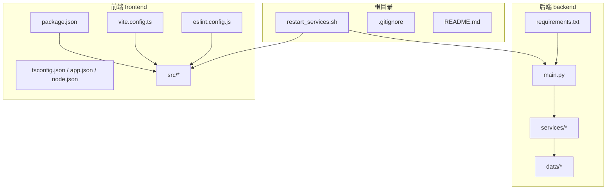
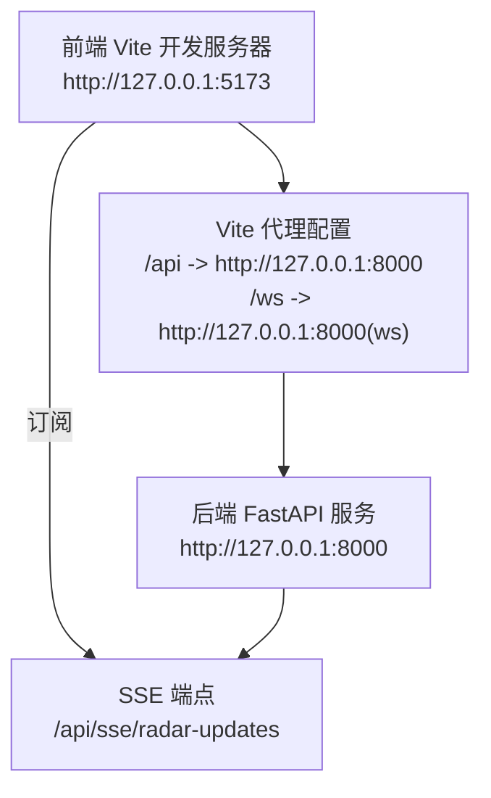
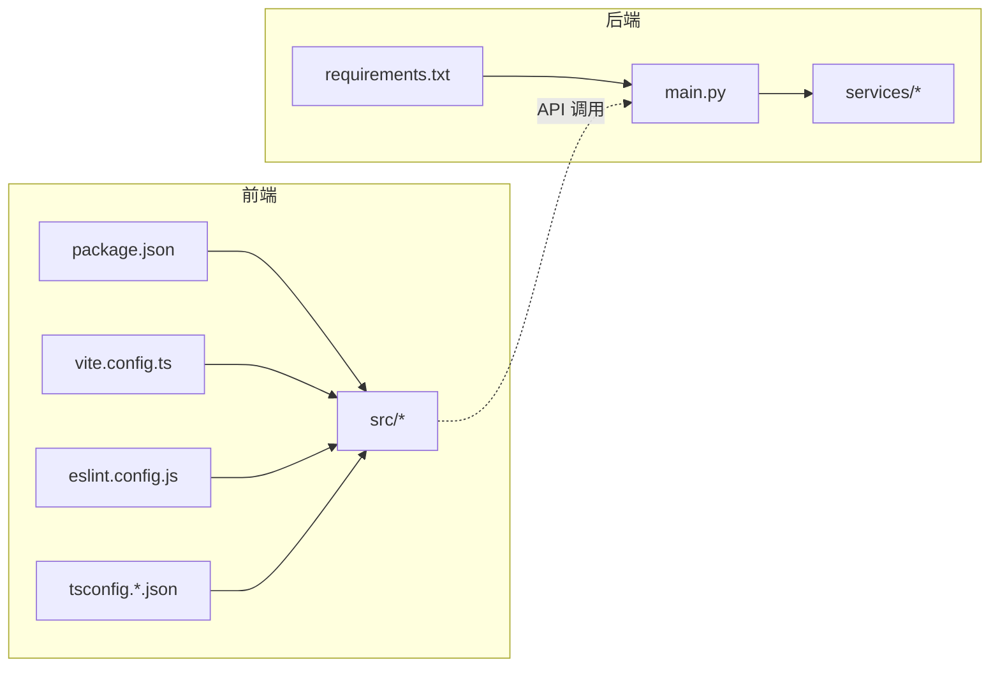

# 开发环境搭建

<cite>
**本文引用的文件**
- [README.md](file://README.md)
- [restart_services.sh](file://restart_services.sh)
- [.gitignore](file://.gitignore)
- [backend/requirements.txt](file://backend/requirements.txt)
- [backend/main.py](file://backend/main.py)
- [frontend/package.json](file://frontend/package.json)
- [frontend/vite.config.ts](file://frontend/vite.config.ts)
- [frontend/eslint.config.js](file://frontend/eslint.config.js)
- [frontend/tsconfig.json](file://frontend/tsconfig.json)
- [frontend/tsconfig.app.json](file://frontend/tsconfig.app.json)
- [frontend/tsconfig.node.json](file://frontend/tsconfig.node.json)
- [frontend/src/api/stock.ts](file://frontend/src/api/stock.ts)
</cite>

## 目录
1. [简介](#简介)
2. [项目结构](#项目结构)
3. [核心组件](#核心组件)
4. [架构总览](#架构总览)
5. [详细组件分析](#详细组件分析)
6. [依赖分析](#依赖分析)
7. [性能考虑](#性能考虑)
8. [故障排除指南](#故障排除指南)
9. [结论](#结论)
10. [附录](#附录)

## 简介
本指南面向开发者，提供完整的本地开发环境搭建流程，覆盖后端 Python 与前端 Node.js 生态，包括：
- Python 版本要求、虚拟环境创建、依赖安装与 IDE 配置
- Node.js 前端环境设置、npm/yarn 包管理、TypeScript 编译与 Vite 开发服务器
- 项目依赖管理：后端 requirements.txt 与前端 package.json 的使用
- 开发工具推荐：VS Code 配置、ESLint 规则、Prettier 格式化、Git 钩子
- 数据库与外部服务的本地配置方法
- 常见环境问题的解决方案与故障排除步骤

## 项目结构
项目采用前后端分离架构，根目录提供一键启动脚本，分别启动后端（FastAPI）与前端（React/Vite）服务。后端负责 K 线缓存、缠论计算、定时同步与雷达；前端负责日 K/60 分钟图、双防线简讯与 Tab 显隐策略。

**图表来源**
- [restart_services.sh:1-126](file://restart_services.sh#L1-L126)
- [backend/requirements.txt:1-5](file://backend/requirements.txt#L1-L5)
- [backend/main.py:1-514](file://backend/main.py#L1-L514)
- [frontend/package.json:1-33](file://frontend/package.json#L1-L33)
- [frontend/vite.config.ts:1-22](file://frontend/vite.config.ts#L1-L22)
- [frontend/eslint.config.js:1-24](file://frontend/eslint.config.js#L1-L24)
- [frontend/tsconfig.json:1-8](file://frontend/tsconfig.json#L1-L8)

**章节来源**
- [README.md:17-31](file://README.md#L17-L31)
- [restart_services.sh:10-126](file://restart_services.sh#L10-L126)
- [.gitignore:1-28](file://.gitignore#L1-L28)

## 核心组件
- 后端服务：基于 FastAPI，提供指标查询、K 线与缠论计算、双防线雷达摘要与诊断、SSE 实时推送、定时任务与健康检查等接口。
- 前端应用：基于 React + TypeScript + Vite，使用 ECharts 展示日 K/60 分钟图，实现雷达摘要驱动的 Tab 显隐策略与实时订阅。
- 依赖管理：后端使用 requirements.txt；前端使用 package.json，包含开发与生产依赖。
- 开发脚本：restart_services.sh 提供一键启动后端与前端服务，并进行端口清理与健康检查。

**章节来源**
- [backend/main.py:94-252](file://backend/main.py#L94-L252)
- [frontend/src/api/stock.ts:114-303](file://frontend/src/api/stock.ts#L114-L303)
- [frontend/package.json:6-11](file://frontend/package.json#L6-L11)
- [backend/requirements.txt:1-5](file://backend/requirements.txt#L1-L5)
- [restart_services.sh:77-125](file://restart_services.sh#L77-L125)

## 架构总览
后端与前端通过本地代理通信，前端通过 Vite 代理将 /api 与 /ws 请求转发至后端。后端提供 SSE 端点用于实时推送雷达更新。

**图表来源**
- [frontend/vite.config.ts:7-20](file://frontend/vite.config.ts#L7-L20)
- [frontend/src/api/stock.ts:449-466](file://frontend/src/api/stock.ts#L449-L466)
- [backend/main.py:213-252](file://backend/main.py#L213-L252)

## 详细组件分析

### Python 后端开发环境
- Python 版本要求
  - 技术栈文档明确后端使用 Python 3.9+。
- 虚拟环境
  - 建议使用 venv 创建隔离环境，避免全局污染。
- 依赖安装
  - 使用 requirements.txt 安装后端依赖。
- IDE 配置
  - VS Code 推荐扩展：Python、Pylance、Black/Formatting（可选）、flake8/Pyright（可选）。
  - 建议启用 Python 解释器选择与 linting。
- 启动方式
  - 使用 restart_services.sh 一键启动后端与前端，或单独启动后端（uvicorn/gunicorn）。
  - 后端健康检查端点为根路径，API 文档端点为 /docs。

**章节来源**
- [README.md:11](file://README.md#L11)
- [backend/requirements.txt:1-5](file://backend/requirements.txt#L1-L5)
- [restart_services.sh:82](file://restart_services.sh#L82)
- [backend/main.py:208-210](file://backend/main.py#L208-L210)

### Node.js 前端开发环境
- Node.js 与包管理
  - 使用 npm（package.json 中定义了 scripts）；yarn 可选但非必需。
- TypeScript 编译配置
  - 采用复合项目配置：tsconfig.json 引用 tsconfig.app.json 与 tsconfig.node.json。
  - app 配置启用严格模式与 bundler 模式；node 配置针对 Vite 配置文件。
- Vite 开发服务器
  - 通过 vite.config.ts 配置 React 插件与本地代理，将 /api 与 /ws 转发至后端。
  - 前端默认端口为 5173，可在脚本中指定 host/port。
- ESLint 与 Prettier
  - ESLint 使用 flat 配置，集成 TypeScript、React Hooks、React Refresh。
  - Prettier 可通过 VS Code 插件与 ESLint 配合使用（本仓库未提供单独的 .prettierrc）。

**章节来源**
- [frontend/package.json:6-11](file://frontend/package.json#L6-L11)
- [frontend/tsconfig.json:1-8](file://frontend/tsconfig.json#L1-L8)
- [frontend/tsconfig.app.json:1-29](file://frontend/tsconfig.app.json#L1-L29)
- [frontend/tsconfig.node.json:1-27](file://frontend/tsconfig.node.json#L1-L27)
- [frontend/vite.config.ts:1-22](file://frontend/vite.config.ts#L1-L22)
- [frontend/eslint.config.js:1-24](file://frontend/eslint.config.js#L1-L24)

### 项目依赖管理
- 后端 requirements.txt
  - 包含 fastapi、uvicorn[standard]、pandas、akshare 等核心依赖。
- 前端 package.json
  - scripts 定义 dev/build/lint/preview；dependencies 与 devDependencies 分离。
- 本地数据与日志
  - .gitignore 排除了 .venv、node_modules、dist、logs/*.log 等，确保本地构建产物与日志不提交。

**章节来源**
- [backend/requirements.txt:1-5](file://backend/requirements.txt#L1-L5)
- [frontend/package.json:12-31](file://frontend/package.json#L12-L31)
- [.gitignore:11-17](file://.gitignore#L11-L17)

### 开发工具推荐
- VS Code
  - Python：Python、Pylance、(可选) Black/Formatting、(可选) flake8/Pyright
  - 前端：ESLint、(可选) Prettier、TypeScript TSServer
- Git 钩子
  - 仓库提供 .githooks 目录，建议在本地安装并启用 pre-commit 钩子以在提交前自动执行 lint 与格式化。
- 代理与网络
  - restart_services.sh 设置了 HTTP/HTTPS 代理变量，便于国内网络环境访问依赖源。

**章节来源**
- [.gitignore:1-28](file://.gitignore#L1-L28)
- [restart_services.sh:26-30](file://restart_services.sh#L26-L30)

### 数据库与外部服务的本地配置
- 后端数据文件
  - 后端使用本地 CSV 文件作为 K 线缓存，路径位于 backend/data/ 下的日线与 60 分钟 CSV。
- 外部服务
  - 后端使用 akshare 与新浪接口进行数据拉取与缓存；首次启动需要网络访问以生成本地 CSV。
- 前端 API 基础地址
  - 前端通过 API_BASE_URL 指向后端 127.0.0.1:8000，无需额外数据库。

**章节来源**
- [README.md:105-114](file://README.md#L105-L114)
- [frontend/src/api/stock.ts:114-115](file://frontend/src/api/stock.ts#L114-L115)

## 依赖分析
后端与前端的依赖关系如下：

**图表来源**
- [backend/requirements.txt:1-5](file://backend/requirements.txt#L1-L5)
- [backend/main.py:14-19](file://backend/main.py#L14-L19)
- [frontend/package.json:12-31](file://frontend/package.json#L12-L31)
- [frontend/vite.config.ts:1-22](file://frontend/vite.config.ts#L1-L22)
- [frontend/eslint.config.js:1-24](file://frontend/eslint.config.js#L1-L24)
- [frontend/tsconfig.json:1-8](file://frontend/tsconfig.json#L1-L8)

**章节来源**
- [backend/requirements.txt:1-5](file://backend/requirements.txt#L1-L5)
- [frontend/package.json:12-31](file://frontend/package.json#L12-L31)

## 性能考虑
- 后端响应缓存与本地文件失效
  - 后端对 K 线与指标计算采用进程内响应缓存，并依据本地 CSV 的 mtime 进行失效判断，减少重复计算。
- 前端懒加载与缓存
  - 前端仅在切换到具体 Tab 时按需加载数据，避免一次性请求过多数据。
- 代理与 SSE
  - Vite 代理减少跨域与额外中间层；SSE 用于实时推送，降低轮询成本。

**章节来源**
- [README.md:101-108](file://README.md#L101-L108)
- [frontend/src/api/stock.ts:185-215](file://frontend/src/api/stock.ts#L185-L215)
- [backend/main.py:213-252](file://backend/main.py#L213-L252)

## 故障排除指南
- 后端未重启或旧进程无新路由
  - 现象：摘要 404 或路由缺失。
  - 处理：使用 restart_services.sh 重启后端，确保新路由生效。
- 有警报的 Tab 不显示
  - 现象：摘要请求失败或未写入 last_summary.json。
  - 处理：确认后端已生成摘要文件；前端使用 no-store 策略请求摘要。
- 60m 报错“本地缓存不存在”
  - 现象：未跑过定时任务或从未对该 symbol refresh=true。
  - 处理：先执行 refresh=true 预热，或等待定时任务写盘。
- 中枢长时间不变
  - 现象：本地 CSV 未更新或仅命中 TTL 内缓存（港股日线）。
  - 处理：触发 refresh=true 或等待定时任务更新。

**章节来源**
- [README.md:255-263](file://README.md#L255-L263)
- [restart_services.sh:56-75](file://restart_services.sh#L56-L75)

## 结论
本指南提供了从零开始搭建该金融分析项目开发环境的完整路径，涵盖后端 Python 与前端 Node.js 的配置、依赖管理、开发工具与常见问题排查。按照本指南操作，即可快速启动本地开发环境并进行功能迭代与调试。

## 附录

### 快速启动步骤
- 后端
  - 进入 backend 目录，安装依赖并启动服务。
- 前端
  - 进入 frontend 目录，安装依赖并启动开发服务器。
- 一键启动
  - 在项目根目录执行 restart_services.sh，同时启动后端与前端，并进行健康检查。

**章节来源**
- [README.md:17-24](file://README.md#L17-L24)
- [restart_services.sh:77-125](file://restart_services.sh#L77-L125)