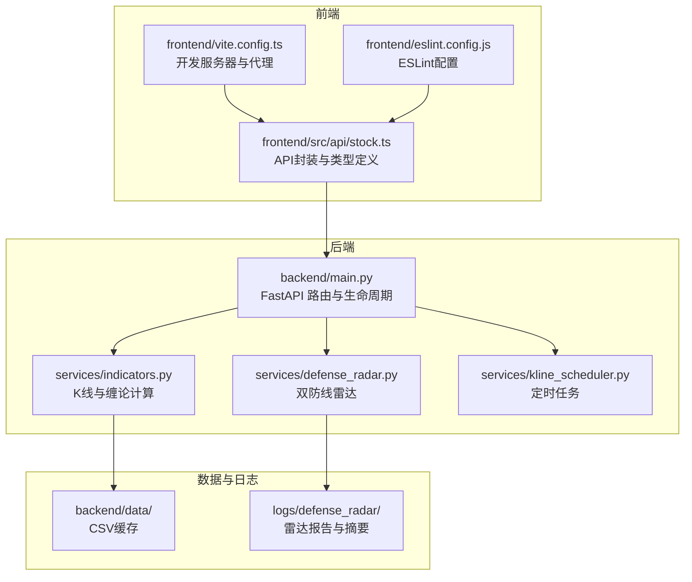
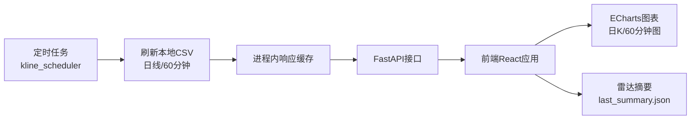
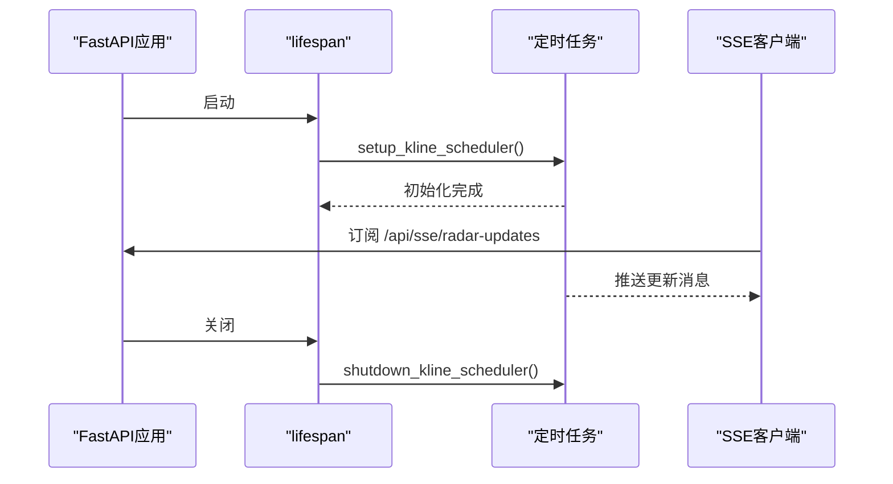
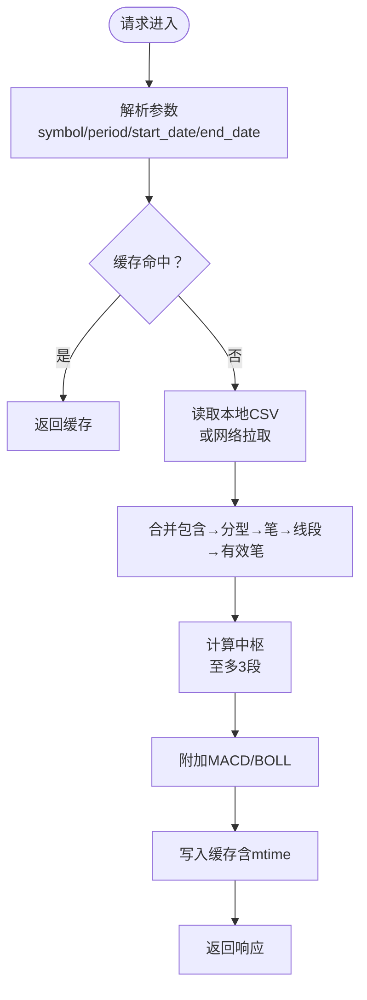
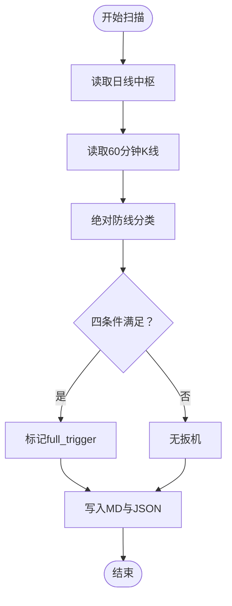
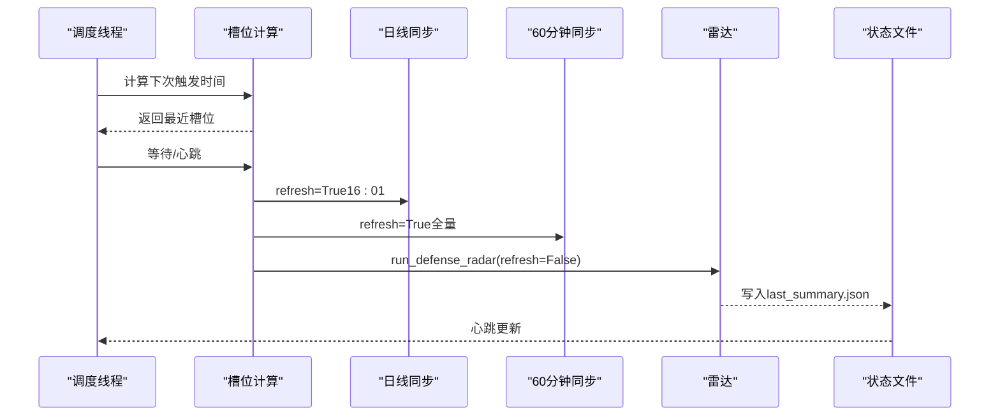
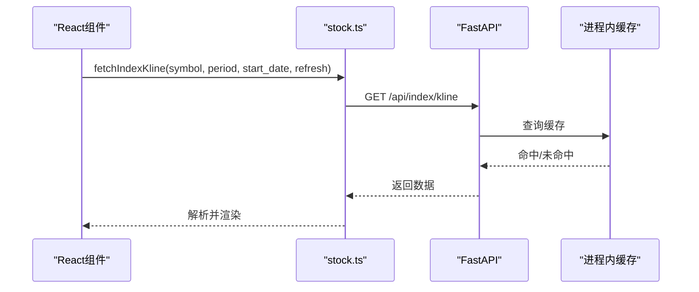
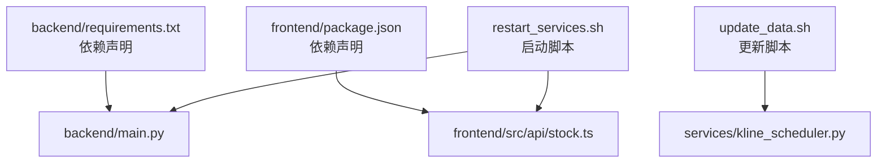

# 开发者指南

<cite>
**本文档引用的文件**
- [README.md](file://README.md)
- [backend/main.py](file://backend/main.py)
- [backend/services/indicators.py](file://backend/services/indicators.py)
- [backend/services/defense_radar.py](file://backend/services/defense_radar.py)
- [backend/services/kline_scheduler.py](file://backend/services/kline_scheduler.py)
- [frontend/src/api/stock.ts](file://frontend/src/api/stock.ts)
- [frontend/vite.config.ts](file://frontend/vite.config.ts)
- [frontend/eslint.config.js](file://frontend/eslint.config.js)
- [frontend/package.json](file://frontend/package.json)
- [restart_services.sh](file://restart_services.sh)
- [update_data.sh](file://update_data.sh)
</cite>

## 目录
1. [简介](#简介)
2. [项目结构](#项目结构)
3. [核心组件](#核心组件)
4. [架构概览](#架构概览)
5. [详细组件分析](#详细组件分析)
6. [依赖关系分析](#依赖关系分析)
7. [性能考虑](#性能考虑)
8. [故障排查指南](#故障排查指南)
9. [结论](#结论)
10. [附录](#附录)

## 简介
本项目是一个本地优先的 A 股/ETF/指数可视化与“双防线雷达”系统，后端基于 FastAPI 提供 K 线与技术指标接口，前端基于 React + TypeScript + Vite 展示日 K/60 分钟图、缠论字段与雷达摘要。系统采用进程内响应缓存与本地 CSV 文件驱动的数据流，配合定时任务在后台自动刷新数据并生成雷达报告。

## 项目结构
- 后端（Python 3.9+，FastAPI，uvicorn，pandas，akshare）
  - 路由与生命周期：backend/main.py
  - 核心服务：backend/services/*
  - 数据与脚本：backend/data/、backend/scripts/
  - 测试：backend/tests/
- 前端（React，TypeScript，Vite，ECharts）
  - API 封装：frontend/src/api/stock.ts
  - 组件与图表：frontend/src/components/、frontend/src/DailyChanChart.tsx、frontend/src/HourlyChanChart.tsx
  - 构建与代理：frontend/vite.config.ts、frontend/eslint.config.js
- 运维脚本
  - 一键重启：restart_services.sh
  - 手动更新 60 分钟数据：update_data.sh

**图表来源**
- [backend/main.py:1-514](file://backend/main.py#L1-L514)
- [backend/services/indicators.py:1-800](file://backend/services/indicators.py#L1-L800)
- [backend/services/defense_radar.py:1-800](file://backend/services/defense_radar.py#L1-L800)
- [backend/services/kline_scheduler.py:1-492](file://backend/services/kline_scheduler.py#L1-L492)
- [frontend/src/api/stock.ts:1-468](file://frontend/src/api/stock.ts#L1-L468)
- [frontend/vite.config.ts:1-22](file://frontend/vite.config.ts#L1-L22)
- [frontend/eslint.config.js:1-24](file://frontend/eslint.config.js#L1-L24)

**章节来源**
- [README.md:17-31](file://README.md#L17-L31)
- [README.md:216-244](file://README.md#L216-L244)

## 核心组件
- FastAPI 应用与生命周期
  - 使用 lifespan 管理定时任务的启动与关闭
  - CORS 允许任意来源（本地开发）
  - SSE 端点用于推送雷达更新与止损告警
- K 线与缠论计算
  - 响应缓存 + 本地 CSV mtime 失效机制
  - 支持 daily/60/15 周期，附带 MACD/BOLL
- 双防线雷达
  - 基于日线中枢与 60 分钟现价的“绝对防线”逻辑
  - 产出 Markdown 报告与 last_summary.json
- 定时任务
  - 北京时间槽位：10:31/11:31/14:01/15:01 全量 60m + 雷达；16:01 全量日线 + 60m + 雷达
  - 多 worker 去重与心跳监控

**章节来源**
- [backend/main.py:80-92](file://backend/main.py#L80-L92)
- [backend/main.py:109-252](file://backend/main.py#L109-L252)
- [backend/services/indicators.py:88-174](file://backend/services/indicators.py#L88-L174)
- [backend/services/defense_radar.py:147-166](file://backend/services/defense_radar.py#L147-L166)
- [backend/services/kline_scheduler.py:40-46](file://backend/services/kline_scheduler.py#L40-L46)

## 架构概览
系统采用“本地优先”的数据流：定时任务在后台刷新本地 CSV，前端通过 API 获取 K 线与雷达摘要，后端在进程内缓存响应并按 mtime 失效。

**图表来源**
- [backend/services/kline_scheduler.py:131-160](file://backend/services/kline_scheduler.py#L131-L160)
- [backend/services/indicators.py:149-174](file://backend/services/indicators.py#L149-L174)
- [backend/main.py:140-168](file://backend/main.py#L140-L168)
- [frontend/src/api/stock.ts:185-215](file://frontend/src/api/stock.ts#L185-L215)

## 详细组件分析

### 后端路由与生命周期（FastAPI）
- 生命周期钩子：启动时初始化 SSE 回调与定时任务，关闭时优雅停机
- 跨域：允许任意来源
- SSE 端点：/api/sse/radar-updates，推送雷达更新与止损告警
- 健康检查：/ 返回运行状态

**图表来源**
- [backend/main.py:80-92](file://backend/main.py#L80-L92)
- [backend/main.py:213-252](file://backend/main.py#L213-L252)
- [backend/services/kline_scheduler.py:448-492](file://backend/services/kline_scheduler.py#L448-L492)

**章节来源**
- [backend/main.py:80-92](file://backend/main.py#L80-L92)
- [backend/main.py:109-252](file://backend/main.py#L109-L252)

### K 线与缠论计算（indicators）
- 缓存策略
  - 键：(symbol, period, start_date, end_date)
  - TTL：默认 300 秒
  - mtime 失效：若本地 CSV 的 mtime 新于缓存记录则丢弃并重算
- 数据源
  - 日线：新浪 scale=240；严格本地优先
  - 60 分钟：新浪 60m；本地 CSV 优先
  - 15 分钟：新浪 15m；本地 CSV 优先
- 计算步骤
  - 合并包含关系 → 分型 → 笔 → 线段 → 有效笔
  - 中枢：按时间排序取至多 3 段，前端按时间排序标为 A/B/C
  - 附带 MACD、BOLL(20,2)

**图表来源**
- [backend/services/indicators.py:149-174](file://backend/services/indicators.py#L149-L174)
- [backend/services/indicators.py:359-444](file://backend/services/indicators.py#L359-L444)
- [backend/services/indicators.py:697-778](file://backend/services/indicators.py#L697-L778)

**章节来源**
- [backend/services/indicators.py:88-174](file://backend/services/indicators.py#L88-L174)
- [backend/services/indicators.py:359-444](file://backend/services/indicators.py#L359-L444)
- [backend/services/indicators.py:697-778](file://backend/services/indicators.py#L697-L778)

### 双防线雷达（defense_radar）
- 扫描范围：与前端 CHART_TABS 一致（不含上证指数）
- 数据口径
  - A-ZD/C-ZD：日线中枢（按时间排序后首/末段下沿）
  - 现价 P：60 分钟 K 线最后一根收盘
- 分类逻辑：基于 MIN(C-ZD, A-ZD) 与现价的“绝对防线”区间
- 四条件扳机（full_trigger）：伏击带±1%、末笔有效笔向下、MACD 转强、严格蓝三角确认
- 输出：logs/defense_radar/defense_radar_*.md 与 last_summary.json

**图表来源**
- [backend/services/defense_radar.py:147-166](file://backend/services/defense_radar.py#L147-L166)
- [backend/services/defense_radar.py:196-226](file://backend/services/defense_radar.py#L196-L226)
- [backend/services/defense_radar.py:719-744](file://backend/services/defense_radar.py#L719-L744)

**章节来源**
- [backend/services/defense_radar.py:147-166](file://backend/services/defense_radar.py#L147-L166)
- [backend/services/defense_radar.py:196-226](file://backend/services/defense_radar.py#L196-L226)
- [backend/services/defense_radar.py:719-744](file://backend/services/defense_radar.py#L719-L744)

### 定时任务（kline_scheduler）
- 槽位
  - 10:31/11:31/14:01/15:01：全量 60m + 雷达
  - 16:01：全量日线 + 60m + 雷达
- 同步策略
  - 日线：_daily_start_date() 覆盖约 380 天
  - 60 分钟：_h60_start_date() 覆盖约 80 天
  - 15 分钟：_h15_start_date() 覆盖约 30 天
- 多 worker 去重：文件锁确保单实例运行
- 心跳监控：状态写入 /tmp/kline_scheduler_status.json

**图表来源**
- [backend/services/kline_scheduler.py:258-284](file://backend/services/kline_scheduler.py#L258-L284)
- [backend/services/kline_scheduler.py:211-256](file://backend/services/kline_scheduler.py#L211-L256)
- [backend/services/kline_scheduler.py:448-492](file://backend/services/kline_scheduler.py#L448-L492)

**章节来源**
- [backend/services/kline_scheduler.py:258-284](file://backend/services/kline_scheduler.py#L258-L284)
- [backend/services/kline_scheduler.py:211-256](file://backend/services/kline_scheduler.py#L211-L256)
- [backend/services/kline_scheduler.py:448-492](file://backend/services/kline_scheduler.py#L448-L492)

### 前端 API 封装与类型定义（stock.ts）
- API 基础地址：http://127.0.0.1:8000
- 类型定义：IndexKlineResponse、DefenseRadarSummaryItem 等
- 重试机制：fetchWithRetry，降低瞬时网络抖动影响
- 代理配置：vite.config.ts 将 /api 与 /ws 代理到后端

**图表来源**
- [frontend/src/api/stock.ts:185-215](file://frontend/src/api/stock.ts#L185-L215)
- [frontend/vite.config.ts:8-19](file://frontend/vite.config.ts#L8-L19)

**章节来源**
- [frontend/src/api/stock.ts:185-215](file://frontend/src/api/stock.ts#L185-L215)
- [frontend/vite.config.ts:8-19](file://frontend/vite.config.ts#L8-L19)

## 依赖关系分析
- 后端依赖
  - FastAPI、uvicorn、pandas、akshare
  - 本地 CSV 缓存与 mtime 失效
- 前端依赖
  - React、TypeScript、Vite、ECharts、echarts-for-react
  - ESLint 与 TypeScript ESlint 插件
- 运维脚本
  - restart_services.sh：一键启动后端（gunicorn + uvicorn）与前端（Vite）
  - update_data.sh：手动触发 60 分钟数据同步与雷达摘要

**图表来源**
- [backend/requirements.txt:1-5](file://backend/requirements.txt#L1-L5)
- [frontend/package.json:12-31](file://frontend/package.json#L12-L31)
- [restart_services.sh:82-87](file://restart_services.sh#L82-L87)
- [update_data.sh:11-46](file://update_data.sh#L11-L46)

**章节来源**
- [backend/requirements.txt:1-5](file://backend/requirements.txt#L1-L5)
- [frontend/package.json:12-31](file://frontend/package.json#L12-L31)
- [restart_services.sh:82-87](file://restart_services.sh#L82-L87)
- [update_data.sh:11-46](file://update_data.sh#L11-L46)

## 性能考虑
- 进程内响应缓存：减少重复计算与网络请求
- 本地 CSV 优先：降低对外部接口依赖
- mtime 失效：确保缓存与数据一致性
- SSE 推送：前端无需轮询即可接收更新
- 15 分钟独立同步：高频数据的增量更新

[本节为通用性能讨论，无需列出具体文件来源]

## 故障排查指南
常见问题与解决思路：
- 摘要 404：后端未重启或旧进程无新路由
- 有警报的 Tab 不显示：摘要请求失败或未生成 last_summary.json
- 60m 报错“本地缓存不存在”：未跑过定时任务或从未对该 symbol refresh=true
- 中枢长时间不变：本地 CSV 未更新或仅命中 TTL 内缓存（港股日线）

**章节来源**
- [README.md:255-263](file://README.md#L255-L263)

## 结论
本项目通过本地优先的数据流与定时任务，实现了稳定高效的 K 线与雷达服务。后端采用 FastAPI + 进程内缓存，前端基于 React + Vite，整体架构清晰、易于扩展与维护。

[本节为总结性内容，无需列出具体文件来源]

## 附录

### 开发环境搭建
- 后端
  - 安装依赖：pip install -r backend/requirements.txt
  - 启动：cd backend && python -m uvicorn main:app --reload
- 前端
  - 安装依赖：npm install
  - 启动：npm run dev
- 一键重启
  - ./restart_services.sh

**章节来源**
- [README.md:17-31](file://README.md#L17-L31)
- [restart_services.sh:1-126](file://restart_services.sh#L1-126)

### 代码规范与最佳实践
- Python
  - 使用类型注解与数据类
  - 异常捕获与日志记录
  - 缓存键与 TTL 设计
- TypeScript
  - 严格的类型定义
  - API 封装与重试机制
  - ESLint 配置与全局规则
- React
  - 组件职责分离
  - 状态管理与副作用处理
  - 图表组件与数据绑定

**章节来源**
- [backend/services/indicators.py:1-50](file://backend/services/indicators.py#L1-L50)
- [frontend/src/api/stock.ts:19-41](file://frontend/src/api/stock.ts#L19-L41)
- [frontend/eslint.config.js:8-23](file://frontend/eslint.config.js#L8-L23)

### 测试策略
- 单元测试：针对核心算法（缠论、MACD、BOLL）与雷达条件
- 集成测试：API 端到端验证（/api/index/kline、/api/diagnosis/defense-radar/summary）
- 端到端测试：浏览器自动化（可选）

[本节为通用测试策略说明，无需列出具体文件来源]

### Git 工作流程与分支管理
- 分支策略：主分支保护，特性分支开发，发布分支管理版本
- 提交规范：语义化提交信息，关联 Issue
- 代码审查：PR 审查，CI 检查（ESLint、Python Lint）

[本节为通用流程说明，无需列出具体文件来源]

### 调试技巧与工具
- 后端
  - 日志：INFO 级别确保调度等关键信息可见
  - SSE：/api/sse/radar-updates 实时查看雷达更新
  - 缓存：检查 _KLINE_RESP_CACHE 与本地 CSV mtime
- 前端
  - 控制台：网络面板查看 API 请求与响应
  - 图表：ECharts 开发者工具查看数据与样式

**章节来源**
- [backend/main.py:72-77](file://backend/main.py#L72-L77)
- [backend/main.py:213-252](file://backend/main.py#L213-L252)
- [backend/services/indicators.py:149-174](file://backend/services/indicators.py#L149-L174)

### 扩展开发指导
- 新增后端接口
  - 在 backend/main.py 添加路由与异常处理
  - 在 services/ 下实现业务逻辑
- 修改现有模块
  - 保持类型定义与 API 返回结构一致
  - 更新前端类型与调用方式
- 第三方集成
  - 通过 requirements.txt 管理 Python 依赖
  - 通过 package.json 管理前端依赖

**章节来源**
- [backend/main.py:109-252](file://backend/main.py#L109-L252)
- [frontend/package.json:12-31](file://frontend/package.json#L12-L31)

### 代码重构与性能优化建议
- 缓存优化：合理设置 TTL 与失效策略
- 算法优化：减少重复计算，利用向量化操作
- 并发与异步：充分利用 asyncio 与线程池
- 前端性能：懒加载组件，减少不必要的重渲染

[本节为通用优化建议，无需列出具体文件来源]

### 文档维护与更新流程
- README.md：项目概述、快速启动、接口说明
- 日志：logs/defense_radar/ 下的报告与摘要
- 版本管理：遵循语义化版本与变更日志

**章节来源**
- [README.md:1-269](file://README.md#L1-L269)