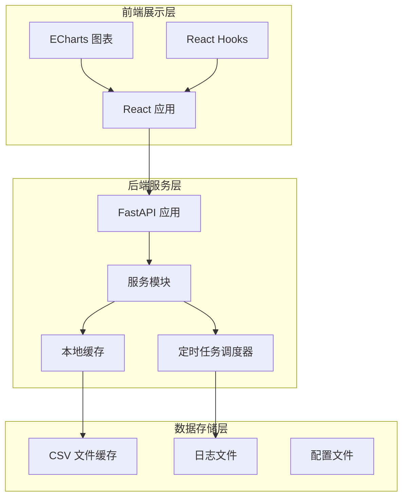
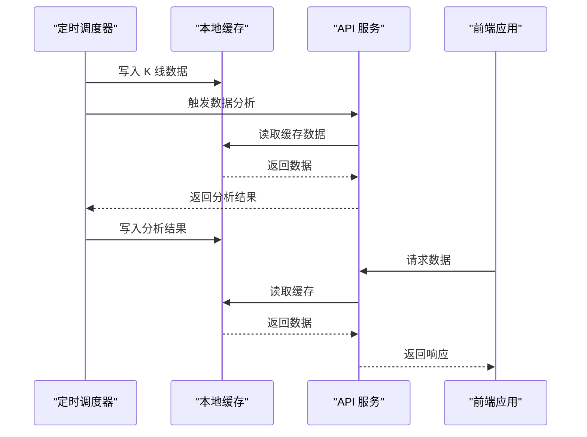
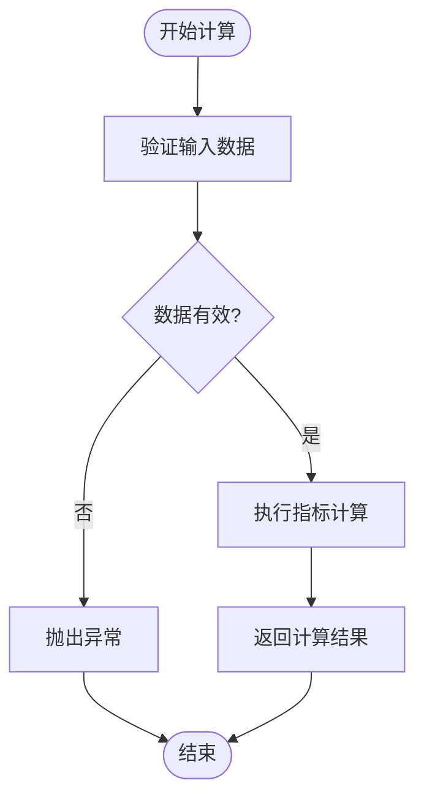
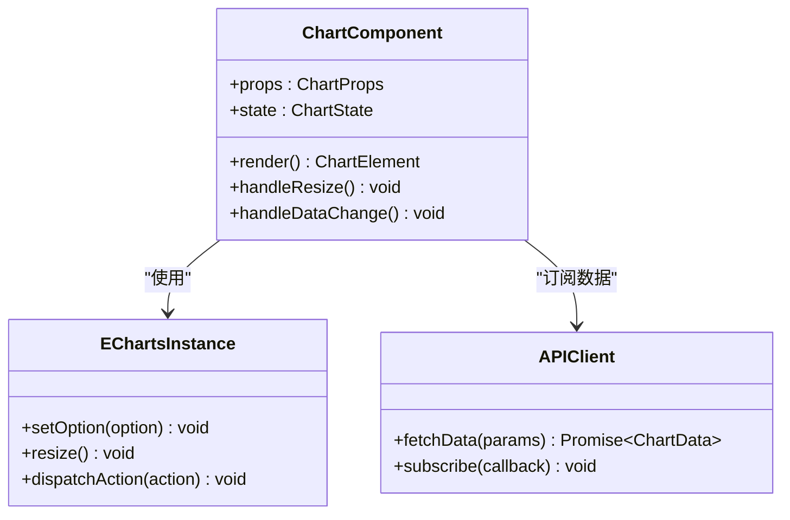
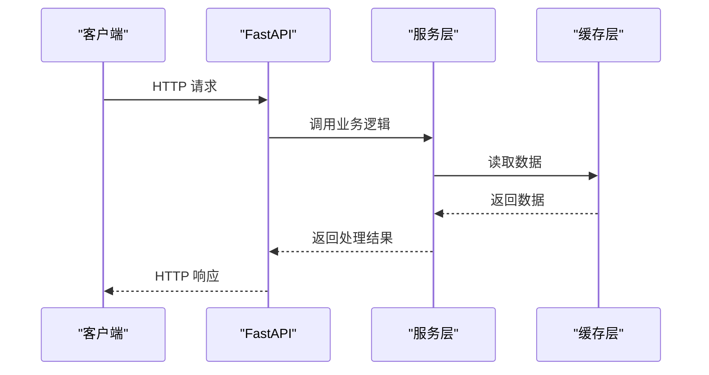
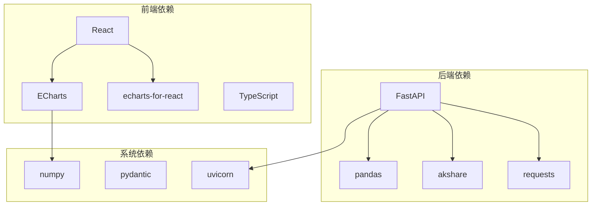

# 扩展开发指南

<cite>
**本文档引用的文件**
- [backend/main.py](file://backend/main.py)
- [backend/services/indicators.py](file://backend/services/indicators.py)
- [backend/services/index_cache.py](file://backend/services/index_cache.py)
- [backend/services/kline_scheduler.py](file://backend/services/kline_scheduler.py)
- [backend/services/defense_radar.py](file://backend/services/defense_radar.py)
- [frontend/src/App.tsx](file://frontend/src/App.tsx)
- [frontend/src/DailyChanChart.tsx](file://frontend/src/DailyChanChart.tsx)
- [frontend/src/api/stock.ts](file://frontend/src/api/stock.ts)
- [frontend/vite.config.ts](file://frontend/vite.config.ts)
- [backend/requirements.txt](file://backend/requirements.txt)
- [frontend/package.json](file://frontend/package.json)
- [README.md](file://README.md)
</cite>

## 目录
1. [简介](#简介)
2. [项目结构](#项目结构)
3. [核心组件](#核心组件)
4. [架构概览](#架构概览)
5. [详细组件分析](#详细组件分析)
6. [依赖关系分析](#依赖关系分析)
7. [性能考虑](#性能考虑)
8. [故障排查指南](#故障排查指南)
9. [结论](#结论)
10. [附录](#附录)

## 简介

本指南面向需要扩展金融分析系统的开发者，提供从技术指标计算模块到图表组件、服务模块以及第三方数据源集成的完整开发指导。系统采用前后端分离架构，后端基于 FastAPI 提供 RESTful API，前端使用 React + ECharts 实现可视化展示。项目强调本地优先的数据缓存策略、定时任务驱动的实时同步机制，以及可插拔的扩展设计。

## 项目结构

项目采用清晰的分层架构，主要分为后端服务层、前端展示层和数据存储层：

**图表来源**
- [backend/main.py:94-211](file://backend/main.py#L94-L211)
- [frontend/src/App.tsx:598-750](file://frontend/src/App.tsx#L598-L750)

**章节来源**
- [README.md:216-244](file://README.md#L216-L244)

## 核心组件

### 后端核心组件

系统的核心组件包括：

1. **FastAPI 应用** - 提供 RESTful API 接口
2. **指标计算服务** - 实现技术指标算法
3. **K线缓存服务** - 管理本地 CSV 缓存
4. **定时任务调度器** - 驱动数据同步和分析
5. **防御雷达服务** - 实现双防线分析逻辑

### 前端核心组件

1. **应用主组件** - 管理全局状态和路由
2. **图表组件** - 基于 ECharts 的可视化展示
3. **API 客户端** - 封装后端接口调用
4. **数据钩子** - 管理异步数据加载

**章节来源**
- [backend/main.py:110-211](file://backend/main.py#L110-L211)
- [frontend/src/App.tsx:1-100](file://frontend/src/App.tsx#L1-L100)

## 架构概览

系统采用事件驱动的定时任务架构，配合本地缓存实现高效的数据访问：

**图表来源**
- [backend/services/kline_scheduler.py:211-256](file://backend/services/kline_scheduler.py#L211-L256)
- [backend/services/indicators.py:149-174](file://backend/services/indicators.py#L149-L174)

**章节来源**
- [README.md:33-64](file://README.md#L33-L64)

## 详细组件分析

### 技术指标计算模块扩展

#### 指标算法实现

新增技术指标的实现遵循以下模式：

1. **算法函数定义** - 在 `indicators.py` 中添加新的计算函数
2. **数据验证** - 确保输入数据格式正确
3. **性能优化** - 使用向量化操作提高计算效率

**图表来源**
- [backend/services/indicators.py:657-672](file://backend/services/indicators.py#L657-L672)

#### 数据接口适配

新增指标需要适配现有数据接口：

1. **API 端点扩展** - 在 `main.py` 中添加新的路由
2. **参数验证** - 实现输入参数的验证逻辑
3. **错误处理** - 统一的异常处理机制

**章节来源**
- [backend/services/indicators.py:657-672](file://backend/services/indicators.py#L657-L672)
- [backend/main.py:110-137](file://backend/main.py#L110-L137)

### 图表组件开发

#### ECharts 集成

新增图表组件需要遵循以下步骤：

1. **组件创建** - 创建新的 React 组件
2. **数据绑定** - 实现与后端 API 的数据绑定
3. **交互功能** - 添加用户交互功能

**图表来源**
- [frontend/src/DailyChanChart.tsx:412-734](file://frontend/src/DailyChanChart.tsx#L412-L734)
- [frontend/src/api/stock.ts:185-215](file://frontend/src/api/stock.ts#L185-L215)

#### 数据绑定实现

图表组件的数据绑定遵循以下模式：

1. **数据获取** - 通过 API 客户端获取数据
2. **数据转换** - 将后端数据转换为图表所需格式
3. **状态管理** - 使用 React 状态管理数据变化

**章节来源**
- [frontend/src/DailyChanChart.tsx:161-406](file://frontend/src/DailyChanChart.tsx#L161-L406)
- [frontend/src/api/stock.ts:185-215](file://frontend/src/api/stock.ts#L185-L215)

### 服务模块开发

#### API 端点创建

新增服务模块的开发流程：

1. **服务实现** - 在 `services/` 目录下创建新的服务文件
2. **路由注册** - 在 `main.py` 中注册新的 API 端点
3. **业务逻辑封装** - 实现具体的业务逻辑
4. **错误处理** - 实现完善的错误处理机制

**图表来源**
- [backend/main.py:110-137](file://backend/main.py#L110-L137)
- [backend/services/indicators.py:149-174](file://backend/services/indicators.py#L149-L174)

#### 业务逻辑封装

服务模块的业务逻辑封装需要考虑：

1. **单一职责原则** - 每个服务负责特定的业务领域
2. **依赖注入** - 明确的服务依赖关系
3. **异常处理** - 统一的错误处理策略

**章节来源**
- [backend/main.py:110-211](file://backend/main.py#L110-L211)
- [backend/services/kline_scheduler.py:448-492](file://backend/services/kline_scheduler.py#L448-L492)

### 第三方数据源集成

#### API 接入

集成第三方数据源需要遵循以下步骤：

1. **数据源配置** - 配置 API 访问凭据
2. **数据获取** - 实现数据拉取逻辑
3. **数据转换** - 将第三方数据转换为内部格式
4. **缓存策略** - 实现数据缓存机制

**图表来源**
- [backend/services/index_cache.py:97-124](file://backend/services/index_cache.py#L97-L124)

#### 数据转换

数据转换需要考虑：

1. **字段映射** - 将第三方字段映射到内部字段
2. **数据验证** - 验证数据的完整性和准确性
3. **格式统一** - 统一数据格式和时间戳

**章节来源**
- [backend/services/index_cache.py:61-94](file://backend/services/index_cache.py#L61-L94)

### 配置扩展和自定义功能

#### 配置管理

系统提供了灵活的配置扩展机制：

1. **环境变量** - 通过环境变量控制行为
2. **配置文件** - 支持 JSON/YAML 配置文件
3. **运行时配置** - 支持动态配置更新

#### 自定义功能开发

自定义功能的开发需要：

1. **插件接口定义** - 定义插件的标准接口
2. **插件注册机制** - 实现插件的自动发现和注册
3. **配置解析** - 解析用户自定义配置

**章节来源**
- [backend/services/indicators.py:31-87](file://backend/services/indicators.py#L31-L87)

## 依赖关系分析

系统各组件之间的依赖关系如下：

**图表来源**
- [backend/requirements.txt:1-5](file://backend/requirements.txt#L1-L5)
- [frontend/package.json:12-16](file://frontend/package.json#L12-L16)

**章节来源**
- [backend/requirements.txt:1-5](file://backend/requirements.txt#L1-L5)
- [frontend/package.json:12-16](file://frontend/package.json#L12-L16)

## 性能考虑

### 缓存策略

系统实现了多层次的缓存策略：

1. **进程内缓存** - 响应级别的内存缓存
2. **文件缓存** - 本地 CSV 文件缓存
3. **TTL 控制** - 缓存过期时间控制

### 性能优化

1. **向量化计算** - 使用 pandas 进行向量化操作
2. **数据预加载** - 定时任务预加载数据
3. **增量更新** - 仅更新变化的数据

## 故障排查指南

### 常见问题

1. **API 端点 404** - 检查后端是否重启
2. **数据缓存失效** - 检查文件权限和路径
3. **定时任务异常** - 查看日志文件

### 调试技巧

1. **日志分析** - 查看 `logs/` 目录下的日志文件
2. **状态检查** - 使用 `/api/scheduler/status` 检查调度器状态
3. **数据验证** - 验证 CSV 文件的完整性和格式

**章节来源**
- [README.md:255-263](file://README.md#L255-L263)

## 结论

本扩展开发指南提供了从技术指标计算到图表组件、服务模块以及第三方数据源集成的完整开发指导。系统采用的本地优先缓存策略、定时任务驱动的实时同步机制，以及可插拔的扩展设计，为金融分析系统的扩展开发提供了坚实的基础。开发者可以按照本文档的指导，安全地扩展系统功能，同时保持系统的稳定性和性能。

## 附录

### 开发最佳实践

1. **代码规范** - 遵循 Python 和 TypeScript 的代码规范
2. **测试覆盖** - 为新增功能编写单元测试和集成测试
3. **文档更新** - 及时更新相关的技术文档
4. **版本管理** - 使用 Git 进行版本控制和变更管理

### 部署建议

1. **环境隔离** - 开发、测试、生产环境分离
2. **监控告警** - 配置系统监控和告警机制
3. **备份策略** - 定期备份关键数据和配置
4. **滚动更新** - 采用滚动更新策略减少停机时间