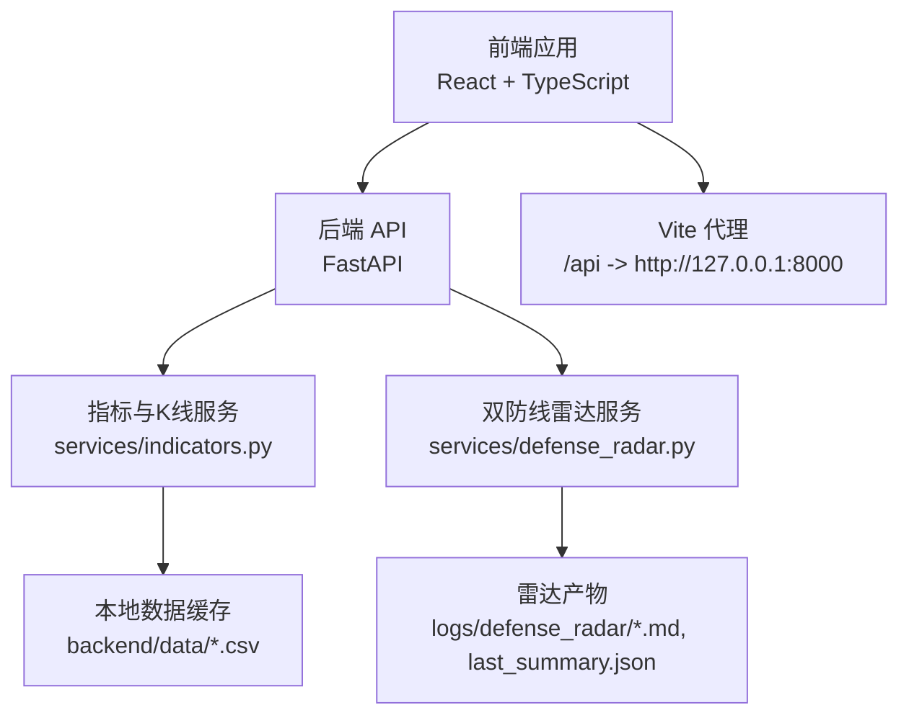
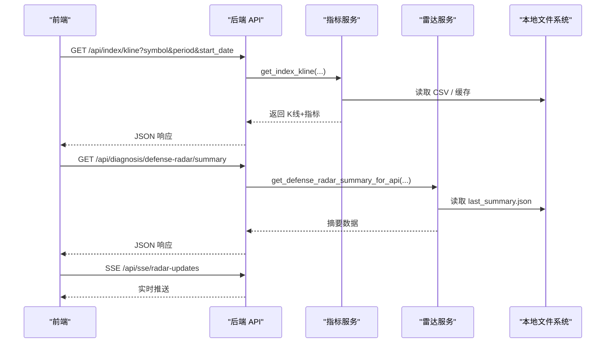
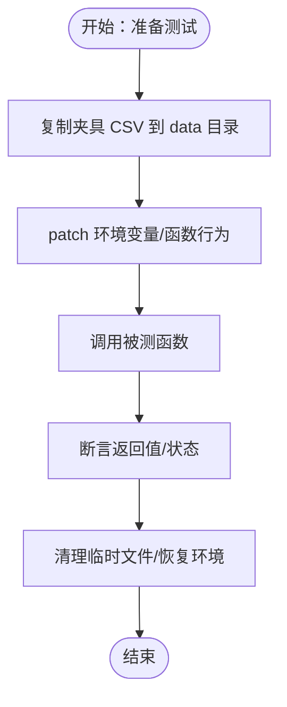
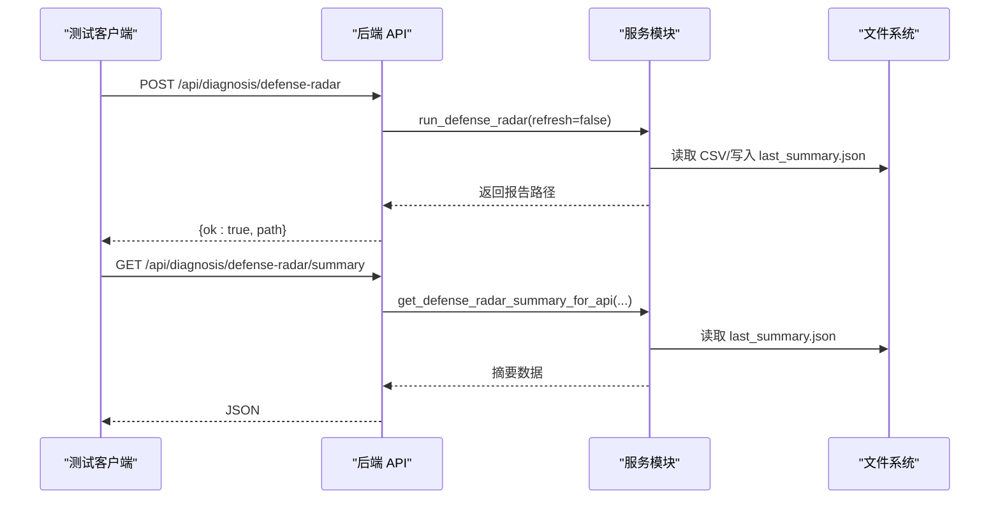
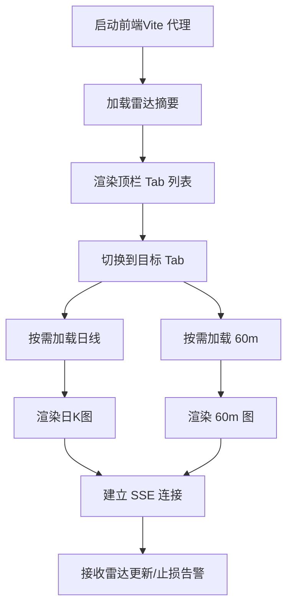
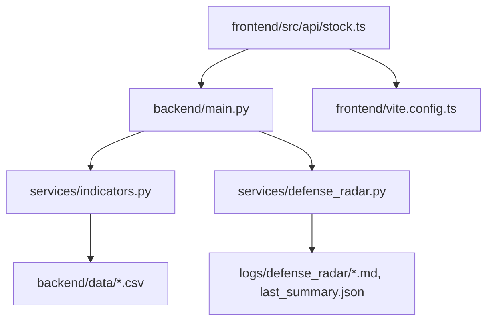

# 测试策略与实践

<cite>
**本文引用的文件**
- [backend/tests/test_defense_radar_trigger.py](file://backend/tests/test_defense_radar_trigger.py)
- [backend/tests/__init__.py](file://backend/tests/__init__.py)
- [backend/main.py](file://backend/main.py)
- [backend/services/defense_radar.py](file://backend/services/defense_radar.py)
- [backend/services/indicators.py](file://backend/services/indicators.py)
- [backend/scripts/build_meihua2test_fixture.py](file://backend/scripts/build_meihua2test_fixture.py)
- [backend/requirements.txt](file://backend/requirements.txt)
- [frontend/src/api/stock.ts](file://frontend/src/api/stock.ts)
- [frontend/vite.config.ts](file://frontend/vite.config.ts)
- [frontend/package.json](file://frontend/package.json)
- [README.md](file://README.md)
</cite>

## 目录
1. [简介](#简介)
2. [项目结构](#项目结构)
3. [核心组件](#核心组件)
4. [架构总览](#架构总览)
5. [详细组件分析](#详细组件分析)
6. [依赖分析](#依赖分析)
7. [性能考虑](#性能考虑)
8. [故障排查指南](#故障排查指南)
9. [结论](#结论)
10. [附录](#附录)

## 简介
本文件面向金融分析项目，系统化建立“测试策略与实践”体系，覆盖单元测试、集成测试、端到端测试、测试数据管理、覆盖率与质量门禁、自动化与持续集成、性能与压力测试等维度。结合现有代码库，明确各层测试边界与落地方法，帮助团队在快速迭代中保持高质量交付。

## 项目结构
项目采用前后端分离架构，后端基于 FastAPI 提供指标查询、K线与雷达摘要等接口；前端基于 React + TypeScript，通过代理访问后端 API。测试覆盖后端服务与前端组件，重点围绕 K线计算、缠论指标、雷达触发条件与前端数据流。

**图示来源**
- [backend/main.py:110-211](file://backend/main.py#L110-L211)
- [backend/services/indicators.py:31-87](file://backend/services/indicators.py#L31-L87)
- [backend/services/defense_radar.py:96-165](file://backend/services/defense_radar.py#L96-L165)
- [frontend/vite.config.ts:7-20](file://frontend/vite.config.ts#L7-L20)

**章节来源**
- [README.md:33-64](file://README.md#L33-L64)
- [backend/main.py:110-211](file://backend/main.py#L110-L211)
- [frontend/vite.config.ts:7-20](file://frontend/vite.config.ts#L7-L20)

## 核心组件
- 后端 API 层：提供指标查询、K线、雷达摘要、雷达诊断、持仓与观察列表等接口，统一异常处理与健康检查。
- 指标与K线服务：负责 K线数据读取、合并包含关系、分型、笔、线段、中枢、MACD/BOLL 等计算，并维护响应缓存与 mtime 失效策略。
- 雷达服务：基于日线中枢与60分钟K线现价，判断防线档位、笔向、MACD 动能、严格底分型等条件，生成摘要与 Markdown 报告。
- 前端 API 封装：封装 fetch 请求、重试机制、SSE 连接、参数校验与错误处理。
- 测试夹具与数据：通过脚本生成“梅花2test（889999）”夹具，模拟未来 K 线，支撑单元测试与回归验证。

**章节来源**
- [backend/main.py:110-211](file://backend/main.py#L110-L211)
- [backend/services/indicators.py:31-87](file://backend/services/indicators.py#L31-L87)
- [backend/services/defense_radar.py:1-165](file://backend/services/defense_radar.py#L1-L165)
- [frontend/src/api/stock.ts:117-130](file://frontend/src/api/stock.ts#L117-L130)

## 架构总览
后端通过定时任务在本地 CSV 上进行 K线与雷达计算，前端通过 API 获取指标与摘要，SSE 实时推送雷达更新。测试策略围绕以下闭环展开：本地数据驱动、Mock 与夹具、接口契约验证、前端数据流校验。

**图示来源**
- [backend/main.py:110-211](file://backend/main.py#L110-L211)
- [backend/services/indicators.py:93-118](file://backend/services/indicators.py#L93-L118)
- [backend/services/defense_radar.py:147-165](file://backend/services/defense_radar.py#L147-L165)

## 详细组件分析

### 单元测试设计与实现（pytest）
- 测试框架与组织
  - 使用 Python 标准库 unittest 与 pytest（通过 requirements 体现）进行单元测试组织与执行。
  - 测试包入口文件存在，便于 pytest 自动发现。
- Mock 与夹具
  - 使用 unittest.mock.patch 与 patch.dict 替换环境变量与函数行为，隔离外部依赖。
  - 使用临时目录与 CSV 文件模拟真实数据，避免污染测试环境。
- 测试数据准备
  - 通过脚本生成“梅花2test（889999）”夹具，复制实盘基座并追加未来 K 线，确保测试具备可重现的输入。
  - 夹具安装到 tests/fixtures 与 backend/data，测试中按需复制到运行目录。
- 关键测试场景
  - 图表末端底分型判定、严格蓝三角三K形态、MACD 动能变化、价格区间判定、环境变量对扩展时间的影响等。
- 断言与边界
  - 对布尔条件、数值范围、时间戳边界进行断言，覆盖正例与反例。
  - 对缺失数据与环境缺失场景进行 skip 或异常捕获。

**图示来源**
- [backend/tests/test_defense_radar_trigger.py:114-134](file://backend/tests/test_defense_radar_trigger.py#L114-L134)
- [backend/scripts/build_meihua2test_fixture.py:117-152](file://backend/scripts/build_meihua2test_fixture.py#L117-L152)

**章节来源**
- [backend/tests/test_defense_radar_trigger.py:27-250](file://backend/tests/test_defense_radar_trigger.py#L27-L250)
- [backend/tests/__init__.py:1-2](file://backend/tests/__init__.py#L1-L2)
- [backend/scripts/build_meihua2test_fixture.py:1-157](file://backend/scripts/build_meihua2test_fixture.py#L1-L157)

### 集成测试策略（API 端点、服务模块、数据流）
- API 端点测试
  - 覆盖指标查询、历史指标、指数 K线、雷达摘要、雷达诊断、SSE 实时推送、持仓与观察列表等端点。
  - 使用 FastAPI TestClient 或 requests 访问后端，断言状态码、响应结构与错误处理。
- 服务模块测试
  - 验证 K线计算与缓存失效逻辑（mtime 对比）、环境变量对扩展时间的影响、雷达摘要生成与 last_summary.json 写入。
- 数据流验证
  - 前端通过 fetchWithRetry 与 API 交互，SSE 连接实时接收雷达更新；集成测试需验证端到端链路一致性。

**图示来源**
- [backend/main.py:189-206](file://backend/main.py#L189-L206)
- [backend/main.py:171-181](file://backend/main.py#L171-L181)
- [backend/services/defense_radar.py:147-165](file://backend/services/defense_radar.py#L147-L165)

**章节来源**
- [backend/main.py:110-211](file://backend/main.py#L110-L211)
- [backend/services/defense_radar.py:147-165](file://backend/services/defense_radar.py#L147-L165)

### 端到端测试实施方案（前端组件与用户流程）
- 用户流程
  - 首屏加载：摘要、上证日线、上证 60m（refresh=false）。
  - 切换 Tab：按需加载目标品种的日线与 60m 数据。
  - 可见性变化：标签页可见时刷新 60m 与摘要。
  - SSE 实时更新：订阅雷达更新与止损告警。
- 前端组件测试
  - 使用代理将 /api 与 /ws 转发到后端，确保组件在真实网络环境下运行。
  - 对关键组件（日K图、60m图、雷达摘要）进行快照或结构断言，避免回归。
- 数据一致性
  - 前端与后端对“日线 C-ZD / A-ZD”、“60m 有效笔末笔方向”、“MACD 动能”等口径保持一致，避免 UI 与后端逻辑偏差。

**图示来源**
- [frontend/vite.config.ts:7-20](file://frontend/vite.config.ts#L7-L20)
- [frontend/src/api/stock.ts:448-466](file://frontend/src/api/stock.ts#L448-L466)
- [README.md:175-214](file://README.md#L175-L214)

**章节来源**
- [frontend/vite.config.ts:7-20](file://frontend/vite.config.ts#L7-L20)
- [frontend/src/api/stock.ts:117-130](file://frontend/src/api/stock.ts#L117-L130)
- [README.md:175-214](file://README.md#L175-L214)

### 测试数据管理（夹具、环境隔离、清理策略）
- 夹具文件创建
  - 使用脚本从实盘基座复制并追加未来交易时段的 K 线，生成“梅花2test（889999）”夹具，分别放置于 tests/fixtures 与 backend/data。
- 测试环境隔离
  - 使用临时目录与 patch.dict 控制环境变量，避免跨测试相互影响。
  - 对 CSV 路径进行 mock，确保测试仅读取预期数据。
- 数据清理策略
  - 测试结束后删除临时文件，恢复原始环境变量与路径 mock。
  - 对于 last_summary.json 与雷达产物，建议在测试前清空或重命名，避免残留影响后续测试。

**章节来源**
- [backend/scripts/build_meihua2test_fixture.py:117-152](file://backend/scripts/build_meihua2test_fixture.py#L117-L152)
- [backend/tests/test_defense_radar_trigger.py:114-134](file://backend/tests/test_defense_radar_trigger.py#L114-L134)

### 测试覆盖率与质量门禁
- 覆盖率要求
  - 建议后端服务模块（indicators.py、defense_radar.py）语句覆盖率不低于 80%，分支覆盖率不低于 60%。
  - 前端关键组件与 API 封装（stock.ts）语句覆盖率不低于 70%。
- 质量门禁
  - CI 中设置覆盖率阈值，低于阈值阻断合并。
  - 通过 pytest-html 生成测试报告，记录失败用例与堆栈。
  - 对关键路径（K线缓存、雷达摘要生成、SSE 推送）增加失败重试与超时保护。

**章节来源**
- [backend/requirements.txt:1-5](file://backend/requirements.txt#L1-L5)
- [frontend/package.json:6-11](file://frontend/package.json#L6-L11)

### 自动化测试流程与持续集成
- 自动化测试流程
  - 后端：pytest 发现并执行 tests 目录下的测试，使用夹具与 Mock 隔离外部依赖。
  - 前端：Vite 代理后端，jest 或 Cypress 进行组件与端到端测试。
- 持续集成配置
  - 建议在 CI 中执行：安装依赖、生成“梅花2test”夹具、运行后端与前端测试、上传覆盖率报告。
  - 对关键端点（/api/index/kline、/api/diagnosis/defense-radar/summary、/api/sse/radar-updates）进行冒烟测试。

**章节来源**
- [backend/tests/__init__.py:1-2](file://backend/tests/__init__.py#L1-L2)
- [frontend/vite.config.ts:7-20](file://frontend/vite.config.ts#L7-L20)

### 性能测试与压力测试
- 性能测试
  - 针对 K线计算与缓存（mtime 失效、响应缓存 TTL）进行基准测试，评估不同数据规模下的吞吐与延迟。
  - 对 SSE 推送进行并发压力测试，验证客户端队列与断线重连。
- 压力测试
  - 使用 locust 或 wrk 对 /api/index/kline 与 /api/diagnosis/defense-radar/summary 进行并发请求，观察后端 CPU、内存与磁盘 IO。
  - 对前端图表渲染进行帧率测试，确保在大数据量下交互流畅。

**章节来源**
- [backend/services/indicators.py:88-174](file://backend/services/indicators.py#L88-L174)
- [backend/main.py:28-71](file://backend/main.py#L28-L71)

## 依赖分析
后端依赖关系清晰：API 层依赖服务模块，服务模块依赖本地数据缓存；前端通过代理访问后端，SSE 实时推送。测试依赖主要体现在 Mock 与夹具，确保外部依赖可控。

**图示来源**
- [backend/main.py:110-211](file://backend/main.py#L110-L211)
- [backend/services/indicators.py:27-28](file://backend/services/indicators.py#L27-L28)
- [backend/services/defense_radar.py:96-98](file://backend/services/defense_radar.py#L96-L98)
- [frontend/src/api/stock.ts:115-116](file://frontend/src/api/stock.ts#L115-L116)
- [frontend/vite.config.ts:7-20](file://frontend/vite.config.ts#L7-L20)

**章节来源**
- [backend/main.py:110-211](file://backend/main.py#L110-L211)
- [backend/services/indicators.py:27-28](file://backend/services/indicators.py#L27-L28)
- [backend/services/defense_radar.py:96-98](file://backend/services/defense_radar.py#L96-L98)
- [frontend/src/api/stock.ts:115-116](file://frontend/src/api/stock.ts#L115-L116)
- [frontend/vite.config.ts:7-20](file://frontend/vite.config.ts#L7-L20)

## 性能考虑
- 响应缓存与 mtime 失效：通过缓存键与本地文件 mtime 对比，避免重复计算，提升并发能力。
- 环境变量控制扩展时间：对“梅花2test（889999）”的 end_ts 扩展，减少测试对当前时间的耦合。
- SSE 广播与客户端队列：异步队列与断线处理，保障实时推送稳定性。

**章节来源**
- [backend/services/indicators.py:88-174](file://backend/services/indicators.py#L88-L174)
- [backend/services/indicators.py:31-87](file://backend/services/indicators.py#L31-L87)
- [backend/main.py:28-71](file://backend/main.py#L28-L71)

## 故障排查指南
- 摘要 404 或路由未生效：确认后端已重启，新路由已加载。
- 有警报但 Tab 不显示：检查摘要请求是否成功，last_summary.json 是否生成。
- 60m 报错“本地缓存不存在”：确认定时任务已运行或曾以 refresh=true 预热。
- 中枢长时间不变：确认本地 CSV 已更新或仅处于 TTL 内缓存。

**章节来源**
- [README.md:255-263](file://README.md#L255-L263)

## 结论
通过“本地数据驱动 + Mock 与夹具 + 接口契约验证 + 前端数据流校验”的测试体系，可在不依赖线上数据的前提下稳定验证核心业务逻辑。建议持续完善覆盖率与质量门禁，结合性能与压力测试，确保系统在高并发与大数据量下的可靠性与可维护性。

## 附录
- 快速启动与测试执行
  - 后端：pip install -r backend/requirements.txt；pytest backend/tests
  - 前端：npm install；npm run dev（Vite 代理后端）
- 关键测试入口
  - 后端测试：backend/tests/test_defense_radar_trigger.py
  - 前端代理：frontend/vite.config.ts

**章节来源**
- [README.md:17-30](file://README.md#L17-L30)
- [backend/requirements.txt:1-5](file://backend/requirements.txt#L1-L5)
- [frontend/package.json:6-11](file://frontend/package.json#L6-L11)