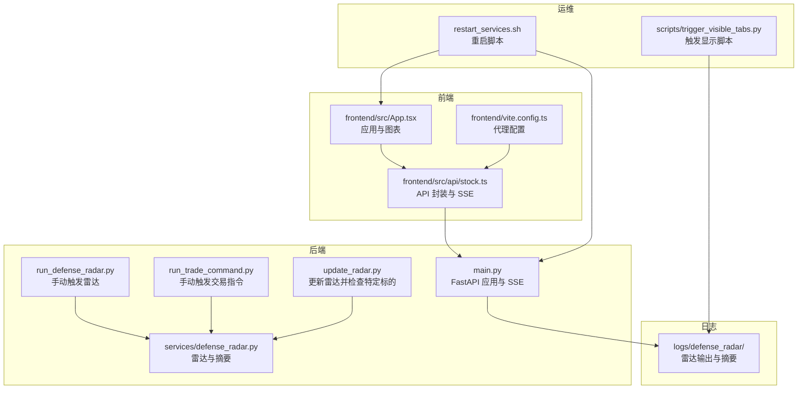
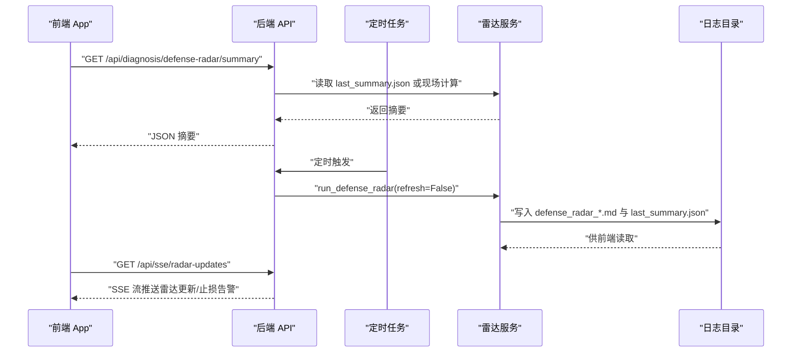
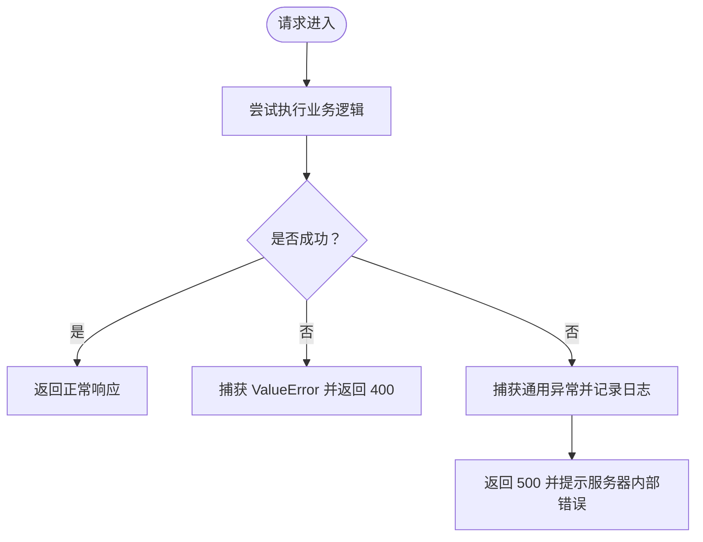
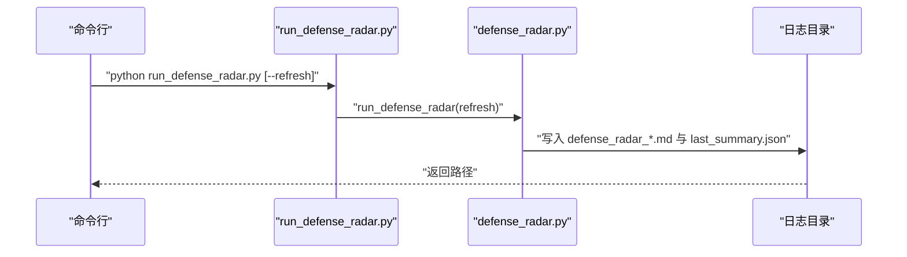
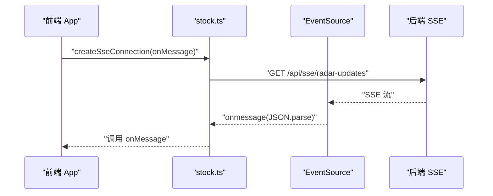
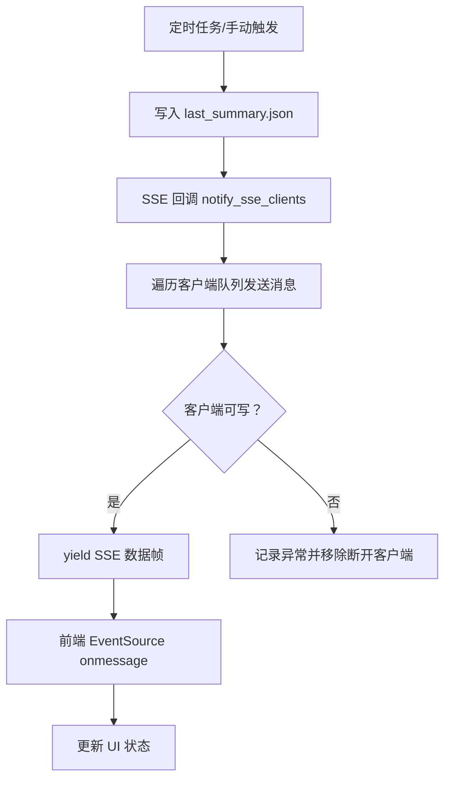
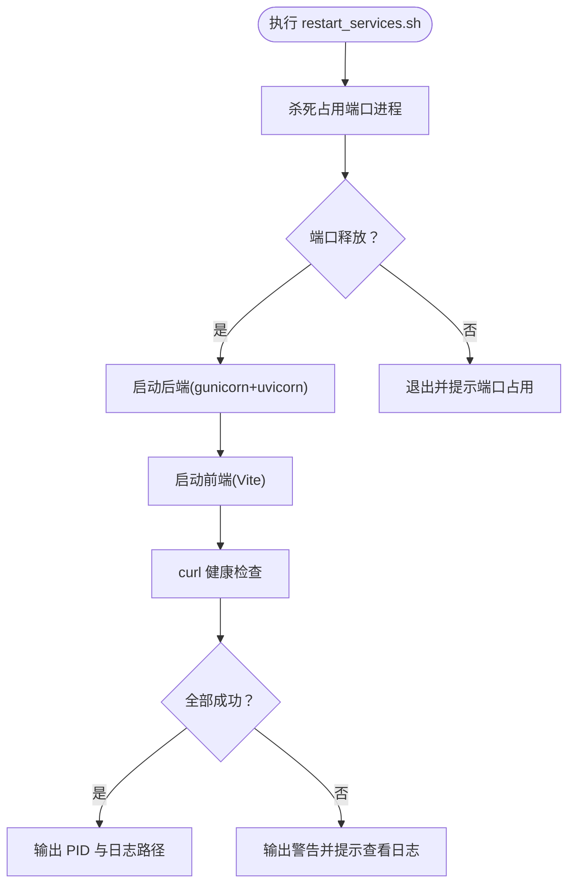
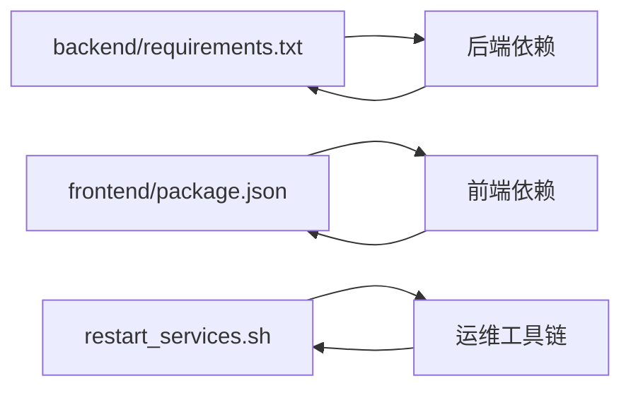

# 调试工具与技巧

<cite>
**本文引用的文件**
- [README.md](file://README.md)
- [backend/main.py](file://backend/main.py)
- [backend/run_defense_radar.py](file://backend/run_defense_radar.py)
- [backend/run_trade_command.py](file://backend/run_trade_command.py)
- [backend/update_radar.py](file://backend/update_radar.py)
- [backend/services/defense_radar.py](file://backend/services/defense_radar.py)
- [frontend/src/App.tsx](file://frontend/src/App.tsx)
- [frontend/src/api/stock.ts](file://frontend/src/api/stock.ts)
- [frontend/vite.config.ts](file://frontend/vite.config.ts)
- [restart_services.sh](file://restart_services.sh)
- [backend/scripts/trigger_visible_tabs.py](file://backend/scripts/trigger_visible_tabs.py)
- [backend/tests/test_defense_radar_trigger.py](file://backend/tests/test_defense_radar_trigger.py)
</cite>

## 目录
1. [简介](#简介)
2. [项目结构](#项目结构)
3. [核心组件](#核心组件)
4. [架构总览](#架构总览)
5. [详细组件分析](#详细组件分析)
6. [依赖分析](#依赖分析)
7. [性能考虑](#性能考虑)
8. [故障排查指南](#故障排查指南)
9. [结论](#结论)
10. [附录](#附录)

## 简介
本指南聚焦于本项目的调试工具与技巧，覆盖后端 Python 调试（pdb、日志、性能分析）、前端调试（浏览器开发者工具、React DevTools、网络监控）、实时日志与 SSE 调试、服务重启与故障恢复流程、常见问题诊断（内存泄漏、性能瓶颈、并发问题）、远程调试与生产环境定位，以及断点设置与变量监视最佳实践。文档基于仓库现有代码与脚本进行总结，帮助快速定位与解决问题。

## 项目结构
项目采用前后端分离架构：后端使用 FastAPI 提供 API 与 SSE，前端使用 React/Vite 构建可视化界面并通过代理转发 API 请求。定时任务负责 K 线缓存与雷达计算，日志目录集中存放雷达输出与服务日志。

**图表来源**
- [backend/main.py:1-514](file://backend/main.py#L1-L514)
- [backend/run_defense_radar.py:1-31](file://backend/run_defense_radar.py#L1-L31)
- [backend/run_trade_command.py:1-24](file://backend/run_trade_command.py#L1-L24)
- [backend/update_radar.py:1-47](file://backend/update_radar.py#L1-L47)
- [backend/services/defense_radar.py:1-200](file://backend/services/defense_radar.py#L1-L200)
- [frontend/src/App.tsx:1-1552](file://frontend/src/App.tsx#L1-L1552)
- [frontend/src/api/stock.ts:1-468](file://frontend/src/api/stock.ts#L1-L468)
- [frontend/vite.config.ts:1-22](file://frontend/vite.config.ts#L1-L22)
- [restart_services.sh:1-126](file://restart_services.sh#L1-L126)
- [backend/scripts/trigger_visible_tabs.py:1-120](file://backend/scripts/trigger_visible_tabs.py#L1-L120)

**章节来源**
- [README.md: 216–244:216-244](file://README.md#L216-L244)

## 核心组件
- 后端 FastAPI 应用与生命周期：通过 lifespan 初始化定时任务与 SSE 回调，统一异常处理与日志输出。
- 雷达服务：提供手动触发与诊断接口，生成 Markdown 与摘要 JSON，供前端消费。
- 前端应用：通过 API 封装与代理访问后端，使用 SSE 实时接收雷达更新与止损告警。
- 运维脚本：一键重启后端与前端，输出日志文件，便于排障。
- 调试脚本：触发显示脚本、雷达更新脚本、测试用例等辅助定位问题。

**章节来源**
- [backend/main.py: 80–92:80-92](file://backend/main.py#L80-L92)
- [backend/main.py: 171–206:171-206](file://backend/main.py#L171-L206)
- [frontend/src/api/stock.ts: 448–468:448-468](file://frontend/src/api/stock.ts#L448-L468)
- [restart_services.sh: 82–87:82-87](file://restart_services.sh#L82-L87)

## 架构总览
后端通过定时任务在固定时间点拉取 K 线并计算雷达，生成日志与摘要；前端通过 API 获取数据并在可见性变化时刷新；SSE 实时推送雷达更新与止损告警。

**图表来源**
- [backend/main.py: 171–206:171-206](file://backend/main.py#L171-L206)
- [backend/main.py: 213–252:213-252](file://backend/main.py#L213-L252)
- [backend/services/defense_radar.py: 147–165:147-165](file://backend/services/defense_radar.py#L147-L165)

## 详细组件分析

### 后端调试：FastAPI、SSE、日志与异常处理
- 生命周期与定时任务：lifespan 中设置 SSE 回调与定时任务，异常记录到日志但不影响服务启动。
- SSE 实时推送：维护客户端队列，心跳保活，异常与断开清理。
- 异常处理：各接口捕获 ValueError 与通用异常，记录日志并返回标准 HTTP 错误码。
- 日志配置：INFO 级别输出，便于排障。

**图表来源**
- [backend/main.py: 110–121:110-121](file://backend/main.py#L110-L121)
- [backend/main.py: 124–137:124-137](file://backend/main.py#L124-L137)
- [backend/main.py: 140–168:140-168](file://backend/main.py#L140-L168)
- [backend/main.py: 171–206:171-206](file://backend/main.py#L171-L206)

**章节来源**
- [backend/main.py: 72–77:72-77](file://backend/main.py#L72-L77)
- [backend/main.py: 213–252:213-252](file://backend/main.py#L213-L252)

### 雷达服务：手动触发与诊断
- 手动触发：run_defense_radar.py 支持 --refresh 排障模式，打印输出路径。
- 诊断接口：POST /api/diagnosis/defense-radar 写入日志与摘要。
- 雷达摘要：优先读 last_summary.json，不存在则现场计算并回写。

**图表来源**
- [backend/run_defense_radar.py: 22–26:22-26](file://backend/run_defense_radar.py#L22-L26)
- [backend/main.py: 189–206:189-206](file://backend/main.py#L189-L206)
- [backend/services/defense_radar.py: 147–165:147-165](file://backend/services/defense_radar.py#L147-L165)

**章节来源**
- [backend/run_defense_radar.py: 1–31:1-31](file://backend/run_defense_radar.py#L1-L31)
- [backend/main.py: 189–206:189-206](file://backend/main.py#L189-L206)
- [backend/services/defense_radar.py: 147–165:147-165](file://backend/services/defense_radar.py#L147-L165)

### 前端调试：浏览器开发者工具与网络监控
- 代理配置：Vite 将 /api 与 /ws 代理到后端 127.0.0.1:8000。
- API 封装：统一 fetchWithRetry、错误处理与缓存控制。
- SSE 连接：createSseConnection 建立 EventSource，onmessage 解析数据。
- 可见性刷新：visibilitychange 时刷新雷达摘要与 60m 数据。

**图表来源**
- [frontend/vite.config.ts: 8–18:8-18](file://frontend/vite.config.ts#L8-L18)
- [frontend/src/api/stock.ts: 448–468:448-468](file://frontend/src/api/stock.ts#L448-L468)
- [frontend/src/App.tsx: 602–604:602-604](file://frontend/src/App.tsx#L602-L604)

**章节来源**
- [frontend/vite.config.ts: 1–22:1-22](file://frontend/vite.config.ts#L1-L22)
- [frontend/src/api/stock.ts: 117–130:117-130](file://frontend/src/api/stock.ts#L117-L130)
- [frontend/src/api/stock.ts: 448–468:448-468](file://frontend/src/api/stock.ts#L448-L468)
- [frontend/src/App.tsx: 602–604:602-604](file://frontend/src/App.tsx#L602-L604)

### 实时日志与 SSE 调试
- SSE 端点：/api/sse/radar-updates，心跳保活，异常记录日志。
- 告警推送：止损触发时推送 stop_loss_triggered 类型消息。
- 前端监听：onmessage 解析并处理不同类型消息。

**图表来源**
- [backend/main.py: 28–71:28-71](file://backend/main.py#L28-L71)
- [backend/main.py: 213–252:213-252](file://backend/main.py#L213-L252)

**章节来源**
- [backend/main.py: 28–71:28-71](file://backend/main.py#L28-L71)
- [backend/main.py: 213–252:213-252](file://backend/main.py#L213-L252)

### 服务重启与故障恢复流程
- 一键重启：restart_services.sh 杀死占用端口进程，启动后端（gunicorn+uvicorn）与前端（Vite），输出日志文件。
- 端口与健康检查：curl 校验后端与前端可用性，失败输出日志路径。
- 代理与路径兼容：自动拼接 pip --user 安装路径，设置 HTTP_PROXY。

**图表来源**
- [restart_services.sh: 56–87:56-87](file://restart_services.sh#L56-L87)
- [restart_services.sh: 99–111:99-111](file://restart_services.sh#L99-L111)

**章节来源**
- [restart_services.sh: 1–126:1-126](file://restart_services.sh#L1-L126)

### 常见问题诊断
- 摘要 404：后端未重启或旧进程无新路由。
- 有警报的 Tab 不显示：摘要请求失败或未写 last_summary.json。
- 60m 报错「本地缓存不存在」：未跑定时任务或从未对该 symbol refresh=true。
- 中枢长时间不变：本地 CSV 未更新或仅命中 TTL 内缓存（港股日线）。

**章节来源**
- [README.md: 255–263:255-263](file://README.md#L255-L263)

## 依赖分析
- 后端依赖：FastAPI、uvicorn、pandas、akshare。
- 前端依赖：React、TypeScript、Vite、ECharts。
- 运维脚本依赖：lsof、pkill、curl、gunicorn、uvicorn。

**图表来源**
- [backend/requirements.txt: 1–5:1-5](file://backend/requirements.txt#L1-L5)
- [frontend/package.json](file://frontend/package.json)
- [restart_services.sh: 33–52:33-52](file://restart_services.sh#L33-L52)

**章节来源**
- [backend/requirements.txt: 1–5:1-5](file://backend/requirements.txt#L1-L5)
- [frontend/package.json](file://frontend/package.json)
- [restart_services.sh: 33–52:33-52](file://restart_services.sh#L33-L52)

## 性能考虑
- 后端：进程内响应缓存 + 本地文件 mtime 失效（日线与 60m 互不干扰），减少重复计算。
- 前端：visibilitychange 刷新，避免无谓轮询；fetchWithRetry 降低瞬时失败影响。
- SSE：心跳保活，异常断开清理，避免僵尸连接。

**章节来源**
- [README.md: 101–108:101-108](file://README.md#L101-L108)
- [frontend/src/App.tsx: 602–604:602-604](file://frontend/src/App.tsx#L602-L604)
- [backend/main.py: 213–252:213-252](file://backend/main.py#L213-L252)

## 故障排查指南

### 后端调试方法
- pdb 调试器使用
  - 在业务函数入口添加断点，使用 python -m pdb 运行对应脚本或服务入口。
  - 示例：在 run_defense_radar.py 的 main 函数或 defense_radar.py 的核心函数中插入断点。
- 日志分析
  - 后端日志级别为 INFO，关注 SSE 客户端写入失败、定时任务启动失败等异常。
  - 查看 logs/defense_radar/last_summary.json 与 defense_radar_*.md 确认雷达输出是否更新。
- 性能分析工具
  - 使用 cProfile 或 py-spy 对后端进程采样，定位热点函数。
  - 关注 get_index_kline、雷达计算与 SSE 广播耗时。

**章节来源**
- [backend/main.py: 72–77:72-77](file://backend/main.py#L72-L77)
- [backend/main.py: 28–71:28-71](file://backend/main.py#L28-L71)
- [backend/services/defense_radar.py: 147–165:147-165](file://backend/services/defense_radar.py#L147-L165)

### 前端调试技巧
- 浏览器开发者工具
  - Network 面板：监控 /api/* 与 /ws/* 请求，确认 SSE 连接状态与心跳。
  - Console 面板：查看 createSseConnection 的 onerror 回调与解析异常。
  - Elements 面板：验证 Tab 显隐逻辑与 Radar 摘要渲染。
- React DevTools
  - 安装 React DevTools 插件，检查组件树与 props/state，定位渲染异常。
- 网络请求监控
  - 使用 Vite 代理配置，确认 /api 与 /ws 代理到 127.0.0.1:8000。
  - 检查 fetchWithRetry 的重试次数与延迟。

**章节来源**
- [frontend/vite.config.ts: 8–18:8-18](file://frontend/vite.config.ts#L8-L18)
- [frontend/src/api/stock.ts: 117–130:117-130](file://frontend/src/api/stock.ts#L117-L130)
- [frontend/src/api/stock.ts: 448–468:448-468](file://frontend/src/api/stock.ts#L448-L468)

### 实时日志与 SSE 调试
- 日志文件查看
  - logs/defense_radar/defense_radar_*.md 与 last_summary.json 作为权威数据源。
  - 使用 tail -f 或 VS Code Live Server 实时查看变更。
- SSE 连接调试
  - 前端 onerror 回调输出错误事件，检查网络中断、跨域与后端异常。
  - 后端记录客户端断开与写入失败，定位队列阻塞或异常。

**章节来源**
- [backend/main.py: 213–252:213-252](file://backend/main.py#L213-L252)
- [frontend/src/api/stock.ts: 448–468:448-468](file://frontend/src/api/stock.ts#L448-L468)

### 服务重启与故障恢复
- 使用 restart_services.sh 一键重启后端与前端，查看日志文件定位问题。
- 健康检查：curl 校验后端与前端可用性，失败时查看对应日志路径。

**章节来源**
- [restart_services.sh: 99–111:99-111](file://restart_services.sh#L99-L111)

### 常见问题诊断
- 内存泄漏检测
  - 使用 memory_profiler 或 tracemalloc 检测对象增长趋势。
  - 关注 SSE 客户端队列与定时任务中的全局缓存。
- 性能瓶颈分析
  - 后端：cProfile 定位 get_index_kline 与雷达计算热点。
  - 前端：Performance 面板分析渲染与事件处理耗时。
- 并发问题排查
  - 后端：检查 asyncio.Queue 与线程安全，避免竞态条件。
  - 前端：确认 visibilitychange 与 SSE onmessage 的幂等性。

**章节来源**
- [backend/main.py: 28–71:28-71](file://backend/main.py#L28-L71)
- [frontend/src/App.tsx: 602–604:602-604](file://frontend/src/App.tsx#L602-L604)

### 远程调试与生产环境定位
- 远程调试
  - 使用 ssh 隧道将后端端口映射到本地，配合本地 IDE 远程调试。
  - 生产环境开启更详细的日志级别，收集后端与前端日志。
- 生产环境定位
  - 使用 systemd/journald 或 Docker 日志采集，结合 SSE 与 API 日志交叉验证。
  - 通过 /api/scheduler/status 与 /api/diagnosis/defense-radar/summary 验证服务状态。

**章节来源**
- [backend/main.py: 183–186:183-186](file://backend/main.py#L183-L186)
- [backend/main.py: 171–181:171-181](file://backend/main.py#L171-L181)

### 断点设置与变量监视最佳实践
- 后端
  - 在 run_defense_radar.py 的 run_defense_radar 与 defense_radar.py 的核心分析函数设置断点。
  - 使用 pdb 的 pp 命令打印复杂结构，使用 until 控制执行步进。
- 前端
  - 在 App.tsx 的 useEffect 与事件回调中设置断点，观察 state 变化。
  - 使用 React DevTools 的 Profiler 与组件树面板定位渲染热点。

**章节来源**
- [backend/run_defense_radar.py: 22–26:22-26](file://backend/run_defense_radar.py#L22-L26)
- [backend/services/defense_radar.py: 101–119:101-119](file://backend/services/defense_radar.py#L101-L119)
- [frontend/src/App.tsx: 602–604:602-604](file://frontend/src/App.tsx#L602-L604)

## 结论
本指南提供了从后端到前端、从本地到生产的完整调试路径。通过合理使用 pdb、日志、SSE、重启脚本与测试用例，可以高效定位与解决项目中的各类问题。建议在日常开发中持续关注日志与 SSE 状态，配合性能分析工具与并发检查，确保系统稳定运行。

## 附录
- 雷达更新与检查脚本：update_radar.py 用于更新雷达并检查特定标的条件满足情况。
- 触发显示脚本：trigger_visible_tabs.py 用于检查并提示可重新显示的标的。
- 测试用例：test_defense_radar_trigger.py 提供雷达条件的单元测试，便于回归与排障。

**章节来源**
- [backend/update_radar.py: 1–47:1-47](file://backend/update_radar.py#L1-L47)
- [backend/scripts/trigger_visible_tabs.py: 59–115:59-115](file://backend/scripts/trigger_visible_tabs.py#L59-L115)
- [backend/tests/test_defense_radar_trigger.py: 1–254:1-254](file://backend/tests/test_defense_radar_trigger.py#L1-L254)