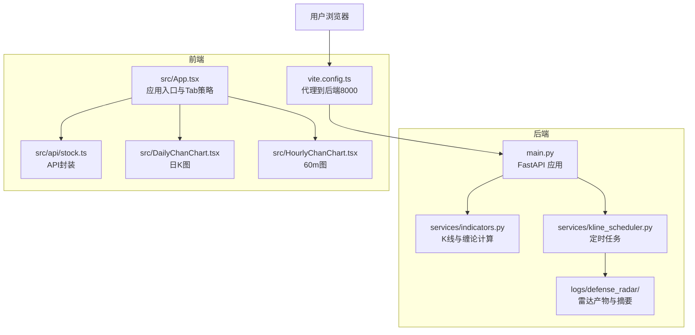
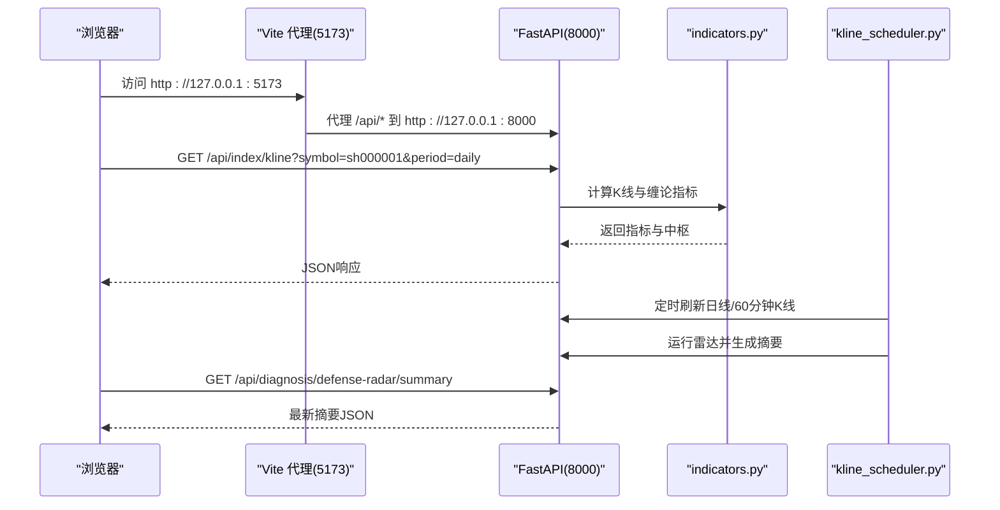
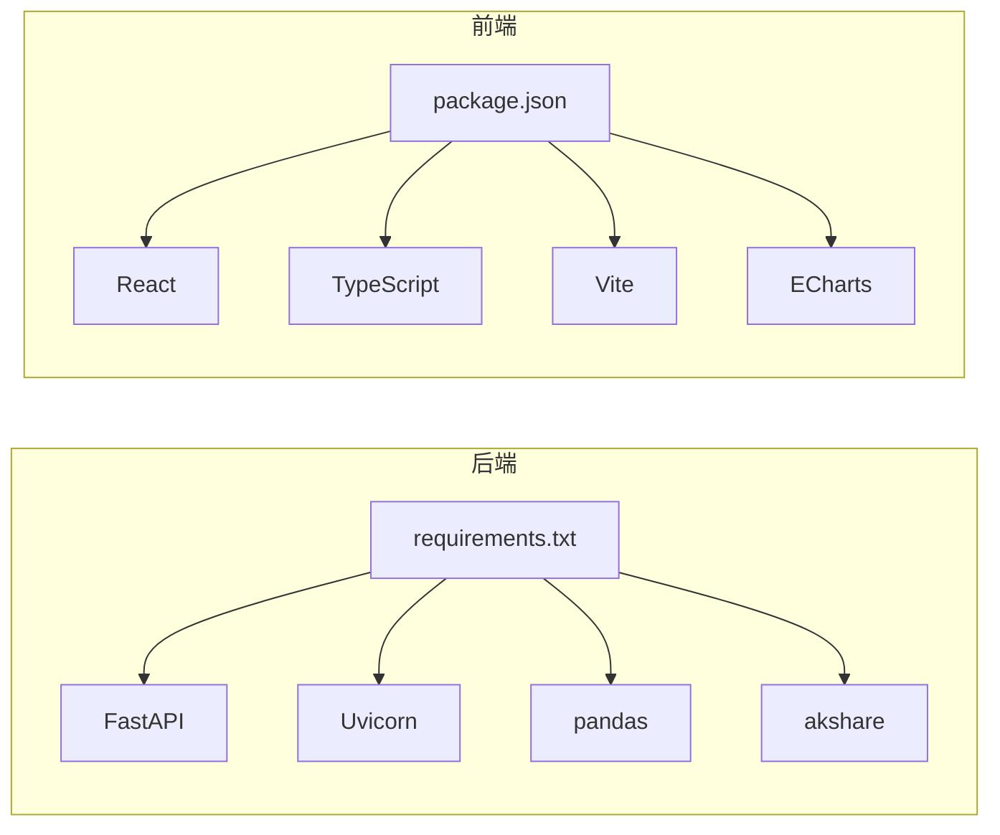
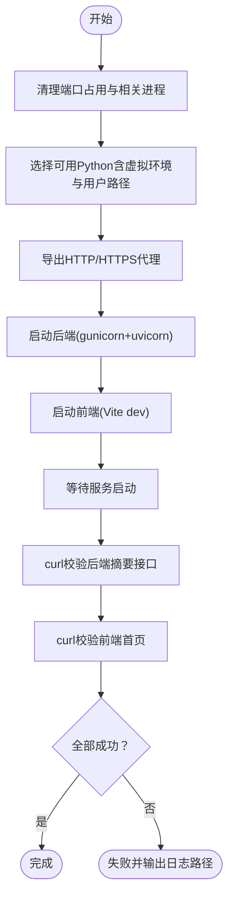

# 快速开始

<cite>
**本文引用的文件**
- [README.md](file://README.md)
- [restart_services.sh](file://restart_services.sh)
- [backend/requirements.txt](file://backend/requirements.txt)
- [frontend/package.json](file://frontend/package.json)
- [backend/main.py](file://backend/main.py)
- [frontend/vite.config.ts](file://frontend/vite.config.ts)
- [frontend/src/api/stock.ts](file://frontend/src/api/stock.ts)
- [frontend/src/App.tsx](file://frontend/src/App.tsx)
- [backend/services/indicators.py](file://backend/services/indicators.py)
- [backend/services/kline_scheduler.py](file://backend/services/kline_scheduler.py)
- [frontend/src/DailyChanChart.tsx](file://frontend/src/DailyChanChart.tsx)
- [frontend/src/HourlyChanChart.tsx](file://frontend/src/HourlyChanChart.tsx)
</cite>

## 目录
1. [简介](#简介)
2. [项目结构](#项目结构)
3. [核心组件](#核心组件)
4. [架构总览](#架构总览)
5. [详细组件分析](#详细组件分析)
6. [依赖分析](#依赖分析)
7. [性能考虑](#性能考虑)
8. [故障排查指南](#故障排查指南)
9. [结论](#结论)
10. [附录](#附录)

## 简介
本指南面向初学者与进阶用户，帮助你在本地快速搭建并运行金融分析系统。系统采用“本地优先”的A股/ETF/指数可视化方案，结合“双防线雷达”与“缠论”指标，后端使用FastAPI提供API，前端使用React/Vite/ECharts进行图表展示与交互。你将学会：
- 环境准备（Python 3.9+、Node.js）
- 依赖安装（后端pip、前端npm）
- 服务启动与验证（restart_services.sh）
- 默认端口与访问方式（后端8000、前端5173）
- 常见问题排查与基本使用示例

## 项目结构
系统分为后端与前端两大子工程，配合定时任务与日志目录，形成完整的本地数据闭环。

**图表来源**
- [backend/main.py:94-107](file://backend/main.py#L94-L107)
- [backend/services/indicators.py:1-200](file://backend/services/indicators.py#L1-L200)
- [backend/services/kline_scheduler.py:1-200](file://backend/services/kline_scheduler.py#L1-L200)
- [frontend/vite.config.ts:7-21](file://frontend/vite.config.ts#L7-L21)
- [frontend/src/api/stock.ts:114-115](file://frontend/src/api/stock.ts#L114-L115)
- [frontend/src/App.tsx:92-463](file://frontend/src/App.tsx#L92-L463)
- [frontend/src/DailyChanChart.tsx:1-200](file://frontend/src/DailyChanChart.tsx#L1-L200)
- [frontend/src/HourlyChanChart.tsx:1-200](file://frontend/src/HourlyChanChart.tsx#L1-L200)

**章节来源**
- [README.md:17-31](file://README.md#L17-L31)

## 核心组件
- 后端FastAPI应用：负责路由注册、CORS、生命周期管理、定时任务启动与关闭、SSE推送。
- K线与缠论服务：提供日线/60分钟K线、MACD/BOLL、分型/笔/线段/中枢等指标计算与响应缓存。
- 定时任务：按北京时间槽位刷新日线/60分钟K线并运行双防线雷达，生成摘要与雷达报告。
- 前端React应用：通过Vite代理访问后端API，渲染日K与60分钟图，展示中枢、买卖条件与雷达摘要。

**章节来源**
- [backend/main.py:80-92](file://backend/main.py#L80-L92)
- [backend/services/indicators.py:1-200](file://backend/services/indicators.py#L1-L200)
- [backend/services/kline_scheduler.py:1-200](file://backend/services/kline_scheduler.py#L1-L200)
- [frontend/src/api/stock.ts:114-115](file://frontend/src/api/stock.ts#L114-L115)

## 架构总览
后端通过FastAPI提供REST接口与SSE，前端通过Vite代理转发请求到后端。定时任务在后台按固定时间点刷新数据并生成雷达摘要，前端按需拉取摘要与K线数据。

**图表来源**
- [frontend/vite.config.ts:7-21](file://frontend/vite.config.ts#L7-L21)
- [backend/main.py:140-168](file://backend/main.py#L140-L168)
- [backend/services/indicators.py:1-200](file://backend/services/indicators.py#L1-L200)
- [backend/services/kline_scheduler.py:131-176](file://backend/services/kline_scheduler.py#L131-L176)

## 详细组件分析

### 后端服务（FastAPI）
- 生命周期：启动时初始化定时任务与SSE回调，关闭时清理定时任务。
- 跨域：允许任意来源，便于本地开发。
- 关键接口：
  - 获取单票/历史指标
  - 获取K线与缠论字段（日线/60分钟）
  - 双防线雷达摘要与手动执行
  - SSE推送雷达更新
- 注意：修改路由后需重启后端，避免旧路由残留。

**章节来源**
- [backend/main.py:80-92](file://backend/main.py#L80-L92)
- [backend/main.py:101-107](file://backend/main.py#L101-L107)
- [backend/main.py:110-168](file://backend/main.py#L110-L168)
- [backend/main.py:171-206](file://backend/main.py#L171-L206)
- [backend/main.py:213-252](file://backend/main.py#L213-L252)
- [README.md:29](file://README.md#L29)

### K线与缠论计算（indicators.py）
- 支持日线与60分钟K线，按“合并包含→分型→笔→线段→有效笔→中枢”流程计算。
- 响应缓存：按(symbol, period, start_date, end_date)键缓存，结合本地CSV mtime失效策略。
- 复权说明：指数/ETF为none；A股/港股按规则标注复权。
- 特殊标的：889999（梅花2test）在演示模式下扩展end_ts，使“未来K”参与计算。

**章节来源**
- [backend/services/indicators.py:1-200](file://backend/services/indicators.py#L1-L200)
- [README.md:93-109](file://README.md#L93-L109)

### 定时任务（kline_scheduler.py）
- 时区：Asia/Shanghai，独立线程按槽位唤醒执行。
- 槽位：
  - 10:31/11:31/14:01/15:01：全量60分钟刷新 + 雷达
  - 16:01：全量日线刷新 + 60分钟刷新 + 雷达
- 同步列表：上证指数 + 雷达监控列表 + 观察列表（去重）。
- 产出：日线CSV、60分钟CSV、雷达摘要与报告。

**章节来源**
- [backend/services/kline_scheduler.py:1-200](file://backend/services/kline_scheduler.py#L1-L200)
- [README.md:115-122](file://README.md#L115-L122)

### 前端服务（React + Vite）
- 代理配置：将/api与/ws代理到后端8000端口。
- API封装：统一的fetchWithRetry、参数构造与错误处理。
- 应用入口：Tab策略、雷达摘要拉取、K线数据加载时机。
- 图表组件：日K与60分钟图，展示中枢、MACD/BOLL、买卖条件与简讯。

**章节来源**
- [frontend/vite.config.ts:7-21](file://frontend/vite.config.ts#L7-L21)
- [frontend/src/api/stock.ts:114-115](file://frontend/src/api/stock.ts#L114-L115)
- [frontend/src/App.tsx:92-463](file://frontend/src/App.tsx#L92-L463)
- [frontend/src/DailyChanChart.tsx:1-200](file://frontend/src/DailyChanChart.tsx#L1-L200)
- [frontend/src/HourlyChanChart.tsx:1-200](file://frontend/src/HourlyChanChart.tsx#L1-L200)

## 依赖分析
- 后端依赖：FastAPI、Uvicorn、pandas、akshare。
- 前端依赖：React、TypeScript、Vite、ECharts及echarts-for-react。
- 代理与端口：前端Vite代理到后端8000；默认前端端口5173。

**图表来源**
- [backend/requirements.txt:1-5](file://backend/requirements.txt#L1-L5)
- [frontend/package.json:1-33](file://frontend/package.json#L1-L33)

**章节来源**
- [backend/requirements.txt:1-5](file://backend/requirements.txt#L1-L5)
- [frontend/package.json:1-33](file://frontend/package.json#L1-L33)

## 性能考虑
- 后端响应缓存：按本地CSV mtime失效，减少重复计算；60分钟与日线缓存互不影响。
- 定时任务：仅在槽位刷新，避免频繁网络请求；日线与60分钟分别写盘，降低耦合。
- 前端懒加载：按需拉取K线与雷达摘要，避免一次性加载过多数据。

**章节来源**
- [backend/services/indicators.py:88-174](file://backend/services/indicators.py#L88-L174)
- [backend/services/kline_scheduler.py:131-176](file://backend/services/kline_scheduler.py#L131-L176)

## 故障排查指南
常见问题与解决思路：
- 摘要404：后端未重启或旧进程无新路由。建议使用restart_services.sh重启服务。
- 有警报的Tab不显示：摘要请求失败或后端未写入last_summary.json。检查后端健康与雷达任务。
- 60m报错“本地缓存不存在”：未跑过定时任务或从未对该symbol refresh=true。先执行一次refresh=true或等待定时任务。
- 中枢长时间不变：本地CSV未更新或仅命中TTL（港股日线）。检查定时任务与CSV更新。

**章节来源**
- [README.md:255-264](file://README.md#L255-L264)

## 结论
通过本指南，你可以完成从环境准备到服务启动的全流程操作，并理解前后端交互、定时任务与数据缓存的工作原理。遇到问题时，可依据故障排查清单快速定位与修复。

## 附录

### 环境准备与依赖安装
- Python 3.9+：用于后端FastAPI服务。
- Node.js：用于前端Vite开发服务器。
- 后端依赖安装：在后端目录执行依赖安装。
- 前端依赖安装：在前端目录执行依赖安装。

**章节来源**
- [README.md:17-24](file://README.md#L17-L24)
- [backend/requirements.txt:1-5](file://backend/requirements.txt#L1-L5)
- [frontend/package.json:6-11](file://frontend/package.json#L6-L11)

### 服务启动与验证
- 使用restart_services.sh一键启动后端与前端服务，并自动验证端口与健康状态。
- 默认端口：后端8000、前端5173。
- 访问方式：后端API文档与前端页面地址见README。

**章节来源**
- [README.md:17-28](file://README.md#L17-L28)
- [restart_services.sh:10-11](file://restart_services.sh#L10-L11)
- [restart_services.sh:82-87](file://restart_services.sh#L82-L87)
- [restart_services.sh:99-111](file://restart_services.sh#L99-L111)

### restart_services.sh 脚本详解
- 端口清理：终止占用8000/5173端口的进程，确保干净启动。
- Python选择：优先项目虚拟环境，其次系统Python，最后兼容pip --user路径。
- 代理设置：为网络访问配置HTTP/HTTPS代理（Clash Verge）。
- 启动顺序：先启动后端（gunicorn + uvicorn worker），再启动前端（Vite dev）。
- 健康检查：通过curl验证后端摘要接口与前端首页响应。

**图表来源**
- [restart_services.sh:56-75](file://restart_services.sh#L56-L75)
- [restart_services.sh:33-52](file://restart_services.sh#L33-L52)
- [restart_services.sh:82-87](file://restart_services.sh#L82-L87)
- [restart_services.sh:99-111](file://restart_services.sh#L99-L111)

**章节来源**
- [restart_services.sh:1-126](file://restart_services.sh#L1-L126)

### 默认端口与访问方式
- 后端：http://127.0.0.1:8000
- 前端：http://127.0.0.1:5173
- 后端API文档：http://127.0.0.1:8000/docs
- 前端默认请求后端：见前端API封装与Vite代理配置。

**章节来源**
- [README.md:26-27](file://README.md#L26-L27)
- [frontend/src/api/stock.ts:114-115](file://frontend/src/api/stock.ts#L114-L115)
- [frontend/vite.config.ts:7-21](file://frontend/vite.config.ts#L7-L21)

### 基本使用示例
- 首次启动：在项目根目录执行restart_services.sh，等待服务启动并打开前端页面。
- 查看摘要：访问后端摘要接口，或在前端查看顶栏Tab显隐。
- 查看K线：切换到具体标的，前端自动拉取日K与60分钟图。
- 手动雷达：调用后端雷达接口生成报告，或在前端触发手动执行。

**章节来源**
- [README.md:17-28](file://README.md#L17-L28)
- [backend/main.py:171-206](file://backend/main.py#L171-L206)
- [frontend/src/App.tsx:92-463](file://frontend/src/App.tsx#L92-L463)