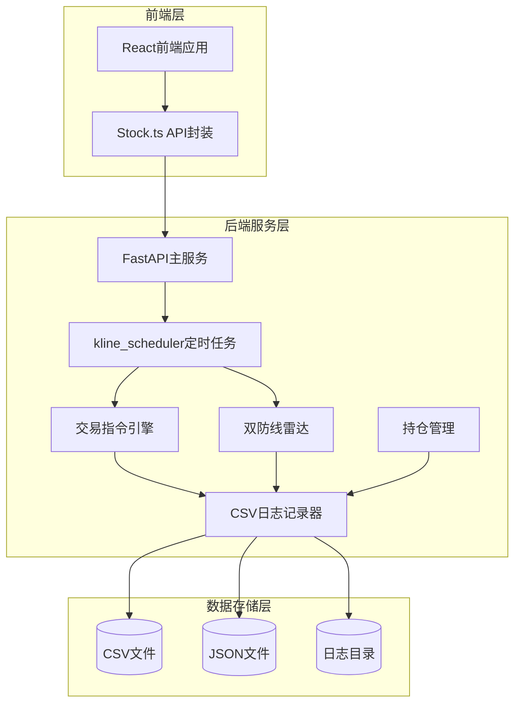
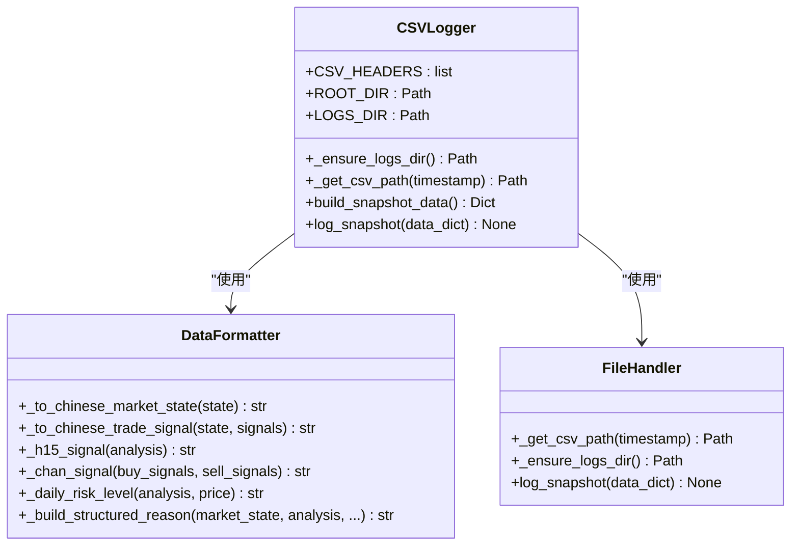
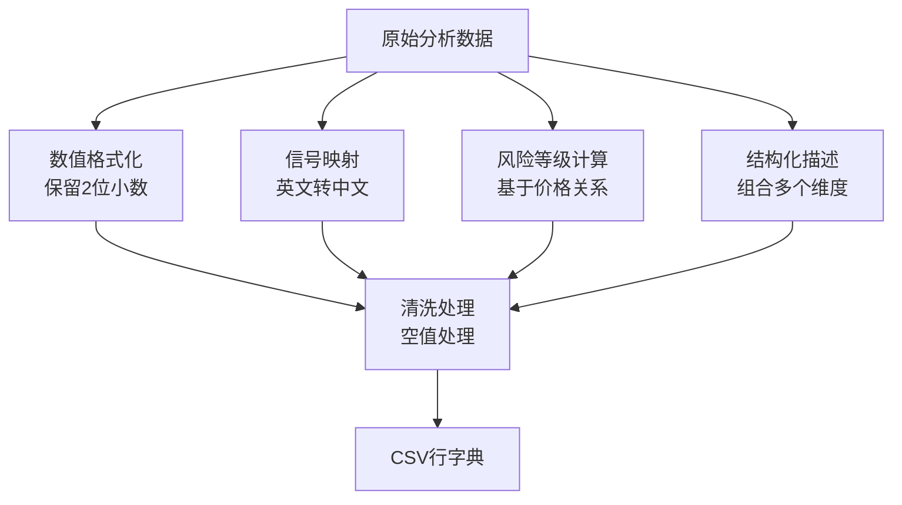
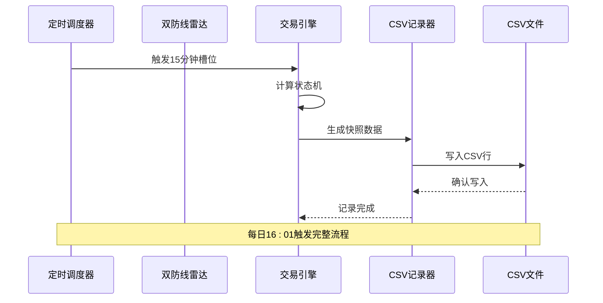
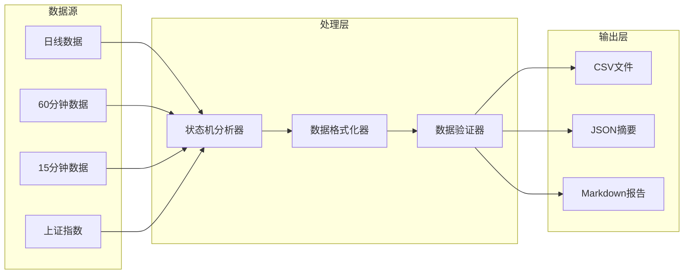
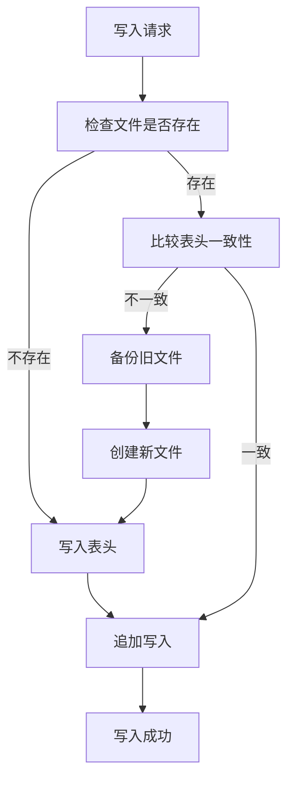
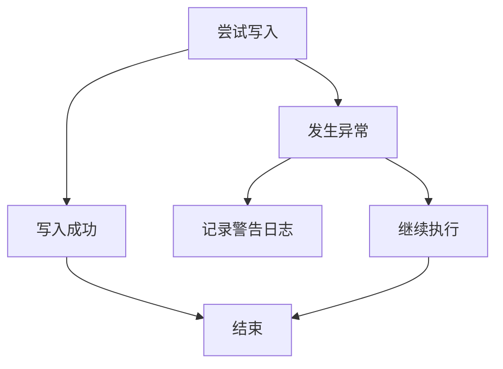
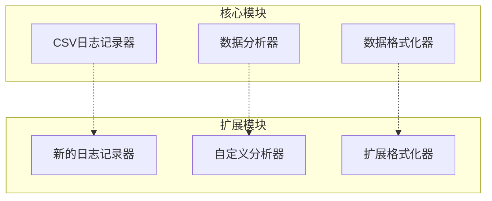

# CSV日志记录系统

<cite>
**本文档引用的文件**
- [csv_logger.py](file://backend/utils/csv_logger.py)
- [main.py](file://backend/main.py)
- [kline_scheduler.py](file://backend/services/kline_scheduler.py)
- [defense_radar.py](file://backend/services/defense_radar.py)
- [trade_command_engine.py](file://backend/services/trade_command_engine.py)
- [position_manager.py](file://backend/services/position_manager.py)
- [run_defense_radar.py](file://backend/run_defense_radar.py)
- [run_trade_command.py](file://backend/run_trade_command.py)
- [last_summary.json](file://logs/defense_radar/last_summary.json)
- [watchlist.json](file://backend/data/watchlist.json)
- [observation.json](file://backend/data/observation.json)
- [README.md](file://README.md)
</cite>

## 目录
1. [项目概述](#项目概述)
2. [系统架构](#系统架构)
3. [CSV日志记录核心模块](#csv日志记录核心模块)
4. [数据流分析](#数据流分析)
5. [性能特性](#性能特性)
6. [错误处理与可靠性](#错误处理与可靠性)
7. [扩展性设计](#扩展性设计)
8. [故障排查指南](#故障排查指南)
9. [总结](#总结)

## 项目概述

这是一个基于Python的金融数据分析系统，专注于A股、ETF和指数的缠论可视化分析。系统采用CSV日志记录机制，将状态机分析结果和交易信号以结构化的方式存储，便于后续的数据分析和回溯验证。

该系统的核心特色包括：
- **实时状态机快照**：每15分钟生成一次完整的市场状态快照
- **多级别缠论分析**：支持日线、60分钟、15分钟多级别的技术分析
- **双防线雷达系统**：提供风险预警和投资机会识别
- **CSV日志记录**：标准化的数据输出格式，支持Excel直接打开

## 系统架构

**架构图来源**
- [main.py:106-111](file://backend/main.py#L106-L111)
- [kline_scheduler.py:281-375](file://backend/services/kline_scheduler.py#L281-L375)
- [csv_logger.py:358-393](file://backend/utils/csv_logger.py#L358-L393)

## CSV日志记录核心模块

### 模块设计原理

CSV日志记录系统采用"按年分文件"的设计理念，确保日志文件大小可控，便于管理和查询。

**类图来源**
- [csv_logger.py:22-40](file://backend/utils/csv_logger.py#L22-L40)
- [csv_logger.py:301-355](file://backend/utils/csv_logger.py#L301-L355)
- [csv_logger.py:358-393](file://backend/utils/csv_logger.py#L358-L393)

### 数据结构设计

系统定义了固定的CSV表头，确保数据的一致性和可解析性：

| 字段名称 | 数据类型 | 描述 |
|---------|---------|------|
| 时间 | 字符串 | 格式化的时间戳 |
| 代码 | 字符串 | 股票代码 |
| 名称 | 字符串 | 股票名称 |
| 现价 | 数值 | 当前价格 |
| 大盘状态 | 字符串 | 市场整体状态 |
| 日线风控 | 字符串 | 日线级别风控状态 |
| 缠论信号 | 字符串 | 缠论技术信号 |
| 15分信号 | 字符串 | 15分钟级别信号 |
| 交易信号 | 字符串 | 最终交易决策 |
| 决策理由 | 字符串 | 详细决策说明 |
| 60m笔方向 | 字符串 | 60分钟笔的方向 |
| 日线A中枢ZD | 数值 | A中枢支撑位 |
| 日线C中枢ZD | 数值 | C中枢支撑位 |
| 锁定ZG | 数值 | 中枢阻力位 |
| 15m_DIF | 数值 | 15分钟DIF指标 |
| 15m_DEA | 数值 | 15分钟DEA指标 |
| 底分型成立 | 字符串 | 是否出现底分型 |

**表头定义来源**
- [csv_logger.py:22-40](file://backend/utils/csv_logger.py#L22-L40)

### 数据格式化策略

系统实现了多层次的数据格式化机制：

**格式化流程来源**
- [csv_logger.py:108-126](file://backend/utils/csv_logger.py#L108-L126)
- [csv_logger.py:128-191](file://backend/utils/csv_logger.py#L128-L191)
- [csv_logger.py:284-299](file://backend/utils/csv_logger.py#L284-L299)

## 数据流分析

### 定时任务触发流程

系统通过定时任务驱动CSV日志记录：

**流程图来源**
- [kline_scheduler.py:214-251](file://backend/services/kline_scheduler.py#L214-L251)
- [csv_logger.py:358-393](file://backend/utils/csv_logger.py#L358-L393)

### 数据采集与处理

系统采用多源数据融合的方式：

**数据流来源**
- [defense_radar.py:600-744](file://backend/services/defense_radar.py#L600-L744)
- [trade_command_engine.py:730-800](file://backend/services/trade_command_engine.py#L730-L800)

## 性能特性

### 内存管理优化

系统采用轻量级的数据结构设计，避免内存泄漏：

- **浅拷贝策略**：对输入数据进行深拷贝，防止外部引用污染
- **生成器模式**：大量数据处理时使用生成器减少内存占用
- **缓存机制**：对频繁访问的数据建立内存缓存

### 文件I/O优化

**性能优化来源**
- [csv_logger.py:364-393](file://backend/utils/csv_logger.py#L364-L393)

### 并发安全性

系统通过多种机制确保并发环境下的数据一致性：

- **文件锁机制**：使用fcntl实现跨进程文件锁定
- **线程安全**：所有共享资源使用RLock保护
- **原子操作**：写入操作采用原子性保证

## 错误处理与可靠性

### 异常处理策略

系统采用"静默失败"的设计原则，确保日志记录不会影响主业务流程：

**异常处理来源**
- [csv_logger.py:391-393](file://backend/utils/csv_logger.py#L391-L393)

### 数据完整性保障

- **表头兼容性**：自动检测表头变更并备份旧文件
- **数据验证**：对关键字段进行格式验证
- **回滚机制**：写入失败时自动回滚到之前状态

### 监控与告警

系统内置完善的监控机制：

- **心跳检测**：定期更新调度器状态文件
- **异常日志**：详细记录所有异常信息
- **健康检查**：提供调度器状态查询接口

## 扩展性设计

### 模块化架构

系统采用高度模块化的架构设计，便于功能扩展：

### 配置灵活性

- **动态配置**：支持运行时调整日志级别和输出格式
- **插件机制**：可扩展新的数据源和分析算法
- **环境适配**：支持不同部署环境的配置需求

## 故障排查指南

### 常见问题诊断

| 问题现象 | 可能原因 | 解决方案 |
|---------|---------|---------|
| CSV文件无法写入 | 权限不足或磁盘空间不足 | 检查文件权限和磁盘空间 |
| 表头不匹配 | 数据结构变更 | 系统自动备份旧文件并创建新表头 |
| 数据格式异常 | 输入数据格式错误 | 检查上游数据源的格式规范 |
| 性能下降 | 缓存过多或文件过大 | 清理历史文件和优化缓存策略 |

### 调试工具

系统提供了丰富的调试工具：

- **状态查询**：通过API查询调度器和日志记录器状态
- **手动触发**：支持手动运行雷达和交易引擎
- **日志分析**：详细的日志记录便于问题定位

**调试入口来源**
- [run_defense_radar.py:22-31](file://backend/run_defense_radar.py#L22-L31)
- [run_trade_command.py:21-24](file://backend/run_trade_command.py#L21-L24)

## 总结

CSV日志记录系统是一个设计精良的金融数据分析基础设施，具有以下突出特点：

1. **可靠性**：采用多重防护机制，确保系统稳定运行
2. **可扩展性**：模块化设计支持功能扩展和定制化需求
3. **性能优化**：通过缓存、并发控制等手段优化系统性能
4. **易用性**：提供友好的API接口和详细的文档支持

该系统为金融数据分析提供了坚实的基础，能够满足复杂的投资决策支持需求。通过CSV格式的标准化输出，系统确保了数据的可移植性和可分析性，为后续的数据挖掘和机器学习应用奠定了良好的基础。