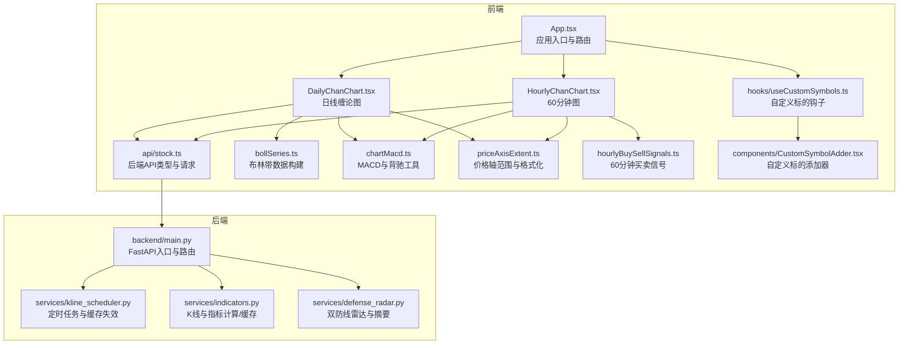
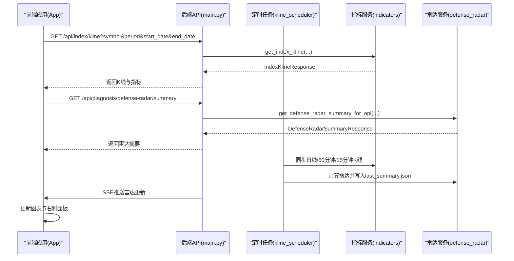
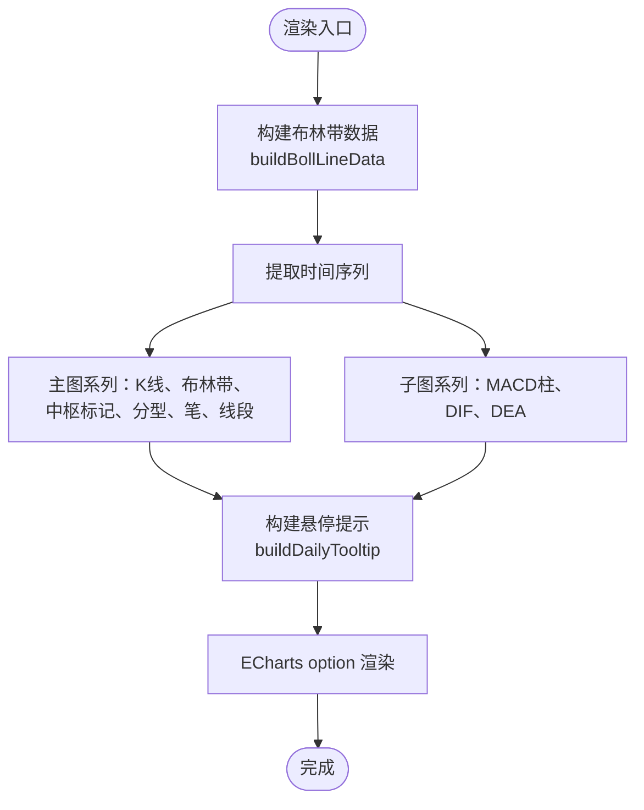
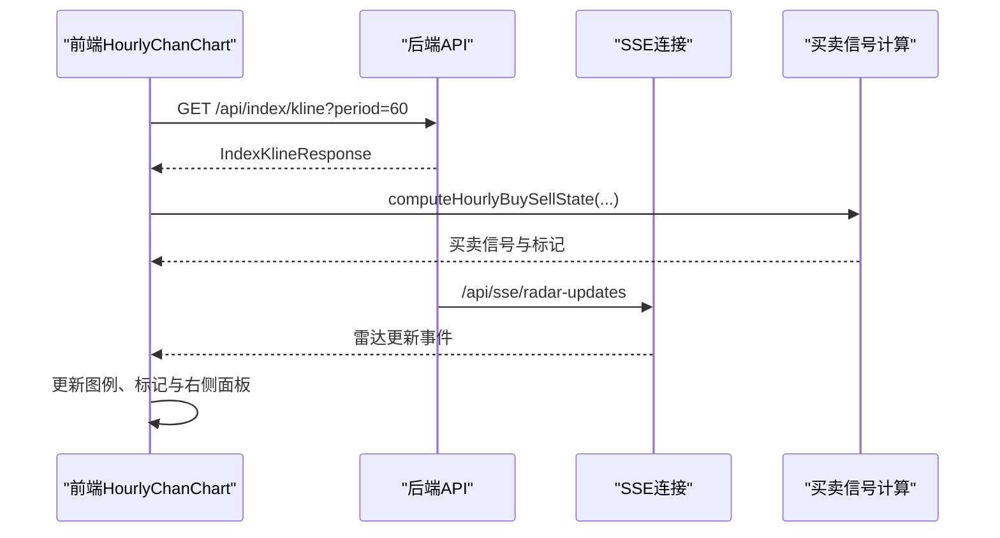
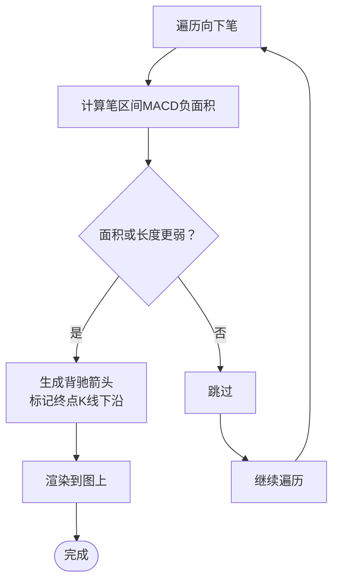
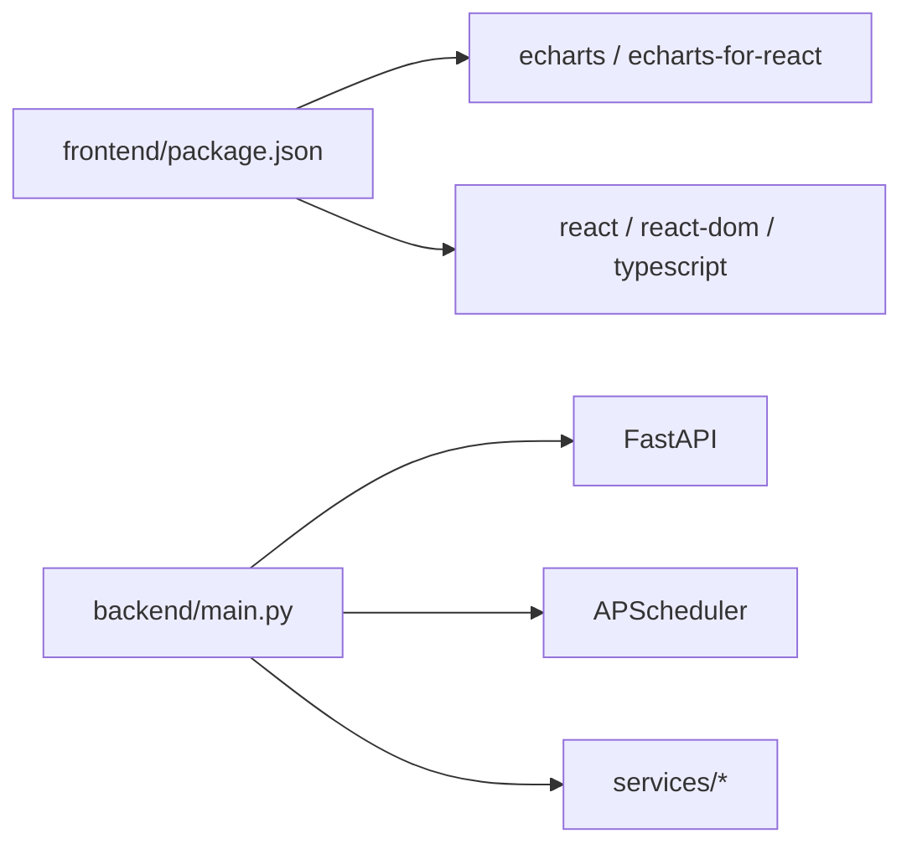

# 图表集成

<cite>
**本文引用的文件**
- [frontend/src/DailyChanChart.tsx](file://frontend/src/DailyChanChart.tsx)
- [frontend/src/HourlyChanChart.tsx](file://frontend/src/HourlyChanChart.tsx)
- [frontend/src/bollSeries.ts](file://frontend/src/bollSeries.ts)
- [frontend/src/chartMacd.ts](file://frontend/src/chartMacd.ts)
- [frontend/src/priceAxisExtent.ts](file://frontend/src/priceAxisExtent.ts)
- [frontend/src/App.tsx](file://frontend/src/App.tsx)
- [frontend/src/api/stock.ts](file://frontend/src/api/stock.ts)
- [frontend/src/hourlyBuySellSignals.ts](file://frontend/src/hourlyBuySellSignals.ts)
- [frontend/src/hooks/useCustomSymbols.ts](file://frontend/src/hooks/useCustomSymbols.ts)
- [frontend/src/components/CustomSymbolAdder.tsx](file://frontend/src/components/CustomSymbolAdder.tsx)
- [backend/main.py](file://backend/main.py)
- [backend/services/kline_scheduler.py](file://backend/services/kline_scheduler.py)
- [backend/services/indicators.py](file://backend/services/indicators.py)
- [backend/services/defense_radar.py](file://backend/services/defense_radar.py)
- [frontend/package.json](file://frontend/package.json)
</cite>

## 目录
1. [简介](#简介)
2. [项目结构](#项目结构)
3. [核心组件](#核心组件)
4. [架构总览](#架构总览)
5. [详细组件分析](#详细组件分析)
6. [依赖分析](#依赖分析)
7. [性能考量](#性能考量)
8. [故障排查指南](#故障排查指南)
9. [结论](#结论)
10. [附录](#附录)

## 简介
本技术文档聚焦于金融分析系统中的图表集成模块，系统通过后端定时任务拉取并缓存 K 线与技术指标，前端基于 ECharts 进行可视化渲染，实现布林带、MACD、缠论中枢与买卖信号的联动展示。文档涵盖前后端数据流、ECharts 配置与定制化、布林带与 MACD 的渲染与交互、缠论中枢的实时更新机制、状态管理与性能优化、缓存与渲染协调、响应式与移动端适配、以及调试与监控方法。

## 项目结构
前端采用 React + TypeScript + Vite 构建，图表组件位于 src 目录，API 定义在 api/stock.ts，图表工具函数分布在独立模块中；后端基于 FastAPI 提供指标与雷达服务，定时任务负责数据同步与缓存更新。

**图表来源**
- [frontend/src/App.tsx:598-800](file://frontend/src/App.tsx#L598-L800)
- [frontend/src/DailyChanChart.tsx:161-820](file://frontend/src/DailyChanChart.tsx#L161-L820)
- [frontend/src/HourlyChanChart.tsx:179-1632](file://frontend/src/HourlyChanChart.tsx#L179-L1632)
- [frontend/src/api/stock.ts:185-215](file://frontend/src/api/stock.ts#L185-L215)
- [backend/main.py:140-215](file://backend/main.py#L140-L215)

**章节来源**
- [frontend/src/App.tsx:598-800](file://frontend/src/App.tsx#L598-L800)
- [backend/main.py:140-215](file://backend/main.py#L140-L215)

## 核心组件
- 日线缠论图（DailyChanChart）：渲染日线 K 线、布林带、中枢标记、分型、笔与线段、MACD 柱与 DIF/DEA，并提供鼠标悬停提示与图例联动。
- 60分钟图（HourlyChanChart）：在日线基础上叠加 60 分钟数据，展示中枢、背驰箭头、买卖信号与右侧自检面板，支持 SSE 实时更新。
- 布林带工具（bollSeries）：将后端返回的布林带数据转换为 ECharts 主图系列数据。
- MACD 工具（chartMacd）：计算 MACD 背驰面积、生成背驰箭头、拼接 MACD 提示块。
- 价格轴工具（priceAxisExtent）：计算主图 Y 轴范围与格式化。
- 买卖信号（hourlyBuySellSignals）：纯函数计算一买、二买、三买、一卖、二卖、三卖信号及其过滤等级。
- API 定义（api/stock.ts）：定义后端返回的 K 线与指标数据结构、雷达摘要、SSE 连接等。
- 定时任务（kline_scheduler）：按北京时间槽位同步日线/60分钟/15分钟 K 线，计算破位状态与买卖信号，写入本地缓存并广播 SSE。

**章节来源**
- [frontend/src/DailyChanChart.tsx:161-820](file://frontend/src/DailyChanChart.tsx#L161-L820)
- [frontend/src/HourlyChanChart.tsx:179-1632](file://frontend/src/HourlyChanChart.tsx#L179-L1632)
- [frontend/src/bollSeries.ts:1-34](file://frontend/src/bollSeries.ts#L1-L34)
- [frontend/src/chartMacd.ts:1-71](file://frontend/src/chartMacd.ts#L1-L71)
- [frontend/src/priceAxisExtent.ts:1-52](file://frontend/src/priceAxisExtent.ts#L1-L52)
- [frontend/src/hourlyBuySellSignals.ts:1-1676](file://frontend/src/hourlyBuySellSignals.ts#L1-L1676)
- [frontend/src/api/stock.ts:1-468](file://frontend/src/api/stock.ts#L1-L468)
- [backend/services/kline_scheduler.py:1-492](file://backend/services/kline_scheduler.py#L1-L492)

## 架构总览
前端通过 API 获取日线/60分钟/15分钟 K 线与指标，后端定时任务拉取并缓存数据，前端在渲染图表时使用工具函数进行数据转换与范围计算。SSE 用于实时推送雷达更新，前端监听并更新图表与右侧面板。

**图表来源**
- [backend/main.py:140-215](file://backend/main.py#L140-L215)
- [backend/services/kline_scheduler.py:211-256](file://backend/services/kline_scheduler.py#L211-L256)
- [backend/services/indicators.py:1-800](file://backend/services/indicators.py#L1-L800)
- [backend/services/defense_radar.py:147-166](file://backend/services/defense_radar.py#L147-L166)

**章节来源**
- [backend/main.py:140-215](file://backend/main.py#L140-L215)
- [backend/services/kline_scheduler.py:211-256](file://backend/services/kline_scheduler.py#L211-L256)
- [backend/services/indicators.py:1-800](file://backend/services/indicators.py#L1-L800)
- [backend/services/defense_radar.py:147-166](file://backend/services/defense_radar.py#L147-L166)

## 详细组件分析

### 日线缠论图（DailyChanChart）
- 数据来源：IndexKlineResponse，包含 K 线 OHLC、MACD、布林带、分型、笔、有效笔、线段、中枢等。
- 渲染内容：
  - 主图：K 线蜡烛、布林带上下轨与带宽堆叠、中枢标记（ZG/ZD/DD）、分型（顶/底）、笔与线段。
  - 子图：MACD 柱（红涨绿跌）、DIF、DEA。
- 交互：悬停提示包含价格、布林带、中枢提示与 MACD 数值；图例联动；双轴联动。
- 动态更新：通过 notMerge 与 opts.renderer=svg 控制渲染；dataZoom 保持缩放状态；价格轴范围由 priceAxisExtent 计算并带 6% 边距。

**图表来源**
- [frontend/src/DailyChanChart.tsx:250-734](file://frontend/src/DailyChanChart.tsx#L250-L734)
- [frontend/src/bollSeries.ts:1-34](file://frontend/src/bollSeries.ts#L1-L34)
- [frontend/src/priceAxisExtent.ts:1-52](file://frontend/src/priceAxisExtent.ts#L1-L52)

**章节来源**
- [frontend/src/DailyChanChart.tsx:161-820](file://frontend/src/DailyChanChart.tsx#L161-L820)
- [frontend/src/bollSeries.ts:1-34](file://frontend/src/bollSeries.ts#L1-L34)
- [frontend/src/priceAxisExtent.ts:1-52](file://frontend/src/priceAxisExtent.ts#L1-L52)

### 60分钟图（HourlyChanChart）
- 数据来源：IndexKlineResponse（含 MACD 用于背驰面积比较）。
- 渲染内容：日线中枢参考线（C-ZD/A-ZD）、中枢标记、笔/线段、背驰箭头、买卖信号标记与右侧自检面板。
- 买卖信号：基于 hourlyBuySellSignals 的纯函数计算，支持后端定时计算结果与前端回退逻辑；跨级别风控（日线破位降级、高乖离警告）。
- 实时更新：SSE 连接监听雷达更新，动态刷新买卖信号与右侧面板。

**图表来源**
- [frontend/src/HourlyChanChart.tsx:179-1632](file://frontend/src/HourlyChanChart.tsx#L179-L1632)
- [frontend/src/hourlyBuySellSignals.ts:1-1676](file://frontend/src/hourlyBuySellSignals.ts#L1-L1676)
- [frontend/src/api/stock.ts:449-466](file://frontend/src/api/stock.ts#L449-L466)

**章节来源**
- [frontend/src/HourlyChanChart.tsx:179-1632](file://frontend/src/HourlyChanChart.tsx#L179-L1632)
- [frontend/src/hourlyBuySellSignals.ts:1-1676](file://frontend/src/hourlyBuySellSignals.ts#L1-L1676)
- [frontend/src/api/stock.ts:449-466](file://frontend/src/api/stock.ts#L449-L466)

### 布林带系列数据与渲染
- 数据转换：将后端返回的布林带上/中/下轨转换为 ECharts 系列数组，缺失值用 '-' 占位。
- 参与主图 Y 轴极值：布林带上轨、下轨、中轨参与价格轴范围计算，避免极端值拉伸。
- 渲染样式：带宽堆叠与中轨虚线，配合主图 K 线与中枢标记。

**章节来源**
- [frontend/src/bollSeries.ts:1-34](file://frontend/src/bollSeries.ts#L1-L34)
- [frontend/src/priceAxisExtent.ts:1-52](file://frontend/src/priceAxisExtent.ts#L1-L52)

### MACD 指标可视化与背驰交互
- 背驰面积：按笔区间累加 MACD 柱负值绝对值，用于比较相邻向下笔的背驰强度。
- 背驰箭头：当相邻向下笔终点创新低且面积或长度更弱时，生成底背驰箭头标记。
- 提示块：悬停时在提示中附加 DIF/DEA/MACD 数值，便于判断动能变化。

**图表来源**
- [frontend/src/chartMacd.ts:7-43](file://frontend/src/chartMacd.ts#L7-L43)

**章节来源**
- [frontend/src/chartMacd.ts:1-71](file://frontend/src/chartMacd.ts#L1-L71)

### 缠论中枢与笔/线段数据绑定
- 中枢：日线中枢按起止日期排序，首段为 A，末段为 C；中枢 ZG/ZD/DD 作为标记线与框绘制。
- 笔/线段：有效笔用于线段折线，避免仅连接首尾；线段折线沿有效笔端点转折。
- 数据绑定：通过日期映射到 K 线索引，确保标记与数据对齐。

**章节来源**
- [frontend/src/DailyChanChart.tsx:17-34](file://frontend/src/DailyChanChart.tsx#L17-L34)
- [frontend/src/HourlyChanChart.tsx:17-33](file://frontend/src/HourlyChanChart.tsx#L17-L33)

### 状态管理与实时更新
- 应用状态：App.tsx 维护日线/60分钟/15分钟 K 线数据、雷达摘要、买卖信号、SSE 连接等。
- SSE：后端定时广播雷达更新，前端监听并更新图表与右侧面板。
- 本地存储：自定义标的与关闭的 Tab 通过 localStorage 持久化，提升用户体验。

**章节来源**
- [frontend/src/App.tsx:598-800](file://frontend/src/App.tsx#L598-L800)
- [frontend/src/api/stock.ts:449-466](file://frontend/src/api/stock.ts#L449-L466)
- [frontend/src/hooks/useCustomSymbols.ts:1-77](file://frontend/src/hooks/useCustomSymbols.ts#L1-L77)
- [frontend/src/components/CustomSymbolAdder.tsx:1-192](file://frontend/src/components/CustomSymbolAdder.tsx#L1-L192)

### 性能优化策略
- 前端渲染：
  - 使用 notMerge 与 SVG 渲染器，减少重绘开销。
  - dataZoom 使用 inside/slider，避免每次 option 更新重置缩放。
  - 价格轴范围计算带边距，避免异常值影响可视比例。
- 后端缓存：
  - K 线与指标响应缓存（TTL 与容量限制），本地 CSV mtime 变化触发缓存失效与中枢重算。
  - 定时任务按槽位同步，避免重复拉取与计算。
- 数据传输：
  - API 使用 no-store 缓存控制，确保前端每次请求都获取最新数据。

**章节来源**
- [frontend/src/DailyChanChart.tsx:480-484](file://frontend/src/DailyChanChart.tsx#L480-L484)
- [frontend/src/priceAxisExtent.ts:1-52](file://frontend/src/priceAxisExtent.ts#L1-L52)
- [backend/services/indicators.py:88-174](file://backend/services/indicators.py#L88-L174)
- [backend/services/kline_scheduler.py:286-358](file://backend/services/kline_scheduler.py#L286-L358)

### 响应式设计与移动端适配
- 图表尺寸：使用 clamp 限定高度，适配不同屏幕尺寸。
- 提示样式：tooltip 背景色与边框，文字颜色与字号适配深色主题。
- 图例滚动：主图图例使用滚动型，避免过多系列溢出。

**章节来源**
- [frontend/src/DailyChanChart.tsx:730-734](file://frontend/src/DailyChanChart.tsx#L730-L734)
- [frontend/src/DailyChanChart.tsx:428-435](file://frontend/src/DailyChanChart.tsx#L428-L435)

### 扩展开发指南与最佳实践
- 新增技术指标：在 api/stock.ts 中定义数据结构，后端在 indicators.py 中计算并缓存，前端在图表组件中读取并渲染。
- 新增图表系列：遵循 ECharts option 结构，使用工具函数（如 bollSeries、chartMacd、priceAxisExtent）进行数据转换与范围计算。
- 交互增强：利用 tooltip.formatter 与 axisPointer.link 实现跨轴联动与自定义提示。
- 性能优先：避免在渲染路径中做重型计算，尽量使用缓存与纯函数。

**章节来源**
- [frontend/src/api/stock.ts:1-468](file://frontend/src/api/stock.ts#L1-L468)
- [backend/services/indicators.py:657-689](file://backend/services/indicators.py#L657-L689)

## 依赖分析
- 前端依赖：React、ECharts、echarts-for-react，构建工具 Vite、TypeScript。
- 后端依赖：FastAPI、APScheduler、pandas、akshare、yfinance、requests 等。

**图表来源**
- [frontend/package.json:12-31](file://frontend/package.json#L12-L31)
- [backend/main.py:10-12](file://backend/main.py#L10-L12)

**章节来源**
- [frontend/package.json:12-31](file://frontend/package.json#L12-L31)
- [backend/main.py:10-12](file://backend/main.py#L10-L12)

## 性能考量
- 后端缓存 TTL 与容量限制，避免内存膨胀；本地 CSV mtime 变化触发中枢重算，保证数据一致性。
- 前端渲染使用 SVG 渲染器与 notMerge，降低重绘成本；dataZoom 保持缩放状态，提升交互体验。
- API 层面使用 no-store 缓存控制，确保前端每次获取最新数据。

**章节来源**
- [backend/services/indicators.py:88-174](file://backend/services/indicators.py#L88-L174)
- [frontend/src/DailyChanChart.tsx:480-484](file://frontend/src/DailyChanChart.tsx#L480-L484)
- [frontend/src/api/stock.ts:196-200](file://frontend/src/api/stock.ts#L196-L200)

## 故障排查指南
- 后端定时任务健康状态：通过 /api/scheduler/status 查询心跳、下次调度时间与槽位计数。
- SSE 连接：检查 /api/sse/radar-updates 是否能持续接收心跳与更新消息。
- 数据缺失：确认定时任务是否按时执行，本地 CSV 是否更新；必要时使用 refresh=true 强制拉取。
- 图表渲染异常：检查 ECharts option 构建逻辑，确认数据转换与坐标轴范围计算正确。

**章节来源**
- [backend/main.py:183-187](file://backend/main.py#L183-L187)
- [backend/main.py:213-252](file://backend/main.py#L213-L252)
- [backend/services/kline_scheduler.py:410-446](file://backend/services/kline_scheduler.py#L410-L446)

## 结论
图表集成模块通过前后端协作，实现了从数据拉取、缓存、计算到可视化渲染的完整闭环。ECharts 的灵活配置与工具函数的模块化设计，使得布林带、MACD、缠论中枢与买卖信号得以高效呈现与实时更新。通过缓存与定时任务的配合，系统在保证数据新鲜度的同时兼顾性能与稳定性。

## 附录
- 关键 API
  - GET /api/index/kline：获取日线/60分钟/15分钟 K 线与指标
  - GET /api/diagnosis/defense-radar/summary：获取雷达摘要
  - POST /api/diagnosis/defense-radar：手动触发雷达计算
  - GET /api/sse/radar-updates：SSE 实时推送
- 关键服务
  - kline_scheduler：定时同步与缓存失效
  - indicators：K 线与指标计算/缓存
  - defense_radar：双防线雷达与摘要

**章节来源**
- [backend/main.py:140-215](file://backend/main.py#L140-L215)
- [backend/services/kline_scheduler.py:1-492](file://backend/services/kline_scheduler.py#L1-L492)
- [backend/services/indicators.py:1-800](file://backend/services/indicators.py#L1-L800)
- [backend/services/defense_radar.py:147-166](file://backend/services/defense_radar.py#L147-L166)