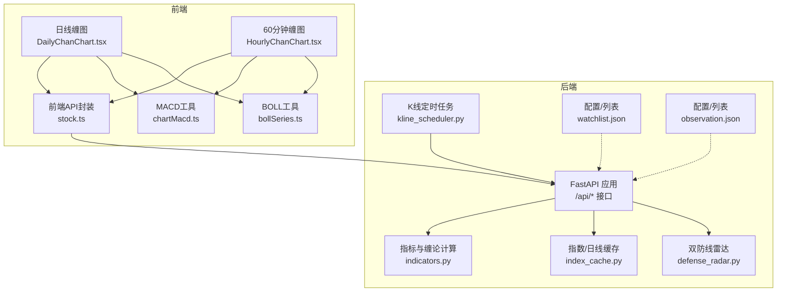
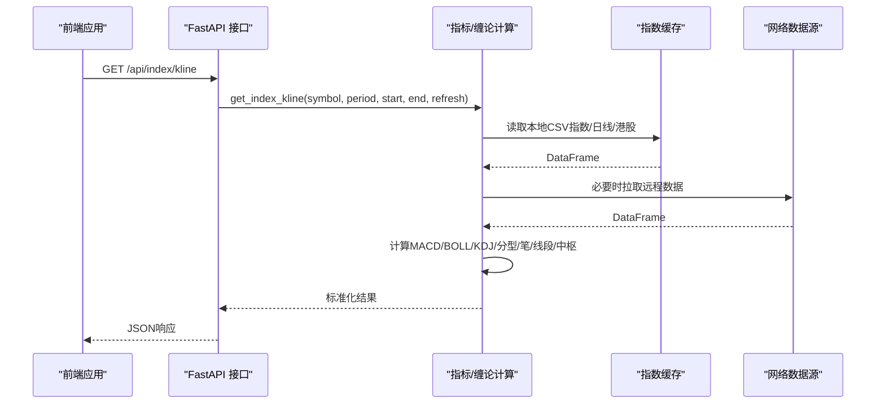
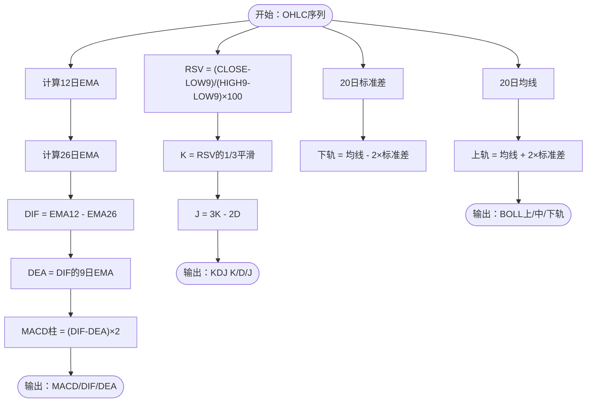
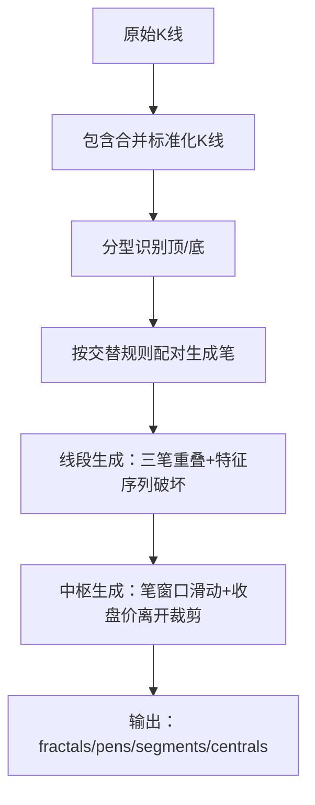
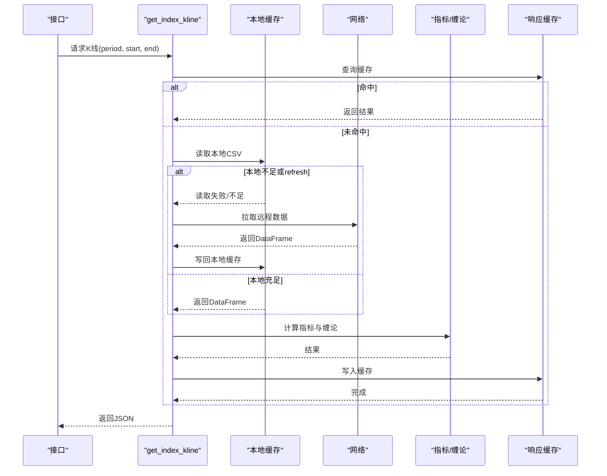
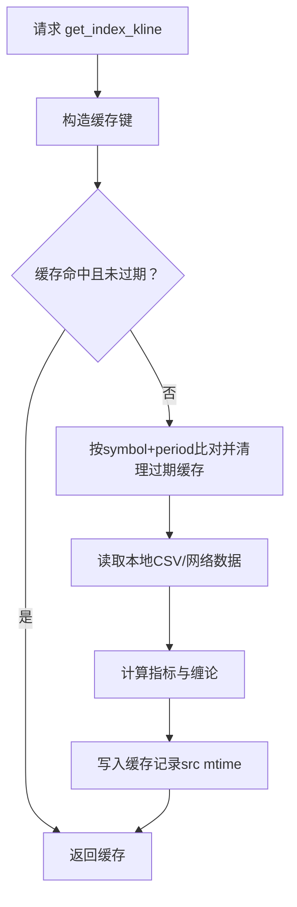
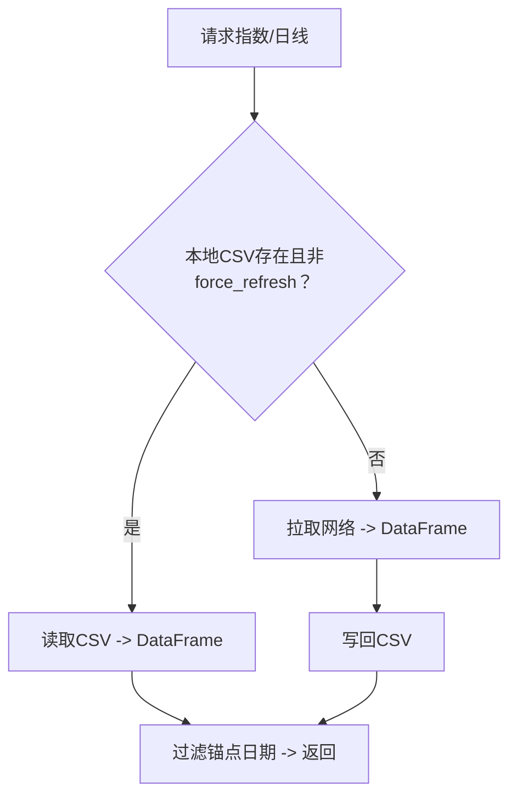
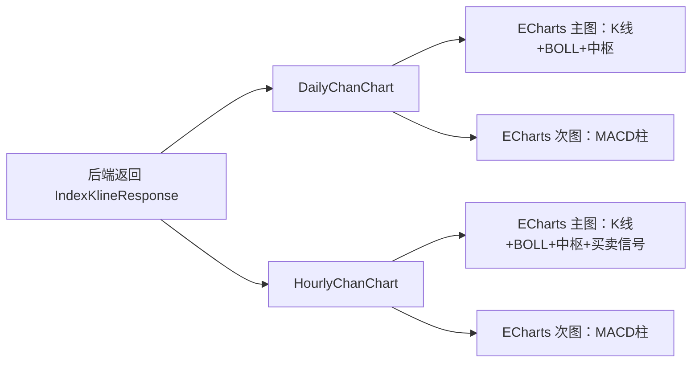
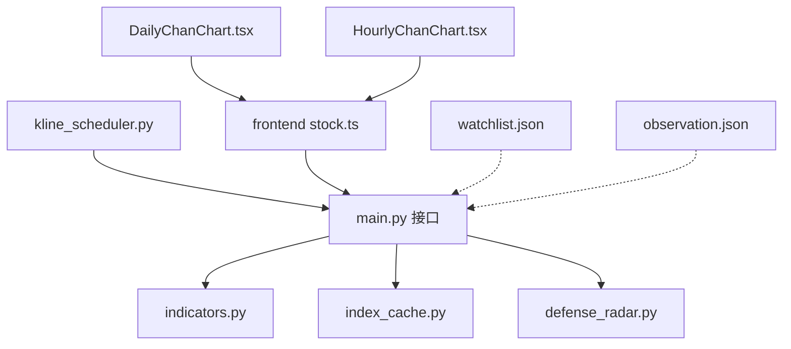

# 技术分析系统

<cite>
**本文引用的文件**
- [backend/main.py](file://backend/main.py)
- [backend/services/indicators.py](file://backend/services/indicators.py)
- [backend/services/index_cache.py](file://backend/services/index_cache.py)
- [backend/services/kline_scheduler.py](file://backend/services/kline_scheduler.py)
- [backend/services/defense_radar.py](file://backend/services/defense_radar.py)
- [backend/data/watchlist.json](file://backend/data/watchlist.json)
- [backend/data/observation.json](file://backend/data/observation.json)
- [frontend/src/api/stock.ts](file://frontend/src/api/stock.ts)
- [frontend/src/DailyChanChart.tsx](file://frontend/src/DailyChanChart.tsx)
- [frontend/src/HourlyChanChart.tsx](file://frontend/src/HourlyChanChart.tsx)
- [frontend/src/chartMacd.ts](file://frontend/src/chartMacd.ts)
- [frontend/src/bollSeries.ts](file://frontend/src/bollSeries.ts)
</cite>

## 目录
1. [简介](#简介)
2. [项目结构](#项目结构)
3. [核心组件](#核心组件)
4. [架构总览](#架构总览)
5. [详细组件分析](#详细组件分析)
6. [依赖关系分析](#依赖关系分析)
7. [性能考量](#性能考量)
8. [故障排查指南](#故障排查指南)
9. [结论](#结论)
10. [附录](#附录)

## 简介
本技术分析系统提供A股、指数、ETF与港股的K线与技术分析能力，核心功能包括：
- 指标计算：MACD、布林带（BOLL）、KDJ
- 缠论分析：分型、笔、线段、中枢（含有效笔与潜在背驰）
- 数据缓存：指数/日线本地CSV缓存、60/15分钟K线本地缓存与响应缓存
- 进程内响应缓存：基于内存字典与本地文件mtime失效策略
- 指数缓存系统：统一的本地CSV管理、网络数据获取与更新策略
- 结果数据结构：标准化的前后端数据契约
- 前端展示：ECharts可视化，含MACD、BOLL、中枢、买卖信号标注
- 性能优化：定时任务、响应缓存、本地优先、TTL与容量控制

## 项目结构
系统采用后端（FastAPI）+ 前端（React + ECharts）的分层架构，后端负责数据获取、指标与缠论计算、缓存与定时任务，前端负责可视化与交互。

**图表来源**
- [backend/main.py](file://backend/main.py)
- [backend/services/indicators.py](file://backend/services/indicators.py)
- [backend/services/index_cache.py](file://backend/services/index_cache.py)
- [backend/services/kline_scheduler.py](file://backend/services/kline_scheduler.py)
- [backend/services/defense_radar.py](file://backend/services/defense_radar.py)
- [frontend/src/api/stock.ts](file://frontend/src/api/stock.ts)
- [frontend/src/DailyChanChart.tsx](file://frontend/src/DailyChanChart.tsx)
- [frontend/src/HourlyChanChart.tsx](file://frontend/src/HourlyChanChart.tsx)
- [frontend/src/chartMacd.ts](file://frontend/src/chartMacd.ts)
- [frontend/src/bollSeries.ts](file://frontend/src/bollSeries.ts)

**章节来源**
- [backend/main.py](file://backend/main.py)
- [backend/services/indicators.py](file://backend/services/indicators.py)
- [backend/services/index_cache.py](file://backend/services/index_cache.py)
- [backend/services/kline_scheduler.py](file://backend/services/kline_scheduler.py)
- [backend/services/defense_radar.py](file://backend/services/defense_radar.py)
- [frontend/src/api/stock.ts](file://frontend/src/api/stock.ts)
- [frontend/src/DailyChanChart.tsx](file://frontend/src/DailyChanChart.tsx)
- [frontend/src/HourlyChanChart.tsx](file://frontend/src/HourlyChanChart.tsx)
- [frontend/src/chartMacd.ts](file://frontend/src/chartMacd.ts)
- [frontend/src/bollSeries.ts](file://frontend/src/bollSeries.ts)

## 核心组件
- 指标计算模块：提供MACD、布林带、KDJ的计算与历史回测接口
- 缠论分析模块：包含分型、笔、线段、中枢的生成与可视化所需字段
- 指数缓存模块：统一管理指数/日线/港股日线的本地CSV缓存与刷新
- K线定时任务：按固定槽位同步60/15/日线数据，驱动雷达与买卖信号
- 双防线雷达：基于中枢与MACD等条件的自动扫描与摘要输出
- 前端API与可视化：标准化数据结构，ECharts渲染与交互

**章节来源**
- [backend/services/indicators.py](file://backend/services/indicators.py)
- [backend/services/index_cache.py](file://backend/services/index_cache.py)
- [backend/services/kline_scheduler.py](file://backend/services/kline_scheduler.py)
- [backend/services/defense_radar.py](file://backend/services/defense_radar.py)
- [frontend/src/api/stock.ts](file://frontend/src/api/stock.ts)
- [frontend/src/DailyChanChart.tsx](file://frontend/src/DailyChanChart.tsx)
- [frontend/src/HourlyChanChart.tsx](file://frontend/src/HourlyChanChart.tsx)

## 架构总览
系统通过FastAPI提供REST接口，后端按需从网络抓取或读取本地CSV缓存，计算技术指标与缠论结构，返回给前端进行可视化。定时任务保障数据新鲜度，进程内响应缓存降低重复计算与I/O。

**图表来源**
- [backend/main.py](file://backend/main.py)
- [backend/services/indicators.py](file://backend/services/indicators.py)
- [backend/services/index_cache.py](file://backend/services/index_cache.py)

**章节来源**
- [backend/main.py](file://backend/main.py)
- [backend/services/indicators.py](file://backend/services/indicators.py)
- [backend/services/index_cache.py](file://backend/services/index_cache.py)

## 详细组件分析

### 指标计算与技术分析（MACD、布林带、KDJ）
- MACD：短期EMA（12）、长期EMA（26）、DEA（9）的指数平滑，柱状值为(差值×2)
- 布林带：20日均线与2倍标准差上下轨
- KDJ：9日RSV，K=D的指数平滑，J=3K-2D
- 历史回测：后端接口返回指定起始日期后的完整序列，前端按需展示

**图表来源**
- [backend/services/indicators.py](file://backend/services/indicators.py)

**章节来源**
- [backend/services/indicators.py](file://backend/services/indicators.py)

### 缠论理论与实现（分型、笔、线段、中枢）
- 分型：顶/底三K极值约束，允许扩展到多K，核心看中间K
- 笔：相邻分型交替配对，间隔至少1根独立K，向上笔起点为底分型低点，终点为顶分型高点；反之亦然
- 线段：至少3根交替笔，经包含合并后仍有价域重叠；向上线段以向上笔起始，遇向下三笔重叠且跌破特征序列支撑时终止
- 中枢：三笔有效笔端点价域满足ZG=min(g)>ZD=max(d)，按笔窗口滑动生成，按收盘价在区间内首次有效离开裁剪可视结束日，最多保留3个

**图表来源**
- [backend/services/indicators.py](file://backend/services/indicators.py)

**章节来源**
- [backend/services/indicators.py](file://backend/services/indicators.py)

### 数据处理流程（从原始K线到技术指标）
- 日线：统一新浪接口，本地CSV缓存，按锚点日期过滤
- 60/15分钟：本地CSV优先，不足时回退网络；60分钟刷新时顺带刷新日线缓存
- 指标与缠论：在DataFrame上计算MACD/BOLL/KDJ，再生成分型/笔/线段/中枢
- 响应缓存：按(symbol, period, start_date, end_date)键缓存，TTL与容量限制，本地CSV mtime变更触发失效

**图表来源**
- [backend/services/indicators.py](file://backend/services/indicators.py)
- [backend/services/index_cache.py](file://backend/services/index_cache.py)

**章节来源**
- [backend/services/indicators.py](file://backend/services/indicators.py)
- [backend/services/index_cache.py](file://backend/services/index_cache.py)

### 进程内响应缓存机制与mtime失效策略
- 缓存键：(symbol, period, start_date, end_date)
- TTL：默认300秒
- 容量：最多256项，超限淘汰最旧
- 失效：按period维度，当对应本地CSV的mtime更新时，清理该symbol+period下的全部缓存条目，触发重算
- 60分钟刷新：顺带刷新日线缓存，避免日线滞后

**图表来源**
- [backend/services/indicators.py](file://backend/services/indicators.py)

**章节来源**
- [backend/services/indicators.py](file://backend/services/indicators.py)

### 指数缓存系统（本地CSV管理、网络获取与更新）
- 指数/日线：统一新浪接口，CSV文件按锚点日期过滤
- A股/ETF：区分QFQ与非QFQ，分别存储
- 港股日线：AKShare接口，CSV缓存
- 本地优先：仅在force_refresh或本地不存在时访问网络并写回

**图表来源**
- [backend/services/index_cache.py](file://backend/services/index_cache.py)

**章节来源**
- [backend/services/index_cache.py](file://backend/services/index_cache.py)

### 技术分析结果数据结构与字段说明
- 股票指标（历史/最新）：code、date、close、volume、macd、boll、kdj
- 指数K线（日/60/15）：symbol、start_date、end_date、period、adjust、data、fractals、pens、segments、pens_effective、centrals
- 中枢字段：zd、zg、start_date、end_date、form_end_date、segment_indices、extend_reason、potential_divergence、macd_area_enter、macd_area_leave
- 前端API契约：明确字段类型与可空性，便于TS类型安全

**章节来源**
- [frontend/src/api/stock.ts](file://frontend/src/api/stock.ts)
- [backend/services/indicators.py](file://backend/services/indicators.py)

### 前端图表展示方式
- 日线图：K线蜡烛、BOLL带、分型/笔/线段/中枢标注，MACD柱状图叠加
- 60分钟图：与日线一致，额外标注买卖信号、底背驰箭头、7条件状态
- 交互：悬停提示包含OHLC、BOLL、MACD与中枢信息；支持数据缩放与图层切换

**图表来源**
- [frontend/src/DailyChanChart.tsx](file://frontend/src/DailyChanChart.tsx)
- [frontend/src/HourlyChanChart.tsx](file://frontend/src/HourlyChanChart.tsx)
- [frontend/src/chartMacd.ts](file://frontend/src/chartMacd.ts)
- [frontend/src/bollSeries.ts](file://frontend/src/bollSeries.ts)

**章节来源**
- [frontend/src/DailyChanChart.tsx](file://frontend/src/DailyChanChart.tsx)
- [frontend/src/HourlyChanChart.tsx](file://frontend/src/HourlyChanChart.tsx)
- [frontend/src/chartMacd.ts](file://frontend/src/chartMacd.ts)
- [frontend/src/bollSeries.ts](file://frontend/src/bollSeries.ts)

### 具体计算示例与代码实现
- MACD计算：参见函数实现路径
  - [backend/services/indicators.py](file://backend/services/indicators.py)
- 布林带计算：参见函数实现路径
  - [backend/services/indicators.py](file://backend/services/indicators.py)
- KDJ计算：参见函数实现路径
  - [backend/services/indicators.py](file://backend/services/indicators.py)
- 指数K线与缠论：参见函数实现路径
  - [backend/services/indicators.py](file://backend/services/indicators.py)

**章节来源**
- [backend/services/indicators.py](file://backend/services/indicators.py)

## 依赖关系分析
- 后端接口依赖指标与缓存模块，定时任务驱动数据更新
- 前端通过API契约与后端解耦，图表组件依赖工具模块进行数据加工
- watchlist.json与observation.json为前端展示提供用户自定义列表

**图表来源**
- [backend/main.py](file://backend/main.py)
- [backend/services/indicators.py](file://backend/services/indicators.py)
- [backend/services/index_cache.py](file://backend/services/index_cache.py)
- [backend/services/kline_scheduler.py](file://backend/services/kline_scheduler.py)
- [backend/services/defense_radar.py](file://backend/services/defense_radar.py)
- [frontend/src/api/stock.ts](file://frontend/src/api/stock.ts)
- [frontend/src/DailyChanChart.tsx](file://frontend/src/DailyChanChart.tsx)
- [frontend/src/HourlyChanChart.tsx](file://frontend/src/HourlyChanChart.tsx)
- [backend/data/watchlist.json](file://backend/data/watchlist.json)
- [backend/data/observation.json](file://backend/data/observation.json)

**章节来源**
- [backend/main.py](file://backend/main.py)
- [backend/services/indicators.py](file://backend/services/indicators.py)
- [backend/services/index_cache.py](file://backend/services/index_cache.py)
- [backend/services/kline_scheduler.py](file://backend/services/kline_scheduler.py)
- [backend/services/defense_radar.py](file://backend/services/defense_radar.py)
- [frontend/src/api/stock.ts](file://frontend/src/api/stock.ts)
- [frontend/src/DailyChanChart.tsx](file://frontend/src/DailyChanChart.tsx)
- [frontend/src/HourlyChanChart.tsx](file://frontend/src/HourlyChanChart.tsx)
- [backend/data/watchlist.json](file://backend/data/watchlist.json)
- [backend/data/observation.json](file://backend/data/observation.json)

## 性能考量
- 定时任务：按槽位同步60/15/日线，避免频繁拉网
- 本地优先：指数/日线与分钟K线均优先读本地CSV
- 响应缓存：TTL与容量控制，按period维度失效，减少重复计算
- 重试机制：分钟K线拉取增加轻量重试，提升稳定性
- 前端优化：ECharts SVG渲染、按需显示与数据压缩

[本节为通用指导，无需特定文件引用]

## 故障排查指南
- 接口错误：查看后端日志与HTTP状态码，关注参数校验与网络异常
- 缓存问题：确认本地CSV是否存在与mtime是否更新，检查响应缓存键与TTL
- 定时任务：检查调度器状态文件与心跳，确认锁文件与多进程去重
- 雷达异常：确认日线/60分钟缓存是否更新，核对watchlist与observation文件

**章节来源**
- [backend/main.py](file://backend/main.py)
- [backend/services/kline_scheduler.py](file://backend/services/kline_scheduler.py)
- [backend/services/defense_radar.py](file://backend/services/defense_radar.py)

## 结论
本系统通过本地缓存、定时任务与进程内响应缓存实现了高效稳定的K线与技术分析服务，结合缠论与经典指标，为前端提供丰富的可视化与交互能力。建议持续监控调度器健康状态与缓存命中率，按需调整TTL与容量策略，确保在高并发场景下的稳定性与性能。

[本节为总结性内容，无需特定文件引用]

## 附录
- 接口与数据契约：详见前端API契约文件
- 用户配置：watchlist.json与observation.json
- 前端图表工具：MACD与BOLL工具模块

**章节来源**
- [frontend/src/api/stock.ts](file://frontend/src/api/stock.ts)
- [backend/data/watchlist.json](file://backend/data/watchlist.json)
- [backend/data/observation.json](file://backend/data/observation.json)
- [frontend/src/chartMacd.ts](file://frontend/src/chartMacd.ts)
- [frontend/src/bollSeries.ts](file://frontend/src/bollSeries.ts)