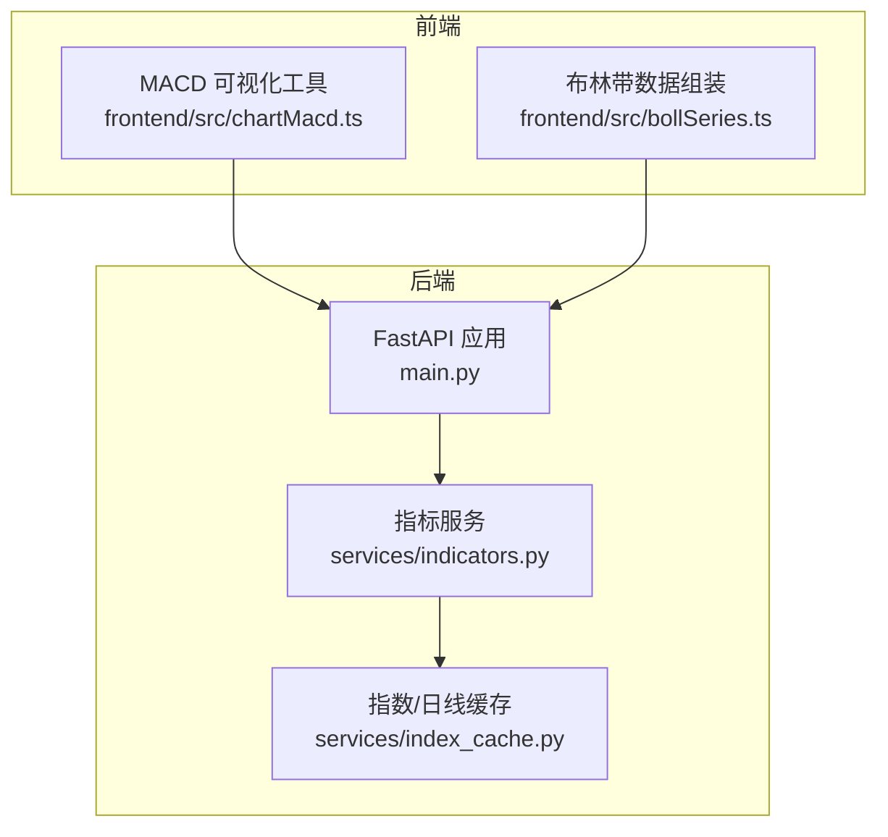
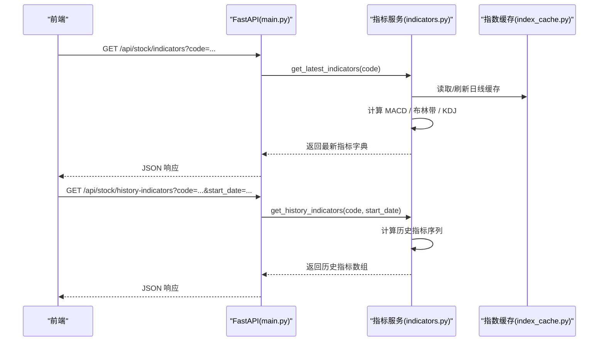
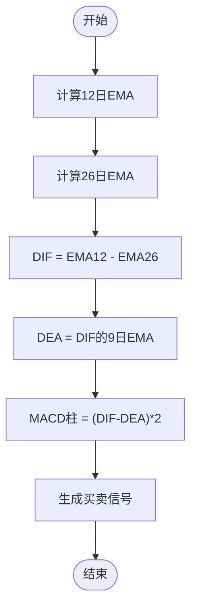
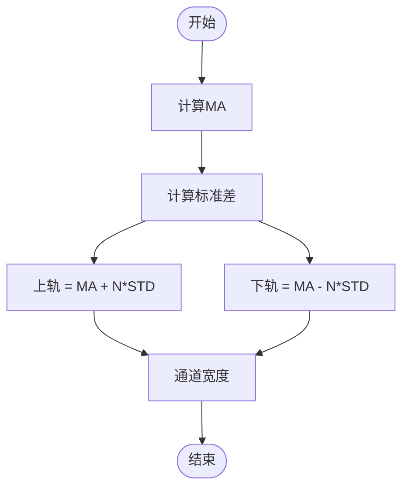
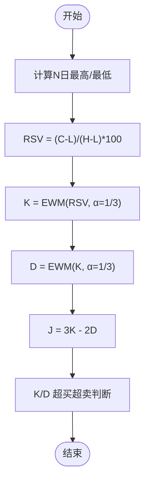
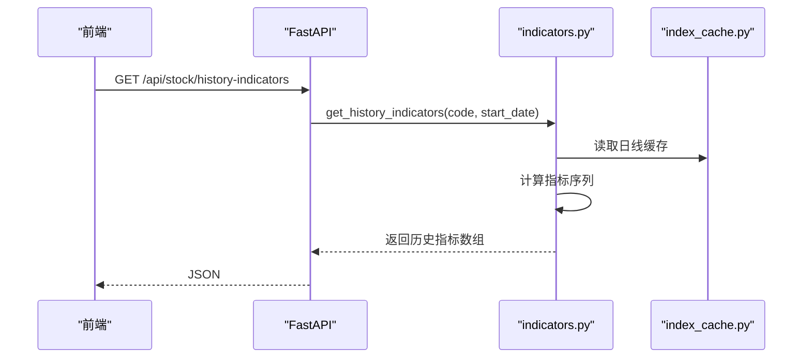
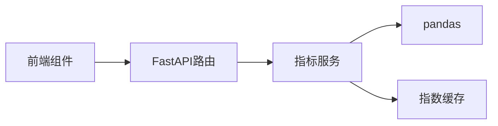

# 技术指标计算

<cite>
**本文引用的文件**
- [indicators.py](file://backend/services/indicators.py)
- [chartMacd.ts](file://frontend/src/chartMacd.ts)
- [bollSeries.ts](file://frontend/src/bollSeries.ts)
- [main.py](file://backend/main.py)
- [index_cache.py](file://backend/services/index_cache.py)
</cite>

## 目录
1. [简介](#简介)
2. [项目结构](#项目结构)
3. [核心组件](#核心组件)
4. [架构总览](#架构总览)
5. [详细组件分析](#详细组件分析)
6. [依赖分析](#依赖分析)
7. [性能考量](#性能考量)
8. [故障排查指南](#故障排查指南)
9. [结论](#结论)
10. [附录](#附录)

## 简介
本文件面向技术指标计算模块，系统性阐述MACD、布林带、KDJ等核心指标的数学公式与实现逻辑，详解指数移动平均线(EMA)与简单移动平均线(SMA)的计算方法与适用场景，并结合后端服务与前端可视化组件，给出完整的数据处理流程、性能优化建议与数值稳定性注意事项。目标读者包括后端工程师、量化分析师与前端开发者。

## 项目结构
技术指标计算位于后端服务层，通过FastAPI接口对外提供最新指标与历史指标查询能力；前端通过ECharts渲染MACD柱状图与布林带通道。

**图表来源**
- [main.py:110-168](file://backend/main.py#L110-L168)
- [indicators.py:1495-1641](file://backend/services/indicators.py#L1495-L1641)
- [index_cache.py:102-152](file://backend/services/index_cache.py#L102-L152)
- [chartMacd.ts:1-71](file://frontend/src/chartMacd.ts#L1-71)
- [bollSeries.ts:1-34](file://frontend/src/bollSeries.ts#L1-L34)

**章节来源**
- [main.py:110-168](file://backend/main.py#L110-L168)
- [indicators.py:1495-1641](file://backend/services/indicators.py#L1495-L1641)

## 核心组件
- 指标计算函数族
  - MACD：快线(DIF)、慢线(DEA)、柱状图(MACD)
  - 布林带：中轨(MA)、上轨(UB)、下轨(LB)
  - KDJ：RSV、K值、D值、J值
- 数据接入与缓存
  - 历史行情数据来源与本地缓存策略
- API接口
  - 最新指标查询与历史指标查询
- 前端可视化
  - MACD柱面积计算与提示信息
  - 布林带通道数据组装

**章节来源**
- [indicators.py:657-688](file://backend/services/indicators.py#L657-L688)
- [indicators.py:1495-1641](file://backend/services/indicators.py#L1495-L1641)
- [chartMacd.ts:1-71](file://frontend/src/chartMacd.ts#L1-L71)
- [bollSeries.ts:1-34](file://frontend/src/bollSeries.ts#L1-L34)

## 架构总览
后端以FastAPI提供REST接口，指标计算基于pandas进行向量化运算；前端通过接口获取指标数据并渲染图表。

**图表来源**
- [main.py:110-168](file://backend/main.py#L110-L168)
- [indicators.py:1495-1641](file://backend/services/indicators.py#L1495-L1641)
- [index_cache.py:102-152](file://backend/services/index_cache.py#L102-L152)

## 详细组件分析

### 指标计算函数族
- MACD
  - 快线(DIF)：12日EMA - 26日EMA
  - 慢线(DEA)：DIF的9日EMA
  - 柱状图(MACD)：(DIF - DEA) × 2
- 布林带
  - 中轨(MA)：收盘价的N日简单移动平均
  - 上轨(UB)：MA + N×标准差
  - 下轨(LB)：MA - N×标准差
- KDJ
  - RSV = (收盘 - N日最低) / (N日最高 - N日最低) × 100
  - K = RSV的α=1/3的指数平滑
  - D = K的α=1/3的指数平滑
  - J = 3K - 2D

上述公式均通过pandas的ewm与rolling实现，参数adjust=False，确保与常见实现一致。

**章节来源**
- [indicators.py:657-688](file://backend/services/indicators.py#L657-L688)

### EMA与SMA的实现与应用
- EMA(指数移动平均)
  - 使用pandas的ewm(span, adjust=False)实现
  - 适用于对近期价格变化更敏感的场景，如MACD快线与慢线
- SMA(简单移动平均)
  - 使用pandas的rolling(window, min_periods).mean实现
  - 适用于需要稳定趋势识别的场景，如布林带中轨

**章节来源**
- [indicators.py:657-671](file://backend/services/indicators.py#L657-L671)

### MACD计算步骤与信号含义
- 步骤
  1) 计算短期与长期EMA
  2) DIF = 短期EMA - 长期EMA
  3) DEA = DIF的9日EMA
  4) MACD柱 = (DIF - DEA) × 2
- 信号
  - 金叉/死叉：DIF上穿/下穿DEA
  - 柱状图变化：柱面积放大/缩小反映动能强弱
  - 顶背离/底背离：价格与MACD柱趋势相反

**图表来源**
- [indicators.py:657-663](file://backend/services/indicators.py#L657-L663)

**章节来源**
- [indicators.py:657-663](file://backend/services/indicators.py#L657-L663)
- [chartMacd.ts:18-43](file://frontend/src/chartMacd.ts#L18-L43)

### 布林带计算与价格通道分析
- 步骤
  1) 计算MA与标准差
  2) 上轨 = MA + N×标准差
  3) 下轨 = MA - N×标准差
- 原理
  - 价格在通道内波动，突破上轨/下轨可能预示趋势延续或反转
  - 带宽(上轨-下轨)/MA反映波动率

**图表来源**
- [indicators.py:666-671](file://backend/services/indicators.py#L666-L671)

**章节来源**
- [indicators.py:666-671](file://backend/services/indicators.py#L666-L671)
- [bollSeries.ts:3-20](file://frontend/src/bollSeries.ts#L3-L20)

### KDJ随机指标计算与超买超卖判断
- 步骤
  1) 计算N日最高/最低
  2) RSV = (close-min)/(max-min)×100
  3) K = EWM(RSV, α=1/3)
  4) D = EWM(K, α=1/3)
  5) J = 3K - 2D
- 判断
  - 超买：K/D > 80
  - 超卖：K/D < 20
  - 金叉/死叉：K上穿/下穿D

**图表来源**
- [indicators.py:674-688](file://backend/services/indicators.py#L674-L688)

**章节来源**
- [indicators.py:674-688](file://backend/services/indicators.py#L674-L688)

### 数据接入与缓存策略
- 数据来源
  - A股/ETF/指数：新浪日线接口
  - 港股日线：AKShare接口
- 缓存策略
  - 严格本地优先：仅在force_refresh或本地不存在时访问线上
  - 指数/日线分别缓存，避免复权方式混用
  - 港股日线单独缓存文件命名

**章节来源**
- [index_cache.py:102-152](file://backend/services/index_cache.py#L102-L152)
- [index_cache.py:177-201](file://backend/services/index_cache.py#L177-L201)

### API接口与数据流
- 最新指标
  - 接口：GET /api/stock/indicators
  - 输入：股票代码
  - 输出：最新日期的MACD、布林带、KDJ指标
- 历史指标
  - 接口：GET /api/stock/history-indicators
  - 输入：股票代码、起始日期
  - 输出：从起始日期开始的历史指标序列
- K线与指标
  - 接口：GET /api/index/kline
  - 支持日线/60分钟/15分钟周期，返回K线与衍生字段

**图表来源**
- [main.py:124-137](file://backend/main.py#L124-L137)
- [indicators.py:1569-1641](file://backend/services/indicators.py#L1569-L1641)
- [index_cache.py:102-152](file://backend/services/index_cache.py#L102-L152)

**章节来源**
- [main.py:110-168](file://backend/main.py#L110-L168)
- [indicators.py:1495-1641](file://backend/services/indicators.py#L1495-L1641)

### 前端可视化与交互
- MACD柱面积
  - 通过遍历区间内MACD柱的负值绝对值求和，用于衡量背离强度
- 提示信息
  - 展示DIF、DEA、MACD数值，格式化显示
- 布林带
  - 组装下轨、带宽、中轨数据，参与主图y轴极值计算

**章节来源**
- [chartMacd.ts:7-70](file://frontend/src/chartMacd.ts#L7-L70)
- [bollSeries.ts:3-33](file://frontend/src/bollSeries.ts#L3-L33)

## 依赖分析
- 指标服务依赖pandas进行向量化计算，依赖指数缓存服务提供历史行情
- FastAPI路由依赖指标服务进行业务处理
- 前端组件依赖后端接口返回的数据结构

**图表来源**
- [main.py:110-168](file://backend/main.py#L110-L168)
- [indicators.py:1495-1641](file://backend/services/indicators.py#L1495-L1641)
- [index_cache.py:102-152](file://backend/services/index_cache.py#L102-L152)

**章节来源**
- [main.py:110-168](file://backend/main.py#L110-L168)
- [indicators.py:1495-1641](file://backend/services/indicators.py#L1495-L1641)

## 性能考量
- 向量化计算
  - 使用pandas ewm与rolling进行批量计算，避免Python循环，显著提升吞吐
- 缓存与重试
  - 指数/日线缓存严格本地优先，减少网络IO
  - 拉取接口增加轻量重试，降低瞬时网络抖动影响
- 时间窗口与样本
  - 历史指标计算前确保足够样本长度，避免滚动窗口不足导致的NaN
- 数值稳定性
  - 使用adjust=False的EMA，避免调整因子带来的差异
  - 对滚动窗口设置min_periods，保证首个窗口有效

**章节来源**
- [indicators.py:1495-1641](file://backend/services/indicators.py#L1495-L1641)
- [index_cache.py:102-152](file://backend/services/index_cache.py#L102-L152)
- [indicators.py:234-248](file://backend/services/indicators.py#L234-L248)

## 故障排查指南
- 数据缺失
  - 检查历史数据长度是否满足指标计算需求
  - 确认字段完整性（date/open/high/low/close/volume）
- 网络异常
  - 关注拉取接口的重试机制与回退策略
  - 港股60分钟优先AKShare，失败回退yfinance
- 缓存一致性
  - 强制刷新时清理缓存并重新拉取
  - 本地CSV更新后触发响应缓存失效
- 数值异常
  - 检查滚动窗口min_periods与span配置
  - 注意除零风险（KDJ分母为0时的边界处理）

**章节来源**
- [indicators.py:1495-1641](file://backend/services/indicators.py#L1495-L1641)
- [indicators.py:176-187](file://backend/services/indicators.py#L176-L187)
- [indicators.py:359-444](file://backend/services/indicators.py#L359-L444)

## 结论
本模块以pandas为核心实现了MACD、布林带、KDJ等主流技术指标，结合指数缓存与FastAPI接口，提供了高效、稳定的指标计算与查询能力。前端通过直观的可视化组件呈现指标信号，辅助投资决策。建议在生产环境中持续关注缓存策略与数值稳定性，并根据业务需求扩展更多指标与可视化维度。

## 附录
- 指标参数
  - MACD：短期=12，长期=26，信号=9
  - 布林带：周期=20，标准差倍数=2.0
  - KDJ：周期=9，K平滑α=1/3，D平滑α=1/3
- 数据字段
  - 指标服务返回字段：date、close、volume、macd、boll、kdj
  - 前端消费字段：macd.macd、boll.{upper,middle,lower}、kdj.{k,d,j}