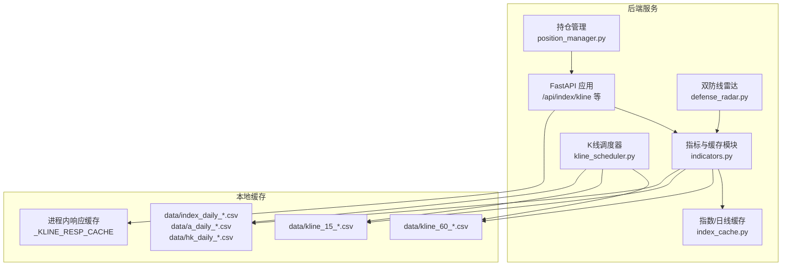
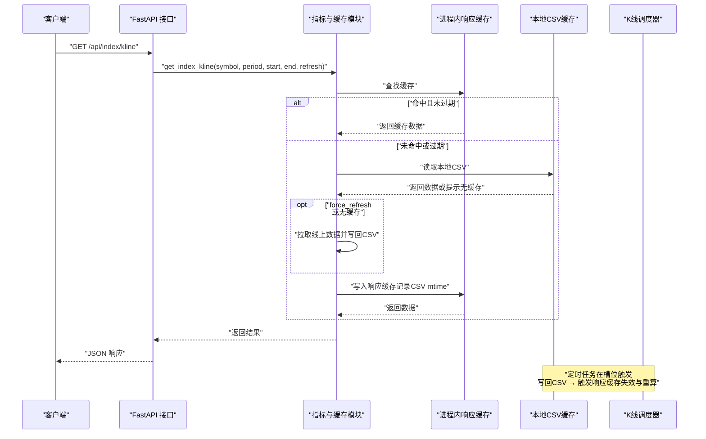
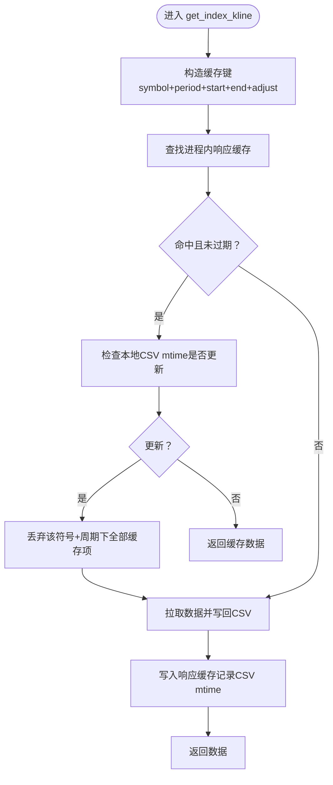
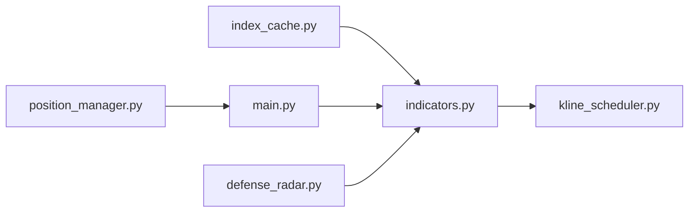

# 数据缓存系统

<cite>
**本文引用的文件**
- [backend/main.py](file://backend/main.py)
- [backend/services/indicators.py](file://backend/services/indicators.py)
- [backend/services/index_cache.py](file://backend/services/index_cache.py)
- [backend/services/kline_scheduler.py](file://backend/services/kline_scheduler.py)
- [backend/services/defense_radar.py](file://backend/services/defense_radar.py)
- [backend/services/position_manager.py](file://backend/services/position_manager.py)
- [backend/data/watchlist.json](file://backend/data/watchlist.json)
- [backend/data/observation.json](file://backend/data/observation.json)
- [update_data.py](file://update_data.py)
- [update_data.sh](file://update_data.sh)
</cite>

## 目录
1. [简介](#简介)
2. [项目结构](#项目结构)
3. [核心组件](#核心组件)
4. [架构总览](#架构总览)
5. [详细组件分析](#详细组件分析)
6. [依赖分析](#依赖分析)
7. [性能考量](#性能考量)
8. [故障排查指南](#故障排查指南)
9. [结论](#结论)
10. [附录](#附录)

## 简介
本技术文档围绕数据缓存系统展开，重点解释以下内容：
- 进程内响应缓存机制的设计与实现，包括缓存键值设计、生命周期管理、TTL 与容量控制。
- 以本地文件 mtime 为依据的失效策略与缓存更新触发机制。
- K线数据的多级缓存结构：日线、60分钟、15分钟的独立缓存与同步策略。
- 与数据源的同步机制与一致性保障。
- 性能优化最佳实践、监控指标与故障恢复。

## 项目结构
系统采用“后端服务 + 定时调度 + 前端 API”的分层架构。数据缓存主要分布在：
- 指数/日线本地缓存：CSV 文件存储，统一通过指数/日线缓存模块管理。
- K线多周期缓存：60分钟与15分钟分别独立缓存，各自具备独立的本地 CSV 与进程内响应缓存。
- 定时调度器：负责在固定时间槽位拉取并写回本地缓存，驱动响应缓存失效与重算。
- 前端 API：对外提供 K线与雷达等接口，内部调用指标与缓存模块。

图表来源
- [backend/main.py:140-168](file://backend/main.py#L140-L168)
- [backend/services/indicators.py:27-91](file://backend/services/indicators.py#L27-L91)
- [backend/services/index_cache.py:16](file://backend/services/index_cache.py#L16)
- [backend/services/kline_scheduler.py:131-176](file://backend/services/kline_scheduler.py#L131-L176)

章节来源
- [backend/main.py:140-168](file://backend/main.py#L140-L168)
- [backend/services/indicators.py:27-91](file://backend/services/indicators.py#L27-L91)
- [backend/services/index_cache.py:16](file://backend/services/index_cache.py#L16)
- [backend/services/kline_scheduler.py:131-176](file://backend/services/kline_scheduler.py#L131-L176)

## 核心组件
- 指数/日线本地缓存模块：负责 A 股/ETF/指数/港股的日线 CSV 缓存与读取，严格本地优先策略。
- K线多周期缓存模块：负责 60 分钟与 15 分钟 K线的本地 CSV 缓存、进程内响应缓存、以及按 mtime 的失效与重算。
- K线调度器：定时拉取并写回本地缓存，驱动响应缓存失效与重算，提供健康状态查询与 SSE 广播。
- 双防线雷达：依赖本地日线与60分钟缓存进行实时分析，输出 Markdown 与 last_summary.json。
- 前端 API：提供 K线查询、雷达摘要、调度状态等接口。

章节来源
- [backend/services/index_cache.py:102-200](file://backend/services/index_cache.py#L102-L200)
- [backend/services/indicators.py:88-174](file://backend/services/indicators.py#L88-L174)
- [backend/services/kline_scheduler.py:131-256](file://backend/services/kline_scheduler.py#L131-L256)
- [backend/services/defense_radar.py:147-165](file://backend/services/defense_radar.py#L147-L165)

## 架构总览
系统通过定时任务在固定时间槽位拉取并写回本地缓存，前端请求优先命中进程内响应缓存；当本地 CSV 的 mtime 发生变化时，触发对应周期的响应缓存失效与重算。指数/日线、60分钟、15分钟三类缓存相互独立，互不影响。

图表来源
- [backend/main.py:140-168](file://backend/main.py#L140-L168)
- [backend/services/indicators.py:149-174](file://backend/services/indicators.py#L149-L174)
- [backend/services/kline_scheduler.py:211-256](file://backend/services/kline_scheduler.py#L211-L256)

## 详细组件分析

### 进程内响应缓存机制
- 缓存结构：以符号+周期+起止日期+复权方式为键，存储响应体与“写入时本地 CSV 的 mtime”。键设计确保不同周期、不同复权策略的缓存完全隔离。
- TTL 与容量：默认 TTL 为固定秒数，最大条目数固定上限；超出容量时按最旧条目淘汰，避免进程常驻导致内存膨胀。
- 失效策略：每次命中缓存时检查当前 CSV 的 mtime 是否较缓存记录更新；若更新则丢弃该符号+周期下的全部响应缓存，触发重算。
- 适用范围：日线与 60 分钟分别独立缓存，15 分钟缓存与 60 分钟缓存相互独立。

图表来源
- [backend/services/indicators.py:88-174](file://backend/services/indicators.py#L88-L174)
- [backend/services/indicators.py:93-138](file://backend/services/indicators.py#L93-L138)

章节来源
- [backend/services/indicators.py:88-174](file://backend/services/indicators.py#L88-L174)
- [backend/services/indicators.py:93-138](file://backend/services/indicators.py#L93-L138)

### 按本地文件 mtime 失效策略与更新触发机制
- 触发条件：当本地 CSV 的 mtime 比缓存记录保存的 mtime 更新时，视为数据已更新，触发该符号+周期下的响应缓存失效。
- 影响范围：日线 CSV 更新仅影响日线响应缓存；60 分钟 CSV 更新仅影响 60 分钟响应缓存；15 分钟 CSV 更新仅影响 15 分钟响应缓存。
- 自动触发：定时任务在槽位写回 CSV 后，后续请求在命中缓存时检查 mtime，从而自动触发重算。

章节来源
- [backend/services/kline_scheduler.py:131-176](file://backend/services/kline_scheduler.py#L131-L176)
- [backend/services/indicators.py:93-138](file://backend/services/indicators.py#L93-L138)

### K线数据缓存的多级结构
- 日线缓存
  - 本地 CSV：按指数/沪深/深市/ETF/港股分别存储，文件名包含锚定日期，仅返回锚定日期之后的数据。
  - 进程内响应缓存：按符号+周期+起止日期+复权方式键缓存，TTL 与容量限制。
- 60 分钟缓存
  - 本地 CSV：独立文件，包含原始 OHLCV，用于网络抖动兜底。
  - 进程内响应缓存：独立 TTL 与容量控制，按 mtime 失效。
- 15 分钟缓存
  - 本地 CSV：独立文件，包含原始 OHLCV。
  - 进程内响应缓存：独立 TTL 与容量控制，按 mtime 失效。

章节来源
- [backend/services/index_cache.py:102-200](file://backend/services/index_cache.py#L102-L200)
- [backend/services/indicators.py:251-357](file://backend/services/indicators.py#L251-L357)

### 缓存键值设计与生命周期管理
- 键值设计：(symbol, period, start_date, end_date, adjust)。period 包括 daily、60、15；adjust 为复权方式（指数/ETF 无复权，A 股/港股按规则确定）。
- 生命周期：
  - 创建：首次命中或强制刷新时写入，记录写入时刻与当时 CSV 的 mtime。
  - 访问：命中返回；若 TTL 过期或 mtime 更新则丢弃。
  - 淘汰：容量超限按最旧条目淘汰；TTL 过期自动清理。

章节来源
- [backend/services/indicators.py:88-174](file://backend/services/indicators.py#L88-L174)

### 缓存容量限制与淘汰策略
- 容量上限：固定最大条目数，超出时按最旧条目淘汰，确保内存占用可控。
- 淘汰触发：容量超限时触发；TTL 过期也会触发清理。
- LRU 特性：通过“写入时刻”作为键值的一部分，配合容量淘汰，实现近似 LRU 的效果。

章节来源
- [backend/services/indicators.py:88-174](file://backend/services/indicators.py#L88-L174)

### 缓存与数据源的同步机制与一致性
- 同步来源：
  - 日线：新浪接口（指数/ETF/A 股/港股），CSV 文件按锚定日期存储。
  - 60 分钟：新浪接口（指数/ETF/A 股/港股），CSV 文件独立存储。
  - 15 分钟：新浪接口（指数/ETF/A 股/港股），CSV 文件独立存储。
- 同步策略：定时任务在固定槽位拉取并写回本地 CSV；前端请求严格本地优先，force_refresh 时才强制拉取线上并写回。
- 一致性保障：通过 mtime 失效与重算，确保前端读取到最新数据；雷达与止损检查依赖本地缓存，避免线上抖动影响。

章节来源
- [backend/services/index_cache.py:102-200](file://backend/services/index_cache.py#L102-L200)
- [backend/services/indicators.py:359-444](file://backend/services/indicators.py#L359-L444)
- [backend/services/kline_scheduler.py:131-176](file://backend/services/kline_scheduler.py#L131-L176)

### 缓存配置参数与调优建议
- 响应缓存 TTL：固定秒数，建议根据前端刷新频率与数据时效需求调整。
- 响应缓存最大条目：固定上限，建议根据并发量与内存资源评估调优。
- 定时槽位：
  - 主槽位：10:31/11:31/14:01/15:01（60 分钟 + 雷达），16:01（日线 + 60 分钟 + 雷达）。
  - 15 分钟独立槽位：交易时间内每根 K 线结束后 1 分钟触发。
- 调优建议：
  - 提高 60 分钟与 15 分钟的定时频率可降低盘中延迟，但会增加网络与磁盘 IO。
  - 合理设置 TTL 与最大条目，平衡内存占用与命中率。
  - 对高频访问的符号可考虑预热缓存，减少首次请求延迟。

章节来源
- [backend/services/indicators.py:28](file://backend/services/indicators.py#L28)
- [backend/services/indicators.py:88](file://backend/services/indicators.py#L88)
- [backend/services/kline_scheduler.py:39-46](file://backend/services/kline_scheduler.py#L39-L46)
- [backend/services/kline_scheduler.py:114-119](file://backend/services/kline_scheduler.py#L114-L119)

## 依赖分析
- 指数/日线缓存模块依赖 pandas 与 requests，负责 CSV 读写与网络拉取。
- 指数与 K线缓存模块共同依赖本地 CSV 文件，响应缓存模块依赖指数/日线缓存模块提供的 CSV 路径与读取方法。
- 定时调度器依赖指标与缓存模块，负责批量写回本地 CSV 并触发响应缓存失效。
- 前端 API 依赖指标与缓存模块，提供 K线查询与雷达摘要接口。

图表来源
- [backend/services/index_cache.py:17-25](file://backend/services/index_cache.py#L17-L25)
- [backend/services/indicators.py:17-25](file://backend/services/indicators.py#L17-L25)
- [backend/main.py:17-18](file://backend/main.py#L17-L18)
- [backend/services/defense_radar.py:27](file://backend/services/defense_radar.py#L27)

章节来源
- [backend/services/index_cache.py:17-25](file://backend/services/index_cache.py#L17-L25)
- [backend/services/indicators.py:17-25](file://backend/services/indicators.py#L17-L25)
- [backend/main.py:17-18](file://backend/main.py#L17-L18)
- [backend/services/defense_radar.py:27](file://backend/services/defense_radar.py#L27)

## 性能考量
- 命中优先：严格本地优先策略，减少网络请求与解析开销。
- 响应缓存：显著降低重复请求的计算与 IO 成本，TTL 与容量控制避免内存膨胀。
- 独立缓存：日线、60 分钟、15 分钟缓存相互独立，避免互相影响，提高并发吞吐。
- 定时同步：集中式批量写回，降低频繁小规模 IO 的开销。
- 监控与健康检查：调度器提供状态文件与心跳，便于运维监控与故障定位。

## 故障排查指南
- 调度器健康状态
  - 通过接口查询调度器状态，包含存活、心跳年龄、下次调度时间、槽位执行次数等。
  - 多 worker 环境下优先读取共享状态文件，避免误判。
- SSE 广播
  - 调度完成后通过 SSE 推送雷达更新事件，前端可订阅实时更新。
- 手动触发同步
  - 提供脚本与命令行工具，手动触发 60 分钟数据同步与雷达摘要生成。
- 常见问题
  - 缓存未更新：确认定时槽位是否执行，检查 CSV mtime 是否更新。
  - 数据缺失：检查 CSV 文件是否存在、字段是否完整、日期范围是否正确。
  - 网络抖动：60 分钟与 15 分钟缓存提供本地 CSV 兜底，确保稳定性。

章节来源
- [backend/services/kline_scheduler.py:410-445](file://backend/services/kline_scheduler.py#L410-L445)
- [backend/main.py:28-51](file://backend/main.py#L28-L51)
- [update_data.py:32-78](file://update_data.py#L32-L78)
- [update_data.sh:21-46](file://update_data.sh#L21-L46)

## 结论
本缓存系统通过“本地 CSV + 进程内响应缓存”的两级缓存结构，结合定时任务与 mtime 失效策略，实现了高效、可靠、可扩展的 K线数据缓存。日线、60 分钟、15 分钟缓存相互独立，既保证了数据一致性，又提升了系统整体性能与可维护性。通过合理的 TTL 与容量控制、定时槽位与 SSE 广播，系统在生产环境中具备良好的稳定性与可观测性。

## 附录
- 监控指标建议
  - 调度器：存活状态、心跳年龄、下次调度时间、槽位执行次数。
  - 缓存命中率：命中次数 / 总请求次数。
  - 缓存条目数：当前响应缓存条目数与最大容量比。
  - CSV 更新频率：各周期 CSV 的更新次数与时延。
- 配置参数一览
  - 响应缓存 TTL：固定秒数。
  - 响应缓存最大条目：固定上限。
  - 定时槽位：主槽位与 15 分钟独立槽位。
- 手动触发
  - Python 脚本与 Shell 脚本均可手动触发 60 分钟数据同步与雷达摘要生成。

章节来源
- [backend/services/indicators.py:28](file://backend/services/indicators.py#L28)
- [backend/services/indicators.py:88](file://backend/services/indicators.py#L88)
- [backend/services/kline_scheduler.py:39-46](file://backend/services/kline_scheduler.py#L39-L46)
- [backend/services/kline_scheduler.py:114-119](file://backend/services/kline_scheduler.py#L114-L119)
- [update_data.py:32-78](file://update_data.py#L32-L78)
- [update_data.sh:21-46](file://update_data.sh#L21-L46)