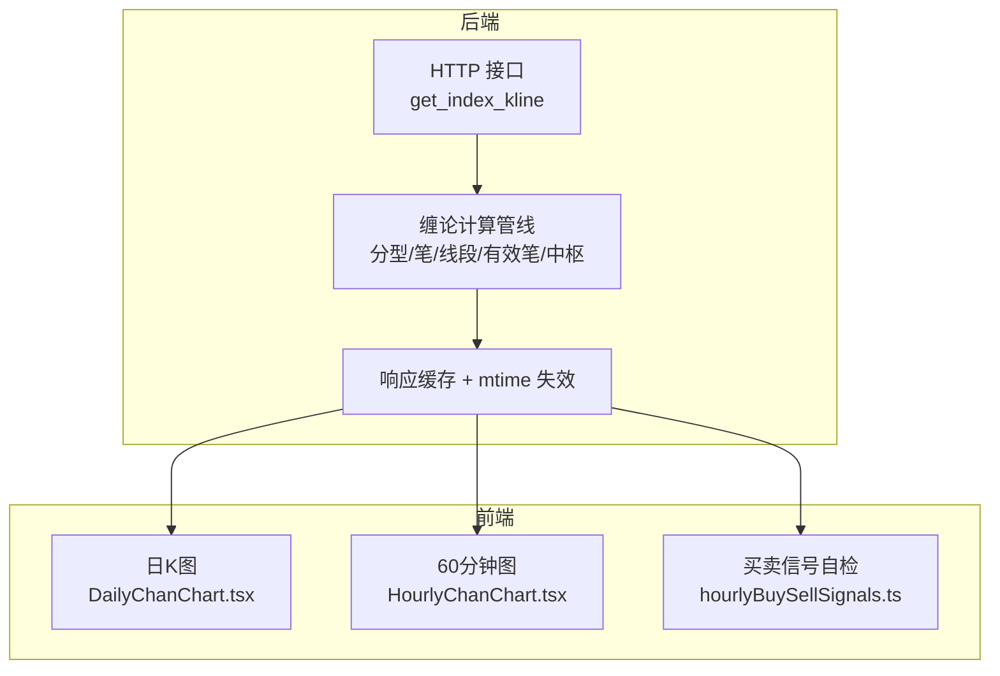
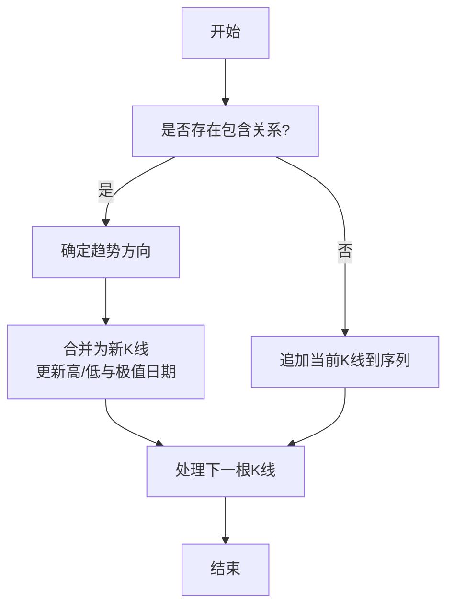
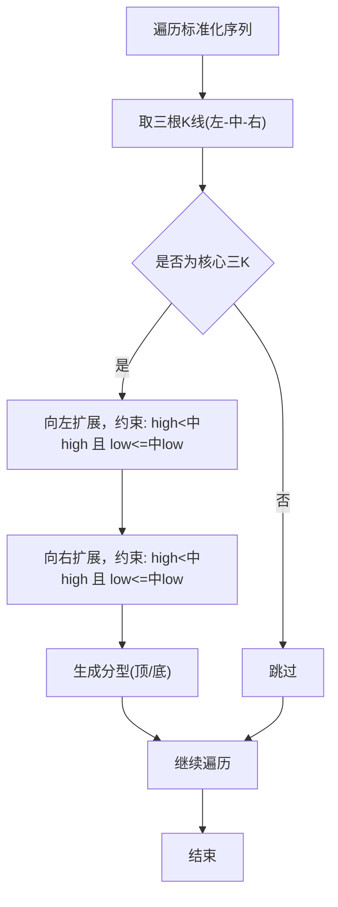
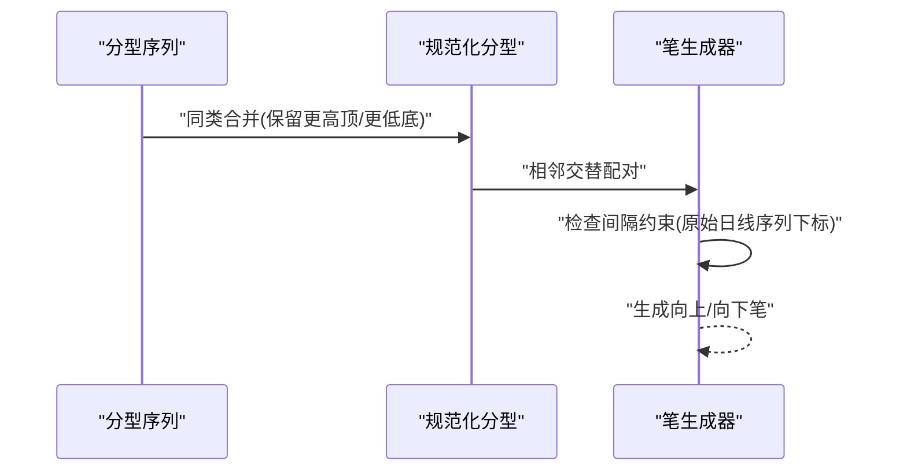
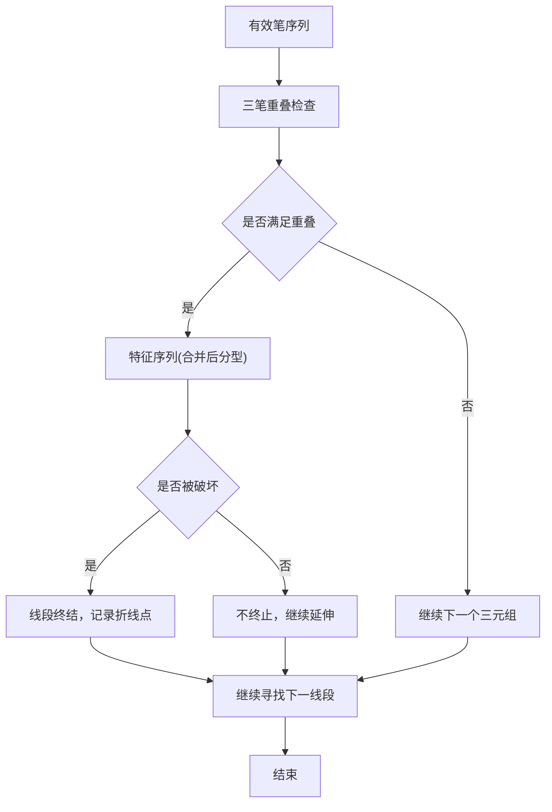
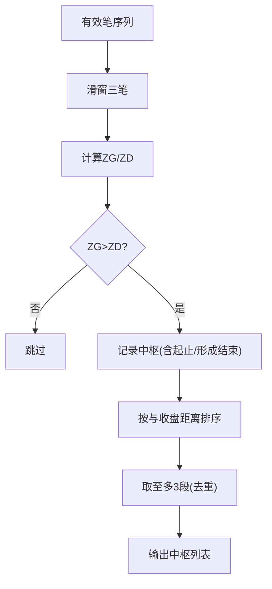
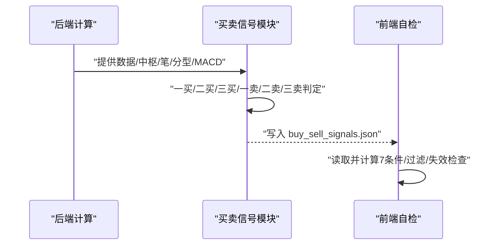
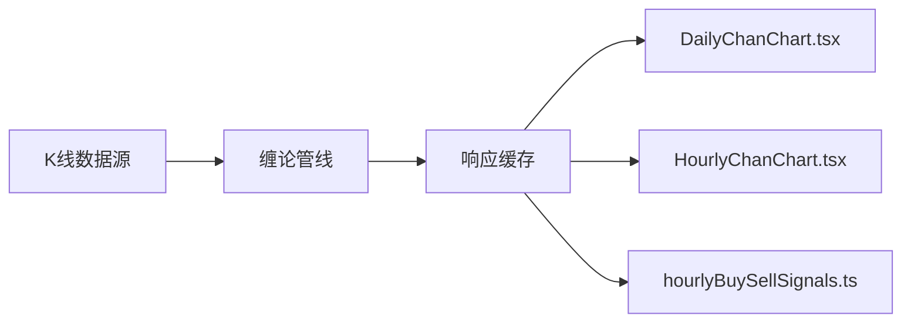

# 缠论理论分析

<cite>
**本文引用的文件**
- [README.md](file://README.md)
- [indicators.py](file://backend/services/indicators.py)
- [buy_sell_signals.py](file://backend/services/buy_sell_signals.py)
- [DailyChanChart.tsx](file://frontend/src/DailyChanChart.tsx)
- [HourlyChanChart.tsx](file://frontend/src/HourlyChanChart.tsx)
- [hourlyBuySellSignals.ts](file://frontend/src/hourlyBuySellSignals.ts)
- [test_defense_radar_trigger.py](file://backend/tests/test_defense_radar_trigger.py)
</cite>

## 目录
1. [简介](#简介)
2. [项目结构](#项目结构)
3. [核心组件](#核心组件)
4. [架构总览](#架构总览)
5. [详细组件分析](#详细组件分析)
6. [依赖关系分析](#依赖关系分析)
7. [性能考量](#性能考量)
8. [故障排查指南](#故障排查指南)
9. [结论](#结论)
10. [附录](#附录)

## 简介
本文件面向“缠论理论分析模块”，系统阐述分型、笔、线段、中枢的定义与识别规则，K线包含关系处理与标准化序列生成流程，上升/下降走势判定与趋势方向判断方法，中枢形成机制、级别划分与扩展规则，以及买卖点识别原理（含背驰、分背等）。文档同时给出与实际股票分析的结合方式、与其他技术分析方法的差异与优势、适用性与局限性，并说明如何将分析结果与技术指标协同使用。

## 项目结构
后端通过统一的 K 线接口提供日线/60分钟/15分钟数据，并在内存中完成缠论计算（分型→笔→线段→有效笔→中枢），同时叠加 MACD/BOLL 指标。前端分别渲染日 K 图与 60 分钟图，展示缠论要素与买卖信号自检条件。

**图表来源**
- [README.md:33-64](file://README.md#L33-L64)
- [indicators.py:1644-1947](file://backend/services/indicators.py#L1644-L1947)

**章节来源**
- [README.md:33-64](file://README.md#L33-L64)
- [README.md:86-109](file://README.md#L86-L109)

## 核心组件
- K 线包含关系处理与标准化序列生成：合并包含关系、方向判定、极值日期映射。
- 分型识别：核心三K判定与左右扩展规则，支持顶/底分型。
- 笔生成：基于交替类型分型配对，间隔约束与方向定义。
- 线段构建：三笔有效笔价域重叠与特征序列破坏条件。
- 中枢构造：三笔有效笔价域满足 ZG/ZD 规则，按与最新收盘距离排序取至多3段。
- 买卖信号：一买/二买/三买、一卖/二卖/三卖的判定与失效检查，结合 MACD/BOLL 等指标进行过滤。

**章节来源**
- [indicators.py:781-833](file://backend/services/indicators.py#L781-L833)
- [indicators.py:836-931](file://backend/services/indicators.py#L836-L931)
- [indicators.py:991-1041](file://backend/services/indicators.py#L991-L1041)
- [indicators.py:1209-1319](file://backend/services/indicators.py#L1209-L1319)
- [indicators.py:1429-1492](file://backend/services/indicators.py#L1429-L1492)
- [buy_sell_signals.py:581-886](file://backend/services/buy_sell_signals.py#L581-L886)

## 架构总览
缠论分析在后端完成，核心流程如下：拉取 K 线 → 合并包含关系 → 识别分型 → 生成笔 → 构建线段 → 归并有效笔 → 生成中枢 → 叠加 MACD/BOLL → 响应缓存 → 前端渲染。

**图表来源**
- [README.md:95-99](file://README.md#L95-L99)
- [indicators.py:1883-1939](file://backend/services/indicators.py#L1883-L1939)

## 详细组件分析

### K 线包含关系与标准化序列
- 包含关系判定：两根 K 线的高低区间存在互相包含时即为包含关系。
- 合并策略：按趋势方向（上升/下降）取新的高/低与对应“实际极值”日期，合并成交量。
- 方向判定：基于最近两根标准化 K 线的高低关系，或以收盘价为准。
- 极值日期映射：high_date/low_date 用于分型标注与实盘画线一致。

**图表来源**
- [indicators.py:691-700](file://backend/services/indicators.py#L691-L700)
- [indicators.py:781-833](file://backend/services/indicators.py#L781-L833)
- [indicators.py:807-817](file://backend/services/indicators.py#L807-L817)
- [indicators.py:731-778](file://backend/services/indicators.py#L731-L778)

**章节来源**
- [indicators.py:781-833](file://backend/services/indicators.py#L781-L833)
- [indicators.py:731-778](file://backend/services/indicators.py#L731-L778)

### 分型识别规则
- 核心三K：中间K线最高点高于左右，最低点不低于左右；或最低点低于左右，最高点不高于左右。
- 左右扩展：只要两侧连续K线仍满足“中间为极值”的约束，即可扩展到多于3根。
- 日期对齐：顶分型取 high_date，底分型取 low_date，确保与实盘画线一致。

**图表来源**
- [indicators.py:836-931](file://backend/services/indicators.py#L836-L931)
- [indicators.py:920-929](file://backend/services/indicators.py#L920-L929)

**章节来源**
- [indicators.py:836-931](file://backend/services/indicators.py#L836-L931)

### 笔的生成规则
- 类型交替：相邻分型必须类型交替（底→顶 或 顶→底）。
- 间隔约束：两分型中心K线之间至少间隔1根独立K线（按原始日线序列下标判断，避免合并后相邻但中间仍有独立K的情况）。
- 方向定义：向上笔起点为底分型最低点，终点为顶分型最高点；向下笔反之。

**图表来源**
- [indicators.py:934-957](file://backend/services/indicators.py#L934-L957)
- [indicators.py:973-988](file://backend/services/indicators.py#L973-L988)
- [indicators.py:991-1041](file://backend/services/indicators.py#L991-L1041)

**章节来源**
- [indicators.py:934-957](file://backend/services/indicators.py#L934-L957)
- [indicators.py:973-988](file://backend/services/indicators.py#L973-L988)
- [indicators.py:991-1041](file://backend/services/indicators.py#L991-L1041)

### 线段构建与有效笔归并
- 有效笔：方向交替；连续同向笔合并为更极端的一根。
- 线段：至少3根连续交替笔，且三笔经包含处理后仍有价域重叠；上线段以向上笔起始，向下线段以向下笔起始；通过特征序列破坏（支撑/阻力）终止。
- 折线点：沿有效笔端点逐笔转折，避免长弦直连。

**图表来源**
- [indicators.py:1088-1106](file://backend/services/indicators.py#L1088-L1106)
- [indicators.py:1109-1111](file://backend/services/indicators.py#L1109-L1111)
- [indicators.py:1209-1319](file://backend/services/indicators.py#L1209-L1319)

**章节来源**
- [indicators.py:1088-1106](file://backend/services/indicators.py#L1088-L1106)
- [indicators.py:1209-1319](file://backend/services/indicators.py#L1209-L1319)

### 中枢形成机制、级别划分与扩展规则
- 形成条件：三笔有效笔端点价域满足 ZG=min(g)>ZD=max(d)，即三笔合并后存在公共价域。
- 可视结束日：在日线收盘价首次有效离开区间时，结束于此前最后一个仍在区间内的交易日。
- 级别划分：按与最新收盘价距离排序，取至多3段（前端按时间排序标为A/B/C，末段为当前C中枢）。
- 扩展规则：去重（按精度保留 form_end_date 最晚的一条），潜在背驰（离开笔MACD面积小于进入笔）。

**图表来源**
- [indicators.py:1429-1492](file://backend/services/indicators.py#L1429-L1492)
- [indicators.py:1354-1377](file://backend/services/indicators.py#L1354-L1377)
- [indicators.py:1408-1417](file://backend/services/indicators.py#L1408-L1417)

**章节来源**
- [indicators.py:1429-1492](file://backend/services/indicators.py#L1429-L1492)
- [indicators.py:1354-1377](file://backend/services/indicators.py#L1354-L1377)
- [indicators.py:1408-1417](file://backend/services/indicators.py#L1408-L1417)

### 买卖点识别原理与实现
- 一买（趋势底背驰）：至少2个向下中枢，c段创新低（跌破B中枢低点），c段MACD绿柱面积 < b段面积（背驰），底分型确认。
- 二买：回踩c段低点但不创新低，回踩终点有底分型，MACD动能过滤（绿柱面积或黄白线在0轴上方）。
- 三买：暴力突破中枢上沿ZG，突破后存在向下笔回踩，回踩终点严格高于ZG，底分型确认，突破动能校验。
- 一卖/二卖/三卖：与一买/二买/三买对称，结合MACD红柱面积、顶分型与日线防线过滤。

**图表来源**
- [buy_sell_signals.py:581-886](file://backend/services/buy_sell_signals.py#L581-L886)
- [hourlyBuySellSignals.ts:1007-1056](file://frontend/src/hourlyBuySellSignals.ts#L1007-L1056)

**章节来源**
- [buy_sell_signals.py:581-886](file://backend/services/buy_sell_signals.py#L581-L886)
- [hourlyBuySellSignals.ts:1007-1056](file://frontend/src/hourlyBuySellSignals.ts#L1007-L1056)

### 与技术指标的结合
- MACD：用于背驰判定（面积比较）、动能过滤（水上/水下）、顶/底分型确认辅助。
- BOLL：用于超买/超卖与站回中轨的过滤。
- 日线防线：C-ZD/A-ZD 作为宏观过滤与卖点防卖飞依据。

**章节来源**
- [indicators.py:1866-1875](file://backend/services/indicators.py#L1866-L1875)
- [buy_sell_signals.py:687-704](file://backend/services/buy_sell_signals.py#L687-L704)
- [hourlyBuySellSignals.ts:150-178](file://frontend/src/hourlyBuySellSignals.ts#L150-L178)

## 依赖关系分析
- 后端服务依赖：K 线数据源（本地 CSV/网络接口）、指标计算（MACD/BOLL）、缓存与 mtime 失效。
- 前端依赖：后端响应结构（data/fractals/pens/segments/centrals/macd/boll），ECharts 渲染与自检逻辑。

**图表来源**
- [indicators.py:1644-1947](file://backend/services/indicators.py#L1644-L1947)
- [DailyChanChart.tsx:161-200](file://frontend/src/DailyChanChart.tsx#L161-L200)
- [HourlyChanChart.tsx:179-200](file://frontend/src/HourlyChanChart.tsx#L179-L200)

**章节来源**
- [indicators.py:1644-1947](file://backend/services/indicators.py#L1644-L1947)

## 性能考量
- 响应缓存：按 symbol/period/start_date/end_date 缓存，配合本地 CSV mtime 失效，避免重复计算。
- 计算阶段统计：合并K→分型→笔→线段→有效笔→中枢的耗时统计，便于定位瓶颈。
- 数据量控制：中枢仅保留至多3段，降低渲染与计算复杂度。

**章节来源**
- [indicators.py:1662-1683](file://backend/services/indicators.py#L1662-L1683)
- [indicators.py:1909-1916](file://backend/services/indicators.py#L1909-L1916)
- [indicators.py:1930-1939](file://backend/services/indicators.py#L1930-L1939)

## 故障排查指南
- 摘要404：后端未重启或旧进程无新路由。
- 60m 报错“本地缓存不存在”：未跑过定时任务或从未对该 symbol refresh=true。
- 中枢长时间不变：本地 CSV 未更新；或仅命中 TTL 内缓存（港股日线）。
- 一买/二买/三买失效：后续收盘价跌破止损线或结构被破坏。

**章节来源**
- [README.md:255-263](file://README.md#L255-L263)
- [buy_sell_signals.py:800-852](file://backend/services/buy_sell_signals.py#L800-L852)

## 结论
本模块以“合并包含关系→分型→笔→线段→有效笔→中枢”为主线，实现了缠论核心要素的自动化计算，并与 MACD/BOLL 等指标融合，形成可落地的买卖信号判定与可视化展示。其优势在于逻辑清晰、可复现、可缓存、可前后端镜像；局限性在于对数据质量与包含关系处理敏感，需配合日线防线与指标过滤以提升稳健性。

## 附录

### 实际应用示例与代码实现路径
- 日 K 图与中枢展示：[DailyChanChart.tsx:161-200](file://frontend/src/DailyChanChart.tsx#L161-L200)
- 60 分钟图与买卖信号自检：[HourlyChanChart.tsx:179-200](file://frontend/src/HourlyChanChart.tsx#L179-L200)、[hourlyBuySellSignals.ts:1007-1056](file://frontend/src/hourlyBuySellSignals.ts#L1007-L1056)
- 后端缠论计算主流程：[indicators.py:get_index_kline:1644-1947](file://backend/services/indicators.py#L1644-L1947)
- 买卖信号批量计算：[buy_sell_signals.py:compute_and_save_buy_sell_signals:893-942](file://backend/services/buy_sell_signals.py#L893-L942)
- 单元测试验证（含严格末三K底分型与MACD动能）：[test_defense_radar_trigger.py:27-250](file://backend/tests/test_defense_radar_trigger.py#L27-L250)