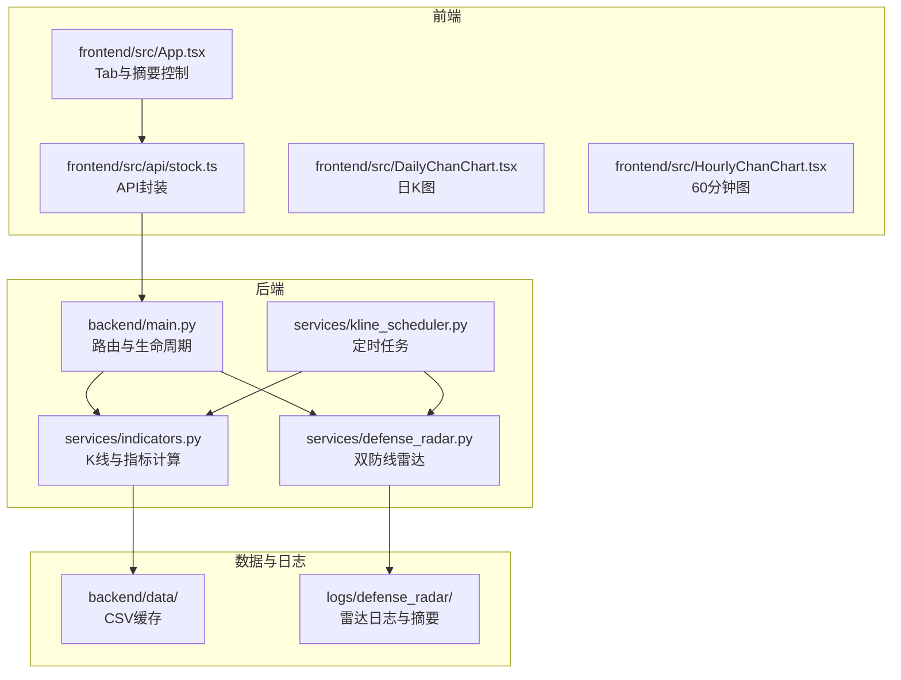
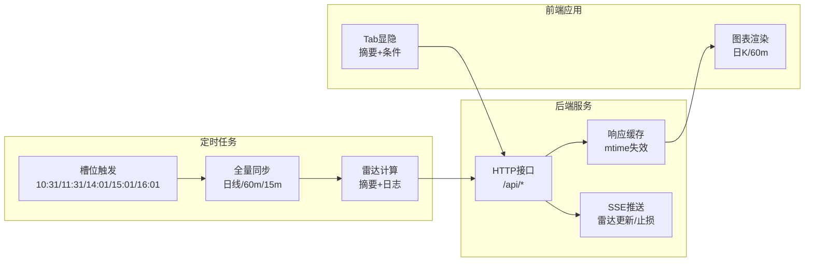
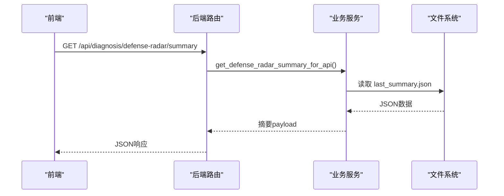
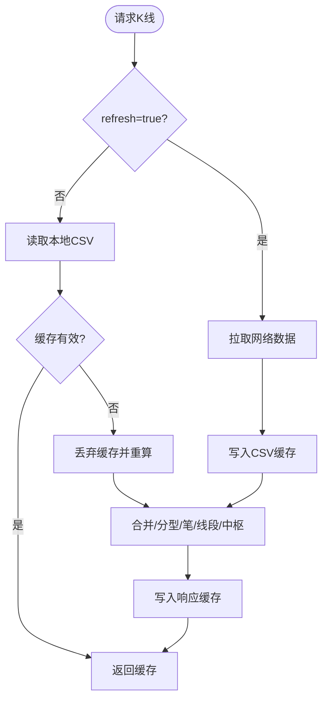
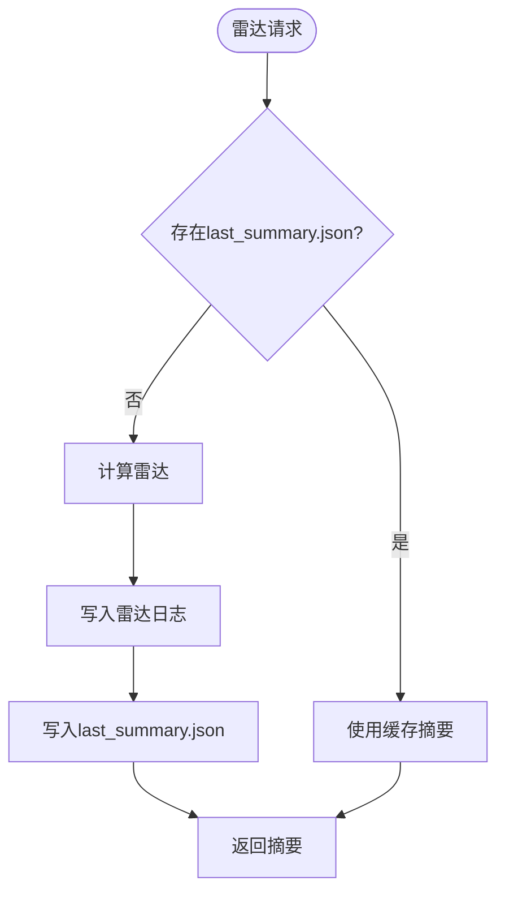
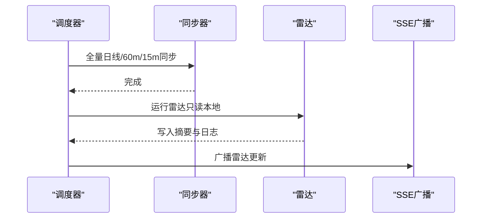
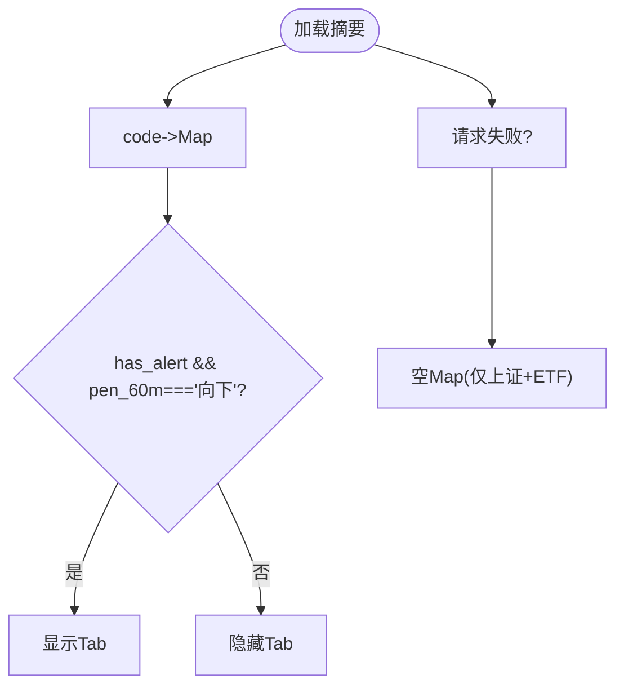
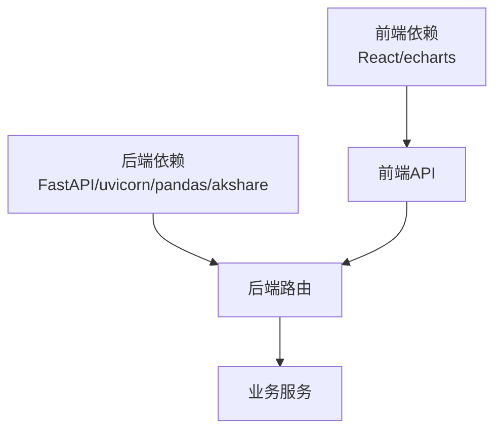

# 故障排查

<cite>
**本文引用的文件**
- [README.md](file://README.md)
- [backend/main.py](file://backend/main.py)
- [backend/services/defense_radar.py](file://backend/services/defense_radar.py)
- [backend/services/indicators.py](file://backend/services/indicators.py)
- [backend/services/kline_scheduler.py](file://backend/services/kline_scheduler.py)
- [backend/run_defense_radar.py](file://backend/run_defense_radar.py)
- [backend/update_radar.py](file://backend/update_radar.py)
- [frontend/src/App.tsx](file://frontend/src/App.tsx)
- [frontend/src/api/stock.ts](file://frontend/src/api/stock.ts)
- [frontend/src/DailyChanChart.tsx](file://frontend/src/DailyChanChart.tsx)
- [frontend/src/HourlyChanChart.tsx](file://frontend/src/HourlyChanChart.tsx)
- [restart_services.sh](file://restart_services.sh)
- [logs/defense_radar/defense_radar_20260424_163228.md](file://logs/defense_radar/defense_radar_20260424_163228.md)
- [logs/defense_radar/last_summary.json](file://logs/defense_radar/last_summary.json)
- [backend/requirements.txt](file://backend/requirements.txt)
- [frontend/package.json](file://frontend/package.json)
</cite>

## 目录
1. [简介](#简介)
2. [项目结构](#项目结构)
3. [核心组件](#核心组件)
4. [架构概览](#架构概览)
5. [详细组件分析](#详细组件分析)
6. [依赖分析](#依赖分析)
7. [性能考虑](#性能考虑)
8. [故障排查指南](#故障排查指南)
9. [结论](#结论)
10. [附录](#附录)

## 简介
本技术文档面向金融分析系统（缠论可视化 + 双防线雷达）的故障排查，聚焦以下关键目标：
- 常见问题诊断与修复：摘要404、有警报的Tab不显示、60m报错等
- 日志分析方法：后端日志、前端日志、雷达日志的查看与解读
- 系统监控：服务状态检查、性能指标监控、告警配置
- 数据问题排查：K线数据缺失、缓存异常、文件权限
- 网络连接问题：API调用失败、数据源连接超时
- 性能问题分析与优化：内存、CPU、响应时间
- 紧急处理流程与恢复策略
- 预防性维护与实施

## 项目结构
系统由后端FastAPI服务、前端React应用、定时任务与雷达组件构成，数据与日志位于logs目录。

**图表来源**
- [backend/main.py:94-252](file://backend/main.py#L94-L252)
- [backend/services/indicators.py:1-120](file://backend/services/indicators.py#L1-L120)
- [backend/services/defense_radar.py:1-120](file://backend/services/defense_radar.py#L1-L120)
- [backend/services/kline_scheduler.py:1-120](file://backend/services/kline_scheduler.py#L1-L120)
- [frontend/src/App.tsx:598-750](file://frontend/src/App.tsx#L598-L750)
- [frontend/src/api/stock.ts:114-130](file://frontend/src/api/stock.ts#L114-L130)

**章节来源**
- [README.md:1-60](file://README.md#L1-L60)

## 核心组件
- 后端FastAPI服务：提供K线、指标、雷达摘要、定时任务状态等接口，支持SSE实时推送
- K线与指标计算：本地CSV优先，响应缓存+mtime失效控制，60m/15m缓存与兜底
- 双防线雷达：基于日线中枢与60m现价的绝对防线扫描，生成摘要与雷达日志
- 定时任务：北京时间槽位同步日线/60m/15m，生成雷达与破位/买卖信号
- 前端应用：Tab显隐策略、雷达摘要请求、图表渲染与交互

**章节来源**
- [backend/main.py:110-252](file://backend/main.py#L110-L252)
- [backend/services/indicators.py:88-174](file://backend/services/indicators.py#L88-L174)
- [backend/services/defense_radar.py:147-165](file://backend/services/defense_radar.py#L147-L165)
- [backend/services/kline_scheduler.py:131-256](file://backend/services/kline_scheduler.py#L131-L256)
- [frontend/src/App.tsx:177-195](file://frontend/src/App.tsx#L177-L195)

## 架构概览
系统采用“后端服务 + 前端应用 + 定时任务 + 雷达”的分层架构，数据流遵循本地优先与响应缓存策略。

**图表来源**
- [backend/services/kline_scheduler.py:39-46](file://backend/services/kline_scheduler.py#L39-L46)
- [backend/services/kline_scheduler.py:211-256](file://backend/services/kline_scheduler.py#L211-L256)
- [backend/main.py:213-252](file://backend/main.py#L213-L252)
- [frontend/src/App.tsx:177-195](file://frontend/src/App.tsx#L177-L195)

## 详细组件分析

### 后端服务与路由
- 生命周期：FastAPI lifespan启动定时任务，优雅关闭时停止定时线程
- 接口清单：K线、指标、雷达摘要、雷达诊断、定时状态、SSE、持仓与观察列表等
- SSE：向客户端推送雷达更新与止损告警

**图表来源**
- [backend/main.py:171-180](file://backend/main.py#L171-L180)
- [backend/services/defense_radar.py:147-165](file://backend/services/defense_radar.py#L147-L165)

**章节来源**
- [backend/main.py:80-91](file://backend/main.py#L80-L91)
- [backend/main.py:110-252](file://backend/main.py#L110-L252)

### K线与指标计算（本地优先与缓存）
- 本地CSV优先：日线CSV、60m CSV、15m CSV
- 响应缓存：按(symbol, period, start_date, end_date)键缓存，mtime失效
- 兜底缓存：60m/15m CSV作为网络抖动兜底
- 重试机制：60m拉取增加轻量重试

**图表来源**
- [backend/services/indicators.py:121-174](file://backend/services/indicators.py#L121-L174)
- [backend/services/indicators.py:251-292](file://backend/services/indicators.py#L251-L292)

**章节来源**
- [backend/services/indicators.py:88-174](file://backend/services/indicators.py#L88-L174)

### 双防线雷达（摘要与日志）
- 输入：日线中枢A-ZD/C-ZD、60m现价（末根收盘）
- 输出：摘要JSON（last_summary.json）与雷达Markdown（defense_radar_YYYYMMDD_HHMMSS.md）
- 条件：绝对防线±1%、有效笔向下、MACD转强、蓝三角、C中枢内、底背驰、BOLL站回中轨
- 889999（梅花2test）：独立watchlist，mock未来K参与计算

**图表来源**
- [backend/services/defense_radar.py:147-165](file://backend/services/defense_radar.py#L147-L165)
- [backend/services/defense_radar.py:747-800](file://backend/services/defense_radar.py#L747-L800)

**章节来源**
- [backend/services/defense_radar.py:1-120](file://backend/services/defense_radar.py#L1-L120)

### 定时任务（槽位与同步）
- 槽位：10:31/11:31/14:01/15:01（60m+雷达），16:01（日线+60m+雷达）
- 同步：全量写回CSV，随后按mtime失效触发重算
- SSE广播：槽位完成后推送雷达更新

**图表来源**
- [backend/services/kline_scheduler.py:39-46](file://backend/services/kline_scheduler.py#L39-L46)
- [backend/services/kline_scheduler.py:211-256](file://backend/services/kline_scheduler.py#L211-L256)

**章节来源**
- [backend/services/kline_scheduler.py:1-120](file://backend/services/kline_scheduler.py#L1-L120)

### 前端Tab显隐与摘要控制
- Tab策略：摘要中has_alert为真且pen_60m为向下时显示；非ETF标的还需满足条件
- 摘要请求：GET /api/diagnosis/defense-radar/summary，cache: 'no-store'
- 雷达日志：与last_summary.json同步，显示预警原文与生成时间

**图表来源**
- [frontend/src/App.tsx:177-195](file://frontend/src/App.tsx#L177-L195)
- [frontend/src/api/stock.ts:250-276](file://frontend/src/api/stock.ts#L250-L276)

**章节来源**
- [frontend/src/App.tsx:177-195](file://frontend/src/App.tsx#L177-L195)
- [frontend/src/api/stock.ts:250-276](file://frontend/src/api/stock.ts#L250-L276)

## 依赖分析
- 后端依赖：FastAPI、uvicorn、pandas、akshare
- 前端依赖：React、echarts、echarts-for-react
- 关键耦合：后端路由依赖业务服务；前端依赖后端接口；定时任务依赖后端服务

**图表来源**
- [backend/requirements.txt:1-5](file://backend/requirements.txt#L1-L5)
- [frontend/package.json:12-17](file://frontend/package.json#L12-L17)

**章节来源**
- [backend/requirements.txt:1-5](file://backend/requirements.txt#L1-L5)
- [frontend/package.json:12-17](file://frontend/package.json#L12-L17)

## 性能考虑
- 响应缓存：按symbol+period维度缓存，减少重复计算
- mtime失效：本地CSV更新触发缓存失效，避免陈旧数据
- TTL：缓存TTL防止长期驻留
- 网络重试：60m拉取增加轻量重试，提升稳定性
- SSE：降低轮询压力，实时推送

**章节来源**
- [backend/services/indicators.py:88-174](file://backend/services/indicators.py#L88-L174)
- [backend/main.py:213-252](file://backend/main.py#L213-L252)

## 故障排查指南

### 常见问题与修复

- 摘要404
  - 可能原因：后端未重启或旧进程无新路由
  - 诊断步骤：确认后端进程已加载新路由；使用健康检查端点验证
  - 修复方法：重启后端服务
  - 参考接口：/api/diagnosis/defense-radar/summary

- 有警报的Tab不显示
  - 可能原因：摘要请求失败被catch成空Map；或后端未写last_summary.json
  - 诊断步骤：检查摘要接口响应；核对last_summary.json是否存在；确认前端Tab策略
  - 修复方法：确保定时任务正常运行并生成摘要；检查文件权限

- 60m报错「本地缓存不存在」
  - 可能原因：未跑过定时任务或从未对该symbol refresh=true
  - 诊断步骤：确认kline_scheduler是否执行；检查data/kline_60_*.csv是否存在
  - 修复方法：先执行定时任务或手动刷新该symbol的60m数据

- 中枢长时间不变
  - 可能原因：本地CSV未更新；仅命中TTL内缓存（港股日线）
  - 诊断步骤：检查CSV mtime；确认refresh参数；核对定时任务
  - 修复方法：强制刷新或等待定时任务

**章节来源**
- [README.md:255-263](file://README.md#L255-L263)
- [backend/services/kline_scheduler.py:131-160](file://backend/services/kline_scheduler.py#L131-L160)
- [backend/services/indicators.py:93-118](file://backend/services/indicators.py#L93-L118)

### 日志分析方法

- 后端日志
  - 位置：logs/backend_YYYYMMDD_HHMMSS.log
  - 内容：定时任务心跳、槽位执行、雷达写入、SSE广播、异常堆栈
  - 分析要点：检查调度器健康状态、槽位执行时间、错误信息

- 前端日志
  - 位置：浏览器开发者工具Console与Network
  - 内容：API请求失败、摘要加载异常、图表渲染错误
  - 分析要点：关注4xx/5xx响应、请求耗时、跨域与CORS

- 雷达日志
  - 位置：logs/defense_radar/defense_radar_YYYYMMDD_HHMMSS.md
  - 位置：logs/defense_radar/last_summary.json
  - 内容：摘要字段、生成时间、各条件开关
  - 分析要点：核对has_alert、pen_60m、full_trigger等字段

**章节来源**
- [restart_services.sh:77-87](file://restart_services.sh#L77-L87)
- [logs/defense_radar/defense_radar_20260424_163228.md:1-63](file://logs/defense_radar/defense_radar_20260424_163228.md#L1-L63)
- [logs/defense_radar/last_summary.json:1-20](file://logs/defense_radar/last_summary.json#L1-L20)

### 系统监控与告警

- 服务状态检查
  - 健康检查端点：/（返回运行中信息）
  - 调度器状态：/api/scheduler/status（心跳、下次调度、执行次数）

- 性能指标监控
  - CPU/内存：系统监控工具（如top/htop、ps）
  - 响应时间：后端接口耗时、前端图表渲染时间
  - 缓存命中率：通过日志观察缓存失效频率

- 告警配置
  - SSE：/api/sse/radar-updates（雷达更新与止损告警）
  - 前端：EventSource监听SSE事件

**章节来源**
- [backend/main.py:208-211](file://backend/main.py#L208-L211)
- [backend/main.py:183-186](file://backend/main.py#L183-L186)
- [backend/main.py:213-252](file://backend/main.py#L213-L252)

### 数据问题排查

- K线数据缺失
  - 检查：CSV文件是否存在、mtime是否更新、定时任务是否执行
  - 修复：强制刷新该symbol的60m/15m数据；检查网络与数据源

- 缓存异常
  - 检查：响应缓存键、TTL、mtime失效逻辑
  - 修复：删除对应symbol+period缓存；重启后端使缓存重建

- 文件权限问题
  - 检查：logs/defense_radar目录写权限；data/CSV读写权限
  - 修复：修正权限或切换运行用户

**章节来源**
- [backend/services/indicators.py:121-174](file://backend/services/indicators.py#L121-L174)
- [backend/services/kline_scheduler.py:131-160](file://backend/services/kline_scheduler.py#L131-L160)

### 网络连接问题

- API调用失败
  - 检查：后端端口占用、CORS配置、代理设置
  - 修复：重启服务；调整代理；确认防火墙

- 数据源连接超时
  - 检查：网络重试参数、超时设置、数据源可用性
  - 修复：增加重试；优化超时；切换备用数据源

**章节来源**
- [restart_services.sh:56-75](file://restart_services.sh#L56-L75)
- [backend/services/indicators.py:234-248](file://backend/services/indicators.py#L234-L248)

### 性能问题分析与优化

- 内存使用
  - 优化：合理设置缓存容量上限；及时清理过期缓存
  - 监控：RSS/内存峰值、GC频率

- CPU占用
  - 优化：减少重复计算；利用缓存；批量化处理
  - 监控：CPU使用率、线程数

- 响应时间
  - 优化：启用缓存；压缩响应；减少不必要的计算
  - 监控：P95/P99延迟、并发请求数

**章节来源**
- [backend/services/indicators.py:88-174](file://backend/services/indicators.py#L88-L174)

### 紧急处理流程与恢复策略

- 快速恢复
  - 重启服务：./restart_services.sh
  - 手动运行雷达：python backend/run_defense_radar.py
  - 强制刷新：/api/index/kline?refresh=true

- 恢复策略
  - 备份：定期备份logs与CSV
  - 回滚：回退到上一个稳定版本
  - 隔离：临时屏蔽有问题的符号或接口

**章节来源**
- [restart_services.sh:1-126](file://restart_services.sh#L1-L126)
- [backend/run_defense_radar.py:22-26](file://backend/run_defense_radar.py#L22-L26)

### 预防性维护

- 定期检查
  - 定时任务健康状态
  - 摘要生成时间与完整性
  - 日志轮转与存储空间

- 维护计划
  - 周期性重启服务
  - 缓存清理与校验
  - 依赖版本升级与测试

**章节来源**
- [backend/services/kline_scheduler.py:410-445](file://backend/services/kline_scheduler.py#L410-L445)

## 结论
本故障排查文档提供了从后端服务、定时任务、雷达计算到前端交互的全链路诊断方法。通过日志分析、系统监控与数据校验，可快速定位并修复常见问题。建议建立完善的预防性维护与应急响应机制，确保系统稳定运行。

## 附录

### 关键接口与文件清单
- 后端接口：/api/index/kline、/api/diagnosis/defense-radar/summary、/api/sse/radar-updates、/api/scheduler/status
- 雷达输出：logs/defense_radar/defense_radar_*.md、last_summary.json
- 启动脚本：./restart_services.sh
- 雷达诊断：python backend/run_defense_radar.py

**章节来源**
- [backend/main.py:140-252](file://backend/main.py#L140-L252)
- [backend/run_defense_radar.py:1-31](file://backend/run_defense_radar.py#L1-L31)
- [restart_services.sh:1-126](file://restart_services.sh#L1-L126)