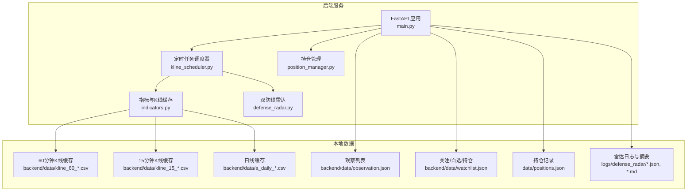
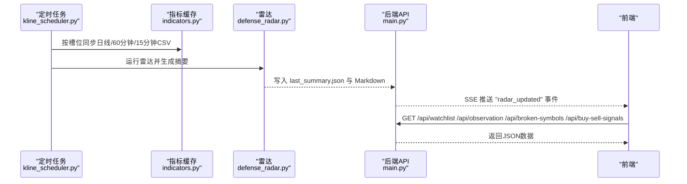
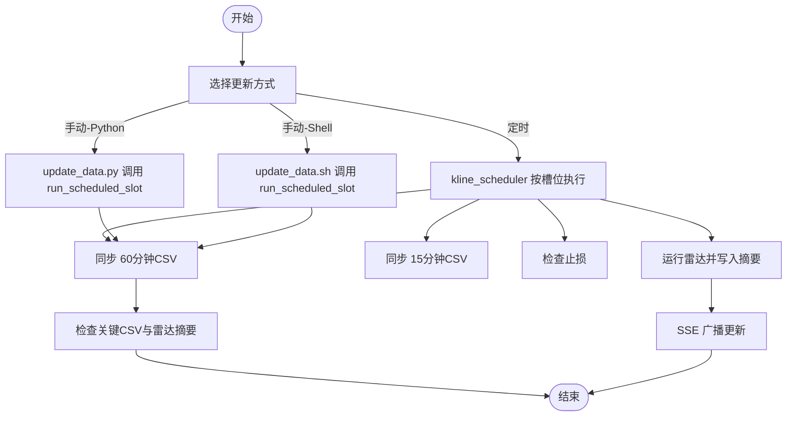
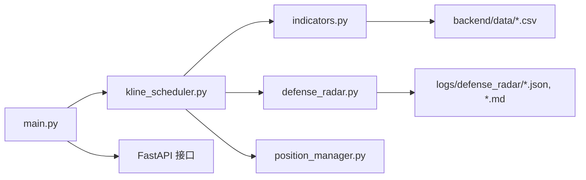

# 数据管理

<cite>
**本文引用的文件**
- [backend/data/observation.json](file://backend/data/observation.json)
- [backend/data/watchlist.json](file://backend/data/watchlist.json)
- [data/positions.json](file://data/positions.json)
- [backend/services/kline_scheduler.py](file://backend/services/kline_scheduler.py)
- [backend/services/indicators.py](file://backend/services/indicators.py)
- [backend/services/position_manager.py](file://backend/services/position_manager.py)
- [backend/services/defense_radar.py](file://backend/services/defense_radar.py)
- [backend/main.py](file://backend/main.py)
- [update_data.py](file://update_data.py)
- [update_data.sh](file://update_data.sh)
- [backend/scripts/build_meihua2test_fixture.py](file://backend/scripts/build_meihua2test_fixture.py)
- [backend/scripts/trigger_visible_tabs.py](file://backend/scripts/trigger_visible_tabs.py)
- [logs/defense_radar/broken_symbols.json](file://logs/defense_radar/broken_symbols.json)
- [logs/defense_radar/buy_sell_signals.json](file://logs/defense_radar/buy_sell_signals.json)
- [logs/defense_radar/last_summary.json](file://logs/defense_radar/last_summary.json)
</cite>

## 目录
1. [简介](#简介)
2. [项目结构](#项目结构)
3. [核心组件](#核心组件)
4. [架构总览](#架构总览)
5. [详细组件分析](#详细组件分析)
6. [依赖分析](#依赖分析)
7. [性能考虑](#性能考虑)
8. [故障排查指南](#故障排查指南)
9. [结论](#结论)
10. [附录](#附录)

## 简介
本文件面向“数据管理系统”的技术文档，聚焦于以下方面：
- 数据文件结构与用途：observation.json（观察列表）、watchlist.json（关注/自选/持仓列表）、positions.json（持仓数据）、雷达与买卖信号产物等。
- 数据存储策略：本地文件存储、CSV（日线/60分钟/15分钟）与JSON（配置与摘要）的使用。
- 数据更新机制：定时任务如何更新数据文件、手动更新的触发方式、数据验证流程。
- 数据备份与恢复策略：文件级备份、版本管理与迁移方法。
- 数据导入导出工具与脚本：内置脚本与外部工具的使用。
- 数据完整性检查与修复：缓存一致性、文件校验与修复建议。
- 数据安全与隐私保护：最小暴露原则、访问控制与敏感信息处理。
- 最佳实践与性能优化：缓存策略、并发与锁、日志与可观测性。

## 项目结构
系统采用前后端分离与本地数据驱动的架构：
- 后端服务（FastAPI）负责定时任务、指标计算、雷达分析、SSE 推送与 API 提供。
- 前端通过 API 读取观察/关注列表、雷达摘要、买卖信号、持仓等数据。
- 数据以本地文件形式持久化，包括 CSV（K线缓存）、JSON（配置与摘要）与 JSON（持仓）。

图表来源
- [backend/main.py](file://backend/main.py)
- [backend/services/kline_scheduler.py](file://backend/services/kline_scheduler.py)
- [backend/services/indicators.py](file://backend/services/indicators.py)
- [backend/services/position_manager.py](file://backend/services/position_manager.py)
- [backend/services/defense_radar.py](file://backend/services/defense_radar.py)

章节来源
- [backend/main.py](file://backend/main.py)
- [backend/services/kline_scheduler.py](file://backend/services/kline_scheduler.py)
- [backend/services/indicators.py](file://backend/services/indicators.py)

## 核心组件
- 观察列表（observation.json）：用于前端展示的标的清单，不参与止损检查。
- 关注/自选/持仓（watchlist.json）：用户维护的标的清单，支持成本价、股数、备注等字段。
- 持仓数据（positions.json）：记录一买/二买买入、金额、止损线、状态等。
- 指标与K线缓存（indicators.py）：本地CSV缓存（日线/60分钟/15分钟），响应缓存与内存缓存失效策略。
- 定时任务（kline_scheduler.py）：按固定槽位同步数据、检查止损、运行雷达与生成摘要。
- 雷达（defense_radar.py）：基于本地缓存计算双防线雷达，输出Markdown与last_summary.json。
- 前端API（main.py）：提供观察/关注列表、雷达摘要、买卖信号、持仓查询与手动买入/清仓等接口。

章节来源
- [backend/data/observation.json](file://backend/data/observation.json)
- [backend/data/watchlist.json](file://backend/data/watchlist.json)
- [data/positions.json](file://data/positions.json)
- [backend/services/indicators.py](file://backend/services/indicators.py)
- [backend/services/kline_scheduler.py](file://backend/services/kline_scheduler.py)
- [backend/services/defense_radar.py](file://backend/services/defense_radar.py)
- [backend/main.py](file://backend/main.py)

## 架构总览
系统通过定时任务与手动触发相结合的方式，确保本地缓存与雷达产物的及时更新。后端API提供只读接口，前端通过SSE接收雷达更新通知。

图表来源
- [backend/services/kline_scheduler.py](file://backend/services/kline_scheduler.py)
- [backend/services/indicators.py](file://backend/services/indicators.py)
- [backend/services/defense_radar.py](file://backend/services/defense_radar.py)
- [backend/main.py](file://backend/main.py)

## 详细组件分析

### 数据文件结构与用途

- observation.json（观察列表）
  - 结构要点：顶层注释说明用途；observations 数组，每项必填 code、name。
  - 用途：前端展示，不参与止损检查。
  - 示例路径：[backend/data/observation.json](file://backend/data/observation.json)

- watchlist.json（关注/自选/持仓）
  - 结构要点：顶层注释说明用途；holdings 数组，必填 code、name；可选 cost、shares、note。
  - 用途：用户维护的标的清单，与雷达/买卖信号计算结合。
  - 示例路径：[backend/data/watchlist.json](file://backend/data/watchlist.json)

- positions.json（持仓数据）
  - 结构要点：数组，每项包含 code、name、signal_type、buy_date、buy_price、amount、tactical_stop、strategic_stop、status、sell_date、sell_price、sell_reason。
  - 用途：记录一买/二买买入、金额、止损线、状态等，支持清仓与止损检查。
  - 示例路径：[data/positions.json](file://data/positions.json)

- 雷达与买卖信号产物
  - broken_symbols.json：watchlist + observation 中标的的破位状态。
  - buy_sell_signals.json：watchlist + observation 中标的的买卖信号状态。
  - last_summary.json：雷达摘要，供API快速返回。
  - 示例路径：
    - [logs/defense_radar/broken_symbols.json](file://logs/defense_radar/broken_symbols.json)
    - [logs/defense_radar/buy_sell_signals.json](file://logs/defense_radar/buy_sell_signals.json)
    - [logs/defense_radar/last_summary.json](file://logs/defense_radar/last_summary.json)

章节来源
- [backend/data/observation.json](file://backend/data/observation.json)
- [backend/data/watchlist.json](file://backend/data/watchlist.json)
- [data/positions.json](file://data/positions.json)
- [logs/defense_radar/broken_symbols.json](file://logs/defense_radar/broken_symbols.json)
- [logs/defense_radar/buy_sell_signals.json](file://logs/defense_radar/buy_sell_signals.json)
- [logs/defense_radar/last_summary.json](file://logs/defense_radar/last_summary.json)

### 数据存储策略
- 本地文件存储
  - CSV：日线（a_daily_*.csv）、60分钟（kline_60_*.csv）、15分钟（kline_15_*.csv）缓存，用于指标计算与前端渲染。
  - JSON：配置文件（observation.json、watchlist.json）、持仓（positions.json）、雷达摘要（last_summary.json）、破位/买卖信号（broken_symbols.json、buy_sell_signals.json）。
- 缓存与失效
  - 指标模块维护响应缓存（内存）与本地CSV mtime 对比，触发对应周期的缓存失效与重算。
- 文件锁与多进程
  - 定时任务通过文件锁确保多worker下仅一个实例启动调度器，避免重复同步。

章节来源
- [backend/services/indicators.py](file://backend/services/indicators.py)
- [backend/services/kline_scheduler.py](file://backend/services/kline_scheduler.py)

### 数据更新机制
- 定时任务（kline_scheduler.py）
  - 槽位：10:31/11:31/14:01/15:01（60分钟+雷达），16:01（日线+60分钟+雷达）。
  - 功能：同步日线/60分钟/15分钟CSV、检查止损、运行雷达、生成摘要、SSE广播。
  - 健康状态：通过共享状态文件与心跳机制监控。
- 手动更新
  - Python脚本：切换到 backend 目录，导入 kline_scheduler.run_scheduled_slot，执行60分钟同步与雷达。
  - Shell脚本：同上，适合CI/CD或运维场景。
- 数据验证
  - 同步后检查关键CSV文件是否存在、最后几行内容，以及雷达摘要文件生成情况。

图表来源
- [backend/services/kline_scheduler.py](file://backend/services/kline_scheduler.py)
- [update_data.py](file://update_data.py)
- [update_data.sh](file://update_data.sh)

章节来源
- [backend/services/kline_scheduler.py](file://backend/services/kline_scheduler.py)
- [update_data.py](file://update_data.py)
- [update_data.sh](file://update_data.sh)

### 数据备份与恢复策略
- 备份
  - 文件级备份：定期复制 backend/data、data、logs/defense_radar 目录。
  - 版本管理：对关键JSON文件（positions.json、watchlist.json、observation.json）进行版本化命名或Git跟踪。
- 恢复
  - 恢复顺序：先恢复CSV缓存，再恢复JSON配置与摘要，最后重启服务。
  - 验证：检查CSV mtime 与响应缓存一致性，确认雷达摘要与API返回一致。
- 迁移
  - 新增字段：在保持向后兼容的前提下，逐步引入新字段并在加载时做默认值处理。
  - 数据格式变更：提供迁移脚本，读取旧格式并写入新格式，同时生成备份。

章节来源
- [backend/services/indicators.py](file://backend/services/indicators.py)
- [backend/services/kline_scheduler.py](file://backend/services/kline_scheduler.py)

### 数据导入导出工具与脚本
- build_meihua2test_fixture.py
  - 用途：为测试标的889999生成日线与60分钟Mock数据，便于雷达验证。
  - 输出：tests/fixtures 与 backend/data 下的CSV文件。
  - 示例路径：[backend/scripts/build_meihua2test_fixture.py](file://backend/scripts/build_meihua2test_fixture.py)
- trigger_visible_tabs.py
  - 用途：基于last_summary.json检查标的显示条件，辅助前端重新显示被关闭的标签页。
  - 示例路径：[backend/scripts/trigger_visible_tabs.py](file://backend/scripts/trigger_visible_tabs.py)
- 手动更新脚本
  - update_data.py：Python脚本，执行60分钟同步与雷达摘要检查。
  - update_data.sh：Shell脚本，功能同上。
  - 示例路径：
    - [update_data.py](file://update_data.py)
    - [update_data.sh](file://update_data.sh)

章节来源
- [backend/scripts/build_meihua2test_fixture.py](file://backend/scripts/build_meihua2test_fixture.py)
- [backend/scripts/trigger_visible_tabs.py](file://backend/scripts/trigger_visible_tabs.py)
- [update_data.py](file://update_data.py)
- [update_data.sh](file://update_data.sh)

### 数据完整性检查与修复
- 缓存一致性
  - 通过本地CSV的mtime与响应缓存条目对比，触发对应周期的缓存失效与重算。
  - 指标模块对60分钟/15分钟/日线分别维护缓存，避免跨周期污染。
- 文件校验
  - 关键CSV：检查文件存在性、最后若干行内容，确保数据覆盖完整。
  - JSON：校验结构与字段类型，缺失字段使用默认值。
- 修复建议
  - 缓存失效：删除对应CSV或触发定时任务，等待自动重算。
  - 数据缺失：手动触发一次60分钟同步，确保CSV生成。
  - 雷达摘要：检查 last_summary.json 是否生成，必要时手动运行雷达。

章节来源
- [backend/services/indicators.py](file://backend/services/indicators.py)
- [backend/services/kline_scheduler.py](file://backend/services/kline_scheduler.py)

### 数据安全与隐私保护
- 最小暴露原则
  - 仅通过API暴露必要数据，避免直接暴露内部缓存路径。
- 访问控制
  - CORS已启用，建议在部署层限制来源与鉴权。
- 敏感信息
  - 持仓数据包含金额与价格，建议在开发环境禁用敏感日志输出，生产环境加密存储与传输。
- 文件权限
  - 仅授予必要用户读写权限，避免误删或篡改。

章节来源
- [backend/main.py](file://backend/main.py)
- [backend/services/position_manager.py](file://backend/services/position_manager.py)

## 依赖分析
- 组件耦合
  - kline_scheduler 依赖 indicators（拉取/刷新CSV）、defense_radar（生成摘要）、position_manager（止损检查）。
  - main.py 作为入口，设置SSE回调、启动/关闭定时任务，并提供API。
- 外部依赖
  - akshare、yfinance、pandas、requests 等用于数据抓取与计算。
- 潜在风险
  - 网络波动：指标模块内置轻量重试，降低瞬时失败概率。
  - 并发竞争：文件锁确保调度器唯一启动，避免重复同步。

图表来源
- [backend/main.py](file://backend/main.py)
- [backend/services/kline_scheduler.py](file://backend/services/kline_scheduler.py)
- [backend/services/indicators.py](file://backend/services/indicators.py)
- [backend/services/defense_radar.py](file://backend/services/defense_radar.py)
- [backend/services/position_manager.py](file://backend/services/position_manager.py)

章节来源
- [backend/main.py](file://backend/main.py)
- [backend/services/kline_scheduler.py](file://backend/services/kline_scheduler.py)
- [backend/services/indicators.py](file://backend/services/indicators.py)
- [backend/services/defense_radar.py](file://backend/services/defense_radar.py)
- [backend/services/position_manager.py](file://backend/services/position_manager.py)

## 性能考虑
- 缓存策略
  - 本地CSV缓存减少网络请求，响应缓存按周期维度管理，避免重复计算。
  - 指标模块对60分钟/15分钟/日线分别维护缓存，提升并发性能。
- 并发与锁
  - 文件锁确保调度器唯一启动，避免重复同步与资源争用。
- 日志与可观测性
  - 定时任务输出心跳与状态文件，便于监控与排障。
- I/O 优化
  - CSV读写使用pandas，按需列选择与类型转换，减少内存占用。

章节来源
- [backend/services/indicators.py](file://backend/services/indicators.py)
- [backend/services/kline_scheduler.py](file://backend/services/kline_scheduler.py)

## 故障排查指南
- 定时任务未执行
  - 检查文件锁是否被其他进程占用，查看共享状态文件与心跳时间。
  - 章节来源：[backend/services/kline_scheduler.py](file://backend/services/kline_scheduler.py)
- CSV为空或不完整
  - 检查网络接口稳定性与重试机制，确认CSV生成与mtime更新。
  - 章节来源：[backend/services/indicators.py](file://backend/services/indicators.py)
- 雷达摘要缺失
  - 确认定时任务是否在对应槽位执行，检查 last_summary.json 与Markdown文件生成。
  - 章节来源：[backend/services/defense_radar.py](file://backend/services/defense_radar.py)
- 手动更新失败
  - 使用 update_data.py/update_data.sh 检查异常堆栈，确认run_scheduled_slot调用路径。
  - 章节来源：[update_data.py](file://update_data.py), [update_data.sh](file://update_data.sh)

## 结论
本系统通过本地文件与定时任务实现了稳定的数据管理与实时更新能力。观察/关注列表与持仓数据以JSON形式管理，K线数据以CSV缓存，雷达与买卖信号以JSON摘要形式供前端快速消费。通过文件锁、心跳与响应缓存，系统具备良好的并发控制与可观测性。建议在生产环境中强化访问控制、加密敏感数据，并完善自动化备份与恢复流程。

## 附录
- API与文件一览
  - 观察列表：GET /api/observation
  - 关注/自选/持仓：GET /api/watchlist
  - 雷达摘要：GET /api/diagnosis/defense-radar/summary
  - 买卖信号：GET /api/buy-sell-signals
  - 破位状态：GET /api/broken-symbols
  - 持仓：GET /api/positions、POST /api/positions/buy、POST /api/positions/sell、GET /api/positions/history
  - SSE：GET /api/sse/radar-updates
  - 章节来源：[backend/main.py](file://backend/main.py)