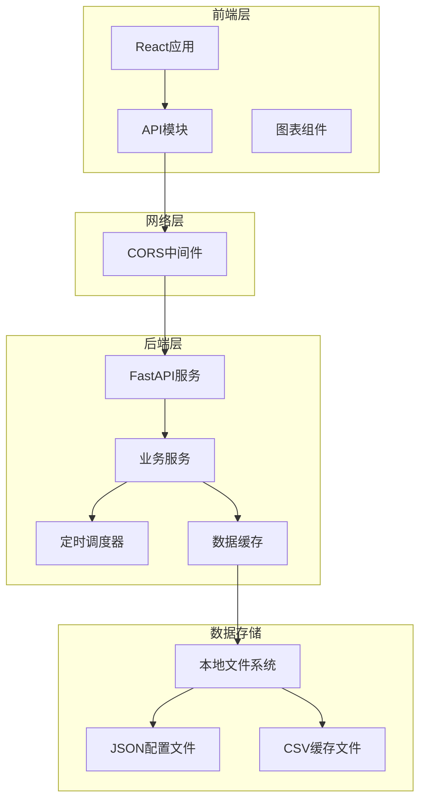
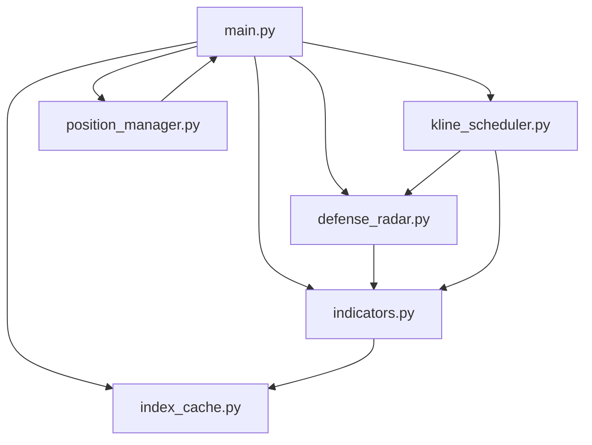
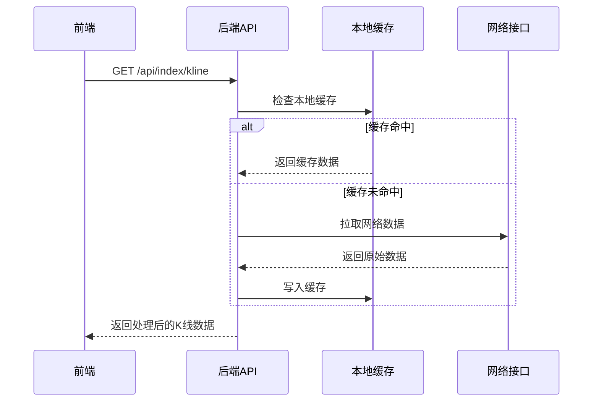
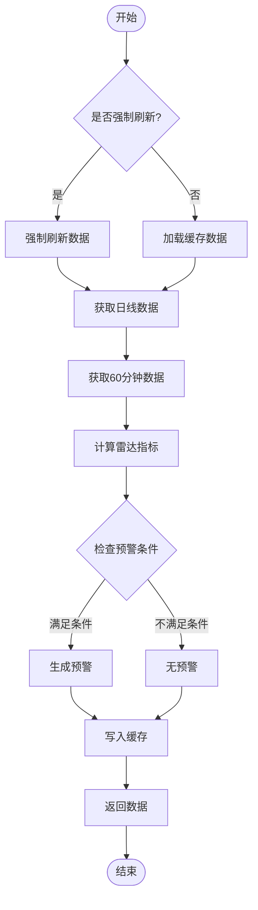
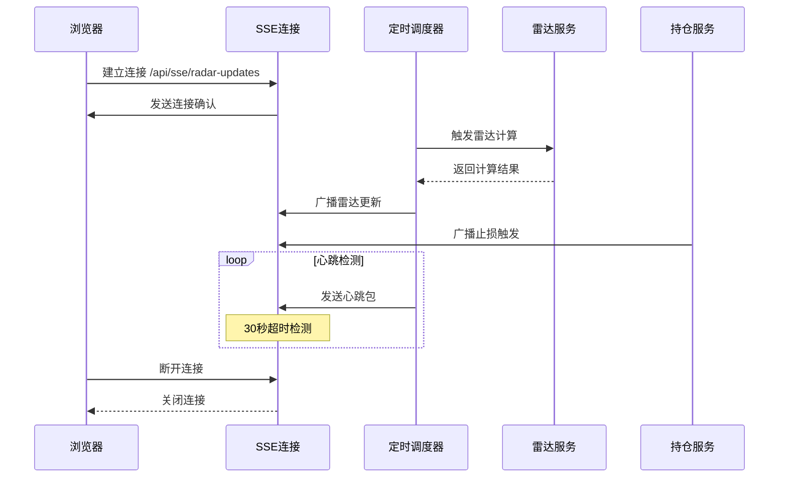
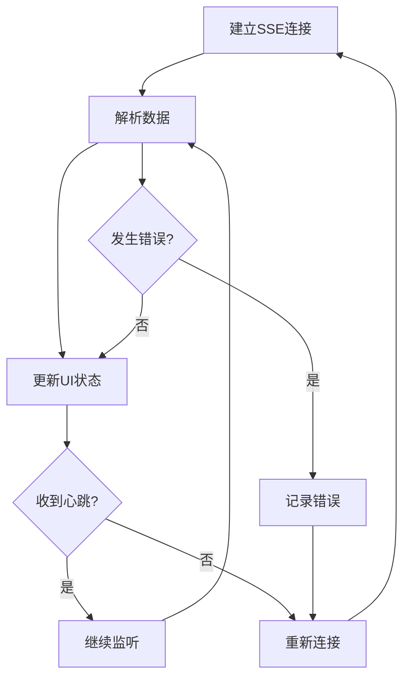
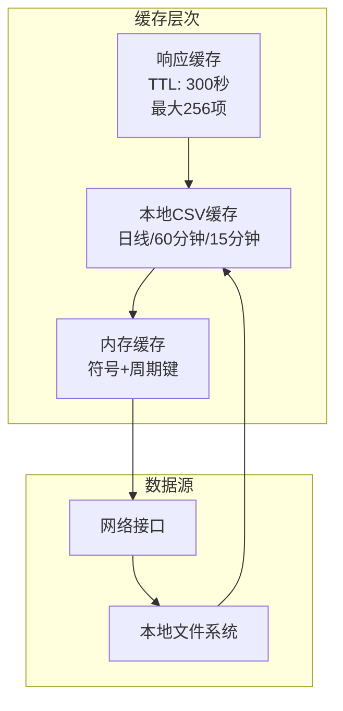
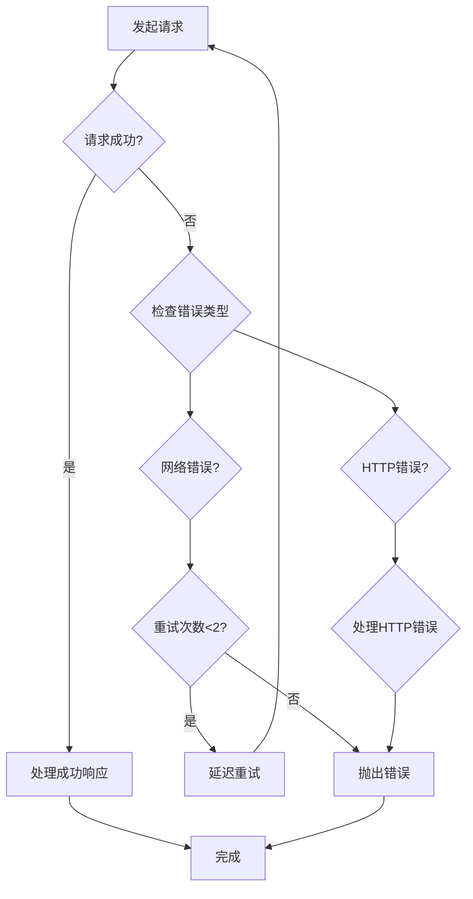

# API集成架构

<cite>
**本文档引用的文件**
- [stock.ts](file://frontend/src/api/stock.ts)
- [main.py](file://backend/main.py)
- [kline_scheduler.py](file://backend/services/kline_scheduler.py)
- [indicators.py](file://backend/services/indicators.py)
- [defense_radar.py](file://backend/services/defense_radar.py)
- [index_cache.py](file://backend/services/index_cache.py)
- [position_manager.py](file://backend/services/position_manager.py)
- [watchlist.json](file://backend/data/watchlist.json)
- [observation.json](file://backend/data/observation.json)
- [App.tsx](file://frontend/src/App.tsx)
- [DailyChanChart.tsx](file://frontend/src/DailyChanChart.tsx)
- [HourlyChanChart.tsx](file://frontend/src/HourlyChanChart.tsx)
- [useCustomSymbols.ts](file://frontend/src/hooks/useCustomSymbols.ts)
- [package.json](file://frontend/package.json)
</cite>

## 目录
1. [项目概述](#项目概述)
2. [整体架构](#整体架构)
3. [前端API模块设计](#前端api模块设计)
4. [后端服务架构](#后端服务架构)
5. [数据流分析](#数据流分析)
6. [实时通信机制](#实时通信机制)
7. [缓存策略](#缓存策略)
8. [错误处理与重试机制](#错误处理与重试机制)
9. [性能优化方案](#性能优化方案)
10. [故障排查指南](#故障排查指南)
11. [总结](#总结)

## 项目概述

这是一个基于React前端和FastAPI后端的金融分析系统，主要提供股票K线数据、技术指标分析、雷达预警等功能。系统采用前后端分离架构，通过RESTful API进行数据交互，并支持SSE实时推送。

## 整体架构



**图表来源**
- [main.py:105-124](file://backend/main.py#L105-L124)
- [stock.ts:115-130](file://frontend/src/api/stock.ts#L115-L130)

## 前端API模块设计

### 核心数据接口

前端通过`stock.ts`模块提供统一的API接口：

```mermaid
classDiagram
class StockAPI {
+fetchStockIndicators(code : string) Promise~StockIndicatorsResponse~
+fetchStockHistoryIndicators(code : string, startDate : string) Promise~StockHistoryIndicatorsResponse~
+fetchIndexKline(symbol : string, period : Period, startDate : string, endDate? : string, refresh? : boolean) Promise~IndexKlineResponse~
+fetchDefenseRadarSummary(refresh? : boolean) Promise~DefenseRadarSummaryResponse~
+runDefenseRadarDiagnosis(refresh? : boolean) Promise~{ok : boolean, path : string}~
+createSseConnection(onMessage : Function, onError? : Function) EventSource
}
class StockIndicatorsResponse {
+string code
+string date
+number close
+number volume
+Macd macd
+Boll boll
+Kdj kdj
}
class IndexKlineResponse {
+string symbol
+string start_date
+string end_date
+string period
+string adjust
+IndexKlinePoint[] data
+Fractal[] fractals
+IndexPen[] pens
+Segment[] segments
+Central[] centrals
}
StockAPI --> StockIndicatorsResponse
StockAPI --> IndexKlineResponse
```

**图表来源**
- [stock.ts:132-155](file://frontend/src/api/stock.ts#L132-L155)
- [stock.ts:185-215](file://frontend/src/api/stock.ts#L185-L215)

### 接口分类

系统提供以下主要API接口：

1. **技术指标接口**
   - `/api/stock/indicators` - 获取最新技术指标
   - `/api/stock/history-indicators` - 获取历史技术指标

2. **K线数据接口**
   - `/api/index/kline` - 获取指数/股票K线数据

3. **雷达预警接口**
   - `/api/diagnosis/defense-radar/summary` - 雷达预警摘要
   - `/api/diagnosis/defense-radar` - 雷达预警诊断

4. **持仓管理接口**
   - `/api/positions` - 获取持仓信息
   - `/api/watchlist` - 获取用户关注列表
   - `/api/observation` - 获取观察列表

**章节来源**
- [stock.ts:132-303](file://frontend/src/api/stock.ts#L132-L303)

## 后端服务架构

### FastAPI应用结构

后端采用FastAPI框架，提供RESTful API服务：



**图表来源**
- [main.py:12-21](file://backend/main.py#L12-L21)
- [main.py:105-124](file://backend/main.py#L105-L124)

### 核心服务模块

1. **指标计算服务** (`indicators.py`)
   - K线数据获取和缓存
   - 技术指标计算（MACD、布林带、KDJ等）
   - 数据源切换和重试机制

2. **雷达预警服务** (`defense_radar.py`)
   - 双防线雷达算法实现
   - 预警条件判断
   - 结果缓存和文件输出

3. **定时调度服务** (`kline_scheduler.py`)
   - 周期性数据更新
   - 多时间框架同步
   - 业务异常处理

4. **持仓管理服务** (`position_manager.py`)
   - 持仓信息管理
   - 止损监控和触发
   - SSE实时推送

**章节来源**
- [main.py:12-21](file://backend/main.py#L12-L21)
- [indicators.py:1-50](file://backend/services/indicators.py#L1-L50)
- [defense_radar.py:1-50](file://backend/services/defense_radar.py#L1-L50)

## 数据流分析

### K线数据获取流程



**图表来源**
- [indicators.py:102-124](file://backend/services/indicators.py#L102-L124)
- [main.py:156-184](file://backend/main.py#L156-L184)

### 雷达预警处理流程



**图表来源**
- [defense_radar.py:600-744](file://backend/services/defense_radar.py#L600-L744)
- [kline_scheduler.py:214-259](file://backend/services/kline_scheduler.py#L214-L259)

**章节来源**
- [indicators.py:178-189](file://backend/services/indicators.py#L178-L189)
- [defense_radar.py:600-744](file://backend/services/defense_radar.py#L600-L744)

## 实时通信机制

### SSE实时推送架构

系统采用Server-Sent Events (SSE)实现后端到前端的实时数据推送：



**图表来源**
- [main.py:229-270](file://backend/main.py#L229-L270)
- [kline_scheduler.py:31-81](file://backend/services/kline_scheduler.py#L31-L81)
- [position_manager.py:22-30](file://backend/services/position_manager.py#L22-L30)

### 前端SSE连接管理

前端通过`createSseConnection`函数管理SSE连接：



**图表来源**
- [stock.ts:479-497](file://frontend/src/api/stock.ts#L479-L497)

**章节来源**
- [stock.ts:479-497](file://frontend/src/api/stock.ts#L479-L497)
- [main.py:229-270](file://backend/main.py#L229-L270)

## 缓存策略

### 多层缓存架构

系统采用多层缓存策略确保数据访问性能：



**图表来源**
- [indicators.py:28-91](file://backend/services/indicators.py#L28-L91)
- [index_cache.py:1-50](file://backend/services/index_cache.py#L1-L50)

### 缓存更新机制

1. **响应缓存** (`_KLINE_RESP_CACHE`)
   - TTL: 300秒
   - 最大容量: 256项
   - 基于LRU算法淘汰

2. **本地文件缓存**
   - 日线: `index_daily_*.csv`
   - 60分钟: `kline_60_*.csv`
   - 15分钟: `kline_15_*.csv`

3. **内存缓存失效**
   - 本地文件mtime变化触发缓存失效
   - 符号+周期维度独立管理

**章节来源**
- [indicators.py:121-176](file://backend/services/indicators.py#L121-L176)
- [index_cache.py:102-124](file://backend/services/index_cache.py#L102-L124)

## 错误处理与重试机制

### 前端重试策略

前端API模块实现了智能重试机制：



**图表来源**
- [stock.ts:117-130](file://frontend/src/api/stock.ts#L117-L130)

### 后端异常处理

后端服务采用分级异常处理：

1. **业务异常** (`ValueError, OSError, TypeError, KeyError, RuntimeError`)
   - 记录日志但不中断服务
   - 返回标准HTTP 4xx错误码

2. **致命异常** (`RuntimeError`)
   - 捕获并记录
   - 服务继续运行但相关功能降级

3. **网络异常重试**
   - 对外部API调用实施重试
   - 指数退避策略

**章节来源**
- [stock.ts:117-130](file://frontend/src/api/stock.ts#L117-L130)
- [main.py:126-153](file://backend/main.py#L126-L153)
- [indicators.py:236-250](file://backend/services/indicators.py#L236-L250)

## 性能优化方案

### 前端性能优化

1. **请求缓存**
   - 使用`cache: 'no-store'`避免浏览器缓存
   - 应用层缓存策略减少重复请求

2. **数据预加载**
   - 启动时预加载标的配置
   - 按需加载图表数据

3. **组件优化**
   - 使用React.memo优化渲染
   - 懒加载大型图表组件

### 后端性能优化

1. **异步处理**
   - SSE连接使用异步队列
   - 非阻塞数据计算

2. **资源管理**
   - 连接池管理
   - 内存使用监控

3. **并发控制**
   - 线程安全的SSE客户端管理
   - 文件锁防止重复调度

**章节来源**
- [main.py:26-81](file://backend/main.py#L26-L81)
- [kline_scheduler.py:452-496](file://backend/services/kline_scheduler.py#L452-L496)

## 故障排查指南

### 常见问题诊断

1. **API请求失败**
   - 检查后端服务状态
   - 验证CORS配置
   - 查看网络连接状态

2. **SSE连接中断**
   - 检查定时调度器状态
   - 验证文件锁状态
   - 监控客户端队列

3. **数据缓存异常**
   - 检查本地文件权限
   - 验证缓存清理策略
   - 监控磁盘空间

### 调试工具

1. **后端健康检查**
   - `/api/scheduler/status` - 调度器状态
   - `/api/sse/radar-updates` - SSE连接状态

2. **前端调试**
   - 浏览器开发者工具
   - 网络面板监控
   - 控制台错误日志

**章节来源**
- [main.py:199-202](file://backend/main.py#L199-L202)
- [main.py:229-270](file://backend/main.py#L229-L270)

## 总结

本金融分析系统采用现代化的前后端分离架构，通过RESTful API和SSE实现实时数据推送。系统具备完善的缓存策略、错误处理机制和性能优化方案，能够稳定地提供股票数据分析服务。

### 核心特性

- **实时数据推送**: 基于SSE的实时预警推送
- **智能缓存**: 多层缓存策略确保性能
- **健壮性**: 完善的错误处理和重试机制
- **扩展性**: 模块化的服务架构支持功能扩展
- **监控**: 全面的健康检查和状态监控

### 技术优势

1. **前后端解耦**: 清晰的API边界和数据契约
2. **实时通信**: SSE提供高效的双向通信
3. **数据一致性**: 严格的缓存失效和数据同步机制
4. **用户体验**: 响应式的前端界面和流畅的交互体验

该架构为金融分析应用提供了可靠的技术基础，支持未来的功能扩展和性能优化需求。