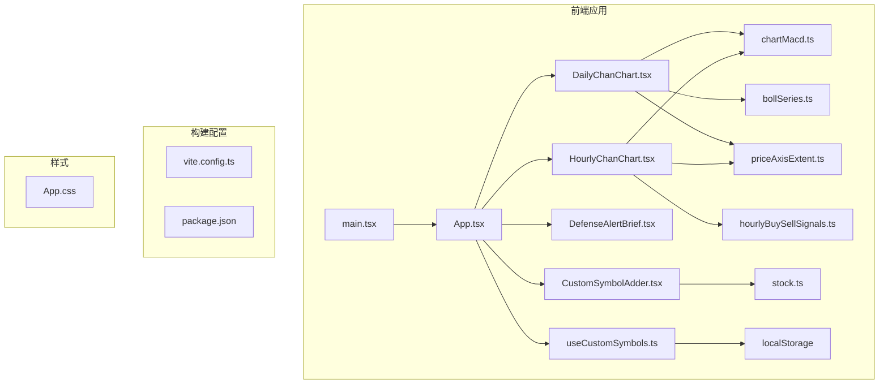
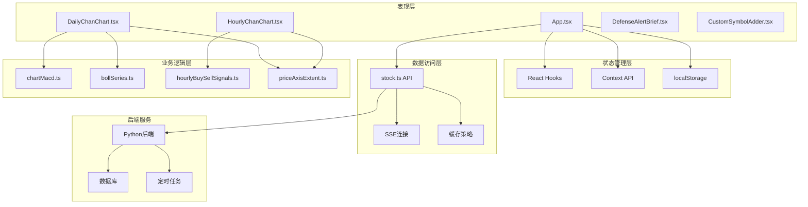
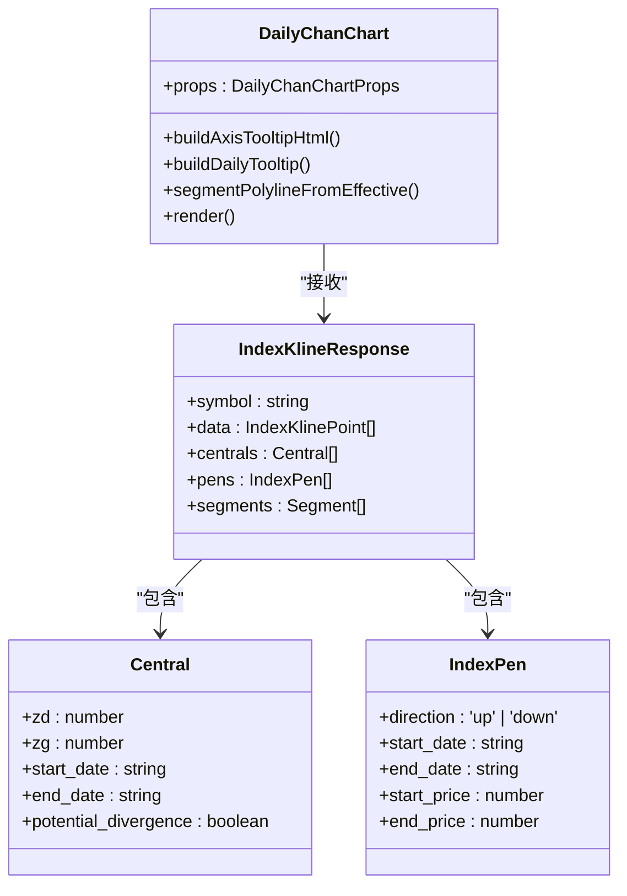
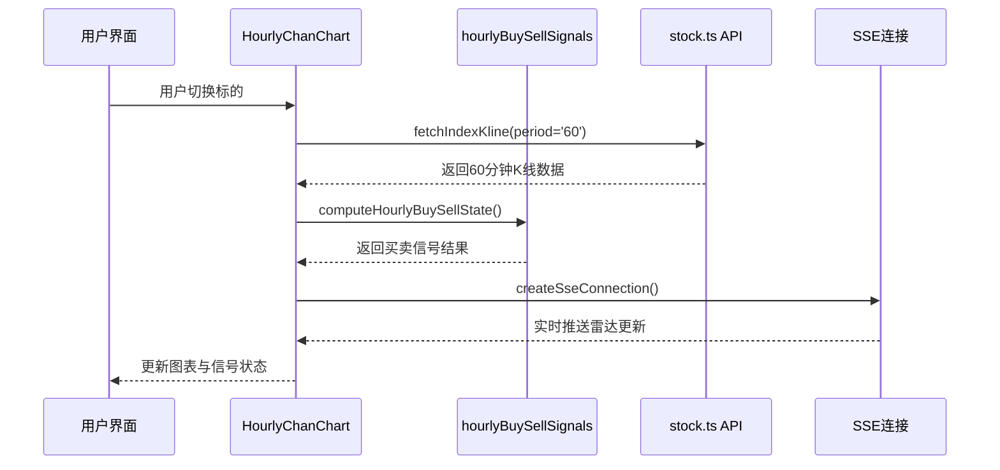
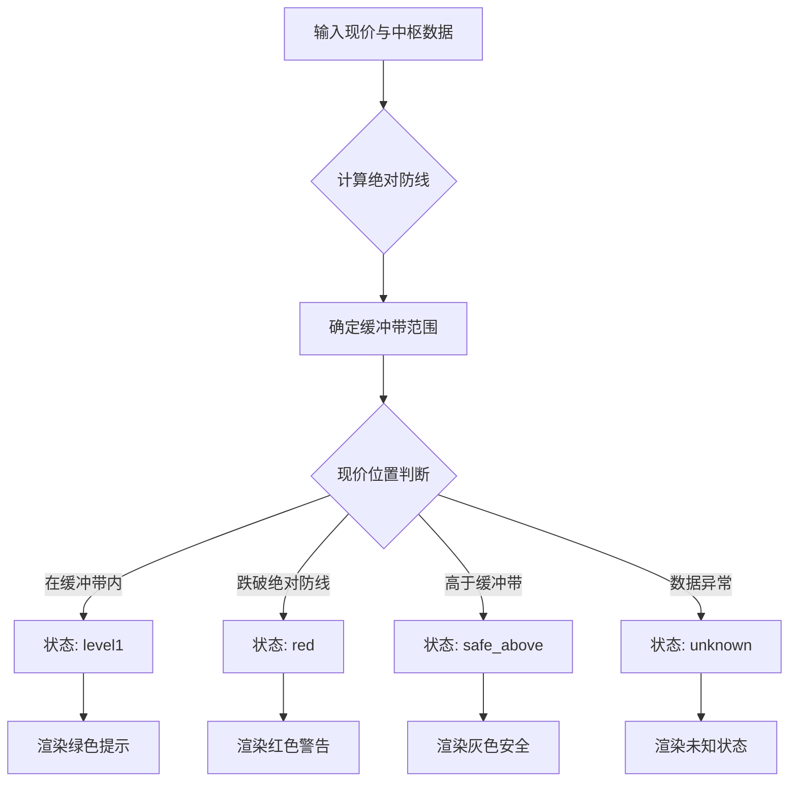
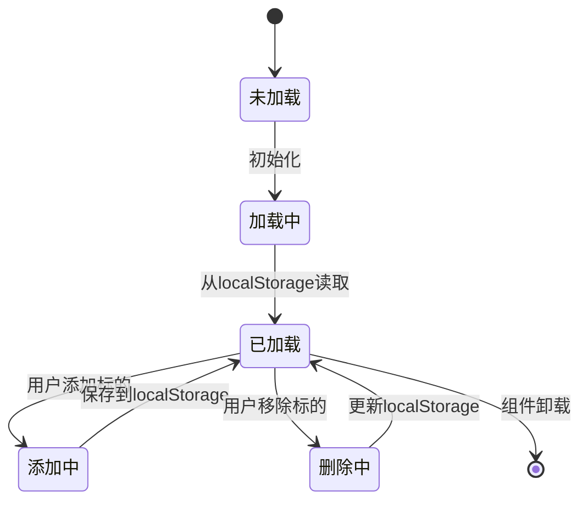
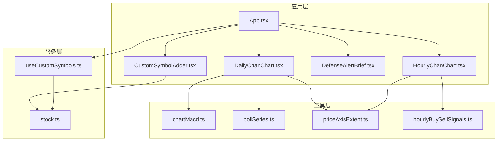
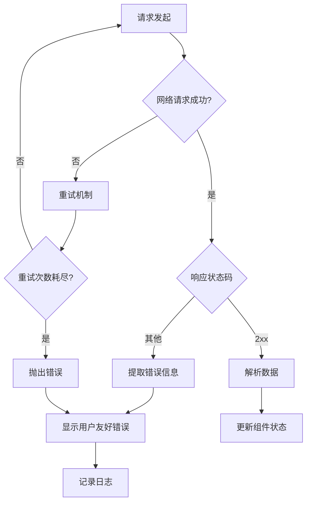
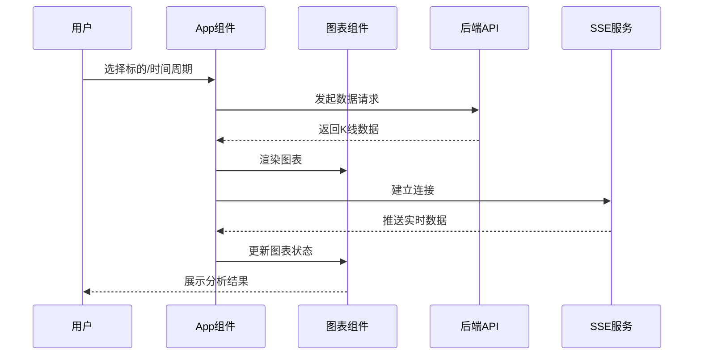
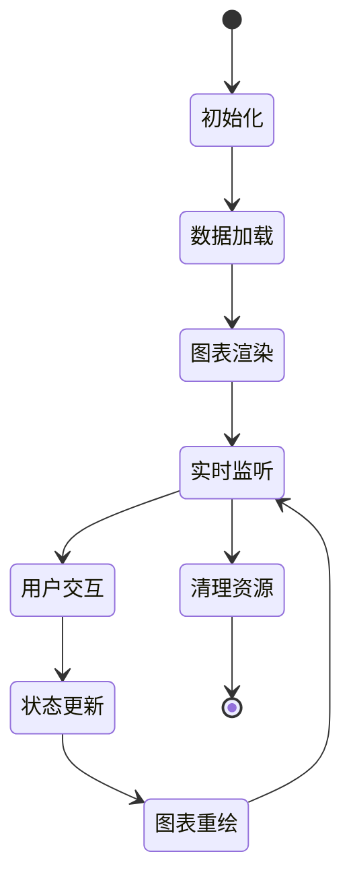

# 前端架构设计

<cite>
**本文档引用的文件**
- [main.tsx](file://frontend/src/main.tsx)
- [App.tsx](file://frontend/src/App.tsx)
- [DailyChanChart.tsx](file://frontend/src/DailyChanChart.tsx)
- [HourlyChanChart.tsx](file://frontend/src/HourlyChanChart.tsx)
- [DefenseAlertBrief.tsx](file://frontend/src/DefenseAlertBrief.tsx)
- [stock.ts](file://frontend/src/api/stock.ts)
- [useCustomSymbols.ts](file://frontend/src/hooks/useCustomSymbols.ts)
- [CustomSymbolAdder.tsx](file://frontend/src/components/CustomSymbolAdder.tsx)
- [chartMacd.ts](file://frontend/src/chartMacd.ts)
- [bollSeries.ts](file://frontend/src/bollSeries.ts)
- [hourlyBuySellSignals.ts](file://frontend/src/hourlyBuySellSignals.ts)
- [priceAxisExtent.ts](file://frontend/src/priceAxisExtent.ts)
- [package.json](file://frontend/package.json)
- [vite.config.ts](file://frontend/vite.config.ts)
- [App.css](file://frontend/src/App.css)
</cite>

## 目录
1. [简介](#简介)
2. [项目结构](#项目结构)
3. [核心组件](#核心组件)
4. [架构总览](#架构总览)
5. [详细组件分析](#详细组件分析)
6. [依赖关系分析](#依赖关系分析)
7. [性能考量](#性能考量)
8. [故障排查指南](#故障排查指南)
9. [结论](#结论)
10. [附录](#附录)

## 简介
本项目是一个基于 React 19 + TypeScript 的金融分析前端应用，专注于缠论技术分析与实时监控。系统采用组件化架构，结合 ECharts 图表库实现日线与60分钟K线的可视化展示，并通过后端API提供实时数据与SSE推送。前端实现了完整的状态管理、组件通信、数据缓存与错误处理机制，确保在高频交易场景下的稳定性与性能。

## 项目结构
前端项目采用模块化组织方式，主要目录结构如下：
- src/api：后端接口封装与类型定义
- src/components：可复用UI组件
- src/hooks：自定义Hook逻辑
- src/assets：静态资源
- src/*.tsx：页面级组件与图表组件
- public：公共资源
- 根目录：构建配置与依赖管理



**图表来源**
- [main.tsx:1-11](file://frontend/src/main.tsx#L1-L11)
- [App.tsx:1-800](file://frontend/src/App.tsx#L1-L800)
- [DailyChanChart.tsx:1-800](file://frontend/src/DailyChanChart.tsx#L1-L800)
- [HourlyChanChart.tsx:1-800](file://frontend/src/HourlyChanChart.tsx#L1-L800)

**章节来源**
- [main.tsx:1-11](file://frontend/src/main.tsx#L1-L11)
- [package.json:1-33](file://frontend/package.json#L1-L33)
- [vite.config.ts:1-22](file://frontend/vite.config.ts#L1-L22)

## 核心组件
系统的核心组件围绕金融图表分析展开，主要包括：

### 应用入口与状态管理
- **App.tsx**：应用主组件，负责全局状态管理、数据加载与组件协调
- **useCustomSymbols.ts**：自定义标的管理Hook，提供本地存储与状态同步
- **CustomSymbolAdder.tsx**：自定义标的添加器，支持自动名称获取与验证

### 图表组件
- **DailyChanChart.tsx**：日线缠论图表，集成中枢分析、背驰识别与预警提示
- **HourlyChanChart.tsx**：60分钟图表，实现买卖信号检测与跨级别风控
- **DefenseAlertBrief.tsx**：核心伏击圈预警组件，提供实时状态指示

### 数据处理与工具
- **stock.ts**：后端API封装，包含K线数据、雷达摘要、持仓管理等接口
- **chartMacd.ts**：MACD指标计算与背驰检测工具
- **bollSeries.ts**：布林带数据处理工具
- **hourlyBuySellSignals.ts**：60分钟买卖信号算法实现
- **priceAxisExtent.ts**：价格轴范围计算工具

**章节来源**
- [App.tsx:598-800](file://frontend/src/App.tsx#L598-L800)
- [useCustomSymbols.ts:1-77](file://frontend/src/hooks/useCustomSymbols.ts#L1-L77)
- [CustomSymbolAdder.tsx:1-192](file://frontend/src/components/CustomSymbolAdder.tsx#L1-L192)

## 架构总览
系统采用分层架构设计，实现前后端分离与职责清晰划分：



**图表来源**
- [App.tsx:1-800](file://frontend/src/App.tsx#L1-L800)
- [stock.ts:114-468](file://frontend/src/api/stock.ts#L114-L468)
- [chartMacd.ts:1-71](file://frontend/src/chartMacd.ts#L1-L71)
- [hourlyBuySellSignals.ts:1-800](file://frontend/src/hourlyBuySellSignals.ts#L1-L800)

系统采用以下关键技术栈：
- **React 19**：现代化React版本，支持并发特性
- **TypeScript**：强类型语言，提供编译时类型检查
- **ECharts**：专业图表库，支持复杂技术分析
- **Vite**：快速构建工具，提供热重载开发体验
- **SSE**：服务器推送事件，实现实时数据更新

## 详细组件分析

### 日线缠论图表组件
DailyChanChart组件实现了完整的缠论分析功能：



**图表来源**
- [DailyChanChart.tsx:161-800](file://frontend/src/DailyChanChart.tsx#L161-L800)
- [stock.ts:69-112](file://frontend/src/api/stock.ts#L69-L112)

组件特性：
- **中枢分析**：自动识别并标注中枢区间，支持潜在背驰检测
- **笔段计算**：基于有效笔构建线段，提供更准确的趋势判断
- **布林带集成**：显示BOLL(20,2)指标，辅助判断超买超卖
- **MACD指标**：集成DIF、DEA、MACD柱状图，支持背驰强度分析
- **实时预警**：与后端雷达系统联动，提供核心伏击圈状态

**章节来源**
- [DailyChanChart.tsx:161-800](file://frontend/src/DailyChanChart.tsx#L161-L800)
- [chartMacd.ts:18-43](file://frontend/src/chartMacd.ts#L18-L43)
- [bollSeries.ts:1-34](file://frontend/src/bollSeries.ts#L1-L34)

### 60分钟图表组件
HourlyChanChart组件专注于短期交易信号检测：



**图表来源**
- [HourlyChanChart.tsx:179-800](file://frontend/src/HourlyChanChart.tsx#L179-L800)
- [hourlyBuySellSignals.ts:122-148](file://frontend/src/hourlyBuySellSignals.ts#L122-L148)
- [stock.ts:185-215](file://frontend/src/api/stock.ts#L185-L215)

组件特色：
- **三类买点检测**：一买（趋势底背驰）、二买（回踩确认）、三买（突破确认）
- **三类卖点检测**：一卖（趋势顶背驰）、二卖（技术调整）、三卖（趋势反转）
- **跨级别风控**：结合日线防线进行风险控制
- **实时信号**：通过SSE获取后端计算的买卖信号

**章节来源**
- [HourlyChanChart.tsx:179-800](file://frontend/src/HourlyChanChart.tsx#L179-L800)
- [hourlyBuySellSignals.ts:239-418](file://frontend/src/hourlyBuySellSignals.ts#L239-L418)

### 核心伏击圈预警组件
DefenseAlertBrief组件提供简洁的状态指示：



**图表来源**
- [DefenseAlertBrief.tsx:11-88](file://frontend/src/DefenseAlertBrief.tsx#L11-L88)

**章节来源**
- [DefenseAlertBrief.tsx:11-88](file://frontend/src/DefenseAlertBrief.tsx#L11-L88)

### 自定义标的管理系统
useCustomSymbols Hook实现了完整的本地存储与状态同步：



**图表来源**
- [useCustomSymbols.ts:11-77](file://frontend/src/hooks/useCustomSymbols.ts#L11-L77)

**章节来源**
- [useCustomSymbols.ts:11-77](file://frontend/src/hooks/useCustomSymbols.ts#L11-L77)
- [CustomSymbolAdder.tsx:30-192](file://frontend/src/components/CustomSymbolAdder.tsx#L30-L192)

## 依赖关系分析

### 技术栈依赖
前端项目采用现代化技术栈，各依赖的作用如下：

```mermaid
graph LR
subgraph "运行时依赖"
A[react@^19.2.0]
B[react-dom@^19.2.0]
C[echarts@^6.0.0]
D[echarts-for-react@^3.0.6]
end
subgraph "开发依赖"
E[@vitejs/plugin-react@^5.1.1]
F[typescript@~5.9.3]
G[@types/react@^19.2.7]
H[@types/react-dom@^19.2.3]
I[@types/node@^24.10.1]
end
subgraph "构建工具"
J[Vite]
K[ESLint]
L[TSC]
end
A --> J
B --> J
C --> J
D --> J
E --> J
F --> L
G --> L
H --> L
I --> L
J --> K
```

**图表来源**
- [package.json:12-31](file://frontend/package.json#L12-L31)

### 组件间依赖关系
系统采用松耦合设计，组件间通过明确的接口进行通信：



**图表来源**
- [App.tsx:1-800](file://frontend/src/App.tsx#L1-L800)
- [stock.ts:114-468](file://frontend/src/api/stock.ts#L114-L468)

**章节来源**
- [package.json:12-31](file://frontend/package.json#L12-L31)
- [vite.config.ts:7-21](file://frontend/vite.config.ts#L7-L21)

## 性能考量
系统在多个层面进行了性能优化：

### 图表渲染优化
- **ECharts配置优化**：使用`notMerge`和`renderer: 'svg'`提升渲染性能
- **数据分片处理**：对大量K线数据进行分片渲染，避免一次性渲染过多节点
- **坐标轴范围计算**：通过`mainChartYExtent`精确计算Y轴范围，减少不必要的重绘

### 状态管理优化
- **React.memo**：对图表组件使用记忆化，避免不必要的重新渲染
- **useMemo/useCallback**：合理使用React Hooks缓存计算结果
- **局部状态隔离**：将不同图表的状态隔离，减少全局状态更新的影响范围

### 网络请求优化
- **请求重试机制**：实现指数退避的请求重试策略
- **缓存策略**：对静态数据使用浏览器缓存，减少重复请求
- **SSE连接池**：复用SSE连接，避免频繁建立连接的开销

### 内存管理
- **组件卸载清理**：确保图表实例和事件监听器在组件卸载时正确清理
- **数据结构优化**：使用Map和Set提高查找效率
- **垃圾回收友好**：避免创建不必要的临时对象

## 故障排查指南

### 常见问题诊断
1. **图表不显示或显示异常**
   - 检查ECharts初始化参数配置
   - 验证K线数据格式是否符合预期
   - 确认CSS样式是否正确加载

2. **数据加载失败**
   - 检查后端API服务状态
   - 验证网络代理配置
   - 查看浏览器开发者工具中的网络请求

3. **SSE连接断开**
   - 检查后端SSE服务状态
   - 验证防火墙和代理设置
   - 查看浏览器控制台的错误信息

### 错误处理机制
系统实现了多层次的错误处理：



**图表来源**
- [stock.ts:117-130](file://frontend/src/api/stock.ts#L117-L130)
- [stock.ts:141-154](file://frontend/src/api/stock.ts#L141-L154)

**章节来源**
- [stock.ts:117-154](file://frontend/src/api/stock.ts#L117-L154)

## 结论
本金融分析系统前端架构采用现代化技术栈，实现了高性能、可维护的金融图表分析平台。通过组件化设计、完善的类型系统和优化的性能策略，系统能够稳定地处理复杂的缠论分析需求。SSE实时推送与后端API的紧密集成，确保了用户能够获得及时准确的市场信息。未来可以在以下方面进一步优化：增加更多的图表指标支持、实现更精细的缓存策略、增强移动端适配能力。

## 附录

### 数据流图


**图表来源**
- [App.tsx:598-800](file://frontend/src/App.tsx#L598-L800)
- [stock.ts:449-466](file://frontend/src/api/stock.ts#L449-L466)

### 组件生命周期管理
系统采用React 19的新特性，优化了组件生命周期管理：



**图表来源**
- [main.tsx:6-10](file://frontend/src/main.tsx#L6-L10)
- [App.tsx:670-747](file://frontend/src/App.tsx#L670-L747)