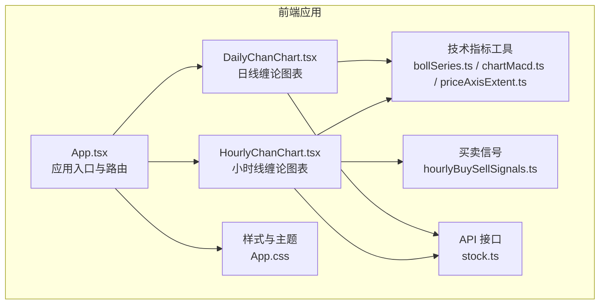
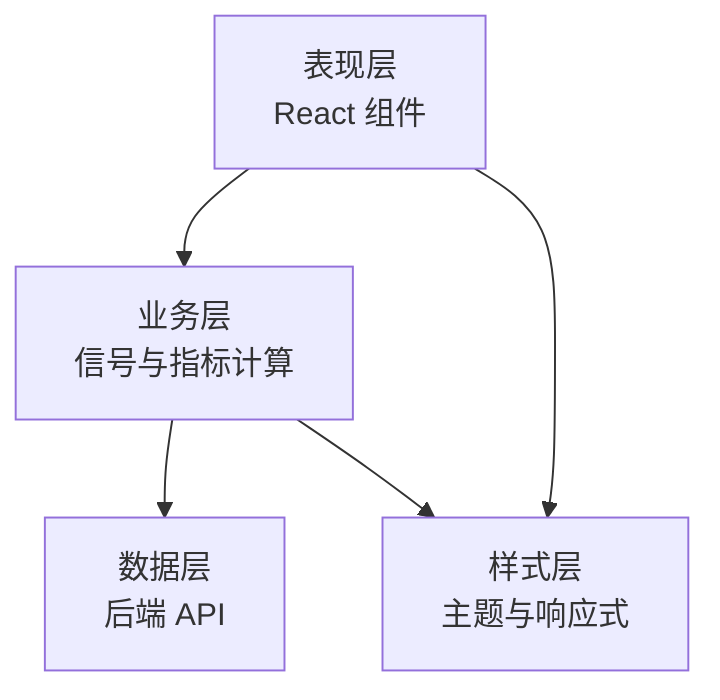
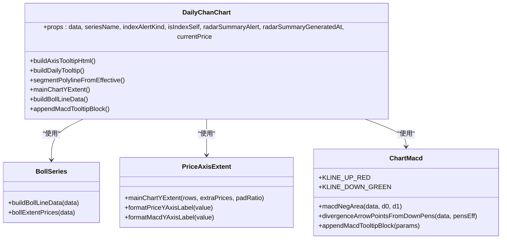
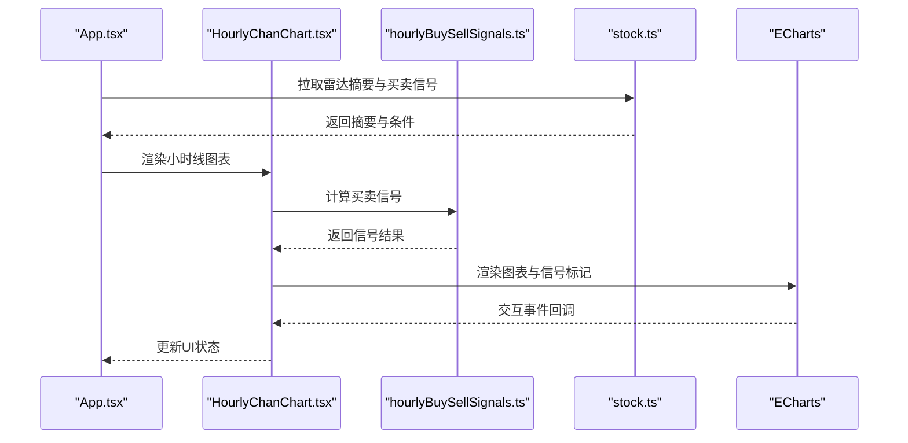
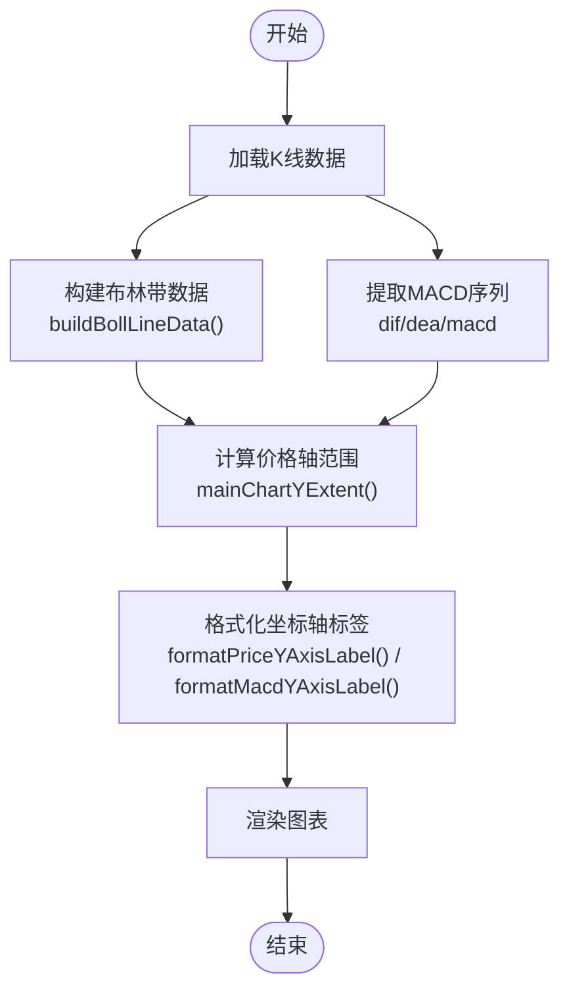
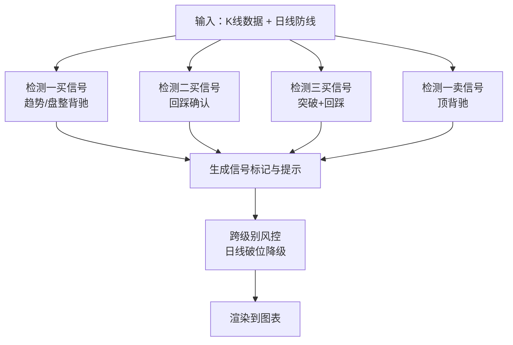
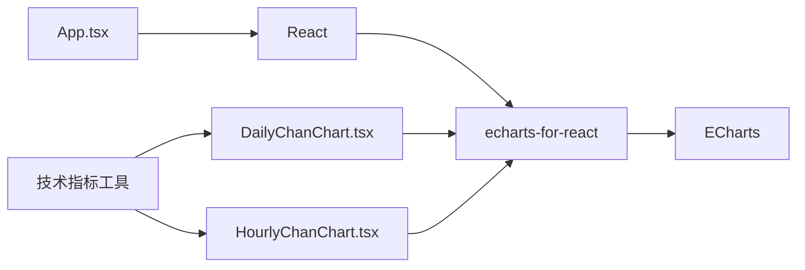

# 图表系统架构

<cite>
**本文引用的文件**
- [DailyChanChart.tsx](file://frontend/src/DailyChanChart.tsx)
- [HourlyChanChart.tsx](file://frontend/src/HourlyChanChart.tsx)
- [bollSeries.ts](file://frontend/src/bollSeries.ts)
- [chartMacd.ts](file://frontend/src/chartMacd.ts)
- [hourlyBuySellSignals.ts](file://frontend/src/hourlyBuySellSignals.ts)
- [priceAxisExtent.ts](file://frontend/src/priceAxisExtent.ts)
- [stock.ts](file://frontend/src/api/stock.ts)
- [App.tsx](file://frontend/src/App.tsx)
- [App.css](file://frontend/src/App.css)
- [package.json](file://frontend/package.json)
</cite>

## 目录
1. [项目概述](#项目概述)
2. [项目结构](#项目结构)
3. [核心组件](#核心组件)
4. [架构总览](#架构总览)
5. [详细组件分析](#详细组件分析)
6. [依赖关系分析](#依赖关系分析)
7. [性能考量](#性能考量)
8. [故障排查指南](#故障排查指南)
9. [结论](#结论)

## 项目概述
本项目是一个基于 ECharts 的专业金融图表系统，专注于缠论技术分析。系统提供日线（DailyChanChart）和小时线（HourlyChanChart）两种级别的专业图表，集成了布林带、MACD、KDJ 等技术指标，并实现了买卖信号的可视化与交互。图表系统支持动态数据更新、主题配置、响应式布局与移动端适配。

## 项目结构
前端采用 React + TypeScript 构建，核心图表组件位于 `frontend/src` 目录：
- 图表组件：DailyChanChart.tsx、HourlyChanChart.tsx
- 技术指标工具：bollSeries.ts、chartMacd.ts、hourlyBuySellSignals.ts、priceAxisExtent.ts
- API 接口：stock.ts
- 应用入口与路由：App.tsx
- 样式与主题：App.css
- 依赖管理：package.json

**图表来源**
- [App.tsx:1-1584](file://frontend/src/App.tsx#L1-L1584)
- [DailyChanChart.tsx:1-820](file://frontend/src/DailyChanChart.tsx#L1-L820)
- [HourlyChanChart.tsx:1-1632](file://frontend/src/HourlyChanChart.tsx#L1-L1632)

**章节来源**
- [App.tsx:1-1584](file://frontend/src/App.tsx#L1-L1584)
- [package.json:1-33](file://frontend/package.json#L1-L33)

## 核心组件
- **DailyChanChart（日线缠论图表）**：展示日线级别的缠论分析，包含中枢、笔、线段、分型、布林带和 MACD 等要素。
- **HourlyChanChart（小时线缠论图表）**：展示小时线级别的缠论分析，包含买卖信号可视化、跨级别风控与条件检查清单。
- **技术指标工具**：提供布林带数据构建、MACD 背驰检测、价格轴范围计算与格式化等工具函数。
- **买卖信号模块**：实现一买、二买、三买与一卖、二卖、三卖的信号检测与可视化。
- **API 接口层**：封装后端接口，提供 K 线数据、雷达摘要、买卖信号等数据获取能力。

**章节来源**
- [DailyChanChart.tsx:161-820](file://frontend/src/DailyChanChart.tsx#L161-L820)
- [HourlyChanChart.tsx:179-1632](file://frontend/src/HourlyChanChart.tsx#L179-L1632)
- [bollSeries.ts:1-34](file://frontend/src/bollSeries.ts#L1-L34)
- [chartMacd.ts:1-71](file://frontend/src/chartMacd.ts#L1-L71)
- [hourlyBuySellSignals.ts:1-1676](file://frontend/src/hourlyBuySellSignals.ts#L1-L1676)
- [priceAxisExtent.ts:1-52](file://frontend/src/priceAxisExtent.ts#L1-L52)
- [stock.ts:1-499](file://frontend/src/api/stock.ts#L1-L499)

## 架构总览
系统采用分层架构：
- **表现层**：React 组件负责渲染图表与交互。
- **业务层**：买卖信号检测、技术指标计算与数据预处理。
- **数据层**：后端 API 提供 K 线与雷达摘要数据。
- **样式层**：CSS 实现主题与响应式布局。

**图表来源**
- [App.tsx:599-1584](file://frontend/src/App.tsx#L599-L1584)
- [DailyChanChart.tsx:161-820](file://frontend/src/DailyChanChart.tsx#L161-L820)
- [HourlyChanChart.tsx:179-1632](file://frontend/src/HourlyChanChart.tsx#L179-L1632)

## 详细组件分析

### 日线缠论图表（DailyChanChart）
日线图表是系统的核心，负责展示缠论的中枢、笔、线段与分型等要素，并集成布林带与 MACD 指标。

**图表来源**
- [DailyChanChart.tsx:161-820](file://frontend/src/DailyChanChart.tsx#L161-L820)
- [bollSeries.ts:1-34](file://frontend/src/bollSeries.ts#L1-L34)
- [priceAxisExtent.ts:1-52](file://frontend/src/priceAxisExtent.ts#L1-L52)
- [chartMacd.ts:1-71](file://frontend/src/chartMacd.ts#L1-L71)

**章节来源**
- [DailyChanChart.tsx:161-820](file://frontend/src/DailyChanChart.tsx#L161-L820)

### 小时线缠论图表（HourlyChanChart）
小时线图表在日线基础上增加了买卖信号的可视化与跨级别风控，支持后端定时计算的7个条件或前端实时计算。

**图表来源**
- [App.tsx:843-901](file://frontend/src/App.tsx#L843-L901)
- [HourlyChanChart.tsx:179-1632](file://frontend/src/HourlyChanChart.tsx#L179-L1632)
- [hourlyBuySellSignals.ts:1-1676](file://frontend/src/hourlyBuySellSignals.ts#L1-L1676)
- [stock.ts:217-276](file://frontend/src/api/stock.ts#L217-L276)

**章节来源**
- [HourlyChanChart.tsx:179-1632](file://frontend/src/HourlyChanChart.tsx#L179-L1632)
- [hourlyBuySellSignals.ts:1-1676](file://frontend/src/hourlyBuySellSignals.ts#L1-L1676)

### 技术指标集成
系统集成了布林带、MACD 等技术指标，并通过独立模块进行数据构建与格式化。

**图表来源**
- [bollSeries.ts:1-34](file://frontend/src/bollSeries.ts#L1-L34)
- [priceAxisExtent.ts:1-52](file://frontend/src/priceAxisExtent.ts#L1-L52)
- [chartMacd.ts:1-71](file://frontend/src/chartMacd.ts#L1-L71)

**章节来源**
- [bollSeries.ts:1-34](file://frontend/src/bollSeries.ts#L1-L34)
- [priceAxisExtent.ts:1-52](file://frontend/src/priceAxisExtent.ts#L1-L52)
- [chartMacd.ts:1-71](file://frontend/src/chartMacd.ts#L1-L71)

### 买卖信号可视化
小时线图表实现了完整的买卖信号可视化，包括一买、二买、三买与一卖、二卖、三卖信号，并提供跨级别风控与条件检查清单。

**图表来源**
- [hourlyBuySellSignals.ts:239-418](file://frontend/src/hourlyBuySellSignals.ts#L239-L418)
- [hourlyBuySellSignals.ts:426-556](file://frontend/src/hourlyBuySellSignals.ts#L426-L556)
- [hourlyBuySellSignals.ts:569-711](file://frontend/src/hourlyBuySellSignals.ts#L569-L711)
- [hourlyBuySellSignals.ts:722-887](file://frontend/src/hourlyBuySellSignals.ts#L722-L887)

**章节来源**
- [hourlyBuySellSignals.ts:1-1676](file://frontend/src/hourlyBuySellSignals.ts#L1-L1676)

## 依赖关系分析
系统依赖关系清晰，主要依赖包括：
- **ECharts**：图表渲染引擎，支持 SVG 渲染与丰富的交互功能。
- **echarts-for-react**：React 组件封装，简化 ECharts 在 React 中的使用。
- **React**：前端框架，提供组件化开发能力。
- **TypeScript**：类型安全与更好的开发体验。

**图表来源**
- [package.json:12-17](file://frontend/package.json#L12-L17)
- [DailyChanChart.tsx:1-16](file://frontend/src/DailyChanChart.tsx#L1-L16)
- [HourlyChanChart.tsx:1-16](file://frontend/src/HourlyChanChart.tsx#L1-L16)

**章节来源**
- [package.json:1-33](file://frontend/package.json#L1-L33)

## 性能考量
- **数据预加载与并发控制**：应用采用低并发预加载策略，限制同时加载的图表数量，避免浏览器资源竞争。
- **按需加载**：非活跃标签页的数据按需加载，减少初始渲染压力。
- **SVG 渲染**：使用 SVG 渲染模式提升图表质量与交互性能。
- **坐标轴范围计算**：通过专用函数计算价格轴范围，避免异常值影响显示效果。
- **内存管理**：使用 useRef 保存回调函数引用，避免不必要的重渲染。

**章节来源**
- [App.tsx:1224-1301](file://frontend/src/App.tsx#L1224-L1301)
- [DailyChanChart.tsx:412-415](file://frontend/src/DailyChanChart.tsx#L412-L415)
- [priceAxisExtent.ts:7-39](file://frontend/src/priceAxisExtent.ts#L7-L39)

## 故障排查指南
- **数据拉取失败**：检查后端 API 状态与网络连接，查看错误提示信息。
- **图表渲染异常**：确认 ECharts 版本兼容性与数据格式正确性。
- **信号计算错误**：验证 K 线数据完整性与时间戳一致性。
- **样式问题**：检查 CSS 类名与媒体查询规则，确保响应式布局生效。

**章节来源**
- [App.tsx:1054-1057](file://frontend/src/App.tsx#L1054-L1057)
- [App.tsx:1085-1091](file://frontend/src/App.tsx#L1085-L1091)
- [App.tsx:1117-1120](file://frontend/src/App.tsx#L1117-L1120)

## 结论
本图表系统通过模块化的架构设计，实现了专业级的金融图表功能。日线与小时线图表分别针对不同分析需求，技术指标与买卖信号的集成提供了全面的技术分析能力。系统在性能、可维护性与用户体验方面均具备良好表现，适合在生产环境中稳定运行。