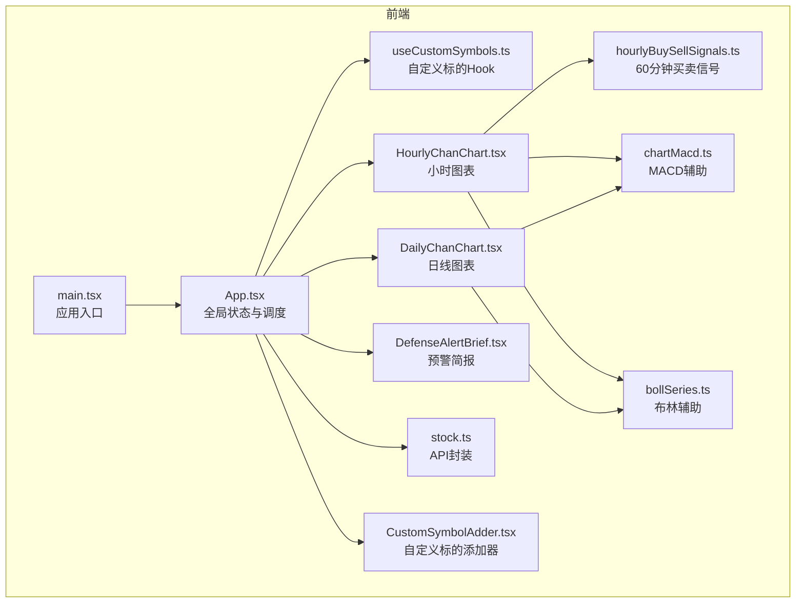
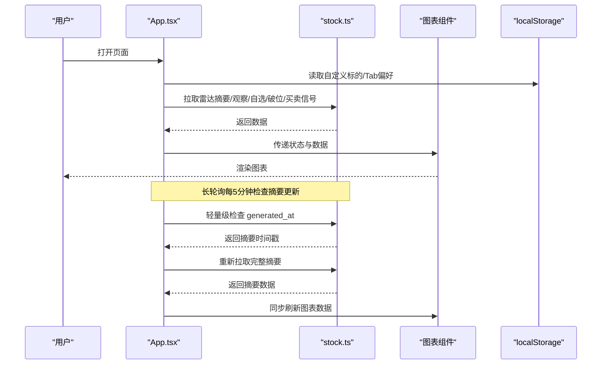
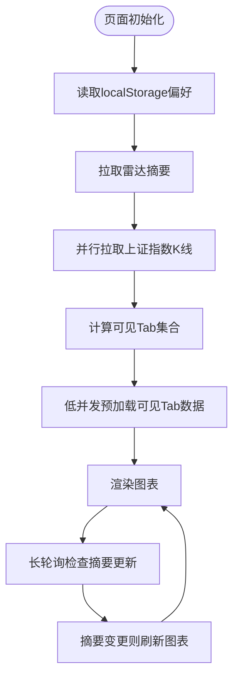
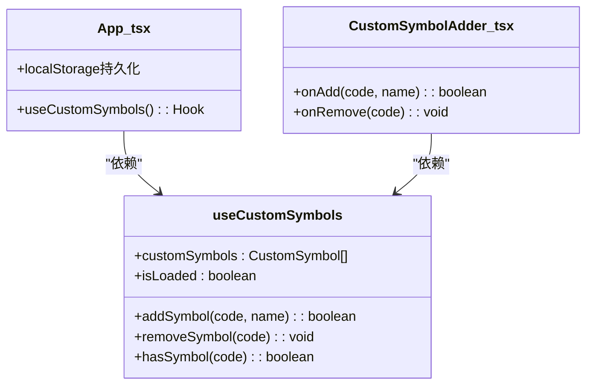
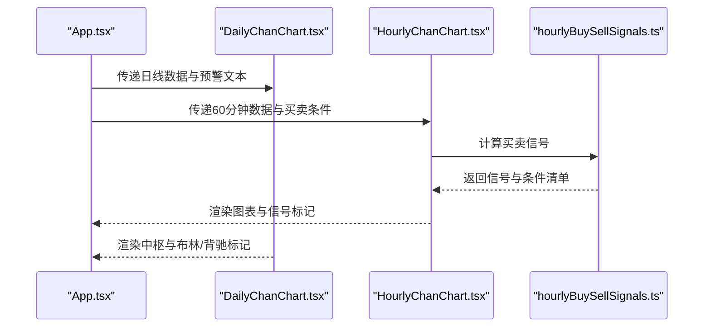
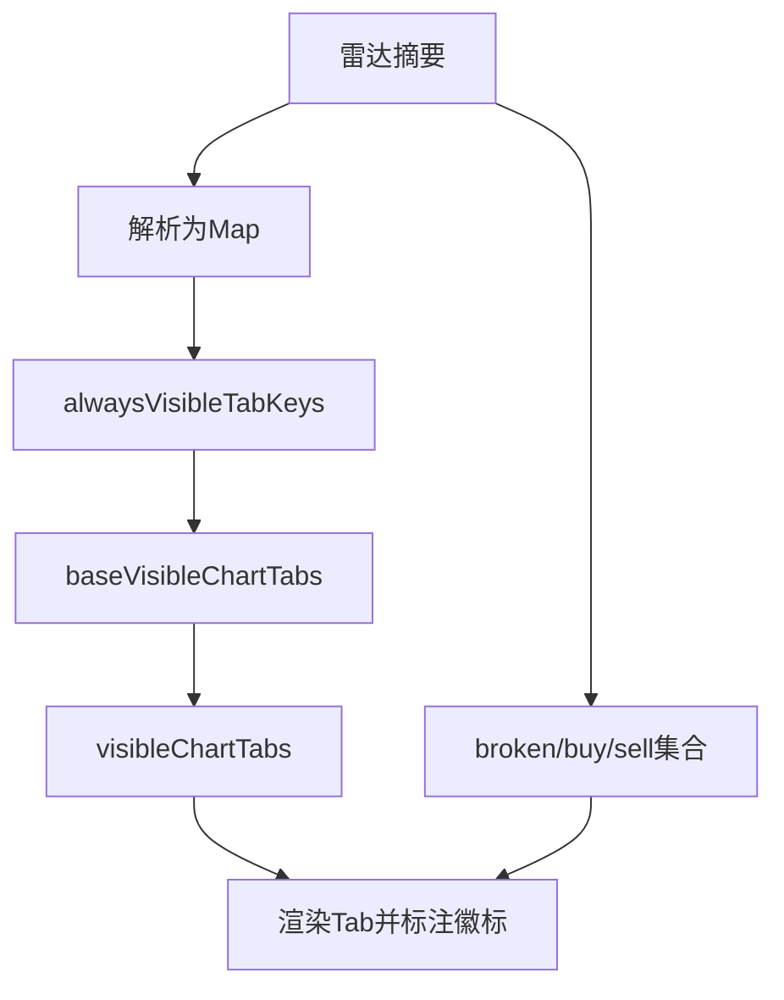
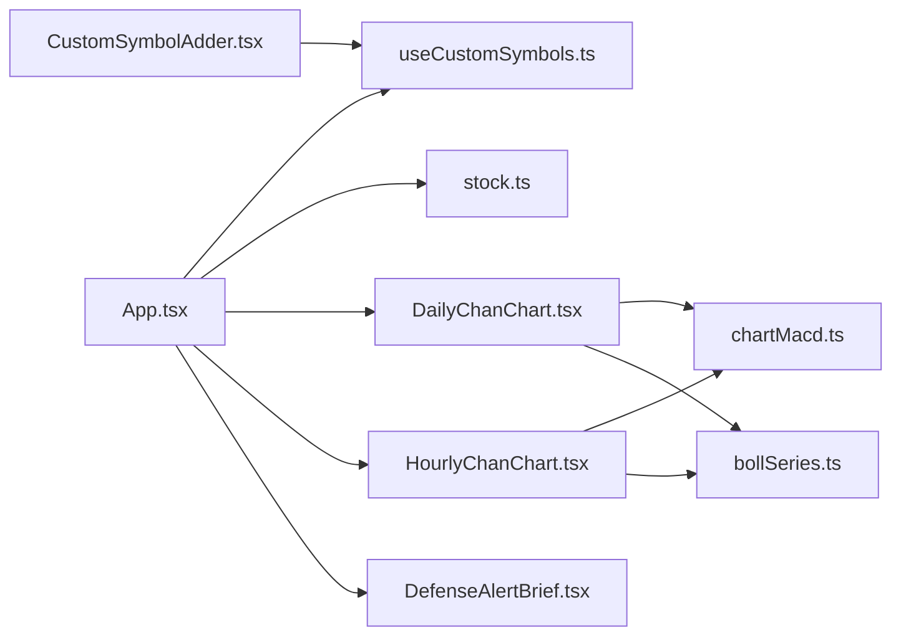

# 状态管理策略

<cite>
**本文引用的文件**
- [App.tsx](file://frontend/src/App.tsx)
- [useCustomSymbols.ts](file://frontend/src/hooks/useCustomSymbols.ts)
- [DailyChanChart.tsx](file://frontend/src/DailyChanChart.tsx)
- [HourlyChanChart.tsx](file://frontend/src/HourlyChanChart.tsx)
- [DefenseAlertBrief.tsx](file://frontend/src/DefenseAlertBrief.tsx)
- [stock.ts](file://frontend/src/api/stock.ts)
- [hourlyBuySellSignals.ts](file://frontend/src/hourlyBuySellSignals.ts)
- [chartMacd.ts](file://frontend/src/chartMacd.ts)
- [bollSeries.ts](file://frontend/src/bollSeries.ts)
- [CustomSymbolAdder.tsx](file://frontend/src/components/CustomSymbolAdder.tsx)
- [main.tsx](file://frontend/src/main.tsx)
- [package.json](file://frontend/package.json)
</cite>

## 目录
1. [简介](#简介)
2. [项目结构](#项目结构)
3. [核心组件](#核心组件)
4. [架构总览](#架构总览)
5. [详细组件分析](#详细组件分析)
6. [依赖关系分析](#依赖关系分析)
7. [性能考量](#性能考量)
8. [故障排查指南](#故障排查指南)
9. [结论](#结论)
10. [附录](#附录)

## 简介
本文件面向金融分析系统（缠论日/小时K线分析平台）的状态管理策略，系统性阐述基于React Hooks的状态管理模式，涵盖useState、useEffect、useMemo、useCallback的使用策略；全局状态设计（图表数据、雷达预警、用户偏好）；localStorage持久化、状态同步与恢复；以及自定义Hook useCustomSymbols的设计与复用模式。文档提供状态流转图、更新时机分析与性能优化建议，帮助开发者在复杂金融可视化场景中建立稳定、可维护、高性能的状态体系。

## 项目结构
前端采用Vite + React 19 + TypeScript，核心状态集中在应用入口组件App.tsx中，通过自定义Hook useCustomSymbols管理用户自定义标的，并通过API模块与后端服务进行数据同步。图表组件DailyChanChart与HourlyChanChart消费状态并渲染ECharts。

**图表来源**
- [main.tsx:1-11](file://frontend/src/main.tsx#L1-L11)
- [App.tsx:1-100](file://frontend/src/App.tsx#L1-L100)
- [useCustomSymbols.ts:1-77](file://frontend/src/hooks/useCustomSymbols.ts#L1-L77)
- [DailyChanChart.tsx:1-120](file://frontend/src/DailyChanChart.tsx#L1-L120)
- [HourlyChanChart.tsx:1-120](file://frontend/src/HourlyChanChart.tsx#L1-L120)
- [DefenseAlertBrief.tsx:1-88](file://frontend/src/DefenseAlertBrief.tsx#L1-L88)
- [stock.ts:1-120](file://frontend/src/api/stock.ts#L1-L120)
- [hourlyBuySellSignals.ts:1-120](file://frontend/src/hourlyBuySellSignals.ts#L1-L120)
- [chartMacd.ts:1-71](file://frontend/src/chartMacd.ts#L1-L71)
- [bollSeries.ts:1-34](file://frontend/src/bollSeries.ts#L1-L34)
- [CustomSymbolAdder.tsx:1-60](file://frontend/src/components/CustomSymbolAdder.tsx#L1-L60)

**章节来源**
- [main.tsx:1-11](file://frontend/src/main.tsx#L1-L11)
- [package.json:1-33](file://frontend/package.json#L1-L33)

## 核心组件
- 全局状态容器：App.tsx集中管理图表数据、雷达状态、用户偏好、Tab可见性、错误状态等。
- 自定义Hook：useCustomSymbols.ts负责自定义标的的加载、保存、增删与查询。
- 图表组件：DailyChanChart.tsx与HourlyChanChart.tsx消费状态并渲染ECharts。
- 预警组件：DefenseAlertBrief.tsx根据中枢与现价计算并展示核心伏击圈状态。
- API层：stock.ts封装后端接口，提供K线、雷达摘要、买卖信号、观察/自选列表等。
- 买卖信号：hourlyBuySellSignals.ts提供60分钟买卖信号检测与条件清单。
- 辅助模块：chartMacd.ts与bollSeries.ts提供MACD与布林指标的计算与可视化辅助。

**章节来源**
- [App.tsx:598-802](file://frontend/src/App.tsx#L598-L802)
- [useCustomSymbols.ts:11-76](file://frontend/src/hooks/useCustomSymbols.ts#L11-L76)
- [DailyChanChart.tsx:161-183](file://frontend/src/DailyChanChart.tsx#L161-L183)
- [HourlyChanChart.tsx:179-200](file://frontend/src/HourlyChanChart.tsx#L179-L200)
- [DefenseAlertBrief.tsx:28-87](file://frontend/src/DefenseAlertBrief.tsx#L28-L87)
- [stock.ts:185-276](file://frontend/src/api/stock.ts#L185-L276)
- [hourlyBuySellSignals.ts:122-148](file://frontend/src/hourlyBuySellSignals.ts#L122-L148)
- [chartMacd.ts:1-71](file://frontend/src/chartMacd.ts#L1-L71)
- [bollSeries.ts:1-34](file://frontend/src/bollSeries.ts#L1-L34)

## 架构总览
系统采用“集中式全局状态 + 组件局部状态 + Hook封装”的混合模式：
- 全局状态：App.tsx通过useState/ useEffect/ useMemo/ useCallback统一管理图表数据、雷达状态、用户偏好、Tab可见性与错误状态。
- 局部状态：图表组件内部使用useState管理图表特定的UI状态（如tooltip、选中项等）。
- Hook封装：useCustomSymbols.ts将自定义标的的加载、保存、增删逻辑抽象为可复用的Hook。
- 数据流：API层通过fetchWithRetry与后端交互，长轮询与SSE保持数据同步，localStorage实现持久化。

**图表来源**
- [App.tsx:875-925](file://frontend/src/App.tsx#L875-L925)
- [stock.ts:250-276](file://frontend/src/api/stock.ts#L250-L276)
- [useCustomSymbols.ts:15-40](file://frontend/src/hooks/useCustomSymbols.ts#L15-L40)

**章节来源**
- [App.tsx:875-925](file://frontend/src/App.tsx#L875-L925)
- [stock.ts:250-276](file://frontend/src/api/stock.ts#L250-L276)

## 详细组件分析

### 全局状态管理（App.tsx）
- 状态划分
  - 图表数据：indexKline、indexKline60、indexKline15、chartDaily、chart60、chart15及其错误状态。
  - 雷达状态：defenseCodeToAlert、defensePen60mByCode、defenseAlertTextByCode、defenseBuyConditionsByCode、defenseSummaryGeneratedAt、meihuaMockFullTriggerTab。
  - 用户偏好：customSymbols、watchlist、observation、closedTabKeys、stickyVisibleTabKeys。
  - Tab可见性：dailyTab、baseVisibleChartTabs、visibleChartTabs、alwaysVisibleTabKeys。
  - 其他：brokenCodeSet、buyCodeSet、sellCodeSet、dailyTabRef、loadedKeysRef等。
- 生命周期与副作用
  - 首屏并发加载：Promise.all并行拉取上证指数日线与60/15分钟K线。
  - 长轮询：每5分钟检查摘要生成时间，若有变化则重新拉取并同步刷新图表。
  - 可见性监听：页面可见时同步刷新60/15分钟K线并重新拉取雷达摘要。
  - 预加载：对可见Tab进行低并发预加载，避免阻塞首屏交互。
- 性能优化
  - 使用useMemo稳定计算结果，减少图表渲染成本。
  - 使用useCallback稳定回调，避免子组件不必要的重渲染。
  - 使用ref存储函数与状态，避免effect依赖链过长。
  - 并发控制：预加载队列限制并发数量，降低网络压力。

**图表来源**
- [App.tsx:1140-1269](file://frontend/src/App.tsx#L1140-L1269)

**章节来源**
- [App.tsx:598-802](file://frontend/src/App.tsx#L598-L802)
- [App.tsx:1140-1269](file://frontend/src/App.tsx#L1140-L1269)

### 自定义Hook useCustomSymbols 设计与复用
- 设计模式
  - 封装：将自定义标的的加载、保存、增删、查询逻辑封装为独立Hook。
  - 持久化：通过localStorage实现跨会话持久化，避免刷新丢失。
  - 纯函数：返回稳定的回调函数，便于在组件间复用。
- 复用策略
  - App.tsx与CustomSymbolAdder.tsx共同依赖useCustomSymbols，实现“添加/删除自定义标的”与“Tab切换/关闭”的联动。
  - 通过hasSymbol快速判断是否存在，避免重复添加。
- 错误处理
  - 解析localStorage失败时静默忽略，保证应用稳定性。
  - 保存失败时记录错误日志，不影响其他功能。

**图表来源**
- [useCustomSymbols.ts:11-76](file://frontend/src/hooks/useCustomSymbols.ts#L11-L76)
- [App.tsx:598-600](file://frontend/src/App.tsx#L598-L600)
- [CustomSymbolAdder.tsx:30-80](file://frontend/src/components/CustomSymbolAdder.tsx#L30-L80)

**章节来源**
- [useCustomSymbols.ts:11-76](file://frontend/src/hooks/useCustomSymbols.ts#L11-L76)
- [App.tsx:598-600](file://frontend/src/App.tsx#L598-L600)
- [CustomSymbolAdder.tsx:30-80](file://frontend/src/components/CustomSymbolAdder.tsx#L30-L80)

### 图表数据状态与渲染（DailyChanChart.tsx / HourlyChanChart.tsx）
- 数据来源
  - 日线：indexKline或指定Tab的chartDaily[tab.key]。
  - 小时：indexKline60或指定Tab的chart60[tab.key]。
  - 预警：defenseAlertTextByCode与defenseBuyConditionsByCode。
- 渲染策略
  - 使用useMemo稳定计算tooltip、中枢提示、布林与MACD序列，减少渲染开销。
  - 使用useCallback稳定图表事件回调，避免图表重绘。
  - 通过props传递currentPrice，使核心伏击圈随60分钟K线实时更新。
- 买卖信号
  - HourlyChanChart优先使用后端定时计算的7个条件，若无则回退到前端实时计算。
  - 通过computeHourlyBuySellState生成信号标记与条件清单，结合日线破位与跨级别风控进行颜色与标签调整。

**图表来源**
- [DailyChanChart.tsx:161-183](file://frontend/src/DailyChanChart.tsx#L161-L183)
- [HourlyChanChart.tsx:179-200](file://frontend/src/HourlyChanChart.tsx#L179-L200)
- [hourlyBuySellSignals.ts:122-148](file://frontend/src/hourlyBuySellSignals.ts#L122-L148)

**章节来源**
- [DailyChanChart.tsx:161-183](file://frontend/src/DailyChanChart.tsx#L161-L183)
- [HourlyChanChart.tsx:179-200](file://frontend/src/HourlyChanChart.tsx#L179-L200)
- [hourlyBuySellSignals.ts:122-148](file://frontend/src/hourlyBuySellSignals.ts#L122-L148)

### 雷达预警状态与Tab可见性
- 雷达摘要
  - 通过fetchDefenseRadarSummary获取摘要，解析为Map形式的预警状态、60分钟笔向、买卖条件与预警原文。
  - 长轮询检测generated_at变化，若有更新则重新拉取并同步刷新图表。
- Tab可见性
  - alwaysVisibleTabKeys：由自定义/观察/持仓集合生成，确保这些标的始终显示。
  - baseVisibleChartTabs：按优先级排序（持仓 > 观察/自定义 > 原始顺序）。
  - visibleChartTabs：合并sticky集合与base集合，排除用户手动关闭的Tab。
  - closedTabKeys：用户手动关闭的Tab集合，防止条件触发再次显示。
- 破位与买卖信号
  - brokenCodeSet、buyCodeSet、sellCodeSet分别用于标注破位与买卖信号，驱动Tab徽标与样式。

**图表来源**
- [App.tsx:811-869](file://frontend/src/App.tsx#L811-L869)
- [App.tsx:927-971](file://frontend/src/App.tsx#L927-L971)
- [App.tsx:1335-1399](file://frontend/src/App.tsx#L1335-L1399)

**章节来源**
- [App.tsx:811-869](file://frontend/src/App.tsx#L811-L869)
- [App.tsx:927-971](file://frontend/src/App.tsx#L927-L971)
- [App.tsx:1335-1399](file://frontend/src/App.tsx#L1335-L1399)

### 用户偏好与持久化（localStorage）
- 自定义标的
  - 存储键：STORAGE_KEY（custom_symbols_v1）
  - 加载：组件挂载时从localStorage读取并设置状态。
  - 保存：状态变化后异步写入localStorage。
- Tab偏好
  - stickyVisibleTabKeys：持久化“非常驻但显示过”的Tab集合。
  - closedTabKeys：持久化用户手动关闭的Tab集合。
- 恢复策略
  - 页面刷新时优先从localStorage恢复偏好，确保用户体验一致性。
  - 解析失败时静默忽略，避免影响应用启动。

**章节来源**
- [useCustomSymbols.ts:15-40](file://frontend/src/hooks/useCustomSymbols.ts#L15-L40)
- [App.tsx:637-664](file://frontend/src/App.tsx#L637-L664)
- [App.tsx:980-998](file://frontend/src/App.tsx#L980-L998)

### API层与数据同步（stock.ts）
- 接口封装
  - fetchIndexKline：获取日线/60分钟/15分钟K线，支持start_date/end_date与refresh参数。
  - fetchDefenseRadarSummary：获取雷达摘要，支持refresh参数。
  - fetchWatchlist/fetchObservation：获取用户持仓/观察列表。
  - fetchBrokenSymbols/fetchBuySellSignals：获取破位与买卖信号汇总。
  - createSseConnection：建立SSE连接，接收雷达更新与止损告警。
- 错误处理
  - fetchWithRetry：带重试的fetch封装，提升网络稳定性。
  - 组件侧对异常进行捕获与错误状态设置，避免崩溃。

**章节来源**
- [stock.ts:117-130](file://frontend/src/api/stock.ts#L117-L130)
- [stock.ts:185-215](file://frontend/src/api/stock.ts#L185-L215)
- [stock.ts:250-276](file://frontend/src/api/stock.ts#L250-L276)
- [stock.ts:355-375](file://frontend/src/api/stock.ts#L355-L375)
- [stock.ts:394-446](file://frontend/src/api/stock.ts#L394-L446)
- [stock.ts:480-497](file://frontend/src/api/stock.ts#L480-L497)

## 依赖关系分析
- 组件依赖
  - App.tsx依赖useCustomSymbols.ts、stock.ts、DailyChanChart.tsx、HourlyChanChart.tsx、DefenseAlertBrief.tsx。
  - 图表组件依赖chartMacd.ts与bollSeries.ts进行指标计算与可视化。
  - CustomSymbolAdder.tsx依赖useCustomSymbols.ts进行增删操作。
- 外部依赖
  - React 19、echarts-for-react、echarts。
  - ESLint插件react-hooks与react-refresh。

**图表来源**
- [App.tsx:1-18](file://frontend/src/App.tsx#L1-L18)
- [DailyChanChart.tsx:1-16](file://frontend/src/DailyChanChart.tsx#L1-L16)
- [HourlyChanChart.tsx:1-16](file://frontend/src/HourlyChanChart.tsx#L1-L16)
- [useCustomSymbols.ts:1-1](file://frontend/src/hooks/useCustomSymbols.ts#L1-L1)
- [CustomSymbolAdder.tsx:1-7](file://frontend/src/components/CustomSymbolAdder.tsx#L1-L7)

**章节来源**
- [package.json:12-31](file://frontend/package.json#L12-L31)

## 性能考量
- 渲染优化
  - 使用useMemo稳定计算昂贵的数据结构（如tabs、中枢排序、布林序列），减少图表重渲染。
  - 使用useCallback稳定回调，避免子组件因引用变化而重渲染。
- 网络与并发
  - 首屏Promise.all并行拉取关键数据，缩短首屏时间。
  - 预加载队列限制并发数量，避免浏览器并发槽位耗尽。
  - 长轮询间隔较长（5分钟），降低服务器压力。
- 存储与恢复
  - localStorage读写分离，避免阻塞主线程。
  - 解析失败静默处理，保证应用可用性。
- 图表渲染
  - ECharts使用notMerge与renderer: svg，提升渲染质量与可访问性。
  - tooltip与legend使用formatter函数，避免频繁对象创建。

[本节提供通用指导，无需具体文件分析]

## 故障排查指南
- 雷达摘要拉取失败
  - 现象：雷达摘要为空，Tab不显示条件触发。
  - 处理：检查后端服务状态与网络连接；查看控制台错误日志；确认generated_at字段是否变化。
- K线数据加载失败
  - 现象：图表显示错误提示或空白。
  - 处理：检查fetchIndexKline请求参数与后端接口；确认start_date/end_date范围；查看错误状态。
- 自定义标的丢失
  - 现象：刷新页面后自定义标的消失。
  - 处理：检查localStorage权限与容量；查看useCustomSymbols.ts的加载/保存逻辑。
- Tab可见性异常
  - 现象：用户关闭的Tab再次出现或非常驻Tab不显示。
  - 处理：检查closedTabKeys与stickyVisibleTabKeys的持久化；确认alwaysVisibleTabKeys生成逻辑。

**章节来源**
- [App.tsx:860-869](file://frontend/src/App.tsx#L860-L869)
- [stock.ts:185-215](file://frontend/src/api/stock.ts#L185-L215)
- [useCustomSymbols.ts:15-40](file://frontend/src/hooks/useCustomSymbols.ts#L15-L40)
- [App.tsx:980-998](file://frontend/src/App.tsx#L980-L998)

## 结论
本系统通过“集中式全局状态 + Hook封装 + 组件局部状态”的组合，实现了金融分析场景下的高效状态管理。全局状态由App.tsx统一调度，自定义Hook将复杂逻辑抽象为可复用能力，图表组件专注于数据消费与渲染。localStorage与长轮询确保状态持久化与实时同步。通过useMemo/useCallback等优化手段，系统在复杂数据与高频交互下仍保持良好性能与稳定性。

[本节为总结性内容，无需具体文件分析]

## 附录
- 关键状态字段说明
  - 图表数据：indexKline、indexKline60、indexKline15、chartDaily、chart60、chart15、chartDailyErr、chart60Err、chart15Err。
  - 雷达状态：defenseCodeToAlert、defensePen60mByCode、defenseAlertTextByCode、defenseBuyConditionsByCode、defenseSummaryGeneratedAt、meihuaMockFullTriggerTab。
  - 用户偏好：customSymbols、watchlist、observation、closedTabKeys、stickyVisibleTabKeys。
  - Tab可见性：dailyTab、baseVisibleChartTabs、visibleChartTabs、alwaysVisibleTabKeys。
  - 其他：brokenCodeSet、buyCodeSet、sellCodeSet、dailyTabRef、loadedKeysRef。

[本节为概览性内容，无需具体文件分析]