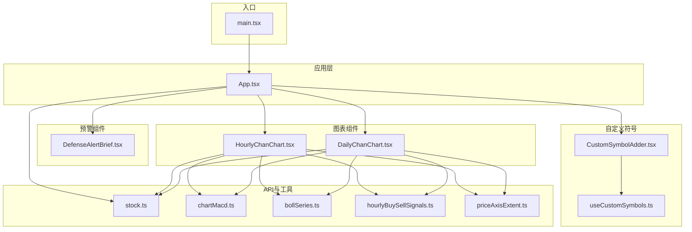
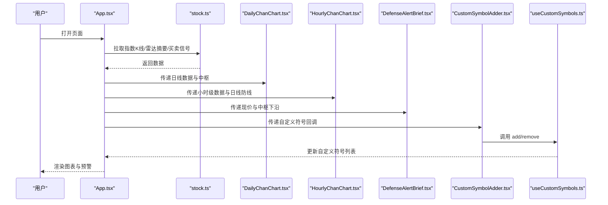
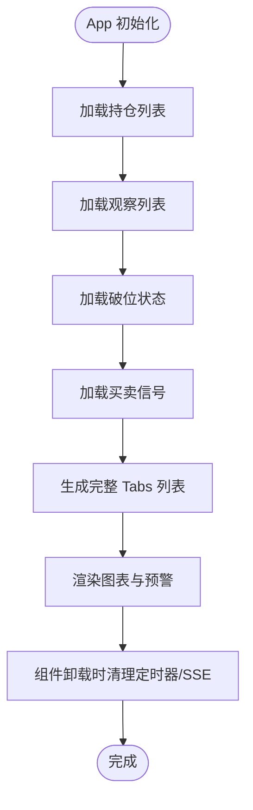
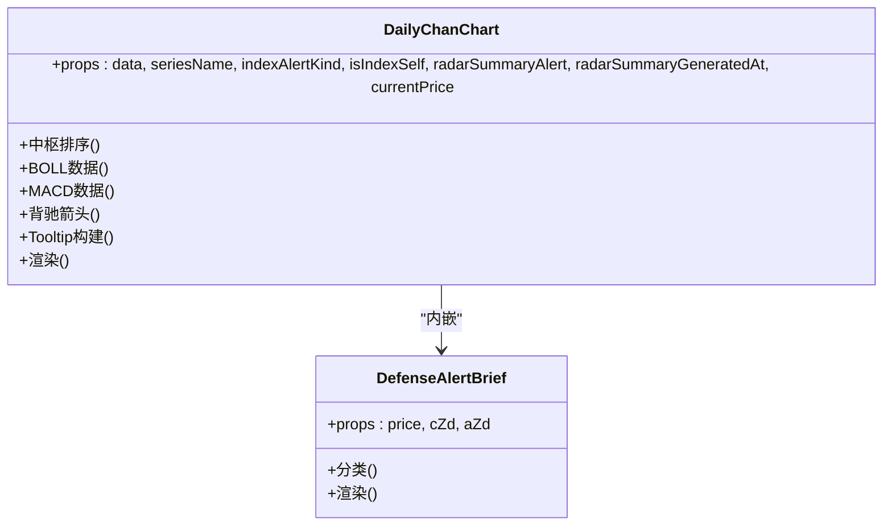
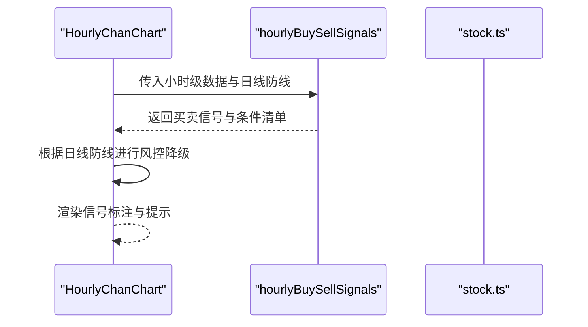
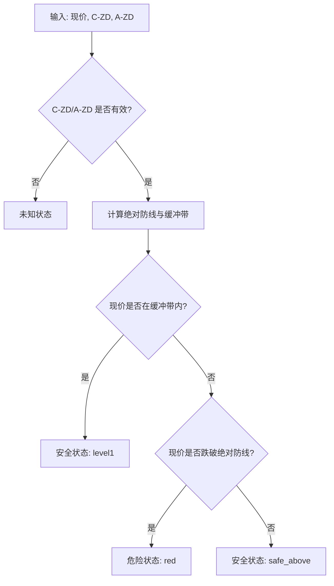
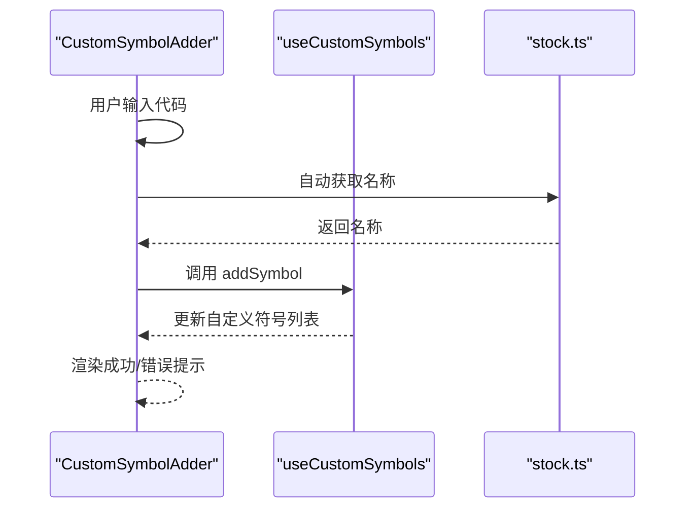
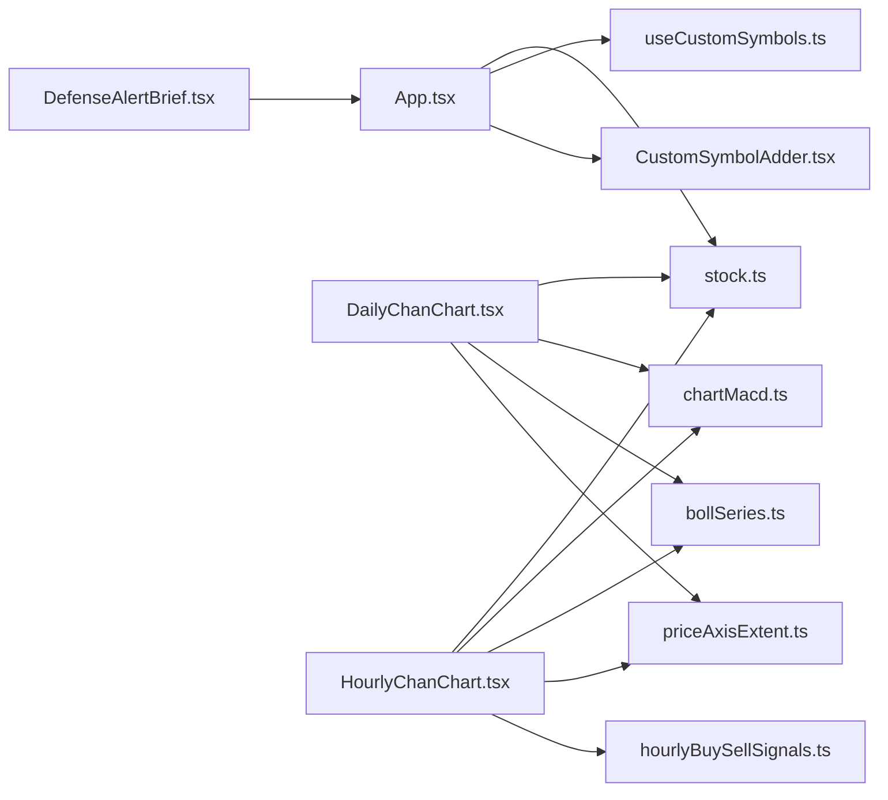

# 组件架构设计

<cite>
**本文档引用的文件**
- [App.tsx](file://frontend/src/App.tsx)
- [DailyChanChart.tsx](file://frontend/src/DailyChanChart.tsx)
- [HourlyChanChart.tsx](file://frontend/src/HourlyChanChart.tsx)
- [DefenseAlertBrief.tsx](file://frontend/src/DefenseAlertBrief.tsx)
- [CustomSymbolAdder.tsx](file://frontend/src/components/CustomSymbolAdder.tsx)
- [useCustomSymbols.ts](file://frontend/src/hooks/useCustomSymbols.ts)
- [stock.ts](file://frontend/src/api/stock.ts)
- [main.tsx](file://frontend/src/main.tsx)
- [package.json](file://frontend/package.json)
- [chartMacd.ts](file://frontend/src/chartMacd.ts)
- [bollSeries.ts](file://frontend/src/bollSeries.ts)
- [hourlyBuySellSignals.ts](file://frontend/src/hourlyBuySellSignals.ts)
- [priceAxisExtent.ts](file://frontend/src/priceAxisExtent.ts)
</cite>

## 目录
1. [简介](#简介)
2. [项目结构](#项目结构)
3. [核心组件](#核心组件)
4. [架构总览](#架构总览)
5. [详细组件分析](#详细组件分析)
6. [依赖关系分析](#依赖关系分析)
7. [性能考量](#性能考量)
8. [故障排查指南](#故障排查指南)
9. [结论](#结论)

## 简介
本项目是一个基于 React 19 的金融分析系统，围绕中枢理论与技术指标构建了完整的图表与预警体系。系统采用组件化架构，通过主应用组件 App 统筹全局状态与数据流，图表组件 DailyChanChart 与 HourlyChanChart 提供日线与小时级中枢分析，雷达预警组件 DefenseAlertBrief 实现双防线伏击圈判断，自定义符号添加器 CustomSymbolAdder 支持用户自定义标的管理，并通过 Hook useCustomSymbols 实现本地持久化与状态提升。

## 项目结构
前端采用功能域驱动的目录组织方式，核心文件分布如下：
- 组件层：App、图表组件、预警组件、自定义添加器
- Hooks 层：useCustomSymbols
- API 层：stock.ts 封装后端接口
- 辅助模块：chartMacd.ts、bollSeries.ts、hourlyBuySellSignals.ts、priceAxisExtent.ts
- 入口：main.tsx

**图表来源**
- [main.tsx:1-11](file://frontend/src/main.tsx#L1-L11)
- [App.tsx:1-1552](file://frontend/src/App.tsx#L1-L1552)
- [DailyChanChart.tsx:1-820](file://frontend/src/DailyChanChart.tsx#L1-L820)
- [HourlyChanChart.tsx:1-1632](file://frontend/src/HourlyChanChart.tsx#L1-L1632)
- [DefenseAlertBrief.tsx:1-88](file://frontend/src/DefenseAlertBrief.tsx#L1-L88)
- [CustomSymbolAdder.tsx:1-192](file://frontend/src/components/CustomSymbolAdder.tsx#L1-L192)
- [useCustomSymbols.ts:1-77](file://frontend/src/hooks/useCustomSymbols.ts#L1-L77)
- [stock.ts:1-468](file://frontend/src/api/stock.ts#L1-L468)
- [chartMacd.ts:1-71](file://frontend/src/chartMacd.ts#L1-L71)
- [bollSeries.ts:1-34](file://frontend/src/bollSeries.ts#L1-L34)
- [hourlyBuySellSignals.ts:1-1676](file://frontend/src/hourlyBuySellSignals.ts#L1-L1676)
- [priceAxisExtent.ts:1-52](file://frontend/src/priceAxisExtent.ts#L1-L52)

**章节来源**
- [main.tsx:1-11](file://frontend/src/main.tsx#L1-L11)
- [package.json:1-33](file://frontend/package.json#L1-L33)

## 核心组件
- App：全局状态管理、数据拉取与缓存、图表 Tabs 生成、雷达摘要与买卖信号处理、自定义符号持久化。
- DailyChanChart：日线中枢分析与可视化，包含中枢标记区、BOLL 带、MACD 子图、背驰箭头与提示。
- HourlyChanChart：小时级中枢与买卖信号识别，结合日线防线进行跨级别风控与信号标注。
- DefenseAlertBrief：双防线伏击圈判断与状态展示，提供安全区间与区间范围。
- CustomSymbolAdder：自定义标的添加与移除，支持自动获取名称与本地存储。
- useCustomSymbols：自定义符号 Hook，封装本地存储与状态提升。

**章节来源**
- [App.tsx:598-1552](file://frontend/src/App.tsx#L598-L1552)
- [DailyChanChart.tsx:161-820](file://frontend/src/DailyChanChart.tsx#L161-L820)
- [HourlyChanChart.tsx:179-1632](file://frontend/src/HourlyChanChart.tsx#L179-L1632)
- [DefenseAlertBrief.tsx:28-88](file://frontend/src/DefenseAlertBrief.tsx#L28-L88)
- [CustomSymbolAdder.tsx:30-192](file://frontend/src/components/CustomSymbolAdder.tsx#L30-L192)
- [useCustomSymbols.ts:11-77](file://frontend/src/hooks/useCustomSymbols.ts#L11-L77)

## 架构总览
系统采用“主应用 + 多图表 + 预警 + 自定义符号”的组合架构，数据流自后端 API 通过 stock.ts 暴露，App 负责聚合与分发，图表组件负责渲染与交互，预警组件负责状态提示，自定义符号通过 Hook 实现跨组件共享。

**图表来源**
- [App.tsx:598-1552](file://frontend/src/App.tsx#L598-L1552)
- [stock.ts:185-468](file://frontend/src/api/stock.ts#L185-L468)
- [DailyChanChart.tsx:161-820](file://frontend/src/DailyChanChart.tsx#L161-L820)
- [HourlyChanChart.tsx:179-1632](file://frontend/src/HourlyChanChart.tsx#L179-L1632)
- [DefenseAlertBrief.tsx:28-88](file://frontend/src/DefenseAlertBrief.tsx#L28-L88)
- [CustomSymbolAdder.tsx:30-192](file://frontend/src/components/CustomSymbolAdder.tsx#L30-L192)
- [useCustomSymbols.ts:11-77](file://frontend/src/hooks/useCustomSymbols.ts#L11-L77)

## 详细组件分析

### 主应用组件 App 的架构设计
- 全局状态：自定义符号、图表数据、雷达摘要、买卖信号、观察/持仓列表、Tabs 可见性与持久化。
- 数据拉取：指数 K 线、雷达摘要、买卖信号、观察/持仓列表，使用长轮询与 SSE 推送。
- Tabs 管理：动态生成包含内置标的与自定义标的的完整 Tabs 列表，支持始终可见与手动关闭。
- 性能优化：使用 useMemo 与空对象初始化，避免不必要的重渲染；localStorage 缓存 Tabs 与自定义符号。
- 生命周期：useEffect 管理数据加载与清理，定时器与 SSE 连接在卸载时释放。

**图表来源**
- [App.tsx:666-747](file://frontend/src/App.tsx#L666-L747)
- [App.tsx:749-800](file://frontend/src/App.tsx#L749-L800)
- [App.tsx:598-1552](file://frontend/src/App.tsx#L598-L1552)

**章节来源**
- [App.tsx:598-1552](file://frontend/src/App.tsx#L598-L1552)

### 图表组件 DailyChanChart 的组件结构
- 数据准备：中枢排序、BOLL 数据构建、MACD 数据提取、背驰箭头计算。
- 视觉元素：K 线蜡烛图、中枢标记区、ZG/ZD/DD 线、BOLL 带、MACD 子图、背驰箭头、分型标记。
- 交互提示：统一 Tooltip 构建，包含价格、BOLL、中枢提示与 MACD 信息。
- 预警集成：内嵌 DefenseAlertBrief，展示核心伏击圈状态与区间范围。

**图表来源**
- [DailyChanChart.tsx:161-820](file://frontend/src/DailyChanChart.tsx#L161-L820)
- [DefenseAlertBrief.tsx:28-88](file://frontend/src/DefenseAlertBrief.tsx#L28-L88)

**章节来源**
- [DailyChanChart.tsx:161-820](file://frontend/src/DailyChanChart.tsx#L161-L820)

### 图表组件 HourlyChanChart 的组件结构
- 买卖信号：基于日线防线与小时级数据，实现一买、二买、三买与对应失败信号的识别与标注。
- 跨级别风控：根据日线绝对防线与核心伏击圈进行信号降级与仓位建议。
- 信号面板：7 条条件自检清单，支持后端条件与前端实时计算两种模式。
- 交互提示：统一 Tooltip 构建，叠加买卖信号说明与风控提示。

**图表来源**
- [HourlyChanChart.tsx:179-1632](file://frontend/src/HourlyChanChart.tsx#L179-L1632)
- [hourlyBuySellSignals.ts:122-148](file://frontend/src/hourlyBuySellSignals.ts#L122-L148)

**章节来源**
- [HourlyChanChart.tsx:179-1632](file://frontend/src/HourlyChanChart.tsx#L179-L1632)
- [hourlyBuySellSignals.ts:1-1676](file://frontend/src/hourlyBuySellSignals.ts#L1-L1676)

### 雷达预警组件 DefenseAlertBrief 的设计模式
- 分类算法：根据日线 C-ZD 与 A-ZD 的最小值确定绝对防线，±1% 缓冲带与安全区间。
- 状态渲染：根据是否处于核心伏击圈，返回不同样式与提示信息。
- 设计模式：纯函数式组件，接收价格与中枢下沿，返回状态面板。

**图表来源**
- [DefenseAlertBrief.tsx:11-26](file://frontend/src/DefenseAlertBrief.tsx#L11-L26)
- [DefenseAlertBrief.tsx:28-88](file://frontend/src/DefenseAlertBrief.tsx#L28-L88)

**章节来源**
- [DefenseAlertBrief.tsx:11-88](file://frontend/src/DefenseAlertBrief.tsx#L11-L88)

### 自定义符号添加器 CustomSymbolAdder 的组件设计与 Hook 使用
- 组件职责：输入股票代码，自动获取名称，添加到自定义列表，支持移除。
- Hook 使用：useCustomSymbols 提供 addSymbol/removeSymbol/hasSymbol，实现本地持久化与状态提升。
- 输入验证：支持 6 位数字、sh/sz+6 位、hk+5 位格式。
- 状态管理：内部维护 loading、success/error 状态，避免重复请求。

**图表来源**
- [CustomSymbolAdder.tsx:30-192](file://frontend/src/components/CustomSymbolAdder.tsx#L30-L192)
- [useCustomSymbols.ts:11-77](file://frontend/src/hooks/useCustomSymbols.ts#L11-L77)
- [stock.ts:132-155](file://frontend/src/api/stock.ts#L132-L155)

**章节来源**
- [CustomSymbolAdder.tsx:30-192](file://frontend/src/components/CustomSymbolAdder.tsx#L30-L192)
- [useCustomSymbols.ts:11-77](file://frontend/src/hooks/useCustomSymbols.ts#L11-L77)

## 依赖关系分析
- 组件依赖：DailyChanChart 与 HourlyChanChart 依赖 chartMacd.ts、bollSeries.ts、priceAxisExtent.ts 与 hourlyBuySellSignals.ts。
- 应用依赖：App 依赖 stock.ts、useCustomSymbols.ts、CustomSymbolAdder.ts。
- 外部依赖：React 19、echarts-for-react、echarts。

**图表来源**
- [App.tsx:1-17](file://frontend/src/App.tsx#L1-L17)
- [DailyChanChart.tsx:1-16](file://frontend/src/DailyChanChart.tsx#L1-L16)
- [HourlyChanChart.tsx:1-16](file://frontend/src/HourlyChanChart.tsx#L1-L16)
- [DefenseAlertBrief.tsx:1-10](file://frontend/src/DefenseAlertBrief.tsx#L1-L10)
- [CustomSymbolAdder.tsx:1-7](file://frontend/src/components/CustomSymbolAdder.tsx#L1-L7)
- [useCustomSymbols.ts:1-1](file://frontend/src/hooks/useCustomSymbols.ts#L1-L1)
- [stock.ts:114-468](file://frontend/src/api/stock.ts#L114-L468)
- [chartMacd.ts:1-71](file://frontend/src/chartMacd.ts#L1-L71)
- [bollSeries.ts:1-34](file://frontend/src/bollSeries.ts#L1-L34)
- [hourlyBuySellSignals.ts:1-1676](file://frontend/src/hourlyBuySellSignals.ts#L1-L1676)
- [priceAxisExtent.ts:1-52](file://frontend/src/priceAxisExtent.ts#L1-L52)

**章节来源**
- [package.json:12-31](file://frontend/package.json#L12-L31)

## 性能考量
- 状态提升与记忆化：App 使用 useMemo 生成 Tabs 与图表数据映射，避免重复计算。
- 图表渲染优化：DailyChanChart 与 HourlyChanChart 使用 ECharts 的 notMerge 与 SVG 渲染，减少重绘。
- 数据缓存：App 通过空对象初始化图表数据映射，配合 useMemo 避免无效渲染。
- 本地持久化：useCustomSymbols 与 App 的 localStorage 读写，减少重复网络请求。
- 异步请求：stock.ts 的 fetchWithRetry 与 SSE 连接，确保稳定性与可恢复性。

[本节为通用性能指导，无需特定文件引用]

## 故障排查指南
- 自定义符号添加失败：检查代码格式与后端名称接口可用性，查看控制台日志。
- 图表渲染异常：确认 ECharts 选项构建逻辑与数据完整性，检查 priceAxisExtent 与 BOLL 数据。
- 雷达摘要未更新：确认 SSE 连接状态与后端定时任务，检查 App 中的定时器与清理逻辑。
- 买卖信号不显示：核对 hourlyBuySellSignals 的条件与日线防线参数，确认 isDailyBroken 与 isInAmbushZone 的判断。

**章节来源**
- [CustomSymbolAdder.tsx:9-28](file://frontend/src/components/CustomSymbolAdder.tsx#L9-L28)
- [stock.ts:448-468](file://frontend/src/api/stock.ts#L448-L468)
- [hourlyBuySellSignals.ts:150-178](file://frontend/src/hourlyBuySellSignals.ts#L150-L178)

## 结论
本系统通过清晰的组件边界与状态管理模式，实现了中枢分析、雷达预警与自定义符号管理的有机整合。App 作为中枢控制器，DailyChanChart 与 HourlyChanChart 提供专业级可视化，DefenseAlertBrief 与 hourlyBuySellSignals 实现风控与信号识别，CustomSymbolAdder 与 useCustomSymbols 提供灵活扩展。整体架构具备良好的可维护性与扩展性，适合进一步引入更多技术分析模块与用户偏好配置。