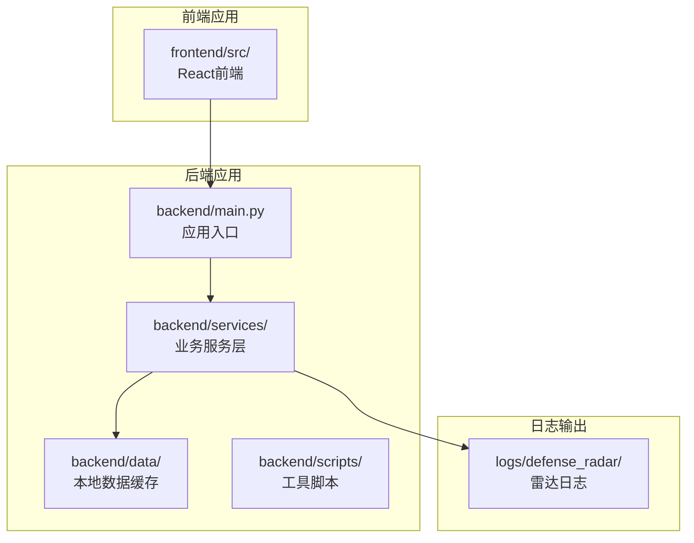
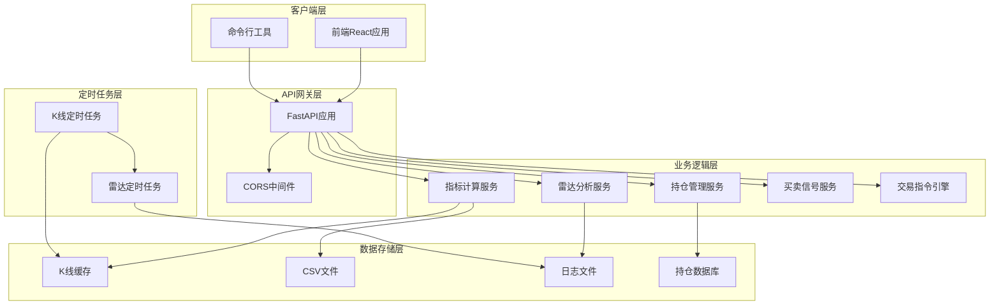
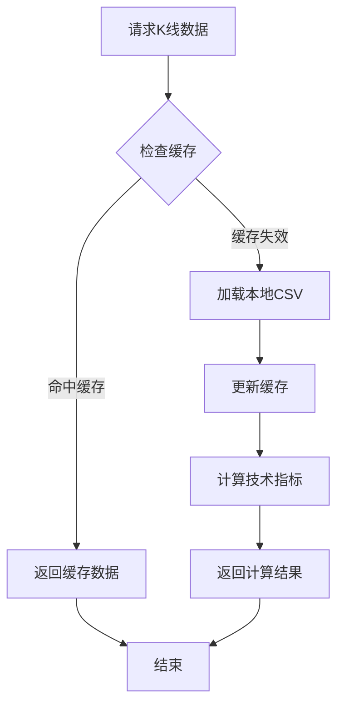
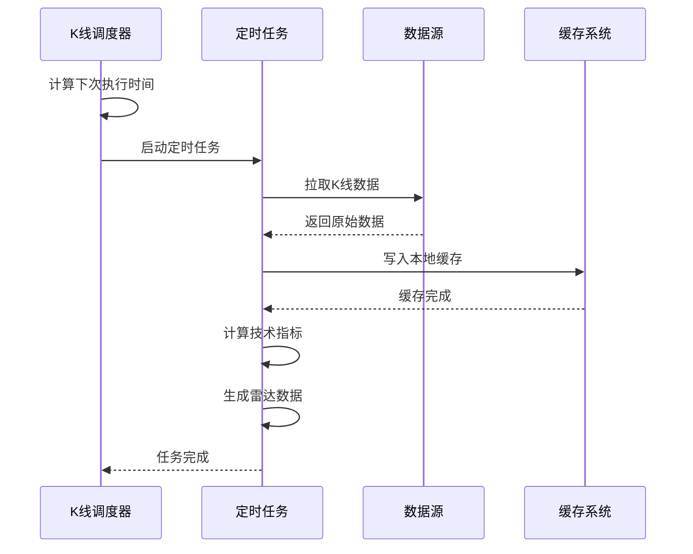
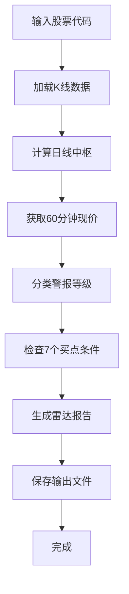
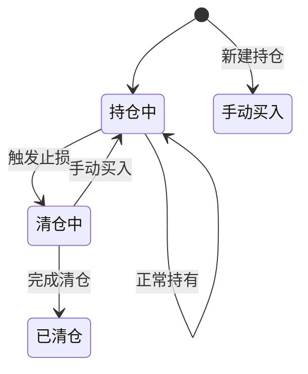
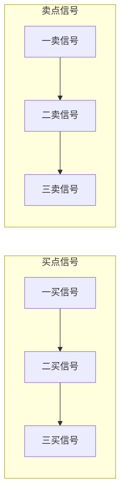
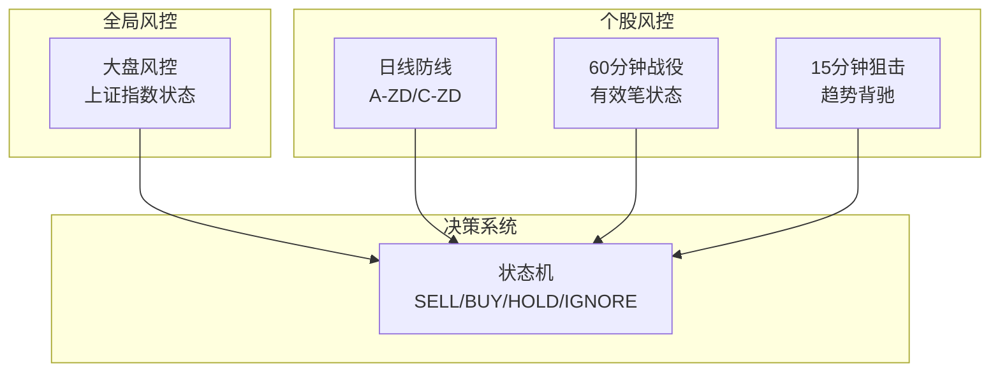
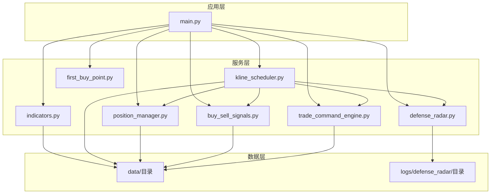

# FastAPI应用架构

<cite>
**本文档引用的文件**
- [backend/main.py](file://backend/main.py)
- [backend/services/indicators.py](file://backend/services/indicators.py)
- [backend/services/kline_scheduler.py](file://backend/services/kline_scheduler.py)
- [backend/services/defense_radar.py](file://backend/services/defense_radar.py)
- [backend/services/position_manager.py](file://backend/services/position_manager.py)
- [backend/services/buy_sell_signals.py](file://backend/services/buy_sell_signals.py)
- [backend/services/first_buy_point.py](file://backend/services/first_buy_point.py)
- [backend/services/trade_command_engine.py](file://backend/services/trade_command_engine.py)
- [backend/run_defense_radar.py](file://backend/run_defense_radar.py)
- [backend/run_trade_command.py](file://backend/run_trade_command.py)
- [backend/update_radar.py](file://backend/update_radar.py)
- [backend/update_radar_local.py](file://backend/update_radar_local.py)
- [backend/requirements.txt](file://backend/requirements.txt)
- [README.md](file://README.md)
</cite>

## 目录
1. [简介](#简介)
2. [项目结构](#项目结构)
3. [核心组件](#核心组件)
4. [架构概览](#架构概览)
5. [详细组件分析](#详细组件分析)
6. [依赖关系分析](#依赖关系分析)
7. [性能考虑](#性能考虑)
8. [故障排查指南](#故障排查指南)
9. [结论](#结论)

## 简介

这是一个基于FastAPI的A股量化分析平台，集成了缠论技术分析、双防线雷达预警系统和实时数据推送功能。应用采用本地优先的数据策略，通过定时任务维护K线缓存，提供RESTful API接口供前端React应用消费。

## 项目结构

**图表来源**
- [backend/main.py:1-532](file://backend/main.py#L1-L532)
- [README.md:216-244](file://README.md#L216-L244)

**章节来源**
- [README.md:1-269](file://README.md#L1-L269)

## 核心组件

### 应用入口与生命周期管理

应用使用FastAPI的lifespan机制管理生命周期，实现了优雅的启动和关闭流程：

- **启动阶段**：初始化SSE回调、设置持仓管理回调、启动K线定时任务
- **运行阶段**：提供完整的API服务和SSE实时推送
- **关闭阶段**：优雅关闭定时任务，释放资源

### 中间件配置

应用配置了CORS中间件，支持本地开发环境的跨域访问：

- 允许任意来源（开发环境）
- 支持凭据传输
- 支持所有HTTP方法和头部

### SSE实时推送系统

实现了基于Server-Sent Events的实时数据推送：

- 支持雷达更新通知
- 支持止损触发告警
- 线程安全的消息分发
- 自动断线重连处理

**章节来源**
- [backend/main.py:91-123](file://backend/main.py#L91-L123)
- [backend/main.py:31-82](file://backend/main.py#L31-L82)
- [backend/main.py:229-270](file://backend/main.py#L229-L270)

## 架构概览

**图表来源**
- [backend/main.py:105-123](file://backend/main.py#L105-L123)
- [backend/services/indicators.py:1-100](file://backend/services/indicators.py#L1-L100)
- [backend/services/kline_scheduler.py:1-50](file://backend/services/kline_scheduler.py#L1-L50)

## 详细组件分析

### 指标计算服务 (indicators.py)

这是应用的核心数据处理模块，负责K线数据的获取、缓存和计算：

#### 数据缓存机制

**图表来源**
- [backend/services/indicators.py:121-174](file://backend/services/indicators.py#L121-L174)

#### 技术指标计算

- **MACD指标**：基于指数移动平均线计算
- **布林带**：20日均线和2倍标准差
- **缠论分析**：包含关系处理、分型识别、笔和中枢计算
- **K线合并**：处理包含关系，生成标准化K线序列

#### 支持的数据源

- **新浪接口**：主要的K线数据源
- **AKShare**：部分场景下的备用数据源
- **本地CSV文件**：高性能的本地缓存

**章节来源**
- [backend/services/indicators.py:657-672](file://backend/services/indicators.py#L657-L672)
- [backend/services/indicators.py:176-187](file://backend/services/indicators.py#L176-L187)

### K线定时任务 (kline_scheduler.py)

实现了基于北京时间的定时任务系统：

#### 调度策略

**图表来源**
- [backend/services/kline_scheduler.py:214-251](file://backend/services/kline_scheduler.py#L214-L251)

#### 执行计划

- **10:31/11:31/14:01/15:01**：全量60分钟K线刷新
- **16:01**：全量日线和60分钟K线刷新，包含雷达分析
- **15分钟独立同步**：交易时间内每15分钟刷新一次

#### 任务类型

- **日线同步**：更新日线CSV文件
- **60分钟同步**：更新60分钟K线缓存
- **15分钟同步**：更新15分钟K线缓存
- **止损检查**：检查持仓止损条件
- **雷达分析**：生成双防线雷达数据
- **信号计算**：计算买卖信号状态

**章节来源**
- [backend/services/kline_scheduler.py:43-49](file://backend/services/kline_scheduler.py#L43-L49)
- [backend/services/kline_scheduler.py:214-251](file://backend/services/kline_scheduler.py#L214-L251)

### 双防线雷达 (defense_radar.py)

实现了基于缠论的技术分析系统：

#### 雷达分析逻辑

**图表来源**
- [backend/services/defense_radar.py:600-744](file://backend/services/defense_radar.py#L600-L744)

#### 警报等级分类

- **红色警报**：跌破绝对防线MIN(C-ZD, A-ZD)
- **一级警报**：进入绝对防线伏击圈(±1%缓冲带)
- **日线观察**：未跌破绝对防线，等待更优入场点

#### 买点条件检查

1. **绝对防线支撑**：现价≥MIN(C-ZD, A-ZD)
2. **笔向反转**：有效笔最后一笔向下
3. **MACD动能**：MACD转强判定
4. **蓝三角形态**：严格底分型+K3收盘>K2最低
5. **中枢位置**：现价在C中枢内
6. **底背驰确认**：底背驰点落在当前向上笔内
7. **布林支撑**：BOLL站回中轨

**章节来源**
- [backend/services/defense_radar.py:196-226](file://backend/services/defense_radar.py#L196-L226)
- [backend/services/defense_radar.py:683-744](file://backend/services/defense_radar.py#L683-L744)

### 持仓管理 (position_manager.py)

实现了完整的交易管理系统：

#### 持仓状态管理

#### 止损机制

- **战术止损**：跌破底分型最低点
- **战略止损**：跌破一买绝对低点
- **自动清仓**：触发止损时自动卖出
- **SSE告警**：止损触发时实时推送告警

**章节来源**
- [backend/services/position_manager.py:161-185](file://backend/services/position_manager.py#L161-L185)
- [backend/services/position_manager.py:119-146](file://backend/services/position_manager.py#L119-L146)

### 买卖信号系统 (buy_sell_signals.py)

实现了多级别的技术信号检测：

#### 信号类型

#### 信号检测逻辑

- **一买信号**：基于缠论趋势背驰的底分型确认
- **二买信号**：回踩创新低+MACD动能过滤
- **三买信号**：暴力突破+洗盘回踩确认
- **一卖信号**：中枢结构破坏+MACD转弱
- **二卖信号**：回弹创新高+MACD转弱
- **三卖信号**：跌破中枢下沿+MACD转弱

**章节来源**
- [backend/services/buy_sell_signals.py:581-654](file://backend/services/buy_sell_signals.py#L581-L654)

### 交易指令引擎 (trade_command_engine.py)

实现了无头的量化交易决策系统：

#### 三层风控体系

#### 决策状态机

- **MARKET_DEAD**：大盘系统性风险，强制清仓
- **MARKET_DANGER**：大盘警戒状态，禁止开新仓
- **MARKET_SAFE**：大盘安全，个股独立运行
- **SELL**：卖出信号，强制清仓
- **HOLD**：持有信号，维持现状
- **BUY**：买入信号，按资金规则建仓
- **IGNORE**：观望信号，不进行交易

**章节来源**
- [backend/services/trade_command_engine.py:681-762](file://backend/services/trade_command_engine.py#L681-L762)
- [backend/services/trade_command_engine.py:769-789](file://backend/services/trade_command_engine.py#L769-L789)

## 依赖关系分析

**图表来源**
- [backend/main.py:16-21](file://backend/main.py#L16-L21)
- [backend/services/kline_scheduler.py:28-31](file://backend/services/kline_scheduler.py#L28-L31)

**章节来源**
- [backend/requirements.txt:1-5](file://backend/requirements.txt#L1-L5)

## 性能考虑

### 缓存策略

应用采用了多层次的缓存机制来提升性能：

1. **进程内响应缓存**：基于`(symbol, period, start_date, end_date)`的键值缓存
2. **本地文件缓存**：CSV文件作为持久化缓存
3. **mtime失效机制**：基于文件修改时间的智能失效
4. **TTL过期控制**：默认300秒的缓存过期时间

### 并发处理

- **线程安全**：SSE客户端队列使用线程锁保护
- **异步处理**：FastAPI的异步特性支持高并发请求
- **后台任务**：定时任务在独立线程中运行，不影响主线程

### 数据预处理

- **本地优先**：默认只读本地缓存，减少网络延迟
- **批量处理**：定时任务批量处理所有监控标的
- **增量更新**：仅在数据发生变化时更新缓存

## 故障排查指南

### 常见问题及解决方案

#### API路由问题

**现象**：前端无法访问新的API端点
**原因**：FastAPI路由需要重启后端才能生效
**解决**：重启后端服务或使用`./restart_services.sh`

#### 缓存数据问题

**现象**：K线数据长时间不变
**原因**：本地CSV文件未更新或缓存未失效
**解决**：
1. 检查定时任务是否正常运行
2. 手动触发数据刷新
3. 清除相关缓存文件

#### SSE连接问题

**现象**：实时推送连接中断
**原因**：客户端断开或服务器负载过高
**解决**：
1. 检查SSE客户端连接状态
2. 查看服务器日志
3. 优化服务器资源配置

#### 雷达数据问题

**现象**：双防线雷达数据异常
**原因**：K线数据质量或计算逻辑问题
**解决**：
1. 检查K线数据完整性
2. 验证缠论计算逻辑
3. 手动重新计算雷达数据

**章节来源**
- [README.md:255-263](file://README.md#L255-L263)

## 结论

这个FastAPI应用架构设计合理，具有以下特点：

1. **模块化设计**：清晰的服务层划分，便于维护和扩展
2. **高性能缓存**：多层次缓存机制确保系统性能
3. **实时性保障**：SSE推送和定时任务确保数据实时更新
4. **风险管理**：完善的风控体系和止损机制
5. **可扩展性**：良好的架构设计支持功能扩展

应用通过本地优先的数据策略和智能缓存机制，实现了高性能的量化分析服务，为前端提供了丰富的技术分析数据和实时推送功能。