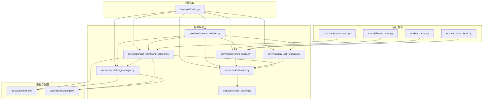
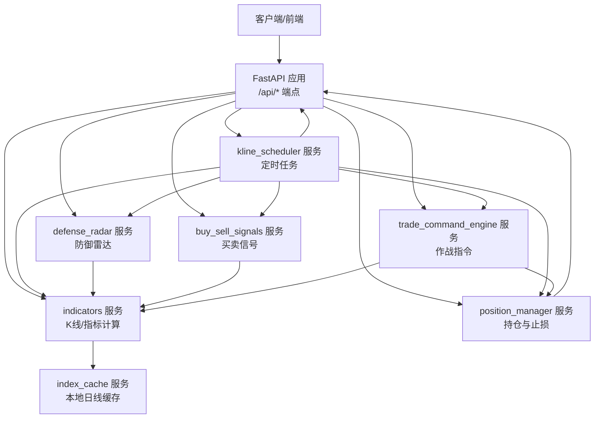
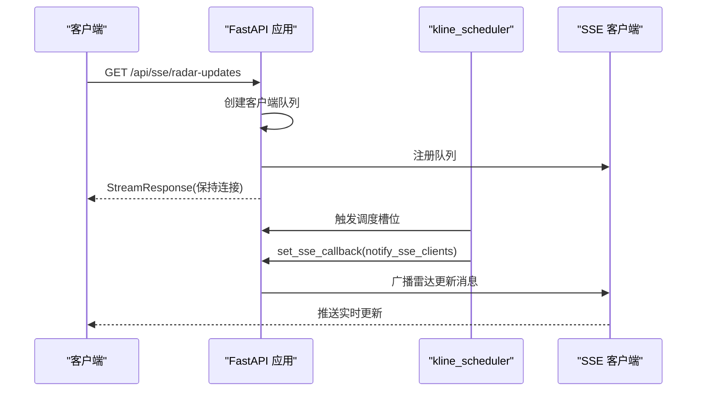
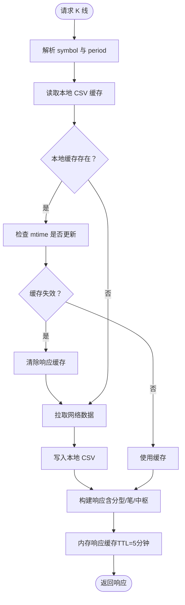
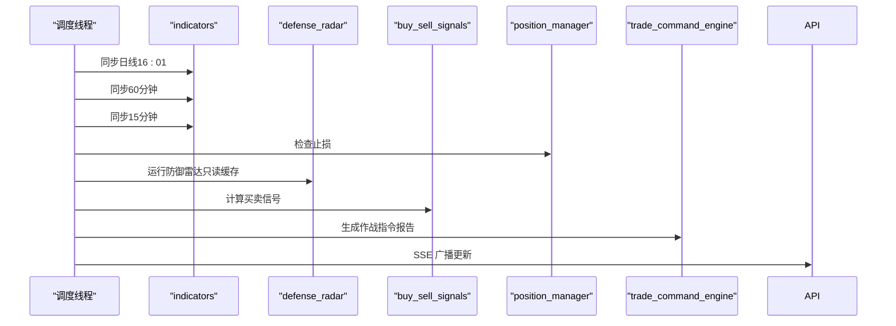
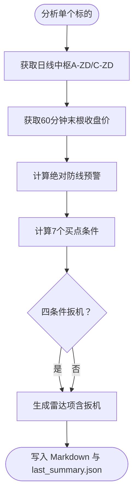
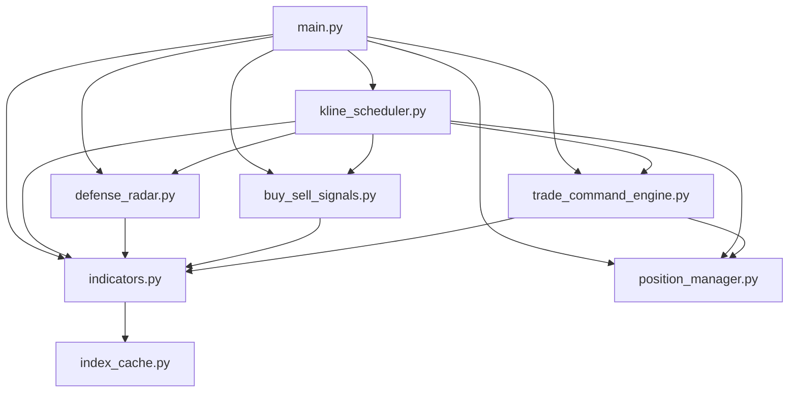

# 后端架构设计

<cite>
**本文档引用的文件**
- [backend/main.py](file://backend/main.py)
- [backend/services/indicators.py](file://backend/services/indicators.py)
- [backend/services/kline_scheduler.py](file://backend/services/kline_scheduler.py)
- [backend/services/defense_radar.py](file://backend/services/defense_radar.py)
- [backend/services/position_manager.py](file://backend/services/position_manager.py)
- [backend/services/trade_command_engine.py](file://backend/services/trade_command_engine.py)
- [backend/services/buy_sell_signals.py](file://backend/services/buy_sell_signals.py)
- [backend/services/index_cache.py](file://backend/services/index_cache.py)
- [backend/data/watchlist.json](file://backend/data/watchlist.json)
- [backend/data/observation.json](file://backend/data/observation.json)
- [backend/requirements.txt](file://backend/requirements.txt)
- [backend/run_defense_radar.py](file://backend/run_defense_radar.py)
- [backend/run_trade_command.py](file://backend/run_trade_command.py)
- [backend/update_radar.py](file://backend/update_radar.py)
- [backend/update_radar_local.py](file://backend/update_radar_local.py)
</cite>

## 目录
1. [简介](#简介)
2. [项目结构](#项目结构)
3. [核心组件](#核心组件)
4. [架构概览](#架构概览)
5. [详细组件分析](#详细组件分析)
6. [依赖关系分析](#依赖关系分析)
7. [性能考虑](#性能考虑)
8. [故障排查指南](#故障排查指南)
9. [结论](#结论)
10. [附录](#附录)

## 简介
本项目是一个基于 FastAPI 的金融分析系统后端，采用微服务化架构，围绕数据获取、缓存、定时任务、业务逻辑与实时推送等模块构建。系统通过 AkShare、新浪接口与本地文件缓存相结合的方式，提供日线级别指标查询、K线数据获取、双防线雷达（防御雷达）分析、买卖信号计算、持仓管理与止损监控、以及无头作战指令引擎等功能。后端通过 SSE 实时推送关键事件，配合定时任务实现自动化数据同步与分析。

## 项目结构
后端采用模块化分层设计：
- 应用入口与路由：backend/main.py
- 服务模块：backend/services/*（indicators、kline_scheduler、defense_radar、position_manager、trade_command_engine、buy_sell_signals、index_cache）
- 数据与配置：backend/data/*（watchlist.json、observation.json）
- 运行脚本：backend/*.py（run_defense_radar.py、run_trade_command.py、update_radar.py、update_radar_local.py）
- 依赖声明：backend/requirements.txt

**图表来源**
- [backend/main.py:1-514](file://backend/main.py#L1-L514)
- [backend/services/indicators.py:1-800](file://backend/services/indicators.py#L1-L800)
- [backend/services/kline_scheduler.py:1-492](file://backend/services/kline_scheduler.py#L1-L492)
- [backend/services/defense_radar.py:1-800](file://backend/services/defense_radar.py#L1-L800)
- [backend/services/position_manager.py:1-210](file://backend/services/position_manager.py#L1-L210)
- [backend/services/trade_command_engine.py:1-800](file://backend/services/trade_command_engine.py#L1-L800)
- [backend/services/buy_sell_signals.py:1-800](file://backend/services/buy_sell_signals.py#L1-L800)
- [backend/services/index_cache.py:1-201](file://backend/services/index_cache.py#L1-L201)
- [backend/data/watchlist.json:1-27](file://backend/data/watchlist.json#L1-L27)
- [backend/data/observation.json:1-25](file://backend/data/observation.json#L1-L25)
- [backend/run_defense_radar.py:1-31](file://backend/run_defense_radar.py#L1-L31)
- [backend/run_trade_command.py:1-24](file://backend/run_trade_command.py#L1-L24)
- [backend/update_radar.py:1-47](file://backend/update_radar.py#L1-L47)
- [backend/update_radar_local.py:1-57](file://backend/update_radar_local.py#L1-L57)

**章节来源**
- [backend/main.py:1-514](file://backend/main.py#L1-L514)
- [backend/requirements.txt:1-5](file://backend/requirements.txt#L1-L5)

## 核心组件
- 应用入口与生命周期管理：FastAPI 应用初始化、CORS 中间件、SSE 客户端队列、应用生命周期钩子 lifespan，负责启动定时任务、设置 SSE 回调、优雅关闭。
- 指标与数据处理层（indicators）：封装 K 线获取、缓存与响应缓存、分型/笔/中枢计算、技术指标（MACD、布林带、KDJ）计算、符号解析与复权调整、网络重试与错误处理。
- 定时任务层（kline_scheduler）：基于北京时间的独立线程定时任务，负责全量同步日线/60分钟/15分钟数据、止损检查、防御雷达、买卖信号与作战指令生成，并通过 SSE 广播。
- 业务逻辑层（defense_radar、buy_sell_signals、trade_command_engine）：防御雷达核心算法、60分钟买卖信号检测、无头作战指令引擎（多级别缠论与风控）。
- 持仓管理与风控（position_manager）：持仓记录、止损检查与自动清仓、SSE 告警推送。
- 缓存与数据源（index_cache、本地CSV缓存）：指数/A股/ETF/港股日线本地缓存、60分钟/15分钟 CSV 缓存、响应缓存与内存缓存失效策略。

**章节来源**
- [backend/main.py:80-92](file://backend/main.py#L80-L92)
- [backend/services/indicators.py:1-800](file://backend/services/indicators.py#L1-L800)
- [backend/services/kline_scheduler.py:1-492](file://backend/services/kline_scheduler.py#L1-L492)
- [backend/services/defense_radar.py:1-800](file://backend/services/defense_radar.py#L1-L800)
- [backend/services/position_manager.py:1-210](file://backend/services/position_manager.py#L1-L210)
- [backend/services/buy_sell_signals.py:1-800](file://backend/services/buy_sell_signals.py#L1-L800)
- [backend/services/trade_command_engine.py:1-800](file://backend/services/trade_command_engine.py#L1-L800)
- [backend/services/index_cache.py:1-201](file://backend/services/index_cache.py#L1-L201)

## 架构概览
系统采用“应用入口 + 多服务模块”的微服务化架构，通过 FastAPI 提供 REST API 与 SSE 实时推送，定时任务模块独立线程运行，服务模块之间通过明确的接口耦合，数据主要通过本地 CSV 缓存与内存响应缓存实现高效访问。

**图表来源**
- [backend/main.py:110-514](file://backend/main.py#L110-L514)
- [backend/services/indicators.py:1-800](file://backend/services/indicators.py#L1-L800)
- [backend/services/kline_scheduler.py:1-492](file://backend/services/kline_scheduler.py#L1-L492)
- [backend/services/defense_radar.py:1-800](file://backend/services/defense_radar.py#L1-L800)
- [backend/services/position_manager.py:1-210](file://backend/services/position_manager.py#L1-L210)
- [backend/services/buy_sell_signals.py:1-800](file://backend/services/buy_sell_signals.py#L1-L800)
- [backend/services/trade_command_engine.py:1-800](file://backend/services/trade_command_engine.py#L1-L800)
- [backend/services/index_cache.py:1-201](file://backend/services/index_cache.py#L1-L201)

## 详细组件分析

### 应用入口与生命周期管理
- CORS 中间件：允许任意来源访问。
- 生命周期 lifespan：启动时设置 SSE 回调、启动定时任务；关闭时优雅停止定时任务。
- SSE 客户端管理：维护客户端队列，异步发送消息，自动清理断连客户端。
- API 端点：
  - 指标查询：/api/stock/indicators、/api/stock/history-indicators
  - K线获取：/api/index/kline
  - 防御雷达：/api/diagnosis/defense-radar/summary、/api/diagnosis/defense-radar（POST）
  - 调度状态：/api/scheduler/status
  - 股票名称：/api/stock/name
  - 一买检测：/api/first-buy-point、/api/first-buy-point/scan
  - 持仓管理：/api/positions、/api/positions/buy、/api/positions/sell、/api/positions/history
  - 用户列表：/api/watchlist、/api/observation
  - 破位状态与买卖信号：/api/broken-symbols、/api/buy-sell-signals
  - SSE 实时推送：/api/sse/radar-updates

**图表来源**
- [backend/main.py:213-252](file://backend/main.py#L213-L252)
- [backend/main.py:28-70](file://backend/main.py#L28-L70)
- [backend/services/kline_scheduler.py:95-104](file://backend/services/kline_scheduler.py#L95-L104)

**章节来源**
- [backend/main.py:100-252](file://backend/main.py#L100-L252)
- [backend/main.py:80-92](file://backend/main.py#L80-L92)

### 指标与数据处理层（indicators）
- 数据源与缓存策略：
  - 日线：新浪接口（指数/A股/ETF）、AKShare（港股）；本地 CSV 缓存，严格本地优先。
  - 60分钟/15分钟：新浪接口；本地 CSV 缓存，支持兜底。
  - 响应缓存：内存缓存，按 symbol+period+start+end 维度缓存，TTL 5分钟，最大容量 256。
- 缓存失效策略：当本地 CSV 的 mtime 更新时，清除对应 symbol+period 的响应缓存，触发重算。
- 复权与符号解析：自动识别指数、A股、ETF、港股，设置合适的复权方式。
- 技术指标：MACD、布林带、KDJ；分型/笔/中枢计算；包含关系合并；日期键对齐。
- 网络重试：针对东方财富接口的瞬时错误进行重试，提升稳定性。

**图表来源**
- [backend/services/indicators.py:121-174](file://backend/services/indicators.py#L121-L174)
- [backend/services/indicators.py:251-292](file://backend/services/indicators.py#L251-L292)
- [backend/services/indicators.py:359-401](file://backend/services/indicators.py#L359-L401)
- [backend/services/indicators.py:489-522](file://backend/services/indicators.py#L489-L522)

**章节来源**
- [backend/services/indicators.py:1-800](file://backend/services/indicators.py#L1-L800)
- [backend/services/index_cache.py:1-201](file://backend/services/index_cache.py#L1-L201)

### 定时任务层（kline_scheduler）
- 调度策略：北京时间槽位（10:31/11:31/14:01/15:01/16:01），主槽位包含日线同步，16:01 同步日线与60分钟并执行雷达。
- 独立线程：独立线程睡眠到下一槽位唤醒执行，多 worker 去重通过文件锁。
- 任务内容：全量同步日线/60分钟/15分钟、止损检查、防御雷达、买卖信号、作战指令生成。
- 健康状态：心跳与状态文件共享，提供健康检查接口。
- SSE 广播：调度完成后向 SSE 客户端推送更新消息。

**图表来源**
- [backend/services/kline_scheduler.py:211-256](file://backend/services/kline_scheduler.py#L211-L256)
- [backend/services/kline_scheduler.py:448-492](file://backend/services/kline_scheduler.py#L448-L492)

**章节来源**
- [backend/services/kline_scheduler.py:1-492](file://backend/services/kline_scheduler.py#L1-L492)

### 业务逻辑层（defense_radar）
- 核心算法：基于日线中枢（A-ZD/C-ZD）与60分钟现价的“绝对防线”逻辑，结合末笔方向、MACD 转强、蓝三角（底分型+K3确认）等条件，形成四条件串联扳机。
- 输出：Markdown 报告与 last_summary.json，供前端秒读。
- 与定时任务集成：由调度器在每次 60 分钟同步后调用，亦可通过 API 或脚本手动触发。

**图表来源**
- [backend/services/defense_radar.py:418-429](file://backend/services/defense_radar.py#L418-L429)
- [backend/services/defense_radar.py:747-800](file://backend/services/defense_radar.py#L747-L800)

**章节来源**
- [backend/services/defense_radar.py:1-800](file://backend/services/defense_radar.py#L1-L800)

### 业务逻辑层（buy_sell_signals）
- 60分钟买卖信号批量计算：一买（复用 first_buy_point）、二买、三买、一卖、二卖、三卖。
- 过滤与失效检查：与前端逻辑对齐，应用 keepDailySupport、hasBottomDivInSwitch、inCcentral 等过滤条件，并对买点进行失效检查。
- 结果持久化：写入 buy_sell_signals.json，前端直接读取。

**章节来源**
- [backend/services/buy_sell_signals.py:1-800](file://backend/services/buy_sell_signals.py#L1-L800)

### 业务逻辑层（trade_command_engine）
- 无头报告引擎：独立后台脚本，不触碰前端 UI。
- 三层风控：全局大盘风控（上证指数）、个股三维区间套（日线/60分钟/15分钟）、终极状态机（SELL/BUY/HOLD/IGNORE）。
- 多级别分析：15分钟趋势背驰与盘整背驰检测，跨级别联立校验（15分钟背驰 ↔ 60分钟笔完成）。
- 输出：Markdown 报告，追加写入 trade_reports/ 目录。

**章节来源**
- [backend/services/trade_command_engine.py:1-800](file://backend/services/trade_command_engine.py#L1-L800)

### 持仓管理与风控（position_manager）
- 功能：记录买入持仓、定时检查止损（战术止损/战略止损）、自动清仓、SSE 告警推送。
- 数据持久化：backend/data/positions.json。
- 与定时任务集成：调度器在每次槽位执行后检查持仓止损。

**章节来源**
- [backend/services/position_manager.py:1-210](file://backend/services/position_manager.py#L1-L210)

### 运行脚本与工具
- run_defense_radar.py：手动触发防御雷达（默认只读缓存，可加 --refresh 强制拉网）。
- run_trade_command.py：手动触发作战指令引擎。
- update_radar.py：更新雷达数据并检查特定股票。
- update_radar_local.py：基于本地缓存重新计算雷达摘要（不访问网络）。

**章节来源**
- [backend/run_defense_radar.py:1-31](file://backend/run_defense_radar.py#L1-L31)
- [backend/run_trade_command.py:1-24](file://backend/run_trade_command.py#L1-L24)
- [backend/update_radar.py:1-47](file://backend/update_radar.py#L1-L47)
- [backend/update_radar_local.py:1-57](file://backend/update_radar_local.py#L1-L57)

## 依赖关系分析
- 应用入口依赖各服务模块的接口，通过 FastAPI 路由组织。
- 指标服务依赖缓存服务，定时任务依赖指标服务与各业务服务。
- 业务服务之间通过指标服务共享数据，避免重复拉取网络。
- 运行脚本与工具直接调用服务模块，便于离线分析与排障。

**图表来源**
- [backend/main.py:14-19](file://backend/main.py#L14-L19)
- [backend/services/indicators.py:17-25](file://backend/services/indicators.py#L17-L25)
- [backend/services/kline_scheduler.py:28-31](file://backend/services/kline_scheduler.py#L28-L31)
- [backend/services/defense_radar.py:27](file://backend/services/defense_radar.py#L27)
- [backend/services/buy_sell_signals.py:24-26](file://backend/services/buy_sell_signals.py#L24-L26)
- [backend/services/trade_command_engine.py:32-34](file://backend/services/trade_command_engine.py#L32-L34)

**章节来源**
- [backend/main.py:14-19](file://backend/main.py#L14-L19)
- [backend/services/indicators.py:17-25](file://backend/services/indicators.py#L17-L25)
- [backend/services/kline_scheduler.py:28-31](file://backend/services/kline_scheduler.py#L28-L31)
- [backend/services/defense_radar.py:27](file://backend/services/defense_radar.py#L27)
- [backend/services/buy_sell_signals.py:24-26](file://backend/services/buy_sell_signals.py#L24-L26)
- [backend/services/trade_command_engine.py:32-34](file://backend/services/trade_command_engine.py#L32-L34)

## 性能考虑
- 缓存策略：
  - 本地 CSV 缓存：严格本地优先，减少网络访问。
  - 响应缓存：内存缓存 + TTL + 最大项限制，避免进程常驻内存膨胀。
  - 缓存失效：基于本地 CSV mtime 的精准失效，避免不必要的重算。
- 网络重试：针对易波动接口增加轻量重试，提升稳定性。
- 定时任务：独立线程 + 文件锁去重，避免重复同步；主槽位与15分钟槽位合并，减少重复工作。
- SSE：客户端队列 + 心跳保活，降低连接中断概率。
- 数据结构：K线与分型/笔/中枢计算使用 Pandas，提高数值计算效率。

[本节为通用性能讨论，无需具体文件分析]

## 故障排查指南
- API 错误处理：统一捕获 ValueError 与通用异常，返回 400/500 并记录日志。
- 定时任务健康检查：通过 /api/scheduler/status 查询心跳、下次调度时间、槽位计数等。
- 防御雷达与买卖信号：支持 --refresh 参数或 refresh=true 强制拉网，便于排障。
- SSE 连接：检查 /api/sse/radar-updates 是否正常推送，关注客户端断连与队列写入失败日志。
- 缓存一致性：若出现数据不一致，检查本地 CSV mtime 与响应缓存是否正确失效。

**章节来源**
- [backend/main.py:110-137](file://backend/main.py#L110-L137)
- [backend/main.py:183-187](file://backend/main.py#L183-L187)
- [backend/services/kline_scheduler.py:410-446](file://backend/services/kline_scheduler.py#L410-L446)
- [backend/run_defense_radar.py:22-26](file://backend/run_defense_radar.py#L22-L26)

## 结论
本系统通过 FastAPI 提供统一 API 与实时推送能力，结合本地缓存与内存响应缓存实现高效的数据访问；定时任务模块确保数据同步与分析的自动化；服务模块职责清晰、耦合度低，便于扩展与维护。整体架构兼顾性能、稳定性与可运维性，适合金融分析场景的持续演进。

[本节为总结性内容，无需具体文件分析]

## 附录
- 数据文件：
  - watchlist.json：用户持仓/自选列表
  - observation.json：观察列表（仅前端显示）
- 依赖包：FastAPI、Uvicorn、Pandas、AkShare

**章节来源**
- [backend/data/watchlist.json:1-27](file://backend/data/watchlist.json#L1-L27)
- [backend/data/observation.json:1-25](file://backend/data/observation.json#L1-L25)
- [backend/requirements.txt:1-5](file://backend/requirements.txt#L1-L5)