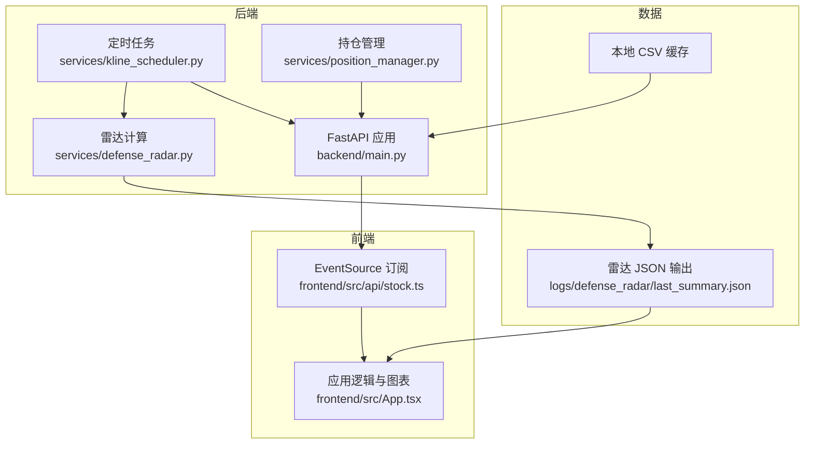
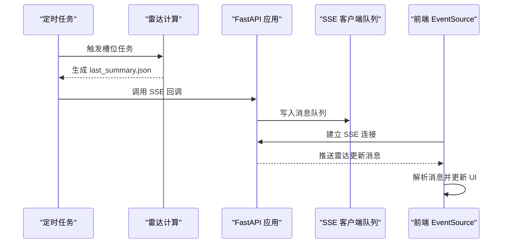
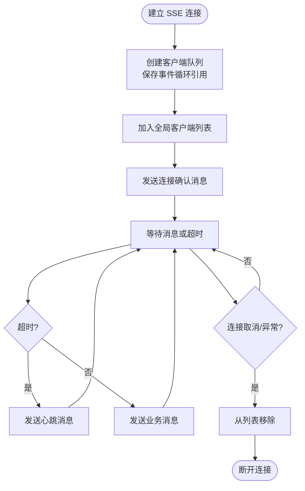
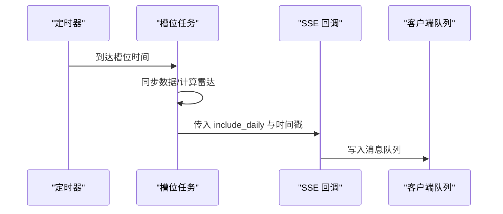
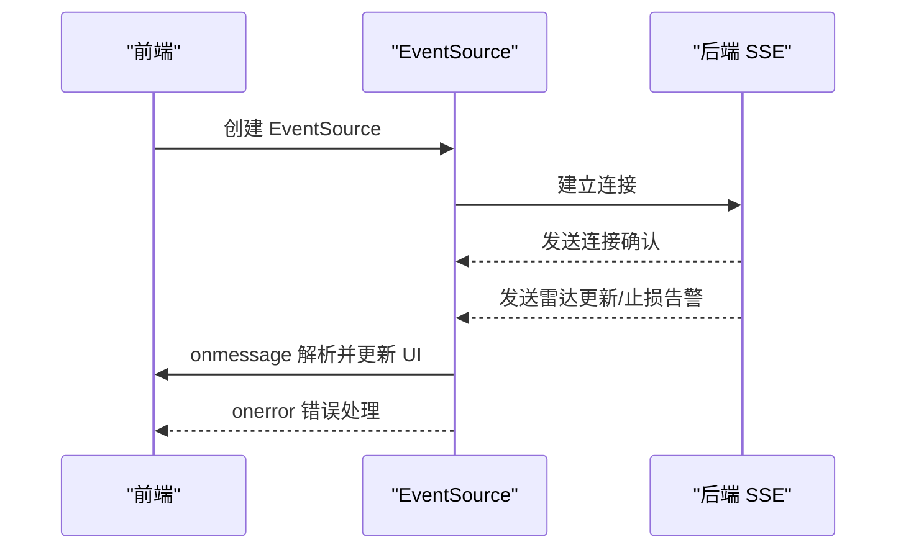
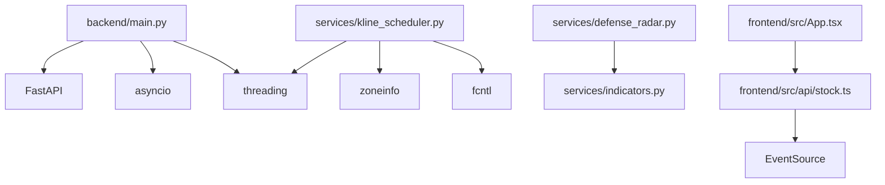

# 实时数据推送系统

<cite>
**本文引用的文件**
- [backend/main.py](file://backend/main.py)
- [backend/services/kline_scheduler.py](file://backend/services/kline_scheduler.py)
- [backend/services/position_manager.py](file://backend/services/position_manager.py)
- [backend/services/defense_radar.py](file://backend/services/defense_radar.py)
- [frontend/src/api/stock.ts](file://frontend/src/api/stock.ts)
- [frontend/src/App.tsx](file://frontend/src/App.tsx)
- [logs/defense_radar/last_summary.json](file://logs/defense_radar/last_summary.json)
- [README.md](file://README.md)
</cite>

## 目录
1. [简介](#简介)
2. [项目结构](#项目结构)
3. [核心组件](#核心组件)
4. [架构概览](#架构概览)
5. [详细组件分析](#详细组件分析)
6. [依赖关系分析](#依赖关系分析)
7. [性能考量](#性能考量)
8. [故障排查指南](#故障排查指南)
9. [结论](#结论)
10. [附录](#附录)

## 简介
本项目是一个基于 Server-Sent Events (SSE) 的实时数据推送系统，用于向前端推送“双防线雷达”更新和“止损告警”。系统采用后端 FastAPI 提供 SSE 端点，定时任务负责生成雷达数据并通过回调广播给 SSE 客户端；前端通过 EventSource 订阅实时更新。系统实现了消息类型与格式、连接管理、心跳维持、线程安全与断线重连等关键机制。

## 项目结构
- 后端：FastAPI 应用、定时任务、雷达计算、持仓管理、SSE 广播
- 前端：React 应用，通过 EventSource 订阅 SSE，渲染雷达摘要与图表
- 数据：本地 CSV 缓存、雷达输出 JSON、持仓持久化 JSON

**图表来源**
- [backend/main.py:229-270](file://backend/main.py#L229-L270)
- [backend/services/kline_scheduler.py:214-259](file://backend/services/kline_scheduler.py#L214-L259)
- [backend/services/defense_radar.py:747-800](file://backend/services/defense_radar.py#L747-L800)
- [frontend/src/api/stock.ts:479-499](file://frontend/src/api/stock.ts#L479-L499)
- [frontend/src/App.tsx:599-800](file://frontend/src/App.tsx#L599-L800)

**章节来源**
- [README.md:33-64](file://README.md#L33-L64)

## 核心组件
- SSE 端点与消息广播：后端提供 `/api/sse/radar-updates`，使用 asyncio.Queue 管理客户端队列，线程安全地向所有在线客户端推送消息。
- 定时任务与回调：定时任务在每个槽位完成后调用回调，将“雷达更新”和“止损告警”推送给 SSE 客户端。
- 前端订阅与渲染：前端通过 EventSource 订阅 SSE，解析消息并更新 UI。
- 雷达摘要与数据源：定时任务生成 `last_summary.json`，前端读取该文件进行渲染。

**章节来源**
- [backend/main.py:229-270](file://backend/main.py#L229-L270)
- [backend/services/kline_scheduler.py:214-259](file://backend/services/kline_scheduler.py#L214-L259)
- [frontend/src/api/stock.ts:479-499](file://frontend/src/api/stock.ts#L479-L499)
- [logs/defense_radar/last_summary.json:1-20](file://logs/defense_radar/last_summary.json#L1-L20)

## 架构概览
系统采用“定时任务驱动 + SSE 实时推送”的架构。定时任务在固定时间点拉取/计算数据，生成雷达摘要并写入本地 JSON；随后通过回调广播消息给所有 SSE 客户端；前端通过 EventSource 订阅实时更新，结合本地 JSON 进行渲染。

**图表来源**
- [backend/services/kline_scheduler.py:214-259](file://backend/services/kline_scheduler.py#L214-L259)
- [backend/main.py:31-82](file://backend/main.py#L31-L82)
- [backend/main.py:229-270](file://backend/main.py#L229-L270)
- [frontend/src/api/stock.ts:479-499](file://frontend/src/api/stock.ts#L479-L499)

## 详细组件分析

### SSE 端点与消息广播
- 端点：`/api/sse/radar-updates`，返回 `text/event-stream`，使用 `StreamingResponse`。
- 客户端队列：每个连接创建一个 `asyncio.Queue`，保存在全局列表中，使用线程锁保护。
- 消息类型：
  - 雷达更新：`{"type": "radar_updated", ...}`，包含时间戳、是否包含日线等信息。
  - 止损告警：`{"type": "stop_loss_triggered", ...}`，包含代码、原因、价格等。
  - 连接确认：`{"type": "connected", ...}`，连接建立时发送。
  - 心跳：`{"type": "heartbeat"}`，超时未收到消息时发送，保持连接活跃。
- 线程安全：通过锁保护客户端列表，使用事件循环的 `call_soon_threadsafe` 将消息放入队列。
- 断线处理：连接取消或异常时，从客户端列表移除。

**图表来源**
- [backend/main.py:229-270](file://backend/main.py#L229-L270)
- [backend/main.py:31-82](file://backend/main.py#L31-L82)

**章节来源**
- [backend/main.py:229-270](file://backend/main.py#L229-L270)
- [backend/main.py:31-82](file://backend/main.py#L31-L82)

### 定时任务与回调机制
- 回调注册：在应用生命周期中设置 SSE 回调，定时任务完成后调用该回调。
- 槽位任务：在 10:31/11:31/14:01/15:01 和 16:01 执行，分别进行 60m 同步、日线同步（16:01）、雷达计算、破位状态与买卖信号计算。
- 广播触发：定时任务完成后调用回调，向所有 SSE 客户端推送“雷达更新”消息。

**图表来源**
- [backend/services/kline_scheduler.py:214-259](file://backend/services/kline_scheduler.py#L214-L259)
- [backend/main.py:94-98](file://backend/main.py#L94-L98)

**章节来源**
- [backend/services/kline_scheduler.py:214-259](file://backend/services/kline_scheduler.py#L214-L259)
- [backend/main.py:94-98](file://backend/main.py#L94-L98)

### 前端订阅与渲染
- 订阅方式：前端通过 `EventSource` 订阅 `/api/sse/radar-updates`，解析 `event.data` 为 JSON 并处理不同类型的消息。
- 渲染策略：前端根据消息类型更新 UI，如雷达更新时刷新摘要、止损告警时弹出提示。
- 断线重连：前端未实现自动重连逻辑，建议在生产环境增加重连策略。

**图表来源**
- [frontend/src/api/stock.ts:479-499](file://frontend/src/api/stock.ts#L479-L499)
- [backend/main.py:229-270](file://backend/main.py#L229-L270)

**章节来源**
- [frontend/src/api/stock.ts:479-499](file://frontend/src/api/stock.ts#L479-L499)

### 雷达摘要与数据源
- 生成流程：定时任务运行雷达计算，生成 Markdown 与 `last_summary.json`。
- 前端读取：前端通过 API 获取摘要，结合本地 JSON 进行渲染。
- 数据一致性：后端与前端的标的配置保持一致，避免前后端配置双源。

**章节来源**
- [backend/services/defense_radar.py:747-800](file://backend/services/defense_radar.py#L747-L800)
- [frontend/src/App.tsx:689-718](file://frontend/src/App.tsx#L689-L718)

## 依赖关系分析
- 后端依赖：FastAPI、asyncio、threading、json、datetime、pathlib、typing。
- 定时任务依赖：zoneinfo、fcntl、threading、time、datetime、json。
- 前端依赖：React、TypeScript、EventSource、fetch 封装。

**图表来源**
- [backend/main.py:1-20](file://backend/main.py#L1-L20)
- [backend/services/kline_scheduler.py:16-36](file://backend/services/kline_scheduler.py#L16-L36)
- [frontend/src/api/stock.ts:114-130](file://frontend/src/api/stock.ts#L114-L130)

**章节来源**
- [backend/main.py:1-20](file://backend/main.py#L1-L20)
- [backend/services/kline_scheduler.py:16-36](file://backend/services/kline_scheduler.py#L16-L36)
- [frontend/src/api/stock.ts:114-130](file://frontend/src/api/stock.ts#L114-L130)

## 性能考量
- 异步与并发：使用 asyncio.Queue 管理消息队列，避免阻塞事件循环；通过线程锁保护客户端列表，确保线程安全。
- 心跳机制：客户端超时未收到消息时发送心跳，防止连接被中间代理断开。
- 缓存与 IO：定时任务依赖本地 CSV 缓存，减少网络 IO；前端通过 `Cache-Control: no-store` 控制缓存行为。
- 扩展性：当前实现为单进程，可通过多进程/多实例部署提升吞吐；SSE 广播采用队列分发，易于水平扩展。

[本节为通用性能讨论，不直接分析具体文件]

## 故障排查指南
- SSE 连接失败：检查后端是否正确设置 SSE 回调，确认定时任务正常运行。
- 消息未到达：确认客户端队列未被异常移除，检查线程锁使用是否正确。
- 前端未收到消息：检查 EventSource 的 onerror 回调，确认网络与跨域配置。
- 雷达摘要为空：确认定时任务是否成功生成 `last_summary.json`，检查文件权限与路径。

**章节来源**
- [backend/main.py:31-82](file://backend/main.py#L31-L82)
- [backend/services/kline_scheduler.py:414-449](file://backend/services/kline_scheduler.py#L414-L449)
- [frontend/src/api/stock.ts:479-499](file://frontend/src/api/stock.ts#L479-L499)

## 结论
本系统通过定时任务与 SSE 实时推送相结合，实现了高效、可靠的实时数据推送。SSE 端点采用队列与线程锁保障线程安全，心跳机制维持连接稳定；前端通过 EventSource 订阅消息并渲染 UI。系统具备良好的扩展性，可通过多实例部署进一步提升性能。

[本节为总结性内容，不直接分析具体文件]

## 附录

### SSE 消息类型与格式
- 雷达更新：`{"type": "radar_updated", "timestamp": "...", "include_daily": true/false, "message": "..."}`。
- 止损告警：`{"type": "stop_loss_triggered", "code": "...", "reason": "...", "price": 0.0, "timestamp": "...", "message": "..."}`。
- 连接确认：`{"type": "connected", "message": "SSE连接已建立"}`。
- 心跳：`{"type": "heartbeat"}`。

**章节来源**
- [backend/main.py:31-54](file://backend/main.py#L31-L54)
- [backend/main.py:240-252](file://backend/main.py#L240-L252)

### 断线重连策略建议
- 前端：在 `onerror` 中实现指数退避重连，设置最大重试次数与超时时间。
- 后端：在客户端断开时清理队列，避免内存泄漏；记录断线统计信息以便监控。

[本节为通用建议，不直接分析具体文件]