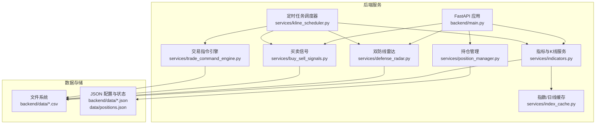
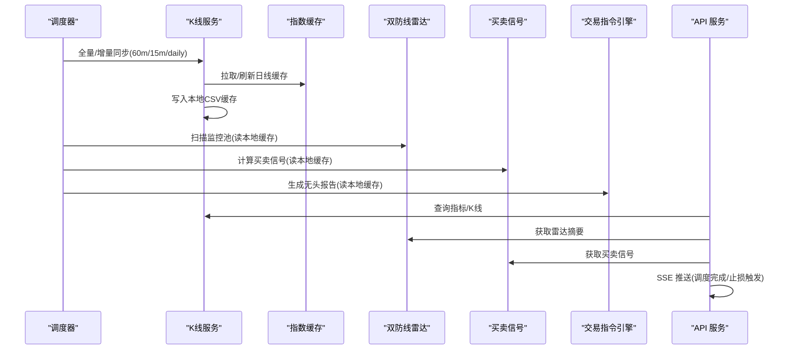
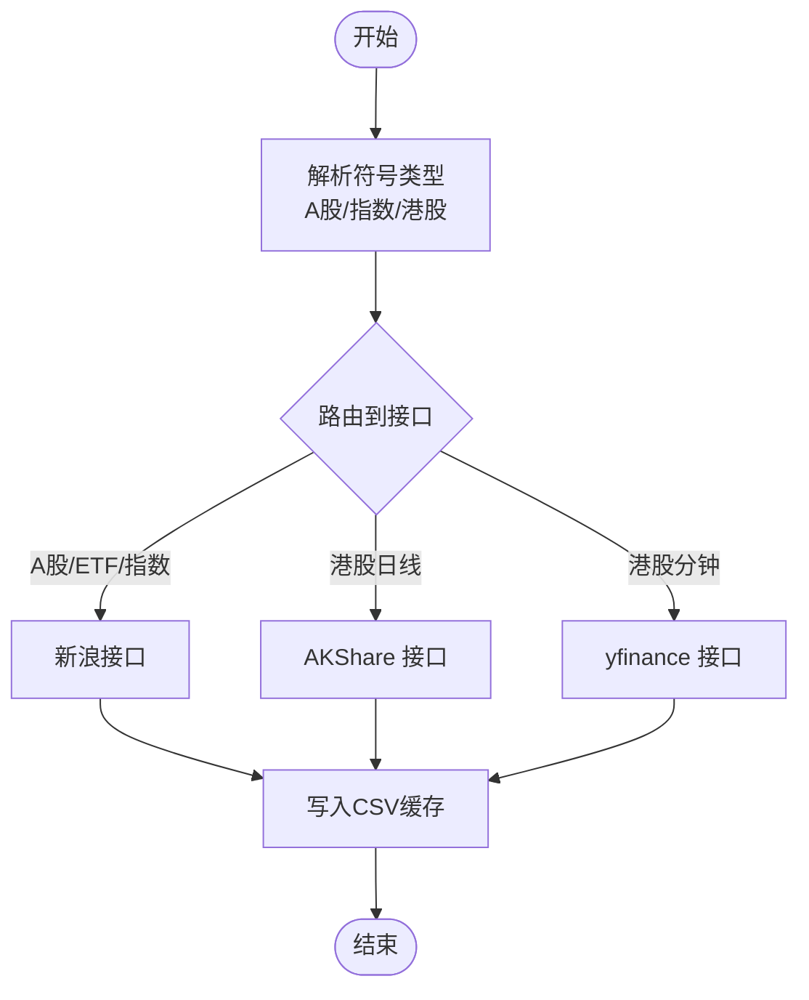
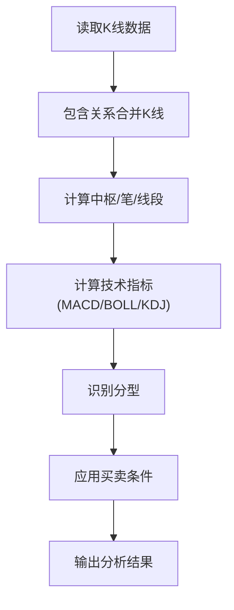
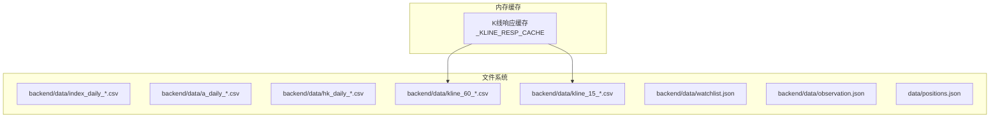
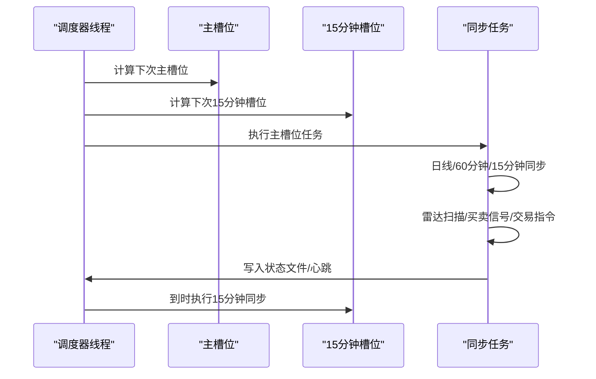
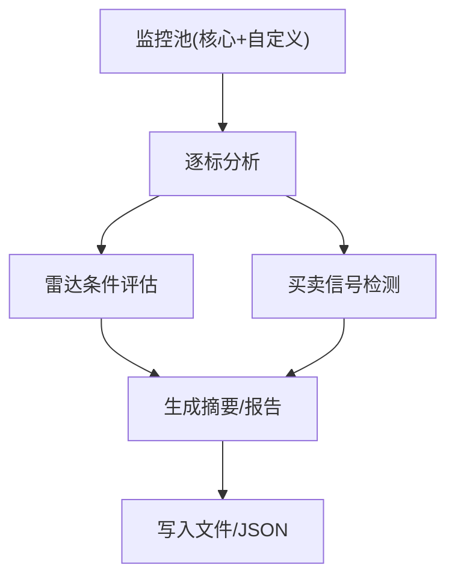
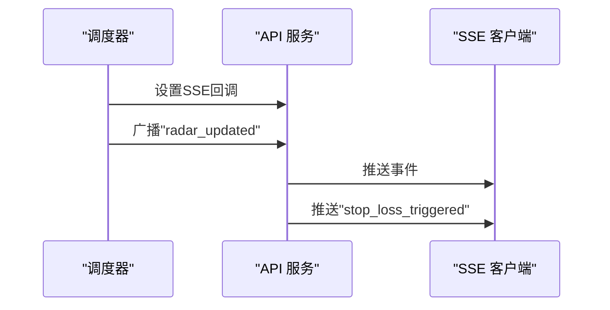
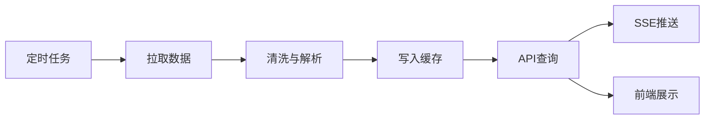
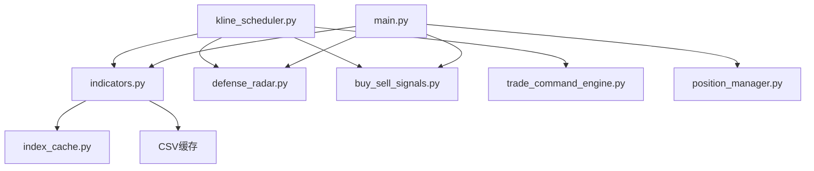

# 数据流架构

<cite>
**本文档引用的文件**
- [backend/main.py](file://backend/main.py)
- [backend/services/indicators.py](file://backend/services/indicators.py)
- [backend/services/index_cache.py](file://backend/services/index_cache.py)
- [backend/services/kline_scheduler.py](file://backend/services/kline_scheduler.py)
- [backend/services/defense_radar.py](file://backend/services/defense_radar.py)
- [backend/services/buy_sell_signals.py](file://backend/services/buy_sell_signals.py)
- [backend/services/trade_command_engine.py](file://backend/services/trade_command_engine.py)
- [backend/services/position_manager.py](file://backend/services/position_manager.py)
- [backend/data/watchlist.json](file://backend/data/watchlist.json)
- [backend/data/observation.json](file://backend/data/observation.json)
- [data/positions.json](file://data/positions.json)
- [backend/update_radar.py](file://backend/update_radar.py)
- [backend/update_radar_local.py](file://backend/update_radar_local.py)
- [backend/run_defense_radar.py](file://backend/run_defense_radar.py)
- [backend/run_trade_command.py](file://backend/run_trade_command.py)
</cite>

## 目录
1. [简介](#简介)
2. [项目结构](#项目结构)
3. [核心组件](#核心组件)
4. [架构总览](#架构总览)
5. [详细组件分析](#详细组件分析)
6. [依赖关系分析](#依赖关系分析)
7. [性能考虑](#性能考虑)
8. [故障排查指南](#故障排查指南)
9. [结论](#结论)
10. [附录](#附录)

## 简介
本项目为一个基于 AkShare 与本地缓存的金融数据流系统，围绕 A 股、指数与港股的 K 线数据，提供指标计算、技术分析、雷达扫描、买卖信号、实时监控与自动化交易指令生成。系统采用“定时任务 + 文件缓存 + 内存响应缓存”的混合架构，确保在高并发与低延迟之间取得平衡。

## 项目结构
后端以 FastAPI 提供 REST API，核心数据流由定时任务驱动，技术分析与指标计算集中在 services 层，数据以 CSV 文件形式持久化到 backend/data 目录，同时在内存中维护短期响应缓存以提升查询性能。

**图表来源**
- [backend/main.py:105-587](file://backend/main.py#L105-L587)
- [backend/services/kline_scheduler.py:1-496](file://backend/services/kline_scheduler.py#L1-L496)
- [backend/services/indicators.py:1-800](file://backend/services/indicators.py#L1-L800)
- [backend/services/index_cache.py:1-201](file://backend/services/index_cache.py#L1-L201)
- [backend/services/defense_radar.py:1-959](file://backend/services/defense_radar.py#L1-L959)
- [backend/services/buy_sell_signals.py:1-955](file://backend/services/buy_sell_signals.py#L1-L955)
- [backend/services/trade_command_engine.py:1-1288](file://backend/services/trade_command_engine.py#L1-L1288)
- [backend/services/position_manager.py:1-210](file://backend/services/position_manager.py#L1-L210)

**章节来源**
- [backend/main.py:105-587](file://backend/main.py#L105-L587)
- [backend/services/kline_scheduler.py:1-496](file://backend/services/kline_scheduler.py#L1-L496)

## 核心组件
- 指数/日线缓存服务：负责从新浪/AKShare 拉取并缓存日线数据，支持强制刷新与锚点时间控制。
- K 线服务：封装 60 分钟、15 分钟与日线的获取逻辑，内置内存响应缓存与本地 CSV 缓存，支持按需刷新。
- 定时任务调度器：按固定时间槽位执行全量/增量同步、雷达扫描、买卖信号计算与交易指令生成。
- 双防线雷达：基于缠论中枢与多条件组合，生成“伏击圈”预警与买卖信号摘要。
- 买卖信号模块：对监控池标的批量计算一买/二买/三买与一卖/二卖/三卖信号。
- 交易指令引擎：基于多级别缠论与风控状态生成无头报告，指导自动化交易。
- 持仓管理：记录与管理用户持仓，支持止损检查与自动清仓，并通过 SSE 推送告警。

**章节来源**
- [backend/services/index_cache.py:1-201](file://backend/services/index_cache.py#L1-L201)
- [backend/services/indicators.py:1-800](file://backend/services/indicators.py#L1-L800)
- [backend/services/kline_scheduler.py:1-496](file://backend/services/kline_scheduler.py#L1-L496)
- [backend/services/defense_radar.py:1-959](file://backend/services/defense_radar.py#L1-L959)
- [backend/services/buy_sell_signals.py:1-955](file://backend/services/buy_sell_signals.py#L1-L955)
- [backend/services/trade_command_engine.py:1-1288](file://backend/services/trade_command_engine.py#L1-L1288)
- [backend/services/position_manager.py:1-210](file://backend/services/position_manager.py#L1-L210)

## 架构总览
系统采用“定时任务驱动 + 文件缓存 + 内存响应缓存”的混合架构。定时任务在固定时间点拉取/刷新数据并写入本地 CSV，随后各服务模块按需读取缓存并进行技术分析与信号计算。API 层提供查询接口与 SSE 实时推送，前端通过 API 与 SSE 获取最新数据。

**图表来源**
- [backend/services/kline_scheduler.py:214-251](file://backend/services/kline_scheduler.py#L214-L251)
- [backend/services/indicators.py:176-249](file://backend/services/indicators.py#L176-L249)
- [backend/services/defense_radar.py:747-800](file://backend/services/defense_radar.py#L747-L800)
- [backend/services/buy_sell_signals.py:581-800](file://backend/services/buy_sell_signals.py#L581-L800)
- [backend/services/trade_command_engine.py:1-1288](file://backend/services/trade_command_engine.py#L1-L1288)
- [backend/main.py:31-82](file://backend/main.py#L31-L82)

## 详细组件分析

### 数据获取与外部集成
- 新浪接口：用于日线与分钟线数据获取，统一返回 JSON，解析后写入 CSV 缓存。
- AKShare 接口：用于港股日线与分钟线数据获取，补充新浪接口能力。
- yfinance 接口：作为港股分钟线数据的备选来源，增强稳定性。
- 符号解析：支持 A 股/ETF、指数、港股等多种代码格式，自动识别并路由到对应接口。

**图表来源**
- [backend/services/indicators.py:489-644](file://backend/services/indicators.py#L489-L644)
- [backend/services/index_cache.py:61-174](file://backend/services/index_cache.py#L61-L174)

**章节来源**
- [backend/services/indicators.py:489-644](file://backend/services/indicators.py#L489-L644)
- [backend/services/index_cache.py:61-174](file://backend/services/index_cache.py#L61-L174)

### 指标计算与技术分析
- 指标计算：包含 MACD、布林带、KDJ 等常用技术指标，支持滚动窗口与指数平滑。
- 缠论中枢：基于包含关系合并 K 线，生成标准化 K 线序列，计算中枢、笔与线段。
- 有效笔与分型：识别向上/向下笔与顶/底分型，用于买卖信号与雷达条件判断。
- 60 分钟与日线联动：日线提供中枢框架，60 分钟提供现价与短期动能，二者共同决定“伏击圈”与买点条件。

**图表来源**
- [backend/services/indicators.py:781-800](file://backend/services/indicators.py#L781-L800)
- [backend/services/defense_radar.py:495-561](file://backend/services/defense_radar.py#L495-L561)

**章节来源**
- [backend/services/indicators.py:657-690](file://backend/services/indicators.py#L657-L690)
- [backend/services/defense_radar.py:495-561](file://backend/services/defense_radar.py#L495-L561)

### 数据存储架构
- 文件存储：backend/data 目录下存放 CSV 缓存（日线、60 分钟、15 分钟），以及 watchlist.json、observation.json 等配置文件。
- 内存缓存：K 线服务维护响应缓存，按 symbol+period+start+end 维度缓存解析后的指标与中枢结果，带 TTL 与容量限制。
- 数据库/状态：positions.json 记录持仓与清仓历史，供止损检查与报表生成使用。

**图表来源**
- [backend/services/indicators.py:90-174](file://backend/services/indicators.py#L90-L174)
- [backend/services/index_cache.py:16-201](file://backend/services/index_cache.py#L16-L201)
- [backend/data/watchlist.json:1-27](file://backend/data/watchlist.json#L1-L27)
- [backend/data/observation.json:1-25](file://backend/data/observation.json#L1-L25)
- [data/positions.json:1-30](file://data/positions.json#L1-L30)

**章节来源**
- [backend/services/indicators.py:90-174](file://backend/services/indicators.py#L90-L174)
- [backend/services/index_cache.py:16-201](file://backend/services/index_cache.py#L16-L201)

### 定时任务与同步机制
- 主槽位：10:31/11:31/14:01/15:01 执行 60 分钟与雷达；16:01 执行日线、60 分钟与雷达。
- 15 分钟槽位：交易时间内每 15 分钟独立同步一次 15 分钟数据。
- 任务链：日线/60 分钟/15 分钟同步 → 持仓止损检查 → 雷达扫描 → 买卖信号 → 交易指令 → SSE 广播。
- 去重与健康检查：通过文件锁确保多进程唯一启动，状态文件记录心跳与下次调度时间。

**图表来源**
- [backend/services/kline_scheduler.py:261-359](file://backend/services/kline_scheduler.py#L261-L359)
- [backend/services/kline_scheduler.py:414-449](file://backend/services/kline_scheduler.py#L414-L449)

**章节来源**
- [backend/services/kline_scheduler.py:261-359](file://backend/services/kline_scheduler.py#L261-L359)
- [backend/services/kline_scheduler.py:414-449](file://backend/services/kline_scheduler.py#L414-L449)

### 双防线雷达与买卖信号
- 雷达条件：绝对防线缓冲带、60 分钟笔向、MACD 转强、蓝三角（底分型+当前向上笔内）、60 分钟中枢内与底背驰等。
- 买卖信号：一买/二买/三买与一卖/二卖/三卖，基于缠论中枢与分型、MACD 动能与时间窗口约束。
- 输出：Markdown 报告与 last_summary.json，供前端快速读取。

**图表来源**
- [backend/services/defense_radar.py:418-429](file://backend/services/defense_radar.py#L418-L429)
- [backend/services/buy_sell_signals.py:581-800](file://backend/services/buy_sell_signals.py#L581-L800)

**章节来源**
- [backend/services/defense_radar.py:418-429](file://backend/services/defense_radar.py#L418-L429)
- [backend/services/buy_sell_signals.py:581-800](file://backend/services/buy_sell_signals.py#L581-L800)

### 实时数据更新与监控
- SSE 推送：调度完成后向所有 SSE 客户端广播“雷达更新”事件；止损触发时推送“清仓告警”。
- 心跳与健康状态：调度器状态文件记录心跳、下次调度时间与槽位计数，便于监控与排障。
- 前端配置：通过 /api/config/symbols 接口合并核心监控列表与用户自定义列表，消除前后端配置双源。

**图表来源**
- [backend/main.py:31-82](file://backend/main.py#L31-L82)
- [backend/services/kline_scheduler.py:252-258](file://backend/services/kline_scheduler.py#L252-L258)

**章节来源**
- [backend/main.py:31-82](file://backend/main.py#L31-L82)
- [backend/services/kline_scheduler.py:252-258](file://backend/services/kline_scheduler.py#L252-L258)

### 数据流图与 ETL 流程
- 数据流图：展示从定时任务触发到文件缓存、API 查询与前端展示的完整路径。
- ETL 流程：数据拉取（新浪/AKShare/yfinance）→ 解析与清洗（包含关系合并、指标计算）→ 缓存写入（CSV/内存）→ API 输出（JSON/SSE）。

**图表来源**
- [backend/services/kline_scheduler.py:214-251](file://backend/services/kline_scheduler.py#L214-L251)
- [backend/services/indicators.py:176-249](file://backend/services/indicators.py#L176-L249)
- [backend/main.py:31-82](file://backend/main.py#L31-L82)

## 依赖关系分析
- 组件耦合：K 线服务与指数缓存服务耦合度较低，通过 CSV 文件解耦；定时任务调度器集中编排各服务。
- 外部依赖：AkShare、新浪、yfinance 等第三方接口，需关注网络波动与接口变更。
- 内存缓存：K 线响应缓存按维度键值存储，避免重复计算；当本地 CSV 更新时自动失效并重算。

**图表来源**
- [backend/services/indicators.py:17-25](file://backend/services/indicators.py#L17-L25)
- [backend/services/kline_scheduler.py:28-31](file://backend/services/kline_scheduler.py#L28-L31)
- [backend/main.py:16-21](file://backend/main.py#L16-L21)

**章节来源**
- [backend/services/indicators.py:17-25](file://backend/services/indicators.py#L17-L25)
- [backend/services/kline_scheduler.py:28-31](file://backend/services/kline_scheduler.py#L28-L31)
- [backend/main.py:16-21](file://backend/main.py#L16-L21)

## 性能考虑
- 缓存策略：本地 CSV 缓存与内存响应缓存双层保护，减少重复网络请求与计算开销。
- 时间窗口限制：交易指令引擎对各级别数据限制约 250 根 K 线，降低计算复杂度。
- 重试与超时：分钟线拉取增加轻量重试，提升网络抖动下的稳定性。
- 增量同步：定时任务按槽位执行增量/全量同步，避免不必要的全量拉取。

**章节来源**
- [backend/services/indicators.py:234-249](file://backend/services/indicators.py#L234-L249)
- [backend/services/trade_command_engine.py:103-116](file://backend/services/trade_command_engine.py#L103-L116)

## 故障排查指南
- 调度器健康：通过 /api/scheduler/status 查询心跳、下次调度时间与槽位计数，判断调度器存活与健康。
- 雷达与信号：使用命令行脚本手动触发雷达与信号计算，验证本地缓存与分析逻辑。
- SSE 连接：SSE 端点 /api/sse/radar-updates 用于调试实时推送，检查客户端队列与心跳。
- 持仓止损：检查 positions.json 与止损逻辑，确认回调推送是否正常。

**章节来源**
- [backend/services/kline_scheduler.py:414-449](file://backend/services/kline_scheduler.py#L414-L449)
- [backend/run_defense_radar.py:1-31](file://backend/run_defense_radar.py#L1-L31)
- [backend/run_trade_command.py:1-24](file://backend/run_trade_command.py#L1-L24)
- [backend/main.py:229-271](file://backend/main.py#L229-L271)
- [backend/services/position_manager.py:139-145](file://backend/services/position_manager.py#L139-L145)

## 结论
本系统通过“定时任务 + 文件缓存 + 内存响应缓存”的架构实现了高效、稳定的金融数据流。外部数据源与本地缓存协同工作，技术分析与信号计算模块化设计，API 与 SSE 提供实时数据与监控能力。建议持续优化缓存命中率与异常处理，加强对外部接口的降级策略与监控告警。

## 附录
- 命令行工具：update_radar.py 与 update_radar_local.py 支持在线/离线雷达计算；run_defense_radar.py 与 run_trade_command.py 提供手动触发能力。
- 配置文件：watchlist.json 与 observation.json 用于维护监控池与观察池；positions.json 记录持仓状态。

**章节来源**
- [backend/update_radar.py:1-47](file://backend/update_radar.py#L1-L47)
- [backend/update_radar_local.py:1-57](file://backend/update_radar_local.py#L1-L57)
- [backend/run_defense_radar.py:1-31](file://backend/run_defense_radar.py#L1-L31)
- [backend/run_trade_command.py:1-24](file://backend/run_trade_command.py#L1-L24)
- [backend/data/watchlist.json:1-27](file://backend/data/watchlist.json#L1-L27)
- [backend/data/observation.json:1-25](file://backend/data/observation.json#L1-L25)
- [data/positions.json:1-30](file://data/positions.json#L1-L30)