# K线调度服务

<cite>
**本文档引用的文件**
- [kline_scheduler.py](file://backend/services/kline_scheduler.py)
- [main.py](file://backend/main.py)
- [indicators.py](file://backend/services/indicators.py)
- [defense_radar.py](file://backend/services/defense_radar.py)
- [buy_sell_signals.py](file://backend/services/buy_sell_signals.py)
- [position_manager.py](file://backend/services/position_manager.py)
- [trade_command_engine.py](file://backend/services/trade_command_engine.py)
- [watchlist.json](file://backend/data/watchlist.json)
- [observation.json](file://backend/data/observation.json)
- [restart_services.sh](file://restart_services.sh)
- [README.md](file://README.md)
</cite>

## 目录
1. [简介](#简介)
2. [项目结构](#项目结构)
3. [核心组件](#核心组件)
4. [架构概览](#架构概览)
5. [详细组件分析](#详细组件分析)
6. [依赖关系分析](#依赖关系分析)
7. [性能考虑](#性能考虑)
8. [故障排除指南](#故障排除指南)
9. [结论](#结论)

## 简介

K线调度服务是金融分析系统的核心后台服务，负责定时执行K线数据同步、技术指标计算和市场监控任务。该服务采用独立线程设计，基于北京时间时区，在指定的交易时段自动执行数据刷新和分析任务。

该服务的主要职责包括：
- **定时数据同步**：在交易时段自动同步日线和60分钟K线数据
- **技术分析计算**：执行双防线雷达、买卖信号检测等分析任务
- **持仓监控**：实时监控持仓止损并执行自动清仓
- **状态管理**：提供调度器健康检查和状态监控功能

## 项目结构

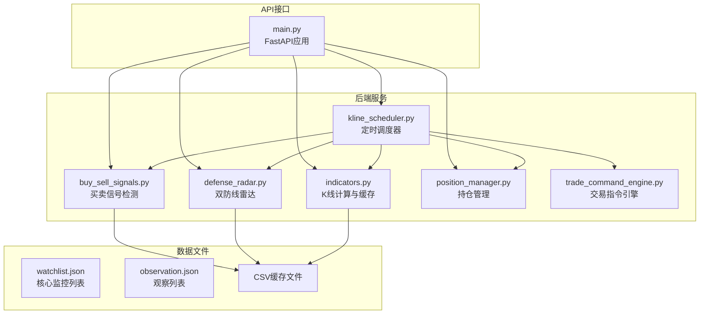

**图表来源**
- [kline_scheduler.py:1-496](file://backend/services/kline_scheduler.py#L1-L496)
- [main.py:1-587](file://backend/main.py#L1-L587)

**章节来源**
- [README.md:33-64](file://README.md#L33-L64)

## 核心组件

### 调度器核心架构

调度器采用独立线程设计，通过文件锁确保多进程环境下的唯一性：

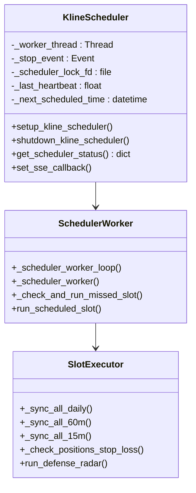

**图表来源**
- [kline_scheduler.py:452-496](file://backend/services/kline_scheduler.py#L452-L496)
- [kline_scheduler.py:289-377](file://backend/services/kline_scheduler.py#L289-L377)

### 数据同步策略

调度器实现了多层次的数据同步机制：

| 同步类型 | 执行频率 | 数据范围 | 触发条件 |
|---------|---------|---------|---------|
| 日线同步 | 每日16:01 | sh000001 + 监控列表 | 主槽位触发 |
| 60分钟同步 | 每15分钟 | sh000001 + 监控列表 | 主槽位或独立槽位 |
| 15分钟同步 | 每交易时段 | 监控列表 | 独立15分钟槽位 |
| 持仓检查 | 每次槽位 | 当前持仓 | 槽位执行 |

**章节来源**
- [kline_scheduler.py:43-49](file://backend/services/kline_scheduler.py#L43-L49)
- [kline_scheduler.py:118-122](file://backend/services/kline_scheduler.py#L118-L122)

## 架构概览

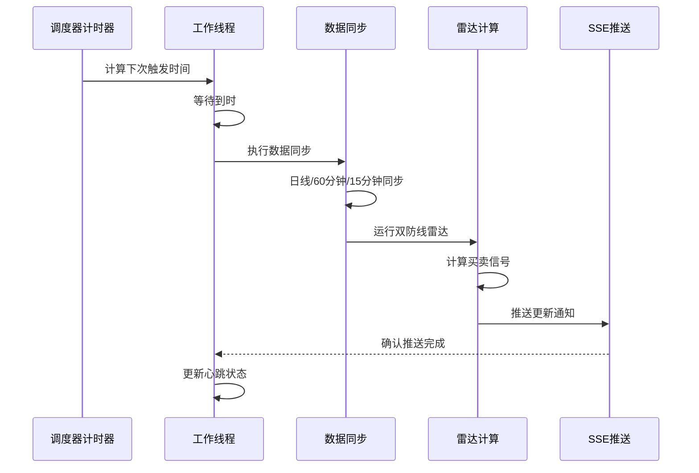

**图表来源**
- [kline_scheduler.py:289-377](file://backend/services/kline_scheduler.py#L289-L377)
- [main.py:31-82](file://backend/main.py#L31-L82)

## 详细组件分析

### 调度器配置与管理

#### 时区与时序管理

调度器使用北京时间Asia/Shanghai时区，确保与A股交易时间同步：

```mermaid
flowchart TD
A[当前时间] --> B[计算候选触发时间]
B --> C[遍历未来14天]
C --> D[检查主槽位(10:31/11:31/14:01/15:01/16:01)]
C --> E[检查15分钟槽位(9:30-15:00)]
D --> F[选择最近的触发时间]
E --> F
F --> G[计算等待秒数]
G --> H[开始等待]
```

**图表来源**
- [kline_scheduler.py:261-287](file://backend/services/kline_scheduler.py#L261-L287)

#### 多进程去重机制

调度器通过文件锁实现多进程环境下的唯一性：

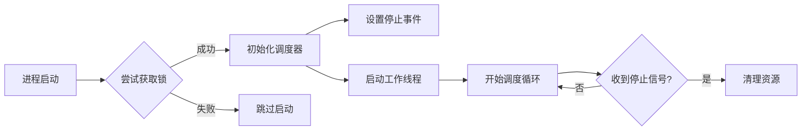

**图表来源**
- [kline_scheduler.py:452-496](file://backend/services/kline_scheduler.py#L452-L496)

**章节来源**
- [kline_scheduler.py:33-54](file://backend/services/kline_scheduler.py#L33-L54)
- [kline_scheduler.py:452-496](file://backend/services/kline_scheduler.py#L452-L496)

### 数据同步流程

#### 增量更新与全量刷新

调度器实现了智能的数据同步策略：

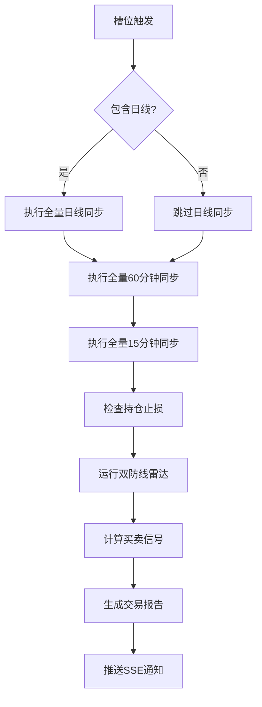

**图表来源**
- [kline_scheduler.py:214-251](file://backend/services/kline_scheduler.py#L214-L251)

#### 同步策略实现

每个同步任务都有明确的实现逻辑：

| 同步类型 | 实现方法 | 时间范围 | 关键参数 |
|---------|---------|---------|---------|
| 日线同步 | `_sync_all_daily()` | 380天前至今 | period="daily", refresh=True |
| 60分钟同步 | `_sync_all_60m()` | 79天前至今 | period="60", refresh=True |
| 15分钟同步 | `_sync_all_15m()` | 30天前至今 | period="15", refresh=True |
| 持仓检查 | `_check_positions_stop_loss()` | 79天前至今 | period="60", refresh=False |

**章节来源**
- [kline_scheduler.py:134-179](file://backend/services/kline_scheduler.py#L134-L179)
- [kline_scheduler.py:181-212](file://backend/services/kline_scheduler.py#L181-L212)

### 任务监控与健康检查

#### 健康状态监控

调度器提供了完整的健康状态监控机制：

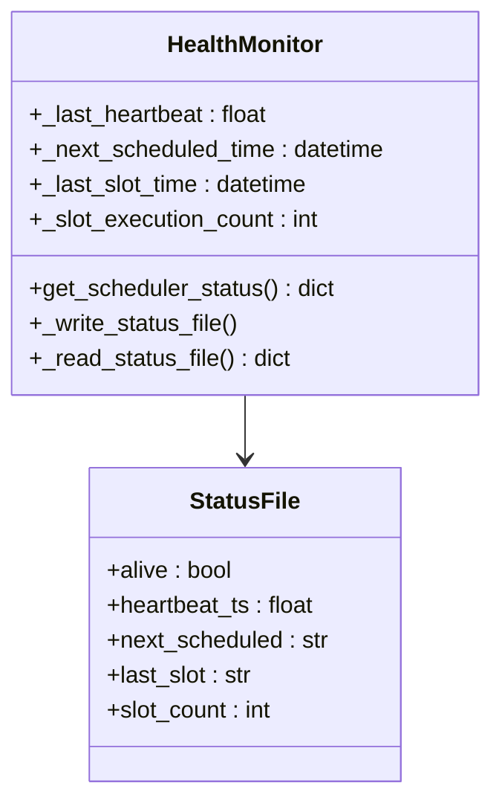

**图表来源**
- [kline_scheduler.py:56-96](file://backend/services/kline_scheduler.py#L56-L96)
- [kline_scheduler.py:414-449](file://backend/services/kline_scheduler.py#L414-L449)

#### 异常处理与自动恢复

调度器实现了多层次的异常处理机制：

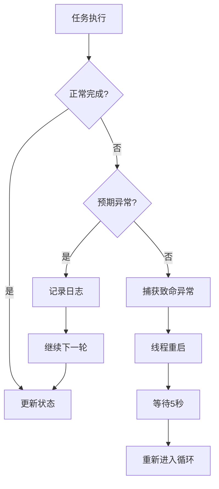

**图表来源**
- [kline_scheduler.py:363-377](file://backend/services/kline_scheduler.py#L363-L377)

**章节来源**
- [kline_scheduler.py:35-36](file://backend/services/kline_scheduler.py#L35-L36)
- [kline_scheduler.py:414-449](file://backend/services/kline_scheduler.py#L414-L449)

### 调度器生命周期管理

#### 启动流程

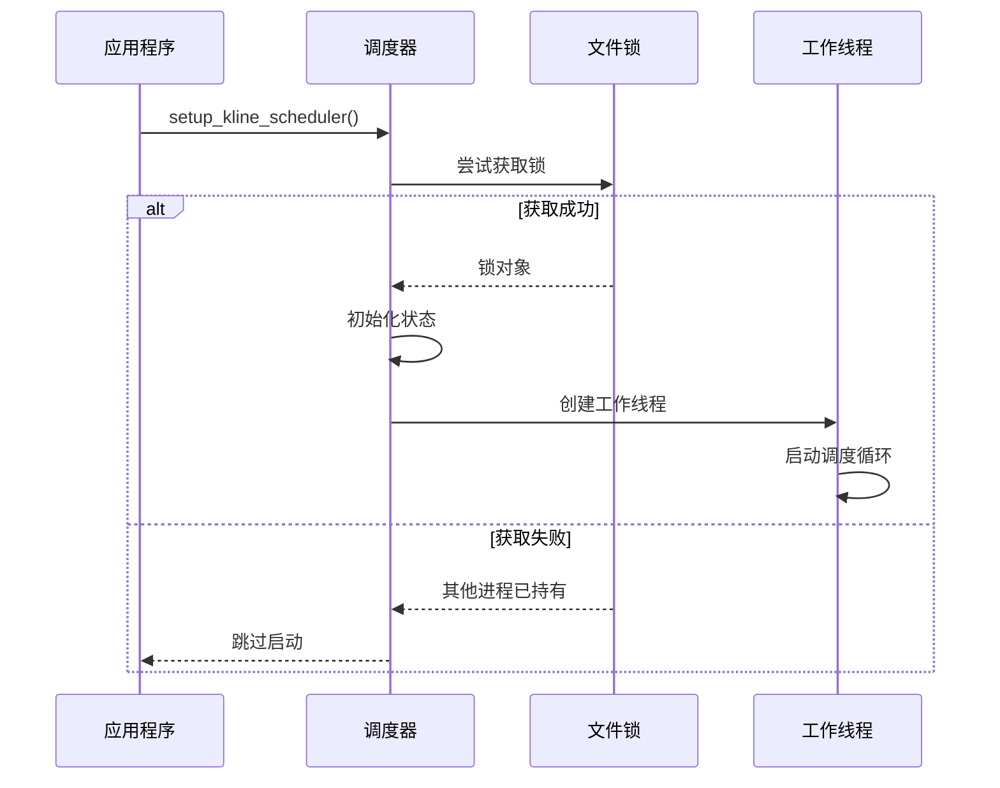

**图表来源**
- [kline_scheduler.py:452-496](file://backend/services/kline_scheduler.py#L452-L496)

#### 停止流程

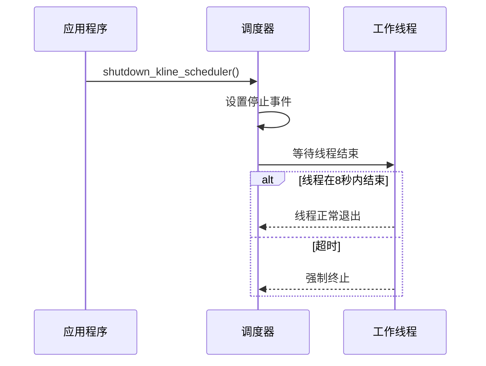

**图表来源**
- [kline_scheduler.py:491-496](file://backend/services/kline_scheduler.py#L491-L496)

**章节来源**
- [kline_scheduler.py:452-496](file://backend/services/kline_scheduler.py#L452-L496)

### 任务优先级与资源分配

#### 优先级管理策略

调度器采用基于时间的优先级策略：

| 时间段 | 优先级 | 任务内容 | 资源分配 |
|--------|--------|----------|----------|
| 10:31/11:31/14:01/15:01 | 高 | 60分钟全量同步 + 雷达计算 | CPU密集型 |
| 16:01 | 最高 | 日线全量同步 + 60分钟全量 + 雷达计算 | I/O密集型 |
| 9:30-15:00 | 中 | 15分钟独立同步 | 轻量级 |

#### 资源分配优化

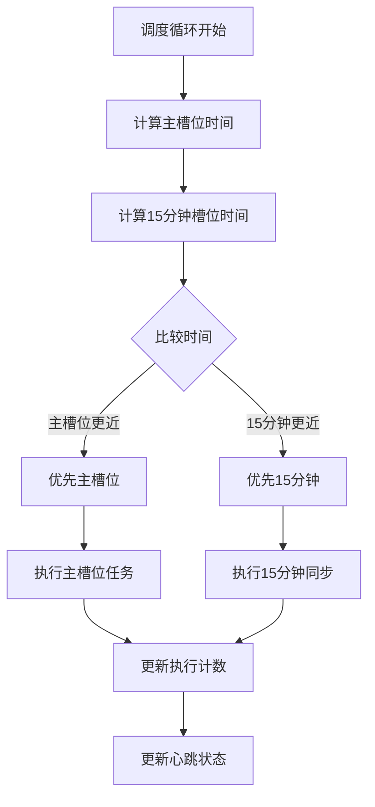

**图表来源**
- [kline_scheduler.py:289-307](file://backend/services/kline_scheduler.py#L289-L307)

**章节来源**
- [kline_scheduler.py:289-307](file://backend/services/kline_scheduler.py#L289-L307)

## 依赖关系分析

### 组件间依赖关系

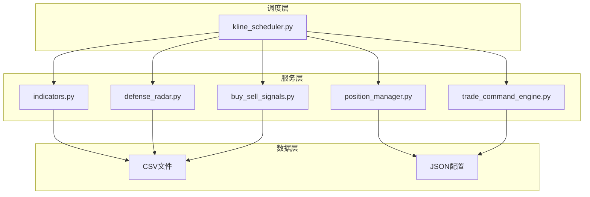

**图表来源**
- [kline_scheduler.py:28-31](file://backend/services/kline_scheduler.py#L28-L31)
- [indicators.py:17-25](file://backend/services/indicators.py#L17-L25)

### 外部依赖

调度器主要依赖以下外部组件：

| 依赖组件 | 版本要求 | 用途 | 配置方式 |
|---------|---------|------|---------|
| Python | 3.9+ | 运行环境 | requirements.txt |
| FastAPI | 最新 | Web框架 | requirements.txt |
| pandas | 最新 | 数据处理 | requirements.txt |
| akshare | 最新 | 数据获取 | requirements.txt |
| requests | 最新 | HTTP请求 | requirements.txt |

**章节来源**
- [README.md:7-14](file://README.md#L7-L14)

## 性能考虑

### 缓存策略

调度器实现了多层次的缓存机制：

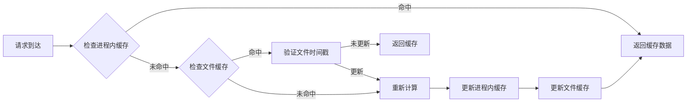

**图表来源**
- [indicators.py:121-138](file://backend/services/indicators.py#L121-L138)
- [indicators.py:149-176](file://backend/services/indicators.py#L149-L176)

### 并发控制

调度器采用线程安全的设计：

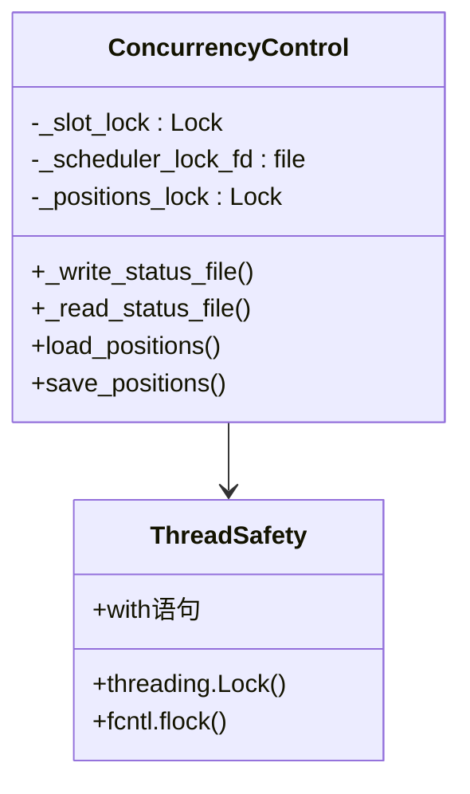

**图表来源**
- [kline_scheduler.py:51-54](file://backend/services/kline_scheduler.py#L51-L54)
- [position_manager.py:24-28](file://backend/services/position_manager.py#L24-L28)

## 故障排除指南

### 常见问题诊断

#### 调度器启动失败

**症状**：调度器无法启动或频繁重启

**可能原因**：
1. 文件锁获取失败（其他进程已启动）
2. 系统时间不正确
3. 权限问题无法创建锁文件

**解决方案**：
```bash
# 检查锁文件状态
ls -la /tmp/kline_scheduler.lock

# 查看进程状态
ps aux | grep kline_scheduler

# 检查日志
tail -f logs/backend_*.log
```

#### 数据同步异常

**症状**：K线数据更新失败或延迟

**可能原因**：
1. 网络连接问题
2. 数据源不可用
3. 文件权限问题

**解决方案**：
```bash
# 手动触发数据同步
python backend/run_defense_radar.py --refresh

# 检查数据文件
ls -la backend/data/kline_60_*.csv

# 验证API可用性
curl -I http://127.0.0.1:8000/api/index/kline?symbol=sh000001&period=daily&refresh=true
```

#### 雷达计算失败

**症状**：双防线雷达无法生成或结果异常

**可能原因**：
1. 60分钟数据缺失
2. 日线数据格式错误
3. 计算参数配置错误

**解决方案**：
```bash
# 检查雷达输出
ls -la logs/defense_radar/

# 手动运行雷达
python backend/run_defense_radar.py

# 查看详细日志
cat logs/defense_radar/defense_radar_*.md
```

### 性能优化建议

#### 调度频率调整

根据系统资源情况调整调度频率：

```python
# 主槽位配置（小时, 分钟, 是否包含日线）
_KLINE_SLOTS = (
    (10, 31, False),  # 10:31 - 60分钟同步
    (11, 31, False),  # 11:31 - 60分钟同步
    (14, 1, False),   # 14:01 - 60分钟同步
    (15, 1, False),   # 15:01 - 60分钟同步
    (16, 1, True),    # 16:01 - 日线+60分钟同步
)
```

#### 内存使用优化

监控和优化内存使用：

```python
# 响应缓存配置
_KLINE_RESP_CACHE_MAX_ITEMS = 256  # 最大缓存项数
_KLINE_RESP_CACHE_TTL_SECONDS = 300  # 缓存过期时间(秒)
```

**章节来源**
- [README.md:255-269](file://README.md#L255-L269)

## 结论

K线调度服务是一个设计精良的后台任务管理系统，具有以下特点：

### 核心优势

1. **可靠性**：多进程去重、异常捕获、自动重启机制确保服务稳定性
2. **高效性**：智能调度、缓存优化、并发控制提升性能
3. **可观测性**：完整的健康监控、状态文件、日志记录
4. **灵活性**：可配置的调度策略、模块化的组件设计

### 技术亮点

- **时区适配**：精确的北京时间处理
- **智能调度**：基于交易时间的动态调度算法
- **数据一致性**：严格的缓存失效机制
- **监控完善**：多维度的健康状态监控

### 改进建议

1. **配置管理**：引入配置文件管理调度参数
2. **性能监控**：增加详细的性能指标收集
3. **错误处理**：增强错误分类和处理策略
4. **扩展性**：支持动态任务注册和管理

该调度服务为整个金融分析系统提供了坚实的基础，确保了数据的及时性和准确性，为用户提供了可靠的决策支持。