# 买卖信号服务

<cite>
**本文档引用的文件**
- [buy_sell_signals.py](file://backend/services/buy_sell_signals.py)
- [indicators.py](file://backend/services/indicators.py)
- [defense_radar.py](file://backend/services/defense_radar.py)
- [first_buy_point.py](file://backend/services/first_buy_point.py)
- [kline_scheduler.py](file://backend/services/kline_scheduler.py)
- [main.py](file://backend/main.py)
- [hourlyBuySellSignals.ts](file://frontend/src/hourlyBuySellSignals.ts)
- [buy_sell_signals.json](file://logs/defense_radar/buy_sell_signals.json)
- [position_manager.py](file://backend/services/position_manager.py)
</cite>

## 目录
1. [简介](#简介)
2. [项目结构](#项目结构)
3. [核心组件](#核心组件)
4. [架构概览](#架构概览)
5. [详细组件分析](#详细组件分析)
6. [依赖关系分析](#依赖关系分析)
7. [性能考虑](#性能考虑)
8. [故障排除指南](#故障排除指南)
9. [结论](#结论)

## 简介

买卖信号服务模块是金融分析系统的核心组件，负责生成和管理买卖信号。该模块基于缠论技术分析理论，结合MACD、布林带等技术指标，为用户提供多维度的买卖决策支持。

系统采用"双防线"设计理念，通过日线和60分钟线的协同分析，确保信号的准确性和可靠性。模块实现了完整的信号生命周期管理，从信号生成、验证、过滤到失效检查和动态调整。

## 项目结构

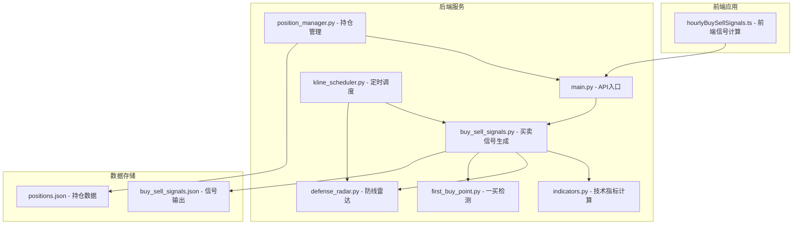

**图表来源**
- [main.py:106-111](file://backend/main.py#L106-L111)
- [buy_sell_signals.py:1-28](file://backend/services/buy_sell_signals.py#L1-L28)
- [indicators.py:1-30](file://backend/services/indicators.py#L1-L30)

**章节来源**
- [main.py:106-111](file://backend/main.py#L106-L111)
- [buy_sell_signals.py:1-28](file://backend/services/buy_sell_signals.py#L1-L28)

## 核心组件

### 买卖信号生成器

买卖信号生成器是系统的核心算法组件，负责检测和验证各类买卖信号：

- **一买信号**：基于趋势底背驰的首次买入机会
- **二买信号**：一买后的回调买入机会
- **三买信号**：突破中枢后的加速买入机会
- **一卖信号**：基于趋势顶背驰的首次卖出机会
- **二卖信号**：一卖后的反弹卖出机会
- **三卖信号**：中枢破位后的加速卖出机会

### 技术指标计算引擎

技术指标计算引擎提供全面的技术分析能力：

- **MACD指标**：包括DIF、DEA和MACD柱状图
- **布林带指标**：标准布林带和扩展布林带
- **KDJ指标**：随机指标的改进版本
- **缠论指标**：中枢、笔、分型的识别和分析

### 防线雷达系统

防线雷达系统提供多维度的风险控制：

- **日线防线**：A-ZD和C-ZD防线的实时监控
- **60分钟防线**：短期趋势的快速反应
- **四条件扳机**：严格的信号触发机制
- **破位状态监控**：实时跟踪破位情况

**章节来源**
- [buy_sell_signals.py:581-886](file://backend/services/buy_sell_signals.py#L581-L886)
- [indicators.py:674-689](file://backend/services/indicators.py#L674-L689)
- [defense_radar.py:1-15](file://backend/services/defense_radar.py#L1-L15)

## 架构概览

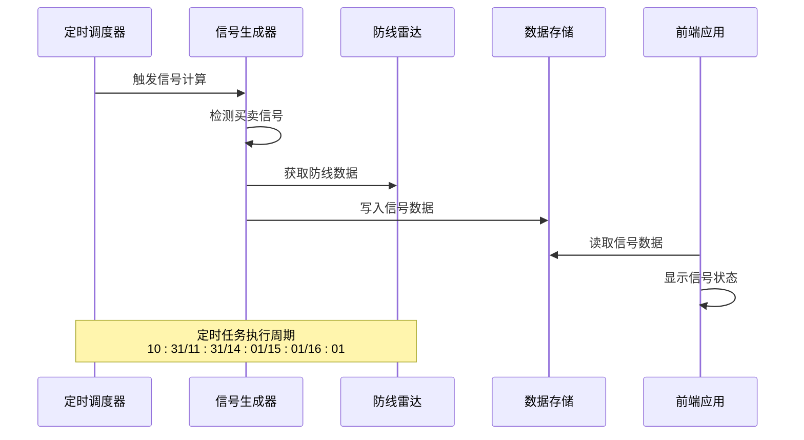

**图表来源**
- [kline_scheduler.py:214-260](file://backend/services/kline_scheduler.py#L214-L260)
- [buy_sell_signals.py:893-942](file://backend/services/buy_sell_signals.py#L893-L942)

系统采用异步架构设计，通过定时任务确保数据的实时性和准确性。后端服务通过RESTful API为前端提供数据接口，支持实时信号推送和状态查询。

## 详细组件分析

### 买卖信号算法详解

#### 一买信号检测算法

一买信号检测基于严格的趋势底背驰定义：

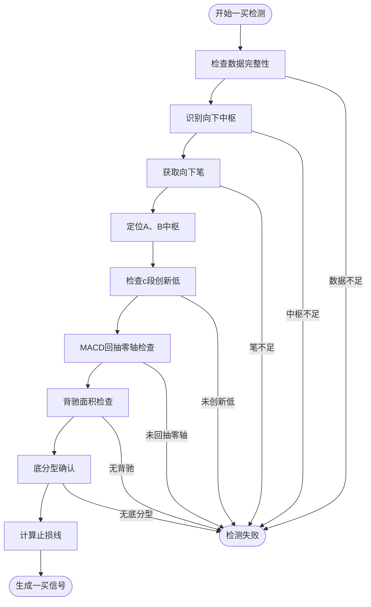

**图表来源**
- [first_buy_point.py:332-511](file://backend/services/first_buy_point.py#L332-L511)

#### 二买信号验证机制

二买信号验证采用多重过滤条件：

| 过滤条件 | 描述 | 验证方式 |
|---------|------|----------|
| 时间窗口 | 一买后60根K线内 | 时间距离检查 |
| 动能衰减 | 回踩绿柱面积缩小 | MACD面积对比 |
| 价格行为 | 回踩不创新低 | 价格水平比较 |
| 形态确认 | 回踩终点底分型 | 分型识别算法 |
| 动能验证 | MACD黄白线上方 | 指标数值检查 |

#### 三买信号突破逻辑

三买信号基于中枢突破的加速买入：

```mermaid
stateDiagram-v2
[*] --> 突破确认
突破确认 --> 洗盘确认
洗盘确认 --> 悬空回踩
悬空回踩 --> 底分型确认
底分型确认 --> 水上漂验证
水上漂验证 --> 止损设置
止损设置 --> 信号生成
信号生成 --> [*]
洗盘确认 -.-> 洗盘失败
悬空回踩 -.-> 悬空失败
底分型确认 -.-> 分型失败
水上漂验证 -.-> 水上漂失败
```

**图表来源**
- [buy_sell_signals.py:569-711](file://backend/services/buy_sell_signals.py#L569-L711)

**章节来源**
- [first_buy_point.py:332-511](file://backend/services/first_buy_point.py#L332-L511)
- [buy_sell_signals.py:426-556](file://backend/services/buy_sell_signals.py#L426-L556)
- [buy_sell_signals.py:569-711](file://backend/services/buy_sell_signals.py#L569-L711)

### 信号过滤与验证机制

#### 多重验证规则

系统实施严格的信号过滤机制：

1. **日线防线过滤**：确保信号在日线防线支撑范围内
2. **MACD动能过滤**：验证信号的市场动能状况
3. **形态学验证**：确认关键转折形态的有效性
4. **时间邻近性检查**：限制信号的时间有效性

#### 互斥机制设计

系统采用状态机设计实现信号互斥：

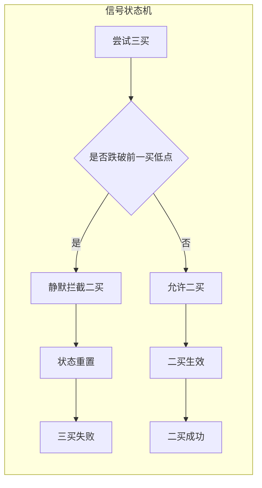

**图表来源**
- [buy_sell_signals.py:854-881](file://backend/services/buy_sell_signals.py#L854-L881)

**章节来源**
- [buy_sell_signals.py:778-886](file://backend/services/buy_sell_signals.py#L778-L886)

### 时效性管理与动态调整

#### 信号时效控制

系统实施严格的信号时效管理：

- **时间窗口限制**：买卖信号有效期为20根K线
- **动态失效检查**：实时监控信号状态变化
- **自动清理机制**：过期信号自动清除
- **状态机递进**：信号状态的有序演进

#### 动态调整策略

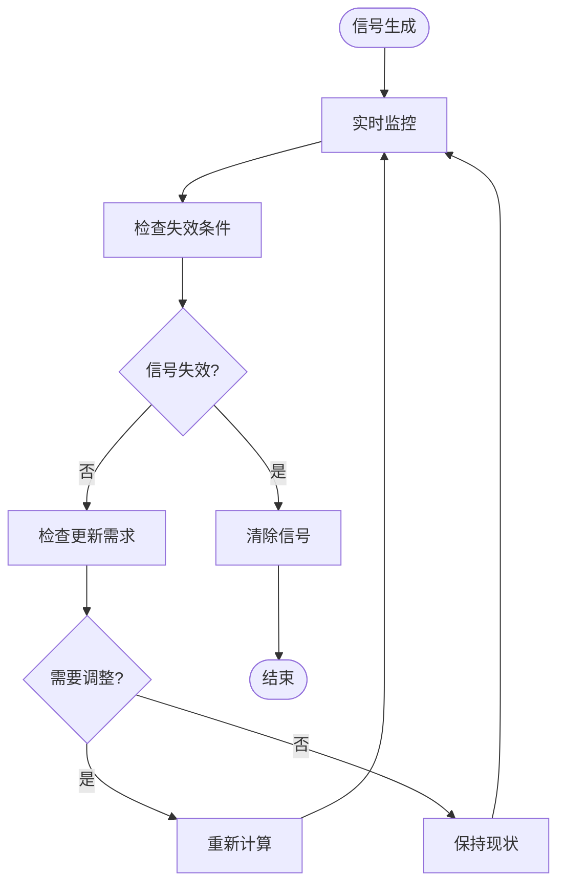

**图表来源**
- [buy_sell_signals.py:791-886](file://backend/services/buy_sell_signals.py#L791-L886)

**章节来源**
- [buy_sell_signals.py:791-886](file://backend/services/buy_sell_signals.py#L791-L886)

### 信号与雷达系统的关联

#### 协同工作机制

买卖信号与防线雷达形成完整的风险管理体系：

| 组件 | 功能 | 输出 |
|------|------|------|
| 防线雷达 | 日线防线监控 | 破位状态、警报信息 |
| 买卖信号 | 60分钟信号生成 | 买卖信号、过滤条件 |
| 协同机制 | 数据共享 | 统一的过滤标准 |

#### 数据同步机制

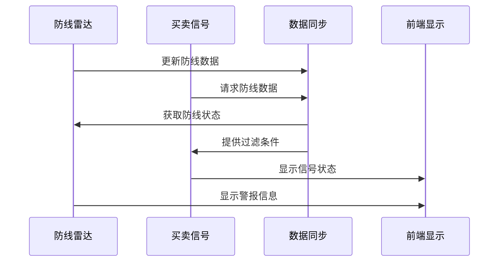

**图表来源**
- [defense_radar.py:683-744](file://backend/services/defense_radar.py#L683-L744)
- [buy_sell_signals.py:686-744](file://backend/services/buy_sell_signals.py#L686-L744)

**章节来源**
- [defense_radar.py:683-744](file://backend/services/defense_radar.py#L683-L744)
- [buy_sell_signals.py:686-744](file://backend/services/buy_sell_signals.py#L686-L744)

### 信号质量评估与回测分析

#### 质量评估指标

系统提供多维度的信号质量评估：

- **成功率统计**：历史信号的盈利概率
- **盈亏比分析**：平均收益与平均损失的比率
- **胜率计算**：盈利信号占总信号的比例
- **回撤评估**：信号后的最大回撤幅度

#### 回测框架设计

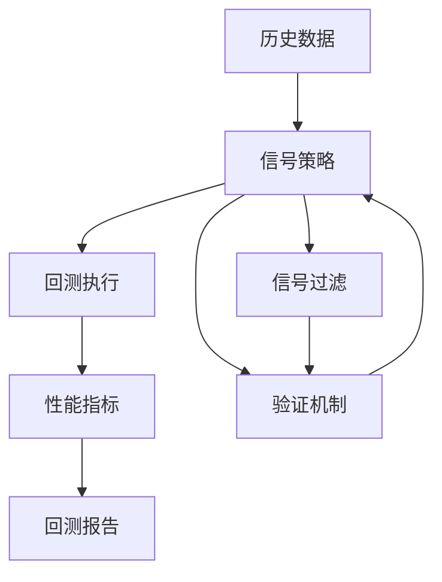

**图表来源**
- [hourlyBuySellSignals.ts:1-100](file://frontend/src/hourlyBuySellSignals.ts#L1-L100)

**章节来源**
- [hourlyBuySellSignals.ts:1-100](file://frontend/src/hourlyBuySellSignals.ts#L1-L100)

### 参数优化与自适应调整

#### 优化方法

系统支持多种参数优化策略：

- **网格搜索**：穷举参数组合寻找最优解
- **遗传算法**：模拟自然选择优化参数
- **贝叶斯优化**：基于历史表现智能选择参数
- **在线学习**：根据实时表现动态调整参数

#### 自适应调整机制

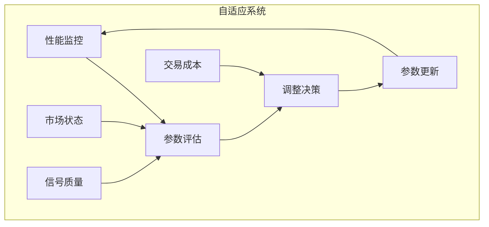

**图表来源**
- [indicators.py:674-689](file://backend/services/indicators.py#L674-L689)

**章节来源**
- [indicators.py:674-689](file://backend/services/indicators.py#L674-L689)

### 信号输出格式与数据结构

#### 输出数据结构

系统采用标准化的数据格式：

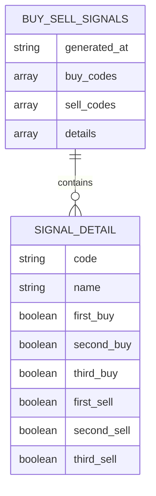

**图表来源**
- [buy_sell_signals.json:1-403](file://logs/defense_radar/buy_sell_signals.json#L1-L403)

#### 前端数据格式

前端采用TypeScript类型定义确保数据一致性：

| 类型 | 字段 | 描述 |
|------|------|------|
| FirstBuyPointSignal | hasSignal, date, price, stopLoss | 一买信号详情 |
| SecondBuyPointSignal | hasSignal, date, price, stopLoss | 二买信号详情 |
| ThirdBuyPointSignal | hasSignal, date, price, stopLoss | 三买信号详情 |
| HourlyBuyConditionFlags | keepDailySupport, inCCentral, switchedDownToUp | 60分钟买点条件 |

**章节来源**
- [buy_sell_signals.json:1-403](file://logs/defense_radar/buy_sell_signals.json#L1-L403)
- [hourlyBuySellSignals.ts:14-148](file://frontend/src/hourlyBuySellSignals.ts#L14-L148)

## 依赖关系分析

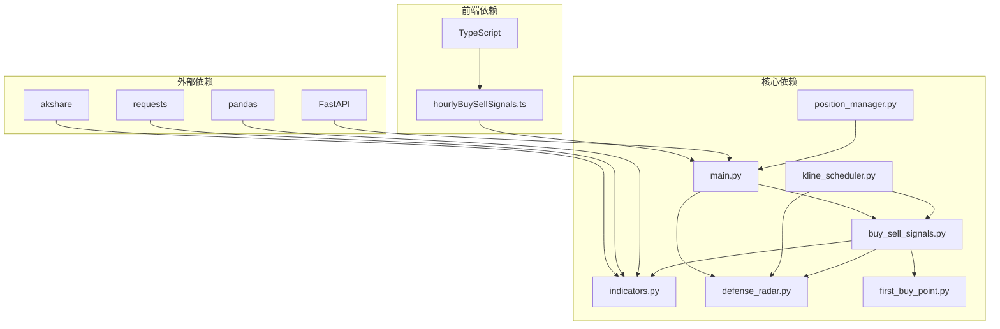

**图表来源**
- [main.py:16-21](file://backend/main.py#L16-L21)
- [buy_sell_signals.py:24-26](file://backend/services/buy_sell_signals.py#L24-L26)

系统采用模块化设计，各组件职责清晰，依赖关系明确。后端服务通过API接口与前端应用解耦，便于维护和扩展。

**章节来源**
- [main.py:16-21](file://backend/main.py#L16-L21)
- [buy_sell_signals.py:24-26](file://backend/services/buy_sell_signals.py#L24-L26)

## 性能考虑

### 缓存策略

系统实施多层次缓存机制：

- **响应缓存**：内存级缓存减少重复计算
- **文件缓存**：本地CSV文件缓存历史数据
- **指数缓存**：针对频繁访问的数据建立缓存
- **TTL管理**：自动过期机制确保数据新鲜度

### 并发处理

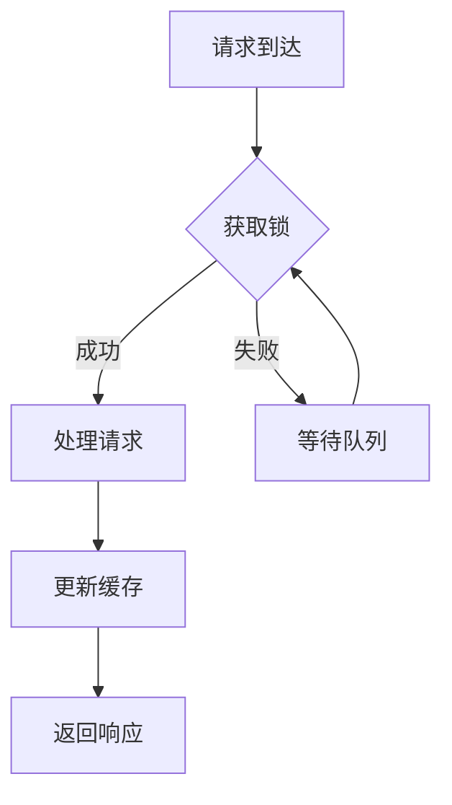

**图表来源**
- [indicators.py:149-176](file://backend/services/indicators.py#L149-L176)

### 性能优化措施

- **懒加载**：按需加载数据减少内存占用
- **批处理**：批量计算提高效率
- **异步处理**：非阻塞操作提升响应速度
- **资源池**：连接池和线程池管理资源

## 故障排除指南

### 常见问题诊断

#### 信号缺失问题

| 问题现象 | 可能原因 | 解决方案 |
|----------|----------|----------|
| 无买卖信号 | 数据不足或格式错误 | 检查数据完整性，重新加载数据 |
| 信号延迟 | 缓存未更新 | 清除缓存，强制刷新数据 |
| 信号不稳定 | 市场波动过大 | 调整过滤参数，增加稳定性 |
| 信号冲突 | 多种信号同时出现 | 检查互斥机制，调整优先级 |

#### 性能问题排查

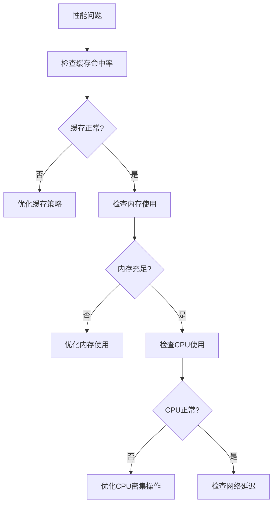

**图表来源**
- [kline_scheduler.py:414-449](file://backend/services/kline_scheduler.py#L414-L449)

### 调试工具

系统提供完善的调试和监控工具：

- **日志系统**：详细的日志记录便于问题追踪
- **状态监控**：实时监控系统运行状态
- **性能分析**：性能瓶颈识别和优化
- **错误报告**：自动化的错误收集和报告

**章节来源**
- [kline_scheduler.py:414-449](file://backend/services/kline_scheduler.py#L414-L449)

## 结论

买卖信号服务模块通过严谨的算法设计和完善的架构实现，为用户提供可靠的买卖信号决策支持。系统采用多维度的技术分析方法，结合严格的风控机制，确保信号的质量和可靠性。

模块的主要优势包括：

1. **算法严谨性**：基于缠论理论的严格信号生成算法
2. **风控完善性**：多层次的信号过滤和验证机制
3. **实时性保障**：定时调度和缓存机制确保数据及时性
4. **可扩展性**：模块化设计便于功能扩展和维护
5. **可视化友好**：清晰的信号输出格式便于前端展示

未来可以进一步优化的方向包括：

- 增强机器学习算法的应用
- 扩展更多技术指标的集成
- 优化移动端的用户体验
- 加强与其他金融系统的集成

通过持续的优化和完善，买卖信号服务模块将成为金融分析领域的重要工具，为投资者提供更加精准和可靠的投资决策支持。