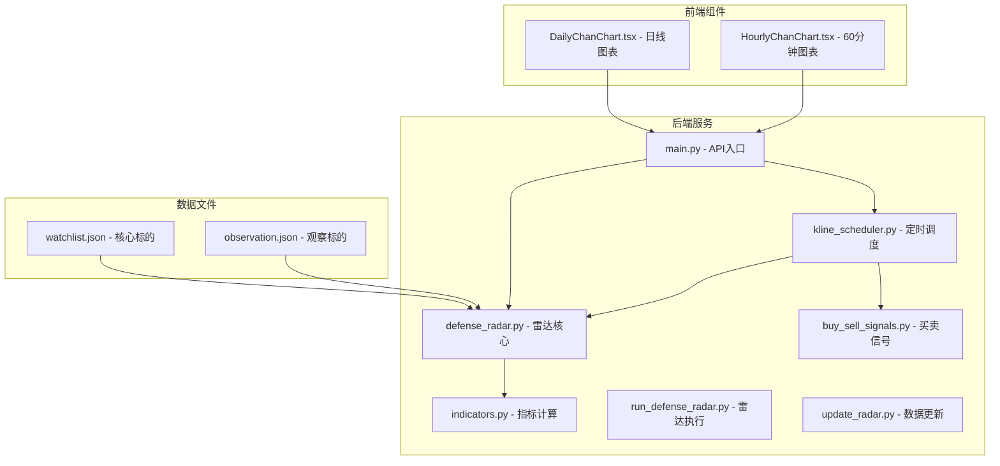
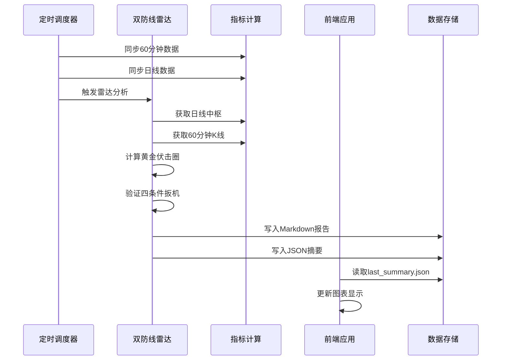
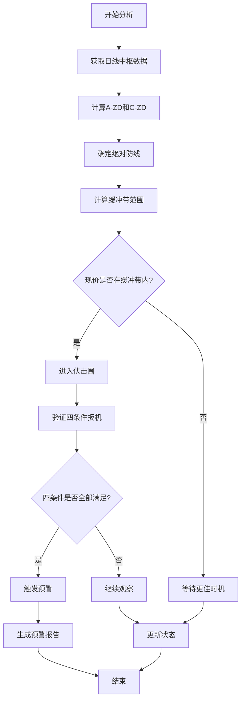
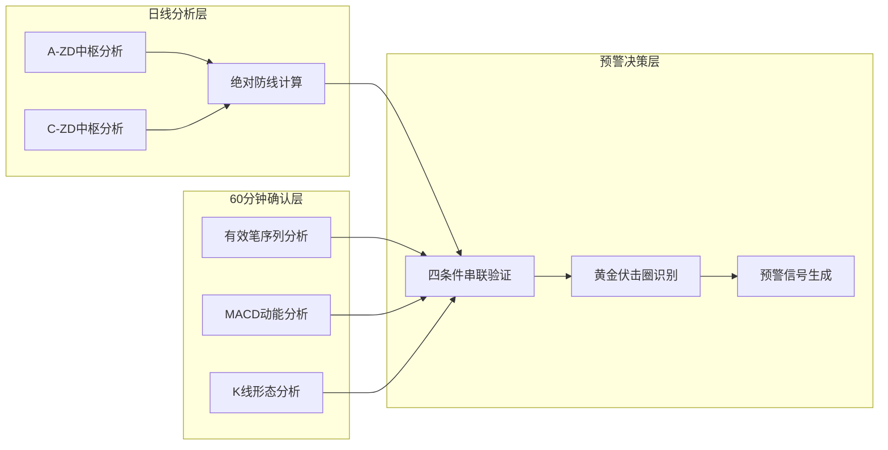
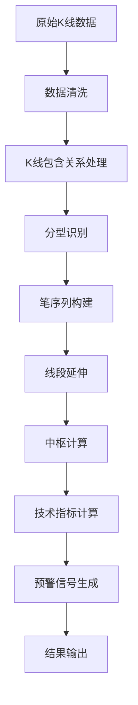
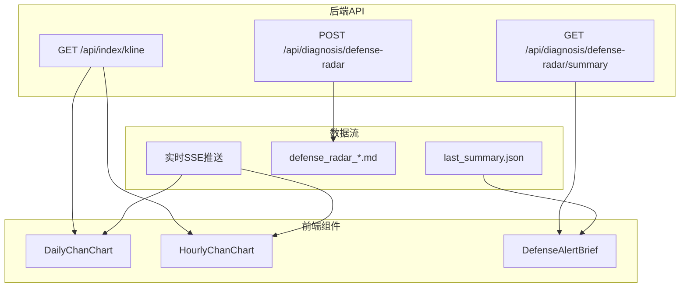
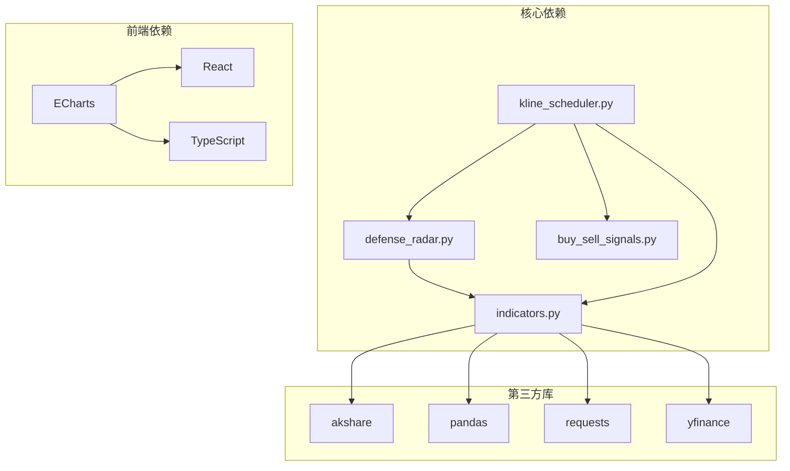

# 双防线雷达服务

<cite>
**本文档引用的文件**
- [defense_radar.py](file://backend/services/defense_radar.py)
- [run_defense_radar.py](file://backend/run_defense_radar.py)
- [update_radar.py](file://backend/update_radar.py)
- [kline_scheduler.py](file://backend/services/kline_scheduler.py)
- [indicators.py](file://backend/services/indicators.py)
- [buy_sell_signals.py](file://backend/services/buy_sell_signals.py)
- [DailyChanChart.tsx](file://frontend/src/DailyChanChart.tsx)
- [HourlyChanChart.tsx](file://frontend/src/HourlyChanChart.tsx)
- [test_defense_radar_trigger.py](file://backend/tests/test_defense_radar_trigger.py)
- [main.py](file://backend/main.py)
- [watchlist.json](file://backend/data/watchlist.json)
- [observation.json](file://backend/data/observation.json)
</cite>

## 目录
1. [项目概述](#项目概述)
2. [项目结构](#项目结构)
3. [核心组件](#核心组件)
4. [架构概览](#架构概览)
5. [详细组件分析](#详细组件分析)
6. [依赖关系分析](#依赖关系分析)
7. [性能考虑](#性能考虑)
8. [故障排除指南](#故障排除指南)
9. [结论](#结论)
10. [附录](#附录)

## 项目概述

双防线雷达服务是一个基于缠论理论的智能预警系统，专门用于识别和跟踪市场中的"黄金伏击圈"机会。该系统通过结合日线和60分钟线的技术分析，为投资者提供精准的买卖时机预警。

### 系统特点

- **双防线理论**：基于A-ZD和C-ZD两条关键防线构建预警体系
- **黄金伏击圈识别**：通过绝对防线±1%缓冲带识别最佳入场时机
- **多级别预警机制**：日线和分钟线协同分析，提供多层次预警信号
- **自动化调度**：基于定时任务的自动化数据更新和预警生成
- **实时可视化**：与前端图表组件无缝集成，提供直观的视觉反馈

## 项目结构

**图表来源**
- [main.py:106-111](file://backend/main.py#L106-L111)
- [defense_radar.py:1-15](file://backend/services/defense_radar.py#L1-L15)
- [kline_scheduler.py:1-14](file://backend/services/kline_scheduler.py#L1-L14)

**章节来源**
- [main.py:106-111](file://backend/main.py#L106-L111)
- [defense_radar.py:1-15](file://backend/services/defense_radar.py#L1-L15)
- [kline_scheduler.py:1-14](file://backend/services/kline_scheduler.py#L1-L14)

## 核心组件

### 雷达核心服务

双防线雷达的核心功能集中在`defense_radar.py`文件中，实现了完整的缠论预警算法：

- **黄金伏击圈识别**：基于绝对防线理论，识别±1%缓冲带内的最佳入场时机
- **四条件扳机**：串联验证伏击带、末笔有效性、MACD动能变化和形态确认
- **多级别协同**：日线中枢分析与60分钟K线确认相结合
- **实时输出**：生成Markdown报告和JSON摘要文件

### 定时调度系统

`kline_scheduler.py`负责整个系统的自动化运行：

- **多时段同步**：10:31/11:31/14:01/15:01执行60分钟数据同步
- **日线刷新**：16:01执行日线和60分钟数据同步
- **雷达执行**：每次同步后自动运行双防线雷达分析
- **状态监控**：提供详细的调度状态和健康检查

### 指标计算引擎

`indicators.py`提供了完整的K线数据处理能力：

- **多数据源支持**：支持新浪、AKShare、yfinance等多种数据源
- **缓存机制**：智能缓存机制减少网络请求频率
- **K线标准化**：统一处理包含关系和缺失数据
- **技术指标**：内置MACD、布林带、KDJ等常用技术指标

**章节来源**
- [defense_radar.py:1-15](file://backend/services/defense_radar.py#L1-L15)
- [kline_scheduler.py:1-14](file://backend/services/kline_scheduler.py#L1-L14)
- [indicators.py:1-25](file://backend/services/indicators.py#L1-L25)

## 架构概览

**图表来源**
- [kline_scheduler.py:214-251](file://backend/services/kline_scheduler.py#L214-L251)
- [defense_radar.py:747-800](file://backend/services/defense_radar.py#L747-L800)
- [main.py:198-207](file://backend/main.py#L198-L207)

系统采用分层架构设计，确保各组件职责清晰、耦合度低：

- **表现层**：前端图表组件负责数据可视化
- **应用层**：FastAPI提供RESTful API接口
- **服务层**：雷达分析、指标计算、调度管理
- **数据层**：本地CSV文件和内存缓存

## 详细组件分析

### 黄金伏击圈识别算法

黄金伏击圈是双防线雷达的核心概念，基于以下理论基础：

**图表来源**
- [defense_radar.py:196-226](file://backend/services/defense_radar.py#L196-L226)
- [defense_radar.py:600-744](file://backend/services/defense_radar.py#L600-L744)

#### 绝对防线计算

系统使用MIN(C-ZD, A-ZD)作为绝对防线基准，其中：
- **A-ZD**：时间序列上第一个中枢的下沿
- **C-ZD**：时间序列上最后一个中枢的下沿
- **缓冲带**：绝对防线价格的±1%范围

#### 四条件扳机验证

1. **伏击带条件**：现价处于绝对防线±1%缓冲带内
2. **末笔有效性**：60分钟有效笔序列末笔向下
3. **MACD动能确认**：MACD绿柱面积缩小或末段绿柱连续缩短
4. **形态确认**：严格底分型配合K3收盘价确认

**章节来源**
- [defense_radar.py:196-226](file://backend/services/defense_radar.py#L196-L226)
- [defense_radar.py:600-744](file://backend/services/defense_radar.py#L600-L744)

### 多级别预警机制

系统采用日线和60分钟线的协同分析模式：

**图表来源**
- [defense_radar.py:683-725](file://backend/services/defense_radar.py#L683-L725)
- [HourlyChanChart.tsx:498-516](file://frontend/src/HourlyChanChart.tsx#L498-L516)

#### 日线中枢分析

日线数据用于识别长期趋势和关键支撑位：
- **A中枢**：时间序列首个中枢，代表早期支撑
- **C中枢**：时间序列末个中枢，代表近期支撑
- **中枢延续性**：通过时间跨度和价格幅度评估中枢有效性

#### 60分钟确认机制

60分钟数据提供短期交易信号：
- **有效笔识别**：过滤噪音，识别真实趋势方向
- **MACD动能**：量化市场动能变化
- **形态确认**：通过K线形态验证突破有效性

**章节来源**
- [defense_radar.py:683-725](file://backend/services/defense_radar.py#L683-L725)
- [HourlyChanChart.tsx:498-516](file://frontend/src/HourlyChanChart.tsx#L498-L516)

### 数据处理流程

系统采用标准化的数据处理流程：

**图表来源**
- [indicators.py:798-820](file://backend/services/indicators.py#L798-L820)
- [defense_radar.py:418-428](file://backend/services/defense_radar.py#L418-L428)

#### K线标准化处理

系统通过以下步骤处理原始K线数据：
1. **包含关系消除**：合并完全包含其他K线的K线
2. **缺口处理**：识别和处理跳空缺口
3. **数据完整性检查**：确保时间序列连续性
4. **异常值检测**：识别和修正异常价格数据

#### 技术指标计算

系统内置多种技术指标：
- **MACD**：衡量市场动能和趋势强度
- **布林带**：评估价格波动性和超买超卖状态
- **KDJ**：短期超买超卖指标
- **缠论指标**：中枢、笔、线段等核心概念

**章节来源**
- [indicators.py:798-820](file://backend/services/indicators.py#L798-L820)
- [defense_radar.py:418-428](file://backend/services/defense_radar.py#L418-L428)

### 前端集成与可视化

前端组件与后端服务紧密集成：

**图表来源**
- [main.py:164-195](file://backend/main.py#L164-L195)
- [main.py:198-207](file://backend/main.py#L198-L207)
- [main.py:216-235](file://backend/main.py#L216-L235)

#### 图表组件设计

前端图表组件提供丰富的可视化功能：
- **日线图表**：显示日线中枢、分型和笔序列
- **60分钟图表**：显示60分钟K线和买卖信号
- **预警提示**：实时显示雷达预警状态
- **交互功能**：支持缩放、标注和数据导出

**章节来源**
- [DailyChanChart.tsx:161-183](file://frontend/src/DailyChanChart.tsx#L161-L183)
- [HourlyChanChart.tsx:179-200](file://frontend/src/HourlyChanChart.tsx#L179-L200)

## 依赖关系分析

**图表来源**
- [indicators.py:12-16](file://backend/services/indicators.py#L12-L16)
- [main.py:12-22](file://backend/main.py#L12-L22)

### 外部依赖管理

系统对外部依赖进行了精心管理：

- **数据源多样性**：支持多个数据源以提高可靠性
- **缓存策略**：智能缓存减少网络请求
- **错误处理**：完善的异常处理机制
- **版本控制**：明确的依赖版本要求

### 内部模块耦合

各模块之间保持适当的耦合度：

- **低耦合高内聚**：每个模块职责明确
- **接口抽象**：通过清晰的接口定义模块边界
- **配置驱动**：通过配置文件管理模块行为
- **测试覆盖**：完整的单元测试确保模块稳定性

**章节来源**
- [indicators.py:12-16](file://backend/services/indicators.py#L12-L16)
- [main.py:12-22](file://backend/main.py#L12-L22)

## 性能考虑

### 缓存优化策略

系统采用了多层次的缓存优化：

1. **内存缓存**：对频繁访问的指标数据进行内存缓存
2. **文件缓存**：将计算结果持久化到本地文件
3. **响应缓存**：对API响应进行缓存控制
4. **数据预加载**：在调度周期开始时预加载必要数据

### 并发处理机制

系统支持并发处理以提高效率：

- **多线程调度**：定时任务使用独立线程运行
- **异步API**：FastAPI支持异步请求处理
- **SSE推送**：实时事件推送机制
- **资源池管理**：数据库连接和网络请求池化

### 内存管理

系统注重内存使用效率：

- **数据分页**：大数据集分页处理
- **惰性计算**：按需计算和缓存
- **垃圾回收**：及时释放不需要的对象
- **内存监控**：定期检查内存使用情况

## 故障排除指南

### 常见问题诊断

#### 数据获取失败

**症状**：雷达分析报错，显示数据获取异常

**排查步骤**：
1. 检查网络连接状态
2. 验证数据源可用性
3. 查看缓存文件完整性
4. 检查API响应格式

**解决方案**：
- 切换备用数据源
- 清理损坏的缓存文件
- 调整网络超时设置
- 重新初始化数据源

#### 计算结果异常

**症状**：雷达输出与预期不符

**排查步骤**：
1. 验证K线数据质量
2. 检查指标计算逻辑
3. 确认参数配置正确
4. 对比历史数据趋势

**解决方案**：
- 重新计算关键指标
- 调整计算参数
- 更新数据源配置
- 检查算法实现

#### 性能问题

**症状**：系统响应缓慢或内存占用过高

**排查步骤**：
1. 监控系统资源使用
2. 分析计算密集型操作
3. 检查缓存命中率
4. 评估并发处理能力

**解决方案**：
- 优化缓存策略
- 实施数据分片
- 调整并发参数
- 升级硬件资源配置

**章节来源**
- [test_defense_radar_trigger.py:1-254](file://backend/tests/test_defense_radar_trigger.py#L1-L254)

### 调试工具使用

系统提供了多种调试工具：

- **单元测试**：针对关键算法的测试用例
- **日志监控**：详细的执行日志和错误信息
- **性能分析**：计算时间和内存使用分析
- **数据验证**：数据完整性和一致性检查

## 结论

双防线雷达服务是一个功能完善、架构合理的智能预警系统。通过深入的缠论理论应用和严谨的算法实现，系统能够准确识别市场中的黄金伏击机会。

### 系统优势

1. **理论基础扎实**：基于成熟的缠论理论框架
2. **实现严谨**：完整的算法实现和充分的测试覆盖
3. **性能优异**：优化的缓存策略和并发处理机制
4. **易于扩展**：模块化的架构设计便于功能扩展
5. **用户体验好**：直观的前端可视化界面

### 技术特色

- **双防线理论**：独特的黄金伏击圈识别机制
- **多级别协同**：日线和60分钟线的有机结合
- **自动化程度高**：完整的定时调度和数据更新机制
- **实时性强**：SSE推送和快速响应机制
- **可配置性好**：灵活的参数设置和阈值调整

该系统为投资者提供了一个可靠的决策辅助工具，通过科学的算法和直观的可视化，帮助用户把握市场机会。

## 附录

### 配置参数说明

#### 核心参数

| 参数名称 | 类型 | 默认值 | 说明 |
|---------|------|--------|------|
| refresh | bool | False | 是否强制从网络获取数据 |
| period | str | "daily" | 数据周期：daily/60/15 |
| start_date | str | 90天前 | 数据开始日期 |
| end_date | str | None | 数据结束日期 |

#### 雷达分析参数

| 参数名称 | 类型 | 默认值 | 说明 |
|---------|------|--------|------|
| buffer_percent | float | 0.01 | 伏击带缓冲百分比 |
| macd_window | int | 9 | MACD计算窗口 |
| bollinger_window | int | 20 | 布林带计算窗口 |

### API接口文档

#### 基础接口

- **GET /api/index/kline**：获取K线数据
- **GET /api/diagnosis/defense-radar/summary**：获取雷达摘要
- **POST /api/diagnosis/defense-radar**：手动触发雷达分析

#### 高级接口

- **GET /api/sse/radar-updates**：实时雷达更新推送
- **GET /api/scheduler/status**：获取调度器状态
- **GET /api/first-buy-point**：获取一买信号

### 扩展指南

#### 自定义策略开发

1. **继承基类**：基于现有算法框架开发新策略
2. **参数配置**：通过配置文件调整策略参数
3. **测试验证**：使用单元测试验证策略有效性
4. **性能优化**：优化算法复杂度和内存使用

#### 阈值设置建议

- **缓冲带宽度**：根据市场波动性调整
- **MACD敏感度**：根据交易风格调整
- **形态确认**：根据品种特性调整
- **时间窗口**：根据交易周期调整

#### 输出格式规范

系统支持多种输出格式：

- **Markdown表格**：用于日志记录和报告生成
- **JSON摘要**：用于API接口和前端展示
- **CSV文件**：用于数据分析和导出
- **SSE实时推送**：用于实时监控和告警